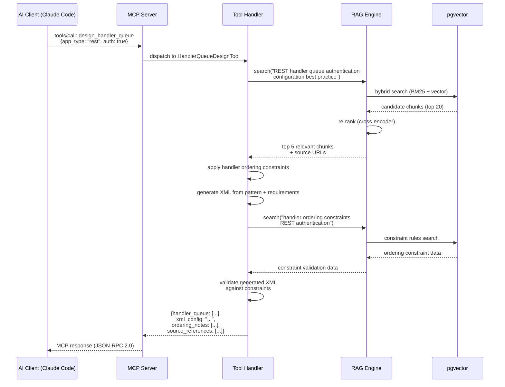
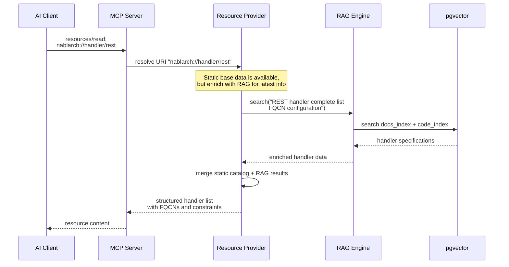

# Nablarch MCP Server — RAG-Enhanced Architecture Design

> **Version**: 2.0 (RAG-enhanced rewrite)
> **Created**: 2026-02-02
> **Parent Task**: subtask_031 (cmd_017)
> **Tech Stack**: Spring Boot 3.x + MCP Java SDK 0.17.x + RAG Pipeline

---

## Table of Contents

1. [System Overview](#1-system-overview)
2. [Architecture Diagram](#2-architecture-diagram)
3. [Component Architecture](#3-component-architecture)
4. [RAG Pipeline Design](#4-rag-pipeline-design)
5. [MCP Primitives Design](#5-mcp-primitives-design)
6. [RAG-MCP Integration Architecture](#6-rag-mcp-integration-architecture)
7. [Technology Stack](#7-technology-stack)
8. [Deployment Architecture](#8-deployment-architecture)
9. [Data Model](#9-data-model)
10. [Security Architecture](#10-security-architecture)
11. [Phased Roadmap](#11-phased-roadmap)

---

## 1. System Overview

### 1.1 What This System Does

The Nablarch MCP Server is a **RAG-enhanced MCP server** that provides Nablarch framework knowledge to AI coding assistants (Claude Code, Cursor, Copilot, VS Code) via the Model Context Protocol (MCP).

It combines:
- **MCP** as the standard interface layer — exposing Tools, Resources, and Prompts to AI clients
- **RAG (Retrieval-Augmented Generation)** as the intelligence layer — enabling semantic search over Nablarch documentation, source code, Javadoc, and XML configurations

### 1.2 Why RAG + MCP

| Approach | Search Quality | AI Tool Integration | Tool Execution | Verdict |
|----------|:-------------:|:------------------:|:--------------:|---------|
| RAG only | Semantic search | No standard interface | Not possible | Knowledge but no tooling |
| MCP only | Keyword/static | Standard protocol | Possible | Tooling but weak search |
| **RAG + MCP** | **Semantic search** | **Standard protocol** | **Possible** | **Best of both** |

Research (arXiv:2505.03275) demonstrates that RAG-enhanced MCP reduces prompt tokens by 75% and improves accuracy by 3x compared to naive MCP tool selection.

### 1.3 Design Principles

1. **RAG inside MCP** — The RAG engine runs inside the MCP server process, not as an external service
2. **Hybrid Search** — Combine BM25 (keyword) + vector similarity for maximum recall
3. **Dual Embedding** — Separate models for documentation (multilingual) and code (Java/XML)
4. **Source Attribution** — Every answer carries source URLs, file paths, or Javadoc links
5. **Phased Delivery** — Start with static knowledge, evolve to full RAG

---

## 2. Architecture Diagram

### 2.1 System-Level Architecture

```
┌──────────────────────────────────────────────────────────────────┐
│                     AI Coding Tools                               │
│   Claude Code  │  Cursor  │  Copilot  │  VS Code  │  Claude Desktop│
│   ┌──────────────────────────────────────────────────────────┐   │
│   │                      MCP Client                           │   │
│   └──────────────────────────┬───────────────────────────────┘   │
└──────────────────────────────┼───────────────────────────────────┘
                               │ JSON-RPC 2.0
                               │ STDIO (local) / Streamable HTTP (remote)
┌──────────────────────────────▼───────────────────────────────────┐
│              Nablarch MCP Server (Spring Boot)                    │
│                                                                   │
│  ┌─────────────────────────────────────────────────────────────┐ │
│  │                   MCP Protocol Layer                         │ │
│  │  ┌────────────┐  ┌─────────────┐  ┌────────────────────┐  │ │
│  │  │   Tools     │  │  Resources  │  │     Prompts        │  │ │
│  │  │ (10 tools)  │  │ (8 types)   │  │  (6 templates)     │  │ │
│  │  └──────┬─────┘  └──────┬──────┘  └─────────┬──────────┘  │ │
│  └─────────┼───────────────┼────────────────────┼─────────────┘ │
│            │               │                    │                │
│  ┌─────────▼───────────────▼────────────────────▼─────────────┐ │
│  │                   RAG Engine (embedded)                      │ │
│  │                                                              │ │
│  │  ┌──────────────┐  ┌───────────────┐  ┌────────────────┐  │ │
│  │  │ Query        │  │ Hybrid Search │  │ Re-ranking     │  │ │
│  │  │ Processor    │→ │ BM25 + Vector │→ │ Cross-Encoder  │  │ │
│  │  └──────────────┘  └───────────────┘  └────────────────┘  │ │
│  │                                                              │ │
│  │  ┌──────────────┐  ┌──────────────┐                        │ │
│  │  │ Doc Embedder │  │ Code Embedder│   Embedding Models     │ │
│  │  │ (Jina v4)    │  │ (Voyage-c3)  │                        │ │
│  │  └──────────────┘  └──────────────┘                        │ │
│  └────────────────────────────┬─────────────────────────────┘   │
│                               │                                  │
│  ┌────────────────────────────▼──────────────────────────────┐  │
│  │              PostgreSQL + pgvector                          │  │
│  │  ┌──────────┐ ┌──────────┐ ┌──────────┐ ┌─────────────┐  │  │
│  │  │ Docs     │ │ Code     │ │ Javadoc  │ │ Config XML  │  │  │
│  │  │ Index    │ │ Index    │ │ Index    │ │ Index       │  │  │
│  │  └──────────┘ └──────────┘ └──────────┘ └─────────────┘  │  │
│  └────────────────────────────────────────────────────────────┘  │
└──────────────────────────────────────────────────────────────────┘
```

### 2.2 Component Diagram

```
┌──────────────────────────────────────────────────────────────────┐
│                    Spring Boot Application                        │
│                                                                   │
│  ┌────────────────────────────────────┐                          │
│  │        Transport Layer              │                          │
│  │  StdioServerTransportProvider       │  ← STDIO (local)        │
│  │  HttpServletStreamableServer...     │  ← HTTP  (remote)       │
│  └───────────────┬────────────────────┘                          │
│                  │                                                │
│  ┌───────────────▼────────────────────┐                          │
│  │        MCP Server Core              │                          │
│  │  McpServer / McpStreamableServer    │  ← MCP Java SDK         │
│  │  Capability Negotiation             │                          │
│  │  Session Management                 │                          │
│  └───────────────┬────────────────────┘                          │
│                  │                                                │
│  ┌───────────────▼────────────────────┐                          │
│  │        Application Layer            │                          │
│  │                                     │                          │
│  │  ┌──────────────────────────────┐  │                          │
│  │  │ Tool Handlers                │  │                          │
│  │  │ • SemanticSearchTool         │  │                          │
│  │  │ • HandlerQueueDesignTool     │  │                          │
│  │  │ • CodeGenerationTool         │  │                          │
│  │  │ • ConfigValidationTool       │  │                          │
│  │  │ • ApiSearchTool              │  │                          │
│  │  │ • TestGenerationTool         │  │                          │
│  │  │ • TroubleshootTool           │  │                          │
│  │  │ • MigrationAnalysisTool      │  │                          │
│  │  │ • PatternRecommendTool       │  │                          │
│  │  │ • HandlerQueueOptimizeTool   │  │                          │
│  │  └──────────────────────────────┘  │                          │
│  │                                     │                          │
│  │  ┌──────────────────────────────┐  │                          │
│  │  │ Resource Providers           │  │                          │
│  │  │ • nablarch://handler/*       │  │                          │
│  │  │ • nablarch://api/*           │  │                          │
│  │  │ • nablarch://pattern/*       │  │                          │
│  │  │ • nablarch://guide/*         │  │                          │
│  │  │ • nablarch://example/*       │  │                          │
│  │  │ • nablarch://config/*        │  │                          │
│  │  │ • nablarch://antipattern/*   │  │                          │
│  │  │ • nablarch://version         │  │                          │
│  │  └──────────────────────────────┘  │                          │
│  │                                     │                          │
│  │  ┌──────────────────────────────┐  │                          │
│  │  │ Prompt Templates             │  │                          │
│  │  │ • setup-handler-queue        │  │                          │
│  │  │ • create-web-app             │  │                          │
│  │  │ • create-rest-api            │  │                          │
│  │  │ • create-batch               │  │                          │
│  │  │ • review-code                │  │                          │
│  │  │ • troubleshoot               │  │                          │
│  │  └──────────────────────────────┘  │                          │
│  └───────────────┬────────────────────┘                          │
│                  │                                                │
│  ┌───────────────▼────────────────────┐                          │
│  │        RAG Engine                   │                          │
│  │  ┌──────────┐ ┌──────────┐        │                          │
│  │  │ Indexer   │ │ Retriever│        │                          │
│  │  └──────────┘ └──────────┘        │                          │
│  │  ┌──────────┐ ┌──────────┐        │                          │
│  │  │ Embedder │ │ Reranker │        │                          │
│  │  └──────────┘ └──────────┘        │                          │
│  └───────────────┬────────────────────┘                          │
│                  │                                                │
│  ┌───────────────▼────────────────────┐                          │
│  │        Data Layer                   │                          │
│  │  PostgreSQL + pgvector              │                          │
│  └─────────────────────────────────────┘                          │
└──────────────────────────────────────────────────────────────────┘
```

---

## 3. Component Architecture

### 3.1 Transport Layer

| Transport | Class | Use Case | Protocol |
|-----------|-------|----------|----------|
| STDIO | `StdioServerTransportProvider` | Local dev (Claude Code, Claude Desktop) | stdin/stdout JSON-RPC 2.0 |
| Streamable HTTP | `HttpServletStreamableServerTransportProvider` | Remote/team server | HTTP POST + SSE |

Both transports are provided by the MCP Java SDK `mcp-core` module (no Spring dependency for core).

### 3.2 MCP Server Core

Built on `McpServer` (sync) or `McpAsyncServer` from the MCP Java SDK. Responsibilities:
- Protocol lifecycle (initialize → operate → shutdown)
- Capability negotiation (advertise supported Tools/Resources/Prompts)
- Session management (`Mcp-Session-Id` for HTTP)
- Batch message handling

### 3.3 Application Layer

Three categories of MCP primitives:

| Category | Count | Control | Description |
|----------|-------|---------|-------------|
| **Tools** | 10 | AI model invokes | Executable functions (search, generate, validate) |
| **Resources** | 8 URI patterns | Application controls | Read-only Nablarch knowledge |
| **Prompts** | 6 templates | User selects | Guided workflow templates |

### 3.4 RAG Engine

Embedded within the Spring Boot process. Components:

| Component | Responsibility | Technology |
|-----------|---------------|------------|
| **Query Processor** | Query analysis, reformulation, routing | Custom Java |
| **Hybrid Search** | BM25 keyword + vector similarity | pgvector + PostgreSQL FTS |
| **Re-ranker** | Score re-ranking of candidate results | Cross-Encoder model |
| **Doc Embedder** | Embed documentation text | Jina embeddings-v4 |
| **Code Embedder** | Embed Java/XML source code | Voyage-code-3 |
| **Indexer** | Ingest, chunk, embed, store documents | Custom pipeline |

### 3.5 Data Layer

PostgreSQL with pgvector extension. Four specialized indexes for different content types with distinct chunking and embedding strategies.

---

## 4. RAG Pipeline Design

### 4.1 Data Ingestion Pipeline

```
┌─────────────────────────────────────────────────────────────┐
│                    Data Sources                               │
│                                                               │
│  ┌──────────────┐ ┌──────────────┐ ┌──────────────────────┐ │
│  │ Official Docs │ │ GitHub Repos │ │ API Javadoc          │ │
│  │ nablarch.     │ │ 113 repos    │ │ nablarch.github.io/  │ │
│  │ github.io     │ │ (nablarch    │ │ docs/*/javadoc/      │ │
│  │               │ │  org)        │ │                      │ │
│  └───────┬──────┘ └───────┬──────┘ └───────────┬──────────┘ │
│          │                │                     │            │
│  ┌──────────────┐ ┌──────────────┐ ┌──────────────────────┐ │
│  │ Fintan       │ │ Config XML   │ │ Dev Standards        │ │
│  │ fintan.jp    │ │ (example     │ │ nablarch-development │ │
│  │ (guides,     │ │  projects)   │ │ -standards           │ │
│  │  standards)  │ │              │ │                      │ │
│  └───────┬──────┘ └───────┬──────┘ └───────────┬──────────┘ │
└──────────┼────────────────┼─────────────────────┼────────────┘
           ▼                ▼                     ▼
┌─────────────────────────────────────────────────────────────┐
│                 Document Processing                          │
│                                                               │
│  ┌────────────┐ ┌────────────┐ ┌────────────┐ ┌───────────┐ │
│  │ HTML Parser │ │ Java Parser│ │ XML Parser │ │ Javadoc   │ │
│  │ (docs,      │ │ (AST-based)│ │ (tag-based)│ │ Parser    │ │
│  │  Fintan)    │ │            │ │            │ │           │ │
│  └──────┬─────┘ └──────┬─────┘ └─────┬──────┘ └─────┬─────┘ │
│         └───────┬──────┴──────┬──────┴───────┬───────┘       │
│                 ▼             ▼              ▼               │
│         ┌─────────────────────────────────────────────┐      │
│         │        Chunking Engine                       │      │
│         │  (content-type-aware strategies)             │      │
│         └────────────────────┬────────────────────────┘      │
└──────────────────────────────┼───────────────────────────────┘
                               ▼
┌─────────────────────────────────────────────────────────────┐
│                  Embedding & Storage                          │
│                                                               │
│  ┌──────────────────┐    ┌──────────────────┐                │
│  │ Doc Embedder      │    │ Code Embedder    │                │
│  │ (Jina v4, 3.8B)  │    │ (Voyage-code-3)  │                │
│  │ 89 languages      │    │ Java/XML focus   │                │
│  │ 32K context       │    │                  │                │
│  └────────┬─────────┘    └────────┬─────────┘                │
│           └──────────┬───────────┘                            │
│                      ▼                                        │
│  ┌───────────────────────────────────────────────────────┐   │
│  │           PostgreSQL + pgvector                        │   │
│  │  ┌──────────┐ ┌──────────┐ ┌────────┐ ┌───────────┐  │   │
│  │  │docs_index│ │code_index│ │jdoc_idx│ │config_idx │  │   │
│  │  │          │ │          │ │        │ │           │  │   │
│  │  │ ~5K docs │ │~20K files│ │~15K cls│ │~500 XMLs  │  │   │
│  │  └──────────┘ └──────────┘ └────────┘ └───────────┘  │   │
│  └───────────────────────────────────────────────────────┘   │
└─────────────────────────────────────────────────────────────┘
```

### 4.2 Chunking Strategy

| Content Type | Strategy | Chunk Size | Overlap | Rationale |
|---|---|---|---|---|
| Official Docs (HTML/RST) | Structure-aware (heading-based) | 512 tokens | 20% | Headings provide natural semantic boundaries |
| Java Source Code | AST-based (class/method unit) | 256–512 tokens | Context prepended | Method boundaries are natural split points |
| XML Config Files | Tag-based (handler/component unit) | 256 tokens | Parent tag context | XML structure provides natural units |
| API Javadoc | Class/method unit | 256 tokens | Package info prepended | 1 method = 1 chunk is ideal |
| Dev Standards (text) | Semantic chunking | 512 tokens | 20% | Loose section structure requires semantic splitting |
| Sample Code | File unit + method split | 512 tokens | File metadata prepended | Full-file context is important for samples |

### 4.3 Metadata Schema

Each chunk carries metadata for filtering, context enrichment, and source attribution:

```json
{
  "source": "nablarch-document | github | fintan | javadoc",
  "source_type": "documentation | code | javadoc | config | standard",
  "nablarch_version": "6u3",
  "module": "nablarch-core-repository",
  "category": "application_framework/libraries/repository",
  "language": "ja | en",
  "app_type": "web | rest | batch | messaging | common",
  "file_path": "src/main/java/nablarch/fw/Handler.java",
  "section_hierarchy": ["Application Framework", "Libraries", "System Repository"],
  "url": "https://nablarch.github.io/docs/LATEST/doc/...",
  "fqcn": "nablarch.fw.Handler"
}
```

### 4.4 Embedding Model Selection

| Model | Use | Parameters | Multilingual | Code | Context | License |
|---|---|---|---|---|---|---|
| **Jina embeddings-v4** | Documentation | 3.8B | 89 languages | Moderate | 32K tokens | OSS |
| **Voyage-code-3** | Java/XML code | — | Yes | Excellent (77.33 CoIR) | — | Commercial |

**Rationale**: Dual-model approach is necessary because Nablarch has extensive Japanese documentation AND Java/XML source code. A single model cannot optimally embed both. Jina v4 outperforms OpenAI text-embedding-3-large by 12% on multilingual search benchmarks.

### 4.5 Vector Database Selection

**Choice**: PostgreSQL + pgvector + pgvectorscale

| Criterion | pgvector | Dedicated VectorDB (Weaviate/Qdrant) |
|-----------|----------|--------------------------------------|
| Cost | Low (reuse existing PostgreSQL) | Additional infrastructure |
| SQL + Vector | Native join queries | Requires external SQL DB |
| ACID | Full ACID compliance | Varies |
| Scale | 50M vectors @ 471 QPS (99% recall) | Higher ceiling |
| Nablarch affinity | High (Nablarch is RDBMS-centric) | Low relevance |
| Maintenance | Single DB to manage | Additional service |

For our scale (~40K chunks), pgvector is more than sufficient and avoids introducing a new data store.

### 4.6 Retrieval Flow

```
┌──────────────────────────────────────────────────────────┐
│                  Retrieval Pipeline                        │
│                                                           │
│  Query: "REST API認証付きハンドラキュー構成"                │
│     │                                                     │
│     ▼                                                     │
│  ┌──────────────────────────────────────┐                │
│  │ 1. Query Analysis                    │                │
│  │    • Detect language (ja)             │                │
│  │    • Classify: code? doc? config?     │                │
│  │    • Extract entities: REST, auth,    │                │
│  │      handler queue                    │                │
│  └───────────────┬──────────────────────┘                │
│                  ▼                                        │
│  ┌──────────────────────────────────────┐                │
│  │ 2. Query Reformulation               │                │
│  │    • Original: "REST API認証付きハンドラ│               │
│  │      キュー構成"                       │                │
│  │    • Expanded: "RESTful Web service    │                │
│  │      handler queue authentication     │                │
│  │      JaxRsResponseHandler"            │                │
│  └───────────────┬──────────────────────┘                │
│                  ▼                                        │
│  ┌──────────────────────────────────────┐                │
│  │ 3. Hybrid Search                     │                │
│  │    • BM25 (keyword): "REST handler   │                │
│  │      queue authentication"            │                │
│  │    • Vector (semantic): embed(query)  │                │
│  │    • Reciprocal Rank Fusion           │                │
│  │    • Filter: app_type = "rest"        │                │
│  └───────────────┬──────────────────────┘                │
│                  ▼                                        │
│  ┌──────────────────────────────────────┐                │
│  │ 4. Re-ranking (Cross-Encoder)        │                │
│  │    • Score each candidate against     │                │
│  │      original query                   │                │
│  │    • Return Top-K (default: 5)        │                │
│  └───────────────┬──────────────────────┘                │
│                  ▼                                        │
│  ┌──────────────────────────────────────┐                │
│  │ 5. Result Formatting                 │                │
│  │    • Structured JSON with source URLs │                │
│  │    • Confidence scores                │                │
│  │    • Section highlights               │                │
│  └──────────────────────────────────────┘                │
└──────────────────────────────────────────────────────────┘
```

---

## 5. MCP Primitives Design

### 5.1 Tools

#### Tool 1: `semantic_search`

| Field | Value |
|-------|-------|
| **Description** | Search Nablarch knowledge base using natural language queries |
| **When** | AI needs Nablarch-specific information not in its training data |

**Input Schema**:
```json
{
  "type": "object",
  "properties": {
    "query": { "type": "string", "description": "Natural language search query" },
    "scope": { "type": "string", "enum": ["all", "docs", "code", "javadoc", "config"], "default": "all" },
    "app_type": { "type": "string", "enum": ["web", "rest", "batch", "messaging", "all"], "default": "all" },
    "top_k": { "type": "integer", "default": 5, "minimum": 1, "maximum": 20 }
  },
  "required": ["query"]
}
```

**Output Schema**:
```json
{
  "results": [
    {
      "content": "string — matched content chunk",
      "source_url": "string — URL or file path",
      "source_type": "string — docs|code|javadoc|config",
      "score": "number — relevance score 0-1",
      "metadata": { "module": "string", "fqcn": "string", "section": "string" }
    }
  ],
  "total_found": "integer",
  "query_analysis": { "language": "string", "entities": ["string"] }
}
```

#### Tool 2: `design_handler_queue`

| Field | Value |
|-------|-------|
| **Description** | Design a handler queue configuration for a given application type and requirements |
| **When** | Developer needs to set up or modify a Nablarch handler queue |

**Input Schema**:
```json
{
  "type": "object",
  "properties": {
    "app_type": { "type": "string", "enum": ["web", "rest", "batch", "resident-batch", "mom-messaging", "http-messaging"] },
    "requirements": {
      "type": "object",
      "properties": {
        "authentication": { "type": "boolean", "default": false },
        "csrf_protection": { "type": "boolean", "default": false },
        "cors": { "type": "boolean", "default": false },
        "file_upload": { "type": "boolean", "default": false },
        "multi_db": { "type": "boolean", "default": false },
        "custom_handlers": { "type": "array", "items": { "type": "string" } }
      }
    }
  },
  "required": ["app_type"]
}
```

**Output Schema**:
```json
{
  "handler_queue": [
    { "order": 1, "name": "string", "fqcn": "string", "role": "string", "thread": "main|sub" }
  ],
  "xml_config": "string — complete XML configuration",
  "ordering_notes": ["string — constraint explanations"],
  "source_references": ["string — documentation URLs"]
}
```

#### Tool 3: `generate_code`

| Field | Value |
|-------|-------|
| **Description** | Generate Nablarch-compliant code (Action, Form, SQL definition, etc.) |
| **When** | Developer needs boilerplate code following Nablarch conventions |

**Input Schema**:
```json
{
  "type": "object",
  "properties": {
    "type": { "type": "string", "enum": ["action", "form", "sql", "entity", "handler", "interceptor"] },
    "name": { "type": "string" },
    "app_type": { "type": "string", "enum": ["web", "rest", "batch"] },
    "specifications": {
      "type": "object",
      "description": "Type-specific parameters (routing path, fields, queries, etc.)"
    }
  },
  "required": ["type", "name"]
}
```

**Output**:
```json
{
  "files": [
    { "path": "string — suggested file path", "content": "string — generated code", "language": "java|xml|sql" }
  ],
  "conventions_applied": ["string — which Nablarch conventions were followed"],
  "dependencies": ["string — required Maven artifacts"]
}
```

#### Tool 4: `validate_config`

| Field | Value |
|-------|-------|
| **Description** | Validate Nablarch XML configuration (handler queue, component definitions) |
| **When** | Developer wants to check correctness of XML config before deployment |

**Input Schema**:
```json
{
  "type": "object",
  "properties": {
    "xml": { "type": "string", "description": "XML configuration content" },
    "config_type": { "type": "string", "enum": ["handler-queue", "component-definition", "routing"] }
  },
  "required": ["xml", "config_type"]
}
```

**Output**:
```json
{
  "valid": "boolean",
  "errors": [{ "line": "integer", "message": "string", "severity": "error|warning" }],
  "suggestions": [{ "message": "string", "fix": "string" }],
  "handler_order_check": { "passed": "boolean", "violations": ["string"] }
}
```

#### Tool 5: `search_api`

| Field | Value |
|-------|-------|
| **Description** | Search Nablarch API by class name, method name, or package |
| **When** | Developer needs Javadoc-level API information |

**Input Schema**:
```json
{
  "type": "object",
  "properties": {
    "query": { "type": "string", "description": "Class name, method name, or keyword" },
    "module": { "type": "string", "description": "Filter by Maven module (e.g., nablarch-core)" }
  },
  "required": ["query"]
}
```

**Output**:
```json
{
  "classes": [
    {
      "fqcn": "string",
      "module": "string",
      "description": "string",
      "methods": [{ "name": "string", "signature": "string", "description": "string" }],
      "javadoc_url": "string",
      "github_url": "string"
    }
  ]
}
```

#### Tool 6: `generate_test`

| Field | Value |
|-------|-------|
| **Description** | Generate test code using Nablarch testing framework (JUnit + Excel test data) |
| **When** | Developer needs test cases for Nablarch components |

**Input Schema**:
```json
{
  "type": "object",
  "properties": {
    "target_class": { "type": "string", "description": "FQCN of the class to test" },
    "test_type": { "type": "string", "enum": ["unit", "request-response", "batch", "messaging"] },
    "format": { "type": "string", "enum": ["junit5", "nablarch-excel"], "default": "junit5" }
  },
  "required": ["target_class", "test_type"]
}
```

#### Tool 7: `troubleshoot`

| Field | Value |
|-------|-------|
| **Description** | Analyze a Nablarch error message and suggest solutions |
| **When** | Developer encounters a Nablarch-specific error |

**Input Schema**:
```json
{
  "type": "object",
  "properties": {
    "error_message": { "type": "string" },
    "stack_trace": { "type": "string" },
    "environment": { "type": "string", "description": "Container/server info" }
  },
  "required": ["error_message"]
}
```

#### Tool 8: `analyze_migration`

| Field | Value |
|-------|-------|
| **Description** | Analyze code for Nablarch version migration (5→6) |
| **When** | Team is migrating a Nablarch project between major versions |

**Input Schema**:
```json
{
  "type": "object",
  "properties": {
    "source_version": { "type": "string", "default": "5" },
    "target_version": { "type": "string", "default": "6" },
    "code_snippet": { "type": "string", "description": "Code to analyze for migration issues" }
  },
  "required": ["code_snippet"]
}
```

#### Tool 9: `recommend_pattern`

| Field | Value |
|-------|-------|
| **Description** | Recommend Nablarch design patterns for a given requirement |
| **When** | Architect needs guidance on Nablarch-specific design decisions |

**Input Schema**:
```json
{
  "type": "object",
  "properties": {
    "requirement": { "type": "string" },
    "app_type": { "type": "string", "enum": ["web", "rest", "batch", "messaging"] },
    "constraints": { "type": "array", "items": { "type": "string" } }
  },
  "required": ["requirement"]
}
```

#### Tool 10: `optimize_handler_queue`

| Field | Value |
|-------|-------|
| **Description** | Analyze an existing handler queue and suggest optimizations |
| **When** | Performance tuning or configuration review |

**Input Schema**:
```json
{
  "type": "object",
  "properties": {
    "current_xml": { "type": "string", "description": "Current handler queue XML" },
    "app_type": { "type": "string" },
    "concern": { "type": "string", "enum": ["performance", "security", "correctness", "all"], "default": "all" }
  },
  "required": ["current_xml"]
}
```

### 5.2 Resources

| Resource URI Pattern | Description | Content Type |
|---|---|---|
| `nablarch://handler/{app_type}` | Handler queue spec for each app type (web, rest, batch, resident-batch, mom-messaging, http-messaging) | JSON (handler list with FQCN, order, constraints) |
| `nablarch://api/{module}/{class}` | API reference for a specific class | JSON (Javadoc-like structured data) |
| `nablarch://pattern/{name}` | Design pattern catalog (e.g., session-management, multi-db, csrf-protection) | Markdown |
| `nablarch://guide/{topic}` | Learning guides (handler-queue, testing, migration-5to6, xml-config) | Markdown |
| `nablarch://example/{type}` | Example code (rest-api, web-crud, batch-db, messaging-mom) | JSON (multiple files) |
| `nablarch://config/{name}` | XML configuration templates (web-component, rest-component, batch-component) | XML |
| `nablarch://antipattern/{name}` | Common anti-patterns and their corrections | Markdown |
| `nablarch://version` | Version info, supported platforms, module list | JSON |

### 5.3 Prompts

| Prompt Name | Description | Arguments |
|---|---|---|
| `setup-handler-queue` | Step-by-step guide for designing a handler queue | `app_type`, `requirements` (auth, csrf, etc.) |
| `create-web-app` | Guide for creating a new Nablarch web application from scratch | `level` (beginner/intermediate/advanced) |
| `create-rest-api` | Guide for creating a RESTful API with Nablarch | `entity_name`, `operations` (CRUD selection) |
| `create-batch` | Guide for creating a batch application | `batch_type` (db-read, file-process, resident) |
| `review-code` | Nablarch coding convention review template | `code`, `aspect` (convention, security, performance) |
| `troubleshoot` | Troubleshooting guide template | `error`, `env` |

---

## 6. RAG-MCP Integration Architecture

### 6.1 Integration Pattern: RAG Inside MCP

The RAG engine is embedded within the MCP server process. When an MCP Tool is called, it internally invokes the RAG engine for knowledge retrieval before generating its response.

```
┌──────────────────────────────────────────────────────────────┐
│                    Integration Flow                           │
│                                                               │
│  MCP Tool Call                                                │
│       │                                                       │
│       ▼                                                       │
│  ┌──────────────────────┐                                    │
│  │ Tool Handler          │                                    │
│  │ (e.g., design_handler │                                    │
│  │  _queue)              │                                    │
│  └──────────┬───────────┘                                    │
│             │                                                 │
│       ┌─────┴─────┐                                          │
│       │           │                                           │
│       ▼           ▼                                           │
│  ┌─────────┐ ┌──────────┐                                   │
│  │ RAG     │ │ Static   │                                    │
│  │ Search  │ │ Knowledge│                                    │
│  └────┬────┘ └────┬─────┘                                    │
│       │           │                                           │
│       └─────┬─────┘                                           │
│             ▼                                                 │
│  ┌──────────────────────┐                                    │
│  │ Result Aggregator     │                                    │
│  │ • Merge RAG results   │                                    │
│  │ • Apply business logic│                                    │
│  │ • Format response     │                                    │
│  │ • Add source URLs     │                                    │
│  └──────────┬───────────┘                                    │
│             │                                                 │
│             ▼                                                 │
│       MCP Response                                            │
└──────────────────────────────────────────────────────────────┘
```

### 6.2 Sequence: Tool Call with RAG



### 6.3 Sequence: Resource Read with RAG



### 6.4 Context Injection Pattern

When the RAG engine returns search results, the MCP server injects them as structured context into the tool's response. This pattern ensures:

1. **Source attribution** — Every piece of information carries its origin URL
2. **Confidence scoring** — Results are ranked by relevance
3. **Metadata filtering** — Results can be filtered by app type, module, version
4. **Fallback** — If RAG returns no results, fall back to static knowledge base

---

## 7. Technology Stack

| Layer | Technology | Version | Rationale |
|---|---|---|---|
| **Language** | Java | 17+ | Nablarch ecosystem consistency |
| **Framework** | Spring Boot | 3.x | MCP Boot Starter support, mature ecosystem |
| **MCP SDK** | MCP Java SDK | 0.17.x | Official SDK, Spring AI integration |
| **Build** | Gradle (Kotlin DSL) | 8.x | Modern build system |
| **Vector DB** | PostgreSQL + pgvector | 16 + 0.8.x | Cost-efficient, SQL+vector, ACID |
| **Doc Embedding** | Jina embeddings-v4 | — | 89 languages, 32K context, OSS |
| **Code Embedding** | Voyage-code-3 | — | Best-in-class Java/XML embedding |
| **Re-ranker** | Cross-Encoder | — | Precision improvement on top of hybrid search |
| **Transport (local)** | STDIO | — | Claude Code / Claude Desktop |
| **Transport (remote)** | Streamable HTTP | — | Team sharing, Docker deployment |
| **Test** | JUnit 5 | — | Standard Java testing |
| **Containerization** | Docker | — | Reproducible deployment |

### 7.1 Key Dependencies

```groovy
// MCP Server
implementation("io.modelcontextprotocol:mcp-spring-webmvc:0.17.x")
// or for STDIO only:
implementation("io.modelcontextprotocol:mcp:0.17.x")

// RAG - Vector DB
implementation("org.postgresql:postgresql:42.x")
implementation("com.pgvector:pgvector-java:0.x")

// RAG - Embedding (HTTP clients to model APIs)
implementation("com.squareup.okhttp3:okhttp:4.x")

// Spring Boot
implementation("org.springframework.boot:spring-boot-starter-web")
implementation("org.springframework.boot:spring-boot-starter-data-jpa")
```

---

## 8. Deployment Architecture

### 8.1 Local Mode (Developer PC)

```
┌─────────────────────────────────────────────────┐
│                Developer PC                      │
│                                                  │
│  ┌──────────────┐    STDIO    ┌──────────────┐  │
│  │ Claude Code / │◄──────────▶│ Nablarch MCP │  │
│  │ Claude Desktop│            │ Server (JAR) │  │
│  └──────────────┘            │              │  │
│                               │  ┌──────────┐│  │
│                               │  │ Embedded  ││  │
│                               │  │ pgvector  ││  │
│                               │  │ (H2+ext)  ││  │
│                               │  └──────────┘│  │
│                               └──────────────┘  │
└─────────────────────────────────────────────────┘
```

**Configuration** (`.claude/mcp.json` or `claude_desktop_config.json`):
```json
{
  "mcpServers": {
    "nablarch": {
      "command": "java",
      "args": ["-jar", "/path/to/nablarch-mcp-server.jar", "--spring.profiles.active=local"]
    }
  }
}
```

### 8.2 Remote Mode (Team Server)

```
┌──────────────────────────────────────────────────────────────┐
│                       Team Server                             │
│                                                               │
│  ┌────────────────────────────────────────────────────────┐  │
│  │                Docker Compose                           │  │
│  │                                                         │  │
│  │  ┌──────────────────┐     ┌──────────────────────┐     │  │
│  │  │ nablarch-mcp     │     │ postgres              │     │  │
│  │  │ (Spring Boot)    │────▶│ (pgvector)            │     │  │
│  │  │ Port: 8080       │     │ Port: 5432            │     │  │
│  │  │                  │     │                       │     │  │
│  │  │ /mcp (HTTP)      │     │ • docs_index          │     │  │
│  │  └──────────────────┘     │ • code_index          │     │  │
│  │         ▲                  │ • javadoc_index       │     │  │
│  │         │                  │ • config_index        │     │  │
│  │         │ Streamable HTTP  └──────────────────────┘     │  │
│  └─────────┼──────────────────────────────────────────────┘  │
│            │                                                  │
└────────────┼──────────────────────────────────────────────────┘
             │
    ┌────────┴────────┐
    │  AI Clients      │
    │  (any developer) │
    └─────────────────┘
```

### 8.3 Docker Compose

```yaml
version: "3.9"
services:
  nablarch-mcp:
    build: .
    ports:
      - "8080:8080"
    environment:
      SPRING_PROFILES_ACTIVE: remote
      SPRING_DATASOURCE_URL: jdbc:postgresql://postgres:5432/nablarch_mcp
      JINA_API_KEY: ${JINA_API_KEY}
      VOYAGE_API_KEY: ${VOYAGE_API_KEY}
    depends_on:
      - postgres

  postgres:
    image: pgvector/pgvector:pg16
    environment:
      POSTGRES_DB: nablarch_mcp
      POSTGRES_USER: nablarch
      POSTGRES_PASSWORD: ${POSTGRES_PASSWORD}
    volumes:
      - pgdata:/var/lib/postgresql/data
    ports:
      - "5432:5432"

volumes:
  pgdata:
```

---

## 9. Data Model

### 9.1 Vector Store Schema

```sql
CREATE EXTENSION IF NOT EXISTS vector;

CREATE TABLE document_chunks (
    id          BIGSERIAL PRIMARY KEY,
    content     TEXT NOT NULL,
    embedding   vector(1024),       -- Jina v4 dimension
    source      VARCHAR(50) NOT NULL,  -- nablarch-document, github, fintan, javadoc
    source_type VARCHAR(20) NOT NULL,  -- documentation, code, javadoc, config, standard
    module      VARCHAR(100),
    app_type    VARCHAR(20),           -- web, rest, batch, messaging, common
    language    VARCHAR(5),            -- ja, en
    fqcn        VARCHAR(300),          -- fully qualified class name
    url         TEXT,                  -- source URL
    file_path   TEXT,
    section_hierarchy TEXT[],
    nablarch_version VARCHAR(10) DEFAULT '6u3',
    created_at  TIMESTAMP DEFAULT NOW(),
    updated_at  TIMESTAMP DEFAULT NOW()
);

CREATE INDEX idx_chunks_embedding ON document_chunks
    USING ivfflat (embedding vector_cosine_ops) WITH (lists = 100);

CREATE INDEX idx_chunks_source ON document_chunks (source);
CREATE INDEX idx_chunks_app_type ON document_chunks (app_type);
CREATE INDEX idx_chunks_module ON document_chunks (module);
CREATE INDEX idx_chunks_fqcn ON document_chunks (fqcn);

-- Full-text search index for BM25-like keyword search
CREATE INDEX idx_chunks_content_fts ON document_chunks
    USING gin(to_tsvector('english', content));
```

### 9.2 Code Index (separate embedding model)

```sql
CREATE TABLE code_chunks (
    id          BIGSERIAL PRIMARY KEY,
    content     TEXT NOT NULL,
    embedding   vector(1024),       -- Voyage-code-3 dimension
    repo        VARCHAR(100) NOT NULL,
    file_path   TEXT NOT NULL,
    fqcn        VARCHAR(300),
    chunk_type  VARCHAR(20),        -- class, method, config, test
    language    VARCHAR(10),        -- java, xml, sql, properties
    module      VARCHAR(100),
    created_at  TIMESTAMP DEFAULT NOW()
);

CREATE INDEX idx_code_embedding ON code_chunks
    USING ivfflat (embedding vector_cosine_ops) WITH (lists = 100);
```

---

## 10. Security Architecture

### 10.1 Transport Security

| Mode | Security | Details |
|------|----------|---------|
| STDIO (local) | Process isolation | Server runs as child process of AI client |
| Streamable HTTP | TLS + Auth | HTTPS required, OAuth 2.0 / API key authentication |

### 10.2 Data Security

- Vector database contains only publicly available Nablarch documentation (OSS, Apache 2.0)
- No customer code or proprietary data is stored in the knowledge base
- API keys for embedding models are stored in environment variables, not in code

### 10.3 MCP Security

- Origin header validation (Streamable HTTP)
- Rate limiting per session
- Read-only tools (no write operations to filesystem or databases)

---

## 11. Phased Roadmap

### Phase 1: MCP Foundation + Static Knowledge

```
Deliverables:
├── Spring Boot MCP server (STDIO transport)
├── Static Resources (handler catalog, patterns, examples)
├── Basic Tools (search_api, validate_config)
├── All 6 Prompt templates
├── Claude Code / Claude Desktop integration test
└── 2 Resource types (handler, guide)

Tech: Spring Boot + MCP Java SDK + static YAML/JSON knowledge files
```

### Phase 2: RAG Engine Integration

```
Deliverables:
├── pgvector setup + schema
├── Document ingestion pipeline (official docs + Fintan)
├── Dual embedding (Jina v4 + Voyage-code-3)
├── semantic_search tool
├── Hybrid search (BM25 + vector)
├── Re-ranking (Cross-Encoder)
├── 4 vector indexes (docs, code, javadoc, config)
└── Search quality evaluation + tuning

Tech: + PostgreSQL/pgvector + embedding model APIs
```

### Phase 3: Full Tool Suite

```
Deliverables:
├── design_handler_queue tool (RAG-powered)
├── generate_code tool (RAG-powered)
├── generate_test tool
├── troubleshoot tool
├── analyze_migration tool
├── recommend_pattern tool
├── optimize_handler_queue tool
├── All 8 Resource URI patterns
└── Integration tests for all tools

Tech: + tool-specific business logic
```

### Phase 4: Production Deployment

```
Deliverables:
├── Streamable HTTP transport
├── Docker Compose deployment
├── OAuth 2.0 authentication
├── API key management
├── Monitoring & logging
├── GitHub ingestion pipeline (113 repos)
├── Javadoc ingestion pipeline
└── Documentation & user guide

Tech: + Docker + auth + monitoring
```

---

## References

### Source Documents
- [O-001] MCP Server Plan — `output/O-001_nablarch_mcp_server_plan.md`
- [O-002] RAG System Plan — `output/O-002_nablarch_rag_system_plan.md`
- [O-005] Official Docs KB — `output/O-005_nablarch_kb_official_docs.md`
- [O-006] Architecture KB — `output/O-006_nablarch_kb_architecture.md`
- [O-022] Feasibility Study — `output/O-022_nablarch_mcp_feasibility_study.md`
- [O-023] RAG-MCP Analysis — `output/O-023_nablarch_rag_mcp_analysis.md`

### External References
- [MCP Specification](https://spec.modelcontextprotocol.io/)
- [MCP Java SDK](https://github.com/modelcontextprotocol/java-sdk)
- [Spring AI MCP](https://docs.spring.io/spring-ai/reference/api/mcp.html)
- [pgvector](https://github.com/pgvector/pgvector)
- [Nablarch Official Docs](https://nablarch.github.io/)
- [RAG-MCP Paper (arXiv:2505.03275)](https://arxiv.org/abs/2505.03275)
