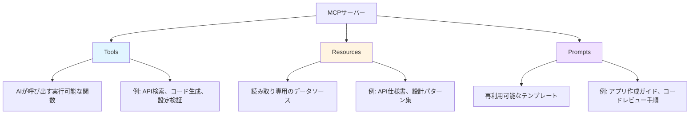
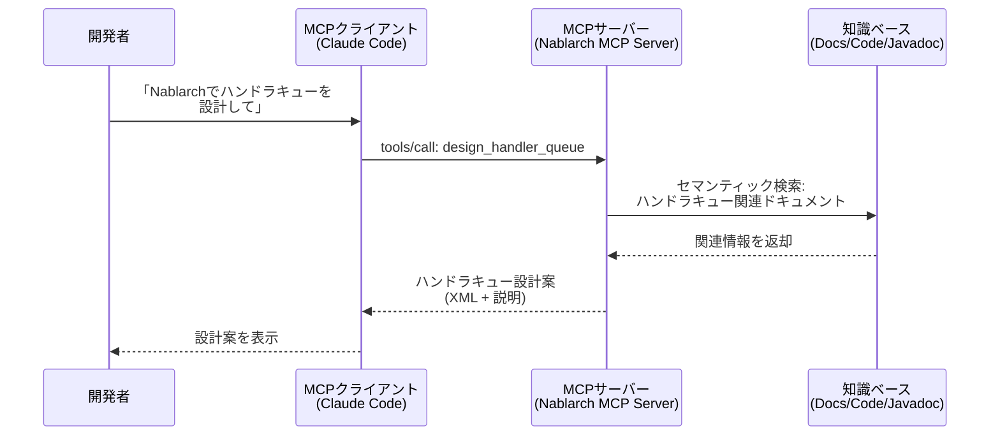

# MCPとは何か — AIコーディングツールの新標準プロトコル

> **シリーズ**: Nablarch MCP Server 専門家育成シリーズ（全17記事）
> **対象読者**: 駆け出しエンジニア、AIコーディングツール初心者
> **想定読了時間**: 10-15分

---

## この記事で学べること

この記事を読むと、以下のことが理解できます。

- **MCP（Model Context Protocol）** とは何か
- AIコーディングツールが抱える「知識不足」の問題
- MCPの3つの基本概念（**Tools**、**Resources**、**Prompts**）
- MCPクライアントとMCPサーバーの関係
- MCPがない世界とある世界の違い

### 前提知識

- AIコーディングツール（Claude Code、GitHub Copilot、Cursor等）を使ったことがある
- プログラミングの基本的な知識（関数、API、JSONの概念）

### 次の記事

この記事を読み終えたら、次は **[02-project-overview.md](02-project-overview.md)** へ進んでください。Nablarch MCP Serverの全体像を学びます。

---

## 1. AIコーディングツールの現状 — 便利だけど限界もある

2024年以降、AIコーディングツールが急速に普及しています。

| ツール | 特徴 |
|--------|------|
| **Claude Code** | CLI型AIコーディングツール。ターミナルから自然言語でコード生成・編集 |
| **GitHub Copilot** | VS Code等のエディタに統合。コード補完・関数生成 |
| **Cursor** | AIファーストなコードエディタ。チャットしながらコーディング |

これらのツールは非常に便利ですが、**ある限界**を抱えています。

---

## 2. AIが「知らないこと」を知らない問題

### 2.1 ハルシネーション（幻覚）

AIは学習データにない情報を求められると、**存在しない情報を自信満々に生成してしまう**ことがあります。これを **ハルシネーション**（幻覚）と呼びます。

```java
// AIに「Nablarchでユーザー認証を実装して」と依頼した結果
// → 実際には存在しないクラスを使ったコードが生成される

public class UserAuthAction {
    // ❌ NablarchAuthenticator は存在しないクラス
    @Inject
    private NablarchAuthenticator authenticator;

    public HttpResponse login(HttpRequest request) {
        // ❌ このAPIは存在しない
        return authenticator.authenticate(request);
    }
}
```

**なぜこうなるのか？**

- AIの学習データにNablarchの情報が非常に少ない（GitHub Stars 42、Qiita記事14件のみ）
- Spring BootやLaravelなど、メインストリームのフレームワークの情報が大量にあるため、それらと混同する
- AIは「知らない」と答えるより、「それらしい答え」を生成してしまう

### 2.2 社内フレームワーク・マイナーツールへの対応不足

Nablarchのような情報が少ないフレームワークだけでなく、以下のような場合にも同じ問題が発生します。

- **社内独自フレームワーク**: 公開情報がないため、AIは全く知らない
- **最新バージョンの仕様**: AIの学習データの期限切れ（例: Nablarch 6.xの新機能）
- **プロジェクト固有の設計パターン**: チーム内のルールや命名規則

**結果**: AIは間違ったコードを生成し、開発者は修正に時間を取られる。

---

## 3. MCPの登場 — AIの知識不足を解決する標準プロトコル

### 3.1 MCP（Model Context Protocol）とは

**MCP（Model Context Protocol）** は、Anthropicが2024年11月に発表した、**AIアプリケーションと外部システムを接続するためのオープン標準プロトコル**です。

| 項目 | 内容 |
|------|------|
| **正式名称** | Model Context Protocol |
| **策定者** | Anthropic（Claude開発元） |
| **発表日** | 2024年11月 |
| **技術基盤** | JSON-RPC 2.0 |
| **標準化団体** | Linux Foundation Agentic AI Foundation |
| **採用企業** | OpenAI、Google DeepMind、Slack、Notion、GitHub等 |

MCPは、**AIが「知らないこと」を外部から教える仕組み**を標準化したものです。

### 3.2 MCPの基本概念 — Tools / Resources / Prompts

MCPサーバーは、AIに対して3種類の機能を提供します。



| 種類 | 制御主体 | 用途 | 具体例（Nablarch MCP Server） |
|------|----------|------|---------------------------|
| **Tools** | AIモデル | AIが呼び出す実行可能な関数 | `semantic_search`（セマンティック検索）<br>`design_handler_queue`（ハンドラキュー設計）<br>`validate_config`（設定XML検証） |
| **Resources** | アプリケーション | 読み取り専用のデータソース | `nablarch://handler/web`（Webハンドラカタログ）<br>`nablarch://api/{module}/{class}`（APIリファレンス）<br>`nablarch://pattern/{name}`（設計パターン） |
| **Prompts** | ユーザー | 再利用可能なテンプレート | `create-web-app`（Webアプリ作成ガイド）<br>`review-code`（コードレビュー手順）<br>`troubleshoot`（トラブルシューティング） |

### 3.3 MCPクライアントとMCPサーバーの関係

MCPは **クライアント・サーバー型** のアーキテクチャです。



| コンポーネント | 役割 | 例 |
|--------------|------|---|
| **MCPクライアント** | AIツール側。MCPサーバーに接続し、Tools/Resources/Promptsを利用する | Claude Code、Cursor、VS Code（拡張機能経由） |
| **MCPサーバー** | 知識・機能を提供する側。JSON-RPCプロトコルでリクエストを処理 | Nablarch MCP Server、Slack MCP Server、GitHub MCP Server |

### 3.4 通信プロトコル — JSON-RPC 2.0

MCPは **JSON-RPC 2.0** をベースにしたプロトコルです。

```json
// MCPクライアント → MCPサーバー（Tool呼び出し）
{
  "jsonrpc": "2.0",
  "id": 1,
  "method": "tools/call",
  "params": {
    "name": "semantic_search",
    "arguments": {
      "query": "Nablarchのハンドラキュー設定方法",
      "category": "handler"
    }
  }
}
```

```json
// MCPサーバー → MCPクライアント（Tool実行結果）
{
  "jsonrpc": "2.0",
  "id": 1,
  "result": {
    "content": [
      {
        "type": "text",
        "text": "ハンドラキューはcomponent-configuration.xmlで定義します..."
      }
    ]
  }
}
```

開発者が直接このJSONを書く必要はありません。MCPクライアント（Claude Code等）が自動的に処理します。

---

## 4. MCPがない世界 vs ある世界 — Before/After

### 4.1 Before: MCPがない世界

```
開発者: 「NablarchでWebアプリを作りたい。ハンドラキューの設定を教えて」

AI: 「わかりました！（※実は知らない）」
    → Spring Bootのフィルタ設定と混同した間違った回答を生成
    → 存在しないクラスを使ったコードを提示

開発者: 「動かない...😞」
    → 公式ドキュメントを自分で探す
    → 数時間かけて修正
```

**問題点**:
- AIは「知らない」と答えず、間違った情報を生成
- 開発者は修正に時間を取られる
- AIの恩恵を受けられない

### 4.2 After: MCPがある世界

```
開発者: 「NablarchでWebアプリを作りたい。ハンドラキューの設定を教えて」

AI: （MCPサーバーに問い合わせ）
    → Nablarch MCP Server の semantic_search Tool を呼び出し
    → 「ハンドラキュー Web」でセマンティック検索
    → 公式ドキュメント・サンプルコード・ベストプラクティスを取得

AI: 「Nablarchでは以下のようにハンドラキューを設定します」
    → 正確なXML設定例を提示
    → 各ハンドラの役割を説明
    → ベストプラクティスも提示

開発者: 「完璧！すぐに動いた！🎉」
```

**メリット**:
- AIは正確な情報に基づいて回答
- 開発者は修正作業が不要
- AIの恩恵を最大限に享受

---

## 5. MCPの実装例 — 様々なMCPサーバー

MCPはオープン標準のため、誰でもMCPサーバーを実装できます。

### 5.1 Nablarch MCP Server（本プロジェクト）

本プロジェクトで構築している、**RAG（Retrieval-Augmented Generation）強化型** のMCPサーバーです。

| 機能 | 内容 |
|------|------|
| **提供Tools** | 10個（セマンティック検索、ハンドラキュー設計、コード生成、設定検証等） |
| **提供Resources** | 8種類（ハンドラカタログ、APIリファレンス、設計パターン等） |
| **提供Prompts** | 6個（Webアプリ作成、コードレビュー、トラブルシューティング等） |
| **知識ソース** | Nablarch公式ドキュメント、GitHub 113リポジトリ、Javadoc、Fintan |
| **検索方式** | ハイブリッド検索（BM25 + ベクトル検索 + リランキング） |

詳細は次の記事 **[02-project-overview.md](02-project-overview.md)** で解説します。

### 5.2 その他のMCPサーバー例

MCPは様々なサービスで採用されています。

| MCPサーバー | 提供元 | 機能 |
|------------|-------|------|
| **Slack MCP Server** | Slack | チャンネル一覧取得、メッセージ投稿、検索 |
| **GitHub MCP Server** | GitHub | リポジトリ操作、Issue管理、PR作成 |
| **Notion MCP Server** | Notion | ページ検索、データベースクエリ、コンテンツ取得 |
| **Filesystem MCP Server** | Anthropic（公式） | ローカルファイルの読み書き |
| **PostgreSQL MCP Server** | Anthropic（公式） | SQLクエリ実行、スキーマ情報取得 |

これらのMCPサーバーを組み合わせることで、AIは様々な外部システムの情報を活用できます。

---

## 6. MCPの技術詳細（興味がある方向け）

### 6.1 トランスポート方式

MCPは2つのトランスポート方式をサポートします。

| 方式 | 用途 | 通信方法 |
|------|------|---------|
| **STDIO** | ローカル開発 | 標準入出力（stdin/stdout）でJSON-RPCメッセージをやり取り |
| **Streamable HTTP** | リモート/チーム共有 | HTTP/SSEでJSON-RPCメッセージをやり取り |

Nablarch MCP Serverは、STDIOおよびStreamable HTTPに対応しています。

### 6.2 MCP SDK

MCPサーバーの実装には、公式SDKを使用できます。

| SDK | 言語 | 提供元 |
|-----|------|-------|
| [MCP TypeScript SDK](https://github.com/modelcontextprotocol/typescript-sdk) | TypeScript/JavaScript | Anthropic（公式） |
| [MCP Python SDK](https://github.com/modelcontextprotocol/python-sdk) | Python | Anthropic（公式） |
| [MCP Java SDK](https://github.com/modelcontextprotocol/java-sdk) | Java | Anthropic（公式）+ Spring AI |

Nablarch MCP Serverは **MCP Java SDK 0.10.x + Spring Boot 3.4.x** で実装されています。

---

## 7. まとめ — MCPはAIの知識不足を解決する標準プロトコル

この記事で学んだこと：

- **MCP（Model Context Protocol）** は、AIアプリケーションと外部システムを接続するオープン標準プロトコル
- AIコーディングツールは便利だが、**知識不足による間違ったコード生成**という限界がある
- MCPは **Tools / Resources / Prompts** という3つの概念でAIに知識・機能を提供
- **MCPクライアント（AI側）** と **MCPサーバー（知識側）** がJSON-RPC 2.0で通信
- MCPがあることで、AIは正確な情報に基づいてコード生成・問題解決ができる

### 次の記事へ

MCPの基本概念が理解できたら、次は **Nablarch MCP Server** の全体像を学びましょう。

👉 **[02-project-overview.md](02-project-overview.md)** — Nablarch MCP Server プロジェクト概要

このプロジェクトがどのようにMCPとRAGを組み合わせているのか、どのような機能を提供するのかを詳しく解説します。

---

## 参考リンク

- [MCP公式サイト](https://modelcontextprotocol.io/)
- [MCP仕様書（2025-03-26）](https://modelcontextprotocol.io/specification/2025-03-26)
- [MCP Java SDK（GitHub）](https://github.com/modelcontextprotocol/java-sdk)
- [Spring AI MCP ドキュメント](https://docs.spring.io/spring-ai-mcp/reference/mcp.html)

---

**執筆**: Nablarch MCP Server プロジェクト
**更新日**: 2026-02-07
