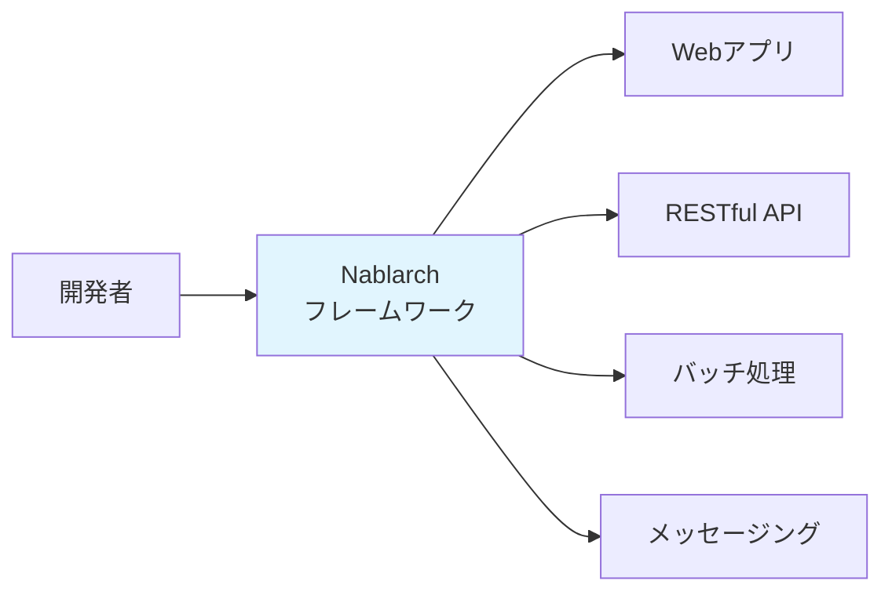
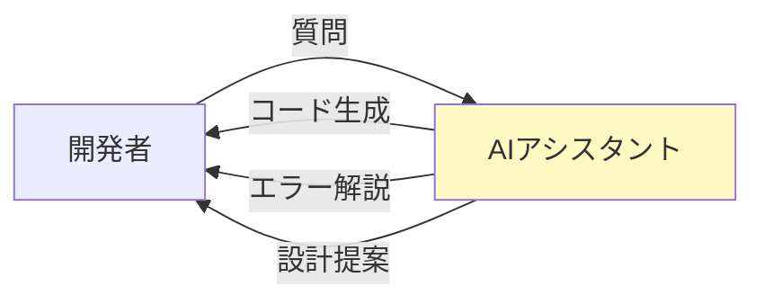
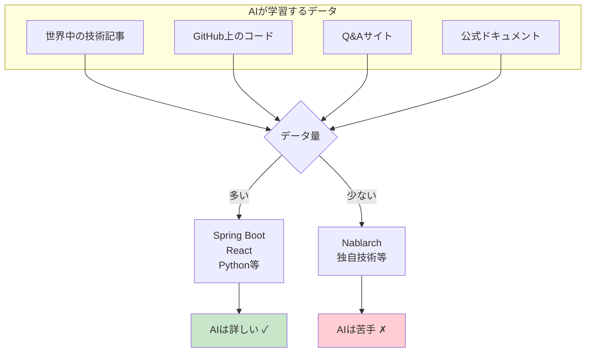
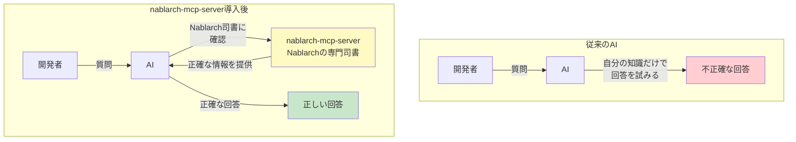
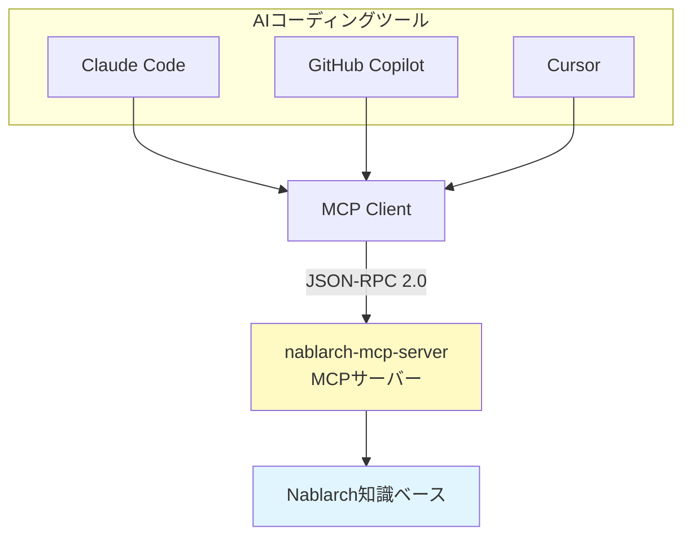
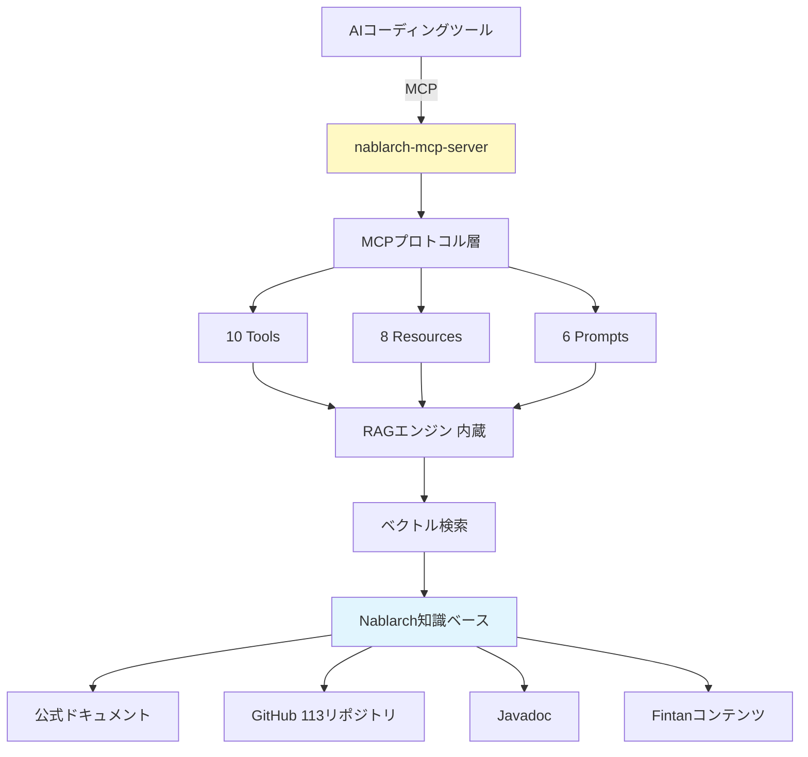
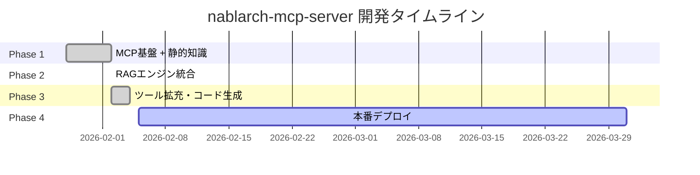
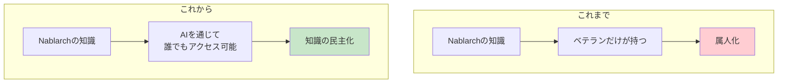

# nablarch-mcp-serverの全体像 — なぜ作ったのか、何ができるのか

> **シリーズ**: Nablarch MCP Server 専門家育成シリーズ 第2回
> **対象読者**: 駆け出しエンジニア（プログラミング経験1〜2年、Nablarchは未経験でもOK）
> **所要時間**: 15分

---

## 目次

1. [この記事で学べること](#1-この記事で学べること)
2. [前提知識](#2-前提知識)
3. [Nablarchフレームワークとは](#3-nablarchフレームワークとは)
4. [なぜAIがNablarch開発で苦戦するのか](#4-なぜaiがnablarch開発で苦戦するのか)
5. [nablarch-mcp-serverの解決策 — RAG + MCP](#5-nablarch-mcp-serverの解決策--rag--mcp)
6. [提供機能の全体像](#6-提供機能の全体像)
7. [プロジェクトの技術スタック](#7-プロジェクトの技術スタック)
8. [開発の歩み](#8-開発の歩み)
9. [まとめ — 次の記事への橋渡し](#9-まとめ--次の記事への橋渡し)

---

## 1. この記事で学べること

この記事では、nablarch-mcp-serverプロジェクトの全体像を理解します。

- **なぜ作られたのか**: Nablarch開発の「情報不足問題」とAIツールの限界
- **何を解決するのか**: RAGとMCPを組み合わせた新しいアプローチ
- **どんな機能があるのか**: 10 Tools + 8 Resources + 6 Prompts の構成
- **どうやって作られたのか**: 使用技術とプロジェクトの進捗状況

技術的な深い話は次回以降の記事で扱います。この記事では「全体の見通し」を掴むことを目標とします。

---

## 2. 前提知識

この記事を理解するために必要な前提知識は以下の通りです：

| 項目 | 必要なレベル | 説明 |
|------|------------|------|
| **プログラミング経験** | 必須 | どの言語でも構いません。変数、関数、クラスといった基本概念を理解していること |
| **Javaの基礎** | 推奨 | Nablarch自体はJavaフレームワークですが、この記事ではJavaの詳細は不要です |
| **AIコーディングツール** | 推奨 | ChatGPT、Claude、GitHub Copilot等を使ったことがあるとイメージしやすいです |
| **Webアプリ開発** | 任意 | Web開発経験があると理解が深まりますが、必須ではありません |

Nablarchを知らなくても大丈夫です。この記事で基本的な説明をします。

---

## 3. Nablarchフレームワークとは

### 3.1 概要

**Nablarch**（ナブラーク）は、TIS株式会社が開発した**ミッションクリティカルシステム向けJavaアプリケーションフレームワーク**です。

### 3.2 特徴

Nablarchは以下の特徴を持つフレームワークです：

| 特徴 | 説明 |
|------|------|
| **エンタープライズ向け** | 銀行、保険、官公庁など、大規模基幹システムでの採用実績 |
| **高い安定性** | 「絶対に止まってはいけない」システムに必要な堅牢性 |
| **日本国内中心** | 国内大手企業での導入実績は豊富だが、海外ではほぼ使われていない |
| **独自のアーキテクチャ** | ハンドラキュー方式という独特の処理フロー設計 |

### 3.3 歴史と現状

Nablarchは約15年以上の歴史を持ち、Java EE（現Jakarta EE）をベースに構築されています。現在の最新版はNablarch 6系で、Spring BootやMicronautといった現代的なフレームワークとは異なる設計思想を持っています。

### 3.4 Nablarch開発の課題 — 深刻な情報不足

しかし、Nablarchには**深刻な情報不足問題**があります。

| 指標 | Nablarch | 参考: Spring Boot |
|------|:--------:|:----------------:|
| **GitHub Stars** | 42 | 約76,000 |
| **Qiita記事数** | 14件 | 数万件 |
| **Zenn記事数** | ほぼ0 | 数千件 |
| **Stack Overflow** | ほぼ0 | 大量 |
| **公開求人数** | ほぼ0 | 1,130件（レバテック調べ） |

開発者からは以下のような声が上がっています：

> 「圧倒的、初心者殺しな情報のなさ。リファレンスがあるが使い方がわからない」

> 「お世辞にもわかりやすいフレームワークではない」

> 「公式の『未経験者でもすぐに開発を始められる』は嘘だと思っている」

つまり、Nablarchは**技術的には優れているが、学習コストが極めて高い**という問題を抱えています。

---

## 4. なぜAIがNablarch開発で苦戦するのか

### 4.1 AIコーディングツールの仕組み

近年、Claude Code、GitHub Copilot、Cursor等の**AIコーディングツール**が急速に普及しています。これらのツールは、開発者が「こんなプログラムを作りたい」と伝えると、AIがコードを書いてくれたり、エラーの原因を教えてくれたりします。

### 4.2 AIの「学習データの偏り」問題

しかし、AIには大きな弱点があります。それは**「学習していないことは知らない」**ということです。

**世界中で使われている技術**（例: Spring Boot、React、Python等）については、インターネット上に大量の情報があるため、AIは非常に詳しいです。

しかし、**日本独自の技術**や**特定の業界でのみ使われている技術**については、情報が少ないため、AIは正確な回答ができません。

### 4.3 Nablarch開発でAIに聞いても...

Nablarchについて質問しても、以下のような問題が発生します：

- **存在しない機能を提案される**（AIが他のフレームワークと混同）
- **古いバージョンの書き方を教えられる**（情報が古い）
- **そもそも「分かりません」と言われる**（学習データにない）

これでは、せっかくのAIツールが活用できません。

---

## 5. nablarch-mcp-serverの解決策 — RAG + MCP

### 5.1 基本的なアイデア: AIに「専門の司書」をつける

nablarch-mcp-serverは、**AIに「Nablarchの専門知識を教える仕組み」**を追加します。

図書館で例えるとわかりやすいです：

**図書館で本を探すとき**を想像してください。

- **司書がいない図書館**では、自分で膨大な本の中から探す必要があります
- **優秀な司書がいる図書館**では、「こういう情報が欲しい」と伝えるだけで、適切な本を見つけてきてくれます

nablarch-mcp-serverは、まさに**「Nablarchの専門司書」**のような存在です。

### 5.2 RAGとは何か

**RAG（Retrieval-Augmented Generation）** = 検索拡張生成

RAGは、AIが回答する前に「関連情報を検索して取得する」技術です。

**重要なポイント**:
- RAGを使うと、AIは「学習していない情報」も、**検索して取得できる**
- Nablarchの公式ドキュメント、ソースコード、Javadocなどを検索可能にする

### 5.3 MCPとは何か

**MCP（Model Context Protocol）** = AI接続の標準プロトコル

MCPは、Anthropic社が2024年11月に発表した、**AIアプリケーションと外部システムを接続するための標準規格**です。

**MCPが提供する3つのプリミティブ**:

| プリミティブ | 制御主体 | 役割 | 例 |
|------------|---------|------|-----|
| **Tools** | AIモデル | AIが呼び出す実行可能な関数 | API検索、ハンドラキュー検証 |
| **Resources** | アプリケーション | 読み取り専用のデータソース | API仕様書、設計パターン |
| **Prompts** | ユーザー | 再利用可能なテンプレート | アプリ作成ガイド |

### 5.4 RAG + MCPの統合 — 「AIが知って使う」

RAGとMCPは**補完関係**にあります。

| 技術 | 役割 | 比喩 |
|------|------|------|
| **RAG** | AIが「知る」ための仕組み | 図書館の蔵書検索 |
| **MCP** | AIが「使う」ための仕組み | 図書館の窓口サービス |
| **RAG+MCP** | AIが「知って使う」仕組み | 蔵書検索付き総合窓口 |

この統合により、以下が実現します：

- **大量知識の高精度検索**: RAGのセマンティック検索が解決
- **AIツールとの標準的な統合**: MCPの標準プロトコルが解決
- **学術的にも実証済み**: RAG-MCP論文（arXiv:2505.03275）によると、RAGによるMCPツール選択でプロンプトトークン75%削減・精度3倍向上

---

## 6. 提供機能の全体像

nablarch-mcp-serverは、**10 Tools + 8 Resources + 6 Prompts** を提供します。

### 6.1 Tools（AIが呼び出す機能）

| # | Tool名 | 説明 |
|---|--------|------|
| 1 | `search_api` | Nablarchの知識ベースをキーワード検索 |
| 2 | `validate_handler_queue` | ハンドラキューXML設定を検証（順序制約・必須ハンドラチェック） |
| 3 | `semantic_search` | Nablarch知識ベースのセマンティック検索（RAG） |
| 4 | `design_handler_queue` | アプリ種別・要件からハンドラキューXML構成を生成 |
| 5 | `generate_code` | アクションクラス、フォームBean、SQL定義等を生成 |
| 6 | `generate_test` | JUnitテストコード、Excelテストデータを生成 |
| 7 | `troubleshoot` | エラーメッセージからNablarch固有の原因を特定 |
| 8 | `analyze_migration` | Nablarch 5→6等のバージョンアップ時の影響分析 |
| 9 | `recommend_pattern` | 設計パターン・ベストプラクティスを推奨 |
| 10 | `optimize_handler_queue` | ハンドラキュー構成のパフォーマンス最適化 |

### 6.2 Resources（読み取り専用データ）

| # | Resource URI | 説明 |
|---|-------------|------|
| 1 | `nablarch://handler/{app_type}` | アプリタイプ別ハンドラカタログ（Web/REST/Batch等） |
| 2 | `nablarch://api/{module}/{class}` | Nablarch APIリファレンス（Javadoc） |
| 3 | `nablarch://pattern/{name}` | 設計パターン・ベストプラクティス |
| 4 | `nablarch://guide/{topic}` | トピック別開発ガイド（setup/testing/validation等） |
| 5 | `nablarch://example/{type}` | 実装例・サンプルコード |
| 6 | `nablarch://config/{name}` | 標準ハンドラキュー構成テンプレート |
| 7 | `nablarch://antipattern/{name}` | アンチパターン集（やってはいけないこと） |
| 8 | `nablarch://version` | Nablarch最新バージョン情報 |

### 6.3 Prompts（再利用可能なテンプレート）

| # | Prompt名 | 説明 |
|---|---------|------|
| 1 | `setup-handler-queue` | ハンドラキュー設計支援（アプリタイプ別推奨構成） |
| 2 | `create-action` | アクション作成ガイド（アプリタイプ別スケルトン生成） |
| 3 | `review-config` | XML設定ファイルレビュー（ハンドラ順序制約チェック） |
| 4 | `explain-handler` | ハンドラ詳細解説（FQCN・スレッドモデル・順序制約） |
| 5 | `migration-guide` | バージョン移行ガイド（Nablarch 5→6等） |
| 6 | `best-practices` | ベストプラクティス参照（トピック別） |

### 6.4 知識ソース

nablarch-mcp-serverは、以下のNablarch関連情報源を統合しています：

| ソース | 内容 | 規模 |
|--------|------|------|
| **Nablarch公式ドキュメント** | アーキテクチャ、API仕様、開発ガイド | 数百ページ |
| **GitHub nablarch org** | 113リポジトリ（ソースコード） | 数万ファイル |
| **Javadoc** | 全APIリファレンス | 全モジュール |
| **Fintan** | 学習教材、開発標準、事例 | 数十コンテンツ |

---

## 7. プロジェクトの技術スタック

### 7.1 基盤技術

| コンポーネント | 技術 | 選定理由 |
|--------------|------|---------|
| **言語** | Java 17+ | Nablarchとの一貫性、MCP Java SDK要件 |
| **フレームワーク** | Spring Boot 3.4.2 | MCP Boot Starter活用、エコシステムの充実 |
| **ビルドツール** | Maven 3.9.x | Nablarchエコシステムとの整合性（2026-02-03にGradleから移行） |
| **MCP SDK** | MCP Java SDK 0.17.x | 公式SDK、Spring AI共同メンテナンス |
| **テスト** | JUnit 5 + Spring Test + MockMvc | 標準的なテストフレームワーク |

### 7.2 RAG基盤

| コンポーネント | 技術 | 選定理由 |
|--------------|------|---------|
| **ベクトルDB** | PostgreSQL 16+ with pgvector | Nablarch（RDBMS中心）との親和性、コスト効率 |
| **Embeddingモデル（ドキュメント）** | BAAI/bge-m3（ONNX）/ Jina v4（API） | プロファイル切替でローカル/API選択可能 |
| **Embeddingモデル（コード）** | CodeSage-small-v2（ONNX）/ Voyage-code-3（API） | CPU環境対応、プロファイル切替 |
| **検索方式** | ハイブリッド検索（BM25 + ベクトル検索） | キーワードとセマンティックの両立 |
| **リランキング** | Cross-Encoder | 検索精度の向上 |

### 7.3 トランスポート

| トランスポート | 用途 | 対応状況 |
|--------------|------|---------|
| **STDIO** | ローカル開発（Claude Desktop、Claude Code向け） | ✅ Phase 1で完成 |
| **Streamable HTTP** | リモート/チーム共有 | ✅ Phase 3で完成 |

---

## 8. 開発の歩み

### 8.1 開発フェーズ

nablarch-mcp-serverは、4つのフェーズで開発されました。

**注**: ここでの「Phase 1-4」は**開発ロードマップ上のフェーズ**であり、アプリケーションの動作モードではありません。nablarch-mcp-serverは単一の構成で全機能が起動します。

| Phase | 内容 | 完了日 | 成果物 |
|-------|------|--------|--------|
| **Phase 1** | MCP基盤 + 静的知識 | 2026-02-02 | 28/28タスク完了、PR #1〜#7 |
| **Phase 2** | RAGエンジン統合 | 2026-02-02 | 34/34タスク完了、PR #8〜#25 |
| **Phase 3** | ツール拡充・コード生成 | 2026-02-04 | 37/37タスク完了、PR #29〜#61 |
| **Phase 4** | 本番デプロイ | 進行中 | Phase 4-1完了（Actuator/HealthIndicator/構造化ログ/相関ID）、ONNX移行完了 |

### 8.2 テスト品質

現在の品質指標：

| 指標 | 値 |
|------|-----|
| **総テスト数** | 1,019件 |
| **成功** | 1,005件（98.6%） |
| **スキップ** | 14件（1.4%、DB統合テスト・ONNXモデル関連） |
| **失敗** | 0件（0%） |

### 8.3 プルリクエスト

| 統計 | 値 |
|------|-----|
| **総PR数** | 80件 |
| **マージ済み** | 80件 |
| **最新PR** | #80（一次ソースURL付与） |

### 8.4 重要なマイルストーン

- **2026-02-02**: Phase 1完了（MCP基盤 + 静的知識）
- **2026-02-02**: Phase 2完了（RAGエンジン統合）
- **2026-02-03**: Maven移行完了（Gradleから移行、PR #26）
- **2026-02-04**: Phase 3完了（10 Tools + 8 Resources + 6 Prompts実装完了）
- **2026-02-10**: P0/P1品質改善（15件、CI/CD導入、FQCN自動検証テスト131件追加）
- **2026-02-10**: 知識データ拡充（10→17 YAMLファイル、カバレッジ85%）
- **2026-02-10**: Agent Skills導入（6件の静的知識配布レイヤー）
- **2026-02-11**: ONNX Embedding移行（有償API→ローカルbge-m3/CodeSage）
- **2026-02-11**: Phase 4-1品質基盤（Actuator/HealthIndicator/構造化ログ/相関ID）
- **2026-02-11**: 一次ソースURL付与（96エントリ・37 Nablarch公式URL）

---

## 9. まとめ — 次の記事への橋渡し

### 9.1 この記事で学んだこと

- **Nablarchの課題**: 深刻な情報不足により、AIツールが活用できない
- **RAG + MCPの解決策**: AIに「専門司書」をつけることで、正確な知識を提供
- **提供機能**: 10 Tools + 8 Resources + 6 Prompts でNablarch開発を支援
- **技術スタック**: Spring Boot + PostgreSQL + pgvector + ONNX Embedding（bge-m3/CodeSage）
- **開発状況**: Phase 3完結 + Phase 4-1品質基盤完了、1,019件テスト、80 PR

### 9.2 開発の「民主化」

nablarch-mcp-serverは、これまで**一部のベテランだけが持っていた知識**を、AIを通じて**誰でも活用できる**ようにします。

これは単なる効率化ではありません。**開発の民主化**です。

### 9.3 次の記事で学ぶこと

次はNablarchの基礎知識を学びます（第3A回: Nablarch入門）。

- **Nablarchフレームワーク**の基本概念と歴史
- **ハンドラキュー**方式というNablarch独自のアーキテクチャ
- **コンポーネント定義**とXML設定の基本
- 後半の技術記事を読むための**前提知識**を固める

Nablarchに馴染みがない方も、この記事を読めば後続の技術記事がスムーズに理解できます。

---

## ナビゲーション

- **[← 前の記事: 01-MCPとは何か](01-what-is-mcp.md)**
- **[→ 次の記事: 03A-Nablarch入門](03A-nablarch-introduction.md)**
- **[📚 記事一覧に戻る](INDEX.md)**

---

> **お問い合わせ**
> nablarch-mcp-serverについてのご質問やご相談は、GitHubリポジトリのIssueまたはDiscussionsをご利用ください。
