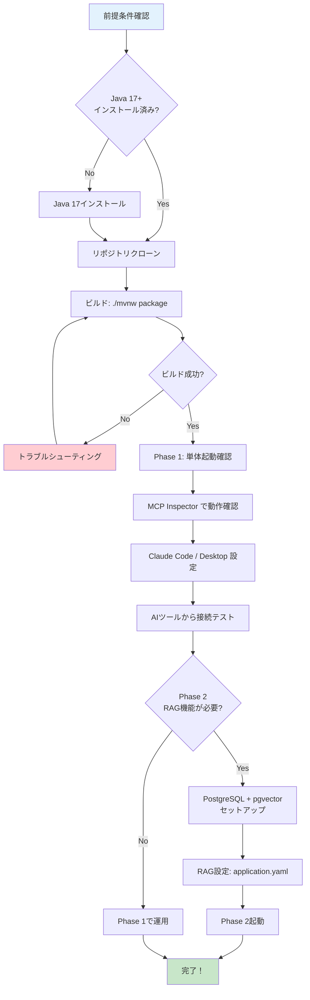

# ゼロから始めるセットアップ — 環境構築から動作確認まで

> **シリーズ**: [Nablarch MCP Server 専門家育成シリーズ](./README.md) 第3回
> **難易度**: 初級
> **所要時間**: 30分
> **前提記事**: [02. MCP仕様とNablarchの関係性](./02-mcp-and-nablarch.md)

---

## 目次

1. [この記事で学べること](#この記事で学べること)
2. [前提知識と前提条件](#前提知識と前提条件)
3. [セットアップフロー全体像](#セットアップフロー全体像)
4. [前提条件の確認とインストール](#前提条件の確認とインストール)
5. [リポジトリのクローンとビルド](#リポジトリのクローンとビルド)
6. [Phase 1モード（静的知識のみ）での起動と確認](#phase-1モード静的知識のみでの起動と確認)
7. [Claude Code / Claude Desktop での設定方法](#claude-code--claude-desktop-での設定方法)
8. [動作確認 — 最初のMCPリクエストを送ってみよう](#動作確認--最初のmcpリクエストを送ってみよう)
9. [Phase 2モード（RAG）のセットアップ](#phase-2モードragのセットアップ)
10. [よくあるセットアップエラーと対処法](#よくあるセットアップエラーと対処法)
11. [まとめ — 次の記事への橋渡し](#まとめ--次の記事への橋渡し)

---

## この記事で学べること

この記事を読み終えると、以下のことができるようになります。

| 学習目標 | 説明 |
|---------|------|
| **環境構築** | Java 17、Maven、PostgreSQLのインストールと確認 |
| **ビルドと起動** | nablarch-mcp-serverのクローン、ビルド、起動 |
| **MCP接続設定** | Claude Code / Claude Desktop への接続設定 |
| **動作確認** | MCP Inspectorを使った機能テスト |
| **トラブルシューティング** | よくあるエラーの原因と対処法 |

### 対象読者

- プログラミング学習中、または実務経験1〜2年のエンジニア
- Nablarchフレームワークを初めて使う方
- AIコーディングツールを開発に活用したい方
- セットアップ手順を一から知りたい方

---

## 前提知識と前提条件

### 前提知識

この記事を読むにあたり、以下の知識があると理解がスムーズです。

| 項目 | 必要レベル | 補足 |
|------|----------|------|
| **コマンドライン操作** | 基本的な操作ができる | `cd`, `ls`, `mkdir` 等の基本コマンド |
| **Git** | リポジトリのクローンができる | `git clone` コマンド |
| **JSON** | 設定ファイルを読める | MCP設定ファイルはJSON形式 |
| **Java** | インストール方法を知っている | JDK 17以上が必要 |

### 前提条件（必須ソフトウェア）

| ソフトウェア | 必要バージョン | 用途 | 確認コマンド |
|------------|--------------|------|------------|
| **Java** | JDK 17以上 | nablarch-mcp-serverの実行 | `java -version` |
| **Maven** | 3.9.x以上 | ビルドツール（Maven Wrapper同梱） | `mvn -version` |
| **Git** | 2.x以上 | リポジトリのクローン | `git --version` |
| **PostgreSQL**（Phase 2） | 16以上 + pgvector拡張 | RAG機能のベクトルDB | `psql --version` |

**注意**: Phase 1（静的知識のみ）では PostgreSQL は不要です。Phase 2（RAG機能）でのみ必要になります。

---

## セットアップフロー全体像

セットアップの流れを図で確認しましょう。



**2つのフェーズ**:
- **Phase 1（静的知識のみ）**: PostgreSQL不要。YAML知識ファイルベースで即座に動作確認可能
- **Phase 2（RAG機能）**: PostgreSQL + pgvector必要。セマンティック検索による高精度な情報検索

この記事では、Phase 1を中心に解説し、Phase 2は概要のみ触れます。

---

## 前提条件の確認とインストール

### Step 1: Java 17以上の確認

ターミナル（macOS/Linux）またはコマンドプロンプト（Windows）を開き、以下を実行します。

```bash
$ java -version
```

**成功時の出力例**:

```
openjdk version "17.0.8" 2023-07-18
OpenJDK Runtime Environment (build 17.0.8+7-Ubuntu-122.04)
OpenJDK 64-Bit Server VM (build 17.0.8+7-Ubuntu-122.04, mixed mode, sharing)
```

**バージョンが17以上であればOK**です。

#### Java 17がインストールされていない場合

| OS | 推奨インストール方法 |
|----|------------------|
| **macOS** | [SDKMAN!](https://sdkman.io/) を使用: `sdk install java 17.0.8-tem` |
| **Windows** | [Adoptium](https://adoptium.net/) から Eclipse Temurin 17 をダウンロード |
| **Linux（Ubuntu）** | `sudo apt install openjdk-17-jdk` |

インストール後、再度 `java -version` で確認してください。

### Step 2: Git の確認

```bash
$ git --version
```

**成功時の出力例**:

```
git version 2.39.2
```

Gitがインストールされていない場合は、[Git公式サイト](https://git-scm.com/)からダウンロードしてインストールしてください。

### Step 3: Maven の確認（オプション）

nablarch-mcp-serverには **Maven Wrapper** が同梱されているため、Mavenのグローバルインストールは不要です。

```bash
$ mvn -version
```

Mavenがインストールされていなくても、後ほど `./mvnw` コマンドで自動的にダウンロードされます。

---

## リポジトリのクローンとビルド

### Step 4: リポジトリのクローン

作業ディレクトリに移動し、リポジトリをクローンします。

```bash
# 作業ディレクトリに移動（例: ホームディレクトリ）
$ cd ~

# リポジトリをクローン
$ git clone https://github.com/kumagoro1202/nablarch-mcp-server.git

# ディレクトリに移動
$ cd nablarch-mcp-server
```

**成功時の出力例**:

```
Cloning into 'nablarch-mcp-server'...
remote: Enumerating objects: 1234, done.
remote: Counting objects: 100% (1234/1234), done.
remote: Compressing objects: 100% (789/789), done.
remote: Total 1234 (delta 456), reused 1234 (delta 456), pack-reused 0
Receiving objects: 100% (1234/1234), 2.34 MiB | 3.45 MiB/s, done.
Resolving deltas: 100% (456/456), done.
```

### Step 5: ビルド

Maven Wrapperを使ってビルドします。

#### macOS / Linux の場合

```bash
$ ./mvnw package
```

#### Windows の場合

```cmd
> mvnw.cmd package
```

**ビルドには5〜10分程度かかります**（初回はMaven依存ライブラリのダウンロードが発生します）。

**成功時の出力例（最終行）**:

```
[INFO] ------------------------------------------------------------------------
[INFO] BUILD SUCCESS
[INFO] ------------------------------------------------------------------------
[INFO] Total time:  3:42 min
[INFO] Finished at: 2026-02-07T10:15:30+09:00
[INFO] ------------------------------------------------------------------------
```

ビルドが成功すると、以下の場所にJARファイルが生成されます。

```
target/nablarch-mcp-server-0.1.0-SNAPSHOT.jar
```

**確認**:

```bash
$ ls -lh target/nablarch-mcp-server-0.1.0-SNAPSHOT.jar
```

**出力例**:

```
-rw-r--r-- 1 user user 45M Feb  7 10:15 target/nablarch-mcp-server-0.1.0-SNAPSHOT.jar
```

---

## Phase 1モード（静的知識のみ）での起動と確認

Phase 1モードでは、PostgreSQLを使用せず、**YAML知識ファイル**のみでMCPサーバーが動作します。

### Step 6: サーバーの単体起動

```bash
$ java -jar target/nablarch-mcp-server-0.1.0-SNAPSHOT.jar
```

**成功時の出力例**:

```
  .   ____          _            __ _ _
 /\\ / ___'_ __ _ _(_)_ __  __ _ \ \ \ \
( ( )\___ | '_ | '_| | '_ \/ _` | \ \ \ \
 \\/  ___)| |_)| | | | | || (_| |  ) ) ) )
  '  |____| .__|_| |_|_| |_\__, | / / / /
 =========|_|==============|___/=/_/_/_/
 :: Spring Boot ::                (v3.4.2)

2026-02-07T10:20:00.123+09:00  INFO 12345 --- [nablarch-mcp-server] [main] c.t.n.m.NablarchMcpServerApplication     : Starting NablarchMcpServerApplication v0.1.0-SNAPSHOT
2026-02-07T10:20:01.234+09:00  INFO 12345 --- [nablarch-mcp-server] [main] c.t.n.m.s.k.KnowledgeBaseLoader          : Loaded 6 handler constraints from knowledge/handler-constraints.yaml
2026-02-07T10:20:01.345+09:00  INFO 12345 --- [nablarch-mcp-server] [main] c.t.n.m.s.k.KnowledgeBaseLoader          : Loaded 42 handlers from knowledge/handler-catalog.yaml
2026-02-07T10:20:01.456+09:00  INFO 12345 --- [nablarch-mcp-server] [main] c.t.n.m.NablarchMcpServerApplication     : Started NablarchMcpServerApplication in 1.456 seconds (process running for 1.789)
```

**重要**: サーバーはSTDIO（標準入出力）トランスポートで動作します。このため、起動後は **JSON-RPCメッセージを待機している状態** になります。

**このターミナルは閉じずに、別のターミナルを開いて次のステップに進んでください。**

ターミナルを閉じたい場合は `Ctrl+C` で終了できます。

---

## Claude Code / Claude Desktop での設定方法

次に、AIツールからnablarch-mcp-serverに接続する設定を行います。

### 設定方法1: Claude Desktop

#### 設定ファイルの場所

| OS | 設定ファイルのパス |
|----|----------------|
| **macOS** | `~/Library/Application Support/Claude/claude_desktop_config.json` |
| **Windows** | `%APPDATA%\Claude\claude_desktop_config.json` |
| **Linux** | `~/.config/Claude/claude_desktop_config.json` |

#### 設定内容

設定ファイルを開き（ない場合は新規作成）、以下を追加します。

```json
{
  "mcpServers": {
    "nablarch": {
      "command": "java",
      "args": [
        "-jar",
        "/path/to/nablarch-mcp-server-0.1.0-SNAPSHOT.jar"
      ]
    }
  }
}
```

**重要**: `/path/to/` は実際のJARファイルのパスに置き換えてください。

**例（macOS/Linux）**:

```json
{
  "mcpServers": {
    "nablarch": {
      "command": "java",
      "args": [
        "-jar",
        "/Users/yourname/nablarch-mcp-server/target/nablarch-mcp-server-0.1.0-SNAPSHOT.jar"
      ]
    }
  }
}
```

**例（Windows）**:

```json
{
  "mcpServers": {
    "nablarch": {
      "command": "java",
      "args": [
        "-jar",
        "C:\\Users\\yourname\\nablarch-mcp-server\\target\\nablarch-mcp-server-0.1.0-SNAPSHOT.jar"
      ]
    }
  }
}
```

設定後、**Claude Desktopを再起動**してください。

### 設定方法2: Claude Code

プロジェクトルートまたはホームディレクトリに `.mcp.json` または `~/.claude/mcp.json` を作成します。

```bash
# プロジェクトルートに作成する場合
$ cd /path/to/your-project
$ nano .mcp.json
```

**設定内容**:

```json
{
  "mcpServers": {
    "nablarch": {
      "command": "java",
      "args": [
        "-jar",
        "/path/to/nablarch-mcp-server-0.1.0-SNAPSHOT.jar"
      ]
    }
  }
}
```

設定後、Claude Codeを再起動してください。

---

## 動作確認 — 最初のMCPリクエストを送ってみよう

設定が正しくできているか、**MCP Inspector** を使って確認しましょう。

### Step 7: MCP Inspector のインストールと起動

MCP InspectorはMCPサーバーをテストするためのブラウザベースのツールです。

```bash
# 別のターミナルを開いて実行
$ npx @modelcontextprotocol/inspector java -jar target/nablarch-mcp-server-0.1.0-SNAPSHOT.jar
```

**成功時の出力例**:

```
MCP Inspector
Starting server...
Server running at http://localhost:5173
Opening browser...
```

ブラウザが自動的に開き、MCP Inspectorのインターフェースが表示されます。

### Step 8: Tools の確認

MCP Inspectorの左メニューから **「Tools」** を選択します。

**表示されるべきTools**:

| Tool名 | 説明 |
|--------|------|
| `search_api` | Nablarch APIドキュメント検索 |
| `validate_handler_queue` | ハンドラキューXML検証 |

### Step 9: Resources の確認

左メニューから **「Resources」** を選択します。

**表示されるべきResources**（Phase 1の場合）:

| URI | 説明 |
|-----|------|
| `nablarch://handler/web` | Webアプリケーションのハンドラキュー仕様 |
| `nablarch://handler/rest` | RESTアプリケーションのハンドラキュー仕様 |
| `nablarch://handler/batch` | バッチアプリケーションのハンドラキュー仕様 |
| `nablarch://handler/messaging` | メッセージングのハンドラキュー仕様 |
| `nablarch://guide/setup` | プロジェクトセットアップガイド |
| `nablarch://guide/database` | データベースアクセスガイド |
| ... | 他6種 |

### Step 10: Prompts の確認

左メニューから **「Prompts」** を選択します。

**表示されるべきPrompts**:

| Prompt名 | 説明 |
|----------|------|
| `setup-handler-queue` | ハンドラキュー構成の支援 |
| `create-action` | アクションクラススケルトン生成 |
| `review-config` | XML設定ファイルのレビュー |
| `explain-handler` | ハンドラの詳細説明 |
| `migration-guide` | バージョン移行ガイド |
| `best-practices` | ベストプラクティス参照 |

### Step 11: Toolを実際に実行してみる

MCP InspectorのToolsタブで、`search_api` ツールを実行してみましょう。

**手順**:

1. **Tools** タブで `search_api` を選択
2. パラメータを入力:
   - `keyword`: `UniversalDao`
   - `category`: （空欄）
3. **「Execute」** ボタンをクリック

**成功時の出力例**:

```json
{
  "results": [
    {
      "title": "UniversalDao - Nablarch標準のDBアクセスAPI",
      "description": "エンティティベースのCRUD操作を提供するDAO",
      "module": "nablarch.common.dao.UniversalDao",
      "category": "library",
      "code_example": "List<User> users = UniversalDao.findAllBySqlFile(User.class, \"FIND_ALL_USERS\", new Object[]{});"
    }
  ],
  "total": 1,
  "query": "UniversalDao"
}
```

この出力が表示されれば、**MCPサーバーが正しく動作しています！**

### Step 12: Claude Desktop / Claude Code からの接続テスト

Claude Desktop または Claude Code を起動し、以下のプロンプトを試してみましょう。

**プロンプト例**:

```
NablarchのUniversalDaoの使い方を教えて
```

**期待される動作**:

Claude が nablarch-mcp-server の `search_api` ツールを呼び出し、UniversalDao に関する情報を取得して回答します。

---

## Phase 2モード（RAG）のセットアップ

Phase 2モードでは、**PostgreSQL + pgvector** を使った高度なセマンティック検索が利用できます。

### Phase 2の追加機能

| 機能 | Phase 1（静的知識） | Phase 2（RAG） |
|------|------------------|--------------|
| 知識ソース | YAMLファイルのみ | YAML + 公式ドキュメント + GitHub + Javadoc + Fintan |
| 検索方式 | キーワードマッチ | セマンティック検索 + ハイブリッド検索 |
| 精度 | 基本的 | 高精度 |

### Phase 2のセットアップ概要

Phase 2のセットアップは、別の専門記事で詳しく解説します。ここでは概要のみ紹介します。

#### 必要なもの

| ソフトウェア | バージョン | 用途 |
|------------|----------|------|
| PostgreSQL | 16以上 | ベクトルDB |
| pgvector拡張 | 0.5.0以上 | ベクトル検索機能 |

#### セットアップ手順（概要）

```bash
# 1. PostgreSQLインストール（例: Ubuntu）
$ sudo apt install postgresql-16 postgresql-contrib-16

# 2. pgvector拡張インストール
$ sudo apt install postgresql-16-pgvector

# 3. データベース作成
$ psql -U postgres
postgres=# CREATE DATABASE nablarch_mcp;
postgres=# \c nablarch_mcp
nablarch_mcp=# CREATE EXTENSION vector;

# 4. application.yaml の設定
$ nano src/main/resources/application.yaml
# データソース設定を追加

# 5. Flyway マイグレーション実行
$ ./mvnw flyway:migrate

# 6. Phase 2モードで起動
$ java -jar target/nablarch-mcp-server-0.1.0-SNAPSHOT.jar --spring.profiles.active=rag
```

詳細は次の記事「[04. Phase 2モード（RAG）のセットアップ詳細](./04-phase2-setup.md)」で解説します。

---

## よくあるセットアップエラーと対処法

### エラー1: `UnsupportedClassVersionError`

**症状**:

```
Error: A JNI error has occurred, please check your installation and try again
Exception in thread "main" java.lang.UnsupportedClassVersionError: ...
```

**原因**: Javaのバージョンが17未満

**対処法**:

```bash
$ java -version
# バージョンを確認し、17未満の場合はJava 17以上をインストール
```

### エラー2: `FileNotFoundException: knowledge/*.yaml`

**症状**:

```
java.io.FileNotFoundException: class path resource [knowledge/handler-catalog.yaml] cannot be opened
```

**原因**: JARファイルが破損している、またはビルドが不完全

**対処法**:

```bash
# クリーンビルドを実行
$ ./mvnw clean package
```

### エラー3: MCP Inspector でツールが表示されない

**症状**: MCP Inspector のToolsタブが空

**原因**: サーバーが正しく起動していない、またはMCP Inspectorのコマンドが間違っている

**対処法**:

```bash
# サーバーが正しく起動しているか確認
$ ps aux | grep nablarch-mcp-server

# MCP Inspectorのコマンドを再確認
$ npx @modelcontextprotocol/inspector java -jar target/nablarch-mcp-server-0.1.0-SNAPSHOT.jar
```

### エラー4: Claude Desktop / Claude Code で接続できない

**症状**: Claude で Nablarch 関連の質問をしても `search_api` ツールが呼ばれない

**原因**: 設定ファイルのパスが間違っている、またはAIツールが再起動されていない

**対処法**:

1. 設定ファイルのJARパスを絶対パスで指定しているか確認
2. AIツールを完全に再起動（アプリを終了して再度起動）
3. ログを確認:
   ```bash
   # Claude Desktop のログ（macOS）
   $ tail -f ~/Library/Logs/Claude/main.log
   ```

### エラー5: `Address already in use`

**症状** (Phase 2のみ):

```
Caused by: java.net.BindException: Address already in use
```

**原因**: ポート8080が既に使用されている（Phase 2のHTTPモード）

**対処法**:

```bash
# ポートを使用しているプロセスを確認
$ lsof -i :8080

# 別のポートを指定して起動
$ java -jar target/nablarch-mcp-server-0.1.0-SNAPSHOT.jar --server.port=8081
```

---

## まとめ — 次の記事への橋渡し

### この記事で学んだこと


| ステップ | 達成内容 |
|---------|---------|
| **環境構築** | Java 17、Maven、Gitのインストールと確認 |
| **ビルド** | リポジトリのクローンとMaven Wrapperによるビルド |
| **Phase 1起動** | 静的知識ベースでのMCPサーバー起動 |
| **MCP Inspector** | Tools / Resources / Prompts の動作確認 |
| **AIツール接続** | Claude Desktop / Claude Code からの接続設定 |
| **動作確認** | `search_api` ツールの実行テスト |

### セットアップ完了チェックリスト

- [ ] Java 17以上がインストールされている
- [ ] リポジトリをクローンした
- [ ] `./mvnw package` でビルドが成功した
- [ ] `java -jar target/nablarch-mcp-server-0.1.0-SNAPSHOT.jar` でサーバーが起動した
- [ ] MCP Inspector で Tools / Resources / Prompts が表示された
- [ ] Claude Desktop / Claude Code で接続設定を完了した
- [ ] AIツールから `search_api` ツールが呼び出せた

### 次の記事で学ぶこと

次の記事では、実際にnablarch-mcp-serverを使った開発ワークフローを体験します。

| 記事 | 内容 |
|------|------|
| **[04. Phase 2モード（RAG）のセットアップ詳細](./04-phase2-setup.md)** | PostgreSQL + pgvector のセットアップ、RAG機能の有効化 |
| **[05. 基本的な使い方 — Nablarchハンドラキューの設計](./05-basic-usage.md)** | ハンドラキュー設計の実践、`design_handler_queue` ツールの使い方 |
| **[06. コード生成とテスト生成](./06-code-generation.md)** | `generate_code` / `generate_test` ツールの活用 |

---

## 用語集

| 用語 | 読み | 説明 |
|------|------|------|
| **MCP** | エムシーピー | Model Context Protocol。AIと外部ツールを繋ぐ標準規格 |
| **STDIO** | スタンダードアイオー | Standard Input/Output。標準入出力 |
| **JSON-RPC** | ジェイソンアールピーシー | JSONを使ったリモートプロシージャコール |
| **RAG** | ラグ | Retrieval-Augmented Generation。検索拡張生成 |
| **pgvector** | ピージーベクター | PostgreSQLのベクトル検索拡張機能 |
| **Maven Wrapper** | メイヴンラッパー | Mavenをプロジェクトにバンドルする仕組み（`./mvnw`） |

---

## 関連リンク

- [前の記事: 02. MCP仕様とNablarchの関係性](./02-mcp-and-nablarch.md)
- [次の記事: 04. Phase 2モード（RAG）のセットアップ詳細](./04-phase2-setup.md)
- [シリーズ目次に戻る](./README.md)

---

> **フィードバック募集中**
> この記事についてのご質問やご意見は、GitHubリポジトリの [Issues](https://github.com/kumagoro1202/nablarch-mcp-server/issues) または [Discussions](https://github.com/kumagoro1202/nablarch-mcp-server/discussions) にお寄せください。
