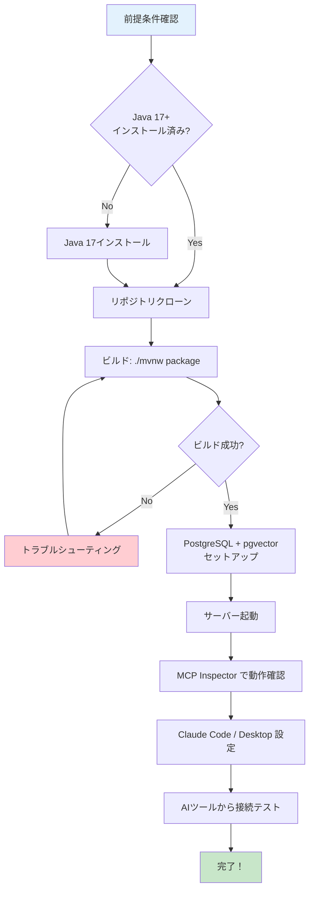

# ゼロから始めるセットアップ — 環境構築から動作確認まで

> **シリーズ**: [Nablarch MCP Server 専門家育成シリーズ](./INDEX.md) 第3回
> **難易度**: 初級
> **所要時間**: 30分
> **前提記事**: [02. nablarch-mcp-serverの全体像](./02-project-overview.md)

---

## 目次

1. [この記事で学べること](#この記事で学べること)
2. [前提知識と前提条件](#前提知識と前提条件)
3. [セットアップフロー全体像](#セットアップフロー全体像)
4. [前提条件の確認とインストール](#前提条件の確認とインストール)
5. [リポジトリのクローンとビルド](#リポジトリのクローンとビルド)
6. [データベースのセットアップ](#データベースのセットアップ)
7. [サーバーの起動と確認](#サーバーの起動と確認)
8. [Claude Code / Claude Desktop での設定方法](#claude-code--claude-desktop-での設定方法)
9. [動作確認 — 最初のMCPリクエストを送ってみよう](#動作確認--最初のmcpリクエストを送ってみよう)
10. [ツールのDB依存性について](#ツールのdb依存性について)
11. [よくあるセットアップエラーと対処法](#よくあるセットアップエラーと対処法)
12. [まとめ — 次の記事への橋渡し](#まとめ--次の記事への橋渡し)

---

## この記事で学べること

この記事を読み終えると、以下のことができるようになります。

| 学習目標 | 説明 |
|---------|------|
| **環境構築** | Java 17、Maven、PostgreSQL + pgvectorのインストールと確認 |
| **ビルドと起動** | nablarch-mcp-serverのクローン、ビルド、起動 |
| **MCP接続設定** | Claude Code / Claude Desktop への接続設定 |
| **動作確認** | MCP Inspectorを使った機能テスト |
| **トラブルシューティング** | よくあるエラーの原因と対処法 |

### 対象読者

- プログラミング学習中、または実務経験1〜2年のエンジニア
- Nablarchフレームワークを初めて使う方
- AIコーディングツールを開発に活用したい方
- セットアップ手順を一から知りたい方

---

## 前提知識と前提条件

### 前提知識

この記事を読むにあたり、以下の知識があると理解がスムーズです。

| 項目 | 必要レベル | 補足 |
|------|----------|------|
| **コマンドライン操作** | 基本的な操作ができる | `cd`, `ls`, `mkdir` 等の基本コマンド |
| **Git** | リポジトリのクローンができる | `git clone` コマンド |
| **JSON** | 設定ファイルを読める | MCP設定ファイルはJSON形式 |
| **Java** | インストール方法を知っている | JDK 17以上が必要 |

### 前提条件（必須ソフトウェア）

| ソフトウェア | 必要バージョン | 用途 | 確認コマンド |
|------------|--------------|------|------------|
| **Java** | JDK 17以上 | nablarch-mcp-serverの実行 | `java -version` |
| **Maven** | 3.9.x以上 | ビルドツール（Maven Wrapper同梱） | `mvn -version` |
| **Git** | 2.x以上 | リポジトリのクローン | `git --version` |
| **PostgreSQL** | 16以上 + pgvector拡張 | データベース（起動に必須） | `psql --version` |

**重要**: PostgreSQLはnablarch-mcp-serverの起動に必須です。アプリケーションはSpring Boot起動時にDataSource、Flyway（DBマイグレーション）、JPA（Hibernate）の初期化を行うため、PostgreSQLが稼働していない状態では起動に失敗します。

---

## セットアップフロー全体像

セットアップの流れを図で確認しましょう。



この記事では、環境構築からサーバー起動、AIツールへの接続設定までを一通り解説します。全10ツール・全12リソース・全6プロンプトが単一構成で起動します。

---

## 前提条件の確認とインストール

### Step 1: Java 17以上の確認

ターミナル（macOS/Linux）またはコマンドプロンプト（Windows）を開き、以下を実行します。

```bash
$ java -version
```

**成功時の出力例**:

```
openjdk version "17.0.8" 2023-07-18
OpenJDK Runtime Environment (build 17.0.8+7-Ubuntu-122.04)
OpenJDK 64-Bit Server VM (build 17.0.8+7-Ubuntu-122.04, mixed mode, sharing)
```

**バージョンが17以上であればOK**です。

#### Java 17がインストールされていない場合

| OS | 推奨インストール方法 |
|----|------------------|
| **macOS** | [SDKMAN!](https://sdkman.io/) を使用: `sdk install java 17.0.8-tem` |
| **Windows** | [Adoptium](https://adoptium.net/) から Eclipse Temurin 17 をダウンロード |
| **Linux（Ubuntu）** | `sudo apt install openjdk-17-jdk` |

インストール後、再度 `java -version` で確認してください。

### Step 2: Git の確認

```bash
$ git --version
```

**成功時の出力例**:

```
git version 2.39.2
```

Gitがインストールされていない場合は、[Git公式サイト](https://git-scm.com/)からダウンロードしてインストールしてください。

### Step 3: Maven の確認（オプション）

nablarch-mcp-serverには **Maven Wrapper** が同梱されているため、Mavenのグローバルインストールは不要です。

```bash
$ mvn -version
```

Mavenがインストールされていなくても、後ほど `./mvnw` コマンドで自動的にダウンロードされます。

---

## リポジトリのクローンとビルド

### Step 4: リポジトリのクローン

作業ディレクトリに移動し、リポジトリをクローンします。

```bash
# 作業ディレクトリに移動（例: ホームディレクトリ）
$ cd ~

# リポジトリをクローン
$ git clone https://github.com/kumagoro1202/nablarch-mcp-server.git

# ディレクトリに移動
$ cd nablarch-mcp-server
```

**成功時の出力例**:

```
Cloning into 'nablarch-mcp-server'...
remote: Enumerating objects: 1234, done.
remote: Counting objects: 100% (1234/1234), done.
remote: Compressing objects: 100% (789/789), done.
remote: Total 1234 (delta 456), reused 1234 (delta 456), pack-reused 0
Receiving objects: 100% (1234/1234), 2.34 MiB | 3.45 MiB/s, done.
Resolving deltas: 100% (456/456), done.
```

### Step 5: ビルド

Maven Wrapperを使ってビルドします。

#### macOS / Linux の場合

```bash
$ ./mvnw package
```

#### Windows の場合

```cmd
> mvnw.cmd package
```

**ビルドには5〜10分程度かかります**（初回はMaven依存ライブラリのダウンロードが発生します）。

**成功時の出力例（最終行）**:

```
[INFO] ------------------------------------------------------------------------
[INFO] BUILD SUCCESS
[INFO] ------------------------------------------------------------------------
[INFO] Total time:  3:42 min
[INFO] Finished at: 2026-02-07T10:15:30+09:00
[INFO] ------------------------------------------------------------------------
```

ビルドが成功すると、以下の場所にJARファイルが生成されます。

```
target/nablarch-mcp-server-0.1.0-SNAPSHOT.jar
```

**確認**:

```bash
$ ls -lh target/nablarch-mcp-server-0.1.0-SNAPSHOT.jar
```

**出力例**:

```
-rw-r--r-- 1 user user 45M Feb  7 10:15 target/nablarch-mcp-server-0.1.0-SNAPSHOT.jar
```

---

## データベースのセットアップ

nablarch-mcp-serverはSpring Boot起動時にPostgreSQLへの接続を必要とします。DataSource、Flyway（DBマイグレーション）、JPA（Hibernate）が全てアプリケーション構成に含まれており、DB接続なしでは起動に失敗します。

### Step 6: PostgreSQLのインストール

| OS | インストール方法 |
|----|---------------|
| **macOS** | `brew install postgresql@16` |
| **Windows** | [PostgreSQL公式サイト](https://www.postgresql.org/download/windows/)からインストーラをダウンロード |
| **Linux（Ubuntu）** | `sudo apt install postgresql-16 postgresql-contrib-16` |

インストール後、PostgreSQLが起動していることを確認します。

```bash
$ psql --version
# PostgreSQL 16.x が表示されればOK

$ pg_isready
# "accepting connections" が表示されればOK
```

### Step 7: pgvector拡張のインストール

pgvectorはPostgreSQLにベクトル検索機能を追加する拡張です。セマンティック検索ツール（SemanticSearchTool）がこの機能を利用します。

| OS | インストール方法 |
|----|---------------|
| **macOS** | `brew install pgvector` |
| **Linux（Ubuntu）** | `sudo apt install postgresql-16-pgvector` |
| **Windows** | [pgvector公式サイト](https://github.com/pgvector/pgvector)の手順に従ってビルド |

### Step 8: データベースの作成と設定

```bash
# PostgreSQLに接続
$ psql -U postgres

# データベース作成
postgres=# CREATE DATABASE nablarch_mcp;

# ユーザー作成（application.yamlのデフォルト設定に合わせる）
postgres=# CREATE USER nablarch WITH PASSWORD 'nablarch_dev';
postgres=# GRANT ALL PRIVILEGES ON DATABASE nablarch_mcp TO nablarch;

# データベースに接続してpgvector拡張を有効化
postgres=# \c nablarch_mcp
nablarch_mcp=# CREATE EXTENSION vector;

# スキーマの権限を付与
nablarch_mcp=# GRANT ALL ON SCHEMA public TO nablarch;

# 接続を終了
nablarch_mcp=# \q
```

**確認**: データベースに接続できることを確認します。

```bash
$ psql -U nablarch -d nablarch_mcp -c "SELECT 1;"
```

`1` が返ってくれば成功です。

> **補足**: アプリケーションのデフォルト設定（`application.yaml`）では、接続先が `localhost:5432`、ユーザー名 `nablarch`、パスワード `nablarch_dev` になっています。これらの値は環境に合わせて `application.yaml` で変更できます。

---

## サーバーの起動と確認

### Step 9: サーバーの起動

PostgreSQLが稼働している状態で、サーバーを起動します。

```bash
$ java -jar target/nablarch-mcp-server-0.1.0-SNAPSHOT.jar
```

**成功時の出力例**:

```
  .   ____          _            __ _ _
 /\\ / ___'_ __ _ _(_)_ __  __ _ \ \ \ \
( ( )\___ | '_ | '_| | '_ \/ _` | \ \ \ \
 \\/  ___)| |_)| | | | | || (_| |  ) ) ) )
  '  |____| .__|_| |_|_| |_\__, | / / / /
 =========|_|==============|___/=/_/_/_/
 :: Spring Boot ::                (v3.4.2)

2026-02-07T10:20:00.123+09:00  INFO 12345 --- [nablarch-mcp-server] [main] c.t.n.m.NablarchMcpServerApplication     : Starting NablarchMcpServerApplication v0.1.0-SNAPSHOT
2026-02-07T10:20:01.234+09:00  INFO 12345 --- [nablarch-mcp-server] [main] c.t.n.m.s.k.KnowledgeBaseLoader          : Loaded 6 handler constraints from knowledge/handler-constraints.yaml
2026-02-07T10:20:01.345+09:00  INFO 12345 --- [nablarch-mcp-server] [main] c.t.n.m.s.k.KnowledgeBaseLoader          : Loaded 42 handlers from knowledge/handler-catalog.yaml
2026-02-07T10:20:01.456+09:00  INFO 12345 --- [nablarch-mcp-server] [main] c.t.n.m.NablarchMcpServerApplication     : Started NablarchMcpServerApplication in 1.456 seconds (process running for 1.789)
```

**重要**: サーバーはSTDIO（標準入出力）トランスポートで動作します。このため、起動後は **JSON-RPCメッセージを待機している状態** になります。

**このターミナルは閉じずに、別のターミナルを開いて次のステップに進んでください。**

ターミナルを閉じたい場合は `Ctrl+C` で終了できます。

---

## Claude Code / Claude Desktop での設定方法

次に、AIツールからnablarch-mcp-serverに接続する設定を行います。

### 設定方法1: Claude Desktop

#### 設定ファイルの場所

| OS | 設定ファイルのパス |
|----|----------------|
| **macOS** | `~/Library/Application Support/Claude/claude_desktop_config.json` |
| **Windows** | `%APPDATA%\Claude\claude_desktop_config.json` |
| **Linux** | `~/.config/Claude/claude_desktop_config.json` |

#### 設定内容

設定ファイルを開き（ない場合は新規作成）、以下を追加します。

```json
{
  "mcpServers": {
    "nablarch": {
      "command": "java",
      "args": [
        "-jar",
        "/path/to/nablarch-mcp-server-0.1.0-SNAPSHOT.jar"
      ]
    }
  }
}
```

**重要**: `/path/to/` は実際のJARファイルのパスに置き換えてください。

**例（macOS/Linux）**:

```json
{
  "mcpServers": {
    "nablarch": {
      "command": "java",
      "args": [
        "-jar",
        "/Users/yourname/nablarch-mcp-server/target/nablarch-mcp-server-0.1.0-SNAPSHOT.jar"
      ]
    }
  }
}
```

**例（Windows）**:

```json
{
  "mcpServers": {
    "nablarch": {
      "command": "java",
      "args": [
        "-jar",
        "C:\\Users\\yourname\\nablarch-mcp-server\\target\\nablarch-mcp-server-0.1.0-SNAPSHOT.jar"
      ]
    }
  }
}
```

設定後、**Claude Desktopを再起動**してください。

> **注意**: nablarch-mcp-serverはSTDIOトランスポートで動作するため、Claude DesktopがJARを起動する際にPostgreSQLが稼働している必要があります。Claude Desktop起動前にPostgreSQLが起動していることを確認してください。

### 設定方法2: Claude Code

プロジェクトルートまたはホームディレクトリに `.mcp.json` または `~/.claude/mcp.json` を作成します。

```bash
# プロジェクトルートに作成する場合
$ cd /path/to/your-project
$ nano .mcp.json
```

**設定内容**:

```json
{
  "mcpServers": {
    "nablarch": {
      "command": "java",
      "args": [
        "-jar",
        "/path/to/nablarch-mcp-server-0.1.0-SNAPSHOT.jar"
      ]
    }
  }
}
```

設定後、Claude Codeを再起動してください。

---

## 動作確認 — 最初のMCPリクエストを送ってみよう

設定が正しくできているか、**MCP Inspector** を使って確認しましょう。

### Step 10: MCP Inspector のインストールと起動

MCP InspectorはMCPサーバーをテストするためのブラウザベースのツールです。

```bash
# 別のターミナルを開いて実行
$ npx @modelcontextprotocol/inspector java -jar target/nablarch-mcp-server-0.1.0-SNAPSHOT.jar
```

**成功時の出力例**:

```
MCP Inspector
Starting server...
Server running at http://localhost:5173
Opening browser...
```

ブラウザが自動的に開き、MCP Inspectorのインターフェースが表示されます。

### Step 11: Tools の確認

MCP Inspectorの左メニューから **「Tools」** を選択します。

**表示されるべきTools（全10ツール）**:

| Tool名 | 説明 |
|--------|------|
| `search_api` | Nablarch APIドキュメント検索 |
| `validate_handler_queue` | ハンドラキューXML検証 |
| `design_handler_queue` | ハンドラキュー構成設計 |
| `optimize_handler_queue` | ハンドラキュー最適化提案 |
| `code_generation` | Nablarchコード生成 |
| `test_generation` | テストコード生成 |
| `migration_analysis` | バージョン移行分析 |
| `recommend_pattern` | 設計パターン推薦 |
| `troubleshoot` | トラブルシューティング支援 |
| `semantic_search` | セマンティック検索（ハイブリッド検索） |

### Step 12: Resources の確認

左メニューから **「Resources」** を選択します。

**表示されるべきResources（全12リソース）**:

| URI | 説明 |
|-----|------|
| `nablarch://handler/web` | Webアプリケーションのハンドラキュー仕様 |
| `nablarch://handler/rest` | RESTアプリケーションのハンドラキュー仕様 |
| `nablarch://handler/batch` | バッチアプリケーションのハンドラキュー仕様 |
| `nablarch://handler/messaging` | メッセージングのハンドラキュー仕様 |
| `nablarch://guide/setup` | プロジェクトセットアップガイド |
| `nablarch://guide/database` | データベースアクセスガイド |
| ... | 他6種（API仕様、設計パターン、アンチパターン、設定例、バージョン情報等） |

### Step 13: Prompts の確認

左メニューから **「Prompts」** を選択します。

**表示されるべきPrompts（全6プロンプト）**:

| Prompt名 | 説明 |
|----------|------|
| `setup-handler-queue` | ハンドラキュー構成の支援 |
| `create-action` | アクションクラススケルトン生成 |
| `review-config` | XML設定ファイルのレビュー |
| `explain-handler` | ハンドラの詳細説明 |
| `migration-guide` | バージョン移行ガイド |
| `best-practices` | ベストプラクティス参照 |

### Step 14: Toolを実際に実行してみる

MCP InspectorのToolsタブで、`search_api` ツールを実行してみましょう。

**手順**:

1. **Tools** タブで `search_api` を選択
2. パラメータを入力:
   - `keyword`: `UniversalDao`
   - `category`: （空欄）
3. **「Execute」** ボタンをクリック

**成功時の出力例**:

```json
{
  "results": [
    {
      "title": "UniversalDao - Nablarch標準のDBアクセスAPI",
      "description": "エンティティベースのCRUD操作を提供するDAO",
      "module": "nablarch.common.dao.UniversalDao",
      "category": "library",
      "code_example": "List<User> users = UniversalDao.findAllBySqlFile(User.class, \"FIND_ALL_USERS\", new Object[]{});"
    }
  ],
  "total": 1,
  "query": "UniversalDao"
}
```

この出力が表示されれば、**MCPサーバーが正しく動作しています！**

### Step 15: Claude Desktop / Claude Code からの接続テスト

Claude Desktop または Claude Code を起動し、以下のプロンプトを試してみましょう。

**プロンプト例**:

```
NablarchのUniversalDaoの使い方を教えて
```

**期待される動作**:

Claude が nablarch-mcp-server の `search_api` ツールを呼び出し、UniversalDao に関する情報を取得して回答します。

---

## ツールのDB依存性について

nablarch-mcp-serverの全10ツールのうち、実行時にデータベースへのクエリを必要とするのは1ツールのみです。残り9ツールはYAML知識ファイルをベースに動作します。

### ツールのDB依存分類

| 分類 | ツール数 | ツール名 | データソース |
|------|---------|---------|------------|
| **DB依存** | 1個 | `semantic_search` | PostgreSQL + pgvectorによるハイブリッド検索（ベクトル検索 + 全文検索） |
| **YAML知識ベース** | 9個 | `search_api`, `validate_handler_queue`, `design_handler_queue`, `optimize_handler_queue`, `code_generation`, `test_generation`, `migration_analysis`, `recommend_pattern`, `troubleshoot` | `knowledge/` 配下のYAMLファイル |

### リソースとプロンプト

| カテゴリ | 個数 | DB依存 |
|---------|------|--------|
| **Resources** | 12個 | なし（全てYAML知識ファイルベース） |
| **Prompts** | 6個 | なし（テンプレートベース） |

### なぜPostgreSQLが必須なのか

9つのツール・全リソース・全プロンプトがDB不要で動作するにもかかわらず、**現在のアプリケーション構成ではPostgreSQLが起動に必須**です。これは以下のSpring Boot設定が `application.yaml` にハードコードされているためです。

- **DataSource**: `spring.datasource.*` — PostgreSQLへの接続設定
- **Flyway**: `spring.flyway.enabled=true` — 起動時にDBマイグレーションを実行
- **JPA/Hibernate**: `spring.jpa.*` — エンティティのバリデーション（`ddl-auto: validate`）

これらの初期化が起動シーケンスに組み込まれており、DBに接続できない場合はSpring Boot自体が起動に失敗します。

> **将来の可能性**: Spring Profileなどを活用してDB不要モード（YAML知識ベースの9ツールのみで動作）を実装することは技術的には可能です。ただし、現時点では未実装のため、起動にはPostgreSQLが必要です。

---

## よくあるセットアップエラーと対処法

### エラー1: `UnsupportedClassVersionError`

**症状**:

```
Error: A JNI error has occurred, please check your installation and try again
Exception in thread "main" java.lang.UnsupportedClassVersionError: ...
```

**原因**: Javaのバージョンが17未満

**対処法**:

```bash
$ java -version
# バージョンを確認し、17未満の場合はJava 17以上をインストール
```

### エラー2: `FileNotFoundException: knowledge/*.yaml`

**症状**:

```
java.io.FileNotFoundException: class path resource [knowledge/handler-catalog.yaml] cannot be opened
```

**原因**: JARファイルが破損している、またはビルドが不完全

**対処法**:

```bash
# クリーンビルドを実行
$ ./mvnw clean package
```

### エラー3: MCP Inspector でツールが表示されない

**症状**: MCP Inspector のToolsタブが空

**原因**: サーバーが正しく起動していない、またはMCP Inspectorのコマンドが間違っている

**対処法**:

```bash
# サーバーが正しく起動しているか確認
$ ps aux | grep nablarch-mcp-server

# MCP Inspectorのコマンドを再確認
$ npx @modelcontextprotocol/inspector java -jar target/nablarch-mcp-server-0.1.0-SNAPSHOT.jar
```

### エラー4: Claude Desktop / Claude Code で接続できない

**症状**: Claude で Nablarch 関連の質問をしても `search_api` ツールが呼ばれない

**原因**: 設定ファイルのパスが間違っている、またはAIツールが再起動されていない

**対処法**:

1. 設定ファイルのJARパスを絶対パスで指定しているか確認
2. AIツールを完全に再起動（アプリを終了して再度起動）
3. ログを確認:
   ```bash
   # Claude Desktop のログ（macOS）
   $ tail -f ~/Library/Logs/Claude/main.log
   ```

### エラー5: PostgreSQL接続エラー

**症状**:

```
org.postgresql.util.PSQLException: Connection to localhost:5432 refused.
```

**原因**: PostgreSQLが起動していない、またはデータベース/ユーザーが未作成

**対処法**:

```bash
# PostgreSQLが起動しているか確認
$ pg_isready
# "accepting connections" が表示されればOK

# データベースの存在確認
$ psql -U postgres -c "\l" | grep nablarch_mcp

# ユーザーの存在確認
$ psql -U postgres -c "\du" | grep nablarch
```

PostgreSQLが起動していない場合:

```bash
# Linux (systemd)
$ sudo systemctl start postgresql

# macOS (Homebrew)
$ brew services start postgresql@16
```

### エラー6: pgvector拡張エラー

**症状**:

```
ERROR: could not open extension control file "/usr/share/postgresql/16/extension/vector.control"
```

**原因**: pgvector拡張がインストールされていない

**対処法**:

```bash
# Linux（Ubuntu）
$ sudo apt install postgresql-16-pgvector

# macOS（Homebrew）
$ brew install pgvector
```

インストール後、データベースで拡張を有効化:

```bash
$ psql -U postgres -d nablarch_mcp -c "CREATE EXTENSION IF NOT EXISTS vector;"
```

### エラー7: Flywayマイグレーションエラー

**症状**:

```
org.flywaydb.core.api.FlywayException: Unable to obtain connection from database
```

**原因**: application.yamlの接続設定とPostgreSQLの実際の設定が一致しない

**対処法**:

`application.yaml` のデフォルト設定を確認:

```yaml
spring:
  datasource:
    url: jdbc:postgresql://localhost:5432/nablarch_mcp
    username: nablarch
    password: nablarch_dev
```

この設定に合わせてデータベースとユーザーを作成するか、`application.yaml` を環境に合わせて修正してください。

### エラー8: `Address already in use`

**症状**:

```
Caused by: java.net.BindException: Address already in use
```

**原因**: ポートが既に使用されている

**対処法**:

```bash
# ポートを使用しているプロセスを確認
$ lsof -i :8080

# 別のポートを指定して起動
$ java -jar target/nablarch-mcp-server-0.1.0-SNAPSHOT.jar --server.port=8081
```

---

## まとめ — 次の記事への橋渡し

### この記事で学んだこと


| ステップ | 達成内容 |
|---------|---------|
| **環境構築** | Java 17、Maven、Git、PostgreSQL + pgvectorのインストールと確認 |
| **ビルド** | リポジトリのクローンとMaven Wrapperによるビルド |
| **DB構築** | PostgreSQLデータベース作成、pgvector拡張有効化、ユーザー設定 |
| **サーバー起動** | 全10ツール・12リソース・6プロンプトが単一構成で起動 |
| **MCP Inspector** | Tools / Resources / Prompts の動作確認 |
| **AIツール接続** | Claude Desktop / Claude Code からの接続設定 |
| **動作確認** | `search_api` ツールの実行テスト |

### セットアップ完了チェックリスト

- [ ] Java 17以上がインストールされている
- [ ] PostgreSQL 16以上がインストール・起動している
- [ ] pgvector拡張がインストールされている
- [ ] データベース `nablarch_mcp` が作成されている
- [ ] pgvector拡張がデータベースで有効化されている
- [ ] リポジトリをクローンした
- [ ] `./mvnw package` でビルドが成功した
- [ ] `java -jar target/nablarch-mcp-server-0.1.0-SNAPSHOT.jar` でサーバーが起動した
- [ ] MCP Inspector で Tools / Resources / Prompts が表示された
- [ ] Claude Desktop / Claude Code で接続設定を完了した
- [ ] AIツールから `search_api` ツールが呼び出せた

### 次の記事で学ぶこと

次の記事では、実際にnablarch-mcp-serverを使った開発ワークフローを体験します。

| 記事 | 内容 |
|------|------|
| **[04. 使ってみよう — ハンズオン実践ガイド](./04-hands-on-usage.md)** | 10 Tools × 12 Resources × 6 Promptsの実践ガイド |
| **[05. アーキテクチャ概要](./05-architecture-overview.md)** | Spring Boot + MCP + RAGの三位一体 |
| **[09. Tool設計と実装パターン](./09-tool-design-patterns.md)** | 10 Toolsの設計思想を読み解く |

---

## 用語集

| 用語 | 読み | 説明 |
|------|------|------|
| **MCP** | エムシーピー | Model Context Protocol。AIと外部ツールを繋ぐ標準規格 |
| **STDIO** | スタンダードアイオー | Standard Input/Output。標準入出力 |
| **JSON-RPC** | ジェイソンアールピーシー | JSONを使ったリモートプロシージャコール |
| **RAG** | ラグ | Retrieval-Augmented Generation。検索拡張生成 |
| **pgvector** | ピージーベクター | PostgreSQLのベクトル検索拡張機能 |
| **Maven Wrapper** | メイヴンラッパー | Mavenをプロジェクトにバンドルする仕組み（`./mvnw`） |
| **Flyway** | フライウェイ | データベースマイグレーションツール。起動時にDBスキーマを自動管理 |
| **DataSource** | データソース | データベース接続プールの設定。Spring Bootが起動時に初期化する |

---

## 関連リンク

- [前の記事: 02. nablarch-mcp-serverの全体像](./02-project-overview.md)
- [次の記事: 04. 使ってみよう — ハンズオン実践ガイド](./04-hands-on-usage.md)
- [シリーズ目次に戻る](./INDEX.md)

---

> **フィードバック募集中**
> この記事についてのご質問やご意見は、GitHubリポジトリの [Issues](https://github.com/kumagoro1202/nablarch-mcp-server/issues) または [Discussions](https://github.com/kumagoro1202/nablarch-mcp-server/discussions) にお寄せください。
