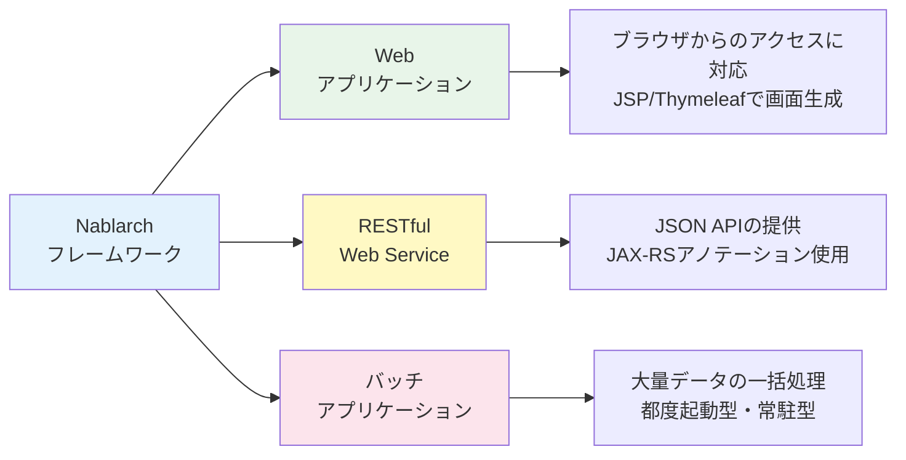
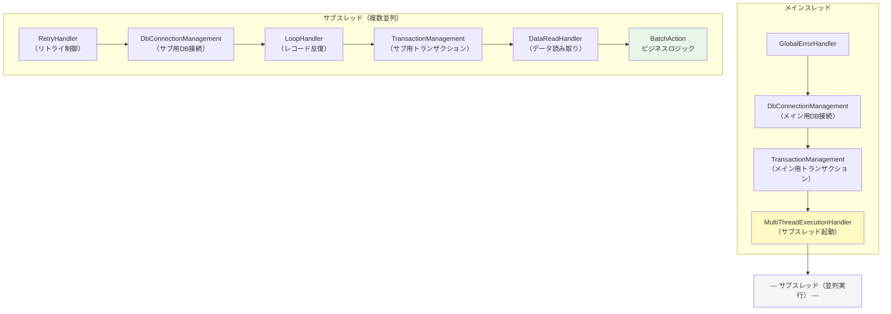

# Nablarch入門 --- Spring Bootエンジニアのためのフレームワーク理解ガイド

> **シリーズ**: [Nablarch MCP Server 専門家育成シリーズ](./INDEX.md) 第3A回
> **難易度**: 入門〜初級
> **所要時間**: 25分
> **前提記事**: [02. nablarch-mcp-serverの全体像](./02-project-overview.md)

---

## 目次

1. [この記事で学べること](#1-この記事で学べること)
2. [前提知識](#2-前提知識)
3. [Nablarchとは何か](#3-nablarchとは何か)
4. [Spring Bootとの比較 --- 似ている点・異なる点](#4-spring-bootとの比較----似ている点異なる点)
5. [Nablarchの基本用語](#5-nablarchの基本用語)
6. [Nablarchの3つのアプリケーションタイプ](#6-nablarchの3つのアプリケーションタイプ)
7. [ハンドラキュー --- Nablarch最大の特徴](#7-ハンドラキュー----nablarch最大の特徴)
8. [なぜAIがNablarchを正しく扱えないのか](#8-なぜaiがnablarchを正しく扱えないのか)
9. [まとめ --- 次の記事への橋渡し](#9-まとめ----次の記事への橋渡し)

---

## 1. この記事で学べること

この記事を読み終えると、以下のことが理解できるようになります。

| 学習目標 | 説明 |
|---------|------|
| **Nablarchの位置づけ** | どんなフレームワークで、誰がなぜ作ったのか |
| **Spring Bootとの違い** | 知っているSpring Bootと比較して、何が同じで何が違うのか |
| **基本用語** | ハンドラ、アクション、フォーム、コンポーネント定義XMLなど、Nablarch固有の言葉の意味 |
| **3つのアプリタイプ** | Web、RESTful Web Service、バッチの使い分け |
| **ハンドラキューの概念** | Nablarch最大の特徴であるリクエスト処理パイプライン |
| **AIが苦手な理由** | なぜClaude/ChatGPTはNablarchを正しく扱えないのか |

### この記事の位置づけ

前回（記事02）でnablarch-mcp-serverプロジェクトの全体像を学びました。記事02の中でNablarchの概要に触れましたが、「ハンドラキューって具体的に何？」「アクションクラスってSpring Bootのコントローラとどう違うの？」という疑問が残ったかもしれません。

この記事では、次のセットアップ（記事03）やハンズオン（記事04）に進む前に、**Nablarchの基礎用語と概念をしっかり理解する**ことを目的とします。ここで学ぶ用語は、今後のすべての記事で繰り返し登場します。

---

## 2. 前提知識

この記事を読むにあたり、以下の知識があるとスムーズです。

| 項目 | 必要レベル | 補足 |
|------|----------|------|
| **Javaの基礎** | 必須 | クラス、インターフェース、アノテーションがわかること |
| **Spring Bootの基本** | 推奨 | `@RestController`、`@Service`、`application.yml` の概念を知っていること |
| **Webアプリの基礎** | 推奨 | HTTPリクエスト/レスポンス、ルーティングの基本概念 |
| **XMLの読み方** | あると良い | Nablarchの設定ファイルはXML形式が多い |

Spring Bootを「使ったことはあるが詳しくはない」レベルでも問題ありません。比較のポイントは分かりやすく説明します。

---

## 3. Nablarchとは何か

### 3.1 概要

**Nablarch**（ナブラーク）は、**TIS株式会社**が開発・OSS公開している**Java用アプリケーションフレームワーク**です。名前の由来は "**N**ew **A**pplication **B**ase **L**ayer **ARCH**itecture" の頭文字です。

一言で言えば、**「銀行・保険・官公庁のような、絶対に止まってはいけない大規模システムを作るためのフレームワーク」** です。

### 3.2 歴史

| 時期 | 出来事 |
|------|-------|
| **2010年頃** | TIS社内で開発開始。社内の大規模SIプロジェクトで実績を蓄積 |
| **2016年** | OSSとしてGitHubで公開（Apache License 2.0） |
| **2019年** | Nablarch 5リリース。Java 8対応、各種改善 |
| **2023年** | Nablarch 6リリース。Jakarta EE 10対応、Java 17+ |
| **現在** | Nablarch 6系が最新。ミッションクリティカルシステムでの利用が継続中 |

### 3.3 どこで使われているか

NablarchはTIS株式会社とそのグループ企業（INTEC、クオリカなど）が手がけるSI（システムインテグレーション）プロジェクトで広く採用されています。

| 利用領域 | 具体例 |
|---------|-------|
| **金融** | 銀行の勘定系システム、保険の契約管理システム |
| **公共** | 自治体の住民情報システム、年金管理システム |
| **流通** | 大手小売業の在庫管理、ECサイトのバックエンド |
| **製造** | 生産管理システム、サプライチェーン管理 |

いずれも「24時間365日止まってはいけない」「大量のデータを正確に処理しなければならない」ミッションクリティカルなシステムです。

### 3.4 なぜ知名度が低いのか

GitHub Starsは約42。Spring Bootの約76,000と比較すると圧倒的に少ないです。その理由は明確です。

1. **日本のSI業界内で閉じた利用** --- 海外では全く使われていない
2. **公開情報の少なさ** --- QiitaやZennの記事が合計しても20件に満たない
3. **コミュニティの不在** --- Stack OverflowにNablarchタグは実質存在しない
4. **学習教材の限定** --- 公式ドキュメントとTIS社のFintan以外にほぼ情報がない

だからこそ、nablarch-mcp-serverのようなAI支援ツールが必要になるのですが、それは後のセクションで詳しく説明します。

---

## 4. Spring Bootとの比較 --- 似ている点・異なる点

Spring Bootを知っているエンジニアにとって、「Spring Bootとどう違うのか」が最も効率的な理解の入り口です。

### 4.1 アーキテクチャ比較図

```mermaid
graph TB
    subgraph "Spring Boot"
        SB_REQ[HTTPリクエスト] --> SB_FILTER[Filter Chain<br/>セキュリティ・ログなど]
        SB_FILTER --> SB_DS[DispatcherServlet]
        SB_DS --> SB_CTRL["@Controller / @RestController"]
        SB_CTRL --> SB_SVC["@Service<br/>ビジネスロジック"]
        SB_SVC --> SB_REPO["@Repository<br/>データアクセス"]
        SB_REPO --> SB_DB[(Database)]
    end

    subgraph "Nablarch"
        NB_REQ[HTTPリクエスト] --> NB_HQ["ハンドラキュー<br/>（Handler1 → Handler2 → ... → HandlerN）"]
        NB_HQ --> NB_ACT["アクションクラス<br/>ビジネスロジック"]
        NB_ACT --> NB_DAO["Universal DAO<br/>データアクセス"]
        NB_DAO --> NB_DB[(Database)]
    end

    style SB_FILTER fill:#e8f5e9
    style NB_HQ fill:#e3f2fd
    style SB_CTRL fill:#e8f5e9
    style NB_ACT fill:#e3f2fd
```



### 4.2 似ている点

| 観点 | Spring Boot | Nablarch | 共通点 |
|------|------------|---------|--------|
| **言語** | Java | Java | 同じJava（17+推奨） |
| **DI（依存性注入）** | Spring IoC Container | SystemRepository | コンポーネントを外部から注入する考え方は同じ |
| **バリデーション** | Bean Validation（`@Valid`） | Bean Validation（`@Required`, `@Length`） | Jakarta Bean Validationがベース |
| **DB操作** | Spring Data JPA / JdbcTemplate | Universal DAO | エンティティクラス+アノテーションでDB操作 |
| **テスト** | Spring Test + JUnit 5 | Nablarch Testing Framework + JUnit 5 | JUnit 5ベースのテスト |
| **ルーティング** | `@RequestMapping`, `@GetMapping` | `routes.xml` / `PackageMapping` | URLをアクション（コントローラ）にマッピング |

### 4.3 異なる点

ここからが重要です。Nablarchには**Spring Bootとは根本的に異なる設計思想**があります。

| 観点 | Spring Boot | Nablarch | 違いのポイント |
|------|------------|---------|--------------|
| **設定方式** | アノテーション中心（`@Bean`, `@Configuration`） | **XML中心**（`component-configuration.xml`） | Nablarchの設定は基本的にXMLファイルで行う |
| **DIの仕組み** | `@Autowired`でフィールド注入 | `SystemRepository.get("name")`で明示取得 | Nablarchはサービスロケータパターンが主流 |
| **処理パイプライン** | Filter → DispatcherServlet → Controller | **ハンドラキュー**（全アプリタイプ共通） | Nablarch最大の特徴。次のセクションで詳説 |
| **自動設定** | `@EnableAutoConfiguration`で自動構成 | **全て手動XML設定** | Nablarchに「自動設定」は存在しない |
| **起動方式** | 組み込みTomcat（`java -jar`） | **WARデプロイ**（外部AP サーバー） | Nablarchはアプリケーションサーバーにデプロイする |
| **コミュニティ** | 世界最大級のJavaコミュニティ | TISグループ中心 | 学習リソースの量が圧倒的に異なる |

### 4.4 最大の違い --- 「宣言的」vs「明示的」

Spring Bootは**「宣言的」**な設計思想です。アノテーションを付けるだけで、フレームワークが多くのことを自動でやってくれます。

```java
// Spring Boot: アノテーションを付ければ自動でHTTPエンドポイントになる
@RestController
@RequestMapping("/api/users")
public class UserController {

    @Autowired
    private UserService userService;

    @GetMapping("/{id}")
    public ResponseEntity<User> findById(@PathVariable Long id) {
        return ResponseEntity.ok(userService.findById(id));
    }
}
```

一方、Nablarchは**「明示的」**な設計思想です。何が起きるかをXMLとコードで明確に定義します。

```java
// Nablarch: アクションクラス。リクエストの処理を明示的に記述する
public class UserAction {

    public HttpResponse doFind(HttpRequest request, ExecutionContext context) {
        String userId = request.getParam("userId")[0];
        User user = UniversalDao.findById(User.class, Long.parseLong(userId));
        context.setRequestScopedVar("user", user);
        return new HttpResponse("/WEB-INF/view/user/detail.jsp");
    }
}
```

```xml
<!-- Nablarch: ルーティング設定をXMLで明示的に定義 -->
<routes>
  <get path="/api/users/:userId" to="User#doFind"/>
</routes>
```

Spring Bootに慣れていると「なぜこんなに手動で書くの？」と感じるかもしれません。しかし、Nablarchの設計思想は**「暗黙の挙動を排除し、すべてを見える化する」** ことにあります。ミッションクリティカルなシステムでは、「何が起きるかフレームワークの内部実装を知らないとわからない」という状態は許されないのです。

---

## 5. Nablarchの基本用語

ここからはNablarchの基本用語を一つずつ説明します。記事04（ハンズオン）以降で頻繁に登場するので、ここでしっかり押さえておきましょう。

### 5.1 ハンドラ（Handler）

**ハンドラ**は、Nablarchのリクエスト処理パイプラインを構成する**処理の単位**です。

Spring Bootでいう**Servlet Filter**や**HandlerInterceptor**に近い概念ですが、Nablarchではこの「ハンドラ」がアーキテクチャの中心です。

```java
// ハンドラの基本インターフェース
public interface Handler<I, O> {
    O handle(I input, ExecutionContext context);
}
```

すべてのハンドラは `Handler<I, O>` インターフェースを実装します。入力 `I` を受け取り、出力 `O` を返すシンプルな構造です。

**標準ハンドラの例**:

| ハンドラ名 | 役割 | Spring Boot での近い概念 |
|-----------|------|----------------------|
| `GlobalErrorHandler` | 未処理の例外をキャッチ | `@ExceptionHandler` / `@ControllerAdvice` |
| `DbConnectionManagementHandler` | DB接続の取得と解放 | Spring のコネクションプール管理（自動） |
| `TransactionManagementHandler` | トランザクションの開始/コミット/ロールバック | `@Transactional` |
| `HttpCharacterEncodingHandler` | 文字エンコーディング設定 | `CharacterEncodingFilter` |
| `ThreadContextHandler` | スレッドコンテキスト（ユーザーID等）の設定 | `SecurityContextHolder`（Spring Security） |
| `SessionStoreHandler` | セッション管理 | `HttpSession`（自動管理） |

### 5.2 アクション（Action）

**アクション**は、**ビジネスロジックを記述するクラス**です。ハンドラキューの最後に位置し、実際の業務処理を実行します。

Spring Bootでいう **`@Controller`** や **`@RestController`** に相当します。

```java
// Webアクションの例
public class UserSearchAction {

    @InjectForm(form = UserSearchForm.class, prefix = "form")
    @OnError(type = ApplicationException.class,
             path = "/WEB-INF/view/user/search.jsp")
    public HttpResponse doSearch(HttpRequest request, ExecutionContext context) {
        UserSearchForm form = context.getRequestScopedVar("form");
        // ビジネスロジック（検索処理）
        return new HttpResponse("/WEB-INF/view/user/searchResult.jsp");
    }
}
```

**Spring Bootとの対応関係**:

| Nablarch | Spring Boot |
|----------|------------|
| `UserSearchAction` | `UserSearchController` |
| `doSearch` メソッド | `@GetMapping("/search")` が付いたメソッド |
| `HttpRequest` | `HttpServletRequest` / `@RequestParam` |
| `HttpResponse` | `ResponseEntity` / `ModelAndView` |
| `ExecutionContext` | `Model` + `HttpSession`（複合的） |

### 5.3 フォーム（Form）

**フォーム**は、**HTTPリクエストのパラメータを受け取るための入れ物**です。バリデーション（入力チェック）もここに定義します。

Spring Bootでいう **`@RequestBody` で受け取るDTOクラス** に相当します。

```java
// フォームクラスの例
public class UserRegistrationForm implements Serializable {

    @Required                        // 必須チェック
    @Length(max = 50)                // 文字数チェック
    private String userName;

    @Required
    @MailAddress                     // メールアドレス形式チェック
    private String email;

    @NumberRange(min = 0, max = 150) // 数値範囲チェック
    private String age;

    @SystemChar(charsetDef = "全角文字")  // 文字種チェック（Nablarch独自）
    private String fullName;

    // getter/setter
}
```

Spring Bootとの違いとして、Nablarchには `@SystemChar`（文字種チェック）のような**日本のビジネスシステム特有のバリデーション**が標準で用意されています。全角カタカナ、半角英数字といった文字種チェックは、日本の業務システムでは非常によく使います。

### 5.4 コンポーネント定義XML

**コンポーネント定義XML**は、Nablarchの**DIコンテナ設定ファイル**です。アプリケーションで使うコンポーネント（オブジェクト）の生成と依存関係をXMLで記述します。

Spring Bootでいう **`@Configuration` + `@Bean`** の組み合わせ、あるいは古い時代の**Spring XMLコンフィグ**に相当します。

```xml
<?xml version="1.0" encoding="UTF-8"?>
<component-configuration
    xmlns="http://tis.co.jp/nablarch/component-configuration">

  <!-- データベース接続の定義 -->
  <component name="dbConnectionManagementHandler"
             class="nablarch.common.handler.DbConnectionManagementHandler">
    <property name="connectionFactory" ref="connectionFactory" />
  </component>

  <!-- トランザクション管理の定義 -->
  <component name="transactionManagementHandler"
             class="nablarch.common.handler.TransactionManagementHandler">
    <property name="dbConnectionManagementHandler"
              ref="dbConnectionManagementHandler" />
  </component>

  <!-- 設定値の外部ファイル読み込み -->
  <config-file file="common.config" />
  <config-file file="env.config" />

</component-configuration>
```

**Spring Bootとの対比**:

```java
// Spring Boot なら @Configuration + @Bean で書く
@Configuration
public class AppConfig {

    @Bean
    public DataSource dataSource() {
        // ... データソース定義
    }

    @Bean
    @Transactional
    public PlatformTransactionManager transactionManager(DataSource ds) {
        return new DataSourceTransactionManager(ds);
    }
}
```

Nablarchでは上記のようなJavaコードによる設定の代わりに、**すべてをXMLで記述**します。Spring Bootの `application.yml` / `application.properties` に相当するものは、Nablarchでは `.config` ファイルと呼ばれる設定値ファイルです。

### 5.5 SystemRepository

**SystemRepository**は、コンポーネント定義XMLで定義したオブジェクトを取得するための**サービスロケータ**です。

Spring Bootの `@Autowired` によるDIとは異なり、Nablarchでは**明示的にコンポーネントを取得**します。

```java
// Nablarch: SystemRepositoryからコンポーネントを取得
MailSender mailSender = SystemRepository.get("mailSender");
String dbUrl = SystemRepository.getString("db.url");

// Spring Boot: @Autowiredで自動注入
@Autowired
private MailSender mailSender;

@Value("${db.url}")
private String dbUrl;
```

### 5.6 Universal DAO

**Universal DAO**は、Nablarchのデータベースアクセスライブラリです。JPAアノテーション付きのエンティティクラスを使って、CRUD操作を簡潔に記述できます。

Spring Bootでいう **Spring Data JPA** に近い存在です。

```java
// エンティティクラス（Spring Data JPAとほぼ同じ記法）
@Entity
@Table(name = "USER_TABLE")
public class User {
    @Id
    @Column(name = "USER_ID")
    public Long userId;

    @Column(name = "USER_NAME", nullable = false)
    public String userName;

    @Version
    @Column(name = "VERSION")
    public Long version;
}

// CRUD操作
EntityList<User> all = UniversalDao.findAll(User.class);   // 全件取得
User user = UniversalDao.findById(User.class, 1L);          // 主キー検索
UniversalDao.insert(user);                                   // 挿入
UniversalDao.update(user);                                   // 更新
UniversalDao.delete(user);                                   // 削除
```

Spring Data JPAとの違いは、Nablarchでは**リポジトリインターフェースを定義しない**こと、そして複雑なクエリは**外部SQLファイル**に書くことです。

```sql
-- src/main/resources/com/example/entity/User.sql
-- 外部SQLファイルにSQL文を定義し、SQL_IDで参照する

FIND_BY_NAME =
SELECT
    USER_ID, USER_NAME, EMAIL
FROM
    USER_TABLE
WHERE
    USER_NAME LIKE :%userName%
```

```java
// JavaからSQL_IDで呼び出す
Map<String, String> condition = Map.of("userName", "%田中%");
EntityList<User> users = UniversalDao.findAllBySqlFile(
    User.class, "FIND_BY_NAME", condition);
```

### 5.7 用語まとめ

ここまでの用語を一覧にまとめます。

| Nablarch用語 | 意味 | Spring Boot対応 |
|-------------|------|----------------|
| **ハンドラ** | リクエスト処理パイプラインの構成要素 | Servlet Filter / HandlerInterceptor |
| **アクション** | ビジネスロジックを記述するクラス | @Controller / @RestController |
| **フォーム** | リクエストパラメータの受け取りとバリデーション | @RequestBody DTO / @Valid |
| **コンポーネント定義XML** | DIコンテナの設定ファイル | @Configuration + @Bean |
| **SystemRepository** | コンポーネント取得のサービスロケータ | @Autowired（自動注入） |
| **Universal DAO** | エンティティベースのDB操作ライブラリ | Spring Data JPA |
| **外部SQLファイル** | SQL文をJavaコードから分離して管理 | @Query / JPQL / ネイティブクエリ |
| **ハンドラキュー** | ハンドラを直列に連結したパイプライン | Filter Chain（に近いが、より包括的） |
| **.config ファイル** | アプリケーション設定値 | application.yml / application.properties |

---

## 6. Nablarchの3つのアプリケーションタイプ

Nablarchは、一つのフレームワークで**3つの異なるアプリケーションタイプ**を構築できます。Spring Bootでも似たことは可能ですが、Nablarchではアプリケーションタイプごとに**専用のハンドラ構成**が用意されている点が特徴です。

### 6.1 アプリケーションタイプ一覧



### 6.2 Webアプリケーション

ブラウザからのHTTPリクエストを受け取り、HTML画面を返すアプリケーションです。

| 項目 | 内容 |
|------|------|
| **用途** | 業務画面、管理画面、入力フォーム |
| **ビュー技術** | JSP（標準）、Thymeleaf（アダプタ利用） |
| **アクションクラス** | `HttpResponse` を返す通常のJavaクラス |
| **特徴的な機能** | セッション管理、二重送信防止、画面遷移制御 |
| **Spring Boot対応** | Spring MVC（`@Controller` + Thymeleaf/JSP） |

```java
// Webアプリのアクション例
public class UserRegistrationAction {

    @InjectForm(form = UserRegistrationForm.class, prefix = "form")
    @OnError(type = ApplicationException.class,
             path = "/WEB-INF/view/user/input.jsp")
    public HttpResponse doRegister(HttpRequest request, ExecutionContext context) {
        UserRegistrationForm form = context.getRequestScopedVar("form");
        User user = BeanUtil.createAndCopy(User.class, form);
        UniversalDao.insert(user);
        return new HttpResponse("redirect:///action/user/complete");
    }
}
```

### 6.3 RESTful Web Service

JSON形式のAPIを提供するアプリケーションです。フロントエンド（React、Vue.jsなど）やモバイルアプリのバックエンドとして使います。

| 項目 | 内容 |
|------|------|
| **用途** | REST API、SPAのバックエンド、モバイルAPI |
| **データ形式** | JSON（Jackson によるシリアライズ/デシリアライズ） |
| **アクションクラス** | JAX-RSアノテーション（`@GET`, `@POST`, `@Produces`）を使用 |
| **特徴的な機能** | BodyConvertHandler によるJSON変換、バリデーション |
| **Spring Boot対応** | `@RestController` + Jackson |

```java
// RESTアクションの例
@Produces(MediaType.APPLICATION_JSON)
@Consumes(MediaType.APPLICATION_JSON)
public class UsersAction {

    @GET
    public EntityList<User> findAll(HttpRequest request, ExecutionContext context) {
        return UniversalDao.findAll(User.class);
    }

    @POST
    @Valid
    public HttpResponse create(HttpRequest request, ExecutionContext context) {
        UserForm form = JaxRsHttpRequest.from(request)
            .getRequest().readEntity(UserForm.class);
        User user = BeanUtil.createAndCopy(User.class, form);
        UniversalDao.insert(user);
        return new HttpResponse(HttpResponse.Status.CREATED.getStatusCode());
    }
}
```

### 6.4 バッチアプリケーション

大量のデータを一括処理するアプリケーションです。銀行の夜間バッチ処理や、月次レポート生成などに使います。

| 項目 | 内容 |
|------|------|
| **用途** | 夜間バッチ、月次集計、データ移行、メール一括送信 |
| **動作方式** | 都度起動型（1回実行して終了）/ 常駐型（常時稼働してキュー監視） |
| **アクションクラス** | `BatchAction<T>` を継承、`createReader` と `handle` を実装 |
| **特徴的な機能** | マルチスレッド実行、データリーダーによるレコード単位処理、リトライ |
| **Spring Boot対応** | Spring Batch |

```java
// バッチアクションの例
public class UserImportAction extends BatchAction<SqlRow> {

    @Override
    public DataReader<SqlRow> createReader(ExecutionContext ctx) {
        // 処理対象データの読み取り方法を定義
        return new DatabaseRecordReader()
            .setStatement(getSqlPStatement("SELECT_UNPROCESSED"));
    }

    @Override
    public Result handle(SqlRow inputData, ExecutionContext ctx) {
        // 1レコードずつ処理（これがマルチスレッドで並列実行される）
        User user = new User();
        user.setUserName(inputData.getString("USER_NAME"));
        UniversalDao.insert(user);
        return new Result.Success();
    }
}
```

### 6.5 アプリケーションタイプ比較表

| 項目 | Web | REST | バッチ |
|------|-----|------|-------|
| **入力** | HTTPリクエスト（ブラウザ） | HTTPリクエスト（API） | DB / ファイル |
| **出力** | HTML画面 | JSON / XML | DB更新 / ファイル出力 |
| **マルチスレッド** | アプリサーバーが管理 | アプリサーバーが管理 | ハンドラキューで明示制御 |
| **トランザクション** | リクエスト単位 | リクエスト単位 | レコード単位（柔軟に設定可能） |
| **ハンドラキュー** | Web専用構成 | REST専用構成 | バッチ専用構成（メイン+サブスレッド） |

---

## 7. ハンドラキュー --- Nablarch最大の特徴

### 7.1 ハンドラキューとは

**ハンドラキュー**は、Nablarchの**最も重要な概念**です。これを理解することがNablarch理解の鍵と言っても過言ではありません。

ハンドラキューとは、**複数のハンドラを直列に連結したパイプライン（処理の流れ）** のことです。リクエストがキューの先頭から入り、各ハンドラを順番に通過してアクション（業務処理）に到達します。アクションの処理が終わると、レスポンスが逆順にハンドラを通って返されます。


### 7.2 Spring Bootとの処理フロー比較

Spring Bootにもリクエストの処理パイプラインはありますが、大きな違いがあります。

**Spring Boot** では、フレームワークが多くの処理を**自動的に**行います。開発者は `@Transactional` を付けるだけでトランザクション管理が適用され、`@Autowired` でDB接続が自動注入されます。パイプラインの構成は「暗黙的」です。

**Nablarch** では、これらの処理をすべて**ハンドラキューのXML定義で明示的に**構成します。どのハンドラがどの順序で実行されるか、すべてが設定ファイルに書かれています。

```xml
<!-- Nablarch: ハンドラキューのXML定義（Webアプリ用） -->
<component name="webFrontController"
           class="nablarch.fw.web.servlet.WebFrontController">
  <property name="handlerQueue">
    <list>
      <!-- 1. 文字エンコーディング -->
      <component class="nablarch.fw.web.handler.HttpCharacterEncodingHandler">
        <property name="defaultEncoding" value="UTF-8" />
      </component>
      <!-- 2. 全例外キャッチ -->
      <component class="nablarch.fw.handler.GlobalErrorHandler" />
      <!-- 3. レスポンス構築 -->
      <component class="nablarch.fw.web.handler.HttpResponseHandler" />
      <!-- 4. セキュリティヘッダー -->
      <component class="nablarch.fw.web.handler.SecureHandler" />
      <!-- 5. セッション管理 -->
      <component-ref name="sessionStoreHandler" />
      <!-- 6. スレッドコンテキスト設定 -->
      <component-ref name="threadContextHandler" />
      <!-- 7. DB接続管理 -->
      <component-ref name="dbConnectionManagementHandler" />
      <!-- 8. トランザクション管理 -->
      <component-ref name="transactionManagementHandler" />
      <!-- 9. ルーティング -->
      <component-ref name="packageMapping" />
    </list>
  </property>
</component>
```

この設定を見れば、リクエストがどのような順序で処理されるか一目瞭然です。これがNablarchの「**すべてを見える化する**」設計思想です。

### 7.3 ハンドラの順序制約

ハンドラキューの順序には**厳密なルール**があります。順序を間違えると、アプリケーションが正しく動作しません。

| 制約 | 説明 | 例 |
|------|------|-----|
| **must_be_outer** | キューの外殻（先頭付近）に配置必須 | `GlobalErrorHandler`（全例外キャッチ） |
| **must_be_inner** | キューの内殻（末尾付近）に配置必須 | `PackageMapping`（ルーティング） |
| **must_before** | 特定のハンドラより前に配置必須 | `DbConnection` は `Transaction` より前 |
| **must_after** | 特定のハンドラより後に配置必須 | `Transaction` は `DbConnection` より後 |

例えば、`DbConnectionManagementHandler` が `TransactionManagementHandler` より**後**に来てしまうと、DB接続がないのにトランザクションを開始しようとしてエラーになります。

これらの順序制約は、nablarch-mcp-serverの `validate_handler_queue` ツールで自動チェックできます。

### 7.4 バッチのハンドラキュー --- メインスレッドとサブスレッド

バッチアプリケーションのハンドラキューは、WebやRESTと比べてさらに複雑です。**メインスレッド**と**サブスレッド**の2段構成になっています。



**ポイント**:
- メインスレッドが `MultiThreadExecutionHandler` でサブスレッドを起動する
- サブスレッドはそれぞれ独自のDB接続とトランザクションを持つ
- `LoopHandler` がデータを1レコードずつ読み取り、`BatchAction.handle()` を繰り返し呼び出す
- レコード単位でトランザクションをコミット/ロールバックできる

この構造により、100万件のデータを処理するバッチでも、途中でエラーが発生した場合に**エラーの1件だけロールバックして残りは続行**といった柔軟な制御が可能になります。

### 7.5 なぜハンドラキューが重要なのか

ハンドラキューの意義をまとめると、以下の3点です。

1. **処理の透明性**: 何がどの順序で実行されるか、XMLを見れば全てわかる
2. **柔軟な構成変更**: ハンドラの追加・削除・順序変更がXML設定だけで可能（コード変更不要）
3. **横断的関心事の分離**: ログ、セキュリティ、トランザクション管理などが業務ロジックから完全に分離される

Spring Bootでは `@Transactional` や `@Autowired` で「何が起きるか」がアノテーションの裏に隠れていますが、Nablarchではすべてが**ハンドラキューのXML定義**として表現されています。この透明性こそが、ミッションクリティカルシステムで求められる品質です。

---

## 8. なぜAIがNablarchを正しく扱えないのか

### 8.1 AIの学習データの問題（復習）

記事02で説明した通り、AIが持つ知識はインターネット上のデータに基づいています。Nablarchに関する情報は極めて少ないため、AIは正確な回答ができません。ここでは、Nablarch固有の用語を学んだ今だからこそ理解できる、**より具体的な問題**を見ていきましょう。

### 8.2 具体的な失敗例

**失敗例1: ハンドラキューの順序を間違える**

AIにNablarchのハンドラキュー構成を聞くと、ハンドラの順序制約を知らないため、`TransactionManagementHandler` を `DbConnectionManagementHandler` の前に配置してしまうことがあります。これではDB接続なしにトランザクションを開始することになり、実行時にエラーが発生します。

**失敗例2: Spring Bootの書き方で回答する**

「Nablarchでユーザー登録APIを作って」と聞くと、AIは `@RestController` + `@Autowired` + `@Transactional` というSpring Bootの書き方で回答することがあります。Nablarchにはこれらのアノテーションは存在しません。

**失敗例3: コンポーネント定義XMLを知らない**

AIにNablarchのDI設定を聞くと、`@Configuration` + `@Bean` で回答してしまいます。Nablarchでは `component-configuration.xml` にXMLで記述する必要がありますが、AIはこの形式を知りません。

**失敗例4: 存在しないAPIを提案する**

「Nablarchでメール送信する方法は？」と聞くと、Spring Bootの `JavaMailSender` を提案されることがあります。Nablarchでは `MailUtil` と `FreeTextMailContext` / `TemplateMailContext` を使いますが、AIはこのAPIの存在を知りません。

### 8.3 問題の本質

これらの失敗が起きる根本原因は以下の3点です。

| 原因 | 説明 |
|------|------|
| **学習データの絶対的不足** | Nablarchの情報がインターネット上に極めて少ない |
| **類似フレームワークとの混同** | AIがSpring BootやJakarta EEの知識で「推測」してしまう |
| **独自概念の理解不足** | ハンドラキューやコンポーネント定義XMLなど、他のフレームワークにない概念をAIが把握していない |

### 8.4 nablarch-mcp-serverが解決すること

この問題を解決するのが、nablarch-mcp-serverです。次の記事（03: セットアップガイド）で環境を構築し、記事04（ハンズオン）で実際にAIにNablarchの知識を与えて開発する方法を体験します。

nablarch-mcp-serverは以下のように問題を解決します。

| 問題 | 解決策 | 対応ツール |
|------|-------|----------|
| ハンドラキューの順序ミス | **ハンドラキュー検証ツール** | `validate_handler_queue` |
| ハンドラ構成がわからない | **ハンドラキュー設計ツール** | `design_handler_queue` |
| Spring Bootの書き方で回答 | **正確なNablarch知識の提供** | `search_api`, `semantic_search` |
| 存在しないAPIを提案 | **Nablarch APIリファレンス** | `nablarch://api/{module}/{class}` |
| 設計パターンを知らない | **設計パターン推薦** | `recommend_pattern` |
| コード生成が不正確 | **Nablarch準拠コード生成** | `generate_code`, `generate_test` |

---

## 9. まとめ --- 次の記事への橋渡し

### 9.1 この記事で学んだこと

この記事では、Nablarchフレームワークの基礎を体系的に学びました。

- **Nablarchとは**: TIS社が開発した、ミッションクリティカルシステム向けJavaフレームワーク
- **Spring Bootとの比較**: 「宣言的（Spring Boot）」vs「明示的（Nablarch）」という設計思想の違い
- **基本用語**: ハンドラ、アクション、フォーム、コンポーネント定義XML、SystemRepository、Universal DAO
- **3つのアプリタイプ**: Web、RESTful Web Service、バッチ
- **ハンドラキュー**: Nablarch最大の特徴。処理パイプラインをXMLで明示的に構成する
- **AIの課題**: 学習データ不足とフレームワーク混同で、Nablarchを正しく扱えない

### 9.2 用語チェックリスト

次の記事に進む前に、以下の用語をざっくりと説明できるか確認してみましょう。

- [ ] **ハンドラ** --- リクエスト処理パイプラインの1つの処理単位
- [ ] **ハンドラキュー** --- ハンドラを直列に連結したパイプライン
- [ ] **アクション** --- ビジネスロジックを記述するクラス（Spring Bootのコントローラに相当）
- [ ] **フォーム** --- リクエストパラメータの受け取りとバリデーション用クラス
- [ ] **コンポーネント定義XML** --- DIコンテナの設定ファイル（XMLで記述）
- [ ] **SystemRepository** --- コンポーネントを取得するためのサービスロケータ
- [ ] **Universal DAO** --- エンティティベースのDB操作ライブラリ

### 9.3 次の記事で学ぶこと

次の記事（第3回: ゼロから始めるセットアップガイド）では、nablarch-mcp-serverの**環境構築と動作確認**を行います。

- Java 17、Maven、PostgreSQLのインストール
- nablarch-mcp-serverのビルドと起動
- Claude Code / Claude Desktop への接続設定
- MCP Inspectorを使った動作確認

この記事で学んだNablarchの基礎知識があれば、セットアップガイドの中で登場する「ハンドラキュー検証」や「アクション生成」といった機能の意味がスムーズに理解できるはずです。

---

## ナビゲーション

- **[<- 前の記事: 02-nablarch-mcp-serverの全体像](02-project-overview.md)**
- **[-> 次の記事: 03-ゼロから始めるセットアップガイド](03-setup-guide.md)**
- **[記事一覧に戻る](INDEX.md)**

---

> **お問い合わせ**
> nablarch-mcp-serverについてのご質問やご相談は、GitHubリポジトリのIssueまたはDiscussionsをご利用ください。
