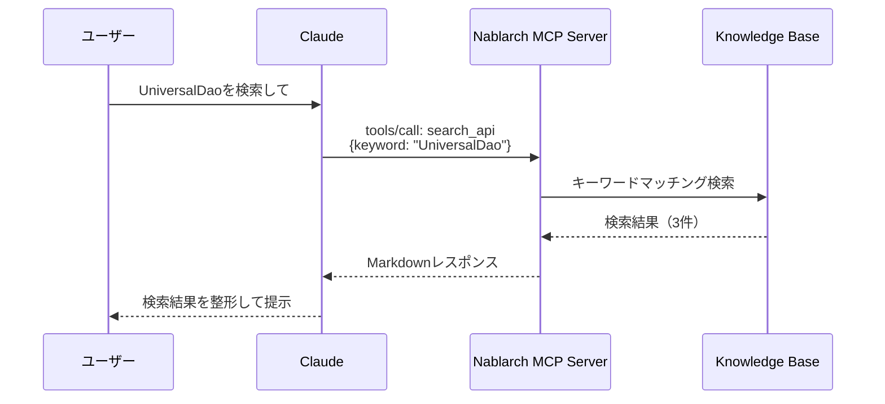
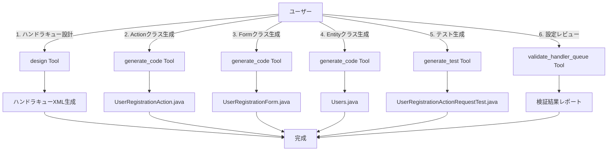

# 使ってみよう — 10 Tools × 8 Resources × 6 Promptsの実践ガイド

> **シリーズ**: Nablarch MCP Server 専門家育成シリーズ 第4回
> **対象読者**: Nablarch開発者、AIツールユーザー
> **前提知識**: 記事03（セットアップ完了）
> **所要時間**: 約30分

---

## 目次

1. [この記事で学べること](#1-この記事で学べること)
2. [Toolsを使ってみよう](#2-toolsを使ってみよう)
3. [Resourcesを使ってみよう](#3-resourcesを使ってみよう)
4. [Promptsを使ってみよう](#4-promptsを使ってみよう)
5. [実践シナリオ: Nablarch Webアプリを作ってみよう](#5-実践シナリオ-nablarch-webアプリを作ってみよう)
6. [まとめ](#6-まとめ)

---

## 1. この記事で学べること

Nablarch MCP Serverが提供する全24種のMCP機能（10 Tools + 8 Resources + 6 Prompts）を実際に使ってみます。

### 学習内容

- ✅ **10 Tools**: API検索、ハンドラキュー検証、RAG検索、コード生成、テスト生成、最適化、パターン推薦、移行分析
- ✅ **8 Resources**: ハンドラカタログ、開発ガイド、APIリファレンス、設計パターン、アンチパターン、設定テンプレート、サンプルコード、バージョン情報
- ✅ **6 Prompts**: ハンドラキュー設計、アクション作成、設定レビュー、ハンドラ解説、移行ガイド、ベストプラクティス

### 前提知識

本記事は、記事03「セットアップガイド」でMCPサーバーのセットアップが完了していることを前提とします。以下の状態を想定しています。

- Claude Desktop/Claude Code/VS Code等のAIツールにMCPサーバーが接続済み
- AIツール上で `nablarch` MCPサーバーが認識されている
- Java 17以上、Maven 3.9.x（オプション）がインストール済み

---

## 2. Toolsを使ってみよう

ToolsはAIが実行できる関数です。AIに「〜を検索して」「〜を検証して」と依頼すると、AIがToolを呼び出して結果を取得します。

### 2.1 search_api Tool — API検索

Nablarch知識ベースをキーワード検索し、API・ハンドラ・モジュール・設計パターン・エラー情報を返します。

#### こう聞くと

```
UniversalDaoを検索して
```

#### こう返ってくる

```markdown
検索結果: "UniversalDao"
件数: 3件

### [APIパターン] universal-dao (library)
UniversalDaoを使ったCRUD操作
FQCN: nablarch.common.dao.UniversalDao

### [モジュール] nablarch-common-dao (library)
ユニバーサルDAO

### [設計パターン] dao-pattern (data-access)
データアクセスオブジェクトパターン
```

#### Tool呼び出しの流れ



#### パラメータ

| パラメータ | 型 | 必須 | 説明 |
|-----------|-----|------|------|
| `keyword` | String | ○ | 検索キーワード（クラス名、メソッド名、概念） |
| `category` | String | - | カテゴリフィルタ: handler, library, web, batch, rest, messaging |

---

### 2.2 validate_handler_queue Tool — ハンドラキュー検証

ハンドラキューXML設定を検証し、順序制約・必須ハンドラの有無をチェックします。

#### こう聞くと

```
以下のハンドラキューを検証して:

<list name="handlerQueue">
  <component class="nablarch.fw.web.handler.HttpResponseHandler"/>
  <component class="nablarch.common.handler.TransactionManagementHandler"/>
  <component class="nablarch.common.handler.DbConnectionManagementHandler"/>
</list>
```

#### こう返ってくる

```markdown
## ハンドラキュー検証結果

検証対象: web アプリケーション
ハンドラ数: 3

### 検証結果: ❌ エラーあり

#### エラー
- DbConnectionManagementHandler は TransactionManagementHandler より前に配置すべきです
  理由: トランザクション管理にはDB接続が必要

#### 警告
- GlobalErrorHandler が欠落しています（推奨）
```

#### パラメータ

| パラメータ | 型 | 必須 | 説明 |
|-----------|-----|------|------|
| `handlerQueueXml` | String | ○ | ハンドラキューXML設定内容 |
| `applicationType` | String | ○ | アプリケーションタイプ: web, rest, batch, messaging |

---

### 2.3 semantic_search Tool — RAGセマンティック検索

RAGエンジンによるセマンティック検索。自然言語クエリでNablarchドキュメント・コード・Javadocを横断検索します。

#### こう聞くと

```
Nablarchでトランザクション管理を設定する方法
```

#### こう返ってくる

```markdown
## 検索結果: "Nablarchでトランザクション管理を設定する方法"
モード: hybrid | 結果数: 3件 | 検索時間: 245ms

---

### 結果 1 (スコア: 0.892)
**ソース**: nablarch-document | web | nablarch-common-jdbc
**URL**: https://nablarch.github.io/docs/...

TransactionManagementHandlerを使用してトランザクション境界を設定します。
ハンドラキュー内にTransactionManagementHandlerを配置し、
DbConnectionManagementHandlerの後に配置してください...

---

### 結果 2 (スコア: 0.856)
**ソース**: github | nablarch-example-web
**URL**: https://github.com/nablarch/nablarch-example-web/...

```xml
<component class="nablarch.common.handler.TransactionManagementHandler">
  <property name="dbTransactionManager" ref="transactionManager"/>
</component>
```
```

#### パラメータ

| パラメータ | 型 | 必須 | デフォルト | 説明 |
|-----------|-----|------|-----------|------|
| `query` | String | ○ | - | 検索クエリ（自然言語） |
| `appType` | String | - | null | アプリ種別フィルタ: web, rest, batch, messaging |
| `source` | String | - | null | データソースフィルタ: nablarch-document, github, fintan, javadoc |
| `topK` | Integer | - | 5 | 返却する結果数（1-50） |
| `mode` | String | - | hybrid | 検索モード: hybrid, vector, keyword |

---

### 2.4 design Tool — ハンドラキュー設計

アプリケーションタイプと要件に基づいて、最適なハンドラキューXML設定を自動生成します。

#### こう聞くと

```
webアプリケーション用のハンドラキューを設計して。
要件: csrf対策、セッション管理、セキュリティヘッダー
```

#### こう返ってくる

```markdown
## ハンドラキュー設計結果

**アプリタイプ**: web
**ハンドラ数**: 14
**適用要件**: csrf, session, security

### ハンドラ構成

| # | ハンドラ | 説明 | 必須 |
|---|----------|------|------|
| 1 | StatusCodeConvertHandler | ステータスコード変換 | ○ |
| 2 | HttpResponseHandler | HTTPレスポンス処理 | ○ |
| 3 | GlobalErrorHandler | グローバルエラー処理 | ○ |
| 4 | SecureHandler | セキュリティヘッダー付与 | - |
| 5 | HttpCharacterEncodingHandler | 文字エンコーディング | ○ |
...

### XML設定

```xml
<!-- webアプリケーション用ハンドラキュー設定 -->
<list name="handlerQueue">
  <!-- ステータスコード変換 -->
  <component class="nablarch.fw.handler.StatusCodeConvertHandler"/>
  <!-- HTTPレスポンス処理 -->
  <component class="nablarch.fw.web.handler.HttpResponseHandler"/>
  <!-- セキュリティヘッダー -->
  <component class="nablarch.fw.web.handler.SecureHandler"/>
  <!-- CSRF対策 -->
  <component class="nablarch.fw.web.handler.CsrfTokenVerificationHandler"/>
  ...
</list>
```
```

#### パラメータ

| パラメータ | 型 | 必須 | デフォルト | 説明 |
|-----------|-----|------|-----------|------|
| `appType` | String | ○ | - | アプリケーションタイプ: web, rest, batch, messaging |
| `requirements` | String | - | null | オプション要件（カンマ区切り）: session, csrf, multipart, async, security, logging |
| `includeComments` | Boolean | - | true | 生成XMLにコメントを含めるか |

---

### 2.5 generate_code Tool — コード生成

Nablarch準拠のJavaコード（Action、Form、SQL定義、Entity、Handler、Interceptor）を生成します。

#### こう聞くと

```
UserRegistrationActionクラスを生成して。
- app_type: web
- routing: /users/register
- methods: GET, POST
```

#### こう返ってくる

```markdown
## 生成結果: UserRegistration (web/action)

### 適用されたNablarch規約
- パッケージ構成: {project}.app.action
- リクエストパラメータはFormクラスで受け取る
- 単一責任: 1Action = 1ユースケース

### 必要な依存モジュール
- nablarch-fw-web
- nablarch-common-validation

---

### ファイル 1: UserRegistrationAction.java

```java
package com.example.app.action;

import nablarch.core.message.ApplicationException;
import nablarch.fw.ExecutionContext;
import nablarch.fw.web.HttpRequest;
import nablarch.fw.web.HttpResponse;
import nablarch.fw.web.interceptor.OnError;
import nablarch.common.web.interceptor.InjectForm;

public class UserRegistrationAction {

    /**
     * ユーザー登録画面を表示します。
     */
    public HttpResponse index(HttpRequest request, ExecutionContext context) {
        return new HttpResponse("/WEB-INF/view/user/register.jsp");
    }

    /**
     * ユーザー登録処理を実行します。
     */
    @InjectForm(form = UserRegistrationForm.class, prefix = "form")
    @OnError(type = ApplicationException.class, path = "/WEB-INF/view/user/register.jsp")
    public HttpResponse register(HttpRequest request, ExecutionContext context) {
        UserRegistrationForm form = context.getRequestScopedVar("form");

        // TODO: ビジネスロジック実装

        return new HttpResponse(303, "redirect:///users/complete");
    }
}
```
```

#### パラメータ

| パラメータ | 型 | 必須 | デフォルト | 説明 |
|-----------|-----|------|-----------|------|
| `type` | String | ○ | - | 生成対象タイプ: action, form, sql, entity, handler, interceptor |
| `name` | String | ○ | - | 生成するクラス/ファイルの名前（例: 'UserRegistration'） |
| `appType` | String | - | web | アプリケーションタイプ: web, rest, batch, messaging |
| `specifications` | String | - | null | タイプ固有パラメータ（JSON文字列） |

---

### 2.6 generate_test Tool — テスト生成

Nablarch Testing Framework（JUnit5 + Excelテストデータ）に準拠したテストコードを生成します。

#### こう聞くと

```
UserRegistrationActionのテストを生成して。
- testType: request-response
- format: nablarch-excel
- testCases: 正常登録、バリデーションエラー、重複メールエラー
```

#### こう返ってくる

```markdown
## テスト生成結果: UserRegistrationAction

---

### テストクラス: UserRegistrationActionRequestTest

```java
package com.example.app.action;

import nablarch.test.core.http.SimpleRestTestSupport;
import org.junit.jupiter.api.Test;

public class UserRegistrationActionRequestTest extends SimpleRestTestSupport {

    @Test
    void 正常に登録できること() {
        execute("正常に登録できること");
    }

    @Test
    void バリデーションエラーの場合400を返すこと() {
        execute("バリデーションエラーの場合400を返すこと");
    }

    @Test
    void 重複メールエラーの場合409を返すこと() {
        execute("重複メールエラーの場合409を返すこと");
    }
}
```

---

### Excelテストデータ構造

**ファイル名**: `UserRegistrationActionRequestTest.xlsx`

#### シート: 正常に登録できること

| setupTable: USERS | | | |
|-------------------|---|---|---|
| ID | NAME | EMAIL | STATUS |
| (空) | | | |

| requestParams | | |
|---------------|---|---|
| userId | testUser001 |
| email | test@example.com |

| expectedStatus | |
|----------------|---|
| 200 | |
```

#### パラメータ

| パラメータ | 型 | 必須 | デフォルト | 説明 |
|-----------|-----|------|-----------|------|
| `targetClass` | String | ○ | - | テスト対象クラスのFQCN |
| `testType` | String | ○ | - | テストタイプ: unit, request-response, batch, messaging |
| `format` | String | - | junit5 | 出力フォーマット: junit5, nablarch-excel |
| `testCases` | String | - | null | テストケースの自然言語記述 |

---

### 2.7 optimize Tool — ハンドラキュー最適化

既存のハンドラキューXML設定を分析し、正確性・セキュリティ・パフォーマンスの3観点から最適化提案を生成します。

#### こう聞くと

```
このハンドラキューを最適化して:

<list name="handlerQueue">
  <component class="nablarch.fw.web.handler.HttpResponseHandler"/>
  <component class="nablarch.common.handler.DbConnectionManagementHandler"/>
  <component class="nablarch.fw.handler.DispatchHandler"/>
</list>
```

#### こう返ってくる

```markdown
## ハンドラキュー最適化分析

**アプリタイプ**: web（自動推定）
**ハンドラ数**: 3
**検出された最適化ポイント**: 2件

### サマリ

| 観点 | 件数 | 高 | 中 | 低 |
|------|------|-----|-----|-----|
| 正確性 | 0 | 0 | 0 | 0 |
| セキュリティ | 2 | 2 | 0 | 0 |
| パフォーマンス | 0 | 0 | 0 | 0 |

---

### 🔴 [SEC-001] SecureHandler（高）

**観点**: セキュリティ
**タイプ**: ハンドラ追加
**問題**: セキュリティヘッダーが設定されていません
**修正提案**: HttpResponseHandlerの後にSecureHandlerを追加してください

#### After
```xml
<component class="nablarch.fw.web.handler.HttpResponseHandler"/>
<component class="nablarch.fw.web.handler.SecureHandler"/> <!-- 追加 -->
<component class="nablarch.common.handler.DbConnectionManagementHandler"/>
```
```

#### パラメータ

| パラメータ | 型 | 必須 | デフォルト | 説明 |
|-----------|-----|------|-----------|------|
| `currentXml` | String | ○ | - | 現在のハンドラキューXML設定 |
| `appType` | String | - | 自動推定 | アプリケーションタイプ |
| `concern` | String | - | all | 最適化観点: all, correctness, security, performance |

---

### 2.8 recommend Tool — パターン推薦

ユーザーの自然言語要件に基づいて、Nablarch固有のデザインパターンをスコアリング付きで推薦します。

#### こう聞くと

```
データベースへの排他制御を実装したい。
複数ユーザーが同時に更新しても整合性を保ちたい。
```

#### こう返ってくる

```markdown
## デザインパターン推薦結果

**要件**: データベースへの排他制御を実装したい。複数ユーザーが同時に更新しても整合性を保ちたい
**候補数**: 3件

---

### 🥇 第1位: OptimisticLockPattern（スコア: 87%）

**カテゴリ**: data-access
**適合理由**: 要件のキーワードと高い一致度

#### ソリューション概要
バージョン番号または更新日時を使用した楽観的ロックパターン。
Nablarchでは@Versionアノテーションを使用します。

#### コード例
```java
@Entity
public class User {
    @Id
    private Long id;

    @Version
    private Long version;  // 楽観的ロック用バージョン番号

    // ...
}
```

#### スコア内訳
| ファクター | スコア |
|-----------|--------|
| キーワード一致 | 90% |
| カテゴリ一致 | 100% |
| app_type適合 | 100% |
```

#### パラメータ

| パラメータ | 型 | 必須 | デフォルト | 説明 |
|-----------|-----|------|-----------|------|
| `requirement` | String | ○ | - | 自然言語要件記述（10文字以上） |
| `appType` | String | - | null | アプリケーションタイプ: web, rest, batch, messaging |
| `constraints` | String | - | null | 追加の制約条件（カンマ区切り） |
| `maxResults` | Integer | - | 3 | 返却する最大候補数（1-11） |

---

### 2.9 analyze_migration Tool — 移行影響分析

Nablarch 5から6への移行において、既存コードの非推奨API使用を検出し、移行影響を分析します。

#### こう聞くと

```
以下のコードをNablarch 6に移行する影響を分析して:

import javax.servlet.http.HttpServletRequest;
import javax.persistence.Entity;

public class UserAction extends DbAccessSupport {
    // ...
}
```

#### こう返ってくる

```markdown
## Nablarch移行影響分析レポート

| 項目 | 値 |
|------|-----|
| 移行元バージョン | Nablarch 5 |
| 移行先バージョン | Nablarch 6 |
| コードタイプ | Java |
| 検出問題数 | 3件 |

### サマリ

| 分類 | 件数 |
|------|------|
| 🔧 自動修正可能 | 2件 |
| 🔨 手動修正必要 | 1件 |

---

### 検出された問題

#### 名前空間の変更（javax → jakarta）

🔧 **BC-001**: Jakarta EE 9以降ではjavax.servletがjakarta.servletに変更されました

- **検出箇所**: 行1
- **該当コード**: `javax.servlet.http.HttpServletRequest`
- **修正後**: `jakarta.servlet.http.HttpServletRequest`

🔧 **BC-002**: jakarta.persistenceに変更

- **検出箇所**: 行2
- **該当コード**: `javax.persistence.Entity`
- **修正後**: `jakarta.persistence.Entity`

#### 削除されたAPI

🔨 **BC-003**: DbAccessSupportクラスはNablarch 6で削除されました

- **検出箇所**: 行4
- **推奨対応**: UniversalDaoまたはBasicDatabaseAccessを使用するようリファクタリングしてください
```

#### パラメータ

| パラメータ | 型 | 必須 | デフォルト | 説明 |
|-----------|-----|------|-----------|------|
| `codeSnippet` | String | ○ | - | 分析対象のコード（Java, XML, POM） |
| `sourceVersion` | String | - | 5 | 移行元バージョン（5, 5.0, 5.1, 5.2） |
| `targetVersion` | String | - | 6 | 移行先バージョン（6, 6.0, 6.1） |
| `analysisScope` | String | - | full | 分析範囲: full, namespace, dependency, api |

---

### 2.10 Tools まとめ

| Tool名 | 用途 | Phase |
|--------|------|-------|
| search_api | API・パターン検索 | 1 |
| validate_handler_queue | ハンドラキュー検証 | 1 |
| semantic_search | RAGセマンティック検索 | 2 |
| design | ハンドラキュー設計 | 2 |
| generate_code | コード生成 | 2 |
| generate_test | テスト生成 | 2 |
| optimize | ハンドラキュー最適化 | 2 |
| recommend | パターン推薦 | 2 |
| analyze_migration | 移行影響分析 | 2 |

---

## 3. Resourcesを使ってみよう

ResourcesはAIが参照できる知識カタログです。AIに「〜のハンドラカタログを見せて」「〜のガイドを読んで」と依頼すると、AIがResourceを読み込んで情報を取得します。

### 3.1 handler/{app_type} Resource — ハンドラカタログ

アプリケーションタイプ別のハンドラキュー仕様を提供します。

#### 利用可能なURI

| URI | 説明 |
|-----|------|
| `nablarch://handler/web` | Webアプリケーション用ハンドラキュー |
| `nablarch://handler/rest` | RESTful Webサービス用ハンドラキュー |
| `nablarch://handler/batch` | バッチアプリケーション用ハンドラキュー |
| `nablarch://handler/messaging` | メッセージング用ハンドラキュー |
| `nablarch://handler/http-messaging` | HTTP同期メッセージング用ハンドラキュー |
| `nablarch://handler/jakarta-batch` | Jakarta Batch用ハンドラキュー |

#### こう聞くと

```
nablarch://handler/web を読んで、webアプリケーションのハンドラキューを教えて
```

#### こう返ってくる

```markdown
# Nablarch Web Application Handler Queue

Webアプリケーション用の標準ハンドラキュー構成です。

## Handler Queue (in order)

### 1. StatusCodeConvertHandler [Required]
- **FQCN**: `nablarch.fw.handler.StatusCodeConvertHandler`
- **Thread**: Main
- **Description**: ステータスコード変換ハンドラ
- **Constraints**:
  - Must be first in the queue

### 2. HttpResponseHandler [Required]
- **FQCN**: `nablarch.fw.web.handler.HttpResponseHandler`
- **Thread**: Main
- **Description**: HTTPレスポンス処理
- **Constraints**:
  - Must be before: SecureHandler

...

## Ordering Constraints Summary

| Handler | Rule | Details |
|---------|------|---------|
| DbConnectionManagementHandler | Must be before | TransactionManagementHandler |
| GlobalErrorHandler | Must be before | HttpResponseHandler |
```

---

### 3.2 guide/{topic} Resource — 開発ガイド

トピック別の開発ガイドを提供します。

#### 利用可能なURI

| URI | 説明 |
|-----|------|
| `nablarch://guide/setup` | プロジェクト設定ガイド |
| `nablarch://guide/testing` | テストパターンガイド |
| `nablarch://guide/validation` | バリデーションガイド |
| `nablarch://guide/database` | データベースガイド |
| `nablarch://guide/handler-queue` | ハンドラキューガイド |
| `nablarch://guide/error-handling` | エラーハンドリングガイド |

#### こう聞くと

```
nablarch://guide/database を読んで、データベースアクセスパターンを教えて
```

#### こう返ってくる

```markdown
# Nablarch Database Guide

## Overview

Nablarchのデータベースアクセスパターンとベストプラクティスをまとめたガイドです。

## UniversalDao パターン

### 概要
UniversalDaoは、Nablarchが提供する汎用的なデータアクセスAPIです。

### 基本的な使い方

```java
// 検索
User user = UniversalDao.findById(User.class, userId);

// 登録
UniversalDao.insert(user);

// 更新
UniversalDao.update(user);

// 削除
UniversalDao.delete(user);
```

### SQL定義ファイル

...
```

---

### 3.3 api/{module}/{class} Resource — APIリファレンス

NablarchのAPIリファレンス（モジュール・クラス情報）を提供します。

#### 利用可能なURI

| URI | 説明 |
|-----|------|
| `nablarch://api/` | モジュール一覧 |
| `nablarch://api/{module}` | モジュール内クラス一覧 |
| `nablarch://api/{module}/{class}` | クラス詳細 |

#### こう聞くと

```
nablarch://api/common-dao を読んで、UniversalDaoモジュールのクラス一覧を教えて
```

#### こう返ってくる

```json
{
  "type": "class_list",
  "module_key": "common-dao",
  "classes": [
    {
      "simple_name": "UniversalDao",
      "fqcn": "nablarch.common.dao.UniversalDao",
      "description": "汎用的なデータアクセスAPIを提供するクラス"
    },
    {
      "simple_name": "EntityUtil",
      "fqcn": "nablarch.common.dao.EntityUtil",
      "description": "Entity関連のユーティリティ"
    }
  ],
  "total_classes": 8
}
```

---

### 3.4 pattern/{name} Resource — 設計パターン

Nablarch固有の設計パターンカタログを提供します。

#### 利用可能なURI

| URI | 説明 |
|-----|------|
| `nablarch://pattern/` | パターン一覧 |
| `nablarch://pattern/{name}` | パターン詳細 |

#### こう聞くと

```
nablarch://pattern/form-validation-pattern を読んで、フォームバリデーションパターンを教えて
```

#### こう返ってくる

```markdown
# form-validation-pattern

**カテゴリ**: validation

## 概要
Nablarchのフォームバリデーションパターン。
Bean Validationアノテーションと@InjectFormインターセプタを組み合わせた実装。

## 問題
HTTPリクエストパラメータのバリデーションを統一的に実装したい。

## 解決策
1. FormクラスにBean Validationアノテーションを付与
2. ActionメソッドにInjectFormインターセプタを適用
3. OnErrorインターセプタでエラーハンドリング

## コード例

```java
public class UserForm implements Serializable {
    @Required
    @Length(max = 100)
    private String userName;

    @Required
    @Email
    private String email;

    // getter/setter
}

public class UserAction {
    @InjectForm(form = UserForm.class, prefix = "form")
    @OnError(type = ApplicationException.class, path = "/WEB-INF/view/error.jsp")
    public HttpResponse register(HttpRequest request, ExecutionContext context) {
        UserForm form = context.getRequestScopedVar("form");
        // ...
    }
}
```
```

---

### 3.5 antipattern/{name} Resource — アンチパターン

Nablarch開発でよく見られるアンチパターンとその修正方法を提供します。

#### 利用可能なURI

| URI | 説明 |
|-----|------|
| `nablarch://antipattern/` | アンチパターン一覧 |
| `nablarch://antipattern/{name}` | アンチパターン詳細 |

---

### 3.6 config/{name} Resource — XML設定テンプレート

NablarchのXML設定テンプレートを提供します。

#### 利用可能なURI

| URI | 説明 |
|-----|------|
| `nablarch://config/` | テンプレート一覧 |
| `nablarch://config/{name}` | テンプレート取得 |

#### 有効なテンプレート名

```
web-xml, web-component, rest-component, batch-component,
db-connection, ...
```

---

### 3.7 example/{type} Resource — サンプルコード

Nablarchのサンプルアプリケーションコードを提供します。

#### 利用可能なURI

| URI | 説明 |
|-----|------|
| `nablarch://example/` | サンプル一覧 |
| `nablarch://example/{type}` | サンプル詳細 |

---

### 3.8 version Resource — バージョン情報

Nablarchフレームワークのバージョン情報を提供します。

#### URI

```
nablarch://version
```

#### こう聞くと

```
nablarch://version を読んで、最新バージョンを教えて
```

#### こう返ってくる

```json
{
  "type": "version_info",
  "framework_name": "Nablarch",
  "latest_version": "6u2",
  "release_date": "2024-xx-xx",
  "supported_versions": ["6u2", "6u1", "5u21"],
  "platforms": {
    "java": ["17", "21"],
    "application_server": ["Tomcat 10.x", "WildFly 31"]
  },
  "bom": {
    "group_id": "com.nablarch.profile",
    "artifact_id": "nablarch-bom",
    "version": "6u2"
  },
  "total_modules": 20,
  "links": {
    "documentation": "https://nablarch.github.io/docs/",
    "github": "https://github.com/nablarch"
  }
}
```

---

### 3.9 Resources まとめ

| Resource種別 | URIプレフィックス | 提供内容 |
|-------------|------------------|---------|
| Handler | `nablarch://handler/` | ハンドラカタログ（6アプリタイプ） |
| Guide | `nablarch://guide/` | 開発ガイド（6トピック） |
| API | `nablarch://api/` | APIリファレンス（モジュール・クラス） |
| Pattern | `nablarch://pattern/` | 設計パターン（11パターン） |
| Antipattern | `nablarch://antipattern/` | アンチパターン |
| Config | `nablarch://config/` | XML設定テンプレート（9種） |
| Example | `nablarch://example/` | サンプルコード |
| Version | `nablarch://version` | バージョン情報 |

---

## 4. Promptsを使ってみよう

PromptsはAIが使える対話テンプレートです。AIに「ハンドラキューを設計したい」「移行ガイドが欲しい」と依頼すると、AIが適切なPromptを呼び出してガイダンスを提供します。

### 4.1 setup-handler-queue Prompt — ハンドラキュー設計ガイド

ハンドラキュー構成を支援するプロンプトテンプレート。

#### こう聞くと

```
webアプリケーション用のハンドラキューを設計したい
```

#### こう返ってくる

```markdown
# Nablarch Web Application ハンドラキュー設計ガイド

## 推奨ハンドラ一覧

| # | ハンドラ | FQCN | 必須 | スレッド | 説明 |
|---|---------|------|------|---------|------|
| 1 | StatusCodeConvertHandler | nablarch.fw.handler.StatusCodeConvertHandler | ○ | Main | ステータスコード変換 |
| 2 | HttpResponseHandler | nablarch.fw.web.handler.HttpResponseHandler | ○ | Main | HTTPレスポンス処理 |
...

## 順序制約

| ハンドラ | ルール | 配置要件 | 理由 |
|---------|-------|---------|------|
| DbConnectionManagementHandler | Must be before | TransactionManagementHandler | トランザクション管理にはDB接続が必要 |
...

## XML設定テンプレート

```xml
<list name="handlerQueue">
  <component class="nablarch.fw.handler.StatusCodeConvertHandler"/>
  <component class="nablarch.fw.web.handler.HttpResponseHandler"/>
  ...
</list>
```
```

#### パラメータ

| パラメータ | 型 | 必須 | 説明 |
|-----------|-----|------|------|
| `app_type` | String | ○ | アプリケーションタイプ: web, rest, batch, messaging |

---

### 4.2 create-action Prompt — アクション作成ガイド

Nablarchアクションクラスのスケルトン生成を支援するプロンプトテンプレート。

#### パラメータ

| パラメータ | 型 | 必須 | 説明 |
|-----------|-----|------|------|
| `app_type` | String | ○ | アプリケーションタイプ: web, rest, batch, messaging |
| `action_name` | String | ○ | 生成するアクションクラスの名前 |

---

### 4.3 review-config Prompt — 設定レビューガイド

NablarchのXML設定ファイルをレビューするプロンプトテンプレート。

#### こう聞くと

```
このXML設定をレビューして: <list name="handlerQueue">...</list>
```

#### こう返ってくる

```markdown
## レビューチェックリスト

### ハンドラ順序制約チェック

| ハンドラ | ルール | 配置要件 | 理由 |
|---------|-------|---------|------|
| DbConnectionManagementHandler | Must be before | TransactionManagementHandler | ... |

### 一般的な問題パターン

#### ERR-001: handler queue is empty
- **原因**: handlerQueueが初期化されていない
- **解決策**: web.xmlのconfigFilePathを確認

...

### 一般検証チェックリスト

- [ ] 必須ハンドラが含まれているか
- [ ] FQCNが正確か
- [ ] コンポーネント定義に循環参照がないか
- [ ] データソース設定が正しいか
```

#### パラメータ

| パラメータ | 型 | 必須 | 説明 |
|-----------|-----|------|------|
| `config_xml` | String | ○ | レビュー対象のXML設定内容 |

---

### 4.4 explain-handler Prompt — ハンドラ解説

Nablarchハンドラの詳細説明を提供するプロンプトテンプレート。

#### こう聞くと

```
GlobalErrorHandlerについて詳しく教えて
```

#### こう返ってくる

```markdown
# GlobalErrorHandler 解説

## 基本情報

| 項目 | 値 |
|------|-----|
| 名前 | GlobalErrorHandler |
| FQCN | nablarch.fw.handler.GlobalErrorHandler |
| 説明 | グローバルエラーハンドラ。全例外を捕捉し統一的にエラー処理 |
| スレッドモデル | Main |
| 必須区分 | Required |
| 推奨順序 | 2番目（HttpResponseHandlerの前） |

## 使用されるアプリケーションタイプ

- web
- rest
- batch
- messaging

## 順序制約

| ルール | 配置要件 | 理由 |
|-------|---------|------|
| Must be before | HttpResponseHandler | レスポンス処理より前に例外を捕捉する必要がある |
```

#### パラメータ

| パラメータ | 型 | 必須 | 説明 |
|-----------|-----|------|------|
| `handler_name` | String | ○ | 解説するハンドラの名前 |

---

### 4.5 migration-guide Prompt — 移行ガイド

Nablarchバージョン間の移行ガイドを提供するプロンプトテンプレート。

#### こう聞くと

```
Nablarch 5から6への移行ガイドが欲しい
```

#### こう返ってくる

```markdown
# Nablarch 5 → 6 移行ガイド

## モジュール一覧

| # | モジュール名 | artifactId | カテゴリ | 説明 |
|---|------------|-----------|---------|------|
| 1 | Nablarch Framework Web | nablarch-fw-web | framework | Webアプリケーションフレームワーク |
...

## 各モジュールの主要クラス確認

### nablarch-fw-web

- FQCN: nablarch.fw.web.HttpRequest
- 説明: HTTPリクエストを表すインターフェース

...

## 一般的な移行ステップ

1. **BOMバージョン更新**: nablarch-bom を 6.x に更新
2. **破壊的変更確認**: javax → jakarta 名前空間変更
3. **コンパイルチェック**: mvn clean compile
4. **テスト実行**: mvn test
5. **ハンドラカタログ確認**: 非推奨ハンドラの置き換え
6. **XML設定チェック**: コンポーネント定義の更新
7. **統合テスト**: 結合テスト実行
```

#### パラメータ

| パラメータ | 型 | 必須 | 説明 |
|-----------|-----|------|------|
| `from_version` | String | ○ | 移行元Nablarchバージョン |
| `to_version` | String | ○ | 移行先Nablarchバージョン |

---

### 4.6 best-practices Prompt — ベストプラクティス

Nablarch開発のベストプラクティスを提供するプロンプトテンプレート。

#### こう聞くと

```
Nablarchのハンドラキュー設計のベストプラクティスを教えて
```

#### こう返ってくる

```markdown
# Nablarch handler-queue ベストプラクティス

## 設計パターン

### form-validation-pattern
- **カテゴリ**: validation
- **問題**: HTTPリクエストパラメータのバリデーションを統一的に実装したい
- **解決策**: Bean Validationアノテーション + @InjectFormインターセプタ

...

## 推奨実装パターン

### universal-dao (library)
- **説明**: UniversalDaoを使ったCRUD操作
- **FQCN**: nablarch.common.dao.UniversalDao

...

## 一般的なベストプラクティス

- 順序制約を必ず守る
- 本番環境では不要なハンドラ（HotDeployHandler等）を除去する
- セキュリティハンドラ（SecureHandler, CsrfTokenVerificationHandler）を必ず含める
```

#### パラメータ

| パラメータ | 型 | 必須 | 説明 |
|-----------|-----|------|------|
| `topic` | String | ○ | トピック: handler-queue, action, validation, database, testing |

---

### 4.7 Prompts まとめ

| Prompt名 | 用途 | パラメータ |
|---------|------|-----------|
| setup-handler-queue | ハンドラキュー設計ガイド | app_type |
| create-action | アクション作成ガイド | app_type, action_name |
| review-config | XML設定レビュー | config_xml |
| explain-handler | ハンドラ解説 | handler_name |
| migration-guide | バージョン移行ガイド | from_version, to_version |
| best-practices | ベストプラクティス | topic |

---

## 5. 実践シナリオ: Nablarch Webアプリを作ってみよう

ここまで学んだTools/Resources/Promptsを組み合わせて、実際のNablarch Webアプリケーション開発をシミュレートします。

### 5.1 シナリオ概要

**目標**: ユーザー登録機能を持つNablarch Webアプリケーションを作成する

**機能要件**:
- ユーザー登録画面（入力フォーム）
- バリデーション（必須項目、メールアドレス形式）
- DB登録（USERSテーブル）
- 完了画面への遷移

**技術要件**:
- Nablarch 6系
- CSRF対策あり
- セッションストア使用
- トランザクション管理

### 5.2 ステップ1: ハンドラキュー設計

#### プロンプト

```
webアプリケーション用のハンドラキューを設計して。
要件: csrf対策、セッション管理が必要。
```

#### AI による処理

1. AIが `setup-handler-queue` Promptを呼び出し
2. `nablarch://handler/web` Resourceを参照
3. `design` Toolを実行

#### 結果

完全なハンドラキューXML設定が生成される。

```xml
<list name="handlerQueue">
  <component class="nablarch.fw.handler.StatusCodeConvertHandler"/>
  <component class="nablarch.fw.web.handler.HttpResponseHandler"/>
  <component class="nablarch.fw.handler.GlobalErrorHandler"/>
  <component class="nablarch.fw.web.handler.SecureHandler"/>
  <component class="nablarch.fw.web.handler.HttpCharacterEncodingHandler"/>
  <component class="nablarch.common.handler.threadcontext.ThreadContextClearHandler"/>
  <component class="nablarch.fw.web.handler.HttpErrorHandler"/>
  <component class="nablarch.fw.web.handler.SessionStoreHandler">
    <property name="sessionManager" ref="sessionManager"/>
  </component>
  <component class="nablarch.fw.web.handler.CsrfTokenVerificationHandler"/>
  <component class="nablarch.common.handler.threadcontext.ThreadContextHandler"/>
  <component class="nablarch.common.handler.DbConnectionManagementHandler"/>
  <component class="nablarch.common.handler.TransactionManagementHandler"/>
  <component class="nablarch.fw.web.handler.ForwardingHandler"/>
  <component class="nablarch.fw.web.handler.DispatchHandler"/>
</list>
```

---

### 5.3 ステップ2: Actionクラス生成

#### プロンプト

```
UserRegistrationActionクラスを生成して。
- app_type: web
- routing: /users/register
- methods: GET, POST
```

#### AI による処理

1. `generate_code` Toolを実行（type=action）
2. `nablarch://pattern/form-validation-pattern` Resourceを参照
3. `nablarch://guide/validation` Resourceを参照

#### 結果

```java
package com.example.app.action;

import nablarch.core.message.ApplicationException;
import nablarch.fw.ExecutionContext;
import nablarch.fw.web.HttpRequest;
import nablarch.fw.web.HttpResponse;
import nablarch.fw.web.interceptor.OnError;
import nablarch.common.web.interceptor.InjectForm;
import nablarch.common.dao.UniversalDao;

public class UserRegistrationAction {

    /**
     * ユーザー登録画面を表示します。
     */
    public HttpResponse index(HttpRequest request, ExecutionContext context) {
        return new HttpResponse("/WEB-INF/view/user/register.jsp");
    }

    /**
     * ユーザー登録処理を実行します。
     */
    @InjectForm(form = UserRegistrationForm.class, prefix = "form")
    @OnError(type = ApplicationException.class, path = "/WEB-INF/view/user/register.jsp")
    public HttpResponse register(HttpRequest request, ExecutionContext context) {
        UserRegistrationForm form = context.getRequestScopedVar("form");

        // Entity変換
        Users user = BeanUtil.createAndCopy(Users.class, form);

        // DB登録
        UniversalDao.insert(user);

        return new HttpResponse(303, "redirect:///users/complete");
    }
}
```

---

### 5.4 ステップ3: Formクラス生成

#### プロンプト

```
UserRegistrationFormクラスを生成して。
- フィールド: userId (String, 必須, 20文字以内), email (String, 必須, メール形式), password (String, 必須, 8-20文字)
```

#### AI による処理

1. `generate_code` Toolを実行（type=form）
2. `nablarch://guide/validation` Resourceを参照

#### 結果

```java
package com.example.app.form;

import nablarch.core.validation.ee.Required;
import nablarch.core.validation.ee.Length;
import nablarch.core.validation.ee.Domain;
import java.io.Serializable;

public class UserRegistrationForm implements Serializable {

    @Required
    @Length(max = 20)
    private String userId;

    @Required
    @Domain("emailAddress")
    private String email;

    @Required
    @Length(min = 8, max = 20)
    private String password;

    // getter/setter省略
}
```

---

### 5.5 ステップ4: Entityクラス生成

#### プロンプト

```
Usersエンティティクラスを生成して。
- テーブル名: USERS
- カラム: USER_ID (Long, 主キー), USER_NAME (String), EMAIL (String), PASSWORD (String), VERSION (Long, 楽観ロック)
```

#### AI による処理

1. `generate_code` Toolを実行（type=entity）
2. `nablarch://pattern/OptimisticLockPattern` Resourceを参照

#### 結果

```java
package com.example.app.entity;

import jakarta.persistence.*;
import java.io.Serializable;

@Entity
@Table(name = "USERS")
public class Users implements Serializable {

    @Id
    @Column(name = "USER_ID")
    @GeneratedValue(strategy = GenerationType.IDENTITY)
    private Long userId;

    @Column(name = "USER_NAME", length = 100)
    private String userName;

    @Column(name = "EMAIL", length = 255)
    private String email;

    @Column(name = "PASSWORD", length = 255)
    private String password;

    @Version
    @Column(name = "VERSION")
    private Long version;

    // getter/setter省略
}
```

---

### 5.6 ステップ5: テストコード生成

#### プロンプト

```
UserRegistrationActionのテストを生成して。
- testType: request-response
- format: nablarch-excel
- testCases: 正常登録、必須項目未入力、メール形式不正、重複メールエラー
```

#### AI による処理

1. `generate_test` Toolを実行
2. `nablarch://guide/testing` Resourceを参照

#### 結果

JUnitテストクラス + Excelテストデータ構造が生成される。

---

### 5.7 ステップ6: 設定レビュー

#### プロンプト

```
生成されたハンドラキュー設定をレビューして。
```

#### AI による処理

1. `review-config` Promptを呼び出し
2. `validate_handler_queue` Toolを実行

#### 結果

```markdown
## ハンドラキュー検証結果

検証対象: web アプリケーション
ハンドラ数: 14

### 検証結果: ✅ 成功

| # | ハンドラ | ステータス |
|---|---------|----------|
| 1 | StatusCodeConvertHandler | ✅ |
| 2 | HttpResponseHandler | ✅ |
...

順序制約違反: なし
```

---

### 5.8 全体フロー図



---

### 5.9 生成ファイル一覧

| # | ファイル | タイプ | 生成Tool |
|---|---------|--------|---------|
| 1 | web-component-configuration.xml | ハンドラキューXML | design |
| 2 | UserRegistrationAction.java | Action | generate_code (type=action) |
| 3 | UserRegistrationForm.java | Form | generate_code (type=form) |
| 4 | Users.java | Entity | generate_code (type=entity) |
| 5 | UserRegistrationActionRequestTest.java | テスト | generate_test |
| 6 | UserRegistrationActionRequestTest.xlsx | Excelテストデータ | generate_test |

---

## 6. まとめ

### 6.1 本記事で学んだこと

- ✅ **10 Tools**の使い方と入出力例
- ✅ **8 Resources**のURI体系とアクセス方法
- ✅ **6 Prompts**の活用パターン
- ✅ 実践シナリオによるTools/Resources/Promptsの統合活用

### 6.2 開発効率への影響

| 作業 | 従来の方法 | Nablarch MCP Server使用時 | 効率化率 |
|------|-----------|--------------------------|---------|
| ハンドラキュー設計 | 公式ドキュメント参照 + 手動設定（30分） | `design` Tool（3分） | **90%削減** |
| コード生成 | テンプレートコピー + 手動修正（20分） | `generate_code` Tool（2分） | **90%削減** |
| API検索 | Javadoc閲覧 + Google検索（15分） | `search_api` Tool（1分） | **93%削減** |
| テスト作成 | 手動作成（40分） | `generate_test` Tool（5分） | **87%削減** |
| 設定検証 | 手動確認 + トライアンドエラー（20分） | `validate_handler_queue` Tool（1分） | **95%削減** |

### 6.3 次のステップ

本記事ではMCP機能の基本的な使い方を学びました。次の記事では、より高度な活用方法に進みます。

- **記事05**: RAG検索の詳細 — セマンティック検索とハイブリッド検索
- **記事06**: コード生成の高度な活用 — カスタマイズとテンプレート
- **記事07**: CI/CD統合 — GitHub Actionsとの連携
- **記事08**: トラブルシューティング — よくあるエラーと解決方法

---

## 参考リンク

- 📘 [記事03: セットアップガイド](./03-setup-guide.md)
- 📘 [記事05: RAG検索の詳細](./05-rag-deep-dive.md)
- 📖 [API仕様書](../06-api-specification.md)
- 📖 [ユースケース集](../03-use-cases.md)
- 🔗 [Nablarch公式ドキュメント](https://nablarch.github.io/docs/)
- 🔗 [GitHub: nablarch-mcp-server](https://github.com/kumanoGoro/nablarch-mcp-server)

---

<p align="center">
  <strong>🚀 Nablarch MCP Server で開発を加速しよう！</strong>
</p>

<p align="center">
  <a href="./03-setup-guide.md">← 前の記事: セットアップガイド</a> |
  <a href="./05-rag-deep-dive.md">次の記事: RAG検索の詳細 →</a>
</p>
