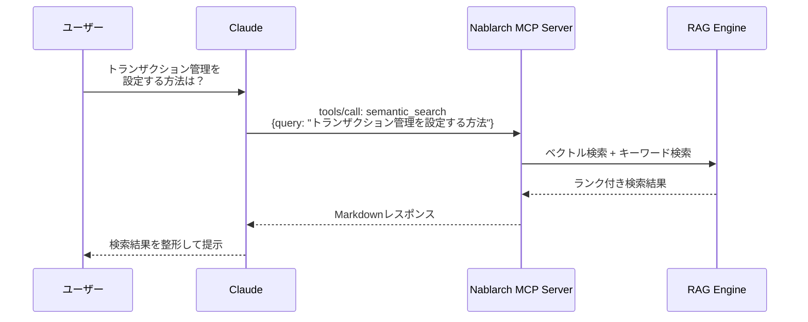
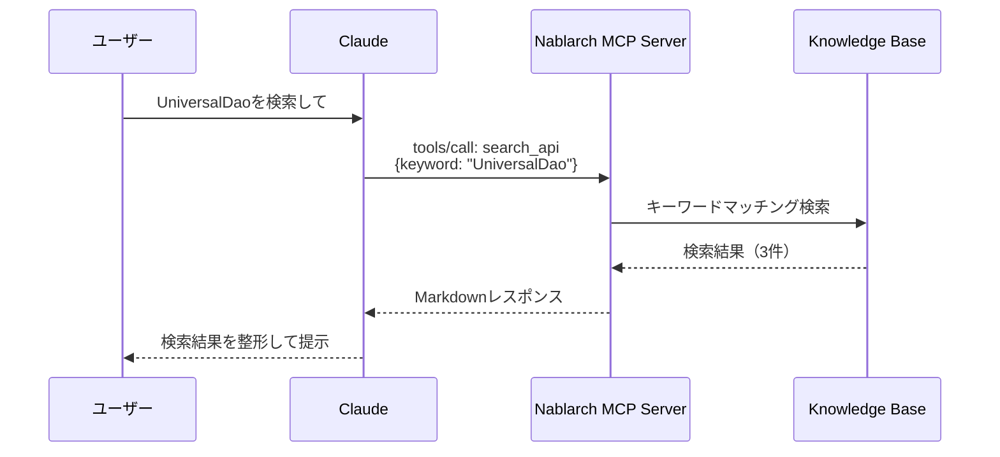

# 使ってみよう --- 最初の10分で感動体験

> **シリーズ**: Nablarch MCP Server 専門家育成シリーズ 第4A回（基本編）
> **対象読者**: Nablarch開発者、AIツールユーザー
> **前提知識**: 記事03（セットアップ完了）
> **所要時間**: 約10分

---

## 目次

1. [この記事で学べること](#1-この記事で学べること)
2. [MCP Inspectorで動作確認しよう](#2-mcp-inspectorで動作確認しよう)
3. [Tool 1: semantic_search --- 自然言語で何でも検索](#3-tool-1-semantic_search----自然言語で何でも検索)
4. [Tool 2: design --- ハンドラキューを自動設計](#4-tool-2-design----ハンドラキューを自動設計)
5. [Tool 3: search_api --- APIをキーワード検索](#5-tool-3-search_api----apiをキーワード検索)
6. [まとめと次のステップ](#6-まとめと次のステップ)

---

## 1. この記事で学べること

Nablarch MCP Serverが提供する全24種のMCP機能のうち、代表的なTool 3つを実際に動かしてみます。セットアップが完了した直後に「動いた！」という感動体験を得ることが目標です。

### 学習内容

- **semantic_search**: 自然言語でNablarchドキュメントを横断検索（RAGセマンティック検索）
- **design**: アプリケーションタイプと要件からハンドラキューXMLを自動生成
- **search_api**: キーワードでAPI・ハンドラ・モジュール・設計パターンを検索

### 前提知識

本記事は、記事03「セットアップガイド」でMCPサーバーのセットアップが完了していることを前提とします。以下の状態を想定しています。

- Claude Desktop/Claude Code/VS Code等のAIツールにMCPサーバーが接続済み
- AIツール上で `nablarch` MCPサーバーが認識されている
- Java 17以上、Maven 3.9.x（オプション）がインストール済み

### 全体像: 24のMCP機能

Nablarch MCP Serverは **10 Tools + 8 Resources + 6 Prompts = 24機能** を提供します。本記事（基本編）では代表的なTool 3つを体験し、残りの機能は [応用編（04B）](./04B-hands-on-advanced.md) で解説します。

| カテゴリ | 本記事で体験 | 応用編で解説 |
|---------|------------|------------|
| Tools（10種） | semantic_search, design, search_api | validate_handler_queue, generate_code, generate_test, optimize, recommend, analyze_migration |
| Resources（8種） | - | handler, guide, api, pattern, antipattern, config, example, version |
| Prompts（6種） | - | setup-handler-queue, create-action, review-config, explain-handler, migration-guide, best-practices |

---

## 2. MCP Inspectorで動作確認しよう

AIツールに組み込む前に、まずMCP Inspector（MCPサーバーの開発者向けデバッグツール）で動作確認してみましょう。MCP InspectorはMCPサーバーと直接通信し、Tool/Resource/Promptの呼び出しをGUI上で試せます。

### MCP Inspectorの起動

```bash
# MCP Inspectorを起動
npx @modelcontextprotocol/inspector java -jar target/nablarch-mcp-server-*.jar
```

ブラウザで `http://localhost:5173` を開くと、MCP Inspectorの画面が表示されます。

### 画面構成

MCP Inspectorの画面には以下の3つのタブがあります。

| タブ | 説明 | 本記事で使用 |
|------|------|------------|
| **Tools** | AIが実行できる関数の一覧・テスト実行 | 3つのToolを体験 |
| **Resources** | AIが参照できる知識カタログの一覧・閲覧 | 応用編で体験 |
| **Prompts** | AIが使える対話テンプレートの一覧・テスト | 応用編で体験 |

準備ができたら、さっそくToolを試してみましょう。

---

## 3. Tool 1: semantic_search --- 自然言語で何でも検索

最初に試すのは **semantic_search** です。自然言語のクエリでNablarchドキュメント・コード・Javadocを横断検索できる、RAGエンジンによるセマンティック検索ツールです。

### こう聞くと

```
Nablarchでトランザクション管理を設定する方法
```

### こう返ってくる

```markdown
## 検索結果: "Nablarchでトランザクション管理を設定する方法"
モード: hybrid | 結果数: 3件 | 検索時間: 245ms

---

### 結果 1 (スコア: 0.892)
**ソース**: nablarch-document | web | nablarch-common-jdbc
**URL**: https://nablarch.github.io/docs/...

TransactionManagementHandlerを使用してトランザクション境界を設定します。
ハンドラキュー内にTransactionManagementHandlerを配置し、
DbConnectionManagementHandlerの後に配置してください...

---

### 結果 2 (スコア: 0.856)
**ソース**: github | nablarch-example-web
**URL**: https://github.com/nablarch/nablarch-example-web/...

```xml
<component class="nablarch.common.handler.TransactionManagementHandler">
  <property name="dbTransactionManager" ref="transactionManager"/>
</component>
```
```

### Tool呼び出しの流れ



### パラメータ

| パラメータ | 型 | 必須 | デフォルト | 説明 |
|-----------|-----|------|-----------|------|
| `query` | String | ○ | - | 検索クエリ（自然言語） |
| `appType` | String | - | null | アプリ種別フィルタ: web, rest, batch, messaging |
| `source` | String | - | null | データソースフィルタ: nablarch-document, github, fintan, javadoc |
| `topK` | Integer | - | 5 | 返却する結果数（1-50） |
| `mode` | String | - | hybrid | 検索モード: hybrid, vector, keyword |

### 試してみよう

MCP InspectorのToolsタブから `semantic_search` を選択し、以下のクエリで検索してみましょう。

| # | クエリ例 | 期待される結果 |
|---|---------|-------------|
| 1 | `Nablarchでトランザクション管理を設定する方法` | TransactionManagementHandlerの設定方法 |
| 2 | `バリデーションエラーのハンドリング` | OnErrorインターセプタ、ApplicationException |
| 3 | `バッチ処理でDB接続を使う方法` | バッチアプリのDbConnectionManagementHandler |

---

## 4. Tool 2: design --- ハンドラキューを自動設計

次に試すのは **design** ツールです。アプリケーションタイプと要件を指定するだけで、Nablarchのベストプラクティスに準拠したハンドラキューXML設定を自動生成します。

### こう聞くと

```
webアプリケーション用のハンドラキューを設計して。
要件: csrf対策、セッション管理、セキュリティヘッダー
```

### こう返ってくる

```markdown
## ハンドラキュー設計結果

**アプリタイプ**: web
**ハンドラ数**: 14
**適用要件**: csrf, session, security

### ハンドラ構成

| # | ハンドラ | 説明 | 必須 |
|---|----------|------|------|
| 1 | StatusCodeConvertHandler | ステータスコード変換 | ○ |
| 2 | HttpResponseHandler | HTTPレスポンス処理 | ○ |
| 3 | GlobalErrorHandler | グローバルエラー処理 | ○ |
| 4 | SecureHandler | セキュリティヘッダー付与 | - |
| 5 | HttpCharacterEncodingHandler | 文字エンコーディング | ○ |
...

### XML設定

```xml
<!-- webアプリケーション用ハンドラキュー設定 -->
<list name="handlerQueue">
  <!-- ステータスコード変換 -->
  <component class="nablarch.fw.handler.StatusCodeConvertHandler"/>
  <!-- HTTPレスポンス処理 -->
  <component class="nablarch.fw.web.handler.HttpResponseHandler"/>
  <!-- セキュリティヘッダー -->
  <component class="nablarch.fw.web.handler.SecureHandler"/>
  <!-- CSRF対策 -->
  <component class="nablarch.fw.web.handler.CsrfTokenVerificationHandler"/>
  ...
</list>
```
```

### パラメータ

| パラメータ | 型 | 必須 | デフォルト | 説明 |
|-----------|-----|------|-----------|------|
| `appType` | String | ○ | - | アプリケーションタイプ: web, rest, batch, messaging |
| `requirements` | String | - | null | オプション要件（カンマ区切り）: session, csrf, multipart, async, security, logging |
| `includeComments` | Boolean | - | true | 生成XMLにコメントを含めるか |

### 試してみよう

MCP InspectorのToolsタブから `design` を選択し、以下のパターンで試してみましょう。

| # | appType | requirements | 期待される結果 |
|---|---------|-------------|-------------|
| 1 | web | csrf, session | CSRF対策 + セッション管理付きのWeb用ハンドラキュー |
| 2 | rest | security | セキュリティ設定付きのREST API用ハンドラキュー |
| 3 | batch | logging | ログ出力付きのバッチ用ハンドラキュー |

---

## 5. Tool 3: search_api --- APIをキーワード検索

3つ目は **search_api** です。Nablarch知識ベースをキーワード検索し、API・ハンドラ・モジュール・設計パターン・エラー情報を返します。「あのクラス名、何だっけ？」というときに便利です。

### こう聞くと

```
UniversalDaoを検索して
```

### こう返ってくる

```markdown
検索結果: "UniversalDao"
件数: 3件

### [APIパターン] universal-dao (library)
UniversalDaoを使ったCRUD操作
FQCN: nablarch.common.dao.UniversalDao

### [モジュール] nablarch-common-dao (library)
ユニバーサルDAO

### [設計パターン] dao-pattern (data-access)
データアクセスオブジェクトパターン
```

### Tool呼び出しの流れ



### パラメータ

| パラメータ | 型 | 必須 | 説明 |
|-----------|-----|------|------|
| `keyword` | String | ○ | 検索キーワード（クラス名、メソッド名、概念） |
| `category` | String | - | カテゴリフィルタ: handler, library, web, batch, rest, messaging |

### semantic_search との使い分け

search_api と semantic_search は検索という点では似ていますが、用途が異なります。

| 比較項目 | search_api | semantic_search |
|---------|-----------|----------------|
| 検索方式 | キーワードマッチング | ベクトル検索 + キーワード検索 |
| 入力 | クラス名、メソッド名などの正確なキーワード | 自然言語の質問文 |
| 得意な場面 | 「UniversalDao」のような具体名がわかっている時 | 「トランザクション管理の設定方法」のように概念で探したい時 |
| 検索対象 | 知識ベース（API、ハンドラ、パターン） | ドキュメント、コード、Javadocを横断 |
| 速度 | 高速 | やや遅い（RAGエンジン経由） |

### 試してみよう

MCP InspectorのToolsタブから `search_api` を選択し、以下のキーワードで検索してみましょう。

| # | keyword | category | 期待される結果 |
|---|---------|----------|-------------|
| 1 | `UniversalDao` | (なし) | DAO関連のAPI・モジュール・パターン |
| 2 | `HttpResponseHandler` | handler | Webレスポンス処理ハンドラの情報 |
| 3 | `validation` | library | バリデーション関連ライブラリ |

---

## 6. まとめと次のステップ

### 本記事で体験したこと

たった3つのToolを試しただけで、Nablarch MCP Serverの威力を実感できたのではないでしょうか。

| Tool | 用途 | ひとことで言うと |
|------|------|----------------|
| **semantic_search** | RAGセマンティック検索 | 「自然言語で何でも聞ける」 |
| **design** | ハンドラキュー自動設計 | 「要件を伝えるだけでXML設定が出てくる」 |
| **search_api** | APIキーワード検索 | 「クラス名でピンポイント検索」 |

### 残りの機能

Nablarch MCP Serverには、まだまだ強力な機能があります。

| カテゴリ | 未体験の機能 |
|---------|------------|
| **Tools** | ハンドラキュー検証（validate_handler_queue）、コード生成（generate_code）、テスト生成（generate_test）、最適化提案（optimize）、パターン推薦（recommend）、移行影響分析（analyze_migration） |
| **Resources** | ハンドラカタログ、開発ガイド、APIリファレンス、設計パターン、アンチパターン、XML設定テンプレート、サンプルコード、バージョン情報 |
| **Prompts** | ハンドラキュー設計ガイド、アクション作成ガイド、設定レビュー、ハンドラ解説、移行ガイド、ベストプラクティス |

### 次の記事へ

応用編（第4B回）では、残りの全Toolの使い方に加え、Resources・Promptsの活用法、そしてTools/Resources/Promptsを組み合わせた実践シナリオ（Nablarch Webアプリの作成）を体験します。

---

## 参考リンク

- [記事03: セットアップガイド](./03-setup-guide.md)
- [記事04B: 使ってみよう応用編](./04B-hands-on-advanced.md)
- [記事05: アーキテクチャ概要](./05-architecture-overview.md)
- [Nablarch公式ドキュメント](https://nablarch.github.io/docs/)
- [GitHub: nablarch-mcp-server](https://github.com/kumanoGoro/nablarch-mcp-server)

---

<p align="center">
  <a href="./03-setup-guide.md">&larr; 前の記事: セットアップガイド</a> |
  <a href="./04B-hands-on-advanced.md">次の記事: 使ってみよう応用編 &rarr;</a>
</p>
