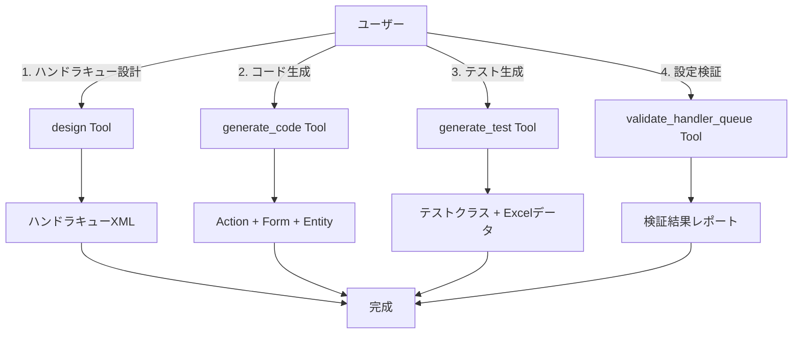

# 使ってみよう 応用編 --- 10のToolsを使いこなす

> **シリーズ**: Nablarch MCP Server 専門家育成シリーズ 第4B回（応用編）
> **対象読者**: Nablarch開発者、AIツールユーザー
> **前提知識**: 記事04A（基本編で3つのToolを体験済み）
> **所要時間**: 約25分

---

## 目次

1. [この記事で学べること](#1-この記事で学べること)
2. [残り7つのToolsをマスターする](#2-残り7つのtoolsをマスターする)
3. [Resourcesを活用しよう](#3-resourcesを活用しよう)
4. [Promptsで対話しよう](#4-promptsで対話しよう)
5. [Claude Desktop / Claude Code との統合](#5-claude-desktop--claude-code-との統合)
6. [実践シナリオ: Nablarch Webアプリを作ってみよう](#6-実践シナリオ-nablarch-webアプリを作ってみよう)
7. [まとめと全機能リファレンス](#7-まとめと全機能リファレンス)

---

## 1. この記事で学べること

基本編（第4A回）では、semantic_search・design・search_apiの3つのToolを体験しました。本記事（応用編）では、残り7つのToolに加え、8つのResources、6つのPrompts、そしてClaude Desktop/Claude Codeとの統合方法を学びます。最後に、全機能を組み合わせた実践シナリオでWebアプリを作ります。

### 学習内容

| カテゴリ | 本記事で学ぶ内容 |
|---------|----------------|
| **Tools（7種）** | validate_handler_queue, generate_code, generate_test, optimize_handler_queue, recommend_pattern, analyze_migration, troubleshoot |
| **Resources（8種）** | handler, guide, api, pattern, antipattern, config, example, version |
| **Prompts（6種）** | setup-handler-queue, create-action, review-config, explain-handler, migration-guide, best-practices |
| **統合** | Claude Desktop / Claude Code での利用方法 |

### 前提知識

- 記事04A「使ってみよう基本編」を読了し、MCP Inspectorで3つのToolを体験済み
- MCPサーバーが起動済み

---

## 2. 残り7つのToolsをマスターする

基本編で体験した3つのToolに加え、残り7つのToolを順に使ってみましょう。

### 2.1 validate_handler_queue --- ハンドラキュー検証

ハンドラキューXML設定を検証し、順序制約・必須ハンドラの有無をチェックします。designツールで生成した設定の「答え合わせ」に使えます。

#### こう聞くと

```
以下のハンドラキューを検証して:

<list name="handlerQueue">
  <component class="nablarch.fw.web.handler.HttpResponseHandler"/>
  <component class="nablarch.common.handler.TransactionManagementHandler"/>
  <component class="nablarch.common.handler.DbConnectionManagementHandler"/>
</list>
```

#### こう返ってくる

```markdown
## ハンドラキュー検証結果

検証対象: web アプリケーション
ハンドラ数: 3

### 検証結果: エラーあり

#### エラー
- DbConnectionManagementHandler は TransactionManagementHandler より前に配置すべきです
  理由: トランザクション管理にはDB接続が必要

#### 警告
- GlobalErrorHandler が欠落しています（推奨）
```

#### パラメータ

| パラメータ | 型 | 必須 | 説明 |
|-----------|-----|------|------|
| `handlerQueueXml` | String | ○ | ハンドラキューXML設定内容 |
| `applicationType` | String | ○ | アプリケーションタイプ: web, rest, batch, messaging |

---

### 2.2 generate_code --- コード生成

Nablarch準拠のJavaコード（Action、Form、SQL定義、Entity、Handler、Interceptor）を生成します。

#### こう聞くと

```
UserRegistrationActionクラスを生成して。
- app_type: web
- routing: /users/register
- methods: GET, POST
```

#### こう返ってくる

```markdown
## 生成結果: UserRegistration (web/action)

### 適用されたNablarch規約
- パッケージ構成: {project}.app.action
- リクエストパラメータはFormクラスで受け取る
- 単一責任: 1Action = 1ユースケース

### 必要な依存モジュール
- nablarch-fw-web
- nablarch-common-validation
```

```java
package com.example.app.action;

import nablarch.core.message.ApplicationException;
import nablarch.fw.ExecutionContext;
import nablarch.fw.web.HttpRequest;
import nablarch.fw.web.HttpResponse;
import nablarch.fw.web.interceptor.OnError;
import nablarch.common.web.interceptor.InjectForm;

public class UserRegistrationAction {

    public HttpResponse index(HttpRequest request, ExecutionContext context) {
        return new HttpResponse("/WEB-INF/view/user/register.jsp");
    }

    @InjectForm(form = UserRegistrationForm.class, prefix = "form")
    @OnError(type = ApplicationException.class, path = "/WEB-INF/view/user/register.jsp")
    public HttpResponse register(HttpRequest request, ExecutionContext context) {
        UserRegistrationForm form = context.getRequestScopedVar("form");
        // TODO: ビジネスロジック実装
        return new HttpResponse(303, "redirect:///users/complete");
    }
}
```

#### パラメータ

| パラメータ | 型 | 必須 | デフォルト | 説明 |
|-----------|-----|------|-----------|------|
| `type` | String | ○ | - | 生成対象: action, form, sql, entity, handler, interceptor |
| `name` | String | ○ | - | クラス/ファイルの名前 |
| `appType` | String | - | web | アプリタイプ: web, rest, batch, messaging |
| `specifications` | String | - | null | タイプ固有パラメータ（JSON文字列） |

---

### 2.3 generate_test --- テスト生成

Nablarch Testing Framework（JUnit5 + Excelテストデータ）に準拠したテストコードを生成します。

#### こう聞くと

```
UserRegistrationActionのテストを生成して。
- testType: request-response
- format: nablarch-excel
- testCases: 正常登録、バリデーションエラー、重複メールエラー
```

#### こう返ってくる

```java
package com.example.app.action;

import nablarch.test.core.http.SimpleRestTestSupport;
import org.junit.jupiter.api.Test;

public class UserRegistrationActionRequestTest extends SimpleRestTestSupport {

    @Test
    void 正常に登録できること() {
        execute("正常に登録できること");
    }

    @Test
    void バリデーションエラーの場合400を返すこと() {
        execute("バリデーションエラーの場合400を返すこと");
    }

    @Test
    void 重複メールエラーの場合409を返すこと() {
        execute("重複メールエラーの場合409を返すこと");
    }
}
```

Excelテストデータ構造（`UserRegistrationActionRequestTest.xlsx`）も同時に生成されます。

#### パラメータ

| パラメータ | 型 | 必須 | デフォルト | 説明 |
|-----------|-----|------|-----------|------|
| `targetClass` | String | ○ | - | テスト対象クラスのFQCN |
| `testType` | String | ○ | - | テストタイプ: unit, request-response, batch, messaging |
| `format` | String | - | junit5 | 出力フォーマット: junit5, nablarch-excel |
| `testCases` | String | - | null | テストケースの自然言語記述 |

---

### 2.4 optimize_handler_queue --- ハンドラキュー最適化

既存のハンドラキューXML設定を**正確性・セキュリティ・パフォーマンス**の3観点から分析し、最適化提案を生成します。

#### こう聞くと

```
このハンドラキューを最適化して:

<list name="handlerQueue">
  <component class="nablarch.fw.web.handler.HttpResponseHandler"/>
  <component class="nablarch.common.handler.DbConnectionManagementHandler"/>
  <component class="nablarch.fw.handler.DispatchHandler"/>
</list>
```

#### こう返ってくる

```markdown
## ハンドラキュー最適化分析

**アプリタイプ**: web（自動推定）
**検出された最適化ポイント**: 2件

### サマリ

| 観点 | 件数 | 高 | 中 | 低 |
|------|------|-----|-----|-----|
| セキュリティ | 2 | 2 | 0 | 0 |

### [SEC-001] SecureHandler（高）

**問題**: セキュリティヘッダーが設定されていません
**修正提案**: HttpResponseHandlerの後にSecureHandlerを追加してください
```

#### パラメータ

| パラメータ | 型 | 必須 | デフォルト | 説明 |
|-----------|-----|------|-----------|------|
| `currentXml` | String | ○ | - | 現在のハンドラキューXML設定 |
| `appType` | String | - | 自動推定 | アプリケーションタイプ |
| `concern` | String | - | all | 最適化観点: all, correctness, security, performance |

---

### 2.5 recommend_pattern --- パターン推薦

自然言語要件に基づいて、Nablarch固有のデザインパターンをスコアリング付きで推薦します。

#### こう聞くと

```
データベースへの排他制御を実装したい。
複数ユーザーが同時に更新しても整合性を保ちたい。
```

#### こう返ってくる

```markdown
## デザインパターン推薦結果

### 第1位: OptimisticLockPattern（スコア: 87%）

**カテゴリ**: data-access

バージョン番号または更新日時を使用した楽観的ロックパターン。
Nablarchでは@Versionアノテーションを使用します。
```

```java
@Entity
public class User {
    @Id
    private Long id;

    @Version
    private Long version;  // 楽観的ロック用バージョン番号
}
```

#### パラメータ

| パラメータ | 型 | 必須 | デフォルト | 説明 |
|-----------|-----|------|-----------|------|
| `requirement` | String | ○ | - | 自然言語要件記述（10文字以上） |
| `appType` | String | - | null | アプリタイプ: web, rest, batch, messaging |
| `constraints` | String | - | null | 追加の制約条件（カンマ区切り） |
| `maxResults` | Integer | - | 3 | 返却する最大候補数（1-11） |

---

### 2.6 analyze_migration --- 移行影響分析

Nablarch 5から6への移行において、既存コードの非推奨API使用を検出し、移行影響を分析します。

#### こう聞くと

```
以下のコードをNablarch 6に移行する影響を分析して:

import javax.servlet.http.HttpServletRequest;
import javax.persistence.Entity;

public class UserAction extends DbAccessSupport {
    // ...
}
```

#### こう返ってくる

```markdown
## Nablarch移行影響分析レポート

| 分類 | 件数 |
|------|------|
| 自動修正可能 | 2件 |
| 手動修正必要 | 1件 |

### 検出された問題

**BC-001**: javax.servlet → jakarta.servlet（自動修正可能）
**BC-002**: javax.persistence → jakarta.persistence（自動修正可能）
**BC-003**: DbAccessSupportクラスはNablarch 6で削除（手動修正必要）
  → UniversalDaoまたはBasicDatabaseAccessへリファクタリング
```

#### パラメータ

| パラメータ | 型 | 必須 | デフォルト | 説明 |
|-----------|-----|------|-----------|------|
| `codeSnippet` | String | ○ | - | 分析対象のコード（Java, XML, POM） |
| `sourceVersion` | String | - | 5 | 移行元バージョン |
| `targetVersion` | String | - | 6 | 移行先バージョン |
| `analysisScope` | String | - | full | 分析範囲: full, namespace, dependency, api |

---

### 2.7 troubleshoot --- トラブルシューティング

エラーメッセージやスタックトレースを入力すると、Nablarch固有の原因分析と解決策を提示します。

#### こう聞くと

```
以下のエラーが発生しました:

nablarch.fw.handler.HandlerQueueEmptyException:
  handler queue is empty. there is no handler to handle the request.
```

#### こう返ってくる

```markdown
## トラブルシューティング結果

### エラー: HandlerQueueEmptyException

**原因**: ハンドラキューが空のままリクエストが処理されようとしています

### 考えられる原因
1. web.xmlの`configFilePath`が正しく設定されていない
2. コンポーネント定義XMLのパスが間違っている
3. handlerQueueリストの定義が欠落している

### 解決手順
1. `web.xml` の `configFilePath` を確認
2. 指定されたXMLファイルが存在するか確認
3. `<list name="handlerQueue">` の定義があるか確認

### 参考: 正しい設定例
```

```xml
<!-- web.xml -->
<context-param>
  <param-name>configFilePath</param-name>
  <param-value>com/example/web-boot.xml</param-value>
</context-param>
```

#### パラメータ

| パラメータ | 型 | 必須 | 説明 |
|-----------|-----|------|------|
| `errorMessage` | String | ○ | エラーメッセージまたはスタックトレース |
| `context` | String | - | 発生状況の補足説明 |

---

### 2.8 全10 Tools 一覧

| # | Tool名 | 用途 | 解説記事 |
|---|--------|------|---------|
| 1 | semantic_search | RAGセマンティック検索 | 04A |
| 2 | design_handler_queue | ハンドラキュー設計 | 04A |
| 3 | search_api | APIキーワード検索 | 04A |
| 4 | validate_handler_queue | ハンドラキュー検証 | 04B（本記事） |
| 5 | generate_code | コード生成 | 04B（本記事） |
| 6 | generate_test | テスト生成 | 04B（本記事） |
| 7 | optimize_handler_queue | ハンドラキュー最適化 | 04B（本記事） |
| 8 | recommend_pattern | パターン推薦 | 04B（本記事） |
| 9 | analyze_migration | 移行影響分析 | 04B（本記事） |
| 10 | troubleshoot | トラブルシューティング | 04B（本記事） |

---

## 3. Resourcesを活用しよう

ResourcesはAIが参照できる**知識カタログ**です。AIに「ハンドラカタログを見せて」「ガイドを読んで」と依頼すると、AIがResourceを読み込んで情報を取得します。

### 3.1 全8種のResource URI一覧

| # | Resource | URIプレフィックス | 提供内容 |
|---|---------|------------------|---------|
| 1 | Handler | `nablarch://handler/{app_type}` | ハンドラカタログ（web/rest/batch/messaging/http-messaging/jakarta-batch） |
| 2 | Guide | `nablarch://guide/{topic}` | 開発ガイド（setup/testing/validation/database/handler-queue/error-handling） |
| 3 | API | `nablarch://api/modules` | APIリファレンス（モジュール一覧） |
| 4 | Pattern | `nablarch://pattern/{name}` | 設計パターン（11パターン） |
| 5 | Antipattern | `nablarch://antipattern/{name}` | アンチパターンと修正方法 |
| 6 | Config | `nablarch://config/{name}` | XML設定テンプレート（web-xml/web-component/rest-component等） |
| 7 | Example | `nablarch://example/{type}` | サンプルアプリケーションコード |
| 8 | Version | `nablarch://version/info` | フレームワークバージョン情報 |

### 3.2 Handler Resource --- ハンドラカタログ

アプリケーションタイプ別のハンドラキュー仕様を提供します。

```
nablarch://handler/web を読んで、webアプリケーションのハンドラキューを教えて
```

返却例:

```markdown
# Nablarch Web Application Handler Queue

## Handler Queue (in order)

### 1. StatusCodeConvertHandler [Required]
- **FQCN**: nablarch.fw.handler.StatusCodeConvertHandler
- **Constraints**: Must be first in the queue

### 2. HttpResponseHandler [Required]
- **FQCN**: nablarch.fw.web.handler.HttpResponseHandler
- **Constraints**: Must be before: SecureHandler
...
```

### 3.3 Guide Resource --- 開発ガイド

トピック別の開発ガイドを提供します。

```
nablarch://guide/database を読んで、データベースアクセスパターンを教えて
```

UniversalDaoの基本的な使い方（CRUD操作、SQL定義ファイルの書き方等）が返されます。

### 3.4 API Resource --- APIリファレンス

モジュール・クラスの詳細情報を階層的に参照できます。

```
nablarch://api/common-dao を読んで、クラス一覧を教えて
```

UniversalDao、EntityUtil等のクラス名・FQCN・説明の一覧が返されます。

### 3.5 Pattern / Antipattern Resource --- 設計パターン

Nablarch固有の設計パターンとアンチパターンを参照できます。

```
nablarch://pattern/list を読んで
```

Bean Validationアノテーション + @InjectFormインターセプタを組み合わせたバリデーション実装パターンが、コード例付きで返されます。

### 3.6 Config / Example / Version Resource

| Resource | 聞き方の例 | 返却内容 |
|---------|-----------|---------|
| Config | `nablarch://config/web-component を読んで` | Web用コンポーネント定義XMLテンプレート |
| Example | `nablarch://example/web を読んで` | Webアプリのサンプルコード |
| Version | `nablarch://version/info を読んで` | 最新バージョン、サポートバージョン、BOM情報 |

---

## 4. Promptsで対話しよう

PromptsはAIが使える**対話テンプレート**です。特定の開発タスクに対して、構造化されたガイダンスを提供します。

### 4.1 全6種のPrompt一覧

| # | Prompt | 用途 | 主要パラメータ |
|---|--------|------|-------------|
| 1 | setup-handler-queue | ハンドラキュー設計ガイド | app_type |
| 2 | create-action | アクション作成ガイド | app_type, action_name |
| 3 | review-config | XML設定レビュー | config_xml |
| 4 | explain-handler | ハンドラ解説 | handler_name |
| 5 | migration-guide | バージョン移行ガイド | from_version, to_version |
| 6 | best-practices | ベストプラクティス | topic |

### 4.2 setup-handler-queue --- ハンドラキュー設計ガイド

```
webアプリケーション用のハンドラキューを設計したい
```

推奨ハンドラ一覧（FQCN・必須区分・スレッドモデル付き）、順序制約表、XML設定テンプレートが構造化されて返されます。

### 4.3 create-action --- アクション作成ガイド

アプリタイプとアクション名を指定すると、Nablarch規約に沿ったActionクラスのスケルトンと、必要なForm・Entity・SQL定義ファイルの一覧を提示します。

### 4.4 review-config --- XML設定レビュー

XML設定を渡すと、ハンドラ順序制約チェック、一般的な問題パターンの検出、検証チェックリスト（必須ハンドラ・FQCN正確性・循環参照等）を返します。

### 4.5 explain-handler --- ハンドラ解説

ハンドラ名を指定すると、基本情報（FQCN・スレッドモデル・必須区分）、使用されるアプリタイプ、順序制約を詳細に解説します。

### 4.6 migration-guide --- 移行ガイド

移行元・移行先バージョンを指定すると、モジュール一覧、破壊的変更、移行ステップ（BOMバージョン更新→名前空間変更→コンパイルチェック→テスト実行）が返されます。

### 4.7 best-practices --- ベストプラクティス

トピック（handler-queue, action, validation, database, testing）を指定すると、関連する設計パターン、推奨実装パターン、一般的なベストプラクティスが返されます。

---

## 5. Claude Desktop / Claude Code との統合

MCP Inspectorでの動作確認を終えたら、実際のAIツールに統合しましょう。

### 5.1 Claude Desktop での設定

Claude Desktopの設定ファイル（`claude_desktop_config.json`）に以下を追加します。

```json
{
  "mcpServers": {
    "nablarch": {
      "command": "java",
      "args": ["-jar", "/path/to/nablarch-mcp-server.jar"],
      "env": {
        "SPRING_PROFILES_ACTIVE": "local"
      }
    }
  }
}
```

設定後、Claude Desktopを再起動すると、チャット画面にMCPツールのアイコンが表示されます。以降は自然言語で依頼するだけで、Claudeが適切なTool/Resource/Promptを自動的に呼び出します。

### 5.2 Claude Code での設定

Claude Codeの設定ファイル（`.claude/settings.json`）に以下を追加します。

```json
{
  "mcpServers": {
    "nablarch": {
      "command": "java",
      "args": ["-jar", "/path/to/nablarch-mcp-server.jar"],
      "env": {
        "SPRING_PROFILES_ACTIVE": "local"
      }
    }
  }
}
```

Claude Codeでは、ターミナル上で自然言語の指示を出すことで、コード生成からテスト生成までシームレスに実行できます。

### 5.3 VS Code (Copilot) での設定

VS CodeのMCP設定にも同様にサーバーを登録できます。詳細は記事03のセットアップガイドを参照してください。

### 5.4 統合後の使い方

AIツールに統合すると、MCP Inspectorで手動実行していた操作が**自然言語の会話だけ**で完結します。

| やりたいこと | こう聞くだけ |
|-------------|-----------|
| ハンドラキューの設計 | 「Webアプリ用のハンドラキューを設計して」 |
| コードのスケルトン生成 | 「ユーザー登録のActionクラスを作って」 |
| 設定の検証 | 「このXML設定を検証して」 |
| エラーの調査 | 「このスタックトレースの原因を教えて」 |
| 移行影響の分析 | 「このコードをNablarch 6に移行する影響は？」 |

AIが文脈に応じて**複数のTool/Resource/Promptを自動的に組み合わせて**回答します。

---

## 6. 実践シナリオ: Nablarch Webアプリを作ってみよう

ここまで学んだ全機能を組み合わせて、ユーザー登録機能を持つNablarch Webアプリケーションを作ります。

### 6.1 シナリオ概要

**目標**: ユーザー登録機能を持つNablarch Webアプリケーションを作成する

- ユーザー登録画面（入力フォーム）
- バリデーション（必須項目、メールアドレス形式）
- DB登録（USERSテーブル）
- CSRF対策・セッション管理・トランザクション管理

### 6.2 ステップ1: ハンドラキュー設計

**使用機能**: setup-handler-queue Prompt + nablarch://handler/web Resource + design Tool

```
webアプリケーション用のハンドラキューを設計して。
要件: csrf対策、セッション管理が必要。
```

AIが3つの機能を連携し、14個のハンドラで構成されたXML設定を生成します。

```xml
<list name="handlerQueue">
  <component class="nablarch.fw.handler.StatusCodeConvertHandler"/>
  <component class="nablarch.fw.web.handler.HttpResponseHandler"/>
  <component class="nablarch.fw.handler.GlobalErrorHandler"/>
  <component class="nablarch.fw.web.handler.SecureHandler"/>
  <!-- ...中略... -->
  <component class="nablarch.fw.web.handler.DispatchHandler"/>
</list>
```

### 6.3 ステップ2: Action + Form + Entity生成

**使用機能**: generate_code Tool + nablarch://pattern/form-validation-pattern Resource

```
UserRegistrationActionクラスを生成して。
- app_type: web
- routing: /users/register
- methods: GET, POST
```

AIがAction・Form・Entityの3ファイルを一度に生成します。

### 6.4 ステップ3: テストコード生成

**使用機能**: generate_test Tool + nablarch://guide/testing Resource

```
UserRegistrationActionのテストを生成して。
- testType: request-response
- testCases: 正常登録、必須項目未入力、メール形式不正、重複メールエラー
```

JUnit5テストクラスとExcelテストデータ構造が生成されます。

### 6.5 ステップ4: 設定検証

**使用機能**: validate_handler_queue Tool + review-config Prompt

```
生成されたハンドラキュー設定を検証して。
```

順序制約違反がないことを確認し、検証結果レポートが返されます。

### 6.6 全体フロー図



### 6.7 生成ファイル一覧

| # | ファイル | 生成Tool |
|---|---------|---------|
| 1 | web-component-configuration.xml | design |
| 2 | UserRegistrationAction.java | generate_code (action) |
| 3 | UserRegistrationForm.java | generate_code (form) |
| 4 | Users.java | generate_code (entity) |
| 5 | UserRegistrationActionRequestTest.java | generate_test |
| 6 | UserRegistrationActionRequestTest.xlsx | generate_test |

---

## 7. まとめと全機能リファレンス

### 7.1 本記事で学んだこと

- 全10 Toolsの使い方と入出力例
- 全8 ResourcesのURI体系とアクセス方法
- 全6 Promptsの活用パターン
- Claude Desktop / Claude Code との統合方法
- Tools/Resources/Promptsを組み合わせた実践シナリオ

### 7.2 開発効率への影響

| 作業 | 従来の方法 | MCP Server使用時 | 効率化率 |
|------|-----------|-----------------|---------|
| ハンドラキュー設計 | ドキュメント参照 + 手動設定（30分） | design Tool（3分） | **90%削減** |
| コード生成 | テンプレートコピー + 手動修正（20分） | generate_code Tool（2分） | **90%削減** |
| API検索 | Javadoc閲覧 + Google検索（15分） | search_api Tool（1分） | **93%削減** |
| テスト作成 | 手動作成（40分） | generate_test Tool（5分） | **87%削減** |
| 設定検証 | 手動確認 + トライアンドエラー（20分） | validate_handler_queue Tool（1分） | **95%削減** |

### 7.3 次のステップ

基本編・応用編で全24機能を体験しました。次の記事では、これらの機能が内部でどのように動作しているかを学びます。

- **第5回**: アーキテクチャ概要 --- Spring Boot + MCP + RAGの三位一体

---

## 参考リンク

- [記事04A: 使ってみよう基本編](./04A-hands-on-basic.md)
- [記事05: アーキテクチャ概要](./05-architecture-overview.md)
- [Nablarch公式ドキュメント](https://nablarch.github.io/docs/)
- [GitHub: nablarch-mcp-server](https://github.com/kumagoro1202/nablarch-mcp-server)

---

<p align="center">
  <a href="./04A-hands-on-basic.md">&larr; 前の記事: 使ってみよう基本編</a> |
  <a href="./05-architecture-overview.md">次の記事: アーキテクチャ概要 &rarr;</a>
</p>
