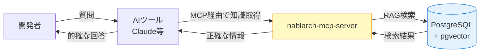
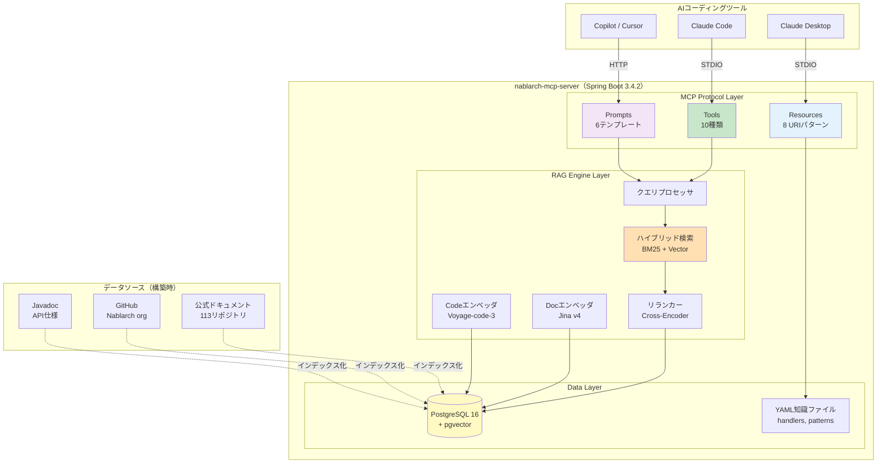
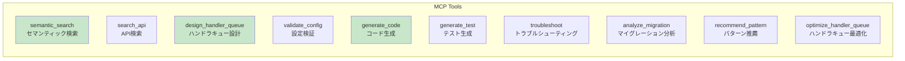
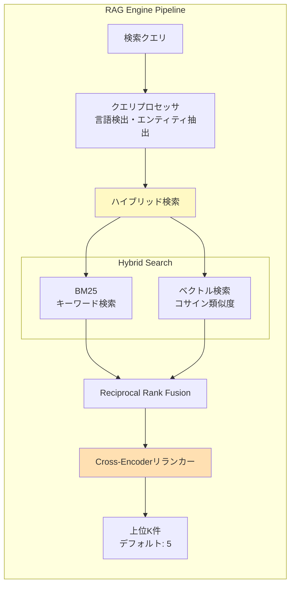
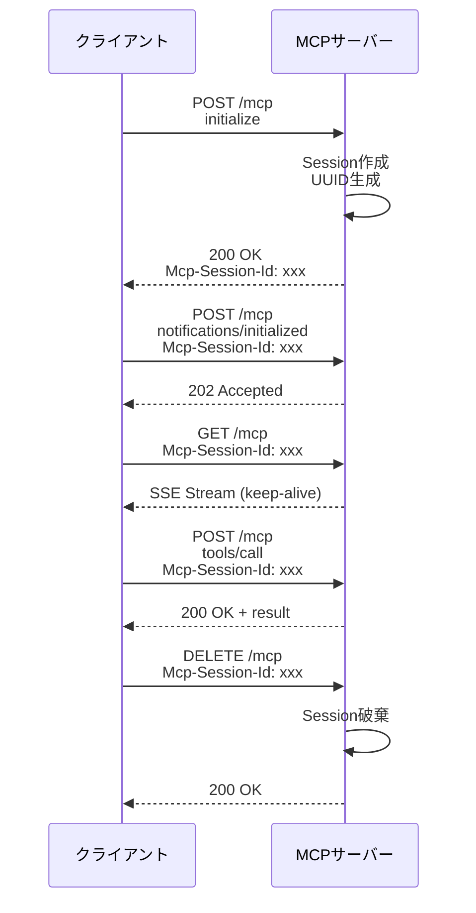
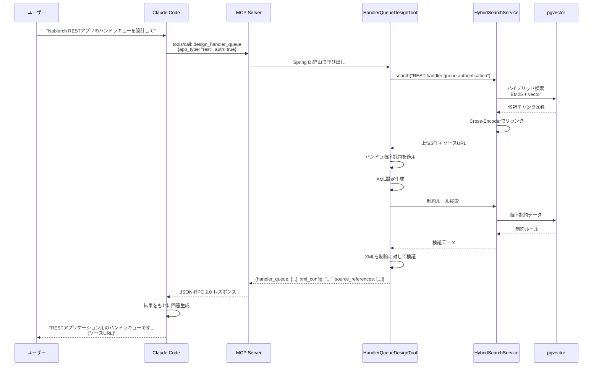
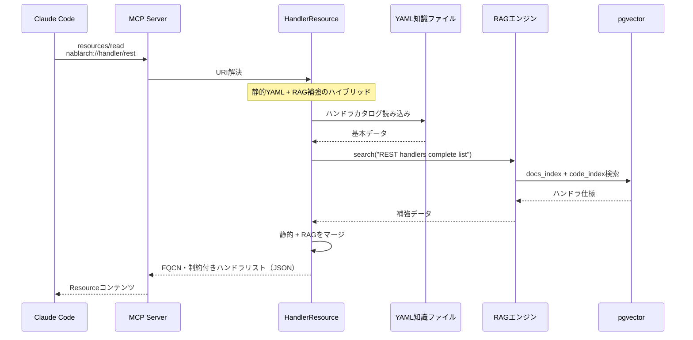
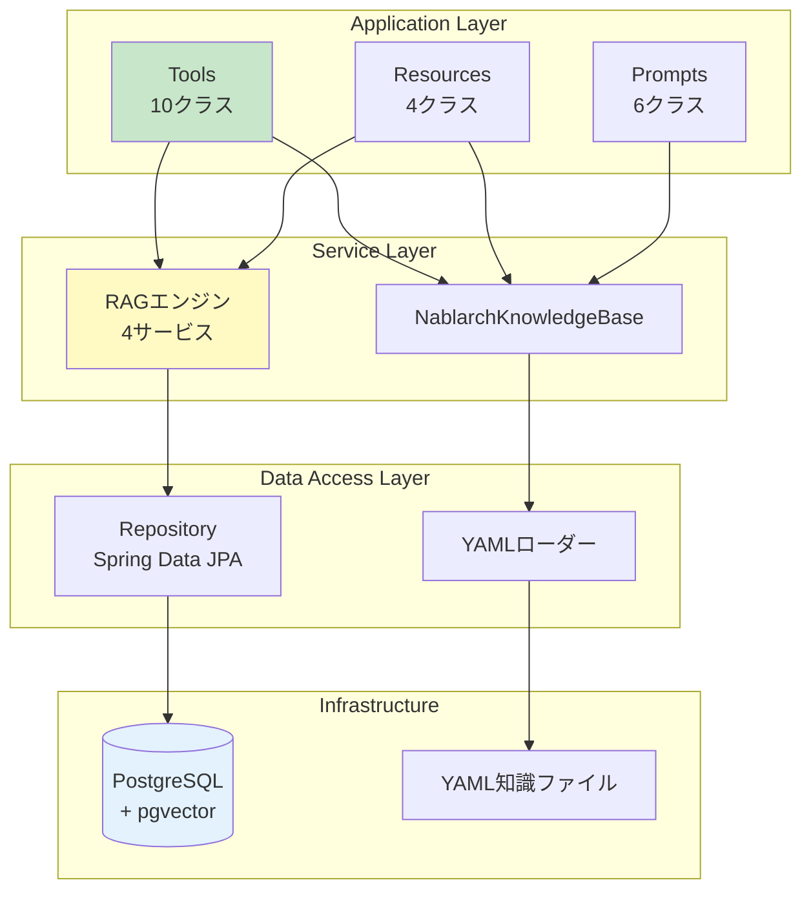

# アーキテクチャ概要 — Spring Boot + MCP + RAGの三位一体

> **シリーズ**: nablarch-mcp-server 専門家育成シリーズ 第5回（全14回）
> **対象読者**: 中級者（Spring Boot、REST API、データベースの基礎知識がある方）
> **前提記事**: [04B. 使ってみよう 応用編](./04B-hands-on-advanced.md)
> **作成日**: 2026-02-07
>
> **Spring Bootの知識について**: この記事ではSpring Bootの概念（DI、Bean、AutoConfiguration等）が登場します。Spring Bootに馴染みがない方は、それぞれの用語が出てきた時に括弧内の説明を参照してください。

---

## 目次

1. [この記事で学べること / 前提知識](#1-この記事で学べること--前提知識)
2. [全体アーキテクチャ図](#2-全体アーキテクチャ図)
3. [3つのレイヤー構成](#3-3つのレイヤー構成)
4. [Spring Bootベースの設計](#4-spring-bootベースの設計)
5. [トランスポート層](#5-トランスポート層)
6. [データフロー](#6-データフロー)
7. [コンポーネント間の依存関係](#7-コンポーネント間の依存関係)
8. [まとめ — 次の記事への橋渡し](#8-まとめ--次の記事への橋渡し)

---

## 1. この記事で学べること / 前提知識

### 1.1 この記事で学べること

この記事を読むと、以下の知識が得られます：

- nablarch-mcp-serverの**全体アーキテクチャ**と各層の役割
- **Spring Boot**をベースにした設計の理由とメリット
- **MCP Protocol**と**RAG Engine**の統合方法
- **STDIOトランスポート**と**Streamable HTTPトランスポート**の使い分け
- データが**どのように流れて処理されるか**の詳細
- 実際の**パッケージ構成**とコンポーネント間の依存関係

### 1.2 前提知識

この記事を読むにあたって、以下の知識があると理解がスムーズです：

| 分野 | 必要な知識レベル |
|------|----------------|
| **Java** | クラス、インターフェース、アノテーションの基本 |
| **Spring Boot** | DIコンテナ、`@Bean`、`@Configuration`の概念 |
| **REST API** | HTTP メソッド、リクエスト/レスポンス |
| **JSON** | 構造の読み書き |
| **データベース** | SQL、テーブル、インデックスの基本 |

これらの知識がない場合は、先に[記事01: MCPとは何か](./01-what-is-mcp.md)から順に読むことを推奨します。

### 1.3 システム概要の再確認

**nablarch-mcp-server** は、AIコーディングツールにNablarchフレームワークの専門知識を提供するための **RAG強化MCPサーバー** です。



---

## 2. 全体アーキテクチャ図

### 2.1 システムレベルアーキテクチャ

nablarch-mcp-serverは**3つの主要層**で構成されています。



### 2.2 各層の役割

| 層 | 役割 | 実装技術 |
|----|------|---------|
| **MCP Protocol Layer** | AIツールとの接続窓口。Tools/Resources/Promptsを公開 | MCP Java SDK 0.17.x |
| **RAG Engine Layer** | セマンティック検索、ハイブリッド検索、リランキング | カスタムJava + Embeddingモデル |
| **Data Layer** | ベクトルデータと静的知識の保管 | PostgreSQL 16 + pgvector + YAML |

---

## 3. 3つのレイヤー構成

### 3.1 MCP Protocol Layer（プロトコル層）

MCPプロトコルの3つのプリミティブ（Tools, Resources, Prompts）を実装し、AIツールからの要求を処理します。

#### Tools（10種類のツール）

AIが自律的に呼び出せる実行可能な機能。



代表的なToolの処理内容：

| Tool | 入力 | 処理 | 出力 |
|------|------|------|------|
| `semantic_search` | 検索クエリ、スコープ | RAG検索 | 関連ドキュメント5件 |
| `design_handler_queue` | app_type, 要件 | RAG + ルールエンジン | ハンドラキューXML |
| `validate_config` | XML設定 | 順序制約チェック | エラーリスト |

#### Resources（8 URIパターン）

読み取り専用の構造化データ。

| URI パターン | 内容 | データソース |
|-------------|------|-------------|
| `nablarch://handler/{app_type}` | ハンドラ仕様書 | YAML（静的） |
| `nablarch://api/{module}/{class}` | API仕様 | pgvector（動的） |
| `nablarch://pattern/{name}` | 設計パターン | YAML + RAG |
| `nablarch://guide/{topic}` | ガイドライン | YAML |

#### Prompts（6テンプレート）

再利用可能な対話テンプレート。

| Prompt | 引数 | 用途 |
|--------|------|------|
| `setup-handler-queue` | app_type, requirements | ハンドラキュー構成のセットアップ |
| `create-web-app` | level（beginner/advanced） | Webアプリケーション作成ガイド |
| `review-code` | code, aspect | コードレビュー |

### 3.2 RAG Engine Layer（検索エンジン層）

高精度な知識検索を実現する4つのコンポーネント。



#### コンポーネント詳細

| コンポーネント | 役割 | 技術 |
|--------------|------|------|
| **クエリプロセッサ** | クエリ分析、言語検出、エンティティ抽出 | カスタムJava |
| **ハイブリッド検索** | BM25（キーワード）とベクトル検索を並列実行 | PostgreSQL FTS + pgvector |
| **リランカー** | 検索結果を元のクエリに対して再スコアリング | Cross-Encoderモデル |
| **Docエンベッダ** | ドキュメントのベクトル化 | Jina embeddings-v4 |
| **Codeエンベッダ** | Java/XMLコードのベクトル化 | Voyage-code-3 |

### 3.3 Data Layer（データ層）

#### PostgreSQL + pgvector

ベクトル検索とフルテキスト検索を統合したデータストア。

```sql
-- ドキュメントチャンクテーブル（簡略版）
CREATE TABLE document_chunks (
    id          BIGSERIAL PRIMARY KEY,
    content     TEXT NOT NULL,
    embedding   vector(1024),       -- Jina v4: 1024次元
    source_type VARCHAR(20),        -- docs, code, javadoc, config
    app_type    VARCHAR(20),        -- web, rest, batch, messaging
    fqcn        VARCHAR(300),       -- 完全修飾クラス名
    url         TEXT
);

CREATE INDEX idx_chunks_embedding
    ON document_chunks USING ivfflat (embedding vector_cosine_ops);
```

#### YAML知識ファイル

静的な構造化知識。

```
src/main/resources/knowledge/
├── handlers.yaml            # ハンドラカタログ（6タイプ × 約30ハンドラ）
├── api-patterns.yaml        # APIパターン（約20パターン）
├── design-patterns.yaml     # 設計パターン
├── antipatterns.yaml        # アンチパターン
└── error-catalog.yaml       # エラーカタログ
```

---

## 4. Spring Bootベースの設計

### 4.1 なぜSpring Bootを選んだのか

| 観点 | 理由 |
|------|------|
| **MCP SDK統合** | MCP Java SDKはSpring Boot Auto-configurationを提供 |
| **エコシステム** | DI、プロファイル、テスト、モニタリングが成熟 |
| **将来性** | Streamable HTTP（Phase 3）、認証（Phase 4）の拡張が容易 |
| **Nablarch親和性** | Java 17+、Maven、エンタープライズ開発との一貫性 |

> **なぜNablarchで実装しないのか？**
> - MCPサーバーの**コンテンツ**としてNablarchの知識を提供することに価値がある
> - **通信層**（STDIO、SSE）の実装にNablarchを使う技術的必要性はない
> - NablarchにはSSE（Server-Sent Events）のネイティブサポートがない

### 4.2 パッケージ構成

```
com.tis.nablarch.mcp
├── NablarchMcpServerApplication.java     # Spring Bootエントリポイント
├── config/                                # Spring設定
│   ├── McpServerConfig.java              # Tool/Resource/Prompt登録
│   ├── McpHttpTransportConfig.java       # HTTPトランスポート設定（Phase 3）
│   └── McpCorsConfig.java                # CORS設定（Phase 3）
├── tools/                                 # MCP Tool実装（@Service）
│   ├── SemanticSearchTool.java
│   ├── SearchApiTool.java
│   ├── HandlerQueueDesignTool.java
│   ├── CodeGenerationTool.java
│   ├── ConfigValidationTool.java
│   ├── TestGenerationTool.java
│   ├── TroubleshootTool.java
│   ├── MigrationAnalysisTool.java
│   ├── PatternRecommendTool.java
│   └── HandlerQueueOptimizeTool.java
├── resources/                             # MCP Resource実装（@Component）
│   ├── HandlerResource.java
│   ├── ApiSpecResource.java
│   ├── PatternResource.java
│   └── GuideResource.java
├── prompts/                               # MCP Prompt実装（@Component）
│   ├── SetupHandlerQueuePrompt.java
│   ├── CreateWebAppPrompt.java
│   └── ...
├── knowledge/                             # 知識ベース
│   └── NablarchKnowledgeBase.java        # YAMLロード、検索API提供
├── rag/                                   # RAG Engine
│   ├── EmbeddingService.java             # Embedding生成
│   ├── HybridSearchService.java          # ハイブリッド検索
│   ├── RerankerService.java              # リランキング
│   └── QueryProcessor.java               # クエリ分析
└── repository/                            # データアクセス
    ├── DocumentChunkRepository.java      # Spring Data JPA
    └── CodeChunkRepository.java
```

### 4.3 Bean構成とDI

```mermaid
graph TB
    subgraph "Spring DIコンテナ"
        subgraph "@Configuration"
            Config[McpServerConfig]
        end

        subgraph "Tools（@Service）"
            T1[SemanticSearchTool]
            T2[HandlerQueueDesignTool]
        end

        subgraph "RAG Engine（@Service）"
            ES[EmbeddingService]
            HS[HybridSearchService]
            RR[RerankerService]
        end

        subgraph "Knowledge Base（@Component）"
            KB[NablarchKnowledgeBase]
        end

        subgraph "Repository（Spring Data JPA）"
            Repo[DocumentChunkRepository]
        end
    end

    Config -->|@Bean登録| MCP[MCP Java SDK<br/>McpServer]
    T1 --> ES
    T1 --> HS
    T2 --> KB
    T2 --> HS
    HS --> Repo
    ES --> Repo

    style Config fill:#fff9c4
    style MCP fill:#ffe0b2
```

**McpServerConfig.javaの例**:

```java
@Configuration
public class McpServerConfig {

    @Bean
    public ToolCallbackProvider nablarchTools(
            SemanticSearchTool semanticSearchTool,
            HandlerQueueDesignTool handlerQueueDesignTool,
            // ... 他のToolを注入
    ) {
        return MethodToolCallbackProvider.builder()
                .toolObjects(
                    semanticSearchTool,
                    handlerQueueDesignTool,
                    // ...
                )
                .build();
    }

    @Bean
    public List<SyncResourceSpecification> nablarchResources(
            HandlerResource handlerResource,
            ApiSpecResource apiSpecResource) {
        // Resource登録
    }

    @Bean
    public List<SyncPromptSpecification> nablarchPrompts() {
        // Prompt登録
    }
}
```

### 4.4 プロファイル切替

| プロファイル | トランスポート | 用途 |
|-------------|---------------|------|
| `stdio` | STDIO | Claude Code、Claude Desktop（ローカル） |
| `http` | Streamable HTTP | Webクライアント、リモートアクセス |

```yaml
# application-stdio.yaml
spring:
  main:
    web-application-type: none   # Webサーバー不要
  ai:
    mcp:
      server:
        stdio: true

# application-http.yaml
spring:
  main:
    web-application-type: servlet  # Webサーバー起動
server:
  port: 8080
```

起動方法:

```bash
# STDIOモード
java -jar nablarch-mcp-server.jar --spring.profiles.active=stdio

# HTTPモード
java -jar nablarch-mcp-server.jar --spring.profiles.active=http
```

---

## 5. トランスポート層

### 5.1 STDIOトランスポート（ローカル開発用）

AIツールの子プロセスとして起動。

```
┌──────────────┐  stdin (JSON-RPC)  ┌──────────────────┐
│ Claude Code  │ ─────────────────> │  Nablarch MCP    │
│ (Parent)     │ <───────────────── │  Server (Child)  │
└──────────────┘  stdout (JSON-RPC) └──────────────────┘
                                            │
                                            ▼
                                    logs/nablarch-mcp.log
```

**特徴**:

- プロセス間通信（stdin/stdout）
- セッション管理不要（単一接続）
- ログはstderrまたはファイルに出力（stdoutを保護）

**設定例（claude_desktop_config.json）**:

```json
{
  "mcpServers": {
    "nablarch": {
      "command": "java",
      "args": [
        "-jar",
        "/path/to/nablarch-mcp-server.jar",
        "--spring.profiles.active=stdio"
      ]
    }
  }
}
```

### 5.2 Streamable HTTP トランスポート（リモート/チーム共有用）

リモートアクセス、チーム共有用。

```
┌──────────────────┐  HTTP POST   ┌──────────────────────┐
│  Web Client /    │ ───────────> │  Nablarch MCP Server │
│  Claude Code     │ <─────────── │  (Spring Boot:8080)  │
└──────────────────┘  JSON-RPC    └──────────────────────┘
        │                                   │
        │  GET /mcp (SSE)                  ▼
        │ <─ ─ ─ ─ ─ ─ ─ ─ ─ ─ ─ ─>  PostgreSQL + pgvector
```

#### エンドポイント

| HTTPメソッド | 用途 |
|-------------|------|
| `POST /mcp` | JSON-RPCメッセージ送信（リクエスト、レスポンス、通知） |
| `GET /mcp` | SSEストリーム確立（サーバー→クライアント通知） |
| `DELETE /mcp` | セッション終了 |

#### セッション管理



**セッション設定**:

```yaml
mcp:
  http:
    session:
      timeout: 30m          # セッションタイムアウト
      max-sessions: 100     # 最大同時セッション数
```

### 5.3 トランスポート比較

| 観点 | STDIO | Streamable HTTP |
|------|-------|-----------------|
| **通信方式** | stdin/stdout | HTTP POST + SSE |
| **セッション** | 不要（単一接続） | 必要（複数クライアント） |
| **用途** | ローカル開発 | リモート、チーム共有 |
| **認証** | 不要 | Phase 4で実装 |
| **パフォーマンス** | 高速 | ネットワーク遅延あり |

---

## 6. データフロー

### 6.1 Tool実行のシーケンス図



### 6.2 処理ステップ詳細

| ステップ | 処理内容 | 所要時間（目安） |
|---------|---------|---------------|
| 1. Tool呼び出し | AIがtoolを選択、パラメータ設定 | 即時 |
| 2. クエリ分析 | 言語検出、エンティティ抽出 | 10-50ms |
| 3. Embedding | クエリをベクトル化 | 50-100ms |
| 4. ハイブリッド検索 | BM25 + ベクトル検索を並列実行 | 100-300ms |
| 5. リランキング | Cross-Encoderで再スコアリング | 50-200ms |
| 6. ビジネスロジック | ハンドラ順序制約適用、XML生成 | 50-100ms |
| **合計** | | **約300-800ms** |

### 6.3 Resource読み取りのシーケンス図



---

## 7. コンポーネント間の依存関係

### 7.1 レイヤー間依存図



### 7.2 依存ルール

| レイヤー | 依存先 | 禁止事項 |
|---------|-------|---------|
| **Application Layer** | Service Layer | Data Access Layerへの直接アクセス禁止 |
| **Service Layer** | Data Access Layer | Application Layerへの逆依存禁止 |
| **Data Access Layer** | Infrastructure | 上位レイヤーへの依存禁止 |

### 7.3 コンポーネント相関図（実装クラス名）

```
com.tis.nablarch.mcp
│
├─ tools/
│   ├─ SemanticSearchTool ────┬─> HybridSearchService ──> DocumentChunkRepository ──> pgvector
│   ├─ HandlerQueueDesignTool ─┤
│   ├─ CodeGenerationTool ──────┤
│   └─ ...                      │
│                                │
├─ resources/                    │
│   ├─ HandlerResource ──────────┼─> NablarchKnowledgeBase ──> YAMLファイル
│   ├─ ApiSpecResource ──────────┤
│   └─ ...                       │
│                                │
├─ prompts/                      │
│   ├─ SetupHandlerQueuePrompt ──┤
│   └─ ...                       │
│                                │
├─ rag/                          │
│   ├─ HybridSearchService ◄─────┘
│   ├─ EmbeddingService
│   ├─ RerankerService
│   └─ QueryProcessor
│
├─ knowledge/
│   └─ NablarchKnowledgeBase
│
└─ repository/
    ├─ DocumentChunkRepository (JPA)
    └─ CodeChunkRepository (JPA)
```

---

## 8. まとめ — 次の記事への橋渡し

### 8.1 この記事で学んだこと

1. **3層アーキテクチャ**: MCP Protocol Layer、RAG Engine Layer、Data Layer
2. **Spring Boot採用理由**: MCP SDK統合、エコシステム、将来性
3. **パッケージ構成**: `com.tis.nablarch.mcp` 配下の実装クラス群
4. **2つのトランスポート**: STDIO（ローカル）とStreamable HTTP（リモート）
5. **データフロー**: AIリクエスト → Tool → RAG検索 → pgvector → レスポンス
6. **依存関係ルール**: レイヤー間の依存方向を守る設計

### 8.2 アーキテクチャの強み

| 観点 | 強み |
|------|------|
| **拡張性** | 新しいToolを`@Service`で追加するだけ |
| **テスタビリティ** | Spring DIによるモック注入が容易 |
| **パフォーマンス** | ハイブリッド検索 + リランキングで高精度 |
| **保守性** | レイヤー分離で影響範囲を限定 |
| **将来性** | HTTP、認証、分散セッションへの拡張が可能 |

### 8.3 次の記事で学ぶこと

次の記事では、アーキテクチャの中核である **RAG（Retrieval-Augmented Generation）** の基礎を学びます：

**[第5A回: RAG入門 — AIが「調べてから答える」仕組みを理解しよう](./05A-rag-introduction.md)**

- **RAGとは何か** — LLMに外部知識を接続する仕組み
- **なぜRAGが必要なのか** — LLMの3つの限界（知識カットオフ、ハルシネーション、社内知識の欠如）
- **RAGの3ステップ** — Retrieve（検索）→ Augment（補強）→ Generate（生成）
- **Embeddingとベクトル検索の基礎** — テキストを数値ベクトルに変換する仕組み
- **nablarch-mcp-serverでのRAGの使われ方** — SemanticSearchToolとハイブリッド検索

RAG初心者でも理解できるよう、平易に解説されています

---

## ナビゲーション

- **[← 前の記事: 04B-使ってみよう応用編](04B-hands-on-advanced.md)**
- **[→ 次の記事: 05A-RAG入門](05A-rag-introduction.md)**
- **[📚 記事一覧に戻る](INDEX.md)**

---

## 参考資料

- [詳細アーキテクチャ設計書](../02-architecture.md) - 本記事の元ドキュメント
- [Spring Boot基盤設計](../designs/01_spring-boot-foundation.md) - パッケージ構成の詳細
- [MCP SDK統合設計](../designs/02_mcp-sdk-integration.md) - Tool/Resource/Prompt登録
- [Streamable HTTPトランスポート設計](../designs/23_streamable-http-transport.md) - HTTPトランスポートの詳細
- [MCP仕様](https://spec.modelcontextprotocol.io/) - Model Context Protocol公式仕様
