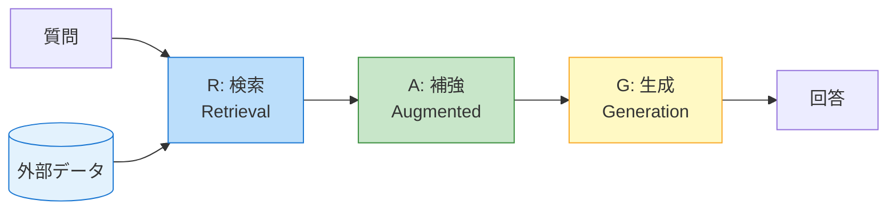
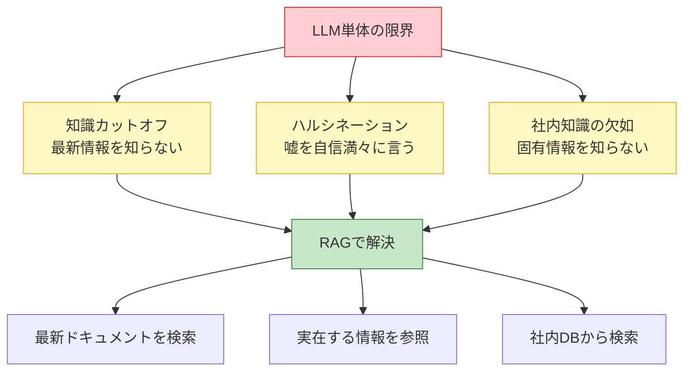
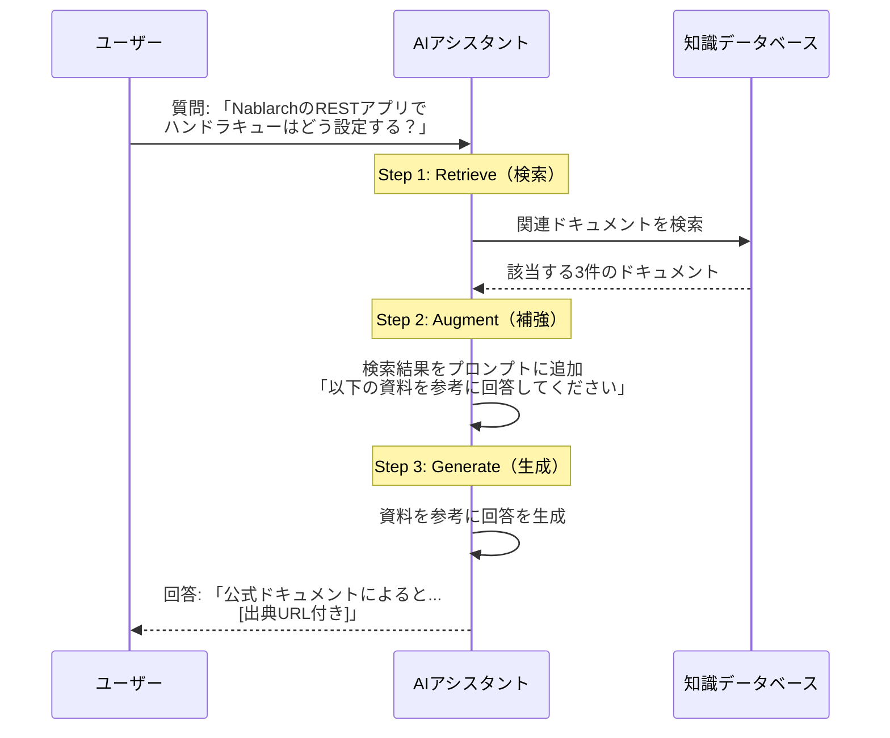
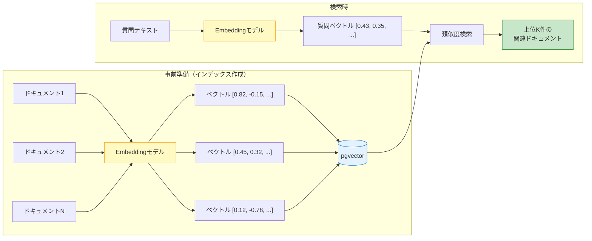
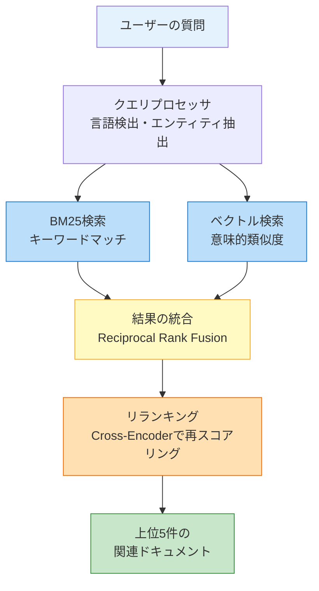

# 第5A回: RAG入門 --- AIが「調べてから答える」仕組みを理解しよう

> **シリーズ**: nablarch-mcp-server 専門家育成シリーズ 第5A回
> **対象読者**: 駆け出しエンジニア（RAGの知識ゼロでもOK）
> **前提記事**: [05. アーキテクチャ概要](./05-architecture-overview.md)
> **想定読了時間**: 20-25分
> **作成日**: 2026-02-07

---

## 目次

1. [この記事で学べること / 前提知識](#1-この記事で学べること--前提知識)
2. [RAGとは何か --- AIが「調べてから答える」仕組み](#2-ragとは何か----aiが調べてから答える仕組み)
3. [なぜRAGが必要なのか --- LLMだけでは解決できない3つの課題](#3-なぜragが必要なのか----llmだけでは解決できない3つの課題)
4. [RAGの3ステップ --- 検索・補強・生成](#4-ragの3ステップ----検索補強生成)
5. [Embeddingとベクトル検索の基礎](#5-embeddingとベクトル検索の基礎)
6. [nablarch-mcp-serverでのRAGの使われ方](#6-nablarch-mcp-serverでのragの使われ方)
7. [まとめ --- 次の記事への橋渡し](#7-まとめ----次の記事への橋渡し)

---

## 1. この記事で学べること / 前提知識

### 1.1 この記事で学べること

この記事を読むと、以下の知識が得られます:

- **RAGとは何か** --- 難しい数式なしで、直感的に理解できる
- **なぜRAGが必要か** --- LLM（大規模言語モデル）の3つの限界を知る
- **RAGの3ステップ** --- Retrieve（検索）、Augment（補強）、Generate（生成）の流れ
- **Embeddingの基礎** --- テキストを「数値の列」に変換する仕組みのイメージ
- **ベクトル検索の直感** --- 「意味が近い」とは何かを理解する
- **nablarch-mcp-serverとRAGの関係** --- 実際のプロダクトでどう使われているか

### 1.2 前提知識

この記事は**RAGの知識ゼロ**の読者を想定しています。以下の知識があれば十分です:

| 分野 | 必要な知識レベル |
|------|----------------|
| **プログラミング** | 変数、関数、配列が分かるレベル |
| **AI/LLM** | 「ChatGPTやClaudeのようなAIが文章を生成できる」ことを知っている |
| **データベース** | 「データを保存して検索できる仕組み」くらいの理解 |
| **前の記事** | [05. アーキテクチャ概要](./05-architecture-overview.md)を読んでいると理想的だが、必須ではない |

> **この記事の位置づけ**
>
> 前の記事（第5回）ではnablarch-mcp-serverの全体アーキテクチャを学びました。
> その中で「RAG Engine Layer」という層が登場しましたが、RAGそのものの説明は省略されていました。
> この記事では、次の記事（第6回: ナレッジの構造化）や第7回（RAGパイプライン詳解）を読む前に
> 必要な**RAGの基礎知識**を身につけます。

---

## 2. RAGとは何か --- AIが「調べてから答える」仕組み

### 2.1 まず結論から

**RAG（Retrieval-Augmented Generation）** とは、AIが質問に答える前に**外部の資料を検索して、その内容を参考にしながら回答を生成する**仕組みです。

日本語に直訳すると「検索で補強された生成」ですが、もっとシンプルに言うと:

> **「AIが知らないことを、調べてから答える仕組み」**

### 2.2 身近な例えで理解する: オープンブックテスト

RAGを理解するのに最適な例えが**オープンブックテスト**（教科書持ち込みOKのテスト）です。

```
【普通のテスト（RAGなし）】
  先生: 「Nablarchのハンドラキューの実行順序は？」
  生徒: 「えーっと...確か...（記憶だけで回答）」
  → 間違えるかもしれない。知らなければ当てずっぽう。

【オープンブックテスト（RAGあり）】
  先生: 「Nablarchのハンドラキューの実行順序は？」
  生徒: 「ちょっと待ってください...（教科書で調べる）」
  生徒: 「教科書の42ページによると...（正確に回答）」
  → 教科書を参照できるので、正確に答えられる！
```

**AIも同じです。** 自分の「記憶」（学習データ）だけで答えようとすると間違えることがありますが、外部の資料を「調べてから」答えれば、正確な回答ができます。

### 2.3 RAGの一言まとめ

| 用語 | 意味 |
|------|------|
| **R** = Retrieval（検索） | 質問に関連する資料を外部データベースから探してくる |
| **A** = Augmented（補強） | 見つけた資料をAIへの指示（プロンプト）に追加する |
| **G** = Generation（生成） | 資料を参考にしながらAIが回答を生成する |



---

## 3. なぜRAGが必要なのか --- LLMだけでは解決できない3つの課題

「AIはすごく賢いのに、なぜわざわざ外部の資料を調べさせる必要があるの?」

それは、LLM（ChatGPTやClaudeのような大規模言語モデル）には**3つの大きな弱点**があるからです。

### 3.1 課題1: 知識カットオフ問題 --- 「最近のことは知りません」

LLMは**ある時点までのデータ**で学習しています。その時点以降に起きたことは、どんなに優秀なAIでも知りません。

```
【例】
  あなた: 「Nablarchの最新バージョンの変更点を教えて」
  AI（RAGなし）: 「私の知識は2025年5月までです。最新の変更点は把握していません」
  AI（RAGあり）: 「最新のリリースノートによると...（正確に回答）」
```

これは**知識カットオフ問題**と呼ばれます。人間で言えば「2025年5月に記憶喪失になって、それ以降のニュースを一切知らない人」のような状態です。

| 要素 | 説明 |
|------|------|
| **原因** | LLMの学習データに期限がある |
| **具体例** | 先月リリースされた新機能、最近修正されたバグ |
| **RAGの解決策** | 最新のドキュメントやリリースノートを検索して参照 |

### 3.2 課題2: ハルシネーション --- 「嘘を自信満々に言う」

LLMは**知らないことでも、それっぽい回答を生成してしまう**ことがあります。これを**ハルシネーション（幻覚）** と呼びます。

```
【例】
  あなた: 「NablarchのDbConnectionManagementHandlerの設定方法は？」
  AI（RAGなし）: 「以下のように設定します...（存在しない設定項目を自信満々に説明）」
  → 一見正しそうに見えるが、実は嘘！

  AI（RAGあり）: 「公式ドキュメントによると...（実際の設定を参照して回答）」
  → 実際のドキュメントに基づいているので正確！
```

ハルシネーションが特に危険なのは、**回答が本物っぽく見える**ことです。プログラムで言えば、コンパイルは通るけど実行すると動かないコードを生成するようなものです。

| 要素 | 説明 |
|------|------|
| **原因** | LLMは「もっともらしい文章を生成する」ように訓練されている |
| **具体例** | 存在しないAPIメソッド名、間違った設定パラメータ |
| **RAGの解決策** | 実在するドキュメントを参照することで、嘘を防止 |

### 3.3 課題3: 社内固有知識の欠如 --- 「そんなの知りません」

LLMは**インターネット上の公開情報**で学習しています。企業の社内ドキュメント、独自フレームワーク、プロジェクト固有の設計ルールなどは**学習データに含まれていません**。

```
【例】
  あなた: 「うちの会社のNablarchプロジェクトで使っている
            カスタムハンドラの一覧を教えて」
  AI（RAGなし）: 「一般的なハンドラは...（一般論しか答えられない）」
  AI（RAGあり）: 「プロジェクトのhandler-catalog.yamlによると、
                    以下のカスタムハンドラが定義されています...」
```

| 要素 | 説明 |
|------|------|
| **原因** | 社内情報はAIの学習データに含まれない |
| **具体例** | 社内コーディング規約、プロジェクト固有の設定、独自ライブラリ |
| **RAGの解決策** | 社内ドキュメントをデータベースに格納し、検索可能にする |

### 3.4 3つの課題のまとめ



---

## 4. RAGの3ステップ --- 検索・補強・生成

RAGの仕組みは、大きく**3つのステップ**に分かれます。ここでは、具体的な例を使って一つずつ見ていきましょう。

### 4.1 全体の流れ

まず、全体像を図で確認します。



### 4.2 Step 1: Retrieve（検索）--- 関連する資料を探す

最初のステップは**検索**です。ユーザーの質問に関連するドキュメントを、データベースから探し出します。

**人間で例えると**: 図書館で関連する本を探す作業。

```
【入力】ユーザーの質問
  「NablarchのRESTアプリでハンドラキューはどう設定する？」

【処理】データベースを検索
  - キーワード「REST」「ハンドラキュー」「設定」で検索
  - 意味的に近いドキュメントも検索（後述のベクトル検索）

【出力】関連ドキュメント（上位数件）
  1. 「RESTful Webサービス ハンドラキュー構成ガイド」（類似度: 0.92）
  2. 「ハンドラキューの設定リファレンス」（類似度: 0.87）
  3. 「Webアプリケーションとの設定の違い」（類似度: 0.81）
```

ポイントは、**全てのドキュメントを読むのではなく、関連性が高いものだけを選ぶ**ことです。数千件のドキュメントから、必要な数件だけを効率よく見つけ出します。

### 4.3 Step 2: Augment（補強）--- プロンプトに検索結果を追加する

次のステップは**補強**です。検索で見つけたドキュメントを、AIへの指示（プロンプト）に追加します。

**人間で例えると**: テストの問題用紙と一緒に参考資料を配る作業。

```
【RAGなしのプロンプト】
  ユーザーの質問: NablarchのRESTアプリでハンドラキューはどう設定する？

【RAGありのプロンプト（補強済み）】
  以下の参考資料を元に、ユーザーの質問に回答してください。
  回答は参考資料の内容に基づき、出典を明記してください。

  --- 参考資料1 ---
  タイトル: RESTful Webサービス ハンドラキュー構成ガイド
  内容: RESTアプリケーションのハンドラキューは以下の順序で構成する...
  出典: https://nablarch.github.io/docs/...

  --- 参考資料2 ---
  タイトル: ハンドラキューの設定リファレンス
  内容: handler-queue要素にはinitialization-order属性を指定し...
  出典: https://nablarch.github.io/docs/...

  --- ユーザーの質問 ---
  NablarchのRESTアプリでハンドラキューはどう設定する？
```

ここが**RAGの核心**です。AIが「自分の記憶」だけでなく、「実際のドキュメント」を見ながら答えられるようになります。

### 4.4 Step 3: Generate（生成）--- 資料を参考に回答する

最後のステップは**生成**です。LLMが、補強されたプロンプト（質問 + 参考資料）を元に回答を生成します。

**人間で例えると**: 参考資料を読みながらテストの答案を書く作業。

```
【AIの回答】
  NablarchのRESTアプリケーションにおけるハンドラキューの設定方法を説明します。

  公式ドキュメント（※参考資料1）によると、RESTアプリケーションの
  ハンドラキューは以下の順序で構成します:

  1. GlobalErrorHandler（グローバルエラーハンドラ）
  2. HttpCharacterEncodingHandler（文字エンコーディング）
  3. HttpResponseHandler（レスポンスハンドラ）
  4. ...（以下略）

  出典:
  - RESTful Webサービス ハンドラキュー構成ガイド
    https://nablarch.github.io/docs/...
```

RAGの大きな利点は、**出典（ソース）を明示できる**ことです。「AIがそう言ったから」ではなく「公式ドキュメントのここに書いてある」と根拠を示せます。

### 4.5 3ステップまとめ

| ステップ | 名前 | やること | 人間で例えると |
|---------|------|---------|---------------|
| Step 1 | **Retrieve（検索）** | 質問に関連するドキュメントをDBから検索 | 図書館で関連する本を探す |
| Step 2 | **Augment（補強）** | 検索結果をAIへの指示に追加 | テスト問題と一緒に参考資料を配る |
| Step 3 | **Generate（生成）** | 参考資料を元にAIが回答を生成 | 参考資料を見ながら答案を書く |

---

## 5. Embeddingとベクトル検索の基礎

前の章で「データベースから関連ドキュメントを検索する」と説明しましたが、ここで疑問が生まれます。

> 「関連するドキュメント」って、どうやって見つけるの?

この問いに答えるのが**Embedding（エンベディング）** と**ベクトル検索**です。

### 5.1 キーワード検索の限界

まず、普通の**キーワード検索**を考えてみましょう。

```
質問: 「データベース接続のエラーを解決したい」

キーワード検索: 「データベース」「接続」「エラー」を含むドキュメントを探す

結果:
  ○ 「データベース接続エラーの対処法」 → ヒット!
  ✕ 「DbConnectionManagementHandlerの障害対応」 → ヒットしない...
```

2つ目のドキュメントは**まさに探していた情報**ですが、「データベース」「接続」「エラー」という単語が一つも含まれていないためヒットしません。

キーワード検索は**同じ言葉を使っていないと見つけられない**のです。

### 5.2 Embeddingとは --- テキストを「意味のベクトル」に変換する

**Embedding**は、テキストを**数値の列（ベクトル）** に変換する技術です。

```
テキスト                              ベクトル（実際は1024個の数値）
─────────────────                     ──────────────────────
「データベース接続」        →         [0.82, -0.15, 0.43, ..., 0.21]
「DbConnection」            →         [0.79, -0.12, 0.41, ..., 0.25]
「天気予報」                →         [-0.31, 0.67, -0.55, ..., 0.88]
```

ここで重要なのは:

- **「データベース接続」** と **「DbConnection」** は異なる言葉だが、意味が近いのでベクトルも似ている
- **「天気予報」** は全く違う話題なので、ベクトルも大きく異なる

つまり、Embeddingは**テキストの「意味」を数値で表現する**技術です。

### 5.3 ベクトルの「近さ」= 意味の「近さ」

ベクトルがどれくらい似ているかを測る指標が**コサイン類似度**です。難しそうに聞こえますが、直感的には以下のように理解できます。

| コサイン類似度 | 意味 | 例 |
|--------------|------|-----|
| **1.0** | 完全に同じ意味 | 「犬」と「犬」 |
| **0.8-0.9** | とても似ている | 「データベース接続」と「DB接続」 |
| **0.5-0.7** | やや関連がある | 「データベース」と「SQL」 |
| **0.0-0.3** | ほぼ無関係 | 「データベース」と「天気予報」 |

以下の図は、テキストをベクトルに変換すると意味が近いものが空間的にも近くなることを示しています。

```
ベクトル空間（2次元に簡略化）

  ↑
  |    (天気予報)
  |
  |
  |         (料理レシピ)
  |
  |                              (DB接続)
  |                            (データベース接続)
  |                          (DbConnection)
  |
  +──────────────────────────────────────→

  ※ 「DB接続」「データベース接続」「DbConnection」が
     空間上で近い位置に集まっている!
```

### 5.4 ベクトル検索の仕組み

ベクトル検索は以下の手順で動きます:

```
Step 1: ドキュメントを事前にベクトル化して保存（インデックス作成）
  「ハンドラキュー設定ガイド」 → [0.45, 0.32, ...]  → DBに保存
  「エラーハンドリング手順」   → [0.12, -0.78, ...] → DBに保存
  「REST API設計パターン」     → [0.67, 0.21, ...]  → DBに保存
  ... (数千件)

Step 2: 質問をベクトル化
  「Nablarchでハンドラの順番を設定したい」 → [0.43, 0.35, ...]

Step 3: 似ているベクトルを探す
  質問ベクトル vs 全ドキュメントベクトル のコサイン類似度を計算
  → 類似度が高い順にランキング

Step 4: 上位の結果を返す
  1位: 「ハンドラキュー設定ガイド」（類似度: 0.91）  ← ヒット!
  2位: 「REST API設計パターン」（類似度: 0.74）
  3位: 「エラーハンドリング手順」（類似度: 0.32）
```

ポイントは、質問とドキュメントで**同じ言葉を使っていなくても**、意味が近ければ見つけられることです。「ハンドラの順番を設定したい」で「ハンドラキュー設定ガイド」がヒットするのは、ベクトル検索ならではです。

### 5.5 pgvectorの役割

ベクトルを保存して検索するには、**ベクトル対応のデータベース**が必要です。nablarch-mcp-serverでは**PostgreSQL + pgvector**を使用しています。

| 要素 | 役割 |
|------|------|
| **PostgreSQL** | 世界で最も人気のあるオープンソースRDBMSの一つ。信頼性が高い |
| **pgvector** | PostgreSQLにベクトル検索機能を追加する拡張モジュール |
| **vector型** | 数値ベクトル（例: 1024次元）を格納できるデータ型 |
| **IVFFlatインデックス** | 大量のベクトルから高速に近傍を見つけるためのインデックス |

普通のデータベース検索との違いを表にまとめます:

| 比較項目 | 通常のSQL検索 | pgvectorによるベクトル検索 |
|---------|-------------|-------------------------|
| **検索対象** | 文字列、数値 | 数値ベクトル（例: 1024次元） |
| **検索方法** | 完全一致、LIKE、全文検索 | コサイン類似度、ユークリッド距離 |
| **マッチ基準** | 文字が一致するか | 意味が近いか |
| **SQL例** | `WHERE name LIKE '%ハンドラ%'` | `ORDER BY embedding <=> query_vec` |

```sql
-- 通常の検索（キーワード一致）
SELECT * FROM documents WHERE content LIKE '%ハンドラキュー%';

-- ベクトル検索（意味的に近いものを検索）
SELECT * FROM document_chunks
ORDER BY embedding <=> '[0.43, 0.35, ...]'::vector  -- コサイン類似度
LIMIT 5;
```

### 5.6 Embedding まとめ

ここまでの内容を整理します。



---

## 6. nablarch-mcp-serverでのRAGの使われ方

ここまでRAGの一般的な仕組みを学びました。では、nablarch-mcp-serverでは**実際にどのようにRAGが使われている**のでしょうか。

### 6.1 SemanticSearchTool --- RAGの入り口

nablarch-mcp-serverには10種類のToolがありますが、その中核となるのが**SemanticSearchTool**です。このToolが、まさに前の章で学んだRAGの仕組みを使っています。

```
ユーザー: 「NablarchでRESTアプリを作るとき、バリデーションはどうする？」

  ↓ AIがSemanticSearchToolを呼び出す

SemanticSearchTool:
  1. [Retrieve] 「REST バリデーション Nablarch」で知識DBを検索
  2. [Augment]  検索結果をAIのコンテキストに追加
  3. [Generate] AIが検索結果を参考に回答を生成
```

### 6.2 ハイブリッド検索 --- キーワード検索とベクトル検索の「いいとこ取り」

nablarch-mcp-serverは、検索精度を高めるために**2つの検索方式を組み合わせて**います。これを**ハイブリッド検索**と呼びます。

| 検索方式 | 特徴 | 得意なこと | 苦手なこと |
|---------|------|----------|----------|
| **BM25（キーワード検索）** | 単語の出現頻度ベース | 正確なクラス名、設定名で検索 | 言い換え、同義語 |
| **ベクトル検索** | 意味の類似度ベース | 自然な質問文、概念的な検索 | 正確な固有名詞 |
| **ハイブリッド** | 両方を組み合わせ | 幅広い検索に対応 | --- |

なぜ組み合わせるのかを、具体例で見てみましょう:

```
質問: 「DbConnectionManagementHandlerの使い方」

BM25の結果:
  1位: DbConnectionManagementHandlerのJavadoc（完全一致）    ← 正確!
  2位: DbConnectionManagementHandlerの設定例
  ※ キーワードが完全一致するので得意

ベクトル検索の結果:
  1位: データベース接続管理の概要ガイド                       ← 関連性高い!
  2位: トランザクション制御とDB接続の関係
  ※ 「使い方」という意味を理解して関連ドキュメントも発見

ハイブリッド検索の結果（両方を統合）:
  1位: DbConnectionManagementHandlerのJavadoc
  2位: データベース接続管理の概要ガイド
  3位: DbConnectionManagementHandlerの設定例
  → キーワードで正確に見つけつつ、意味的に関連する文書も網羅!
```

### 6.3 検索パイプライン全体像

nablarch-mcp-serverのRAG検索は、以下のパイプラインで実行されます。



各ステップを簡単に説明します:

| ステップ | 処理 | 何をしているか（例え） |
|---------|------|---------------------|
| **クエリプロセッサ** | 質問を分析。日本語/英語の判定、クラス名等の抽出 | 「この質問は何について聞いている?」と理解する |
| **BM25検索** | キーワードの出現頻度で検索 | 教科書の索引から該当ページを探す |
| **ベクトル検索** | 意味の近さで検索 | 教科書を読んで「この章が関係ありそう」と判断する |
| **結果の統合（RRF）** | 2つの検索結果を1つのランキングに統合 | 2人の司書のおすすめリストを合体させる |
| **リランキング** | 統合結果を質問との関連度で再評価 | 合体リストを「本当に役立つ順」に並べ直す |

### 6.4 RAGの恩恵を受ける他のTool

SemanticSearchToolだけでなく、多くのToolがRAGの恩恵を受けています。

| Tool名 | RAGの使い方 |
|--------|-----------|
| **SemanticSearchTool** | ユーザーの質問でRAG検索を直接実行 |
| **HandlerQueueDesignTool** | ハンドラの仕様をRAGで取得してキュー設計に活用 |
| **CodeGenerationTool** | コード例や設計パターンをRAGで検索して参考に |
| **TroubleshootTool** | エラーパターンとその解決策をRAGで検索 |
| **ConfigValidationTool** | 設定ルールやハンドラの順序制約をRAGで取得 |

つまり、RAGはnablarch-mcp-serverの**心臓部**であり、ほぼ全てのToolが何らかの形でRAGの検索結果を利用しています。

### 6.5 RAGなしとRAGありの比較

最後に、RAGがある場合とない場合で、nablarch-mcp-serverの回答品質がどう変わるかを見てみましょう。

```
質問: 「NablarchのRESTアプリで認証を実装したい」

【RAGなし（LLMの記憶だけ）】
  「一般的にJavaのWebアプリケーションで認証を実装するには、
   Spring Securityを使用する方法が一般的です...」
  → NablarchにSpring Securityは使えない! 完全に的外れ。

【RAGあり（nablarch-mcp-server）】
  「Nablarchでは、SessionStoreHandlerとPermissionCheckHandlerを
   ハンドラキューに追加することで認証・認可を実装できます。
   RESTアプリの場合はトークンベース認証が推奨されています...
   （出典: https://nablarch.github.io/docs/...）」
  → Nablarch固有の正確な回答! 出典付き!
```

---

## 7. まとめ --- 次の記事への橋渡し

### 7.1 この記事で学んだこと

この記事では、RAG（Retrieval-Augmented Generation）の基礎を学びました:

| 項目 | 学んだこと |
|------|----------|
| **RAGとは** | AIが外部資料を「調べてから答える」仕組み。オープンブックテストのイメージ |
| **なぜ必要か** | LLMの3つの限界（知識カットオフ、ハルシネーション、社内知識の欠如）を解決 |
| **3ステップ** | Retrieve（検索）→ Augment（補強）→ Generate（生成） |
| **Embedding** | テキストを数値ベクトルに変換し、「意味の近さ」を計算可能にする技術 |
| **ベクトル検索** | キーワードが一致しなくても、意味が近いドキュメントを発見できる |
| **pgvector** | PostgreSQLにベクトル検索機能を追加する拡張モジュール |
| **ハイブリッド検索** | BM25（キーワード）+ ベクトル検索の「いいとこ取り」で検索精度を向上 |

### 7.2 重要な用語集

この記事で登場した用語を、今後の記事で使われる前におさらいしておきましょう。

| 用語 | 意味 |
|------|------|
| **RAG** | Retrieval-Augmented Generation。検索で補強された生成 |
| **LLM** | Large Language Model。大規模言語モデル（Claude、ChatGPT等） |
| **Embedding** | テキストを数値ベクトルに変換する技術 |
| **ベクトル** | 数値の列（例: [0.82, -0.15, 0.43]）。意味を数値で表現 |
| **コサイン類似度** | 2つのベクトルがどれくらい似ているかを測る指標（0〜1） |
| **BM25** | キーワードの出現頻度に基づく古典的な検索手法 |
| **ハイブリッド検索** | BM25とベクトル検索を組み合わせた検索手法 |
| **pgvector** | PostgreSQLにベクトル検索を追加する拡張モジュール |
| **リランキング** | 検索結果の順位を再評価して精度を上げる処理 |
| **ハルシネーション** | AIが事実でない情報を生成してしまう現象 |

### 7.3 次の記事で学ぶこと

この記事でRAGの基礎を理解しました。次の記事では、nablarch-mcp-serverが持つ**2種類の知識**について学びます:

**[第6回: ナレッジの構造化 --- YAML知識ファイルの設計思想と実装](./06-knowledge-structure.md)**

- **静的知識（YAML）と動的知識（RAG）の使い分け** --- なぜ2層構造なのか
- **17種類のYAML知識ファイル**の全体構成と設計パターン
- **ResourceProvider**による知識の公開方法
- 知識の**追加・更新**プロセス

RAGの仕組みを理解した今なら、「なぜYAMLファイル（静的知識）がRAG（動的知識）と併用されているのか」という設計判断の理由が、より深く理解できるはずです。

> **さらに先の記事のプレビュー**: 第7回（RAGパイプライン詳解）では、この記事で触れたEmbedding、ハイブリッド検索、リランキングの仕組みを**実装レベルで詳しく**掘り下げます。この記事の知識があれば、第7回も安心して読み進められます。

---

## ナビゲーション

- **[<- 前の記事: 05-アーキテクチャ概要](05-architecture-overview.md)**
- **[-> 次の記事: 06-ナレッジの構造化](06-knowledge-structure.md)**
- **[記事一覧に戻る](INDEX.md)**

---

## 参考資料

- [Retrieval-Augmented Generation for Knowledge-Intensive NLP Tasks (Lewis et al., 2020)](https://arxiv.org/abs/2005.11401) - RAGの原論文
- [pgvector公式リポジトリ](https://github.com/pgvector/pgvector) - PostgreSQLベクトル検索拡張
- [記事05: アーキテクチャ概要](./05-architecture-overview.md) - nablarch-mcp-serverの全体設計
- [記事07: RAGパイプライン詳解](./07-rag-pipeline-deep-dive.md) - RAGの実装詳細（本記事の発展版）
