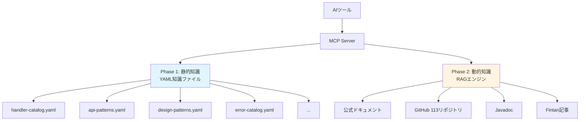
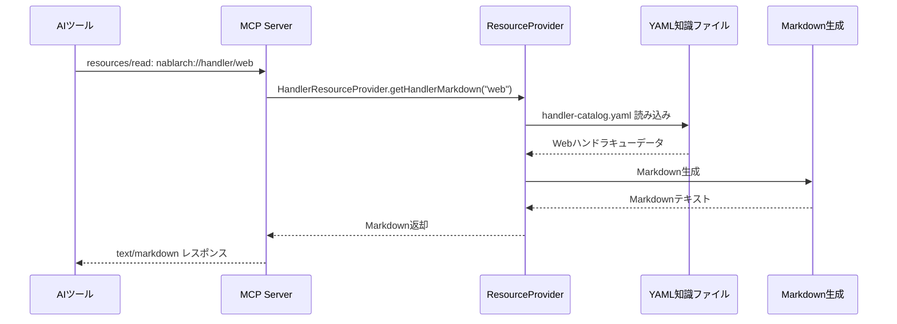
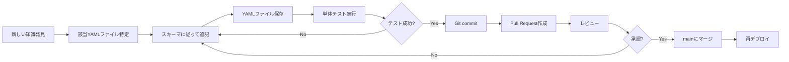

# ナレッジの構造化 — YAML知識ファイルの設計思想と実装

> **シリーズ**: Nablarch MCP Server 専門家育成シリーズ（全14回）
> **対象読者**: 中級者エンジニア、MCPサーバー構築者
> **想定読了時間**: 20-25分

---

## この記事で学べること

この記事を読むと、以下のことが理解できます。

- **静的知識（YAML）** と **動的知識（RAG）** の使い分けと設計思想
- Nablarch MCP Serverにおける **10種類のYAML知識ファイル** の全体構成
- YAML知識ファイルの **設計パターン** と **構造化のルール**
- **ResourceProvider** による知識の公開方法
- 知識の **追加・更新** プロセス
- なぜYAMLなのか？（JSON/DBとの比較と設計判断）

### 前提知識

- MCPの基本概念（Tools / Resources / Prompts）を理解している
- YAML形式の基本的な読み書きができる
- MCP Serverの全体アーキテクチャを把握している

### 次の記事

この記事を読み終えたら、次は **[08-spring-ai-mcp-integration.md](08-spring-ai-mcp-integration.md)** へ進んでください。Spring AI MCP Serverとの統合を学びます。

---

## 1. 静的知識 vs 動的知識 — 2層構造の知識ベース

Nablarch MCP Serverは、**2層構造の知識ベース** を採用しています。



### 1.1 静的知識（YAML）の特徴

| 項目 | 内容 |
|------|------|
| **データソース** | 10個のYAMLファイル |
| **精度** | 100%（人間が作成・レビュー） |
| **更新頻度** | 低（フレームワークの仕様変更時のみ） |
| **検索速度** | 高速（インメモリ） |
| **検索方式** | キーワード完全一致 |
| **用途** | ハンドラキュー、API使用例、設計パターン、エラー解決策 |

### 1.2 動的知識（RAG）の特徴

| 項目 | 内容 |
|------|------|
| **データソース** | 公式ドキュメント、GitHub、Javadoc、Fintan |
| **精度** | 高（BM25 + ベクトル検索 + リランキング） |
| **更新頻度** | 高（クロール・インデックス更新） |
| **検索速度** | 中速（pgvector） |
| **検索方式** | セマンティック検索 |
| **用途** | 広範囲な情報検索、ドキュメント全文、コード例 |

### 1.3 なぜ2層構造なのか？

**Phase 1（静的知識）の役割**:
- **確実に正しい情報** を提供する基盤
- ハンドラキュー設計など、**間違えると動かない** 重要な知識
- AIツールが最初に参照すべき「正解カタログ」

**Phase 2（動的知識）の役割**:
- 静的知識ではカバーしきれない **広範囲な情報** を検索
- 最新のベストプラクティス、詳細なドキュメント、実装例

**両者の組み合わせ**:
1. まず静的知識（YAML）で正確な基礎知識を取得
2. 次にRAGで関連ドキュメントを補完
3. AIツールは両方の情報を統合して回答

---

## 2. YAML知識ファイルの全体構成 — 10ファイルの役割

Nablarch MCP Serverは、**10種類のYAML知識ファイル** で静的知識を管理しています。

```
src/main/resources/knowledge/
├── handler-catalog.yaml          # ハンドラカタログ
├── api-patterns.yaml             # APIパターン集
├── design-patterns.yaml          # 設計パターン集
├── handler-constraints.yaml      # ハンドラ順序制約
├── config-templates.yaml         # XML設定テンプレート
├── error-catalog.yaml            # エラーカタログ
├── example-catalog.yaml          # サンプルコード集
├── version-info.yaml             # バージョン情報
├── antipattern-catalog.yaml      # アンチパターン集
└── module-catalog.yaml           # モジュールカタログ
```

### 2.1 各ファイルの詳細

| ファイル | 役割 | 主な利用ツール |
|---------|------|---------------|
| **handler-catalog.yaml** | 6アプリタイプ別のハンドラキュー定義（Web、REST、Batch等） | `design_handler_queue`, `nablarch://handler/*` |
| **api-patterns.yaml** | Nablarch APIの使用パターンとコード例（全7カテゴリ） | `search_api`, `generate_code`, `nablarch://pattern/*` |
| **design-patterns.yaml** | Nablarch固有の設計パターン（アーキテクチャ、ハンドラ、Action等） | `recommend_pattern`, `nablarch://pattern/*` |
| **handler-constraints.yaml** | ハンドラ間の順序制約ルール（must_before/must_after） | `validate_config`, `optimize_handler_queue` |
| **config-templates.yaml** | XML設定のテンプレート（web.xml、コンポーネント定義等） | `generate_code`, `nablarch://config/*` |
| **error-catalog.yaml** | よくあるエラーと解決策（カテゴリ別・重要度付き） | `troubleshoot` |
| **example-catalog.yaml** | サンプルアプリケーションの構成・コードテンプレート | `generate_code` |
| **version-info.yaml** | Nablarchバージョン情報・プラットフォーム情報 | `nablarch://version` |
| **antipattern-catalog.yaml** | アンチパターン集（やってはいけない実装パターン） | `review-code` Prompt |
| **module-catalog.yaml** | Nablarchモジュール一覧と主要クラス | `search_api` |

---

## 3. YAML知識ファイルの設計パターン

### 3.1 設計原則

Nablarch MCP ServerのYAML知識ファイルは、以下の設計原則に従っています。

| 原則 | 内容 |
|------|------|
| **1. 構造化優先** | 全ファイルが統一されたスキーマに従う |
| **2. 相互参照可能** | `related_patterns` や `related_handlers` で関連性を明示 |
| **3. 完全性** | 必須フィールド（name, description, fqcn等）を明確化 |
| **4. 可読性** | 人間が直接読んで理解できる |
| **5. Git管理** | 変更履歴をトラッキング可能 |

### 3.2 実例1: handler-catalog.yaml

**6つのアプリタイプ別** にハンドラキューを定義しています。

```yaml
web:
  description: "Webアプリケーション用ハンドラキュー"
  handlers:
    - name: HttpCharacterEncodingHandler
      fqcn: "nablarch.fw.web.handler.HttpCharacterEncodingHandler"
      description: "HTTPリクエスト/レスポンスの文字エンコーディングを設定する"
      order: 1
      required: true
      thread: main
      constraints:
        must_before:
          - GlobalErrorHandler

    - name: GlobalErrorHandler
      fqcn: "nablarch.fw.handler.GlobalErrorHandler"
      description: "未処理の例外をキャッチし、エラーレスポンスを返す"
      order: 2
      required: true
      thread: main
      constraints:
        must_before:
          - HttpResponseHandler
```

**設計のポイント**:
- `order` フィールドでハンドラの順序を明示
- `required` で必須/オプションを区別
- `thread` でメイン/サブスレッドを区別（バッチのマルチスレッド処理で重要）
- `constraints` で順序制約を明示（後述の handler-constraints.yaml と連携）

### 3.3 実例2: api-patterns.yaml

**APIの使用パターン** をカテゴリ別に管理しています。

```yaml
patterns:
  - name: universal-dao
    category: library
    description: "Universal DAOによるデータベースアクセスパターン。エンティティクラスを使ったCRUD操作"
    fqcn: "nablarch.common.dao.UniversalDao"
    related_patterns:
      - sql-file
      - entity-class
    example: |
      // 全件検索
      EntityList<User> users = UniversalDao.findAll(User.class);

      // 主キー検索
      User user = UniversalDao.findById(User.class, userId);

      // SQLファイルによる条件検索
      Map<String, String> condition = new HashMap<>();
      condition.put("userName", "%田中%");
      EntityList<User> users = UniversalDao.findAllBySqlFile(
          User.class, "FIND_BY_NAME", condition);

      // 挿入
      UniversalDao.insert(user);

      // 更新
      UniversalDao.update(user);

      // 削除
      UniversalDao.delete(user);
```

**設計のポイント**:
- `category` で7つのカテゴリに分類（web, rest, batch, messaging, library, testing, config）
- `related_patterns` で関連パターンを明示（グラフ構造）
- `example` に **動作する完全なコード例** を記載（コメントなし・実行可能）

### 3.4 実例3: handler-constraints.yaml

**ハンドラ間の順序制約** をルールとして定義しています。

```yaml
constraints:
  - handler: DbConnectionManagementHandler
    fqcn: "nablarch.common.handler.DbConnectionManagementHandler"
    rule: relative_order
    must_before:
      - TransactionManagementHandler
      - LoopHandler
      - MultiThreadExecutionHandler
    required_by_app_type:
      - web
      - rest
      - batch
      - messaging
      - http-messaging
      - jakarta-batch
    reason: "DB接続の確立はトランザクション管理やデータ処理の前提条件。接続がない状態でトランザクションを開始できない"

  - handler: TransactionManagementHandler
    fqcn: "nablarch.common.handler.TransactionManagementHandler"
    rule: relative_order
    must_after:
      - DbConnectionManagementHandler
    must_before:
      - PackageMapping
      - RequestPathJavaPackageMapping
      - DataReadHandler
    required_by_app_type:
      - web
      - rest
      - batch
      - messaging
      - http-messaging
      - jakarta-batch
    reason: "トランザクション管理はDB接続確立後、ビジネスロジック（アクション実行）の前に配置する"
```

**設計のポイント**:
- `rule` で制約タイプを分類（must_be_outer, must_be_inner, relative_order, conditional）
- `must_before` / `must_after` で前後関係を明示
- `required_by_app_type` でアプリタイプごとの必須性を指定
- `reason` で **なぜこの順序が必要なのか** を説明（開発者教育にも使える）

### 3.5 実例4: error-catalog.yaml

**よくあるエラーと解決策** をカタログ化しています。

```yaml
errors:
  - id: "ERR-005"
    category: database
    error_message: "nablarch.common.dao.NoDataException"
    cause: "UniversalDao.findByIdで指定した主キーに該当するレコードが存在しない"
    solution: |
      1. 検索条件（主キー値）が正しいか確認
      2. findByIdの代わりにfindAllBySqlFileで存在チェックを行う
      3. try-catchでNoDataExceptionをハンドリングし、適切なエラーメッセージを返す:
         try {
             User user = UniversalDao.findById(User.class, userId);
         } catch (NoDataException e) {
             throw new HttpErrorResponse(404);
         }
    related_modules:
      - nablarch-common-dao
    severity: error
```

**設計のポイント**:
- `id` で一意識別（ERR-001 〜 ERR-017）
- `category` で分類（handler, database, validation, config, batch, general）
- `severity` で重要度を3段階に分類（critical, error, warning）
- `solution` に **具体的な解決手順** を記載（箇条書き + コード例）

### 3.6 実例5: version-info.yaml

**バージョン情報とプラットフォーム情報** を一元管理しています。

```yaml
version_info:
  framework_name: "Nablarch"
  latest_version: "6u3"
  release_date: "2024-09"

  supported_versions:
    - version: "6u3"
      status: "current"
      java_versions: ["17", "21"]
      jakarta_ee_version: "10"
    - version: "5u24"
      status: "maintenance"
      java_versions: ["8", "11"]
      java_ee_version: "8"

  platforms:
    application_server:
      - name: "Apache Tomcat"
        versions: ["10.1"]
      - name: "WildFly"
        versions: ["30"]
    database:
      - name: "Oracle Database"
        versions: ["19c", "21c", "23ai"]
      - name: "PostgreSQL"
        versions: ["14", "15", "16"]

  bom:
    group_id: "com.nablarch.profile"
    artifact_id: "nablarch-bom"
    version: "6u3"
```

**設計のポイント**:
- バージョン情報を **単一ファイル** で管理（メンテナンスが容易）
- プラットフォーム互換性を明示（アプリサーバー、DB、Java等）
- BOM情報を含めることで、Maven/Gradleの依存関係設定を支援

---

## 4. なぜYAMLなのか？ — JSON/DBとの比較

### 4.1 候補技術の比較

Nablarch MCP Serverの静的知識管理には、YAML以外にもいくつかの選択肢がありました。

| 技術 | メリット | デメリット | 採用判断 |
|------|---------|-----------|---------|
| **YAML** | • 人間が読みやすい<br>• コメント記述可能<br>• Git管理可能<br>• 階層構造が直感的 | • パース速度がJSONより遅い | ✅ **採用** |
| **JSON** | • パース速度が速い<br>• JavaScript等で扱いやすい | • コメント不可<br>• 人間の可読性が低い<br>• 階層構造が冗長 | ❌ 却下 |
| **PostgreSQL** | • クエリが柔軟<br>• トランザクション管理 | • 起動時にDB必須<br>• Git管理不可<br>• 差分確認が困難 | ❌ 却下 |
| **SQLite** | • ファイルベース<br>• クエリが柔軟 | • Git管理が困難<br>• バイナリ形式 | ❌ 却下 |
| **Markdown** | • 人間が読みやすい | • 構造化データに不向き<br>• パースが複雑 | ❌ 却下 |

### 4.2 YAML採用の決め手

| 要件 | なぜYAMLが最適か |
|------|---------------|
| **人間による編集** | コメントを書けるため、設計意図を残しやすい |
| **Git管理** | テキスト形式のため、diff/mergeが容易 |
| **レビュー** | Pull Requestでレビュー可能 |
| **階層構造** | ネストが直感的（JSONのように `}` が大量に並ばない） |
| **起動時ロード** | Spring Bootの `@ConfigurationProperties` で簡単に読み込める |
| **Phase 2への移行** | RAGエンジン導入時も、YAMLファイルをインデックス化すれば知識ソースとして再利用可能 |

### 4.3 YAMLのデメリットとその対策

| デメリット | 対策 |
|----------|------|
| **パース速度** | 起動時に1回だけ読み込み、インメモリにキャッシュ |
| **スキーマ検証** | CI/CDでYAML Lintを実行し、構文エラーを検出 |
| **巨大化** | 10ファイルに分割し、1ファイルあたり500行以下を維持 |

---

## 5. ResourceProviderによる知識の公開

### 5.1 知識の公開フロー

YAML知識ファイルは、**ResourceProvider** を経由してMCP Resourceとして公開されます。



### 5.2 ResourceProviderの実装例

```java
@Component
public class HandlerResourceProvider {
    private final Map<String, HandlerQueue> handlerCatalog;

    @PostConstruct
    public void initialize() {
        // 起動時にYAMLファイルを読み込み
        Yaml yaml = new Yaml();
        InputStream inputStream = getClass()
            .getResourceAsStream("/knowledge/handler-catalog.yaml");
        Map<String, Object> data = yaml.load(inputStream);

        // インメモリに保持
        this.handlerCatalog = parseHandlerCatalog(data);
    }

    public String getHandlerMarkdown(String appType) {
        HandlerQueue queue = handlerCatalog.get(appType);
        if (queue == null) {
            return "# Unknown Application Type: " + appType;
        }

        // Markdown生成
        StringBuilder md = new StringBuilder();
        md.append("# Nablarch ").append(capitalize(appType))
          .append(" Application Handler Queue\n\n");
        md.append(queue.description()).append("\n\n");
        md.append("## Handler Queue (in order)\n\n");

        for (Handler handler : queue.handlers()) {
            md.append("### ").append(handler.order()).append(". ")
              .append(handler.name());
            if (handler.required()) {
                md.append(" **[Required]**");
            }
            md.append("\n");
            md.append("- **FQCN**: `").append(handler.fqcn()).append("`\n");
            md.append("- **Thread**: ").append(handler.thread()).append("\n");
            md.append("- **Description**: ").append(handler.description()).append("\n\n");
        }

        return md.toString();
    }
}
```

### 5.3 MCP Resource URI設計

| URI | 説明 | データソース |
|-----|------|------------|
| `nablarch://handler/{app_type}` | アプリタイプ別ハンドラキュー | handler-catalog.yaml |
| `nablarch://api/{module}/{class}` | APIリファレンス | api-patterns.yaml |
| `nablarch://pattern/{name}` | 設計パターン | design-patterns.yaml |
| `nablarch://config/{name}` | 設定テンプレート | config-templates.yaml |
| `nablarch://error/{id}` | エラー解決策 | error-catalog.yaml |
| `nablarch://example/{type}` | サンプルコード | example-catalog.yaml |
| `nablarch://version` | バージョン情報 | version-info.yaml |
| `nablarch://antipattern/{name}` | アンチパターン | antipattern-catalog.yaml |

---

## 6. 知識の追加・更新方法

### 6.1 知識追加のワークフロー



### 6.2 追加例: 新しいAPIパターンを追加

```yaml
# api-patterns.yaml に追加
patterns:
  - name: file-upload-multipart
    category: web
    description: "MultipartHandlerによるファイルアップロードパターン"
    fqcn: "nablarch.fw.web.handler.multipart.MultipartHandler"
    related_patterns:
      - action-class
    example: |
      @InjectForm(form = FileUploadForm.class)
      public HttpResponse doUpload(HttpRequest request, ExecutionContext context) {
          FileUploadForm form = context.getRequestScopedVar("form");
          PartInfo file = form.getFile();

          // ファイル保存
          File dest = new File("/upload/" + file.getFileName());
          file.saveTo(dest);

          return new HttpResponse("redirect:///action/upload/complete");
      }
```

### 6.3 更新例: エラーカタログに新しいエラーを追加

```yaml
# error-catalog.yaml に追加
errors:
  - id: "ERR-018"
    category: messaging
    error_message: "nablarch.fw.messaging.MessageSendException"
    cause: "メッセージキューへの送信に失敗。接続タイムアウトまたはキュー満杯"
    solution: |
      1. メッセージキューのステータスを確認（起動中か、接続可能か）
      2. ネットワーク設定を確認（ファイアウォール、ポート開放）
      3. キューの容量を確認（満杯の場合は古いメッセージを削除）
      4. リトライ設定を確認（RetryHandlerの設定）
    related_handlers:
      - MessageSender
    related_modules:
      - nablarch-fw-messaging
    severity: critical
```

### 6.4 テストコードでの検証

```java
@SpringBootTest
class HandlerCatalogTest {

    @Autowired
    private HandlerResourceProvider provider;

    @Test
    void testWebHandlerQueue() {
        String markdown = provider.getHandlerMarkdown("web");

        // 必須ハンドラが含まれているか検証
        assertThat(markdown).contains("GlobalErrorHandler");
        assertThat(markdown).contains("DbConnectionManagementHandler");
        assertThat(markdown).contains("TransactionManagementHandler");

        // 順序制約が守られているか検証
        assertThat(markdown.indexOf("DbConnectionManagementHandler"))
            .isLessThan(markdown.indexOf("TransactionManagementHandler"));
    }
}
```

---

## 7. まとめ — 静的知識が支えるMCPの基盤

この記事で学んだこと：

- Nablarch MCP Serverは **静的知識（YAML）** と **動的知識（RAG）** の2層構造
- **10種類のYAML知識ファイル** でハンドラキュー、API、設計パターン、エラー解決策等を管理
- YAML採用の理由: **人間による編集・Git管理・レビュー** が容易
- **ResourceProvider** がYAMLをMarkdownに変換してMCP Resourceとして公開
- 知識の追加・更新は **Git + Pull Request** のワークフローで管理

### 静的知識の重要性

静的知識（YAML）は、AIツールが **確実に正しい情報** を取得するための基盤です。

- ハンドラキューの順序を間違えると、アプリケーションが起動しない
- API使用例が間違っていると、コンパイルエラーになる
- エラー解決策が不正確だと、問題解決に時間がかかる

これらの重要な知識を **人間がレビュー可能な形式** で管理することで、MCPサーバーの信頼性を担保しています。

### 次の記事へ

静的知識の構造化が理解できたら、次は **Spring AI MCP統合** の仕組みを学びましょう。

👉 **[08-spring-ai-mcp-integration.md](08-spring-ai-mcp-integration.md)** — Spring AI MCP Serverとの統合

MCP Java SDKとSpring Bootの統合実装パターンを詳しく解説します。

---

## ナビゲーション

- **[← 前の記事: 06-RAGパイプライン詳解](06-rag-pipeline-deep-dive.md)**
- **[→ 次の記事: 08-Spring AI MCP統合](08-spring-ai-mcp-integration.md)**
- **[📚 記事一覧に戻る](INDEX.md)**

---

## 参考リンク

- [静的知識ベース設計書](../designs/03_knowledge-base.md) — YAMLスキーマ定義
- [Resource URI設計書](../designs/06_resource-uri-design.md) — MCP Resource仕様
- [YAML公式仕様](https://yaml.org/spec/1.2.2/) — YAML 1.2
- [Spring Boot Configuration Properties](https://docs.spring.io/spring-boot/reference/features/external-config.html#features.external-config.typesafe-configuration-properties) — YAMLファイルの読み込み

---

**執筆**: Nablarch MCP Server プロジェクト
**更新日**: 2026-02-07
