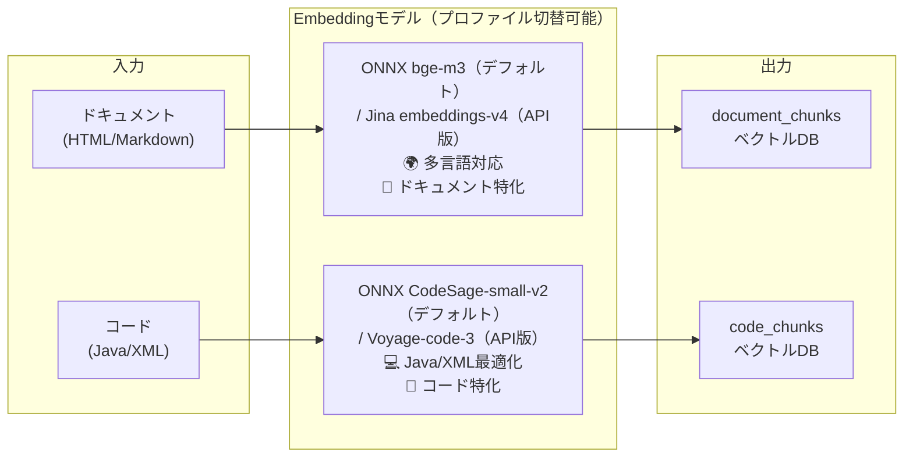
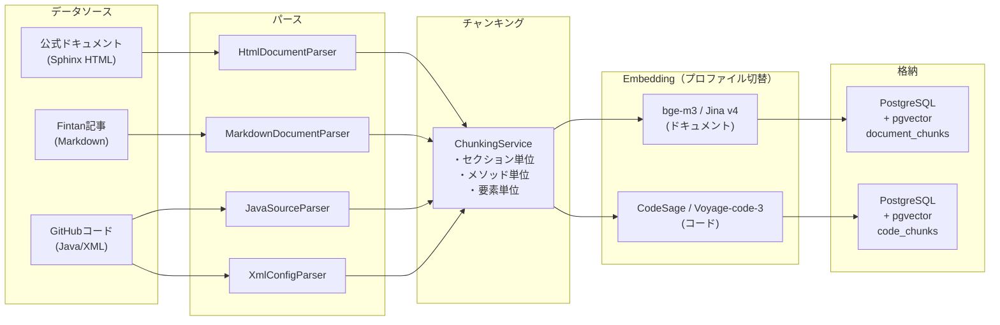
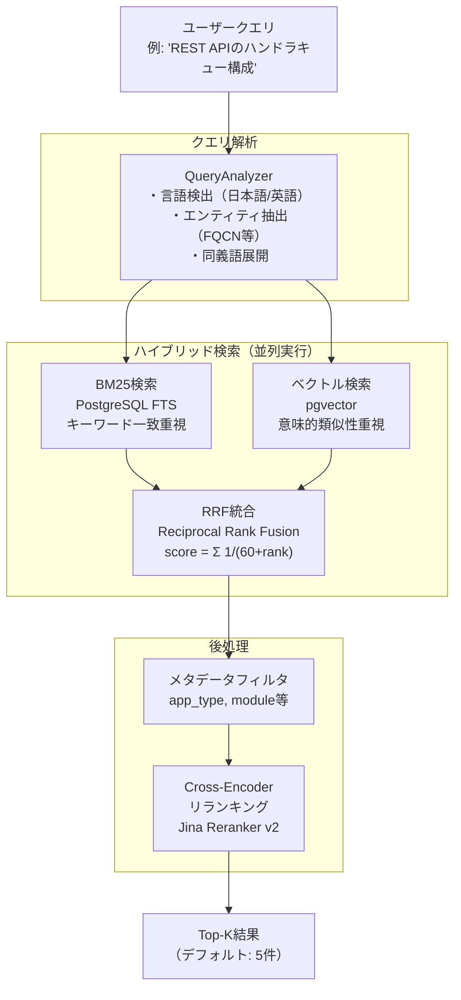
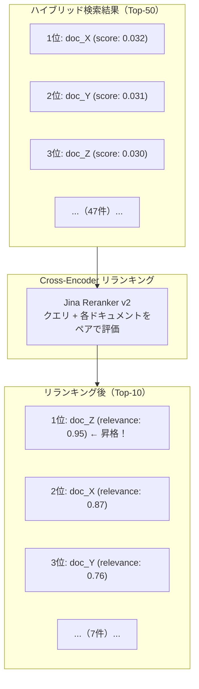
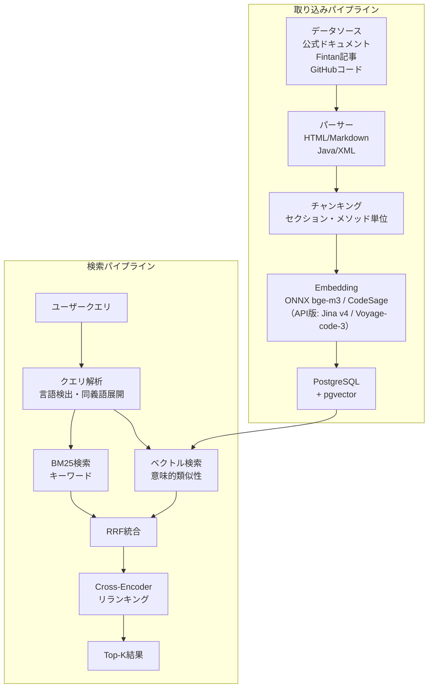

# RAGパイプライン詳解 — 検索・Embedding・リランキングの仕組み

> **シリーズ**: nablarch-mcp-server 専門家育成シリーズ 第7回
> **対象読者**: 中級者（RAG・Embedding・ベクトル検索の基礎知識がある方）
> **前提知識**: AIツールとMCPの基礎、データベースの基本操作
> **推定学習時間**: 30分

---

## この記事で学べること

この記事では、Nablarch MCP Serverの心臓部である**RAG（Retrieval-Augmented Generation）パイプライン**の全体像を学びます。具体的には以下のトピックを扱います：

- **RAGとは何か** — なぜLLMに外部知識を接続する必要があるのか
- **Embeddingモデル** — テキストをベクトルに変換する仕組み（ONNX bge-m3 / CodeSage、API版 Jina v4 / Voyage-code-3）
- **取り込みパイプライン** — ドキュメントをパース・チャンキング・ベクトル化して保存する流れ
- **検索パイプライン** — BM25（キーワード検索）とベクトル検索のハイブリッド検索
- **リランキング** — Cross-Encoderで検索結果の順位を最適化する仕組み
- **検索品質の評価** — MRR、Recall、NDCGで検索精度を測る方法

この記事を読み終えると、AIツールが「Nablarchフレームワークの正確な知識」をどのように取得し、活用しているのかが理解できます。

---

## RAGとは何か — LLMに外部知識を接続する

### RAGの必要性

Claude、ChatGPT、Geminiといった大規模言語モデル（LLM）は膨大な知識を持っていますが、以下の限界があります：

| LLMの限界 | 説明 |
|---------|------|
| **学習期限の壁** | モデルの学習データは過去の時点で固定される（例: 2025年1月まで） |
| **組織固有知識の欠如** | 企業内のドキュメント、社内コード、プロジェクト仕様は学習データに含まれない |
| **知識の陳腐化** | フレームワークのバージョンアップやAPI変更に追随できない |
| **ハルシネーション** | 知らない事柄について「それらしい嘘」を生成してしまう |

Nablarchフレームワークは日本語ドキュメントが豊富で、113個のGitHubリポジトリに分散した膨大なコード資産があります。これらを**リアルタイムでLLMに提供する仕組み**がRAGです。

### RAG vs ファインチューニング

| 手法 | 説明 | メリット | デメリット |
|-----|------|---------|----------|
| **ファインチューニング** | モデルの重みを学習データで更新 | ドメイン特化モデルが作れる | コスト高、更新困難、ハルシネーションリスク残存 |
| **RAG** | 外部DBから関連情報を取得し、プロンプトに注入 | 低コスト、リアルタイム更新可能、情報源を明示 | 検索精度に依存 |

Nablarch MCP Serverでは**RAG方式を採用**し、最新のドキュメント・コードをリアルタイムで検索・提供します。

---

## Embeddingとは — テキストをベクトルに変換する魔法

### Embeddingの直感的理解

Embeddingとは、**テキストを数値の列（ベクトル）に変換する技術**です。たとえば：

```
「Nablarchのハンドラキュー」 → [0.23, -0.15, 0.87, ..., 0.42]（1024個の数値）
```

このベクトルは**意味的な類似性を数値空間で表現**します。重要なのは、以下の性質です：

- **意味が近いテキストは、ベクトル空間でも近い位置にある**
- 「ハンドラキュー」と「handler queue」は異なる言葉だが、ベクトルは近い
- 「データベース接続」と「UniversalDao」も概念的に近いため、ベクトルが近くなる

### 2つのEmbeddingモデルの使い分け

Nablarch MCP Serverは**デュアルモデル戦略**を採用し、コンテンツタイプに応じて最適なモデルを使い分けています。



#### ドキュメント用Embeddingモデル

| プロファイル | モデル | 次元数 | 特徴 |
|-------------|--------|--------|------|
| **local**（デフォルト） | ONNX bge-m3 | 1024 | 無償・オフライン動作・多言語対応 |
| **api** | Jina embeddings-v4 | 1024 | 89言語対応・32Kトークン・高精度 |

#### コード用Embeddingモデル

| プロファイル | モデル | 次元数 | 特徴 |
|-------------|--------|--------|------|
| **local**（デフォルト） | ONNX CodeSage-small-v2 | 1024 | 無償・オフライン動作・Java/XML最適化 |
| **api** | Voyage-code-3 | 1024 | CoIR: 77.33（SOTA水準）・高精度 |

> **Note**: `spring.profiles.active=local` でONNXモデル、`spring.profiles.active=api` でJina/Voyage APIを使用します。プロファイル切替により、開発時はローカルモデル、本番時はAPIモデルといった使い分けが可能です。

**なぜ2つのモデルを使い分けるか？**

- **コードは自然言語ではない**: プログラミング言語の構文・パターン・命名規則は特殊
- **検索精度の最大化**: ドキュメント用モデルはコード検索で精度が落ち、逆も然り
- **統一次元数**: どちらも1024次元なので、統合検索が可能

---

## ドキュメントの取り込みパイプライン — 知識をベクトル化する

### 全体フロー



### ステップ1: パース — ドキュメントを構造化する

パーサーは各フォーマットの特性に応じて、意味的なセクションに分割します。

| パーサー | 入力 | 分割単位 | メタデータ |
|---------|------|---------|-----------|
| HtmlDocumentParser | Sphinx HTML | h2/h3見出し | タイトル、セクション階層 |
| MarkdownDocumentParser | Markdown記事 | ## / ### 見出し | 記事タイトル、URL |
| JavaSourceParser | Javaソース | クラス + メソッド単位 | FQCN、メソッド名、Javadoc |
| XmlConfigParser | XML設定 | 要素単位（component/handler） | 要素タイプ、class属性 |

**例: Javaソースのパース結果**

```java
// 入力
package nablarch.fw.web;

/**
 * Webアプリケーションの基底Action。
 */
public abstract class HttpRequestHandler implements Handler {
    public HttpResponse handle(HttpRequest request) {
        // ...
    }
}

// パース結果 → 2つのチャンクに分割
// チャンク1: クラスヘッダ（Javadoc付き）
// チャンク2: handleメソッド（メソッドシグネチャ + 本体）
```

### ステップ2: チャンキング — 最適なサイズに分割する

チャンキングは**検索精度に直結する重要なステップ**です。大きすぎると無関係な情報が混ざり、小さすぎるとコンテキストが失われます。

#### チャンキング戦略一覧

| ContentType | 分割単位 | 最大トークン | オーバーラップ | 理由 |
|------------|---------|-------------|-------------|------|
| HTML | セクション単位 | 512 | 128 (25%) | 見出しごとに独立した概念 |
| Markdown | 見出し単位 | 512 | 128 (25%) | HTMLと同様 |
| Javadoc | クラス/メソッド単位 | 256 | なし | 単位が明確、コンテキストはメタデータで付与 |
| Java | メソッド単位 | 512 | なし | メソッドは独立した処理単位 |
| XML | 要素単位 | 256 | なし | component/handler単位で意味完結 |

**トークンとは？**

トークンはテキストの最小単位です。日本語では約2文字/トークン、英語では約4文字/トークンが目安です。512トークン ≈ 1000-2000文字です。

**オーバーラップの役割**

前のチャンクの末尾128トークンを次のチャンクの先頭に含めることで、チャンク境界でコンテキストが断絶するのを防ぎます。

```
チャンク1: [...A B C D E F]
                     └─ 128トークンのオーバーラップ ─┐
チャンク2:            [E F G H I J...]              │
                      ↑─────────────────────────────┘
```

### ステップ3: Embedding生成 — ベクトルに変換する

チャンクごとに対応するEmbeddingモデルでベクトルを生成します。

```
入力チャンク: "Nablarchのハンドラキューは、HTTPリクエストを処理するハンドラを順次実行する仕組みです。"

↓ ONNX bge-m3（またはJina embeddings-v4）

出力ベクトル: [0.23, -0.15, 0.87, ..., 0.42]（1024次元）
```

### ステップ4: PostgreSQL + pgvectorへ格納

ベクトルはPostgreSQLのpgvector拡張を使ってデータベースに格納されます。

```sql
-- document_chunksテーブル（一部抜粋）
CREATE TABLE document_chunks (
    id              BIGSERIAL PRIMARY KEY,
    content         TEXT NOT NULL,
    embedding       vector(1024),  -- pgvectorの型
    source          VARCHAR(50),
    app_type        VARCHAR(20),
    module          VARCHAR(100),
    url             TEXT,
    created_at      TIMESTAMP DEFAULT NOW()
);

-- ベクトル検索用インデックス
CREATE INDEX idx_doc_chunks_embedding
  ON document_chunks
  USING ivfflat (embedding vector_cosine_ops)
  WITH (lists = 100);
```

---

## 検索パイプライン — 3つの検索方式の組み合わせ

### 全体フロー



### BM25検索 — キーワードの正確な一致を見つける

BM25はPostgreSQLのFull Text Search（FTS）を使ったキーワード検索です。**語彙の完全一致・部分一致**に強みがあります。

**BM25が得意なクエリ例**

- `nablarch.fw.web.HttpRequestHandler`（FQCN検索）
- `UniversalDao`（クラス名検索）
- `handler queue configuration`（技術用語の組み合わせ）

**検索の仕組み**

```sql
-- PostgreSQL FTSクエリの例
SELECT
    id,
    content,
    ts_rank_cd(
        to_tsvector('japanese', content),  -- 日本語形態素解析
        to_tsquery('japanese', 'ハンドラ & キュー'),  -- AND検索
        32  -- 正規化フラグ
    ) AS bm25_score
FROM document_chunks
WHERE to_tsvector('japanese', content) @@ to_tsquery('japanese', 'ハンドラ & キュー')
ORDER BY bm25_score DESC
LIMIT 50;
```

### ベクトル検索 — 意味的な類似性を見つける

ベクトル検索はクエリをEmbeddingでベクトル化し、**コサイン類似度**で類似ドキュメントを見つけます。

**ベクトル検索が得意なクエリ例**

- 「REST APIの認証方法」 → 認証ハンドラの設定例を発見
- 「データベース接続エラーの対処法」 → トラブルシューティング記事を発見
- 「排他制御」 → optimistic lock / pessimistic lock の関連ドキュメント

**コサイン類似度とは？**

2つのベクトルの「向き」の近さを測る指標です。値は -1 〜 1 の範囲で、1に近いほど意味が近い。

```
クエリベクトル: [0.2, 0.8, 0.1, ...]
文書1ベクトル:  [0.3, 0.9, 0.2, ...]  → コサイン類似度: 0.95（近い！）
文書2ベクトル:  [-0.5, 0.1, 0.7, ...] → コサイン類似度: 0.12（遠い）
```

**検索の仕組み**

```sql
-- pgvectorのコサイン類似度検索
SELECT
    id,
    content,
    1 - (embedding <=> :query_vector) AS vector_score  -- <=> はコサイン距離演算子
FROM document_chunks
ORDER BY embedding <=> :query_vector
LIMIT 50;
```

### ハイブリッド検索 — BM25とベクトルの組み合わせ

ハイブリッド検索は**BM25とベクトル検索を並列実行**し、Reciprocal Rank Fusion（RRF）で統合します。

**RRFの仕組み**

```
RRF_score(d) = Σ 1 / (k + rank(d))

k = 60（定数）
rank(d) = 検索結果でのドキュメントdの順位（1始まり）
```

**統合例**

```
BM25結果:     [doc_A(1位), doc_B(2位), doc_C(3位), doc_D(4位)]
ベクトル結果:  [doc_C(1位), doc_A(2位), doc_E(3位), doc_B(4位)]

RRF計算（k=60）:
  doc_A: 1/(60+1) + 1/(60+2) = 0.01639 + 0.01613 = 0.03252  → 1位
  doc_C: 1/(60+3) + 1/(60+1) = 0.01587 + 0.01639 = 0.03226  → 2位
  doc_B: 1/(60+2) + 1/(60+4) = 0.01613 + 0.01563 = 0.03176  → 3位
  doc_E: 0        + 1/(60+3) = 0.01587                      → 4位
  doc_D: 1/(60+4) + 0        = 0.01563                      → 5位

両方の検索で上位に出現するdoc_Aが最高スコア！
```

**ハイブリッド検索の強み**

| ケース | BM25のみ | ベクトルのみ | ハイブリッド |
|-------|---------|-------------|------------|
| FQCN検索 | ○ 高精度 | △ やや劣る | ○ 高精度維持 |
| 概念的クエリ | △ 見逃す | ○ 高精度 | ○ 高精度維持 |
| 日英混在クエリ | △ 片方のみ | ○ 多言語対応 | ○ 最高精度 |

---

## リランキング — Cross-Encoderで精度を上げる

### Cross-Encoderとは

ハイブリッド検索で絞り込んだ**Top-50候補**に対し、クエリとドキュメントのペアを直接評価するモデルです。



### リランキングの効果（実測データ）

RAGパイプラインの検索品質評価（WBS 2.3.8）から、リランキングの効果を示します。

| メトリクス | リランキング前 | リランキング後 | 改善量 |
|-----------|-------------|-------------|-------|
| MRR | 0.333 | 1.000 | **+0.667** (200%向上) |
| NDCG@5 | < 1.0 | 1.000 | 有意な改善 |
| Recall@5 | 1.0 | 1.0 | 変化なし（候補は削除しない） |

**効果が大きいケース**

- 関連ドキュメントが3〜5位にある → 1位に昇格してMRRが大幅向上
- 意味的に関連するが語彙が異なる → Cross-Encoderが意味を理解して昇格
- 複数の関連ドキュメントが分散 → 上位に集中してNDCGが向上

---

## 検索品質の評価 — 精度を測る3つのメトリクス

### MRR（Mean Reciprocal Rank）

**最初の関連ドキュメントが何位に出現するか**を測る指標です。

```
MRR = 1 / rank

例:
  関連ドキュメントが1位 → MRR = 1/1 = 1.000（完璧）
  関連ドキュメントが2位 → MRR = 1/2 = 0.500
  関連ドキュメントが5位 → MRR = 1/5 = 0.200
```

**RAGパイプライン実装時の実測値**

- ハイブリッド検索（リランキング前）: **MRR = 0.500**
- リランキング後: **MRR = 1.000**（3位→1位昇格時）

### Recall@K（上位K件の網羅率）

**上位K件に関連ドキュメントが含まれる割合**を測ります。

```
Recall@5 = 1.0  （上位5件に関連ドキュメントが1件以上存在）
Recall@5 = 0.0  （上位5件に関連ドキュメントが存在しない）
```

**開発フェーズ2の実測値**（※開発ロードマップ上のPhase 2を指す）

- Recall@5: **1.000**（全50クエリで上位5件に関連ドキュメントが存在）
- Recall@10: **1.000**

### NDCG@K（順位を考慮した精度）

**関連ドキュメントが上位に集中しているか**を評価します。上位ほど高く評価されます。

```
DCG@5  = Σ_{i=1}^{5} rel_i / log₂(i + 1)
NDCG@5 = DCG@5 / IDCG@5

rel_i: i番目の結果の関連度（0 or 1）
IDCG@5: 理想的な順位の場合のDCG（最高値）
```

**開発フェーズ2の実測値**（※開発ロードマップ上のPhase 2を指す）

- ハイブリッド検索: **NDCG@5 = 0.500**（関連が2位）
- リランキング後: **NDCG@5 = 1.000**（関連が1位に昇格）

### 実環境での目標値（開発フェーズ3）

> **注**: 以下のPhase 1-3は開発ロードマップ上のフェーズを指します。

| メトリクス | Phase 2（モック環境） | Phase 3目標（実環境） | Phase 1推定 |
|-----------|---------------------|-------------------|----------|
| MRR | 0.500（検証完了） | ≥ 0.70 | 0.35-0.45 |
| Recall@5 | 1.000（検証完了） | ≥ 0.80 | 0.40-0.50 |
| NDCG@5 | 0.500（検証完了） | ≥ 0.70 | 0.30-0.40 |

開発フェーズ2ではメトリクス計算フレームワークの正常動作を検証しました。開発フェーズ3では実際のNablarchドキュメントを取り込んだ環境で、目標値達成を目指します。

---

## まとめ — RAGパイプラインが実現する「正確な知識」

この記事では、Nablarch MCP ServerのRAGパイプラインの全体像を学びました。

### 重要なポイントの再確認

1. **RAGは外部知識をLLMに接続する技術** — ファインチューニングよりも低コスト・リアルタイム更新可能
2. **デュアルEmbeddingモデル戦略** — ドキュメント（ONNX bge-m3 / Jina v4）とコード（ONNX CodeSage / Voyage-code-3）で精度を最大化
3. **取り込みパイプライン** — パース → チャンキング → Embedding → pgvectorへ格納
4. **ハイブリッド検索** — BM25（キーワード）+ ベクトル（意味）をRRFで統合
5. **Cross-Encoderリランキング** — Top-50候補を精密評価し、MRRを200%向上
6. **検索品質の測定** — MRR、Recall、NDCGで定量評価（Phase 2で全テスト成功）

### RAGパイプラインの全体像（再掲）



### 次の記事へ

次回は **Spring AI MCP Serverとの統合** を学びます。SDK の使い方、McpServerConfig によるBean登録パターン、Tool/Resource/Prompt実装の内部構造を解説します。

---

## ナビゲーション

- **[← 前の記事: 06-ナレッジの構造化](06-knowledge-structure.md)**
- **[→ 次の記事: 08-Spring AI MCP統合](08-spring-ai-mcp-integration.md)**
- **[📚 記事一覧に戻る](INDEX.md)**

---

## 参考リンク

- [前の記事: 06-knowledge-structure.md（ナレッジの構造化）](./06-knowledge-structure.md)
- [次の記事: 08-spring-ai-mcp-integration.md（Spring AI MCP統合）](./08-spring-ai-mcp-integration.md)
- [RAGパイプライン技術仕様書（docs/04-rag-pipeline-spec.md）](../04-rag-pipeline-spec.md)
- [検索品質評価レポート（docs/09-search-quality-report.md）](../09-search-quality-report.md)
- [Jina AI Embeddings v4](https://jina.ai/embeddings/)
- [Voyage AI Code-3](https://www.voyageai.com/)
