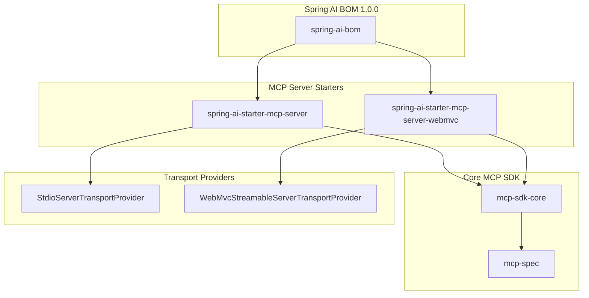
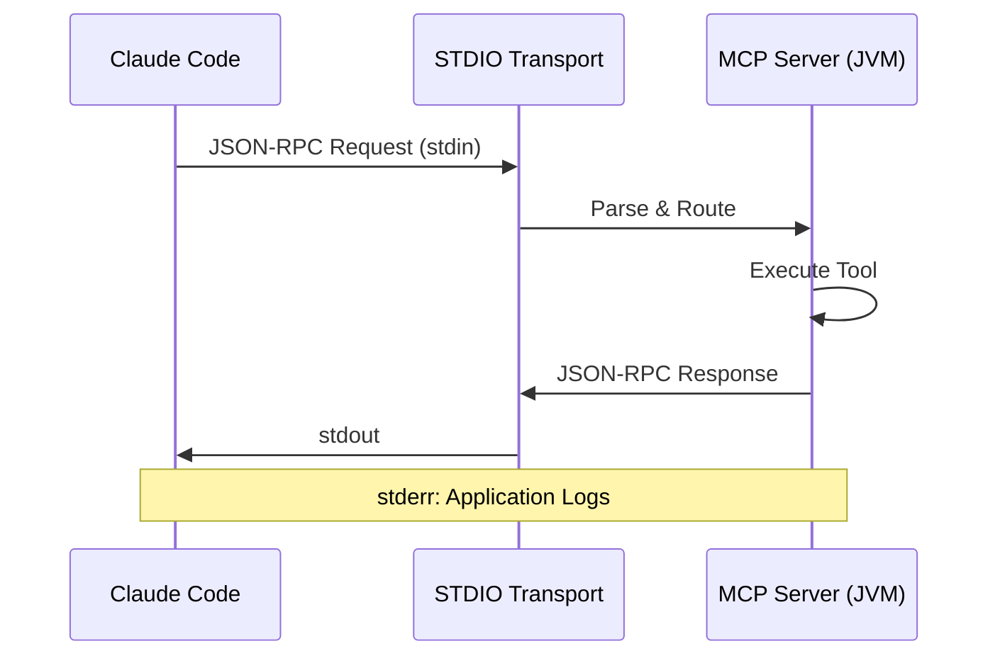
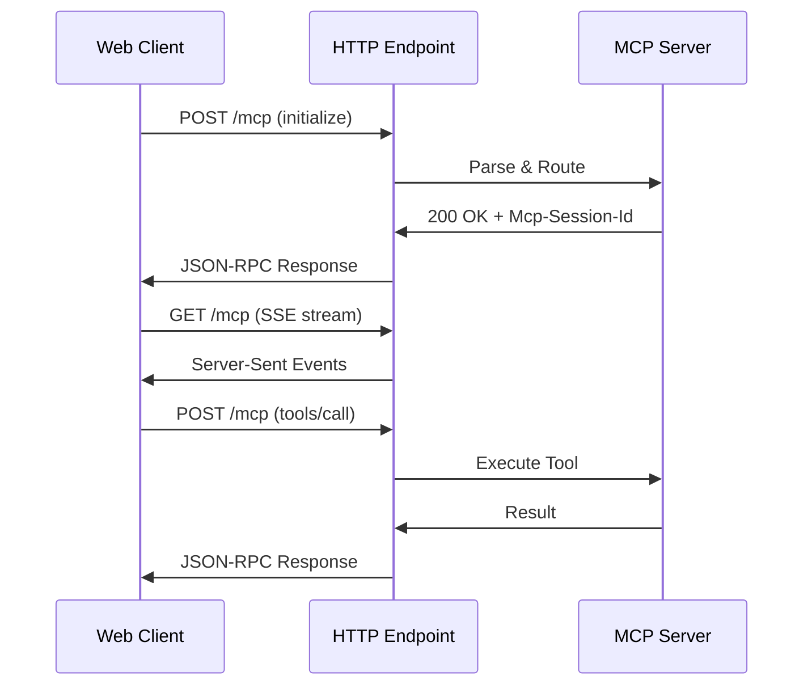
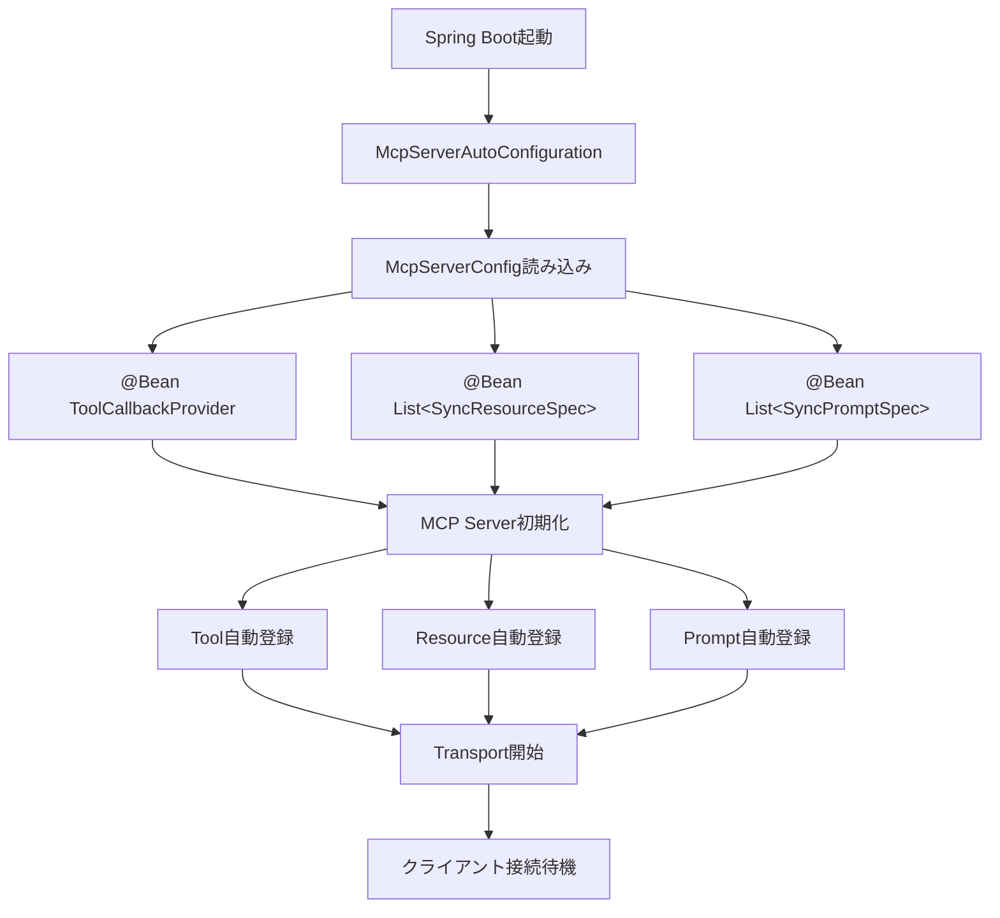

# Spring AI MCP Serverとの統合 — SDKの使い方と内部構造

> **シリーズ**: nablarch-mcp-server 専門家育成シリーズ 第8回
> **難易度**: 中級〜上級
> **前提知識**: Spring Boot基礎、記事05のアーキテクチャ理解
> **推定学習時間**: 60分

---

## この記事で学べること

本記事では、Spring AI MCP SDK（Model Context Protocol Java SDK）を使ったMCPサーバー実装の内部構造を解説します。

**学習内容**:
- Spring AI MCP SDK の構成とSpringエコシステム統合
- McpServerConfigによるBean登録パターン
- Tool/Resource/Prompt実装パターン（実際のコード付き）
- STDIOトランスポートとStreamable HTTPトランスポートの2つの通信方式
- Spring Boot Auto-configurationによる自動設定の仕組み

**この記事を読むと**:
- nablarch-mcp-serverがどのようにSpring AI MCP SDKと統合しているかを理解できる
- 独自のMCP Toolを追加する方法がわかる
- MCP ResourceやPromptを実装する方法がわかる
- MCPサーバーのトランスポート切り替え方法を理解できる

---

## Spring AI とは — Springエコシステムの AI対応

### Spring AI プロジェクト概要

[Spring AI](https://spring.io/projects/spring-ai)は、Spring FrameworkファミリーのAI対応モジュールです。Spring Bootの「設定より規約（Convention over Configuration）」と自動構成（Auto-configuration）の思想を、AI/LLMアプリケーション開発に持ち込んだプロジェクトです。

**主な提供機能**:
- **LLM Client統合**: OpenAI、Azure OpenAI、Anthropic、Mistralなどの統合
- **Embedding Model統合**: OpenAI、ONNX、HuggingFaceなどの統合
- **Vector Database統合**: Pinecone、Weaviate、PostgreSQL pgvectorなどの統合
- **MCP Server/Client**: Model Context Protocolサーバー・クライアント実装

### nablarch-mcp-serverでの採用理由

nablarch-mcp-serverは、Spring AI 1.0.0のMCP Server機能を採用しています。採用理由:

1. **Spring Boot Auto-configuration**: `@Tool`や`@Bean`によるTool/Resource自動登録
2. **Spring AIエコシステム統合**: EmbeddingやVector DBとシームレスに連携
3. **公式MCP SDK同梱**: MCP仕様準拠の実装が保証されている
4. **STDIO/HTTPトランスポート対応**: ローカル実行とリモートアクセスの両対応

---

## MCP Java SDK の構成

### SDKモジュール構成

Spring AI MCP Serverは、以下のモジュールで構成されています。



**モジュール説明**:

| モジュール | 役割 |
|-----------|------|
| `spring-ai-bom` | Spring AIのBOM（Bill of Materials）。バージョン管理 |
| `spring-ai-starter-mcp-server` | STDIO Transport対応のスターター |
| `spring-ai-starter-mcp-server-webmvc` | HTTP Transport対応のスターター（Spring Web MVC統合） |
| `mcp-sdk-core` | MCP Protocol実装コア |
| `mcp-spec` | MCP仕様のJava型定義（`McpSchema`クラス群） |

### pom.xmlでの依存関係定義

nablarch-mcp-serverの`pom.xml`では以下のように定義しています。

```xml
<properties>
    <java.version>17</java.version>
    <spring-ai.version>1.0.0</spring-ai.version>
</properties>

<dependencyManagement>
    <dependencies>
        <dependency>
            <groupId>org.springframework.ai</groupId>
            <artifactId>spring-ai-bom</artifactId>
            <version>${spring-ai.version}</version>
            <type>pom</type>
            <scope>import</scope>
        </dependency>
    </dependencies>
</dependencyManagement>

<dependencies>
    <!-- STDIO Transport（デフォルト） -->
    <dependency>
        <groupId>org.springframework.ai</groupId>
        <artifactId>spring-ai-starter-mcp-server</artifactId>
    </dependency>

    <!-- HTTP Streamable Transport（開発フェーズ3で追加） -->
    <dependency>
        <groupId>org.springframework.ai</groupId>
        <artifactId>spring-ai-starter-mcp-server-webmvc</artifactId>
    </dependency>

    <!-- Spring Boot Web（HTTP Transport用） -->
    <dependency>
        <groupId>org.springframework.boot</groupId>
        <artifactId>spring-boot-starter-web</artifactId>
    </dependency>
</dependencies>
```

**ポイント**:
- `spring-ai-bom`でバージョンを一元管理
- STDIO/HTTPの両方のトランスポートを依存関係に含める
- プロファイル切り替えで実行時にトランスポートを選択

---

## STDIOとHTTPの2つのトランスポート

### トランスポートの使い分け

MCPサーバーは2つのトランスポート方式をサポートしています。

| トランスポート | 用途 | 接続方法 |
|--------------|------|---------|
| **STDIO** | ローカル実行（Claude Code等） | stdin/stdout経由でJSON-RPC |
| **Streamable HTTP** | リモートアクセス、Webクライアント | HTTP POST/GET + Server-Sent Events |

**STDIOトランスポート通信図**:



**Streamable HTTP Transport通信図**:



### プロファイル切り替え設定

`application-stdio.yaml`（デフォルト）:

```yaml
spring:
  main:
    web-application-type: none  # Webサーバーを起動しない
    banner-mode: off            # バナー出力抑制（stdout保護）
  ai:
    mcp:
      server:
        stdio: true             # STDIOトランスポート有効化

logging:
  pattern:
    console: ""                 # コンソールログ出力抑制
  file:
    name: logs/nablarch-mcp-server.log
```

`application-http.yaml`:

```yaml
spring:
  main:
    web-application-type: servlet  # Webサーバー起動
  ai:
    mcp:
      server:
        stdio: false               # STDIO無効化

server:
  port: 8080

mcp:
  http:
    enabled: true
    endpoint: /mcp
    session:
      timeout: 30m
      max-sessions: 100
```

**起動方法**:

```bash
# STDIO（ローカル実行）
java -jar nablarch-mcp-server.jar --spring.profiles.active=stdio

# HTTP（リモートアクセス）
java -jar nablarch-mcp-server.jar --spring.profiles.active=http
```

---

## McpServerConfig の設計

### McpServerConfigクラスの役割

`McpServerConfig`は、MCPサーバーのTool/Resource/Promptを登録する中心的な設定クラスです。Spring Bootの`@Configuration`クラスとして、`@Bean`メソッドで登録するコンポーネントを定義します。

**ファイル**: `src/main/java/com/tis/nablarch/mcp/config/McpServerConfig.java`

```java
@Configuration
public class McpServerConfig {

    /**
     * MCPツールをSpring AIツールコールバックとして登録する。
     */
    @Bean
    public ToolCallbackProvider nablarchTools(
            SearchApiTool searchApiTool,
            ValidateHandlerQueueTool validateHandlerQueueTool,
            SemanticSearchTool semanticSearchTool,
            CodeGenerationTool codeGenerationTool,
            DesignHandlerQueueTool designHandlerQueueTool,
            RecommendPatternTool recommendPatternTool,
            OptimizeHandlerQueueTool optimizeHandlerQueueTool,
            TroubleshootTool troubleshootTool) {
        return MethodToolCallbackProvider.builder()
                .toolObjects(searchApiTool, validateHandlerQueueTool,
                        semanticSearchTool, codeGenerationTool,
                        designHandlerQueueTool, recommendPatternTool,
                        optimizeHandlerQueueTool, troubleshootTool)
                .build();
    }

    @Bean
    public List<McpServerFeatures.SyncResourceSpecification> nablarchResources(
            HandlerResourceProvider handlerProvider,
            GuideResourceProvider guideProvider) {
        return List.of(
            createHandlerResourceSpec("web", "Nablarch Web Handler Catalog",
                "Web application handler specifications", handlerProvider),
            createHandlerResourceSpec("rest", "Nablarch REST Handler Catalog",
                "REST application handler specifications", handlerProvider),
            // ... 他のResource
        );
    }

    @Bean
    public List<McpServerFeatures.SyncPromptSpecification> nablarchPrompts(
            SetupHandlerQueuePrompt setupHandlerQueuePrompt,
            CreateActionPrompt createActionPrompt,
            ReviewConfigPrompt reviewConfigPrompt,
            ExplainHandlerPrompt explainHandlerPrompt,
            MigrationGuidePrompt migrationGuidePrompt,
            BestPracticesPrompt bestPracticesPrompt) {
        return List.of(
            promptSpec("setup-handler-queue",
                "Set up a Nablarch handler queue configuration",
                List.of(arg("app_type", "Application type: web, rest, batch", true)),
                setupHandlerQueuePrompt::execute),
            // ... 他のPrompt
        );
    }
}
```

### Bean登録フロー



**動作説明**:
1. Spring Bootが`McpServerAutoConfiguration`を読み込む
2. `McpServerConfig`の`@Bean`メソッドが実行される
3. `ToolCallbackProvider`、`SyncResourceSpecification`、`SyncPromptSpecification`がSpring管理下に入る
4. Spring AI MCP SDKがこれらのBeanを自動検出し、MCPサーバーに登録
5. 指定されたトランスポート（STDIO or HTTP）が開始
6. クライアントからの接続を待機

---

## Tool実装パターン

### @Toolアノテーションによる実装

MCPツールは、`@Tool`アノテーションを付けたメソッドとして実装します。

**例**: `SemanticSearchTool.java`

```java
@Service
public class SemanticSearchTool {

    private final HybridSearchService hybridSearchService;
    private final Reranker reranker;

    public SemanticSearchTool(
            HybridSearchService hybridSearchService,
            Reranker reranker) {
        this.hybridSearchService = hybridSearchService;
        this.reranker = reranker;
    }

    @Tool(description = "Semantic search over the Nablarch knowledge base. "
            + "Uses hybrid search (BM25 + vector) with Cross-Encoder reranking "
            + "for high-accuracy results. Supports natural language queries in "
            + "Japanese and English.")
    public String semanticSearch(
            @ToolParam(description = "Search query in natural language or keywords")
            String query,
            @ToolParam(description = "Optional app type filter: web, rest, batch")
            String appType,
            @ToolParam(description = "Number of results (1-50, default 5)")
            Integer topK) {

        // 検索ロジック実装
        List<SearchResult> results = hybridSearchService.search(query, filters, topK);
        List<SearchResult> reranked = reranker.rerank(query, results, topK);
        return formatResults(query, reranked);
    }
}
```

**ポイント**:
- `@Service`: SpringのDIコンテナに登録
- `@Tool`: Spring AI MCPがこのメソッドをToolとして認識
- `@ToolParam`: パラメータの説明（JSON Schema生成に使用）
- **戻り値**: 文字列（Markdown推奨）

### 入力スキーマ定義（JSON Schema）

`@Tool`と`@ToolParam`から、Spring AIが自動的にJSON Schemaを生成します。

生成されるスキーマ例（`tools/list`レスポンスに含まれる）:

```json
{
  "name": "semanticSearch",
  "description": "Semantic search over the Nablarch knowledge base...",
  "inputSchema": {
    "type": "object",
    "properties": {
      "query": {
        "type": "string",
        "description": "Search query in natural language or keywords"
      },
      "appType": {
        "type": "string",
        "description": "Optional app type filter: web, rest, batch"
      },
      "topK": {
        "type": "integer",
        "description": "Number of results (1-50, default 5)"
      }
    },
    "required": ["query"]
  }
}
```

**JSON Schema自動生成の仕組み**:
- Javaの型情報から`type`を推論（String → string, Integer → integer）
- `@ToolParam`の`description`から`description`を設定
- メソッドパラメータの必須/任意から`required`を決定（Nullableでない型は必須）

---

## Resource実装パターン

### ResourceProviderパターン

Resourceは、「MCPクライアントが参照できる静的コンテンツ」です。nablarch-mcp-serverでは、YAMLナレッジファイルからMarkdownを生成するProviderパターンを採用しています。

**例**: `HandlerResourceProvider.java`

```java
@Component
public class HandlerResourceProvider {

    private static final Set<String> VALID_APP_TYPES = Set.of(
            "web", "rest", "batch", "messaging");

    private Map<String, Object> handlerCatalog;

    @PostConstruct
    public void init() throws IOException {
        ObjectMapper mapper = new ObjectMapper(new YAMLFactory());
        try (InputStream is = getClass().getClassLoader()
                .getResourceAsStream("knowledge/handler-catalog.yaml")) {
            handlerCatalog = mapper.readValue(is, new TypeReference<>() {});
        }
    }

    public String getHandlerMarkdown(String appType) {
        if (!VALID_APP_TYPES.contains(appType)) {
            return "# Unknown Application Type\n\nValid types: "
                + String.join(", ", VALID_APP_TYPES);
        }

        Map<String, Object> appData = (Map<String, Object>) handlerCatalog.get(appType);
        StringBuilder sb = new StringBuilder();
        sb.append("# Nablarch ").append(appType).append(" Handler Queue\n\n");

        // YAMLデータをMarkdownに変換
        // ... 実装省略 ...

        return sb.toString();
    }
}
```

### McpServerConfigでのResource登録

`McpServerConfig`でResourceを登録:

```java
@Bean
public List<McpServerFeatures.SyncResourceSpecification> nablarchResources(
        HandlerResourceProvider handlerProvider,
        GuideResourceProvider guideProvider) {
    return List.of(
        createHandlerResourceSpec("web", "Nablarch Web Handler Catalog",
            "Web application handler specifications", handlerProvider),
        createHandlerResourceSpec("rest", "Nablarch REST Handler Catalog",
            "REST application handler specifications", handlerProvider)
    );
}

private static McpServerFeatures.SyncResourceSpecification createHandlerResourceSpec(
        String type, String name, String description,
        HandlerResourceProvider provider) {
    String uri = "nablarch://handler/" + type;
    return new McpServerFeatures.SyncResourceSpecification(
        new McpSchema.Resource(uri, name, description, "text/markdown", null),
        (exchange, request) -> new McpSchema.ReadResourceResult(
            List.of(new McpSchema.TextResourceContents(
                request.uri(), "text/markdown",
                provider.getHandlerMarkdown(type))))
    );
}
```

**URIテンプレートとルーティング**:
- `nablarch://handler/{app_type}` → `HandlerResourceProvider.getHandlerMarkdown(app_type)`
- `nablarch://guide/{topic}` → `GuideResourceProvider.getGuideMarkdown(topic)`

MCP SDKが`resources/read`リクエストのURIを解析し、対応するProviderのメソッドを呼び出します。

---

## Prompt実装パターン

### テンプレートベースのPrompt

Promptは、「AIクライアントが利用できる再利用可能なプロンプトテンプレート」です。引数を受け取り、動的にプロンプトを生成します。

**例**: `SetupHandlerQueuePrompt.java`

```java
@Component
public class SetupHandlerQueuePrompt {

    private Map<String, Object> handlerCatalog;
    private Map<String, Object> configTemplates;

    @PostConstruct
    void init() throws IOException {
        ObjectMapper yaml = new ObjectMapper(new YAMLFactory());
        try (InputStream is = getClass().getResourceAsStream(
                "/knowledge/handler-catalog.yaml")) {
            handlerCatalog = yaml.readValue(is, Map.class);
        }
        try (InputStream is = getClass().getResourceAsStream(
                "/knowledge/config-templates.yaml")) {
            configTemplates = yaml.readValue(is, Map.class);
        }
    }

    public McpSchema.GetPromptResult execute(Map<String, String> arguments) {
        String appType = arguments.get("app_type");
        if (appType == null || appType.isBlank()) {
            throw new IllegalArgumentException("app_type は必須です");
        }

        var sb = new StringBuilder();
        sb.append("# ").append(appType).append(" アプリケーションの")
          .append("ハンドラキュー構成ガイド\n\n");

        // YAMLから知識を読み込んでMarkdownを生成
        // ... 実装省略 ...

        return new McpSchema.GetPromptResult(
            appType + " ハンドラキュー構成ガイド",
            List.of(new McpSchema.PromptMessage(
                McpSchema.Role.USER,
                new McpSchema.TextContent(sb.toString())
            ))
        );
    }
}
```

### McpServerConfigでのPrompt登録

```java
@Bean
public List<McpServerFeatures.SyncPromptSpecification> nablarchPrompts(
        SetupHandlerQueuePrompt setupHandlerQueuePrompt,
        CreateActionPrompt createActionPrompt) {
    return List.of(
        promptSpec("setup-handler-queue",
            "Set up a Nablarch handler queue configuration",
            List.of(arg("app_type", "Application type: web, rest, batch", true)),
            setupHandlerQueuePrompt::execute),
        promptSpec("create-action",
            "Generate a Nablarch action class skeleton",
            List.of(
                arg("app_type", "Application type", true),
                arg("action_name", "Name of the action class", true)),
            createActionPrompt::execute)
    );
}

private static McpServerFeatures.SyncPromptSpecification promptSpec(
        String name, String description,
        List<McpSchema.PromptArgument> arguments,
        Function<Map<String, String>, McpSchema.GetPromptResult> handler) {
    return new McpServerFeatures.SyncPromptSpecification(
        new McpSchema.Prompt(name, description, arguments),
        (exchange, request) -> {
            Map<String, String> args = new java.util.HashMap<>();
            if (request.arguments() != null) {
                request.arguments().forEach((k, v) ->
                    args.put(k, v != null ? v.toString() : null));
            }
            return handler.apply(args);
        }
    );
}
```

**引数付きPrompt実行フロー**:
1. クライアントが`prompts/get`リクエストを送信（`{"name": "setup-handler-queue", "arguments": {"app_type": "web"}}`）
2. MCP SDKが`SetupHandlerQueuePrompt.execute()`を呼び出し、引数マップを渡す
3. Promptクラスが引数に応じた動的コンテンツを生成
4. `GetPromptResult`を返却（プロンプトメッセージを含む）

---

## Streamable HTTP Transport の設定

### HTTPトランスポートの有効化

開発フェーズ3で追加されたHTTPトランスポート（※開発ロードマップ上のPhase 3）は、`@Profile("http")`で有効化します。

**設定クラス例**:

```java
@Configuration
@Profile("http")
public class McpHttpTransportConfig {

    @Bean
    public WebMvcStreamableServerTransportProvider mcpTransportProvider(
            ObjectMapper objectMapper) {
        return new WebMvcStreamableServerTransportProvider(
            objectMapper,
            "/mcp"  // エンドポイントパス
        );
    }

    @Bean
    public RouterFunction<ServerResponse> mcpRoutes(
            WebMvcStreamableServerTransportProvider transportProvider) {
        return transportProvider.getRouterFunction();
    }
}
```

### HTTPエンドポイント設計

| HTTPメソッド | パス | 用途 |
|-------------|------|------|
| POST | `/mcp` | JSON-RPCリクエスト送信 |
| GET | `/mcp` | SSEストリーム接続（サーバープッシュ通知） |
| DELETE | `/mcp` | セッション終了 |

**リクエスト例**:

```bash
# Tool一覧取得
curl -X POST http://localhost:8080/mcp \
  -H "Content-Type: application/json" \
  -d '{"jsonrpc":"2.0","id":1,"method":"tools/list","params":{}}'

# Tool実行
curl -X POST http://localhost:8080/mcp \
  -H "Content-Type: application/json" \
  -H "Mcp-Session-Id: <session-id>" \
  -d '{
    "jsonrpc":"2.0",
    "id":2,
    "method":"tools/call",
    "params":{
      "name":"semanticSearch",
      "arguments":{"query":"ハンドラキューの設定方法"}
    }
  }'
```

### CORSポリシー設定

```java
@Configuration
@Profile("http")
public class McpCorsConfig {

    @Bean
    public CorsFilter corsFilter() {
        CorsConfiguration config = new CorsConfiguration();
        config.setAllowedOrigins(List.of("http://localhost:3000"));
        config.setAllowedMethods(List.of("GET", "POST", "DELETE", "OPTIONS"));
        config.setAllowedHeaders(List.of(
            "Content-Type",
            "Mcp-Session-Id",
            "Accept"
        ));
        config.setExposedHeaders(List.of("Mcp-Session-Id"));
        config.setAllowCredentials(true);

        UrlBasedCorsConfigurationSource source = new UrlBasedCorsConfigurationSource();
        source.registerCorsConfiguration("/mcp", config);
        return new CorsFilter(source);
    }
}
```

---

## まとめ — 次の記事への橋渡し

### 本記事で学んだこと

本記事では、Spring AI MCP SDKとnablarch-mcp-serverの統合方法を実装コードとともに解説しました。

**重要ポイント**:
1. **Spring AI MCP SDK**: Spring Boot Auto-configurationによる自動設定で、`@Bean`登録するだけでTool/Resource/Promptが使える
2. **McpServerConfig**: 中心的な設定クラス。`ToolCallbackProvider`、`SyncResourceSpecification`、`SyncPromptSpecification`を`@Bean`で登録
3. **Tool実装**: `@Tool`と`@ToolParam`でJSON Schemaが自動生成される。Serviceクラスとして実装し、DI可能
4. **Resource実装**: YAMLナレッジファイルからMarkdownを生成するProviderパターン
5. **Prompt実装**: 引数を受け取り動的にプロンプトを生成する`@Component`クラス
6. **2つのトランスポート**: STDIO（ローカル）とStreamable HTTP（リモート）をプロファイル切り替えで選択

### 実装時のベストプラクティス

1. **Tool実装**:
   - 戻り値はMarkdown形式を推奨（構造化されたテキストはAIが理解しやすい）
   - `@ToolParam`のdescriptionを丁寧に書く（AIがパラメータの意味を理解する）
   - 例外はcatchして人間が読めるエラーメッセージを返す

2. **Resource実装**:
   - YAMLファイルは`@PostConstruct`で一度だけ読み込む（パフォーマンス）
   - URIは`{パラメータ}`形式でルーティング可能に設計
   - Markdownフォーマットで返す（人間・AI両方が読みやすい）

3. **Prompt実装**:
   - 引数バリデーションを実装する（不正な引数への対処）
   - 知識ファイル（YAML）とテンプレートを分離する（保守性）
   - 生成するプロンプトは明確な構造を持たせる（見出し・箇条書き・コードブロック）

### 次の記事で学ぶこと

**次回（第9回）**: 設定ファイル完全ガイド

次の記事では、nablarch-mcp-serverの設定ファイル（application.yaml）の詳細と、プロファイル切り替え、環境別設定、トランスポート設定などを解説します。

---

## 関連リンク

- **前の記事**: [記事07: RAGパイプライン詳解](./07-rag-pipeline-deep-dive.md)
- **次の記事**: [記事09: 設定ファイル完全ガイド](./09-configuration-guide.md)
- **公式ドキュメント**: [Spring AI MCP Server Documentation](https://docs.spring.io/spring-ai/reference/api/mcp.html)
- **MCP仕様**: [Model Context Protocol Specification](https://modelcontextprotocol.io/)
- **nablarch-mcp-server設計書**: [02_mcp-sdk-integration.md](../designs/02_mcp-sdk-integration.md)

---

© 2026 nablarch-mcp-server 専門家育成シリーズ
