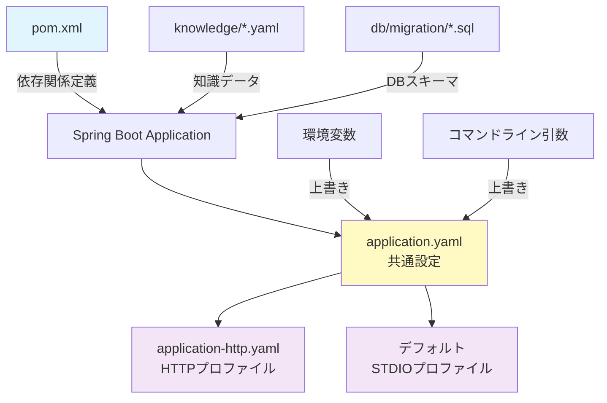

# 設定ファイル完全ガイド — application.yaml から pom.xml まで

> **nablarch-mcp-server 専門家育成シリーズ 第9回**
>
> **対象読者**: Spring Boot基礎知識があり、nablarch-mcp-serverのセットアップを完了している中級者
>
> **執筆日**: 2026-02-07

---

## 1. この記事で学べること

この記事では、nablarch-mcp-serverの全設定ファイルを体系的に解説します。

### 学習目標

- **設定ファイルの全体像**を理解する（application.yaml、pom.xml、プロファイル）
- **各設定項目の意味と影響範囲**を把握する
- **環境に応じた設定のカスタマイズ方法**を習得する
- **本番運用時の設定ベストプラクティス**を学ぶ

### 前提知識

- Spring Bootの基礎（設定ファイル、プロファイル、依存関係管理）
- [記事03: セットアップガイド](03-setup-guide.md)を完了している
- MCP（Model Context Protocol）の基本概念を理解している

### 読了後にできること

- プロジェクト要件に応じた設定ファイルのカスタマイズ
- STDIO/HTTP Transport の切り替え
- Embedding API の選択と設定
- 本番環境向けの設定調整

---

## 2. 設定ファイルの全体マップ

nablarch-mcp-serverは複数の設定ファイルで構成されます。各ファイルの役割と関係を以下に示します。



### 設定ファイル一覧

| ファイル | 役割 | 変更頻度 |
|---------|------|---------|
| **pom.xml** | Maven依存関係・ビルド設定 | 低（バージョンアップ時） |
| **application.yaml** | 共通設定（デフォルト） | 中（環境構築時） |
| **application-http.yaml** | HTTPトランスポート設定 | 中（リモートアクセス時） |
| **knowledge/*.yaml** | 知識ベースデータ | 低（MCP Server管理） |
| **db/migration/*.sql** | Flywayマイグレーション | 低（DB構造変更時） |

### 設定の優先順位

Spring Bootの設定は以下の優先順で適用されます（下に行くほど優先度高）:

1. `application.yaml`（デフォルト設定）
2. `application-{profile}.yaml`（プロファイル固有設定）
3. 環境変数（`SPRING_DATASOURCE_PASSWORD` 等）
4. コマンドライン引数（`--server.port=9090` 等）

---

## 3. application.yaml の全設定項目解説

`src/main/resources/application.yaml` は共通設定ファイルです。全設定項目を表形式で解説します。

### 3.1 Spring Boot 設定

| キー | デフォルト値 | 説明 | 変更例 |
|------|------------|------|--------|
| `spring.application.name` | `nablarch-mcp-server` | アプリケーション名（ログ・監視に使用） | 変更不要 |
| `spring.main.banner-mode` | `off` | 起動バナー表示（STDIO干渉防止のため無効化） | 変更不要 |
| `spring.main.web-application-type` | `none` | Webサーバー無効化（STDIO専用） | HTTPモードは`servlet`に変更 |

### 3.2 MCP Server 設定

| キー | デフォルト値 | 説明 | 変更例 |
|------|------------|------|--------|
| `spring.ai.mcp.server.name` | `nablarch-mcp-server` | MCPサーバー名（クライアントに通知） | 変更不要 |
| `spring.ai.mcp.server.version` | `0.2.0` | MCPサーバーバージョン | バージョンアップ時に変更 |
| `spring.ai.mcp.server.type` | `SYNC` | 同期モード（非同期は未対応） | 変更不要 |
| `spring.ai.mcp.server.stdio` | `true` | STDIOトランスポート有効化 | HTTPモードは`false` |

### 3.3 データベース設定

| キー | デフォルト値 | 説明 | 変更例 |
|------|------------|------|--------|
| `spring.datasource.url` | `jdbc:postgresql://localhost:5432/nablarch_mcp` | PostgreSQL接続URL | `localhost`を本番DBホストに変更 |
| `spring.datasource.username` | `nablarch` | DBユーザー名 | 環境変数 `SPRING_DATASOURCE_USERNAME` で上書き推奨 |
| `spring.datasource.password` | `nablarch_dev` | DBパスワード | **必ず環境変数で上書き** |
| `spring.datasource.driver-class-name` | `org.postgresql.Driver` | JDBCドライバ | 変更不要 |

⚠️ **セキュリティ警告**: パスワードはapplication.yamlに平文で書かず、環境変数で設定すること。

### 3.4 JPA / Hibernate 設定

| キー | デフォルト値 | 説明 | 変更例 |
|------|------------|------|--------|
| `spring.jpa.hibernate.ddl-auto` | `validate` | スキーマ管理モード（Flyway使用のため検証のみ） | `none`も可（Flyway完全信頼時） |
| `spring.jpa.properties.hibernate.dialect` | `PostgreSQLDialect` | SQL方言 | 変更不要 |
| `spring.jpa.open-in-view` | `false` | OSIV無効化（STDIO環境のため不要） | 変更不要 |

### 3.5 Flyway 設定

| キー | デフォルト値 | 説明 | 変更例 |
|------|------------|------|--------|
| `spring.flyway.enabled` | `true` | Flyway自動マイグレーション | 手動管理時は`false` |
| `spring.flyway.locations` | `classpath:db/migration` | マイグレーションスクリプト配置 | 変更不要 |

### 3.6 Embedding設定（重要）

#### プロバイダ選択

| キー | デフォルト値 | 説明 | 変更例 |
|------|------------|------|--------|
| `nablarch.mcp.embedding.provider` | `local` | Embeddingプロバイダ（`local`または`api`） | コスト重視なら`local`、精度重視なら`api` |

#### ローカルONNXモデル設定（provider: local）

**ドキュメント用モデル（BGE-M3）**:

| キー | デフォルト値 | 説明 |
|------|------------|------|
| `nablarch.mcp.embedding.local.document.model-name` | `BAAI/bge-m3` | HuggingFaceモデルID |
| `nablarch.mcp.embedding.local.document.model-path` | `${EMBEDDING_MODEL_PATH:/opt/models/bge-m3}/model.onnx` | ONNXモデルパス |
| `nablarch.mcp.embedding.local.document.tokenizer-path` | `${EMBEDDING_MODEL_PATH:/opt/models/bge-m3}` | トークナイザーパス |
| `nablarch.mcp.embedding.local.document.dimensions` | `1024` | ベクトル次元数 |
| `nablarch.mcp.embedding.local.document.max-tokens` | `512` | 最大トークン数 |
| `nablarch.mcp.embedding.local.document.batch-size` | `32` | バッチサイズ（メモリ使用量に影響） |

**コード用モデル（CodeSage-small-v2）**:

| キー | デフォルト値 | 説明 |
|------|------------|------|
| `nablarch.mcp.embedding.local.code.model-name` | `codesage/codesage-small-v2` | HuggingFaceモデルID |
| `nablarch.mcp.embedding.local.code.model-path` | `${EMBEDDING_MODEL_PATH:/opt/models/codesage-small-v2}/model.onnx` | ONNXモデルパス |
| `nablarch.mcp.embedding.local.code.tokenizer-path` | `${EMBEDDING_MODEL_PATH:/opt/models/codesage-small-v2}` | トークナイザーパス |
| `nablarch.mcp.embedding.local.code.dimensions` | `1024` | ベクトル次元数 |
| `nablarch.mcp.embedding.local.code.max-tokens` | `512` | 最大トークン数 |
| `nablarch.mcp.embedding.local.code.batch-size` | `32` | バッチサイズ |

#### API設定（provider: api）

**Jina Embeddings v4**:

| キー | デフォルト値 | 説明 |
|------|------------|------|
| `nablarch.mcp.embedding.jina.api-key` | `${JINA_API_KEY:}` | Jina API Key（環境変数推奨） |
| `nablarch.mcp.embedding.jina.model` | `jina-embeddings-v4` | モデル名 |
| `nablarch.mcp.embedding.jina.dimensions` | `1024` | ベクトル次元数 |
| `nablarch.mcp.embedding.jina.base-url` | `https://api.jina.ai/v1/embeddings` | APIエンドポイント |
| `nablarch.mcp.embedding.jina.timeout-seconds` | `30` | タイムアウト |
| `nablarch.mcp.embedding.jina.max-retries` | `3` | リトライ回数 |

**Voyage Code 3**:

| キー | デフォルト値 | 説明 |
|------|------------|------|
| `nablarch.mcp.embedding.voyage.api-key` | `${VOYAGE_API_KEY:}` | Voyage API Key（環境変数推奨） |
| `nablarch.mcp.embedding.voyage.model` | `voyage-code-3` | モデル名 |
| `nablarch.mcp.embedding.voyage.dimensions` | `1024` | ベクトル次元数 |
| `nablarch.mcp.embedding.voyage.base-url` | `https://api.voyageai.com/v1/embeddings` | APIエンドポイント |
| `nablarch.mcp.embedding.voyage.timeout-seconds` | `30` | タイムアウト |
| `nablarch.mcp.embedding.voyage.max-retries` | `3` | リトライ回数 |

### 3.7 Rerank設定

| キー | デフォルト値 | 説明 |
|------|------------|------|
| `nablarch.mcp.rerank.jina.api-key` | `${JINA_API_KEY:}` | Jina API Key（環境変数推奨） |
| `nablarch.mcp.rerank.jina.model` | `jina-reranker-v2-base-multilingual` | Rerankモデル |
| `nablarch.mcp.rerank.jina.base-url` | `https://api.jina.ai/v1/rerank` | APIエンドポイント |
| `nablarch.mcp.rerank.jina.timeout-ms` | `3000` | タイムアウト（ミリ秒） |
| `nablarch.mcp.rerank.jina.top-k` | `10` | リランキング結果数 |

### 3.8 ログ設定

| キー | デフォルト値 | 説明 | 変更例 |
|------|------------|------|--------|
| `logging.pattern.console` | （空） | コンソールログ抑制（STDIO干渉防止） | 変更不要 |
| `logging.level.root` | `WARN` | ルートロガーレベル | 開発時は`INFO` |
| `logging.level.com.tis.nablarch.mcp` | `INFO` | nablarch-mcp-server内部ログ | デバッグ時は`DEBUG` |

---

## 4. application-http.yaml（HTTPモード固有の設定）

`src/main/resources/application-http.yaml` はHTTPトランスポート使用時の設定です。

### 4.1 Spring Boot 設定

| キー | 値 | 説明 |
|------|-----|------|
| `spring.main.web-application-type` | `servlet` | Tomcat Webサーバー有効化 |
| `spring.ai.mcp.server.stdio` | `false` | STDIO無効化 |

### 4.2 サーバー設定

| キー | デフォルト値 | 説明 | 変更例 |
|------|------------|------|--------|
| `server.port` | `8080` | HTTPリスンポート | 本番では`80`/`443` |
| `server.tomcat.threads.max` | `200` | 最大スレッド数 | 高負荷時は`500` |
| `server.tomcat.threads.min-spare` | `10` | 最小アイドルスレッド数 | 変更不要 |

### 4.3 MCP HTTP設定

| キー | デフォルト値 | 説明 | 変更例 |
|------|------------|------|--------|
| `mcp.http.enabled` | `true` | HTTPトランスポート有効化 | 変更不要 |
| `mcp.http.endpoint` | `/mcp` | MCPエンドポイントパス | 変更不要 |
| `mcp.http.session.timeout` | `30m` | セッションタイムアウト | 長時間実行時は`60m` |
| `mcp.http.session.max-sessions` | `100` | 最大同時セッション数 | 高負荷時は`200` |

### 4.4 CORS設定

| キー | デフォルト値 | 説明 | 変更例 |
|------|------------|------|--------|
| `mcp.http.cors.allowed-origins` | `[http://localhost:3000, http://localhost:8080]` | 許可オリジン | 本番ドメインを追加 |
| `mcp.http.cors.allow-credentials` | `true` | 認証情報送信許可 | 変更不要 |

### 4.5 ログ設定

| キー | 値 | 説明 |
|------|-----|------|
| `logging.pattern.console` | `%d{yyyy-MM-dd HH:mm:ss} [%thread] %-5level %logger{36} - %msg%n` | ログフォーマット（HTTPモードでは出力可） |
| `logging.level.root` | `INFO` | HTTPモードではINFO推奨 |
| `logging.level.com.tis.nablarch.mcp` | `DEBUG` | デバッグログ有効化 |

---

## 5. Spring Bootプロファイルの使い分け

### 5.1 プロファイル一覧

| プロファイル | トランスポート | 用途 | 起動方法 |
|------------|--------------|------|---------|
| **デフォルト** | STDIO | ローカル開発（Claude Code等） | `java -jar xxx.jar` |
| **http** | Streamable HTTP | リモートアクセス・Web UI | `java -jar xxx.jar --spring.profiles.active=http` |
| **test** | テスト用モック | 自動テスト | `@ActiveProfiles("test")` |

### 5.2 プロファイル切り替え方法

#### 方法1: コマンドライン引数

```bash
# STDIOモード（デフォルト）
java -jar target/nablarch-mcp-server-0.2.0-SNAPSHOT.jar

# HTTPモード
java -jar target/nablarch-mcp-server-0.2.0-SNAPSHOT.jar --spring.profiles.active=http
```

#### 方法2: 環境変数

```bash
# HTTPモード
export SPRING_PROFILES_ACTIVE=http
java -jar target/nablarch-mcp-server-0.2.0-SNAPSHOT.jar
```

#### 方法3: application.yaml に記載（非推奨）

```yaml
spring:
  profiles:
    active: http  # 固定的に設定（柔軟性低下）
```

### 5.3 STDIOモード vs HTTPモード 比較表

| 項目 | STDIOモード | HTTPモード |
|------|-----------|-----------|
| トランスポート | 標準入出力 | HTTP/1.1 + SSE |
| クライアント | Claude Code、MCP Inspector（ローカル） | Webブラウザ、リモートクライアント |
| セッション管理 | 不要（単一接続） | 必要（複数同時接続） |
| CORS設定 | 不要 | 必要 |
| ログ出力 | ファイルのみ（STDOUT干渉防止） | コンソール可 |
| 認証 | 不要（ローカル信頼） | 将来実装予定 |
| ユースケース | 個人開発、ローカルテスト | チーム共有、本番サービス |

---

## 6. pom.xml の依存関係解説

`pom.xml` はMavenビルド設定ファイルです。主要な依存関係を解説します。

### 6.1 Spring Boot基盤

| groupId | artifactId | バージョン | 用途 |
|---------|-----------|-----------|------|
| `org.springframework.boot` | `spring-boot-starter-parent` | `3.4.2` | Spring Boot BOM（依存関係バージョン管理） |
| `org.springframework.boot` | `spring-boot-starter-validation` | （BOM管理） | Bean Validation（入力検証） |
| `org.springframework.boot` | `spring-boot-starter-web` | （BOM管理） | Tomcat + Spring MVC（HTTPモード用） |
| `org.springframework.boot` | `spring-boot-starter-data-jpa` | （BOM管理） | JPA + Hibernate（RAGデータ永続化） |
| `org.springframework.boot` | `spring-boot-starter-jdbc` | （BOM管理） | JDBC（BM25全文検索用） |
| `org.springframework.boot` | `spring-boot-starter-webflux` | （BOM管理） | WebClient（Embedding API呼び出し） |

### 6.2 Spring AI MCP Server

| groupId | artifactId | バージョン | 用途 |
|---------|-----------|-----------|------|
| `org.springframework.ai` | `spring-ai-bom` | `1.0.0` | Spring AI BOM |
| `org.springframework.ai` | `spring-ai-starter-mcp-server` | （BOM管理） | MCP STDIO Transport |
| `org.springframework.ai` | `spring-ai-starter-mcp-server-webmvc` | （BOM管理） | MCP HTTP Transport |

### 6.3 データベース

| groupId | artifactId | バージョン | 用途 |
|---------|-----------|-----------|------|
| `org.postgresql` | `postgresql` | （BOM管理） | PostgreSQL JDBCドライバ |
| `com.pgvector` | `pgvector` | `0.1.6` | pgvector拡張（ベクトル検索） |
| `org.flywaydb` | `flyway-core` | （BOM管理） | DBマイグレーション |
| `org.flywaydb` | `flyway-database-postgresql` | （BOM管理） | Flyway PostgreSQL対応 |

### 6.4 Embedding（ONNX + HuggingFace）

| groupId | artifactId | バージョン | 用途 |
|---------|-----------|-----------|------|
| `com.microsoft.onnxruntime` | `onnxruntime` | `1.20.0` | ONNX Runtime（CPU推論） |
| `ai.djl.huggingface` | `tokenizers` | `0.31.1` | HuggingFace Tokenizer（テキスト前処理） |

### 6.5 ユーティリティ

| groupId | artifactId | バージョン | 用途 |
|---------|-----------|-----------|------|
| `com.fasterxml.jackson.dataformat` | `jackson-dataformat-yaml` | （BOM管理） | YAMLパース（知識ベース読み込み） |
| `org.jsoup` | `jsoup` | `1.18.3` | HTML/XMLパース（ドキュメント処理） |

### 6.6 テスト

| groupId | artifactId | バージョン | 用途 |
|---------|-----------|-----------|------|
| `org.springframework.boot` | `spring-boot-starter-test` | （BOM管理） | JUnit 5 + Spring Test + Mockito |
| `com.h2database` | `h2` | （BOM管理） | インメモリDB（テスト用） |
| `com.squareup.okhttp3` | `mockwebserver` | `4.12.0` | Embedding API モック |

### 6.7 依存関係のバージョン管理方針

```xml
<parent>
    <groupId>org.springframework.boot</groupId>
    <artifactId>spring-boot-starter-parent</artifactId>
    <version>3.4.2</version>
</parent>

<dependencyManagement>
    <dependencies>
        <dependency>
            <groupId>org.springframework.ai</groupId>
            <artifactId>spring-ai-bom</artifactId>
            <version>1.0.0</version>
            <type>pom</type>
            <scope>import</scope>
        </dependency>
    </dependencies>
</dependencyManagement>
```

**方針**:
- Spring Boot BOM: 3.4.2で全Spring依存関係を統一
- Spring AI BOM: 1.0.0でSpring AI関連を統一
- 個別指定: pgvector、ONNX Runtime等は明示的にバージョン指定

---

## 7. 環境変数とシークレット管理

### 7.1 環境変数による設定上書き

Spring Bootは環境変数で設定を上書きできます。命名規則:

```
設定キー: spring.datasource.password
環境変数名: SPRING_DATASOURCE_PASSWORD（大文字・アンダースコア区切り）
```

### 7.2 必ず環境変数で設定すべき項目

| 設定キー | 環境変数名 | 理由 |
|---------|-----------|------|
| `spring.datasource.password` | `SPRING_DATASOURCE_PASSWORD` | DB認証情報の平文回避 |
| `nablarch.mcp.embedding.jina.api-key` | `JINA_API_KEY` | API Keyの平文回避 |
| `nablarch.mcp.embedding.voyage.api-key` | `VOYAGE_API_KEY` | API Keyの平文回避 |
| `nablarch.mcp.rerank.jina.api-key` | `JINA_API_KEY` | API Keyの平文回避 |

### 7.3 環境変数の設定方法

#### Linux / macOS

```bash
export SPRING_DATASOURCE_PASSWORD=secure_password_here
export JINA_API_KEY=jina_xxxxxxxxxxxxxxxxxxxx
export VOYAGE_API_KEY=pa-xxxxxxxxxxxxxxxxxxxx

java -jar target/nablarch-mcp-server-0.2.0-SNAPSHOT.jar
```

#### Windows (PowerShell)

```powershell
$env:SPRING_DATASOURCE_PASSWORD = "secure_password_here"
$env:JINA_API_KEY = "jina_xxxxxxxxxxxxxxxxxxxx"

java -jar target\nablarch-mcp-server-0.2.0-SNAPSHOT.jar
```

#### Docker Compose

```yaml
services:
  nablarch-mcp-server:
    image: nablarch-mcp-server:latest
    environment:
      SPRING_DATASOURCE_PASSWORD: secure_password_here
      JINA_API_KEY: jina_xxxxxxxxxxxxxxxxxxxx
      VOYAGE_API_KEY: pa-xxxxxxxxxxxxxxxxxxxx
```

### 7.4 .env ファイルの利用（非推奨）

`.env` ファイルに機密情報を記載する場合は、`.gitignore` に必ず追加してください。

```bash
# .env
SPRING_DATASOURCE_PASSWORD=secure_password_here
JINA_API_KEY=jina_xxxxxxxxxxxxxxxxxxxx
```

```bash
# 起動前に読み込み
set -a
source .env
set +a

java -jar target/nablarch-mcp-server-0.2.0-SNAPSHOT.jar
```

⚠️ **本番環境では推奨しません**。AWS Secrets Manager、HashiCorp Vault等のシークレット管理サービスを使用してください。

---

## 8. 設定のカスタマイズ例（よくあるパターン）

### 8.1 例1: Embeddingをローカルモデルに切り替える

**シナリオ**: Embedding APIのコストを削減したい。CPU環境でローカルONNXモデルを使用する。

**変更箇所**: `application.yaml`

```yaml
nablarch:
  mcp:
    embedding:
      provider: local  # 変更: api → local
```

**環境変数でモデルパスを指定** (オプション):

```bash
export EMBEDDING_MODEL_PATH=/opt/models/bge-m3
```

**影響**:
- **コスト**: 従量課金なし（初期モデルダウンロードのみ）
- **精度**: API版とほぼ同等（BGE-M3, CodeSage-small-v2は高品質）
- **速度**: CPU推論のため若干遅延（バッチサイズ調整で緩和可能）
- **メモリ**: 約2GB（モデル2種 + トークナイザー）

---

### 8.2 例2: HTTPモードで本番デプロイする

**シナリオ**: チームでnablarch-mcp-serverをHTTP経由で共有したい。

**変更箇所**: `application-http.yaml`

```yaml
server:
  port: 443  # HTTPS（TLS設定は別途必要）

mcp:
  http:
    cors:
      allowed-origins:
        - "https://your-frontend.example.com"  # 本番フロントエンドドメイン
    session:
      timeout: 60m  # 長時間作業対応
      max-sessions: 200  # 同時接続数増加
```

**起動方法**:

```bash
java -jar target/nablarch-mcp-server-0.2.0-SNAPSHOT.jar \
  --spring.profiles.active=http \
  --server.port=443
```

**影響**:
- **アクセス**: リモートクライアントから接続可能
- **セキュリティ**: CORS設定で許可オリジンを限定（Origin検証はPhase 4で実装予定）
- **パフォーマンス**: 最大200同時セッション対応
- **運用**: TLS証明書・リバースプロキシ（Nginx等）の設定が必要

---

### 8.3 例3: データベース接続をRDS（AWS）に変更する

**シナリオ**: ローカルPostgreSQLから本番RDSに切り替える。

**環境変数で設定** (application.yamlは変更しない):

```bash
export SPRING_DATASOURCE_URL=jdbc:postgresql://nablarch-mcp-db.xxxxxxxxxxxx.ap-northeast-1.rds.amazonaws.com:5432/nablarch_mcp
export SPRING_DATASOURCE_USERNAME=nablarch_prod
export SPRING_DATASOURCE_PASSWORD=<RDSパスワード>
```

**影響**:
- **可用性**: RDSのMulti-AZ構成で高可用性
- **バックアップ**: 自動バックアップ・スナップショット
- **セキュリティ**: VPC内配置、IAM認証（将来対応）

---

### 8.4 例4: ログレベルをDEBUGに変更してトラブルシュート

**シナリオ**: Embedding APIエラーの詳細ログを確認したい。

**コマンドライン引数で一時的に変更**:

```bash
java -jar target/nablarch-mcp-server-0.2.0-SNAPSHOT.jar \
  --logging.level.com.tis.nablarch.mcp=DEBUG \
  --logging.level.org.springframework.web.client=DEBUG
```

**影響**:
- **ログ量**: 大幅増加（本番では非推奨）
- **情報**: HTTP Request/Response、Embedding API呼び出し詳細、SQL文等が出力される
- **パフォーマンス**: ログI/Oによる微小な影響

---

### 8.5 例5: pgvectorの検索パラメータを調整する

**シナリオ**: ベクトル検索の精度と速度のトレードオフを調整したい。

**変更箇所**: `application.yaml`（カスタム設定を追加）

```yaml
nablarch:
  mcp:
    search:
      vector:
        top-k: 20  # デフォルト10 → 20に増やす（再現率向上）
        similarity-threshold: 0.5  # 類似度閾値（0.0-1.0）
```

**影響**:
- **top-k増加**: より多くの候補を取得→再現率向上、速度低下
- **similarity-threshold設定**: 低品質結果を除外→精度向上

> **注**: この設定項目は現在のバージョンでは未実装の例です。実装済み設定項目は各バージョンのリリースノートを確認してください。

---

## 9. まとめ — 次の記事への橋渡し

### 今回学んだこと

- ✅ **設定ファイルの全体像**（pom.xml、application.yaml、プロファイル）
- ✅ **全設定項目の意味**（データベース、Embedding、ログ等）
- ✅ **Spring Bootプロファイルの使い分け**（STDIO vs HTTP）
- ✅ **環境変数によるシークレット管理**（パスワード、API Key）
- ✅ **5つのカスタマイズ実例**（ローカルEmbedding、HTTP本番化等）

### 次の記事への接続

これで設定ファイルの全体を理解できました。次回は**Tool設計と実装パターン**を学びます:

- **10個のToolの分類と役割**
- **Tool実装の共通パターン**
- **代表的なToolの内部実装**
- **Tool間の連携パターン**

nablarch-mcp-serverが提供するToolの設計思想と実装パターンを理解しましょう。

---

## 付録: 参考リンク

- [前の記事: 第8回 Spring AI MCP Serverとの統合](08-spring-ai-mcp-integration.md)
- [次の記事: 第10回 Tool設計と実装パターン](10-tool-design-patterns.md)
- [README.md](../../README.md) - プロジェクト全体概要
- [docs/07-setup-guide.md](../07-setup-guide.md) - セットアップガイド
- [Spring Boot Reference](https://docs.spring.io/spring-boot/reference/) - 公式ドキュメント
- [Spring AI MCP Server](https://docs.spring.io/spring-ai/reference/api/mcp-server.html) - MCP Server公式ドキュメント

---

**記事執筆者**: 足軽3（nablarch-mcp-server専門家育成シリーズ）
**最終更新**: 2026-02-07
