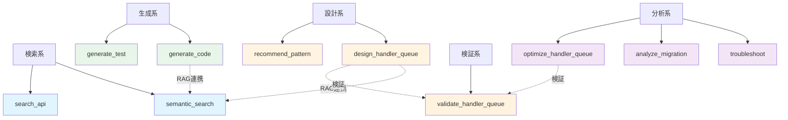
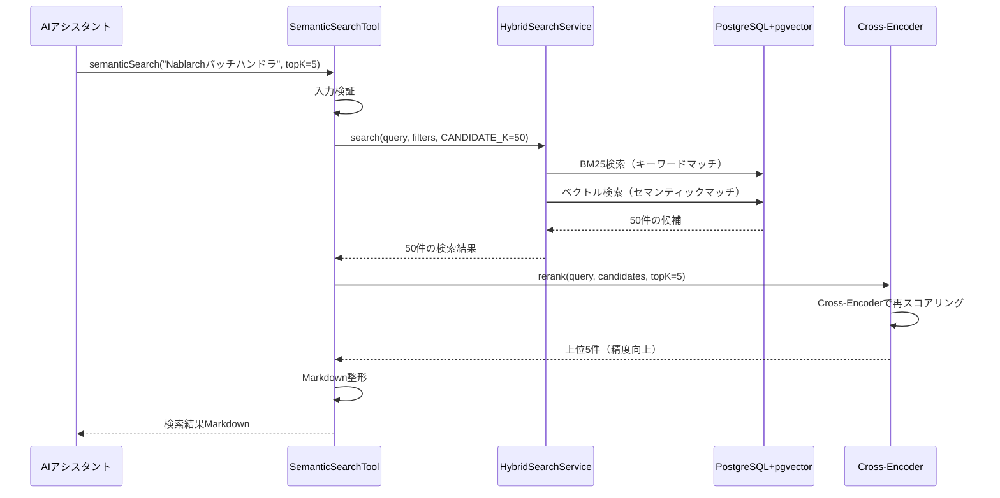
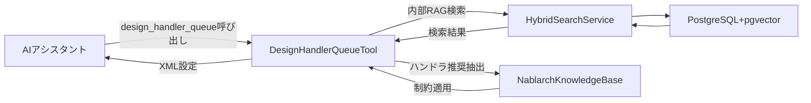

# Tool設計と実装パターン — 10 Toolsの設計思想を読み解く

> **対象読者**: 中級〜上級者
> **前提知識**: 記事05（アーキテクチャ概要）、記事08（Spring AI MCP統合）
> **学習時間**: 40分

## この記事で学べること

nablarch-mcp-serverが提供する10個のToolの設計思想と実装パターンを理解できます。

**学習目標**:
1. 各Toolの役割と分類を把握する
2. Tool実装の共通パターンを理解する
3. 代表的なToolの内部実装を読み解く
4. Tool間の連携パターンを学ぶ
5. 独自Toolを設計する指針を得る

**前提知識**:
- 記事01: MCP（Model Context Protocol）の基本概念
- 記事05: nablarch-mcp-serverのアーキテクチャ
- 記事08: Spring AI MCPの統合方法
- Java 17+、Spring Bootの基礎知識

---

## 1. MCP Toolとは何か（復習）

MCP Toolは、AIが**能動的に呼び出す「道具」**です。記事01で学んだ概念を実装レベルで振り返ります。

### Toolの基本概念

```
ユーザー: 「Nablarchのバッチアプリケーションを作りたい」
           ↓
   AIアシスタント: 「適切なハンドラキューを設計しよう」
           ↓
   【design_handler_queue Tool を呼び出す】
           ↓
   MCP Server: ハンドラキュー設計XMLを返却
           ↓
   AIアシスタント: 「このXML設定を使ってください」
```

**Toolの特徴**:
- AIが**自律的に判断**して呼び出す（ユーザーは直接操作しない）
- 入力スキーマ（JSON Schema）で引数を定義
- 出力はテキスト形式（Markdown推奨）で返却
- 副作用を持つ操作（DB書き込み、ファイル生成等）も可能

### ResourceやPromptとの違い

| 機能 | Tool | Resource | Prompt |
|------|------|----------|--------|
| **呼び出し主体** | AI（自律判断） | AI（明示的参照） | ユーザー（テンプレート利用） |
| **パラメータ** | 動的（JSON Schema定義） | 静的（URI固定） | 動的（引数付きテンプレート） |
| **用途** | 動的処理・検索・生成 | 静的知識提供 | 定型作業の効率化 |
| **例** | `design_handler_queue` | `nablarch://handler/web` | `setup-handler-queue` |

nablarch-mcp-serverは**10個のTool**を提供し、それぞれが異なる役割を担います。

---

## 2. nablarch-mcp-serverの10 Tool一覧と分類

Phase 3で実装完了した10個のToolを機能別に分類します。

### Tool一覧表

| # | Tool名 | 分類 | 役割 | 主な入力 | 主な出力 |
|---|--------|------|------|---------|---------|
| 1 | **semantic_search** | 検索系 | RAGベースのセマンティック検索 | 自然言語クエリ | 検索結果（Markdown） |
| 2 | **search_api** | 検索系 | 静的知識ベースのキーワード検索 | キーワード、カテゴリ | API情報（Markdown） |
| 3 | **design_handler_queue** | 設計系 | ハンドラキュー構成の自動設計 | app_type、要件 | XML設定+説明 |
| 4 | **recommend_pattern** | 設計系 | 設計パターンの推奨 | シナリオ、問題 | 推奨パターン一覧 |
| 5 | **generate_code** | 生成系 | Nablarchコード生成 | type、name、app_type | Javaコード |
| 6 | **generate_test** | 生成系 | テストコード生成 | target_class | JUnitテストコード |
| 7 | **validate_handler_queue** | 検証系 | ハンドラキューXML検証 | XML、app_type | 検証結果（エラー/警告） |
| 8 | **troubleshoot** | 分析系 | エラー診断・トラブルシューティング | エラーメッセージ | 原因分析+対策 |
| 9 | **analyze_migration** | 分析系 | 旧バージョンからの移行分析 | from_version、to_version | 移行ガイド |
| 10 | **optimize_handler_queue** | 分析系 | ハンドラキュー最適化提案 | 既存XML | 最適化提案 |

### 機能別分類と依存関係



**依存関係の特徴**:
- **検索系Toolは他のToolから呼び出される**: `semantic_search`は`design_handler_queue`や`generate_code`の内部でRAG検索に使われる
- **検証系Toolは設計系・分析系の後工程**: `validate_handler_queue`は設計後の検証に使用
- **分析系Toolは既存資産の改善**: 既存コード・設定を入力として改善提案を出力

---

## 3. Tool実装の共通パターン

全10 Toolに共通する実装パターンを抽出します。

### 3.1 クラス構造のテンプレート

```java
package com.tis.nablarch.mcp.tools;

import org.springframework.ai.tool.annotation.Tool;
import org.springframework.ai.tool.annotation.ToolParam;
import org.springframework.stereotype.Service;

/**
 * MCPツール: {tool_name}。
 *
 * <p>{Tool の役割と目的を記述}</p>
 */
@Service  // ① Springコンポーネントとして登録
public class XxxTool {

    // ② 依存コンポーネントをコンストラクタインジェクション
    private final SomeService someService;

    public XxxTool(SomeService someService) {
        this.someService = someService;
    }

    /**
     * {Tool の機能説明}
     *
     * @param param1 パラメータ1の説明
     * @param param2 パラメータ2の説明
     * @return 結果のMarkdownフォーマット文字列
     */
    @Tool(description = "English description for AI assistants") // ③
    public String toolMethod(
            @ToolParam(description = "Parameter 1 description") // ④
            String param1,
            @ToolParam(description = "Parameter 2 description", required = false)
            String param2) {

        // ⑤ 入力検証
        if (param1 == null || param1.isBlank()) {
            return "エラー: param1を指定してください。";
        }

        // ⑥ ビジネスロジック実行
        String result = someService.process(param1, param2);

        // ⑦ 結果をMarkdown形式で整形
        return formatResult(result);
    }

    private String formatResult(String result) {
        return "## 結果\n\n" + result;
    }
}
```

**共通パターンの7要素**:

| # | 要素 | 必須 | 説明 |
|---|------|------|------|
| ① | `@Service` | ○ | Springが管理するコンポーネント。シングルトン |
| ② | コンストラクタインジェクション | ○ | 依存コンポーネントを注入（フィールドインジェクション非推奨） |
| ③ | `@Tool` | ○ | Spring AI MCPがToolとして認識。`description`は英語で記述 |
| ④ | `@ToolParam` | ○ | 各パラメータの説明。AIがツールを選択する際のヒント |
| ⑤ | 入力検証 | ○ | null/空文字チェック。不正値は**エラーメッセージを返却** |
| ⑥ | ビジネスロジック | ○ | Serviceクラスに委譲するのが原則 |
| ⑦ | Markdown整形 | ○ | AIアシスタントが解釈しやすいMarkdown形式で返却 |

### 3.2 入力スキーマの定義方法

`@ToolParam`アノテーションでパラメータを定義すると、Spring AI MCPが自動的にJSON Schemaを生成します。

```java
@Tool(description = "Search Nablarch knowledge base")
public String search(
        @ToolParam(description = "Search query")
        String query,  // 必須パラメータ（required未指定 = true）

        @ToolParam(description = "Filter by app type", required = false)
        String appType,  // オプションパラメータ

        @ToolParam(description = "Max results (1-50, default 5)", required = false)
        Integer topK) {  // Integer型 → JSON Schemaでnumber

    // topKのデフォルト値設定
    int effectiveTopK = (topK != null && topK >= 1 && topK <= 50)
        ? topK : 5;
    // ...
}
```

**生成されるJSON Schema**（MCP自動生成）:

```json
{
  "type": "object",
  "properties": {
    "query": { "type": "string", "description": "Search query" },
    "appType": { "type": "string", "description": "Filter by app type" },
    "topK": { "type": "number", "description": "Max results (1-50, default 5)" }
  },
  "required": ["query"]
}
```

**型マッピング**:

| Java型 | JSON Schema型 | 備考 |
|--------|---------------|------|
| String | string | |
| Integer, Long, int, long | number | |
| Boolean, boolean | boolean | |
| List&lt;T&gt; | array | 要素型Tに応じて`items`が決定 |
| Map&lt;String, Object&gt; | object | 構造化パラメータ |

### 3.3 エラーハンドリングのパターン

```java
@Tool(description = "Generate Nablarch code")
public String generateCode(
        @ToolParam(description = "Type: action, form, sql, entity")
        String type,
        @ToolParam(description = "Class name")
        String name) {

    // パターン1: 入力検証エラー → 即座にエラーメッセージ返却
    if (type == null || type.isBlank()) {
        return "生成対象タイプを指定してください。"
                + "有効値: action, form, sql, entity, handler, interceptor";
    }

    String effectiveType = type.toLowerCase().trim();

    // パターン2: 不正値エラー → 有効値を含むエラーメッセージ
    if (!VALID_TYPES.contains(effectiveType)) {
        return "不正な生成対象タイプ: " + type
                + "。有効値: action, form, sql, entity, handler, interceptor";
    }

    try {
        // パターン3: 実行時エラー → try-catchで捕捉
        return codeGenerator.generate(effectiveType, name);
    } catch (Exception e) {
        log.error("コード生成でエラー: type={}, name={}", type, name, e);
        // パターン4: ユーザーフレンドリーなエラーメッセージ
        return "コード生成中にエラーが発生しました: " + e.getMessage();
    }
}
```

**エラーハンドリングの原則**:
- **例外をスローしない**: ToolメソッドからExceptionを投げると、AIアシスタントがクラッシュする可能性がある
- **文字列でエラーを返す**: `return "エラー: ...";` の形式でエラーメッセージを返却
- **ユーザーに有益な情報を含める**: 「何が問題か」「どうすれば解決するか」を明示
- **ログ出力**: エラー詳細はサーバーログに記録（デバッグ用）

### 3.4 McpServerConfigへの登録方法

実装したToolは`McpServerConfig`クラスで登録します。

```java
package com.tis.nablarch.mcp.config;

import com.tis.nablarch.mcp.tools.*;
import org.springframework.ai.tool.ToolCallbackProvider;
import org.springframework.ai.tool.method.MethodToolCallbackProvider;
import org.springframework.context.annotation.Bean;
import org.springframework.context.annotation.Configuration;

@Configuration
public class McpServerConfig {

    /**
     * MCPツールをSpring AIツールコールバックとして登録する。
     */
    @Bean
    public ToolCallbackProvider nablarchTools(
            // 全ToolをコンストラクタインジェクションでDI
            SearchApiTool searchApiTool,
            ValidateHandlerQueueTool validateHandlerQueueTool,
            SemanticSearchTool semanticSearchTool,
            CodeGenerationTool codeGenerationTool,
            DesignHandlerQueueTool designHandlerQueueTool,
            RecommendPatternTool recommendPatternTool,
            OptimizeHandlerQueueTool optimizeHandlerQueueTool,
            TroubleshootTool troubleshootTool) {

        return MethodToolCallbackProvider.builder()
                .toolObjects(
                    searchApiTool,
                    validateHandlerQueueTool,
                    semanticSearchTool,
                    codeGenerationTool,
                    designHandlerQueueTool,
                    recommendPatternTool,
                    optimizeHandlerQueueTool,
                    troubleshootTool
                )
                .build();
    }
}
```

**登録の仕組み**:
1. `@Bean`メソッドで`ToolCallbackProvider`を生成
2. `MethodToolCallbackProvider.builder()`でビルダーを取得
3. `.toolObjects(...)`に全Toolインスタンスを渡す
4. Spring AI MCPが各Toolの`@Tool`メソッドを自動検出し、JSON-RPC経由で公開

**新しいToolを追加する手順**:
1. `XxxTool`クラスを作成（`@Service` + `@Tool`メソッド）
2. `McpServerConfig.nablarchTools()`の引数に追加
3. `.toolObjects(...)`の引数リストに追加
4. 自動的にMCPクライアントから利用可能になる

---

## 4. 代表的なToolの実装詳細

3つの代表的なToolを選び、内部実装を詳しく見ていきます。

### 4.1 semantic_search: RAG連携パターン

**役割**: ハイブリッド検索（BM25+ベクトル検索）とCross-Encoderリランキングを組み合わせた高精度検索。

#### 実装全体

<details>
<summary>SemanticSearchTool.java（クリックして展開）</summary>

```java
package com.tis.nablarch.mcp.tools;

import com.tis.nablarch.mcp.rag.rerank.Reranker;
import com.tis.nablarch.mcp.rag.search.HybridSearchService;
import com.tis.nablarch.mcp.rag.search.SearchFilters;
import com.tis.nablarch.mcp.rag.search.SearchMode;
import com.tis.nablarch.mcp.rag.search.SearchResult;
import org.springframework.ai.tool.annotation.Tool;
import org.springframework.ai.tool.annotation.ToolParam;
import org.springframework.stereotype.Service;

import java.util.List;

@Service
public class SemanticSearchTool {

    static final int DEFAULT_TOP_K = 5;
    static final int CANDIDATE_K = 50;

    private final HybridSearchService hybridSearchService;
    private final Reranker reranker;

    public SemanticSearchTool(
            HybridSearchService hybridSearchService,
            Reranker reranker) {
        this.hybridSearchService = hybridSearchService;
        this.reranker = reranker;
    }

    @Tool(description = "Semantic search over the Nablarch knowledge base. "
            + "Uses hybrid search (BM25 + vector) with Cross-Encoder reranking "
            + "for high-accuracy results.")
    public String semanticSearch(
            @ToolParam(description = "Search query in natural language")
            String query,
            @ToolParam(description = "Optional app type filter")
            String appType,
            @ToolParam(description = "Number of results (1-50, default 5)")
            Integer topK,
            @ToolParam(description = "Search mode: hybrid, vector, keyword")
            String mode) {

        if (query == null || query.isBlank()) {
            return "検索クエリを指定してください。";
        }

        int effectiveTopK = (topK != null && topK >= 1 && topK <= 50)
            ? topK : DEFAULT_TOP_K;
        SearchMode effectiveMode = parseMode(mode);
        SearchFilters filters = new SearchFilters(
                nullIfBlank(appType), null, null, null, null);

        try {
            return doSearch(query, filters, effectiveTopK, effectiveMode);
        } catch (Exception e) {
            return "検索中にエラーが発生しました。search_apiツールをお試しください。";
        }
    }

    private String doSearch(
            String query, SearchFilters filters, int topK, SearchMode mode) {

        // ハイブリッド検索で候補取得（リランキング用にCANDIDATE_K件）
        List<SearchResult> candidates = hybridSearchService.search(
                query, filters, CANDIDATE_K, mode);

        // リランキング
        List<SearchResult> results = candidates.isEmpty()
            ? candidates
            : reranker.rerank(query, candidates, topK);

        return formatResults(query, mode, results);
    }

    private String formatResults(
            String query, SearchMode mode, List<SearchResult> results) {

        if (results.isEmpty()) {
            return "検索結果なし: \"" + query + "\"\n\n"
                    + "ヒント:\n"
                    + "- フィルタ条件を緩和してください\n"
                    + "- 別のキーワードを試してください\n";
        }

        StringBuilder sb = new StringBuilder();
        sb.append("## 検索結果: \"").append(query).append("\"\n");
        sb.append("モード: ").append(mode.name().toLowerCase());
        sb.append(" | 結果数: ").append(results.size()).append("件\n\n");

        for (int i = 0; i < results.size(); i++) {
            SearchResult r = results.get(i);
            sb.append("### 結果 ").append(i + 1);
            sb.append(" (スコア: ").append(String.format("%.3f", r.score()))
              .append(")\n");
            sb.append(r.content()).append("\n\n---\n\n");
        }

        return sb.toString();
    }

    private SearchMode parseMode(String mode) {
        if (mode == null || mode.isBlank()) {
            return SearchMode.HYBRID;
        }
        return switch (mode.toLowerCase()) {
            case "vector" -> SearchMode.VECTOR;
            case "keyword" -> SearchMode.KEYWORD;
            default -> SearchMode.HYBRID;
        };
    }

    private String nullIfBlank(String s) {
        return (s != null && !s.isBlank()) ? s : null;
    }
}
```

</details>

#### 処理フロー



#### 設計のポイント

1. **CANDIDATE_K=50の2段階検索**:
   - 第1段階（ハイブリッド検索）: 高速だが精度は中程度（50件取得）
   - 第2段階（リランキング）: 低速だが高精度（5件に絞り込み）
   - トレードオフを最適化: 速度と精度を両立

2. **検索モードの柔軟性**:
   - `hybrid`: BM25 + ベクトル（デフォルト、バランス型）
   - `vector`: ベクトルのみ（セマンティック重視）
   - `keyword`: BM25のみ（キーワード一致重視）

3. **フォールバック設計**:
   - `try-catch`でRAGパイプライン障害を捕捉
   - エラー時は`search_api`（静的知識ベース）へのフォールバックを提案

### 4.2 design_handler_queue: YAML知識連携パターン

**役割**: アプリタイプと要件に基づいて、順序制約を満たすハンドラキューXMLを自動生成。

#### 実装のハイライト

<details>
<summary>DesignHandlerQueueTool.java（一部抜粋）</summary>

```java
@Service
public class DesignHandlerQueueTool {

    private final NablarchKnowledgeBase knowledgeBase;

    /** アプリタイプ別の推奨ハンドラ順序（デフォルト構成） */
    private static final Map<String, List<String>> DEFAULT_HANDLER_ORDERS = Map.of(
            "web", List.of(
                    "StatusCodeConvertHandler",
                    "HttpResponseHandler",
                    "GlobalErrorHandler",
                    // ... 15ハンドラ
            ),
            "rest", List.of(
                    "StatusCodeConvertHandler",
                    "HttpResponseHandler",
                    "GlobalErrorHandler",
                    // ... 9ハンドラ
            ),
            "batch", List.of(
                    "StatusCodeConvertHandler",
                    "GlobalErrorHandler",
                    // ... 12ハンドラ
            )
    );

    @Tool(description = "Designs a Nablarch handler queue configuration")
    public String design(
            @ToolParam(description = "Application type: web, rest, batch, messaging")
            String appType,
            @ToolParam(description = "Optional requirements (comma-separated)")
            String requirements) {

        // 入力検証
        String normalizedAppType = appType.toLowerCase().trim();
        if (!DEFAULT_HANDLER_ORDERS.containsKey(normalizedAppType)) {
            return "エラー: 不明なアプリケーションタイプ: " + appType;
        }

        Set<String> reqSet = parseRequirements(requirements);

        // ハンドラリストを構築
        List<HandlerInfo> handlers = buildHandlerList(normalizedAppType, reqSet);

        // 順序制約を適用してソート
        handlers = applyOrderingConstraints(handlers);

        // 検証実行
        String validationResult = knowledgeBase.validateHandlerQueue(
                normalizedAppType,
                handlers.stream().map(h -> h.name).toList());

        // 結果生成（XML + テーブル + 説明）
        return generateResult(normalizedAppType, handlers, validationResult);
    }

    /**
     * アプリタイプと要件に基づいてハンドラリストを構築する。
     */
    private List<HandlerInfo> buildHandlerList(
            String appType, Set<String> requirements) {

        List<String> baseHandlers = DEFAULT_HANDLER_ORDERS.get(appType);
        List<HandlerInfo> handlers = new ArrayList<>();

        // 基本ハンドラを追加
        for (String name : baseHandlers) {
            String fqcn = HANDLER_FQCN_MAP.getOrDefault(name,
                    "nablarch.fw.handler." + name);
            handlers.add(new HandlerInfo(name, fqcn, "...", true));
        }

        // 要件に応じて追加ハンドラを挿入
        if (requirements.contains("csrf") && "web".equals(appType)) {
            handlers.add(new HandlerInfo(
                    "CsrfTokenVerificationHandler",
                    "nablarch.fw.web.handler.CsrfTokenVerificationHandler",
                    "CSRF対策トークン検証", false));
        }

        return handlers;
    }

    /**
     * 順序制約を適用してハンドラリストをソートする。
     */
    private List<HandlerInfo> applyOrderingConstraints(
            List<HandlerInfo> handlers) {

        List<HandlerInfo> sorted = new ArrayList<>(handlers);
        Map<String, Integer> positionMap = new HashMap<>();

        // 位置マップ構築
        for (int i = 0; i < sorted.size(); i++) {
            positionMap.put(sorted.get(i).name, i);
        }

        // 制約違反を検出して修正
        boolean changed;
        do {
            changed = false;
            for (int i = 0; i < sorted.size(); i++) {
                HandlerInfo handler = sorted.get(i);
                HandlerConstraintEntry constraint =
                    knowledgeBase.getHandlerConstraints(handler.name);

                if (constraint == null) continue;

                // mustBefore制約をチェック
                if (constraint.mustBefore != null) {
                    for (String target : constraint.mustBefore) {
                        Integer targetPos = positionMap.get(target);
                        if (targetPos != null && i >= targetPos) {
                            // targetより前に移動
                            sorted.remove(i);
                            sorted.add(targetPos, handler);
                            changed = true;
                            break;
                        }
                    }
                }
                // mustAfter制約も同様に処理...
            }

            // 位置マップを更新
            if (changed) {
                positionMap.clear();
                for (int i = 0; i < sorted.size(); i++) {
                    positionMap.put(sorted.get(i).name, i);
                }
            }
        } while (changed);

        return sorted;
    }

    /**
     * 結果をMarkdown形式で生成する。
     */
    private String generateResult(
            String appType, List<HandlerInfo> handlers,
            String validationResult) {

        StringBuilder sb = new StringBuilder();
        sb.append("## ハンドラキュー設計結果\n\n");
        sb.append("**アプリタイプ**: ").append(appType).append("\n\n");

        // ハンドラ一覧テーブル
        sb.append("| # | ハンドラ | 説明 | 必須 |\n");
        sb.append("|---|----------|------|------|\n");
        for (int i = 0; i < handlers.size(); i++) {
            HandlerInfo h = handlers.get(i);
            sb.append("| ").append(i + 1).append(" | ");
            sb.append(h.name).append(" | ");
            sb.append(h.description).append(" | ");
            sb.append(h.required ? "○" : "-").append(" |\n");
        }
        sb.append("\n");

        // XML設定
        sb.append("### XML設定\n\n```xml\n");
        sb.append(generateXml(handlers, appType));
        sb.append("```\n\n");

        // 検証結果
        sb.append("### 検証結果\n\n").append(validationResult);

        return sb.toString();
    }
}
```

</details>

#### 設計のポイント

1. **デフォルト構成 + 要件ベース拡張**:
   - `DEFAULT_HANDLER_ORDERS`: アプリタイプ別の推奨構成（静的定義）
   - `requirements`パラメータで動的に追加ハンドラを挿入（csrf, security等）

2. **制約ベースのトポロジカルソート**:
   - `handler-constraints.yaml`から順序制約を取得
   - `mustBefore`/`mustAfter`制約に違反している場合、ハンドラを移動
   - 循環依存がない限り、制約を満たす順序に収束

3. **知識ベース統合**:
   - `NablarchKnowledgeBase`: YAML知識ファイル（handler-catalog.yaml、handler-constraints.yaml）のファサード
   - `validateHandlerQueue()`: 生成XMLを検証し、エラー/警告を返却

### 4.3 generate_code: テンプレートベースパターン

**役割**: Nablarch準拠のJavaコード（Action、Form、SQL、Entity等）をテンプレートから生成。

#### 実装のハイライト

<details>
<summary>CodeGenerationTool.java（一部抜粋）</summary>

```java
@Service
public class CodeGenerationTool {

    private static final Set<String> VALID_TYPES =
            Set.of("action", "form", "sql", "entity", "handler", "interceptor");
    private static final Set<String> VALID_APP_TYPES =
            Set.of("web", "rest", "batch", "messaging");

    private final CodeGenerator codeGenerator;
    private final ObjectMapper objectMapper;

    @Tool(description = "Generate Nablarch-compliant code")
    public String generateCode(
            @ToolParam(description = "Type: action, form, sql, entity, handler")
            String type,
            @ToolParam(description = "Class name")
            String name,
            @ToolParam(description = "Application type: web, rest, batch")
            String appType,
            @ToolParam(description = "Type-specific parameters as JSON")
            String specifications) {

        // 入力検証
        String effectiveType = type.toLowerCase().trim();
        if (!VALID_TYPES.contains(effectiveType)) {
            return "不正な生成対象タイプ: " + type
                    + "。有効値: action, form, sql, entity, handler, interceptor";
        }

        String effectiveAppType = (appType != null && !appType.isBlank())
                ? appType.toLowerCase().trim() : "web";

        // specificationsのパース（JSON → Map）
        Map<String, Object> specs = parseSpecifications(specifications);

        // コード生成実行
        GenerationResult result;
        try {
            result = codeGenerator.generate(
                    effectiveType, name, effectiveAppType, specs);
        } catch (Exception e) {
            log.error("コード生成でエラー", e);
            return "コード生成中にエラーが発生しました: " + e.getMessage();
        }

        return formatResult(result);
    }

    /**
     * JSON文字列のspecificationsをMapにパースする。
     */
    private Map<String, Object> parseSpecifications(String specifications) {
        if (specifications == null || specifications.isBlank()) {
            return Map.of();
        }
        try {
            return objectMapper.readValue(specifications,
                    new TypeReference<Map<String, Object>>() {});
        } catch (Exception e) {
            log.warn("specificationsのパース失敗", e);
            return Map.of();
        }
    }

    /**
     * 生成結果をMarkdown形式に整形する。
     */
    private String formatResult(GenerationResult result) {
        StringBuilder sb = new StringBuilder();

        sb.append("## 生成結果: ").append(result.name()).append("\n\n");

        // 適用された規約
        if (!result.conventionsApplied().isEmpty()) {
            sb.append("### 適用されたNablarch規約\n");
            for (String convention : result.conventionsApplied()) {
                sb.append("- ").append(convention).append("\n");
            }
            sb.append("\n");
        }

        // 必要な依存モジュール
        if (!result.dependencies().isEmpty()) {
            sb.append("### 必要な依存モジュール\n");
            for (String dep : result.dependencies()) {
                sb.append("- ").append(dep).append("\n");
            }
            sb.append("\n");
        }

        // 生成ファイル
        for (int i = 0; i < result.files().size(); i++) {
            GenerationResult.GeneratedFile file = result.files().get(i);
            sb.append("### ファイル ").append(i + 1).append(": ")
              .append(file.fileName()).append("\n");
            sb.append("パス: `").append(file.path()).append("`\n\n");
            sb.append("```").append(file.language()).append("\n");
            sb.append(file.content());
            sb.append("```\n\n");
        }

        return sb.toString();
    }
}
```

</details>

#### CodeGeneratorの内部実装（概念）

```java
package com.tis.nablarch.mcp.codegen;

import com.samskivert.mustache.Mustache;
import com.samskivert.mustache.Template;

public class DefaultCodeGenerator implements CodeGenerator {

    private final TemplateLoader templateLoader;
    private final NablarchKnowledgeBase knowledgeBase;

    @Override
    public GenerationResult generate(
            String type, String name, String appType,
            Map<String, Object> specifications) {

        // 1. テンプレート選択
        String templatePath = selectTemplate(type, appType);
        Template template = templateLoader.load(templatePath);

        // 2. テンプレートコンテキスト構築
        Map<String, Object> context = buildContext(
                type, name, appType, specifications);

        // 3. テンプレート展開
        String code = template.execute(context);

        // 4. コード整形・品質チェック
        code = formatCode(code);
        List<String> warnings = checkQuality(code);

        // 5. 結果オブジェクト生成
        return new GenerationResult(
                type, name, appType,
                List.of(new GeneratedFile(
                        buildFilePath(type, name),
                        name + ".java",
                        code,
                        "java"
                )),
                List.of("アクションクラスはシングルトン"),
                List.of("nablarch-fw-web"),
                warnings
        );
    }

    private String selectTemplate(String type, String appType) {
        return switch (type) {
            case "action" -> switch (appType) {
                case "web" -> "action/web-action.mustache";
                case "rest" -> "action/rest-action.mustache";
                case "batch" -> "action/batch-action.mustache";
                default -> "action/web-action.mustache";
            };
            case "form" -> "form/form.mustache";
            case "entity" -> "entity/entity.mustache";
            // ...
            default -> throw new IllegalArgumentException("Unknown type: " + type);
        };
    }
}
```

#### 設計のポイント

1. **Mustacheテンプレートエンジン**:
   - ロジックレス設計: テンプレートにビジネスロジックを書かない
   - 軽量: jar1つで依存なし
   - 十分な機能: 変数展開、条件分岐、ループ

2. **specifications パラメータ**:
   - JSON文字列で構造化データを受け取る
   - `ObjectMapper`でMapにパース
   - タイプ固有のフィールド定義（Formなら`fields`、SQLなら`queries`等）

3. **規約の自動適用**:
   - テンプレートに規約を埋め込み（`do`プレフィックス、`@InjectForm` + `@OnError`等）
   - `conventionsApplied`で適用された規約を明示
   - `dependencies`で必要な依存モジュールを提示

---

## 5. Tool間の連携パターン

複数のToolが協調して動作するパターンを見ていきます。

### 5.1 検索系 → 設計系の連携（RAG統合）

`design_handler_queue`は内部で`semantic_search`相当の処理を実行します。

```java
// DesignHandlerQueueTool内部（概念的なコード）
public String design(String appType, String requirements) {
    // 1. 基本ハンドラリストを構築
    List<HandlerInfo> handlers = buildBaseHandlers(appType);

    // 2. RAG検索で追加情報を取得
    if (ragEnabled) {
        String query = "Nablarch " + appType
                + " ハンドラキュー " + requirements + " ベストプラクティス";
        List<SearchResult> ragResults = hybridSearchService.search(
                query, filters, 5, SearchMode.HYBRID);

        // 3. RAG結果からハンドラ推奨を抽出
        handlers = enrichHandlers(handlers, ragResults);
    }

    // 4. 制約ソート + XML生成
    // ...
}
```

**連携の流れ**:



### 5.2 設計系 → 検証系の連携

`design_handler_queue`で生成したXMLを`validate_handler_queue`で検証する連鎖パターン。

**AIアシスタントの動作例**:

```
ユーザー: 「Webアプリ用のハンドラキューを作って」
    ↓
AI: design_handler_queue(appType="web") 呼び出し
    → XML設定を取得
    ↓
AI: validate_handler_queue(handlerQueueXml=<生成XML>, applicationType="web") 呼び出し
    → 検証結果を取得
    ↓
AI: 「以下のXML設定を使用してください。検証結果: OK」
```

**Tool側の実装**:

```java
// DesignHandlerQueueTool（生成後に自動検証）
public String design(String appType, String requirements) {
    // ハンドラリスト生成
    List<HandlerInfo> handlers = buildHandlerList(appType, requirements);
    handlers = applyOrderingConstraints(handlers);

    // 検証実行（内部呼び出し）
    List<String> handlerNames = handlers.stream()
            .map(h -> h.name)
            .collect(Collectors.toList());
    String validationResult = knowledgeBase.validateHandlerQueue(
            appType, handlerNames);

    // 結果に検証結果を含める
    return generateResult(appType, handlers, validationResult);
}
```

**ポイント**:
- `design_handler_queue`は生成時に自動検証を実行
- AIアシスタントは追加で`validate_handler_queue`を呼ぶこともできる（二重チェック）
- 検証結果が`NG`の場合、AIは修正指示を出す

### 5.3 生成系 → 分析系の連携

`generate_code`で生成したコードを`troubleshoot`で診断するパターン。

**連携例**:

```
ユーザー: 「Productエンティティを作って」
    ↓
AI: generate_code(type="entity", name="Product") 呼び出し
    → Entityコード生成
    ↓
ユーザー: 「このコードでエラーが出たんだけど」
    ↓
AI: troubleshoot(errorMessage=<エラー内容>, context="Product.java") 呼び出し
    → 診断結果取得
    ↓
AI: 「@Idアノテーションが不足しています。以下のように修正してください」
```

---

## 6. 自分でToolを作るときの設計指針

新しいToolを設計する際のガイドラインをまとめます。

### 6.1 Tool設計の5ステップ

| ステップ | 内容 | 成果物 |
|---------|------|--------|
| ① ユースケース定義 | どのシナリオで使うか？誰が使うか？ | ユースケース記述 |
| ② 入出力設計 | 何を入力し、何を返すか？ | JSON Schema、出力フォーマット |
| ③ ロジック設計 | どう処理するか？外部依存は？ | フローチャート、クラス図 |
| ④ エラーハンドリング | どんなエラーが起きるか？どう伝えるか？ | エラーパターン一覧 |
| ⑤ テスト設計 | 正常系・異常系・境界値は？ | テストケース一覧 |

### 6.2 良いTool設計の原則

#### 原則1: 単一責任の原則（SRP）

**悪い例**: 1つのToolで複数の機能を詰め込む

```java
// ❌ 悪い例
@Tool(description = "Do everything: search, validate, generate code")
public String doEverything(
        String action,  // "search", "validate", "generate"
        String param1,
        String param2) {
    if ("search".equals(action)) {
        return search(param1);
    } else if ("validate".equals(action)) {
        return validate(param1, param2);
    } else if ("generate".equals(action)) {
        return generate(param1, param2);
    }
    return "Unknown action";
}
```

**良い例**: 機能ごとに独立したToolを作る

```java
// ✅ 良い例
@Service
public class SearchTool {
    @Tool(description = "Search the knowledge base")
    public String search(String query) { /* ... */ }
}

@Service
public class ValidateTool {
    @Tool(description = "Validate configuration")
    public String validate(String config, String type) { /* ... */ }
}

@Service
public class GenerateTool {
    @Tool(description = "Generate code")
    public String generate(String type, String name) { /* ... */ }
}
```

#### 原則2: AIフレンドリーな命名とdescription

**命名規則**:
- **Tool名**: 動詞 + 目的語（例: `search_api`, `validate_handler_queue`, `generate_code`）
- **descriptionは英語で記述**: AIアシスタントが理解しやすい
- **descriptionは具体的に**: 「何をするToolか」「いつ使うべきか」を明示

**悪い例**:

```java
// ❌ 不明瞭なdescription
@Tool(description = "Process data")
public String process(String data) { /* ... */ }
```

**良い例**:

```java
// ✅ 具体的なdescription
@Tool(description = "Validate a Nablarch handler queue XML configuration. "
        + "Checks handler ordering constraints, required handlers, and best practices. "
        + "Use this to verify handler queue configurations before deployment.")
public String validateHandlerQueue(String xml, String appType) { /* ... */ }
```

#### 原則3: 入力検証を徹底

```java
@Tool(description = "Generate Nablarch code")
public String generateCode(String type, String name, String appType) {
    // ① null/空文字チェック
    if (type == null || type.isBlank()) {
        return "生成対象タイプを指定してください。";
    }
    if (name == null || name.isBlank()) {
        return "クラス名を指定してください。";
    }

    // ② 正規化
    String normalizedType = type.toLowerCase().trim();
    String normalizedAppType = (appType != null && !appType.isBlank())
            ? appType.toLowerCase().trim() : "web";

    // ③ 有効値チェック
    if (!VALID_TYPES.contains(normalizedType)) {
        return "不正な生成対象タイプ: " + type
                + "。有効値: " + String.join(", ", VALID_TYPES);
    }

    // ④ ビジネスロジック実行
    // ...
}
```

#### 原則4: エラーメッセージはユーザーフレンドリーに

```java
// ❌ 悪い例
return "Error: NPE";

// ❌ 悪い例
return "Invalid input";

// ✅ 良い例
return "検索クエリを指定してください。";

// ✅ 良い例
return "不正なアプリケーションタイプ: " + appType
        + "。有効値: web, rest, batch, messaging";

// ✅ 良い例（複数行で詳細説明）
return """
        エラー: ハンドラキューXMLの解析に失敗しました。

        考えられる原因:
        - class属性が指定されていない
        - XML形式が不正
        - コメントのみでハンドラ定義がない

        正しい形式:
        <component class="nablarch.fw.handler.GlobalErrorHandler"/>
        """;
```

#### 原則5: 出力はMarkdownで構造化

```java
private String formatResult(List<SearchResult> results) {
    StringBuilder sb = new StringBuilder();

    // タイトル（##）
    sb.append("## 検索結果\n\n");

    // メタ情報（太字）
    sb.append("**件数**: ").append(results.size()).append("件\n\n");

    // 区切り線
    sb.append("---\n\n");

    // 結果リスト（###）
    for (int i = 0; i < results.size(); i++) {
        sb.append("### 結果 ").append(i + 1).append("\n");
        sb.append(results.get(i).content()).append("\n\n");
    }

    // コードブロック（必要に応じて）
    sb.append("```xml\n");
    sb.append("<component class=\"...\"/>\n");
    sb.append("```\n\n");

    return sb.toString();
}
```

### 6.3 Tool実装チェックリスト

新しいToolを実装する際のチェックリスト：

- [ ] `@Service`アノテーションを付与
- [ ] `@Tool`アノテーションに英語のdescriptionを記述
- [ ] 全パラメータに`@ToolParam`アノテーションを付与
- [ ] 必須パラメータのnull/空文字チェック
- [ ] 不正値の検証（有効値を含むエラーメッセージ）
- [ ] 例外を`try-catch`で捕捉し、文字列でエラーを返却
- [ ] 出力をMarkdown形式で整形
- [ ] `McpServerConfig.nablarchTools()`に追加
- [ ] 単体テスト作成（正常系・異常系）
- [ ] 統合テスト作成（MockMvc経由でJSON-RPC呼び出し）
- [ ] 設計書作成（`docs/designs/`配下）
- [ ] API仕様書に追加（`docs/06-api-specification.md`）

---

## 7. まとめ — 次の記事への橋渡し

### 本記事で学んだこと

1. **10 Toolの分類と役割**:
   - 検索系（semantic_search、search_api）
   - 設計系（design_handler_queue、recommend_pattern）
   - 生成系（generate_code、generate_test）
   - 検証系（validate_handler_queue）
   - 分析系（troubleshoot、analyze_migration、optimize_handler_queue）

2. **Tool実装の共通パターン**:
   - `@Service` + `@Tool` + `@ToolParam`
   - 入力検証 → ビジネスロジック → Markdown整形のフロー
   - エラーハンドリング: 例外をスローせず、文字列で返却
   - `McpServerConfig`への登録方法

3. **代表的なToolの内部実装**:
   - **semantic_search**: RAG連携（ハイブリッド検索 + リランキング）
   - **design_handler_queue**: YAML知識ベース連携（順序制約ソート）
   - **generate_code**: テンプレートベース（Mustache + 規約適用）

4. **Tool間の連携パターン**:
   - 検索系 → 設計系（RAG統合）
   - 設計系 → 検証系（生成後の自動検証）
   - 生成系 → 分析系（コード診断）

5. **独自Tool設計の指針**:
   - 単一責任の原則
   - AIフレンドリーな命名とdescription
   - 入力検証の徹底
   - ユーザーフレンドリーなエラーメッセージ
   - Markdownでの構造化出力

### Tool設計の本質

MCP Toolは**AIの手足**です。適切に設計されたToolは、AIアシスタントの能力を拡張し、ユーザーに高い価値を提供します。

**良いTool設計の3原則**:
1. **明確な責任**: 1つのToolは1つの機能に集中する
2. **AI可読性**: descriptionとパラメータ名でAIが理解しやすくする
3. **ユーザー中心**: エラーメッセージと出力フォーマットはユーザーのために最適化する

### 次の記事

次回は「記事11: Resource設計と実装パターン」です。

**学習内容**:
- 8種類のResourceの役割と分類
- ResourceProviderの実装パターン
- Tool（動的処理）とResource（静的知識）の使い分け
- ハンドラカタログとガイドの設計思想

**Resourceの特徴**:
- Toolと異なり、静的な知識を提供
- URI（`nablarch://handler/web`等）で識別
- Markdown形式で構造化されたドキュメント
- AIがコンテキスト構築時に参照

Toolが「AIの手足」なら、**Resourceは「AIの記憶」**です。次回もお楽しみに！

---

## 参考資料

### 内部ドキュメント

- [API仕様書](../06-api-specification.md) — 全Tool/Resource/Promptの仕様
- [アーキテクチャ設計書](../02-architecture.md) — システム全体設計
- [設計書: search_api Tool](../designs/04_tool-search-api.md)
- [設計書: validate_handler_queue Tool](../designs/05_tool-validate-config.md)
- [設計書: design_handler_queue Tool](../designs/15_tool-design-handler-queue.md)
- [設計書: generate_code Tool](../designs/16_tool-generate-code.md)

### 外部リンク

- [Model Context Protocol (MCP) 仕様](https://modelcontextprotocol.io/)
- [Spring AI Documentation](https://docs.spring.io/spring-ai/reference/)
- [Mustache Template Engine](https://github.com/samskivert/jmustache)

---

**前の記事**: [09. 設定ファイル完全ガイド](09-configuration-guide.md)
**次の記事**: [11. Resource/Prompt設計と実装パターン](11-resource-prompt-patterns.md)
**目次に戻る**: [記事一覧](./INDEX.md)
