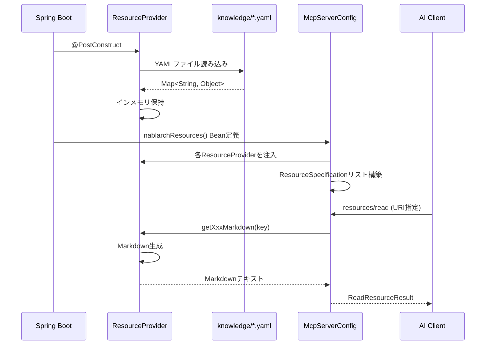
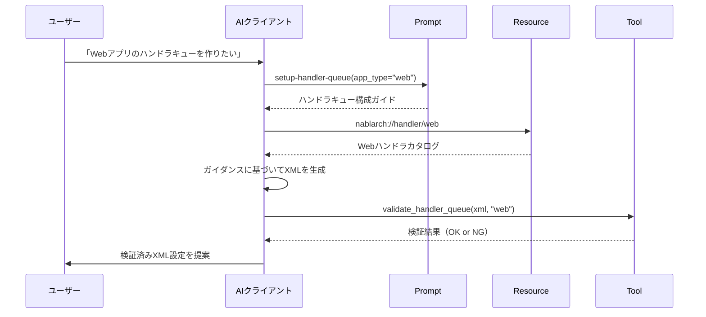

# 記事11: Resource/Prompt設計と実装パターン — 知識の公開とテンプレートの活用

> **対象読者**: 中級〜上級者（MCP Tool実装経験者）
> **前提知識**: [記事05: アーキテクチャ概要](05-architecture-overview.md)、[記事10: Tool設計と実装パターン](10-tool-design-patterns.md)
> **所要時間**: 40分

---

## この記事で学べること

本記事では、Nablarch MCP Serverが提供する **8 Resources** と **6 Prompts** の設計・実装パターンを解説します。ResourceとPromptはToolとは異なる役割を持ち、AIクライアントに「知識の参照先」と「指示のテンプレート」を提供します。

- **MCP Resourceとは何か**: AIが参照する読み取り専用の知識源
- **8 Resourceの設計**: URIパターン設計とRESTful思考
- **ResourceProvider実装パターン**: YAMLファイル → Markdown変換 → MCP Resource公開のフロー
- **MCP Promptとは何か**: AIへの指示テンプレート
- **6 Promptの設計**: 引数付きPromptと知識YAMLの統合
- **Resource + Prompt連携**: ToolとResource/Promptの組み合わせ方

前提知識として、記事10でToolの実装パターンを理解していることを前提とします。本記事ではToolとは異なる「受動的な知識提供」の実装方法を学びます。

---

## MCP Resourceとは何か（復習）

### Resource vs Tool の違い

MCP（Model Context Protocol）では、AIクライアントが参照できる情報として **Tool** と **Resource** の2種類を提供します。

| 比較項目 | Tool（能動的） | Resource（受動的） |
|---------|--------------|------------------|
| **呼び出し方** | AIが明示的に実行する（`tools/call`） | AIが必要に応じて参照する（`resources/read`） |
| **副作用** | 副作用あり（検証、コード生成等） | 副作用なし（読み取り専用） |
| **用途** | 動的検索、検証、コード生成 | 静的な知識カタログ |
| **レスポンス** | 実行結果（動的） | 知識データ（静的または動的） |

**Toolの例**:
- `search_api`: キーワード検索を実行し、マッチした結果を返す
- `validate_handler_queue`: XMLを検証し、エラーがあれば指摘する

**Resourceの例**:
- `nablarch://handler/web`: Webアプリケーション用のハンドラキュー仕様（カタログ）
- `nablarch://pattern/form-validation-pattern`: フォームバリデーションパターンの説明

AIクライアント（例: Claude Desktop）は、Toolを「実行」してリアルタイムな情報を得るか、Resourceを「参照」して静的な知識を得るかを判断します。

### Resourceの設計思想

MCP Resourceの設計では、**URIスキーム** を用いて知識を階層的に整理します。これはRESTful APIのURIパターン設計と同じ思考法です。

```
nablarch://{resource_type}/{resource_key}
```

例:
- `nablarch://handler/web` → ハンドラカタログの「web」タイプ
- `nablarch://api/common-dao/UniversalDao` → APIリファレンスの「common-dao」モジュールの「UniversalDao」クラス
- `nablarch://pattern/form-validation-pattern` → パターンカタログの「form-validation-pattern」

このURI設計により、AIクライアントは「どこに何があるか」を理解しやすくなります。

---

## 8 Resourceの一覧とURIパターン設計

Nablarch MCP Serverは以下の8種類のResourceを提供します。

### Resource一覧表

| # | Resource種別 | URIプレフィックス | MIMEタイプ | 説明 |
|---|-------------|------------------|-----------|------|
| 1 | Handler | `nablarch://handler/` | `text/markdown` | アプリタイプ別ハンドラキュー仕様 |
| 2 | Guide | `nablarch://guide/` | `text/markdown` | トピック別開発ガイド |
| 3 | API | `nablarch://api/` | `application/json` | モジュール・クラスAPIリファレンス |
| 4 | Pattern | `nablarch://pattern/` | `text/markdown` | 設計パターンカタログ |
| 5 | Antipattern | `nablarch://antipattern/` | `text/markdown` | アンチパターンと修正方法 |
| 6 | Config | `nablarch://config/` | `application/xml` | XML設定テンプレート |
| 7 | Example | `nablarch://example/` | `application/json` | サンプルアプリケーションコード |
| 8 | Version | `nablarch://version` | `application/json` | バージョン情報（キーなし） |

### URIパターンの階層構造

```mermaid
graph TD
    A[nablarch://] --> B1[handler/{app_type}]
    A --> B2[guide/{topic}]
    A --> B3[api/]
    A --> B4[pattern/{name}]
    A --> B5[antipattern/{name}]
    A --> B6[config/{name}]
    A --> B7[example/{type}]
    A --> B8[version]

    B3 --> C1[api/ モジュール一覧]
    B3 --> C2[api/{module} クラス一覧]
    B3 --> C3[api/{module}/{class} クラス詳細]

    B1 --> D1[web]
    B1 --> D2[rest]
    B1 --> D3[batch]
    B1 --> D4[messaging]

    style B3 fill:#e1f5ff
    style C1 fill:#e1f5ff
    style C2 fill:#e1f5ff
    style C3 fill:#e1f5ff
```

### URIパターン設計のルール

Nablarch MCP Serverでは、以下のルールに基づいてURIを設計しています:

1. **スキームの統一**: 全てのResourceは `nablarch://` スキームを使用
2. **階層構造**: リソース種別 → キー → サブキー の順に階層化
3. **RESTful思考**: 名詞ベースのURI（動詞は使わない）
4. **大文字小文字の統一**: 全て小文字、単語区切りはハイフン（`handler-queue`）
5. **一覧エンドポイント**: キーなしでアクセスすると一覧を返す（例: `nablarch://pattern/`）

---

## ResourceProvider実装パターン

### YAMLファイル → Markdown変換 → MCP Resource公開のフロー

全てのResourceProviderは以下の共通パターンに従います:



### 実装例1: HandlerResourceProvider（ハンドラカタログ）

`HandlerResourceProvider` は `handler/{app_type}` Resourceを提供します。

```java
@Component
public class HandlerResourceProvider {

    private static final Set<String> VALID_APP_TYPES = Set.of(
            "web", "rest", "batch", "messaging", "http-messaging", "jakarta-batch");

    private Map<String, Object> handlerCatalog;
    private List<Map<String, Object>> constraints;

    @PostConstruct
    @SuppressWarnings("unchecked")
    public void init() throws IOException {
        ObjectMapper mapper = new ObjectMapper(new YAMLFactory());
        TypeReference<Map<String, Object>> mapType = new TypeReference<>() {};

        // handler-catalog.yaml を読み込み
        try (InputStream is = getClass().getClassLoader()
                .getResourceAsStream("knowledge/handler-catalog.yaml")) {
            handlerCatalog = mapper.readValue(is, mapType);
        }

        // handler-constraints.yaml を読み込み
        try (InputStream is = getClass().getClassLoader()
                .getResourceAsStream("knowledge/handler-constraints.yaml")) {
            Map<String, Object> data = mapper.readValue(is, mapType);
            constraints = (List<Map<String, Object>>) data.get("constraints");
        }
    }

    public String getHandlerMarkdown(String appType) {
        if (appType == null || !VALID_APP_TYPES.contains(appType)) {
            return "# Unknown Application Type\n\nUnknown application type: " + appType
                    + "\n\nValid types: " + String.join(", ", VALID_APP_TYPES);
        }

        Map<String, Object> appData = (Map<String, Object>) handlerCatalog.get(appType);
        String description = (String) appData.get("description");
        List<Map<String, Object>> handlers =
                (List<Map<String, Object>>) appData.get("handlers");

        StringBuilder sb = new StringBuilder();
        sb.append("# Nablarch ").append(formatAppType(appType))
                .append(" Application Handler Queue\n\n");
        sb.append(description).append("\n\n");
        sb.append("## Handler Queue (in order)\n\n");

        for (int i = 0; i < handlers.size(); i++) {
            appendHandler(sb, i + 1, handlers.get(i));
        }

        appendConstraintsSummary(sb, appType);

        sb.append("\n---\n*Source: handler-catalog.yaml, handler-constraints.yaml*\n");
        return sb.toString();
    }
}
```

**実装のポイント**:
- `@PostConstruct` で起動時にYAMLファイルを読み込み、インメモリに保持
- `getHandlerMarkdown(String appType)` でアプリタイプに応じたMarkdownを生成
- 不正なキーが指定された場合、有効なキー一覧を含むエラーメッセージを返す

### 実装例2: PatternResourceProvider（パターンカタログ）

`PatternResourceProvider` は `pattern/{name}` Resourceを提供します。

```java
@Component
public class PatternResourceProvider {

    private List<Map<String, Object>> patterns;

    @PostConstruct
    @SuppressWarnings("unchecked")
    public void init() throws IOException {
        ObjectMapper mapper = new ObjectMapper(new YAMLFactory());
        TypeReference<Map<String, Object>> mapType = new TypeReference<>() {};
        try (InputStream is = loadResource("knowledge/design-patterns.yaml")) {
            Map<String, Object> data = mapper.readValue(is, mapType);
            patterns = (List<Map<String, Object>>) data.get("patterns");
        }
    }

    @SuppressWarnings("unchecked")
    public String getPatternList() {
        StringBuilder sb = new StringBuilder();
        sb.append("# Nablarch デザインパターンカタログ\n\n");
        sb.append("| # | パターン名 | カテゴリ | 説明 |\n");
        sb.append("|---|-----------|---------|------|\n");
        int index = 1;
        for (Map<String, Object> pattern : patterns) {
            sb.append("| ").append(index++).append(" | ");
            sb.append(pattern.get("name")).append(" | ");
            sb.append(pattern.get("category")).append(" | ");
            String desc = (String) pattern.get("description");
            sb.append(desc != null ? desc.replace("\n", " ") : "").append(" |\n");
        }
        sb.append("\n---\n*Source: design-patterns.yaml*\n");
        return sb.toString();
    }

    @SuppressWarnings("unchecked")
    public String getPatternDetail(String name) {
        Map<String, Object> pattern = findPattern(name);
        if (pattern == null) {
            return "# Unknown Pattern\n\nUnknown pattern: " + name + "\n\nValid patterns: "
                + String.join(", ", getValidPatternNames());
        }
        StringBuilder sb = new StringBuilder();
        sb.append("# ").append(pattern.get("name")).append("\n\n");
        sb.append("**カテゴリ**: ").append(pattern.get("category")).append("\n\n");
        sb.append("## 概要\n").append(pattern.get("description")).append("\n\n");
        Object problem = pattern.get("problem");
        if (problem != null) sb.append("## 問題\n").append(problem).append("\n\n");
        Object solution = pattern.get("solution");
        if (solution != null) sb.append("## 解決策\n").append(solution).append("\n\n");
        Object codeExample = pattern.get("code_example");
        if (codeExample != null) sb.append("## コード例\n```java\n").append(codeExample).append("```\n\n");
        sb.append("---\n*Source: design-patterns.yaml*\n");
        return sb.toString();
    }
}
```

**実装のポイント**:
- `getPatternList()` でパターン一覧をMarkdownテーブルとして返す
- `getPatternDetail(String name)` で個別パターンの詳細を返す
- 一覧と詳細の2つのメソッドで、階層的なResourceアクセスを実現

### McpServerConfigへの統合

全てのResourceProviderは `McpServerConfig` でMCP Resourceとして登録します。

```java
@Bean
public List<McpServerFeatures.SyncResourceSpecification> nablarchResources(
        HandlerResourceProvider handlerProvider,
        GuideResourceProvider guideProvider,
        ApiResourceProvider apiProvider,
        PatternResourceProvider patternProvider,
        AntipatternResourceProvider antipatternProvider,
        ConfigResourceProvider configProvider,
        ExampleResourceProvider exampleProvider,
        VersionResourceProvider versionProvider) {

    List<McpServerFeatures.SyncResourceSpecification> resources = new ArrayList<>();

    // Handler Resources (6種)
    for (String appType : List.of("web", "rest", "batch", "messaging", "http-messaging", "jakarta-batch")) {
        resources.add(new McpServerFeatures.SyncResourceSpecification(
            new McpSchema.Resource(
                "nablarch://handler/" + appType,
                "Nablarch " + formatAppType(appType) + " Handler Catalog",
                "ハンドラキュー仕様・順序制約",
                "text/markdown",
                null
            ),
            (exchange, request) -> new McpSchema.ReadResourceResult(
                List.of(new McpSchema.TextResourceContents(
                    request.uri(),
                    "text/markdown",
                    handlerProvider.getHandlerMarkdown(appType)
                ))
            )
        ));
    }

    // Guide Resources (6種)
    for (String topic : List.of("setup", "testing", "validation", "database", "handler-queue", "error-handling")) {
        resources.add(new McpServerFeatures.SyncResourceSpecification(
            new McpSchema.Resource(
                "nablarch://guide/" + topic,
                "Nablarch " + formatTopic(topic) + " Guide",
                "開発ガイド",
                "text/markdown",
                null
            ),
            (exchange, request) -> new McpSchema.ReadResourceResult(
                List.of(new McpSchema.TextResourceContents(
                    request.uri(),
                    "text/markdown",
                    guideProvider.getGuideMarkdown(topic)
                ))
            )
        ));
    }

    // Pattern Resources (一覧 + 個別)
    resources.add(resourceSpec("nablarch://pattern/", "Nablarch パターン一覧", "text/markdown",
        (exchange, request) -> patternProvider.getPatternList()));

    for (String patternName : patternProvider.getValidPatternNames()) {
        resources.add(resourceSpec("nablarch://pattern/" + patternName,
            "Nablarch パターン: " + patternName, "text/markdown",
            (exchange, request) -> patternProvider.getPatternDetail(patternName)));
    }

    // 他のResourceも同様に登録...

    return resources;
}
```

**実装のポイント**:
- 各ResourceProviderをBean注入で受け取る
- 静的なURI一覧をループで登録（handler/web, handler/rest 等）
- 一覧と詳細の両方を登録（pattern/ と pattern/{name}）

---

## MCP Promptとは何か（復習）

### Promptの役割

MCP Promptは、**AIクライアントへの指示テンプレート** です。ToolやResourceとは異なり、Promptは「AIにどう行動すべきか」を指示するガイダンスを提供します。

| 比較項目 | Tool | Resource | Prompt |
|---------|------|----------|--------|
| **役割** | 動的処理の実行 | 静的知識の参照 | AIへの指示テンプレート |
| **実行者** | MCP Server | MCP Server | AI（Promptを受け取って行動） |
| **引数** | 検索キーワード、XML等 | URI | トピック、パラメータ等 |
| **出力** | 実行結果 | 知識データ | Markdown形式のガイダンス |

**Promptの例**:
- `setup-handler-queue`: ハンドラキュー構成を支援するガイダンス
- `create-action`: アクションクラス生成を支援するガイダンス

AIクライアントは、Promptを受け取ると、その内容に基づいて「何をすべきか」を理解し、ToolやResourceを組み合わせて作業を進めます。

### PromptとResourceの組み合わせ

PromptはResourceと組み合わせて使用されることが多いです。

**例: setup-handler-queue Prompt**

1. AIがユーザーから「Webアプリのハンドラキューを作りたい」という要求を受ける
2. AIが `setup-handler-queue(app_type="web")` Promptを呼び出す
3. Promptは `nablarch://handler/web` Resourceの内容を含むガイダンスを生成
4. AIはガイダンスに従って、ハンドラキュー構成を提案

---

## 6 Promptの一覧と設計パターン

Nablarch MCP Serverは以下の6種類のPromptを提供します。

### Prompt一覧表

| # | Prompt名 | 引数 | 用途 |
|---|---------|------|------|
| 1 | setup-handler-queue | app_type | ハンドラキュー構成ガイド |
| 2 | create-action | app_type, action_name | アクションクラススケルトン生成ガイド |
| 3 | review-config | config_xml | XML設定ファイルレビューガイド |
| 4 | explain-handler | handler_name | ハンドラ詳細説明 |
| 5 | migration-guide | from_version, to_version | バージョン間移行ガイド |
| 6 | best-practices | topic | トピック別ベストプラクティス |

### 実装例3: SetupHandlerQueuePrompt（ハンドラキュー構成ガイド）

```java
@Component
public class SetupHandlerQueuePrompt {

    private static final ObjectMapper YAML = new ObjectMapper(new YAMLFactory());
    private static final List<String> VALID_APP_TYPES = List.of("web", "rest", "batch", "messaging");

    private Map<String, Object> handlerCatalog;
    private Map<String, Object> constraintsData;
    private Map<String, Object> configTemplates;

    @PostConstruct
    @SuppressWarnings("unchecked")
    void init() throws IOException {
        try (InputStream is = getClass().getResourceAsStream("/knowledge/handler-catalog.yaml")) {
            handlerCatalog = YAML.readValue(is, Map.class);
        }
        try (InputStream is = getClass().getResourceAsStream("/knowledge/handler-constraints.yaml")) {
            constraintsData = YAML.readValue(is, Map.class);
        }
        try (InputStream is = getClass().getResourceAsStream("/knowledge/config-templates.yaml")) {
            configTemplates = YAML.readValue(is, Map.class);
        }
    }

    @SuppressWarnings("unchecked")
    public McpSchema.GetPromptResult execute(Map<String, String> arguments) {
        String appType = arguments != null ? arguments.get("app_type") : null;
        if (appType == null || appType.isBlank()) {
            throw new IllegalArgumentException("app_type は必須です。指定可能な値: " + VALID_APP_TYPES);
        }
        if (!VALID_APP_TYPES.contains(appType)) {
            throw new IllegalArgumentException("不正な app_type: " + appType + "。指定可能な値: " + VALID_APP_TYPES);
        }

        var sb = new StringBuilder();
        sb.append("# ").append(appType).append(" アプリケーションのハンドラキュー構成ガイド\n\n");

        // ハンドラ一覧を展開
        Map<String, Object> typeData = (Map<String, Object>) handlerCatalog.get(appType);
        if (typeData != null) {
            String desc = (String) typeData.get("description");
            sb.append("## 概要\n\n").append(desc).append("\n\n");

            List<Map<String, Object>> handlers = (List<Map<String, Object>>) typeData.get("handlers");
            if (handlers != null && !handlers.isEmpty()) {
                sb.append("## 推奨ハンドラキュー\n\n");
                sb.append("| 順序 | ハンドラ | FQCN | 必須 | スレッド | 説明 |\n");
                sb.append("|------|---------|------|------|---------|------|\n");
                for (var h : handlers) {
                    sb.append("| ").append(h.get("order"))
                      .append(" | ").append(h.get("name"))
                      .append(" | `").append(h.get("fqcn")).append("`")
                      .append(" | ").append(Boolean.TRUE.equals(h.get("required")) ? "はい" : "いいえ")
                      .append(" | ").append(h.get("thread"))
                      .append(" | ").append(h.get("description"))
                      .append(" |\n");
                }
                sb.append("\n");
            }
        }

        // 順序制約を展開
        List<Map<String, Object>> constraints = (List<Map<String, Object>>) constraintsData.get("constraints");
        if (constraints != null) {
            sb.append("## 順序制約\n\n");
            for (var c : constraints) {
                List<String> requiredBy = (List<String>) c.get("required_by_app_type");
                if (requiredBy != null && requiredBy.contains(appType)) {
                    sb.append("### ").append(c.get("handler")).append("\n\n");
                    sb.append("- **FQCN**: `").append(c.get("fqcn")).append("`\n");
                    sb.append("- **ルール**: ").append(c.get("rule")).append("\n");
                    if (c.get("must_before") != null) {
                        sb.append("- **前に配置**: ").append(c.get("must_before")).append("\n");
                    }
                    if (c.get("must_after") != null) {
                        sb.append("- **後に配置**: ").append(c.get("must_after")).append("\n");
                    }
                    sb.append("- **理由**: ").append(c.get("reason")).append("\n\n");
                }
            }
        }

        // XML設定テンプレートを展開
        List<Map<String, Object>> templates = (List<Map<String, Object>>) configTemplates.get("templates");
        if (templates != null) {
            sb.append("## XML設定テンプレート\n\n");
            for (var t : templates) {
                String tAppType = (String) t.get("app_type");
                if (appType.equals(tAppType)) {
                    sb.append("### ").append(t.get("name")).append("\n\n");
                    sb.append(t.get("description")).append("\n\n");
                    sb.append("```xml\n").append(t.get("template")).append("```\n\n");
                }
            }
        }

        return new McpSchema.GetPromptResult(
            appType + " アプリケーションのハンドラキュー構成ガイド",
            List.of(new McpSchema.PromptMessage(
                McpSchema.Role.USER,
                new McpSchema.TextContent(sb.toString())
            ))
        );
    }
}
```

**実装のポイント**:
- `@PostConstruct` で3つのYAMLファイルを読み込み
- `execute(Map<String, String> arguments)` で引数を受け取り、Markdown形式のガイダンスを生成
- 引数バリデーション: 必須引数がない場合、または不正な値の場合は `IllegalArgumentException` をスロー
- 出力: `McpSchema.GetPromptResult` にMarkdown形式の `TextContent` を格納

### 実装例4: BestPracticesPrompt（ベストプラクティスガイド）

```java
@Component
public class BestPracticesPrompt {

    private static final ObjectMapper YAML = new ObjectMapper(new YAMLFactory());
    private static final List<String> VALID_TOPICS = List.of(
        "handler-queue", "action", "validation", "database", "testing"
    );

    /** トピックからdesign-patternsのカテゴリへのマッピング。 */
    private static final Map<String, List<String>> TOPIC_TO_CATEGORIES = Map.of(
        "handler-queue", List.of("architecture"),
        "action", List.of("action"),
        "validation", List.of("validation"),
        "database", List.of("database"),
        "testing", List.of("testing")
    );

    /** トピックからapi-patternsのカテゴリへのマッピング。 */
    private static final Map<String, List<String>> TOPIC_TO_API_CATEGORIES = Map.of(
        "handler-queue", List.of(),
        "action", List.of("web", "rest", "batch"),
        "validation", List.of("web"),
        "database", List.of("web", "batch"),
        "testing", List.of()
    );

    private Map<String, Object> designPatterns;
    private Map<String, Object> apiPatterns;

    @PostConstruct
    @SuppressWarnings("unchecked")
    void init() throws IOException {
        try (InputStream is = getClass().getResourceAsStream("/knowledge/design-patterns.yaml")) {
            designPatterns = YAML.readValue(is, Map.class);
        }
        try (InputStream is = getClass().getResourceAsStream("/knowledge/api-patterns.yaml")) {
            apiPatterns = YAML.readValue(is, Map.class);
        }
    }

    @SuppressWarnings("unchecked")
    public McpSchema.GetPromptResult execute(Map<String, String> arguments) {
        String topic = arguments != null ? arguments.get("topic") : null;
        if (topic == null || topic.isBlank()) {
            throw new IllegalArgumentException("topic は必須です。指定可能な値: " + VALID_TOPICS);
        }
        if (!VALID_TOPICS.contains(topic)) {
            throw new IllegalArgumentException("不正な topic: " + topic + "。指定可能な値: " + VALID_TOPICS);
        }

        var sb = new StringBuilder();
        sb.append("# Nablarch ベストプラクティス: ").append(topic).append("\n\n");

        // 設計パターンの展開
        List<String> dpCategories = TOPIC_TO_CATEGORIES.getOrDefault(topic, List.of());
        List<Map<String, Object>> dpPatterns = (List<Map<String, Object>>) designPatterns.get("patterns");
        if (dpPatterns != null && !dpCategories.isEmpty()) {
            sb.append("## 設計パターン\n\n");
            for (var p : dpPatterns) {
                String category = (String) p.get("category");
                if (dpCategories.contains(category)) {
                    sb.append("### ").append(p.get("name")).append("\n\n");
                    sb.append("**説明**: ").append(p.get("description")).append("\n\n");
                    if (p.get("problem") != null) {
                        sb.append("**課題**:\n").append(p.get("problem")).append("\n\n");
                    }
                    if (p.get("solution") != null) {
                        sb.append("**解決策**:\n").append(p.get("solution")).append("\n");
                    }
                    if (p.get("code_example") != null) {
                        sb.append("**コード例**:\n```java\n").append(p.get("code_example")).append("```\n\n");
                    }
                }
            }
        }

        // APIパターンの展開
        List<String> apiCategories = TOPIC_TO_API_CATEGORIES.getOrDefault(topic, List.of());
        List<Map<String, Object>> apPatterns = (List<Map<String, Object>>) apiPatterns.get("patterns");
        if (apPatterns != null && !apiCategories.isEmpty()) {
            sb.append("## 推奨実装パターン\n\n");
            for (var p : apPatterns) {
                String category = (String) p.get("category");
                if (apiCategories.contains(category)) {
                    sb.append("### ").append(p.get("name")).append(" (").append(category).append(")\n\n");
                    sb.append("**説明**: ").append(p.get("description")).append("\n\n");
                    if (p.get("fqcn") != null) {
                        sb.append("**関連FQCN**: `").append(p.get("fqcn")).append("`\n\n");
                    }
                    if (p.get("example") != null) {
                        sb.append("**コード例**:\n```java\n").append(p.get("example")).append("```\n\n");
                    }
                }
            }
        }

        sb.append("## 一般的な注意事項\n\n");
        sb.append("- Nablarchの公式ドキュメントとサンプルプロジェクトを参照すること\n");
        sb.append("- ハンドラキューの順序制約を遵守すること\n");
        sb.append("- コンポーネント定義はXML形式で管理し、環境差分はenv.configで吸収すること\n");
        sb.append("- テストはnablarch-testing-junit5を使用すること\n\n");

        return new McpSchema.GetPromptResult(
            "Nablarch ベストプラクティス: " + topic,
            List.of(new McpSchema.PromptMessage(
                McpSchema.Role.USER,
                new McpSchema.TextContent(sb.toString())
            ))
        );
    }
}
```

**実装のポイント**:
- トピックからカテゴリへのマッピングテーブルを定義（`TOPIC_TO_CATEGORIES`）
- 複数のYAMLファイルから知識を統合してガイダンスを生成
- 設計パターンとAPIパターンの両方を含む包括的なガイダンス

---

## Resource + Prompt の連携パターン

ResourceとPromptは単独で使用されることもありますが、ToolやResourceと組み合わせて使用されることで、より強力なAI支援を実現します。

### 連携パターン図



### 連携例1: ハンドラキュー構成の支援

1. **ユーザー**: 「Webアプリのハンドラキューを作りたい」
2. **AI**: `setup-handler-queue(app_type="web")` Promptを呼び出し
3. **Prompt**: ハンドラ一覧、順序制約、XML設定テンプレートを含むガイダンスを返す
4. **AI**: `nablarch://handler/web` Resourceを参照して、ハンドラカタログを確認
5. **AI**: ガイダンスに基づいてXML設定を生成
6. **AI**: `validate_handler_queue` Toolで生成したXMLを検証
7. **AI**: 検証結果がOKなら、ユーザーに提案

### 連携例2: コードレビューの支援

1. **ユーザー**: 「このハンドラキュー設定をレビューして」（XML貼り付け）
2. **AI**: `review-config(config_xml="...")` Promptを呼び出し
3. **Prompt**: レビュー観点、順序制約チェックリスト、一般的な問題パターンを含むガイダンスを返す
4. **AI**: `validate_handler_queue` Toolで実際に検証を実行
5. **AI**: `nablarch://antipattern/handler-order-violation` Resourceを参照して、アンチパターンを確認
6. **AI**: 検証結果とアンチパターン情報を組み合わせて、ユーザーに改善提案

### 連携例3: ベストプラクティスの提案

1. **ユーザー**: 「バリデーション処理のベストプラクティスを教えて」
2. **AI**: `best-practices(topic="validation")` Promptを呼び出し
3. **Prompt**: 設計パターンとAPIパターンを含むベストプラクティスガイドを返す
4. **AI**: `nablarch://pattern/form-validation-pattern` Resourceを参照して、詳細なパターン説明を確認
5. **AI**: `search_api(keyword="ValidationUtil")` Toolで関連APIを検索
6. **AI**: パターン説明、API情報、コード例を組み合わせて、ユーザーに提案

---

## まとめ — 次の記事への橋渡し

本記事では、Nablarch MCP Serverが提供する **8 Resources** と **6 Prompts** の設計・実装パターンを学びました。

**学んだこと**:
- MCP Resourceは「AIが参照する読み取り専用の知識源」で、Toolとは異なる受動的な役割を持つ
- URIパターン設計では、RESTful思考で階層的な知識構造を表現する
- ResourceProviderは `@PostConstruct` でYAMLファイルを読み込み、`getXxxMarkdown(key)` でMarkdown生成
- MCP Promptは「AIへの指示テンプレート」で、ResourceやToolと組み合わせて使用される
- PromptはYAMLファイルから知識を統合し、`execute(Map<String, String> arguments)` でガイダンスを生成
- Resource + Prompt + Tool の3つを組み合わせることで、AIは複雑なタスクを自律的に実行できる

**次の記事へ**:
- **前の記事**: [第10回: Tool設計と実装パターン](10-tool-design-patterns.md)
- **次の記事**: [第12回: 拡張ガイド](12-extension-guide.md) — 新しいTool/Resource/Promptを実装します

次は拡張ガイドで実際に新しいTool/Resource/Promptを実装します。

---

**関連ドキュメント**:
- [MCP仕様: Resources](https://spec.modelcontextprotocol.io/specification/server/resources/)
- [MCP仕様: Prompts](https://spec.modelcontextprotocol.io/specification/server/prompts/)
- [Resource URI設計書](../designs/06_resource-uri-design.md)
- [Prompt設計書](../designs/07_prompt-templates.md)
- [API仕様書](../06-api-specification.md)
