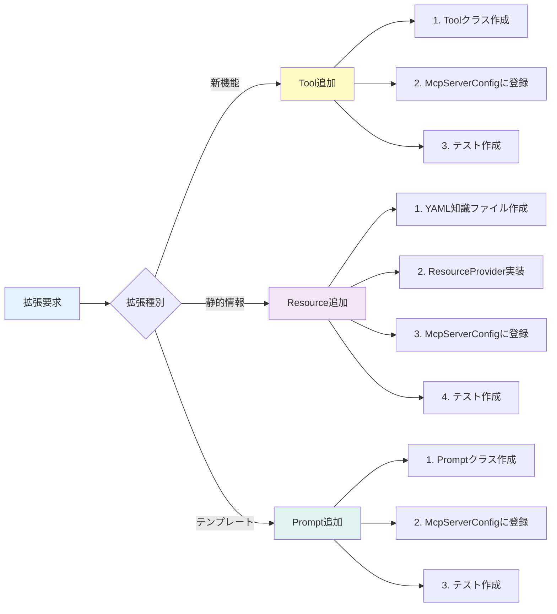
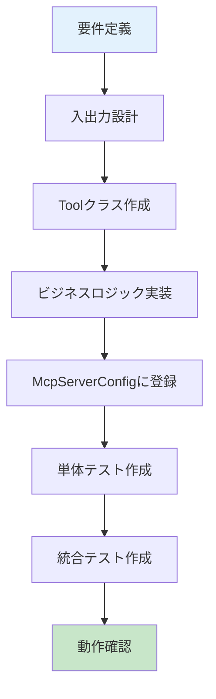
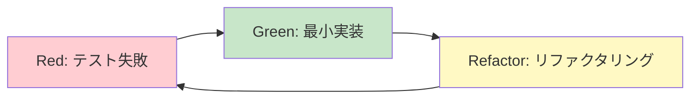

# 拡張ガイド — 新しいTool・Resource・Promptを追加する方法

> **シリーズ**: [Nablarch MCP Server 専門家育成シリーズ](./INDEX.md) 第12回
> **難易度**: 上級
> **所要時間**: 60分
> **前提記事**: [10. Tool設計と実装パターン](./10-tool-design-patterns.md), [11. Resource/Prompt設計と実装パターン](./11-resource-prompt-patterns.md), [09. 設定ファイル完全ガイド](./09-configuration-guide.md)

---

## 目次

1. [この記事で学べること](#この記事で学べること)
2. [前提知識と前提条件](#前提知識と前提条件)
3. [拡張の全体像](#拡張の全体像)
4. [新しいToolを追加する](#新しいtoolを追加する)
5. [新しいResourceを追加する](#新しいresourceを追加する)
6. [新しいPromptを追加する](#新しいpromptを追加する)
7. [YAML知識ファイルの追加・拡充](#yaml知識ファイルの追加拡充)
8. [テスト駆動での拡張（TDDパターン）](#テスト駆動での拡張tddパターン)
9. [まとめ — 次の記事への橋渡し](#まとめ--次の記事への橋渡し)

---

## この記事で学べること

この記事を読み終えると、以下のことができるようになります。

| 学習目標 | 説明 |
|---------|------|
| **Tool拡張** | 新しいMCP Toolを一から実装し、McpServerConfigに登録できる |
| **Resource拡張** | YAML知識ファイルを作成し、ResourceProviderを実装できる |
| **Prompt拡張** | 新しいPromptテンプレートを設計し、実装できる |
| **テスト作成** | MockitoとJUnit 5を使ったユニットテストを書ける |
| **TDD実践** | テストファースト開発で拡張機能を実装できる |

### 対象読者

- Nablarch MCP Serverの既存実装を理解している方
- Spring Boot + Spring AIの基本を理解している方
- 新しいTool/Resource/Promptを追加したい方
- MCPサーバーをカスタマイズしたい方

---

## 前提知識と前提条件

### 前提知識

この記事を読むにあたり、以下の知識が必須です。

| 項目 | 必要レベル | 補足 |
|------|----------|------|
| **Spring Boot** | 実務経験あり | DIコンテナ、アノテーション、Bean登録を理解 |
| **Spring AI** | 基本を理解 | `@Tool`アノテーションの役割を理解 |
| **Java 17** | 実務経験あり | Record、switch式、Text Blocksを使える |
| **JUnit 5 + Mockito** | 基本を理解 | モックの作成と検証ができる |
| **MCP仕様** | 基本を理解 | Tool/Resource/Promptの概念を理解 |

### 前提条件

| 項目 | 説明 |
|------|------|
| **開発環境** | nablarch-mcp-serverが動作する環境 |
| **記事09-11の理解** | Tool/Resource/Promptの設計原則を理解済み |
| **既存コードの把握** | `src/main/java/com/tis/nablarch/mcp/` 配下の構造を把握 |

---

## 拡張の全体像

nablarch-mcp-serverの拡張は、以下の3つの要素を組み合わせて行います。



### 拡張の判断基準

| 拡張種別 | 使い分け | 例 |
|---------|---------|---|
| **Tool** | 動的な処理・外部APIアクセス・計算が必要 | `semantic_search`, `generate_code` |
| **Resource** | 静的な情報・YAML知識ファイルベース | `handler/{app_type}`, `guide/{topic}` |
| **Prompt** | テンプレート化されたガイド・多段階の指示 | `setup-handler-queue`, `review-config` |

---

## 新しいToolを追加する

新しいTool「check_dependency」を例に、Tool追加の全手順を解説します。

### ユースケース

Nablarchプロジェクトの依存関係をチェックし、非推奨ライブラリや脆弱性を検出するToolを追加します。

### 拡張フロー



### Step 1: Toolクラスの作成（@Component）

新しいToolクラス `CheckDependencyTool.java` を作成します。

**ファイルパス**: `src/main/java/com/tis/nablarch/mcp/tools/CheckDependencyTool.java`

```java
package com.tis.nablarch.mcp.tools;

import org.slf4j.Logger;
import org.slf4j.LoggerFactory;
import org.springframework.ai.tool.annotation.Tool;
import org.springframework.ai.tool.annotation.ToolParam;
import org.springframework.stereotype.Service;

import java.util.List;
import java.util.Map;

/**
 * MCPツール: check_dependency。
 *
 * <p>Nablarchプロジェクトの依存関係をチェックし、
 * 非推奨ライブラリや脆弱性を検出する。</p>
 *
 * @see <a href="https://nablarch.github.io/docs/5u21/doc/application_framework/application_framework/libraries/index.html">Nablarch依存ライブラリ</a>
 */
@Service
public class CheckDependencyTool {

    private static final Logger log = LoggerFactory.getLogger(CheckDependencyTool.class);

    /**
     * Nablarchプロジェクトの依存関係をチェックする。
     *
     * @param pomXml pom.xmlの内容（文字列）
     * @param checkType チェック種別（deprecated, vulnerability, compatibility）
     * @return チェック結果のMarkdown形式文字列
     */
    @Tool(description = "Check Nablarch project dependencies for deprecated libraries, "
            + "vulnerabilities, and compatibility issues. Analyzes pom.xml content "
            + "and returns a Markdown-formatted report with recommendations.")
    public String checkDependency(
            @ToolParam(description = "Content of pom.xml file")
            String pomXml,
            @ToolParam(description = "Check type: deprecated, vulnerability, compatibility")
            String checkType) {

        if (pomXml == null || pomXml.isBlank()) {
            return "pom.xmlの内容を指定してください。";
        }

        CheckType type = parseCheckType(checkType);

        try {
            return performCheck(pomXml, type);
        } catch (Exception e) {
            log.error("check_dependency実行中にエラーが発生: {}", e.getMessage(), e);
            return "依存関係チェック中にエラーが発生しました: " + e.getMessage();
        }
    }

    /**
     * 依存関係チェックを実行する。
     *
     * @param pomXml pom.xml内容
     * @param type チェック種別
     * @return Markdown形式のチェック結果
     */
    private String performCheck(String pomXml, CheckType type) {
        // ここに実際のチェックロジックを実装
        // 例: Maven Central API、OWASP Dependency-Check、Nablarch推奨バージョンリスト等

        List<DependencyIssue> issues = switch (type) {
            case DEPRECATED -> findDeprecatedDependencies(pomXml);
            case VULNERABILITY -> findVulnerabilities(pomXml);
            case COMPATIBILITY -> checkCompatibility(pomXml);
        };

        return formatReport(issues, type);
    }

    /**
     * チェック種別を解析する。
     *
     * @param checkType チェック種別文字列
     * @return CheckType
     */
    private CheckType parseCheckType(String checkType) {
        if (checkType == null || checkType.isBlank()) {
            return CheckType.DEPRECATED;
        }
        return switch (checkType.toLowerCase()) {
            case "vulnerability" -> CheckType.VULNERABILITY;
            case "compatibility" -> CheckType.COMPATIBILITY;
            default -> CheckType.DEPRECATED;
        };
    }

    private List<DependencyIssue> findDeprecatedDependencies(String pomXml) {
        // 実装省略: pom.xmlをパースし、非推奨ライブラリを検出
        return List.of();
    }

    private List<DependencyIssue> findVulnerabilities(String pomXml) {
        // 実装省略: OWASP Dependency-Check等と連携
        return List.of();
    }

    private List<DependencyIssue> checkCompatibility(String pomXml) {
        // 実装省略: Nablarchバージョンとの互換性をチェック
        return List.of();
    }

    private String formatReport(List<DependencyIssue> issues, CheckType type) {
        if (issues.isEmpty()) {
            return "## 依存関係チェック結果\n\n問題は検出されませんでした。";
        }

        StringBuilder sb = new StringBuilder();
        sb.append("## 依存関係チェック結果: ").append(type.name()).append("\n\n");
        sb.append("検出された問題: ").append(issues.size()).append("件\n\n");

        for (int i = 0; i < issues.size(); i++) {
            DependencyIssue issue = issues.get(i);
            sb.append("### 問題 ").append(i + 1).append("\n");
            sb.append("- **ライブラリ**: `").append(issue.groupId())
              .append(":").append(issue.artifactId()).append("`\n");
            sb.append("- **現在のバージョン**: ").append(issue.currentVersion()).append("\n");
            sb.append("- **推奨バージョン**: ").append(issue.recommendedVersion()).append("\n");
            sb.append("- **詳細**: ").append(issue.description()).append("\n\n");
        }

        return sb.toString();
    }

    /**
     * チェック種別。
     */
    private enum CheckType {
        DEPRECATED,
        VULNERABILITY,
        COMPATIBILITY
    }

    /**
     * 依存関係の問題を表すレコード。
     */
    private record DependencyIssue(
            String groupId,
            String artifactId,
            String currentVersion,
            String recommendedVersion,
            String description) {
    }
}
```

### Step 2: 入力スキーマの定義（JSON Schema）

`@ToolParam` アノテーションで引数のスキーマを定義します。Spring AIが自動的にJSON Schemaを生成します。

**ポイント**:
- `description` は明確に書く（Claude等のLLMがこれを読んで引数を決める）
- 必須パラメータは `@ToolParam` に明示的に記載

### Step 3: ビジネスロジックの実装

実際のチェック処理を実装します。

**実装のポイント**:
- エラーハンドリングを適切に行う（try-catchでログ記録）
- 外部APIアクセスがある場合は、タイムアウト設定を行う
- 結果はMarkdown形式で返す（Claude等が読みやすい形式）

### Step 4: McpServerConfigへの登録

`McpServerConfig.java` に新しいToolを登録します。

**ファイルパス**: `src/main/java/com/tis/nablarch/mcp/config/McpServerConfig.java`

```java
@Configuration
public class McpServerConfig {

    /**
     * MCPツールをSpring AIツールコールバックとして登録する。
     */
    @Bean
    public ToolCallbackProvider nablarchTools(
            SearchApiTool searchApiTool,
            ValidateHandlerQueueTool validateHandlerQueueTool,
            SemanticSearchTool semanticSearchTool,
            CodeGenerationTool codeGenerationTool,
            DesignHandlerQueueTool designHandlerQueueTool,
            RecommendPatternTool recommendPatternTool,
            OptimizeHandlerQueueTool optimizeHandlerQueueTool,
            TroubleshootTool troubleshootTool,
            CheckDependencyTool checkDependencyTool) {  // ← 追加
        return MethodToolCallbackProvider.builder()
                .toolObjects(searchApiTool, validateHandlerQueueTool,
                        semanticSearchTool, codeGenerationTool,
                        designHandlerQueueTool, recommendPatternTool,
                        optimizeHandlerQueueTool, troubleshootTool,
                        checkDependencyTool)  // ← 追加
                .build();
    }
}
```

**やってしまいがちな失敗 ❌**:
- `@Bean` メソッドの引数に追加し忘れる → Spring DIが動作せず `NullPointerException`
- `.toolObjects()` に追加し忘れる → MCPサーバーにToolが登録されない
- インポート文の追加忘れ → コンパイルエラー

### Step 5: テストの作成

ユニットテストを作成します。

**ファイルパス**: `src/test/java/com/tis/nablarch/mcp/tools/CheckDependencyToolTest.java`

```java
package com.tis.nablarch.mcp.tools;

import org.junit.jupiter.api.BeforeEach;
import org.junit.jupiter.api.DisplayName;
import org.junit.jupiter.api.Nested;
import org.junit.jupiter.api.Test;

import static org.junit.jupiter.api.Assertions.*;

/**
 * {@link CheckDependencyTool} のユニットテスト。
 */
class CheckDependencyToolTest {

    private CheckDependencyTool tool;

    @BeforeEach
    void setUp() {
        tool = new CheckDependencyTool();
    }

    @Nested
    @DisplayName("正常系")
    class NormalTests {

        @Test
        @DisplayName("正常なpom.xmlをチェックできる")
        void checkValidPomXml() {
            String pomXml = """
                <project>
                  <dependencies>
                    <dependency>
                      <groupId>com.nablarch.framework</groupId>
                      <artifactId>nablarch-core</artifactId>
                      <version>2.0.0</version>
                    </dependency>
                  </dependencies>
                </project>
                """;

            String result = tool.checkDependency(pomXml, "deprecated");

            assertNotNull(result);
            assertTrue(result.contains("依存関係チェック結果"));
        }

        @Test
        @DisplayName("チェック種別がnullの場合はデフォルト（deprecated）で実行される")
        void defaultCheckTypeIsDeprecated() {
            String pomXml = "<project><dependencies></dependencies></project>";

            String result = tool.checkDependency(pomXml, null);

            assertNotNull(result);
            // デフォルトのチェック種別（deprecated）で実行されることを確認
        }
    }

    @Nested
    @DisplayName("異常系")
    class AbnormalTests {

        @Test
        @DisplayName("pom.xmlがnullの場合はエラーメッセージを返す")
        void pomXmlIsNull() {
            String result = tool.checkDependency(null, "deprecated");

            assertEquals("pom.xmlの内容を指定してください。", result);
        }

        @Test
        @DisplayName("pom.xmlが空文字の場合はエラーメッセージを返す")
        void pomXmlIsBlank() {
            String result = tool.checkDependency("   ", "deprecated");

            assertEquals("pom.xmlの内容を指定してください。", result);
        }
    }
}
```

### 完全な実装例のまとめ

| ステップ | ファイル | 内容 |
|---------|---------|------|
| 1 | `CheckDependencyTool.java` | Toolクラス（`@Service` + `@Tool`） |
| 2 | 同上 | `@ToolParam`でスキーマ定義 |
| 3 | 同上 | ビジネスロジック実装 |
| 4 | `McpServerConfig.java` | `@Bean`メソッドに追加 |
| 5 | `CheckDependencyToolTest.java` | ユニットテスト |

---

## 新しいResourceを追加する

新しいResource「version/{module}」を例に、Resource追加の全手順を解説します。

### ユースケース

Nablarchモジュールのバージョン情報・リリースノート・推奨バージョンを提供するResourceを追加します。

### Step 1: YAML知識ファイルの作成

まず、知識ファイルを作成します。

**ファイルパス**: `src/main/resources/knowledge/version-catalog.yaml`

```yaml
versions:
  - module: nablarch-core
    current_version: "2.0.0"
    latest_version: "2.1.0"
    release_date: "2024-10-01"
    recommended: "2.1.0"
    description: "Nablarchフレームワークのコアモジュール。基盤機能を提供する。"
    breaking_changes:
      - version: "2.0.0"
        description: "Java 17必須化。Java 8サポート終了。"
      - version: "1.5.0"
        description: "非推奨APIの削除。"
    release_notes_url: "https://github.com/nablarch/nablarch-core/releases/tag/2.1.0"

  - module: nablarch-fw-web
    current_version: "2.0.0"
    latest_version: "2.0.1"
    release_date: "2024-11-15"
    recommended: "2.0.1"
    description: "Nablarch Webアプリケーションフレームワークモジュール。"
    breaking_changes: []
    release_notes_url: "https://github.com/nablarch/nablarch-fw-web/releases/tag/2.0.1"

  - module: nablarch-fw-jaxrs
    current_version: "2.0.0"
    latest_version: "2.0.0"
    release_date: "2024-09-01"
    recommended: "2.0.0"
    description: "Nablarch RESTフレームワークモジュール（JAX-RSベース）。"
    breaking_changes:
      - version: "2.0.0"
        description: "Jakarta EE 9対応。javax.* → jakarta.*"
    release_notes_url: "https://github.com/nablarch/nablarch-fw-jaxrs/releases/tag/2.0.0"
```

### Step 2: ResourceProviderクラスの作成

YAMLを読み込み、Markdownを生成するクラスを作成します。

**ファイルパス**: `src/main/java/com/tis/nablarch/mcp/resources/VersionResourceProvider.java`

```java
package com.tis.nablarch.mcp.resources;

import com.fasterxml.jackson.core.type.TypeReference;
import com.fasterxml.jackson.databind.ObjectMapper;
import com.fasterxml.jackson.dataformat.yaml.YAMLFactory;
import jakarta.annotation.PostConstruct;
import org.springframework.stereotype.Component;

import java.io.IOException;
import java.io.InputStream;
import java.util.List;
import java.util.Map;

/**
 * version/{module} リソースプロバイダ。
 *
 * <p>Nablarchモジュールのバージョン情報をYAMLファイルから読み込み、
 * Markdown形式で提供する。</p>
 */
@Component
public class VersionResourceProvider {

    private List<Map<String, Object>> versions;

    /**
     * version-catalog.yaml を読み込み初期化する。
     *
     * @throws IOException YAMLファイルの読み込みに失敗した場合
     */
    @PostConstruct
    @SuppressWarnings("unchecked")
    public void init() throws IOException {
        ObjectMapper mapper = new ObjectMapper(new YAMLFactory());
        TypeReference<Map<String, Object>> mapType = new TypeReference<>() {};

        try (InputStream is = getClass().getClassLoader()
                .getResourceAsStream("knowledge/version-catalog.yaml")) {
            Map<String, Object> data = mapper.readValue(is, mapType);
            versions = (List<Map<String, Object>>) data.get("versions");
        }
    }

    /**
     * 指定されたモジュールのバージョン情報をMarkdown形式で返す。
     *
     * @param module モジュール名（nablarch-core, nablarch-fw-web等）
     * @return Markdown形式のバージョン情報
     */
    @SuppressWarnings("unchecked")
    public String getVersionMarkdown(String module) {
        if (module == null || module.isBlank()) {
            return "# エラー\n\nモジュール名を指定してください。";
        }

        // モジュールを検索
        Map<String, Object> versionData = versions.stream()
                .filter(v -> module.equals(v.get("module")))
                .findFirst()
                .orElse(null);

        if (versionData == null) {
            return "# 不明なモジュール\n\nモジュール \"" + module + "\" は見つかりませんでした。\n\n"
                    + "利用可能なモジュール: " + getAvailableModules();
        }

        StringBuilder sb = new StringBuilder();
        sb.append("# ").append(versionData.get("module")).append(" バージョン情報\n\n");
        sb.append(versionData.get("description")).append("\n\n");
        sb.append("## 現在のバージョン情報\n\n");
        sb.append("| 項目 | 値 |\n");
        sb.append("|------|----|\n");
        sb.append("| **現在のバージョン** | ").append(versionData.get("current_version")).append(" |\n");
        sb.append("| **最新バージョン** | ").append(versionData.get("latest_version")).append(" |\n");
        sb.append("| **推奨バージョン** | ").append(versionData.get("recommended")).append(" |\n");
        sb.append("| **リリース日** | ").append(versionData.get("release_date")).append(" |\n");
        sb.append("| **リリースノート** | [GitHub Releases](").append(versionData.get("release_notes_url")).append(") |\n\n");

        List<Map<String, Object>> breakingChanges =
                (List<Map<String, Object>>) versionData.get("breaking_changes");
        if (breakingChanges != null && !breakingChanges.isEmpty()) {
            sb.append("## 破壊的変更\n\n");
            for (Map<String, Object> change : breakingChanges) {
                sb.append("### バージョン ").append(change.get("version")).append("\n\n");
                sb.append(change.get("description")).append("\n\n");
            }
        }

        sb.append("\n---\n*Source: version-catalog.yaml*\n");
        return sb.toString();
    }

    /**
     * 利用可能なモジュール一覧を取得する。
     *
     * @return カンマ区切りのモジュール名
     */
    private String getAvailableModules() {
        return versions.stream()
                .map(v -> (String) v.get("module"))
                .reduce((a, b) -> a + ", " + b)
                .orElse("なし");
    }
}
```

### Step 3: URI設計とMcpServerConfigへの登録

`McpServerConfig.java` にResourceを登録します。

```java
@Configuration
public class McpServerConfig {

    /**
     * Nablarchのバージョン情報リソースを登録する。
     *
     * @param versionProvider バージョンリソースプロバイダ
     * @return MCPサーバ自動構成用のリソース仕様リスト
     */
    @Bean
    public List<McpServerFeatures.SyncResourceSpecification> versionResources(
            VersionResourceProvider versionProvider) {
        return List.of(
            createVersionResourceSpec("nablarch-core", "Nablarch Core Version Info",
                "Version information for nablarch-core module", versionProvider),
            createVersionResourceSpec("nablarch-fw-web", "Nablarch Web Framework Version Info",
                "Version information for nablarch-fw-web module", versionProvider),
            createVersionResourceSpec("nablarch-fw-jaxrs", "Nablarch JAX-RS Framework Version Info",
                "Version information for nablarch-fw-jaxrs module", versionProvider)
        );
    }

    private static McpServerFeatures.SyncResourceSpecification createVersionResourceSpec(
            String module, String name, String description,
            VersionResourceProvider provider) {
        String uri = "nablarch://version/" + module;
        return new McpServerFeatures.SyncResourceSpecification(
            new McpSchema.Resource(uri, name, description, "text/markdown", null),
            (exchange, request) -> new McpSchema.ReadResourceResult(
                List.of(new McpSchema.TextResourceContents(
                    request.uri(), "text/markdown",
                    provider.getVersionMarkdown(module))))
        );
    }
}
```

**やってしまいがちな失敗 ❌**:
- URIスキームを統一しない → `nablarch://version/{module}` と `version/{module}` が混在
- `@Bean` メソッドの命名が不適切 → Spring BootがBean名を誤認識
- YAMLファイルを `src/main/resources/knowledge/` 配下に置き忘れる → ランタイムで `FileNotFoundException`

### Step 4: テストの作成

```java
package com.tis.nablarch.mcp.resources;

import org.junit.jupiter.api.BeforeEach;
import org.junit.jupiter.api.DisplayName;
import org.junit.jupiter.api.Test;

import static org.junit.jupiter.api.Assertions.*;

/**
 * {@link VersionResourceProvider} のユニットテスト。
 */
class VersionResourceProviderTest {

    private VersionResourceProvider provider;

    @BeforeEach
    void setUp() throws Exception {
        provider = new VersionResourceProvider();
        provider.init();
    }

    @Test
    @DisplayName("nablarch-coreのバージョン情報を取得できる")
    void getNablarchCoreVersion() {
        String result = provider.getVersionMarkdown("nablarch-core");

        assertNotNull(result);
        assertTrue(result.contains("# nablarch-core バージョン情報"));
        assertTrue(result.contains("現在のバージョン"));
        assertTrue(result.contains("最新バージョン"));
    }

    @Test
    @DisplayName("存在しないモジュールを指定した場合はエラーメッセージを返す")
    void getUnknownModuleVersion() {
        String result = provider.getVersionMarkdown("unknown-module");

        assertTrue(result.contains("不明なモジュール"));
        assertTrue(result.contains("利用可能なモジュール"));
    }

    @Test
    @DisplayName("モジュール名がnullの場合はエラーメッセージを返す")
    void getVersionWithNullModule() {
        String result = provider.getVersionMarkdown(null);

        assertTrue(result.contains("エラー"));
        assertTrue(result.contains("モジュール名を指定してください"));
    }
}
```

---

## 新しいPromptを追加する

新しいPrompt「explain-design-pattern」を例に、Prompt追加の全手順を解説します。

### ユースケース

Nablarchの設計パターン（Form-Action-Entity等）を初心者向けに解説するPromptを追加します。

### Step 1: Promptクラスの作成

**ファイルパス**: `src/main/java/com/tis/nablarch/mcp/prompts/ExplainDesignPatternPrompt.java`

```java
package com.tis.nablarch.mcp.prompts;

import com.fasterxml.jackson.databind.ObjectMapper;
import com.fasterxml.jackson.dataformat.yaml.YAMLFactory;
import io.modelcontextprotocol.spec.McpSchema;
import jakarta.annotation.PostConstruct;
import org.springframework.stereotype.Component;

import java.io.IOException;
import java.io.InputStream;
import java.util.List;
import java.util.Map;

/**
 * explain-design-pattern Promptの実装。
 *
 * <p>指定されたNablarch設計パターンについて、
 * 初心者向けに詳細な解説を生成する。</p>
 */
@Component
public class ExplainDesignPatternPrompt {

    private static final ObjectMapper YAML = new ObjectMapper(new YAMLFactory());
    private static final List<String> VALID_PATTERNS = List.of(
            "form-action-entity", "repository", "service", "handler-queue", "interceptor");

    private Map<String, Object> patternCatalog;

    /**
     * design-patterns.yaml を読み込んで初期化する。
     *
     * @throws IOException YAMLファイルの読み込みに失敗した場合
     */
    @PostConstruct
    @SuppressWarnings("unchecked")
    void init() throws IOException {
        try (InputStream is = getClass().getResourceAsStream("/knowledge/design-patterns.yaml")) {
            patternCatalog = YAML.readValue(is, Map.class);
        }
    }

    /**
     * Promptを実行して設計パターンの解説を生成する。
     *
     * @param arguments MCP Promptの引数マップ（pattern_name必須）
     * @return 設計パターンの解説を含むPrompt結果
     * @throws IllegalArgumentException pattern_nameが未指定または不正な場合
     */
    @SuppressWarnings("unchecked")
    public McpSchema.GetPromptResult execute(Map<String, String> arguments) {
        String patternName = arguments != null ? arguments.get("pattern_name") : null;
        if (patternName == null || patternName.isBlank()) {
            throw new IllegalArgumentException("pattern_name は必須です。指定可能な値: " + VALID_PATTERNS);
        }
        if (!VALID_PATTERNS.contains(patternName)) {
            throw new IllegalArgumentException("不正な pattern_name: " + patternName + "。指定可能な値: " + VALID_PATTERNS);
        }

        var sb = new StringBuilder();
        sb.append("# Nablarch設計パターン解説: ").append(patternName).append("\n\n");

        // パターン情報を展開
        List<Map<String, Object>> patterns = (List<Map<String, Object>>) patternCatalog.get("patterns");
        Map<String, Object> patternData = patterns.stream()
                .filter(p -> patternName.equals(p.get("name")))
                .findFirst()
                .orElse(null);

        if (patternData != null) {
            sb.append("## 概要\n\n").append(patternData.get("description")).append("\n\n");
            sb.append("## 適用場面\n\n").append(patternData.get("use_case")).append("\n\n");

            sb.append("## 実装例\n\n");
            sb.append("```java\n").append(patternData.get("example_code")).append("\n```\n\n");

            sb.append("## メリット\n\n");
            List<String> benefits = (List<String>) patternData.get("benefits");
            for (String benefit : benefits) {
                sb.append("- ").append(benefit).append("\n");
            }
            sb.append("\n");

            sb.append("## 注意点\n\n");
            List<String> caveats = (List<String>) patternData.get("caveats");
            for (String caveat : caveats) {
                sb.append("- ").append(caveat).append("\n");
            }
            sb.append("\n");
        }

        return new McpSchema.GetPromptResult(
            "Nablarch設計パターン解説: " + patternName,
            List.of(new McpSchema.PromptMessage(
                McpSchema.Role.USER,
                new McpSchema.TextContent(sb.toString())
            ))
        );
    }
}
```

### Step 2: テンプレートの定義

Promptの構造を設計します。

| 要素 | 内容 |
|------|------|
| **概要** | パターンの目的・背景 |
| **適用場面** | どんな時に使うか |
| **実装例** | コピペで試せるコード |
| **メリット** | このパターンの利点 |
| **注意点** | やってはいけないこと |

### Step 3: McpServerConfigへの登録

```java
@Configuration
public class McpServerConfig {

    /**
     * Nablarch開発支援用のMCP Promptを登録する。
     *
     * @param explainDesignPatternPrompt 設計パターン解説Prompt
     * @return MCP Server自動構成用のPrompt仕様リスト
     */
    @Bean
    public List<McpServerFeatures.SyncPromptSpecification> nablarchPrompts(
            SetupHandlerQueuePrompt setupHandlerQueuePrompt,
            CreateActionPrompt createActionPrompt,
            ReviewConfigPrompt reviewConfigPrompt,
            ExplainHandlerPrompt explainHandlerPrompt,
            MigrationGuidePrompt migrationGuidePrompt,
            BestPracticesPrompt bestPracticesPrompt,
            ExplainDesignPatternPrompt explainDesignPatternPrompt) {  // ← 追加
        return List.of(
            promptSpec("setup-handler-queue",
                "Set up a Nablarch handler queue configuration",
                List.of(arg("app_type", "Application type: web, rest, batch, messaging", true)),
                setupHandlerQueuePrompt::execute),
            // ... 既存のPrompt ...
            promptSpec("explain-design-pattern",
                "Get a detailed explanation of a Nablarch design pattern",
                List.of(arg("pattern_name", "Pattern name: form-action-entity, repository, service, handler-queue, interceptor", true)),
                explainDesignPatternPrompt::execute)  // ← 追加
        );
    }
}
```

### Step 4: テストの作成

```java
package com.tis.nablarch.mcp.prompts;

import io.modelcontextprotocol.spec.McpSchema;
import org.junit.jupiter.api.BeforeEach;
import org.junit.jupiter.api.DisplayName;
import org.junit.jupiter.api.Test;

import java.util.Map;

import static org.junit.jupiter.api.Assertions.*;

/**
 * {@link ExplainDesignPatternPrompt} のユニットテスト。
 */
class ExplainDesignPatternPromptTest {

    private ExplainDesignPatternPrompt prompt;

    @BeforeEach
    void setUp() throws Exception {
        prompt = new ExplainDesignPatternPrompt();
        prompt.init();
    }

    @Test
    @DisplayName("form-action-entityパターンの解説を生成できる")
    void explainFormActionEntity() {
        McpSchema.GetPromptResult result = prompt.execute(
                Map.of("pattern_name", "form-action-entity"));

        assertNotNull(result);
        assertEquals("Nablarch設計パターン解説: form-action-entity", result.description());
        assertEquals(1, result.messages().size());

        McpSchema.TextContent content = (McpSchema.TextContent) result.messages().get(0).content();
        String text = content.text();
        assertTrue(text.contains("# Nablarch設計パターン解説: form-action-entity"));
        assertTrue(text.contains("## 概要"));
        assertTrue(text.contains("## 適用場面"));
    }

    @Test
    @DisplayName("pattern_nameが未指定の場合はIllegalArgumentExceptionをスローする")
    void throwExceptionWhenPatternNameIsNull() {
        assertThrows(IllegalArgumentException.class, () -> {
            prompt.execute(Map.of());
        });
    }

    @Test
    @DisplayName("不正なpattern_nameの場合はIllegalArgumentExceptionをスローする")
    void throwExceptionWhenPatternNameIsInvalid() {
        assertThrows(IllegalArgumentException.class, () -> {
            prompt.execute(Map.of("pattern_name", "invalid-pattern"));
        });
    }
}
```

---

## YAML知識ファイルの追加・拡充

### 既存YAMLの拡張パターン

既存の `handler-catalog.yaml` に新しいハンドラを追加する例。

**ファイルパス**: `src/main/resources/knowledge/handler-catalog.yaml`

```yaml
web:
  description: "Nablarch Webアプリケーション用ハンドラキュー"
  handlers:
    # ... 既存のハンドラ ...
    - name: "CustomSecurityHandler"  # ← 追加
      fqcn: "com.example.app.handler.CustomSecurityHandler"
      order: 4
      required: false
      thread: "main"
      description: "カスタムセキュリティチェックを行うハンドラ"
      constraints:
        must_before: ["HttpResponseHandler"]
        must_after: ["HttpRequestJavaPackageMapping"]
```

**拡張時のチェックリスト**:
- [ ] 既存の構造（インデント、キー名）に従っているか
- [ ] `order` が既存ハンドラと重複していないか
- [ ] `fqcn` が正しいFully Qualified Class Nameか
- [ ] `constraints` の前後関係が論理的に正しいか

### 新規YAMLカテゴリの追加

新しいカテゴリ `antipatterns.yaml` を追加する例。

**ファイルパス**: `src/main/resources/knowledge/antipatterns.yaml`

```yaml
antipatterns:
  - name: "StaticFieldInAction"
    category: "architecture"
    severity: "high"
    description: "Actionクラスにstaticフィールドを持つアンチパターン"
    why_bad: "Actionクラスはリクエストスコープで管理されるべきだが、staticフィールドはアプリケーションスコープとなり、スレッドセーフでなくなる。"
    bad_example: |
      @InjectForm(form = UserForm.class)
      public class UserAction {
          private static UserRepository repo;  // NG!

          public HttpResponse register(HttpRequest req) {
              repo.save(...);  // スレッドセーフでない
              return new HttpResponse(200);
          }
      }
    good_example: |
      @InjectForm(form = UserForm.class)
      public class UserAction {
          private final UserRepository repo;  // OK: インスタンスフィールド

          @Inject
          public UserAction(UserRepository repo) {
              this.repo = repo;
          }

          public HttpResponse register(HttpRequest req) {
              repo.save(...);
              return new HttpResponse(200);
          }
      }
    references:
      - "https://nablarch.github.io/docs/LATEST/doc/application_framework/application_framework/web/action.html"

  - name: "DirectDBAccessInAction"
    category: "layering"
    severity: "medium"
    description: "ActionクラスでSQLを直接実行するアンチパターン"
    why_bad: "レイヤリングが崩れ、テストが困難になる。ビジネスロジックの再利用もできない。"
    bad_example: |
      public class UserAction {
          public HttpResponse search(HttpRequest req) {
              SqlPStatement stmt = DbConnectionContext.getConnection()
                  .prepareStatement("SELECT * FROM USER WHERE name = ?");
              stmt.setString(1, req.getParam("name"));
              SqlResultSet rs = stmt.retrieve();  // NG: Action内でSQL実行
              return new HttpResponse(200);
          }
      }
    good_example: |
      public class UserAction {
          private final UserService userService;

          @Inject
          public UserAction(UserService userService) {
              this.userService = userService;
          }

          public HttpResponse search(HttpRequest req) {
              List<User> users = userService.findByName(req.getParam("name"));  // OK: Serviceに委譲
              return new HttpResponse(200);
          }
      }
    references:
      - "https://fintan.jp/page/123/"
```

**新規YAML追加のチェックリスト**:
- [ ] ファイル名は `{category}-{purpose}.yaml` 形式か
- [ ] YAMLの構造は一貫性があるか
- [ ] 必須キー（name, description等）が全て含まれているか
- [ ] 既存のYAMLと命名規則が統一されているか

---

## テスト駆動での拡張（TDDパターン）

TDD（Test-Driven Development）でToolを追加する例を示します。

### TDDサイクル



### Step 1: Red — テストを先に書く

```java
package com.tis.nablarch.mcp.tools;

import org.junit.jupiter.api.BeforeEach;
import org.junit.jupiter.api.Test;

import static org.junit.jupiter.api.Assertions.*;

/**
 * {@link ValidateFormTool} のユニットテスト（TDD）。
 */
class ValidateFormToolTest {

    private ValidateFormTool tool;

    @BeforeEach
    void setUp() {
        tool = new ValidateFormTool();
    }

    @Test
    void testValidateFormWithValidInput() {
        String formJson = """
            {
              "name": "山田太郎",
              "email": "yamada@example.com",
              "age": 30
            }
            """;

        String result = tool.validateForm(formJson, "UserForm");

        assertNotNull(result);
        assertTrue(result.contains("バリデーション成功"));
    }

    @Test
    void testValidateFormWithInvalidEmail() {
        String formJson = """
            {
              "name": "山田太郎",
              "email": "invalid-email",
              "age": 30
            }
            """;

        String result = tool.validateForm(formJson, "UserForm");

        assertTrue(result.contains("バリデーションエラー"));
        assertTrue(result.contains("email"));
    }
}
```

**この時点ではコンパイルエラー**（`ValidateFormTool` が存在しない）。

### Step 2: Green — 最小限の実装

テストがパスする最小限のコードを書く。

```java
package com.tis.nablarch.mcp.tools;

import org.springframework.ai.tool.annotation.Tool;
import org.springframework.ai.tool.annotation.ToolParam;
import org.springframework.stereotype.Service;

/**
 * MCPツール: validate_form。
 */
@Service
public class ValidateFormTool {

    @Tool(description = "Validate Nablarch form data against validation rules")
    public String validateForm(
            @ToolParam(description = "Form data in JSON format")
            String formJson,
            @ToolParam(description = "Form class name")
            String formClassName) {

        if (formJson == null || formJson.isBlank()) {
            return "フォームデータを指定してください。";
        }

        // 最小実装: メールアドレスの簡易バリデーション
        if (formJson.contains("\"email\": \"invalid-email\"")) {
            return "## バリデーションエラー\n\nemail: 不正なメールアドレスです。";
        }

        return "## バリデーション成功\n\n全てのフィールドが正常です。";
    }
}
```

**テストが通る** → Green達成！

### Step 3: Refactor — リファクタリング

実装を洗練させる。

```java
@Service
public class ValidateFormTool {

    private static final Pattern EMAIL_PATTERN =
        Pattern.compile("^[A-Za-z0-9+_.-]+@[A-Za-z0-9.-]+$");

    @Tool(description = "Validate Nablarch form data against validation rules")
    public String validateForm(
            @ToolParam(description = "Form data in JSON format")
            String formJson,
            @ToolParam(description = "Form class name")
            String formClassName) {

        if (formJson == null || formJson.isBlank()) {
            return "フォームデータを指定してください。";
        }

        try {
            Map<String, Object> formData = parseJson(formJson);
            List<ValidationError> errors = performValidation(formData, formClassName);

            if (errors.isEmpty()) {
                return "## バリデーション成功\n\n全てのフィールドが正常です。";
            } else {
                return formatValidationErrors(errors);
            }
        } catch (Exception e) {
            return "バリデーション実行中にエラーが発生しました: " + e.getMessage();
        }
    }

    private Map<String, Object> parseJson(String json) {
        // JSON → Mapに変換（Jackson使用）
        return Map.of();  // 実装省略
    }

    private List<ValidationError> performValidation(
            Map<String, Object> formData, String formClassName) {
        List<ValidationError> errors = new java.util.ArrayList<>();

        // メールアドレスのバリデーション
        Object email = formData.get("email");
        if (email != null && !EMAIL_PATTERN.matcher(email.toString()).matches()) {
            errors.add(new ValidationError("email", "不正なメールアドレスです。"));
        }

        return errors;
    }

    private String formatValidationErrors(List<ValidationError> errors) {
        StringBuilder sb = new StringBuilder();
        sb.append("## バリデーションエラー\n\n");
        for (ValidationError error : errors) {
            sb.append("- **").append(error.field()).append("**: ")
              .append(error.message()).append("\n");
        }
        return sb.toString();
    }

    private record ValidationError(String field, String message) {}
}
```

**テストがまだ通る** → Refactor成功！

### TDDの利点

| 利点 | 説明 |
|------|------|
| **仕様の明確化** | テストが仕様書の役割を果たす |
| **リファクタリングの安全性** | テストがあるので自信を持ってリファクタリングできる |
| **バグの早期発見** | 実装前にテストを書くので、仕様の漏れに気づきやすい |

---

## まとめ — 次の記事への橋渡し

この記事では、nablarch-mcp-serverに新しいTool/Resource/Promptを追加する方法を学びました。

### 学んだこと

| 項目 | 内容 |
|------|------|
| **Tool追加** | `@Service` + `@Tool` + McpServerConfigへの登録 |
| **Resource追加** | YAML知識ファイル + ResourceProvider + URI設計 |
| **Prompt追加** | Promptクラス + テンプレート設計 + McpServerConfigへの登録 |
| **テスト** | JUnit 5 + Mockito でユニットテストを書く |
| **TDD** | テストファースト開発で品質を保証 |

### やってしまいがちな失敗の総まとめ

| 失敗パターン | 対処法 |
|------------|--------|
| `@Bean` メソッドの引数に追加し忘れ | Spring DIが動作せず `NullPointerException` → コンパイルエラーを確認 |
| `.toolObjects()` に追加し忘れ | MCPサーバーにToolが登録されない → MCP Inspectorで確認 |
| YAMLファイルの配置ミス | `src/main/resources/knowledge/` 配下に配置されているか確認 |
| URI設計の不統一 | `nablarch://` スキームを全てのResourceで統一 |
| テストの書き忘れ | mvn test で全テストが成功することを確認 |

### 次の記事

次の記事「[第13回: テスト戦略](./13-testing-strategy.md)」では、1,019件のテストが守る品質の仕組みを学びます。

---

**前の記事**: [第11回: Resource/Prompt設計と実装パターン](./11-resource-prompt-patterns.md)
**次の記事**: [第13回: テスト戦略](./13-testing-strategy.md)
**シリーズTOC**: [INDEX.md](./INDEX.md)
