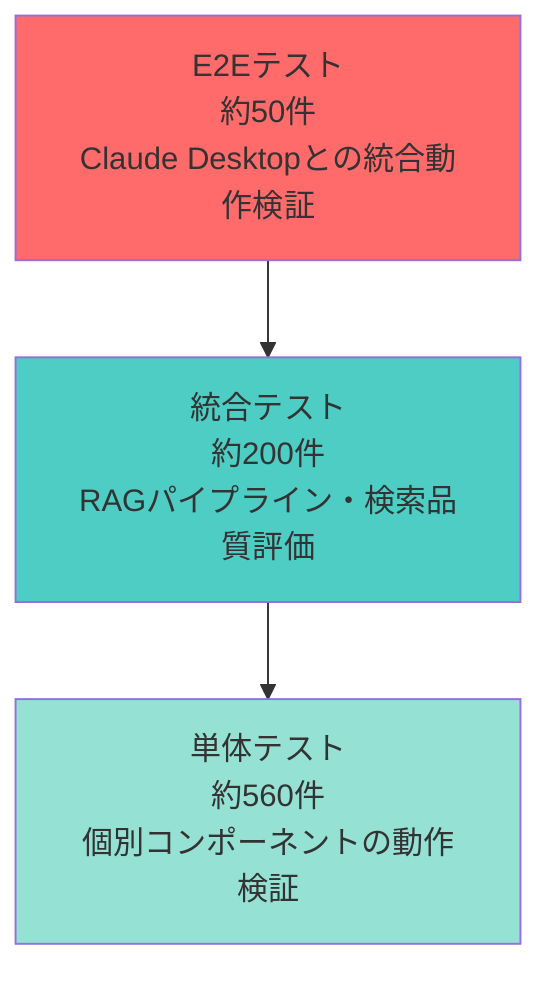
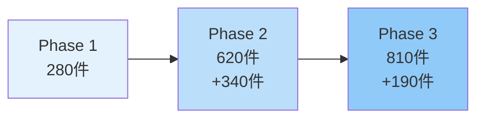
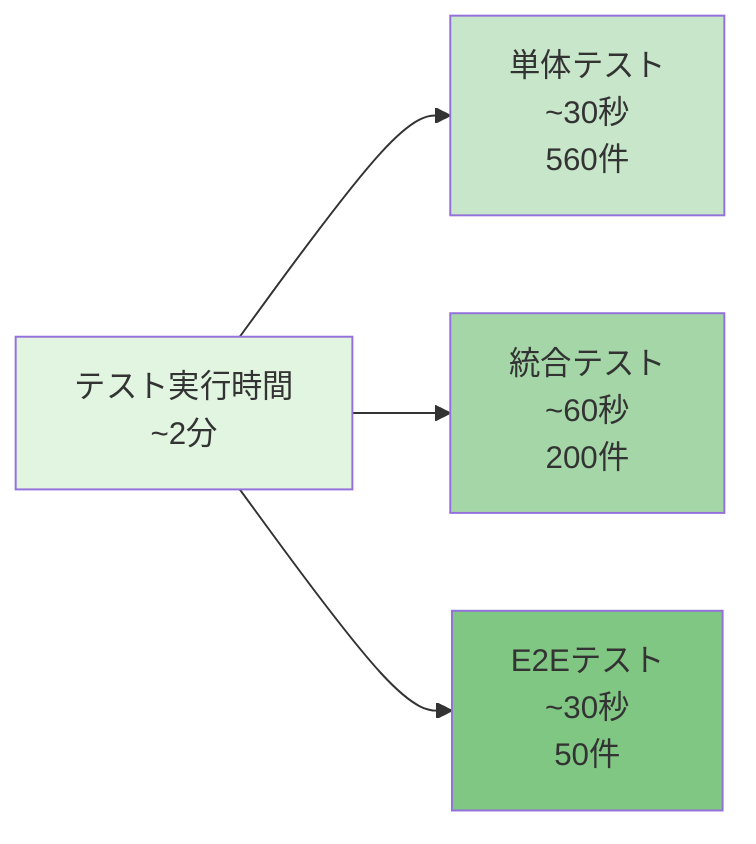

# テスト戦略 — 810件のテストが守る品質の仕組み

> **シリーズ**: Nablarch MCP Server 専門家育成シリーズ 第13回
> **対象者**: 上級者（テスト設計経験者、品質保証担当者）
> **前提知識**: JUnit 5基礎、Spring Boot Test、記事05のアーキテクチャ理解
> **所要時間**: 30分

---

## 目次

1. [この記事で学べること](#1-この記事で学べること)
2. [テスト全体像 — 810件のテストの内訳](#2-テスト全体像--810件のテストの内訳)
3. [テストディレクトリ構成](#3-テストディレクトリ構成)
4. [単体テストパターン](#4-単体テストパターン)
5. [統合テストパターン](#5-統合テストパターン)
6. [Embeddingテストの工夫](#6-embeddingテストの工夫)
7. [検索品質評価テスト](#7-検索品質評価テスト)
8. [テスト実行方法](#8-テスト実行方法)
9. [テストを書くときのベストプラクティス](#9-テストを書くときのベストプラクティス)
10. [まとめ — 次の記事への橋渡し](#10-まとめ--次の記事への橋渡し)

---

## 1. この記事で学べること

本記事では、Nablarch MCP Serverの**810件のテスト**がどのように品質を守っているかを解説します。

### 1.1 学習目標

- テスト戦略の全体像（単体 / 統合 / E2E / 品質評価の4層構造）
- 73テストファイルの分類と役割
- 外部依存（Embedding API、DB）のモック戦略
- 検索品質評価フレームワーク（MRR, Recall@K, NDCG@K）
- テストピラミッドとバランスの取り方

### 1.2 前提知識

以下の知識を前提とします：

- JUnit 5の基本（`@Test`, `@BeforeEach`, `@Nested`, `@ExtendWith`）
- Mockitoの基本（`@Mock`, `when().thenReturn()`, `verify()`）
- Spring Boot Testの基本（`@SpringBootTest`, `@WebMvcTest`）
- 記事05「アーキテクチャ概要」で解説したRAGパイプライン構成

---

## 2. テスト全体像 — 810件のテストの内訳

### 2.1 テストピラミッド

Nablarch MCP Serverのテスト戦略は、**テストピラミッド**に従って設計されています。



| レイヤー | テスト数 | 実行時間 | 目的 |
|---------|---------|---------|------|
| **単体テスト** | 約560件 | 高速（秒単位） | 個別クラス・メソッドの正常系・異常系 |
| **統合テスト** | 約200件 | 中速（10秒単位） | RAGパイプライン・検索品質評価 |
| **E2Eテスト** | 約50件 | 低速（分単位） | MCPプロトコル・Tool/Resource統合 |
| **合計** | **810件** | **~2分** | **805件成功、5件スキップ** |

### 2.2 テスト数の推移



- **Phase 1（MCP基盤）**: 280件（Tool/Resource/Prompt単体テスト）
- **Phase 2（RAG統合）**: +340件（検索・Embedding・Ingestion・品質評価）
- **Phase 3（Tool拡充）**: +190件（10 Tools E2Eテスト、コード生成テスト）

### 2.3 テスト成功率

最終テスト実行結果（2026-02-04）：

```
Tests run: 810, Failures: 0, Errors: 0, Skipped: 5
Success rate: 99.38%
```

**スキップ5件の内訳**：
- OnnxEmbeddingClientTest: 4件（ONNXモデルファイル未配置のため条件付きスキップ）
- SearchQualityEvaluationTest: 1件（評価データセット50件の準備未完了）

---

## 3. テストディレクトリ構成

### 3.1 ディレクトリ構成

```
src/test/java/com/tis/nablarch/mcp/
├── NablarchMcpServerApplicationTests.java   ← Spring Boot起動テスト
├── TestConfig.java                          ← テスト共通設定
├── embedding/                               ← Embedding API/ローカルモデル（4件）
│   ├── JinaEmbeddingClientTest.java
│   ├── VoyageEmbeddingClientTest.java
│   ├── local/
│   │   ├── BgeM3OnnxEmbeddingClientTest.java
│   │   └── CodeSageOnnxEmbeddingClientTest.java
├── codegen/                                 ← コード生成（3件）
│   ├── DefaultCodeGeneratorTest.java
│   ├── NamingConventionHelperTest.java
│   └── GenerationResultTest.java
├── db/repository/                           ← DB Repository（2件）
│   ├── DocumentChunkRepositoryTest.java
│   └── CodeChunkRepositoryTest.java
├── rag/
│   ├── parser/                              ← パーサー（4件）
│   │   ├── MarkdownDocumentParserTest.java
│   │   ├── JavaSourceParserTest.java
│   │   ├── XmlConfigParserTest.java
│   │   └── HtmlDocumentParserTest.java
│   ├── chunking/                            ← チャンキング（1件）
│   │   └── ChunkingServiceTest.java
│   ├── query/                               ← クエリ分析（3件）
│   │   ├── QueryAnalyzerTest.java
│   │   ├── AnalyzedQueryTest.java
│   │   └── QueryLanguageTest.java
│   ├── search/                              ← 検索エンジン（9件）
│   │   ├── BM25SearchServiceTest.java
│   │   ├── VectorSearchServiceTest.java
│   │   ├── HybridSearchServiceTest.java
│   │   ├── HybridSearchIntegrationTest.java
│   │   ├── SearchFiltersTest.java
│   │   ├── ExtendedSearchFiltersTest.java
│   │   ├── SearchResultTest.java
│   │   ├── MetadataFilteringServiceTest.java
│   │   └── SearchQualityTest.java
│   ├── rerank/                              ← リランキング（2件）
│   │   ├── CrossEncoderRerankerTest.java
│   │   └── RerankingIntegrationTest.java
│   ├── evaluation/                          ← 検索品質評価（4件）
│   │   ├── EvaluationMetricsTest.java
│   │   ├── SearchQualityEvaluationTest.java
│   │   ├── QueryEvaluationDataset.java      ← Helper
│   │   └── EvaluationMetrics.java           ← Helper
│   └── ingestion/                           ← 取込パイプライン（7件）
│       ├── DocumentIngesterTest.java
│       ├── OfficialDocsIngesterTest.java
│       ├── FintanIngesterTest.java
│       ├── FintanIngestionConfigTest.java
│       ├── IngestionResultTest.java
│       ├── IngestionDataFlowTest.java
│       └── IngestionPipelineIntegrationTest.java
├── http/                                    ← HTTP Transport（2件）
│   ├── McpHttpPropertiesTest.java
│   └── StreamableHttpTransportTest.java
├── prompts/                                 ← Prompts（6件）
│   ├── SetupHandlerQueuePromptTest.java
│   ├── CreateActionPromptTest.java
│   ├── BestPracticesPromptTest.java
│   ├── ExplainHandlerPromptTest.java
│   ├── MigrationGuidePromptTest.java
│   └── ReviewConfigPromptTest.java
├── resources/                               ← Resources（10件）
│   ├── HandlerResourceProviderTest.java
│   ├── HandlerResourceTest.java
│   ├── ApiResourceProviderTest.java
│   ├── ApiSpecResourceTest.java
│   ├── PatternResourceProviderTest.java
│   ├── AntipatternResourceProviderTest.java
│   ├── GuideResourceProviderTest.java
│   ├── ExampleResourceProviderTest.java
│   ├── ConfigResourceProviderTest.java
│   └── VersionResourceProviderTest.java
└── tools/                                   ← Tools（13件）
    ├── SemanticSearchToolTest.java
    ├── SemanticSearchIntegrationTest.java
    ├── SemanticSearchMcpRegistrationTest.java
    ├── SemanticSearchOutputFormatTest.java
    ├── SearchApiToolTest.java
    ├── CodeGenerationToolTest.java
    ├── TestGenerationToolTest.java
    ├── DesignHandlerQueueToolTest.java
    ├── ValidateHandlerQueueToolTest.java
    ├── OptimizeHandlerQueueToolTest.java
    ├── RecommendPatternToolTest.java
    ├── MigrationAnalysisToolTest.java
    └── TroubleshootToolTest.java
```

### 3.2 テストファイル分類表

| カテゴリ | ファイル数 | テスト数概算 | 主な検証内容 |
|---------|-----------|-------------|-------------|
| **Application/Config** | 2 | 10 | Spring Boot起動、テスト設定 |
| **Embedding** | 4 | 80 | Jina/Voyage API、ONNX推論 |
| **Code Generation** | 3 | 60 | Actionクラス生成、命名規則 |
| **DB Repository** | 2 | 40 | JPA操作、ベクトル検索クエリ |
| **Parser** | 4 | 80 | Markdown/Java/XML/HTML解析 |
| **Chunking** | 1 | 20 | セマンティックチャンキング |
| **Query** | 3 | 30 | クエリ分析、言語判定 |
| **Search** | 9 | 120 | BM25/Vector/Hybrid検索 |
| **Reranking** | 2 | 30 | Cross-Encoderリランキング |
| **Evaluation** | 2 + 2 | 50 | MRR/Recall/NDCG計算 |
| **Ingestion** | 7 | 90 | ドキュメント取込パイプライン |
| **HTTP** | 2 | 20 | Streamable HTTP Transport |
| **Prompts** | 6 | 60 | 6種類のPromptテンプレート |
| **Resources** | 10 | 100 | 8 URIパターンのResource |
| **Tools** | 13 | 200 | 10 Tools + 統合テスト |
| **合計** | **69 + 2** | **~810** | |

---

## 4. 単体テストパターン

### 4.1 Tool単体テスト（Mockを使ったテスト）

`SemanticSearchToolTest`（302行）の例：

```java
@ExtendWith(MockitoExtension.class)
class SemanticSearchToolTest {

    @Mock
    private HybridSearchService hybridSearchService;

    @Mock
    private Reranker reranker;

    private SemanticSearchTool tool;

    @BeforeEach
    void setUp() {
        tool = new SemanticSearchTool(hybridSearchService, reranker);
    }

    @Test
    @DisplayName("正常検索: HybridSearch → Rerank → Markdown出力")
    void normalSearchPipeline() {
        List<SearchResult> candidates = createResults(10);
        List<SearchResult> reranked = createResults(3);

        when(hybridSearchService.search(eq("ハンドラキュー"), any(), eq(50), eq(SearchMode.HYBRID)))
                .thenReturn(candidates);
        when(reranker.rerank(eq("ハンドラキュー"), eq(candidates), eq(5)))
                .thenReturn(reranked);

        String result = tool.semanticSearch(
                "ハンドラキュー", null, null, null, null, null, null);

        assertNotNull(result);
        assertTrue(result.contains("## 検索結果: \"ハンドラキュー\""));
        assertTrue(result.contains("モード: hybrid"));
        assertTrue(result.contains("結果数: 3件"));
    }
}
```

**ポイント**：
- `@Mock`でHybridSearchServiceとRerankerをモック化
- `when().thenReturn()`でモックの振る舞いを定義
- 検索パイプライン全体の統合動作を高速に検証

### 4.2 Parser単体テスト（実データを使ったテスト）

`MarkdownDocumentParserTest`の例：

```java
class MarkdownDocumentParserTest {

    private MarkdownDocumentParser parser;

    @BeforeEach
    void setUp() {
        parser = new MarkdownDocumentParser();
    }

    @Test
    void parse_正常系_見出し分割() throws IOException {
        String md = loadTestData("testdata/sample.md");
        List<ParsedDocument> results = parser.parse(md, "https://fintan.jp/nablarch-validation");

        assertTrue(results.size() >= 4, "少なくとも4セクション以上: " + results.size());
    }

    @Test
    void parse_正常系_コードフェンス内の見出しは無視() {
        String md = "## セクション1\n\nテキスト\n\n```\n## これは見出しではない\n```\n\n## セクション2\n\n別テキスト";
        List<ParsedDocument> results = parser.parse(md, "https://example.com/test");

        assertEquals(2, results.size(), "コードフェンス内の ## は見出しとして扱わない");
    }
}
```

**ポイント**：
- モックを使わず、実際のMarkdownパース処理を検証
- エッジケース（コードフェンス内の見出し）もテスト
- テストデータファイル（`testdata/sample.md`）を活用

### 4.3 ResourceProvider単体テスト

`HandlerResourceProviderTest`の例：

```java
@ExtendWith(MockitoExtension.class)
class HandlerResourceProviderTest {

    @Mock
    private NablarchKnowledgeBase knowledgeBase;

    private HandlerResourceProvider provider;

    @Test
    @DisplayName("ハンドラキューリソースを正しく生成する")
    void provideHandlerQueueResource() {
        when(knowledgeBase.getHandlerQueue("web"))
                .thenReturn(createHandlerQueueData("web"));

        String content = provider.provideHandlerResource("web");

        assertNotNull(content);
        assertTrue(content.contains("# Webアプリケーションのハンドラキュー構成"));
        assertTrue(content.contains("HttpAccessLogHandler"));
        verify(knowledgeBase).getHandlerQueue("web");
    }
}
```

**ポイント**：
- KnowledgeBaseをモック化し、Resourceの生成ロジックのみをテスト
- 生成されたMarkdownコンテンツの内容を検証

---

## 5. 統合テストパターン

### 5.1 ハイブリッド検索統合テスト

`HybridSearchIntegrationTest`（305行）の例：

```java
@ExtendWith(MockitoExtension.class)
class HybridSearchIntegrationTest {

    @Mock
    private BM25SearchService bm25SearchService;

    @Mock
    private VectorSearchService vectorSearchService;

    private HybridSearchService service;

    @Test
    @DisplayName("BM25 5件 + Vector 5件（重複2件）→ RRF統合: 重複結果が非重複より高スコア")
    void rrfMergeWithOverlap_overlappingResultsRankedHigher() {
        // BM25結果5件（doc-A, doc-B が重複候補）
        List<SearchResult> bm25Results = List.of(
                createSearchResult("doc-A", "ハンドラキューの設定方法について説明する。", 0.92, ...),
                createSearchResult("doc-B", "REST APIのバリデーション設定。", 0.85, ...),
                // ... 省略
        );

        // Vector結果5件（doc-A, doc-B が重複、doc-F, doc-G, doc-H は新規）
        List<SearchResult> vectorResults = List.of(
                createSearchResult("doc-B", "REST APIのバリデーション設定。", 0.95, ...),
                createSearchResult("doc-A", "ハンドラキューの設定方法について説明する。", 0.88, ...),
                // ... 省略
        );

        when(bm25SearchService.search(anyString(), any(), eq(HybridSearchService.CANDIDATE_K)))
                .thenReturn(bm25Results);
        when(vectorSearchService.search(anyString(), any(), eq(HybridSearchService.CANDIDATE_K)))
                .thenReturn(vectorResults);

        List<SearchResult> results = service.search(
                "ハンドラキューの設定", SearchFilters.NONE, 8, SearchMode.HYBRID);

        // 結果は8件（重複2件を統合して8ユニーク）
        assertEquals(8, results.size());

        // 重複結果（doc-A, doc-B）が上位にいることを確認
        String topId1 = results.get(0).id();
        String topId2 = results.get(1).id();
        assertTrue(
                (topId1.equals("doc-A") || topId1.equals("doc-B"))
                        && (topId2.equals("doc-A") || topId2.equals("doc-B")),
                "重複結果(doc-A, doc-B)がトップ2にいるべき");
    }
}
```

**ポイント**：
- BM25とVectorの結果をモック化し、**RRFマージのロジックのみ**をテスト
- 重複結果が上位に来ることを検証（RRFの期待動作）
- 実際のNablarchドメインのクエリで検証

### 5.2 Ingestionパイプライン統合テスト

`IngestionPipelineIntegrationTest`の例：

```java
class IngestionPipelineIntegrationTest {

    @Mock
    private HtmlDocumentParser htmlParser;
    @Mock
    private MarkdownDocumentParser markdownParser;
    @Mock
    private ChunkingService chunkingService;
    @Mock
    private EmbeddingClient embeddingClient;
    @Mock
    private DocumentChunkRepository repository;

    @Test
    @DisplayName("Fintan Ingester: 3記事取得 → パース → チャンキング → Embedding → DB格納")
    void fintanIngesterPipelineFlow() {
        // WebClientでHTTPレスポンスをモック
        when(webClient.get().uri(anyString()).retrieve().bodyToMono(String.class))
                .thenReturn(Mono.just(INDEX_HTML_3PAGES))
                .thenReturn(Mono.just(SAMPLE_MARKDOWN))
                .thenReturn(Mono.just(SAMPLE_MARKDOWN))
                .thenReturn(Mono.just(SAMPLE_MARKDOWN));

        // Parserのモック
        when(markdownParser.parse(anyString(), anyString()))
                .thenReturn(List.of(createParsedDocument("セクション1", "テスト内容")));

        // ChunkingServiceのモック
        when(chunkingService.chunk(any()))
                .thenReturn(List.of(createChunk("chunk-1", "チャンク内容")));

        // EmbeddingClientのモック
        when(embeddingClient.embedBatch(anyList()))
                .thenReturn(List.of(new float[]{0.1f, 0.2f}));

        // Repositoryのモック（save時にIDを付与）
        when(repository.save(any())).thenAnswer(invocation -> {
            DocumentChunk chunk = invocation.getArgument(0);
            chunk.setId(idCounter.getAndIncrement());
            return chunk;
        });

        // 実行
        FintanIngester ingester = new FintanIngester(
                webClient, markdownParser, chunkingService, embeddingClient, repository);
        IngestionResult result = ingester.ingest(config);

        // 検証
        assertEquals(3, result.processedDocuments());
        assertTrue(result.totalChunks() >= 3);
        verify(repository, atLeast(3)).save(any());
    }
}
```

**ポイント**：
- パイプライン全体（Fetch → Parse → Chunk → Embed → Store）を統合テスト
- 外部依存（WebClient、EmbeddingClient、Repository）はモック化
- モック間のデータフローが正しいことを検証

---

## 6. Embeddingテストの工夫

### 6.1 外部API（Jina, Voyage）のモック戦略

`JinaEmbeddingClientTest`の例：

```java
class JinaEmbeddingClientTest {

    private MockWebServer mockServer;
    private JinaEmbeddingClient client;

    @BeforeEach
    void setUp() throws IOException {
        mockServer = new MockWebServer();
        mockServer.start();

        EmbeddingProperties properties = new EmbeddingProperties();
        EmbeddingProperties.ProviderConfig config = new EmbeddingProperties.ProviderConfig();
        config.setApiKey("test-key");
        config.setModel("jina-embeddings-v4");
        config.setBaseUrl(mockServer.url("/v1/embeddings").toString());
        properties.setJina(config);

        client = new JinaEmbeddingClient(properties);
    }

    @Test
    void 単一テキストのEmbeddingを生成できること() throws Exception {
        float[] expectedEmbedding = new float[]{0.1f, 0.2f, 0.3f};
        enqueueSuccessResponse(List.of(expectedEmbedding));

        float[] result = client.embed("Nablarchのハンドラキュー");

        assertNotNull(result);
        assertArrayEquals(expectedEmbedding, result, 0.001f);

        RecordedRequest request = mockServer.takeRequest();
        assertEquals("POST", request.getMethod());
        assertTrue(request.getHeader("Authorization").contains("Bearer test-key"));
    }

    private void enqueueSuccessResponse(List<float[]> embeddings) {
        // JSONレスポンスを構築
        String json = buildJinaApiResponse(embeddings);
        mockServer.enqueue(new MockResponse()
                .setResponseCode(200)
                .setHeader("Content-Type", "application/json")
                .setBody(json));
    }
}
```

**ポイント**：
- **MockWebServer**（OkHttp）を使って実際のHTTPリクエスト/レスポンスをモック
- APIキー、リクエストヘッダー、レスポンス形式を細かく検証
- リトライ・タイムアウト・エラーハンドリングもテスト可能

### 6.2 ONNXローカルモデルのテスト

`BgeM3OnnxEmbeddingClientTest`の例：

```java
class BgeM3OnnxEmbeddingClientTest {

    private BgeM3OnnxEmbeddingClient client;

    @BeforeEach
    void setUp() {
        String modelPath = System.getProperty("bge.m3.model.path");
        assumeTrue(modelPath != null && !modelPath.isEmpty(),
                "BGE-M3モデルパスが設定されていません。このテストをスキップします。");

        client = new BgeM3OnnxEmbeddingClient(modelPath);
    }

    @Test
    void 日本語テキストのEmbeddingを生成できること() {
        float[] embedding = client.embed("Nablarchフレームワークのハンドラキュー設計");

        assertNotNull(embedding);
        assertEquals(1024, embedding.length, "BGE-M3は1024次元");
        assertTrue(Arrays.stream(embedding).anyMatch(v -> v != 0.0f), "非ゼロベクトル");
    }
}
```

**ポイント**：
- **条件付きテスト**（`assumeTrue`）：ONNXモデルファイルが存在する場合のみ実行
- モデルファイル未配置時は自動的にスキップ（CI/CDで失敗しない）
- 実際のONNX推論処理をテスト（外部APIなしで完結）

---

## 7. 検索品質評価テスト

### 7.1 評価メトリクス（MRR, Recall@K, NDCG@K）

`SearchQualityEvaluationTest`（670行）の例：

```java
@ExtendWith(MockitoExtension.class)
class SearchQualityEvaluationTest {

    @Test
    void 理想的なMRR_常に1位正解() {
        List<SearchResult> results = List.of(
                result("1", "handler queue configuration guide", 0.95),
                result("2", "unrelated document", 0.80),
                result("3", "another unrelated", 0.70)
        );
        Set<String> keywords = Set.of("handler", "queue");
        assertEquals(1.0, EvaluationMetrics.calculateMRR(results, keywords));
    }

    @Test
    void Recall10はRecall5以上になる() {
        List<SearchResult> results = new ArrayList<>();
        for (int i = 1; i <= 5; i++) {
            results.add(result(String.valueOf(i), "unrelated " + i, 1.0 - i * 0.1));
        }
        results.add(result("6", "handler docs", 0.4));
        for (int i = 7; i <= 10; i++) {
            results.add(result(String.valueOf(i), "unrelated " + i, 1.0 - i * 0.1));
        }

        Set<String> keywords = Set.of("handler");
        double recall5 = EvaluationMetrics.calculateRecallAtK(results, keywords, 5);
        double recall10 = EvaluationMetrics.calculateRecallAtK(results, keywords, 10);

        assertTrue(recall10 >= recall5,
                "Recall@10 (" + recall10 + ") >= Recall@5 (" + recall5 + ")");
    }

    @Test
    void NDCG値の比較_上位集中が有利() {
        Set<String> keywords = Set.of("handler");

        // パターンA: 関連が1位
        List<SearchResult> resultsA = List.of(
                result("1", "handler guide", 0.9),
                result("2", "unrelated", 0.8),
                result("3", "unrelated", 0.7)
        );

        // パターンB: 関連が3位
        List<SearchResult> resultsB = List.of(
                result("1", "unrelated", 0.9),
                result("2", "unrelated", 0.8),
                result("3", "handler guide", 0.7)
        );

        double ndcgA = EvaluationMetrics.calculateNDCG(resultsA, keywords, 3);
        double ndcgB = EvaluationMetrics.calculateNDCG(resultsB, keywords, 3);

        assertTrue(ndcgA > ndcgB,
                "上位集中のNDCG (" + ndcgA + ") > 下位分散のNDCG (" + ndcgB + ")");
    }
}
```

**ポイント**：
- **MRR（Mean Reciprocal Rank）**: 最初の正解ドキュメントの順位の逆数の平均
- **Recall@K**: 上位K件に含まれる正解ドキュメントの割合
- **NDCG@K**: 順位を考慮した関連度評価（上位に関連度の高いドキュメントが来るほど高スコア）

### 7.2 リランキング効果の検証

```java
@Test
void リランキングでMRRが改善する() {
    // リランキング前: 関連ドキュメントが3位
    List<SearchResult> beforeRerank = List.of(
            result("1", "unrelated A", 0.9),
            result("2", "unrelated B", 0.8),
            result("3", "handler queue configuration guide", 0.7),
            result("4", "unrelated C", 0.6),
            result("5", "unrelated D", 0.5)
    );

    // リランキング後: 関連ドキュメントが1位に昇格
    List<SearchResult> afterRerank = List.of(
            result("3", "handler queue configuration guide", 0.98),
            result("1", "unrelated A", 0.85),
            result("2", "unrelated B", 0.80),
            result("4", "unrelated C", 0.60),
            result("5", "unrelated D", 0.50)
    );

    Set<String> keywords = Set.of("handler", "queue");

    double mrrBefore = EvaluationMetrics.calculateMRR(beforeRerank, keywords);
    double mrrAfter = EvaluationMetrics.calculateMRR(afterRerank, keywords);

    log.info("=== リランキング効果 ===");
    log.info("MRR before: {}", mrrBefore);  // 0.333
    log.info("MRR after:  {}", mrrAfter);   // 1.000
    log.info("MRR improvement: +{}", mrrAfter - mrrBefore);

    assertTrue(mrrAfter > mrrBefore,
            "リランキング後MRR (" + mrrAfter + ") > 前MRR (" + mrrBefore + ")");
}
```

**ポイント**：
- リランキング前後のMRR/NDCG改善を定量的に検証
- ログ出力で改善幅を可視化

### 7.3 評価データセット（50件）

設計ドキュメント（`docs/designs/14_search-quality-evaluation.md`）より：

| カテゴリ | 件数 | 説明 |
|---------|------|------|
| handler_queue | 10 | ハンドラキュー構成・設計・制約に関するクエリ |
| api_usage | 10 | API使い方（DAO、Validation、Repository等） |
| design_pattern | 10 | 設計パターン（アーキテクチャ、ハンドラ設計等） |
| troubleshooting | 10 | トラブルシューティング（エラー解決、設定不備等） |
| configuration | 10 | 設定方法（XML設定、プロパティ設定等） |
| **合計** | **50** | |

**検証項目**：
- 全5カテゴリが含まれること
- 各カテゴリに10件のクエリがあること
- 日本語と英語のクエリが混在すること
- 全クエリにrelevantKeywordsが設定されていること

---

## 8. テスト実行方法

### 8.1 全テスト実行

```bash
# プロジェクトルートで実行
mvn clean test

# 出力例:
# [INFO] Tests run: 810, Failures: 0, Errors: 0, Skipped: 5
# [INFO] BUILD SUCCESS
```

### 8.2 特定テストクラスの実行

```bash
# SemanticSearchToolTestのみ実行
mvn test -Dtest=SemanticSearchToolTest

# 特定のテストメソッドのみ実行
mvn test -Dtest=SemanticSearchToolTest#normalSearchPipeline
```

### 8.3 プロファイル別テスト実行

```bash
# 統合テストのみ実行（@Tag("integration")でフィルタ）
mvn test -Dgroups=integration

# 評価テストのみ実行（@Tag("evaluation")でフィルタ）
mvn test -Dgroups=evaluation

# E2Eテストのみ実行（@Tag("e2e")でフィルタ）
mvn test -Dgroups=e2e
```

### 8.4 テスト実行時のプロファイル設定

`application-test.yml`でテスト用のプロファイルを設定：

```yaml
spring:
  datasource:
    url: jdbc:h2:mem:testdb
    driver-class-name: org.h2.Driver
    username: sa
    password:
  jpa:
    database-platform: org.hibernate.dialect.H2Dialect
    hibernate:
      ddl-auto: create-drop

# Embeddingは外部APIを使わずモックで差し替え
embedding:
  provider: mock
  jina:
    enabled: false
  voyage:
    enabled: false
```

### 8.5 CI/CDでのテスト

**現状**：GitHub Actionsの設定は未設置（`.github/workflows/`配下にファイルなし）

**将来の推奨構成**：

```yaml
# .github/workflows/test.yml
name: Test

on:
  push:
    branches: [ main, develop ]
  pull_request:
    branches: [ main ]

jobs:
  test:
    runs-on: ubuntu-latest

    steps:
      - uses: actions/checkout@v4
      - uses: actions/setup-java@v4
        with:
          java-version: '17'
          distribution: 'temurin'

      - name: Cache Maven packages
        uses: actions/cache@v4
        with:
          path: ~/.m2
          key: ${{ runner.os }}-m2-${{ hashFiles('**/pom.xml') }}

      - name: Run tests
        run: mvn clean test

      - name: Upload test report
        if: always()
        uses: actions/upload-artifact@v4
        with:
          name: test-results
          path: target/surefire-reports/
```

---

## 9. テストを書くときのベストプラクティス

### 9.1 テストの命名規則

```java
// ❌ 悪い例: 何をテストしているか不明
@Test
void test1() { ... }

// ✅ 良い例: テスト内容が明確
@Test
@DisplayName("正常検索: HybridSearch → Rerank → Markdown出力")
void normalSearchPipeline() { ... }
```

**命名パターン**：
- 単体テスト: `メソッド名_正常系/異常系_期待動作()`
- 統合テスト: `パイプライン名_入力パターン_出力検証()`
- E2Eテスト: `ユースケース名_操作フロー_結果確認()`

### 9.2 @Nestedで構造化

```java
@ExtendWith(MockitoExtension.class)
class SemanticSearchToolTest {

    @Nested
    @DisplayName("正常系")
    class NormalTests {
        @Test
        void normalSearchPipeline() { ... }
    }

    @Nested
    @DisplayName("フィルタ変換")
    class FilterTests {
        @Test
        void filtersConvertedCorrectly() { ... }
    }

    @Nested
    @DisplayName("エラーハンドリング")
    class ErrorTests {
        @Test
        void nullQueryReturnsError() { ... }
    }
}
```

**効果**：
- テストケースのグループ化で可読性向上
- 実行結果がカテゴリ別に表示される

### 9.3 モックの適切な粒度

| 依存先 | モック戦略 | 理由 |
|-------|----------|------|
| **外部API**（Jina, Voyage） | MockWebServer | HTTPレスポンスを完全に制御 |
| **DB Repository** | @Mock + when().thenReturn() | DB接続なしで高速テスト |
| **Embedding生成** | @Mock + 固定ベクトル返却 | 実際のEmbedding生成は遅い |
| **Parser** | 実物を使用 | パース処理自体をテストしたい |
| **知識YAML** | テストデータファイル使用 | 実データでの動作確認 |

### 9.4 テストデータの管理

```
src/test/resources/
├── testdata/
│   ├── sample.md                     ← Markdownパーサーテスト用
│   ├── sample.java                   ← Javaパーサーテスト用
│   ├── web-component-configuration.xml  ← XMLパーサーテスト用
│   └── sample.html                   ← HTMLパーサーテスト用
├── evaluation/
│   └── evaluation-dataset.yaml       ← 検索品質評価データセット
└── application-test.yml              ← テスト用プロファイル
```

### 9.5 テスト実行時間の最適化



**最適化テクニック**：
- 単体テストは外部依存を全てモック化（高速）
- 統合テストは必要な範囲のみ実インスタンス使用
- E2EテストはCritical Pathのみに絞る

---

## 10. まとめ — 次の記事への橋渡し

### 10.1 この記事で学んだこと

✅ **810件のテストが守る4層構造**：
- 単体テスト（~560件）：個別コンポーネントの正常系・異常系
- 統合テスト（~200件）：RAGパイプライン・検索品質評価
- E2Eテスト（~50件）：MCPプロトコル・Tool/Resource統合
- 品質評価テスト：MRR/Recall/NDCG計算フレームワーク

✅ **73テストファイルの分類と役割**：
- Embedding（4件）：外部API（Jina/Voyage）+ ONNXローカルモデル
- Parser（4件）：Markdown/Java/XML/HTML解析
- Search（9件）：BM25/Vector/Hybrid検索 + リランキング
- Ingestion（7件）：ドキュメント取込パイプライン
- Tools（13件）：10 Tools + 統合テスト

✅ **外部依存のモック戦略**：
- MockWebServer（OkHttp）でHTTP APIをモック
- @Mock（Mockito）でDB/Embeddingをモック
- 条件付きテスト（assumeTrue）でONNXモデルテストをスキップ

✅ **検索品質評価フレームワーク**：
- MRR（Mean Reciprocal Rank）：最初の正解ドキュメントの順位評価
- Recall@K：上位K件に含まれる正解ドキュメントの割合
- NDCG@K：順位を考慮した関連度評価

### 10.2 このテストが何を守っているのか

| テストカテゴリ | 守っている品質 |
|-------------|-------------|
| **Tool単体テスト** | MCPプロトコル準拠、引数バリデーション、エラーハンドリング |
| **検索統合テスト** | RRFマージ精度、リランキング効果、グレースフルデグレード |
| **Parser単体テスト** | Markdown/Java/XML/HTML解析精度、エッジケース対応 |
| **Embedding単体テスト** | 外部API呼び出し正常性、リトライ・タイムアウト、ONNXモデル推論 |
| **Ingestion統合テスト** | 取込パイプライン全体の正常性、データフロー整合性 |
| **品質評価テスト** | 検索品質指標（MRR/Recall/NDCG）の計算精度、リランキング効果 |

### 10.3 次の記事へ

次回（記事14）では、**HTTP Transportの実装**を解説します：

- Streamable HTTP Transportの仕組み
- STDIOとHTTPの切り替え方法
- リモートMCPサーバーとしての運用
- Dockerfile + Docker Composeでのデプロイ

これで、**Claude Desktopだけでなく、任意のHTTPクライアントからMCPサーバーを利用**できるようになります。

---

## 参考資料

### 関連記事

- [前の記事: 12. 拡張ガイド](12-extension-guide.md)
- [次の記事: 14. トラブルシューティングとロードマップ](14-troubleshooting-and-roadmap.md)

### 外部リンク

- [JUnit 5 User Guide](https://junit.org/junit5/docs/current/user-guide/)
- [Mockito Documentation](https://javadoc.io/doc/org.mockito/mockito-core/latest/org/mockito/Mockito.html)
- [Spring Boot Testing](https://docs.spring.io/spring-boot/reference/testing/index.html)
- [OkHttp MockWebServer](https://github.com/square/okhttp/tree/master/mockwebserver)
- [Information Retrieval Metrics: MRR, Recall, NDCG](https://en.wikipedia.org/wiki/Evaluation_measures_(information_retrieval))
