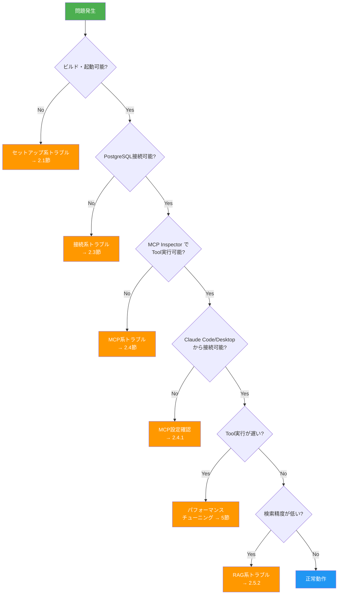
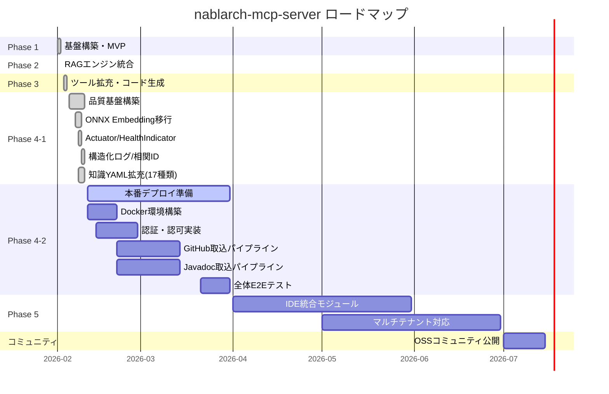

# トラブルシューティングとロードマップ — 困った時の解決策と今後の展望

> **シリーズ**: nablarch-mcp-server 専門家育成シリーズ 第14回（最終回）
> **レベル**: 実践
> **前提知識**: 全13記事の内容、実際のプロジェクト経験
> **最終更新**: 2026-02-07

---

## 目次

1. [この記事で学べること](#1-この記事で学べること)
2. [よくあるトラブルと解決方法](#2-よくあるトラブルと解決方法)
3. [エラーメッセージ逆引き辞典](#3-エラーメッセージ逆引き辞典)
4. [デバッグテクニック](#4-デバッグテクニック)
5. [パフォーマンスチューニング](#5-パフォーマンスチューニング)
6. [ロードマップ — これからのnablarch-mcp-server](#6-ロードマップ--これからのnablarch-mcp-server)
7. [シリーズ総まとめ — 全17記事で学んだことの振り返り](#7-シリーズ総まとめ--全17記事で学んだことの振り返り)
8. [索引 — 全17記事のリンク集](#8-索引--全17記事のリンク集)

---

## 1. この記事で学べること

この最終回では、実務でnablarch-mcp-serverを運用する際に遭遇する問題の解決方法と、今後の展望を学びます。

### 学習目標

- セットアップ・起動・接続の問題を自力で解決できる
- エラーメッセージから原因を特定し、適切な対処ができる
- デバッグツールを使いこなし、問題を切り分けられる
- パフォーマンス問題を診断し、チューニングできる
- プロジェクトのロードマップを理解し、今後の拡張に備えられる

### 前提知識

本記事は全13記事を読了し、実際にnablarch-mcp-serverを使用した経験があることを前提としています。特に以下の記事を復習しておくことを推奨します。

- 記事01-04B: 入門編（MCPの理解、Nablarch入門、セットアップ、基本操作）
- 記事03: ゼロから始めるセットアップガイド
- 記事04A, 04B: 使ってみよう 基本編・応用編
- 記事13: テスト戦略

---

## 2. よくあるトラブルと解決方法

実務で遭遇する問題を6カテゴリに分類し、それぞれ2-3パターンの解決方法を提示します。

### 2.1 セットアップ系トラブル

#### 2.1.1 ビルドエラー: `BUILD FAILED`

**症状**:
```bash
$ ./mvnw package
[ERROR] BUILD FAILED
[ERROR] Cannot resolve dependency: com.nablarch.framework:nablarch-fw-web:6u3
```

**原因**:
- Maven依存関係が解決できない
- Nablarchモジュールのバージョン指定が不正
- ネットワークの問題でMaven Centralにアクセスできない

**解決策**:
1. `pom.xml`のNablarchバージョンを確認:
   ```xml
   <nablarch.version>6u3</nablarch.version>
   ```
2. Maven Centralへのアクセス確認:
   ```bash
   curl -I https://repo.maven.apache.org/maven2/
   ```
3. ローカルリポジトリをクリア:
   ```bash
   rm -rf ~/.m2/repository/com/nablarch
   ./mvnw clean package -U
   ```

#### 2.1.2 Java バージョン不一致

**症状**:
```bash
$ java -jar nablarch-mcp-server.jar
Error: A JNI error has occurred, please check your installation and try again
Exception in thread "main" java.lang.UnsupportedClassVersionError
```

**原因**:
- Java 17未満で実行している
- 環境変数`JAVA_HOME`が古いJDKを指している

**解決策**:
1. Javaバージョンを確認:
   ```bash
   java -version
   # java version "17.0.x" or later required
   ```
2. 複数バージョンがインストールされている場合:
   ```bash
   # macOS
   export JAVA_HOME=`/usr/libexec/java_home -v 17`

   # Linux
   update-alternatives --config java
   ```

#### 2.1.3 依存関係の競合

**症状**:
```bash
[ERROR] Dependency convergence error for com.fasterxml.jackson.core:jackson-databind
```

**原因**:
- Spring Boot、Spring AI、Nablarchの依存関係が競合している

**解決策**:
1. `mvn dependency:tree`で依存関係を確認:
   ```bash
   ./mvnw dependency:tree > deps.txt
   ```
2. `pom.xml`で明示的にバージョンを指定:
   ```xml
   <dependencyManagement>
     <dependencies>
       <dependency>
         <groupId>org.springframework.boot</groupId>
         <artifactId>spring-boot-dependencies</artifactId>
         <version>3.4.2</version>
         <type>pom</type>
         <scope>import</scope>
       </dependency>
     </dependencies>
   </dependencyManagement>
   ```

---

### 2.2 起動系トラブル

#### 2.2.1 ポート競合

**症状**:
```bash
$ java -jar nablarch-mcp-server.jar --spring.profiles.active=http
***************************
APPLICATION FAILED TO START
***************************

Description:

Web server failed to start. Port 8080 was already in use.
```

**原因**:
- 別プロセスがポート8080を使用している
- 前回の起動プロセスが残っている

**解決策**:
1. ポートを使用しているプロセスを特定:
   ```bash
   # macOS/Linux
   lsof -i :8080

   # Windows
   netstat -ano | findstr :8080
   ```
2. プロセスを停止するか、別ポートを使用:
   ```bash
   java -jar nablarch-mcp-server.jar --server.port=9090
   ```

#### 2.2.2 設定ファイルの誤り

**症状**:
```bash
Caused by: org.yaml.snakeyaml.scanner.ScannerException:
mapping values are not allowed here
```

**原因**:
- `application.yaml`のYAML構文エラー
- インデントが不正（タブとスペースの混在）

**解決策**:
1. YAMLリンターで構文チェック:
   ```bash
   # yamllint インストール
   pip install yamllint
   yamllint src/main/resources/application.yaml
   ```
2. インデントを2スペースで統一
3. 値にコロン(`:`)が含まれる場合はクォートで囲む:
   ```yaml
   url: "jdbc:postgresql://localhost:5432/nablarch"
   ```

#### 2.2.3 プロファイル問題

**症状**:
```bash
$ java -jar nablarch-mcp-server.jar
# 起動するが、HTTPエンドポイントにアクセスできない
```

**原因**:
- プロファイルが`stdio`のまま（デフォルト）
- HTTPトランスポートが有効化されていない

**解決策**:
1. プロファイルを明示的に指定:
   ```bash
   java -jar nablarch-mcp-server.jar --spring.profiles.active=http
   ```
2. 環境変数で永続的に設定:
   ```bash
   export SPRING_PROFILES_ACTIVE=http
   ```
3. `application.yaml`でデフォルトプロファイルを変更:
   ```yaml
   spring:
     profiles:
       active: http
   ```

---

### 2.3 接続系トラブル（PostgreSQL）

#### 2.3.1 PostgreSQL 接続エラー

**症状**:
```bash
Caused by: org.postgresql.util.PSQLException: Connection refused. Check that the hostname and port are correct and that the postmaster is accepting TCP/IP connections.
```

**原因**:
- PostgreSQLが起動していない
- 接続URLが不正
- ポート番号が間違っている

**解決策**:
1. PostgreSQLの起動確認:
   ```bash
   # Docker の場合
   docker ps | grep postgres

   # ローカルインストールの場合
   pg_isready -h localhost -p 5432
   ```
2. 接続URLを確認:
   ```yaml
   spring:
     datasource:
       url: jdbc:postgresql://localhost:5432/nablarch_kb
       username: nablarch
       password: changeme
   ```

#### 2.3.2 pgvector 拡張未インストール

**症状**:
```bash
org.postgresql.util.PSQLException: ERROR: type "vector" does not exist
```

**原因**:
- pgvector拡張がインストールされていない
- 拡張が有効化されていない

**解決策**:
1. pgvectorのインストール確認:
   ```sql
   SELECT * FROM pg_extension WHERE extname = 'vector';
   ```
2. 未インストールの場合、拡張を作成:
   ```sql
   CREATE EXTENSION IF NOT EXISTS vector;
   ```
3. Docker環境の場合、`pgvector/pgvector:pg16`イメージを使用

#### 2.3.3 認証失敗

**症状**:
```bash
org.postgresql.util.PSQLException: FATAL: password authentication failed for user "nablarch"
```

**原因**:
- パスワードが間違っている
- ユーザーが存在しない
- `pg_hba.conf`の認証設定が不正

**解決策**:
1. ユーザーとパスワードの確認:
   ```sql
   \du  -- ユーザー一覧
   ```
2. パスワードをリセット:
   ```sql
   ALTER USER nablarch WITH PASSWORD 'new_password';
   ```
3. `pg_hba.conf`を確認（Docker環境では不要）

---

### 2.4 MCP系トラブル

#### 2.4.1 Claude Code/Desktop との接続問題

**症状**:
- Claude Code起動時にMCPサーバーが認識されない
- ツールが表示されない

**原因**:
- MCP設定ファイル（`.mcp.json`または`claude_desktop_config.json`）のパスが不正
- JARファイルのパスが相対パスになっている
- Javaが環境変数PATHに含まれていない

**解決策**:
1. JARファイルのパスを絶対パスに変更:
   ```json
   {
     "mcpServers": {
       "nablarch": {
         "command": "java",
         "args": [
           "-jar",
           "/absolute/path/to/nablarch-mcp-server.jar"
         ]
       }
     }
   }
   ```
2. Javaコマンドのフルパスを指定:
   ```json
   {
     "mcpServers": {
       "nablarch": {
         "command": "/usr/bin/java",
         "args": ["-jar", "..."]
       }
     }
   }
   ```
3. MCP設定ファイルの場所を確認:
   - Claude Code: プロジェクトルートの`.mcp.json`
   - Claude Desktop: `~/Library/Application Support/Claude/claude_desktop_config.json`（macOS）

#### 2.4.2 STDIO モードの制限

**症状**:
- ツール実行が遅い
- 複数の接続が確立できない

**原因**:
- STDIOモードは1プロセス1接続のみ
- Claude Code起動ごとに新規プロセスが立ち上がる

**解決策**:
1. HTTPモードに切り替える（チーム共有用）:
   ```bash
   java -jar nablarch-mcp-server.jar --spring.profiles.active=http
   ```
2. リモートサーバーとして常駐させる:
   ```bash
   nohup java -jar nablarch-mcp-server.jar --spring.profiles.active=http &
   ```
3. Claude Codeの設定をHTTPモードに変更:
   ```json
   {
     "mcpServers": {
       "nablarch": {
         "url": "http://localhost:8080/mcp",
         "transport": "streamable-http"
       }
     }
   }
   ```

#### 2.4.3 ツール実行タイムアウト

**症状**:
```bash
Tool execution timed out after 30 seconds
```

**原因**:
- RAG検索が時間がかかりすぎている
- Embedding APIの応答が遅い
- データベースの応答が遅い

**解決策**:
1. ログレベルを上げて原因を特定:
   ```yaml
   logging:
     level:
       com.tis.nablarch.mcp: DEBUG
   ```
2. タイムアウトを延長:
   ```yaml
   mcp:
     tools:
       timeout: 60s
   ```
3. パフォーマンスチューニング（後述）を実施

---

### 2.5 RAG系トラブル

#### 2.5.1 Embedding API 認証エラー

**症状**:
```bash
com.tis.nablarch.mcp.rag.EmbeddingException: 401 Unauthorized
```

**原因**:
- APIキーが未設定または不正
- APIキーの期限切れ
- 環境変数が正しく読み込まれていない

**解決策**:
1. 環境変数を確認:
   ```bash
   echo $JINA_API_KEY
   echo $VOYAGE_API_KEY
   ```
2. `application.yaml`で明示的に設定:
   ```yaml
   mcp:
     rag:
       embedding:
         jina:
           api-key: ${JINA_API_KEY}
         voyage:
           api-key: ${VOYAGE_API_KEY}
   ```
3. APIキーを再発行:
   - Jina: https://jina.ai/embeddings/
   - Voyage: https://www.voyageai.com/

#### 2.5.2 検索精度が低い

**症状**:
- セマンティック検索で関係ないドキュメントが返ってくる
- ユーザーが期待する情報が見つからない

**原因**:
- クエリが不適切
- チャンクサイズが大きすぎる/小さすぎる
- Embeddingモデルの選択が不適切

**解決策**:
1. クエリを具体的にする:
   ```json
   {
     "query": "ハンドラ",  // ✗ 曖昧
     "query": "NablarchのHttpCharacterEncodingHandlerの設定方法"  // ✓ 具体的
   }
   ```
2. メタデータフィルタを活用:
   ```json
   {
     "query": "バリデーション",
     "filters": {
       "module": "nablarch-core-validation",
       "contentType": "javadoc"
     }
   }
   ```
3. Top-K値を増やして確認:
   ```yaml
   mcp:
     rag:
       search:
         top-k: 10  # デフォルト5から増やす
   ```

#### 2.5.3 インデックス未構築

**症状**:
```bash
com.tis.nablarch.mcp.rag.IndexNotFoundException: No documents indexed
```

**原因**:
- 初回起動時にドキュメント取込が実行されていない
- 取込パイプラインが失敗している

**解決策**:
1. 手動でインデックスを構築:
   ```bash
   java -jar nablarch-mcp-server.jar --reindex
   ```
2. 取込ログを確認:
   ```bash
   tail -f logs/nablarch-mcp-server.log | grep "IngestionPipeline"
   ```
3. データベースを確認:
   ```sql
   SELECT COUNT(*) FROM document_chunks;
   SELECT COUNT(*) FROM code_chunks;
   ```

---

### 2.6 HTTP系トラブル（Streamable HTTP Transport）

#### 2.6.1 CORS エラー

**症状**:
ブラウザのコンソールに以下のエラーが表示される:
```
Access to fetch at 'http://localhost:8080/mcp' from origin 'http://localhost:3000'
has been blocked by CORS policy: No 'Access-Control-Allow-Origin' header is present
```

**原因**:
- CORSが有効化されていない
- `allowed-origins`にクライアントのオリジンが含まれていない

**解決策**:
1. `application-http.yaml`でCORSを設定:
   ```yaml
   mcp:
     http:
       cors:
         allowed-origins:
           - "http://localhost:3000"
           - "http://localhost:5173"  # Vite dev server
   ```
2. 開発環境ではワイルドカード使用（本番は禁止）:
   ```yaml
   mcp:
     http:
       cors:
         allowed-origins:
           - "*"  # 開発環境のみ
   ```

#### 2.6.2 セッションID不一致

**症状**:
```bash
HTTP/1.1 404 Not Found
{"jsonrpc":"2.0","error":{"code":-32001,"message":"Session not found"}}
```

**原因**:
- クライアントが`Mcp-Session-Id`ヘッダを送信していない
- セッションがタイムアウトしている

**解決策**:
1. クライアントコードでヘッダを正しく保存:
   ```javascript
   const response = await fetch('/mcp', {
     method: 'POST',
     headers: {
       'Content-Type': 'application/json',
       'Mcp-Session-Id': sessionId  // 初回レスポンスから取得
     },
     body: JSON.stringify(rpcMessage)
   });
   ```
2. セッションタイムアウトを延長:
   ```yaml
   mcp:
     http:
       session:
         timeout: 60m  # デフォルト30分
   ```

#### 2.6.3 SSE ストリームの切断

**症状**:
- GET /mcp のSSEストリームが定期的に切断される
- 再接続が頻発する

**原因**:
- プロキシやロードバランサーのタイムアウト
- ハートビートの設定不足

**解決策**:
1. ハートビート間隔を短縮:
   ```yaml
   mcp:
     http:
       sse:
         heartbeat-interval: 15s  # デフォルト30秒
   ```
2. クライアント側で再接続ロジックを実装:
   ```javascript
   const eventSource = new EventSource('/mcp?Mcp-Session-Id=' + sessionId);
   eventSource.onerror = () => {
     setTimeout(() => {
       eventSource = new EventSource(...);  // 再接続
     }, 3000);
   };
   ```

---

## 3. エラーメッセージ逆引き辞典

よく見るエラーメッセージから原因と対処法を素早く検索できる逆引き表です。

| # | エラーメッセージ | 原因 | 対処法 | 参照 |
|---|-----------------|------|--------|------|
| 1 | `BUILD FAILED: Cannot resolve dependency` | Maven依存関係の問題 | `./mvnw clean package -U` | [2.1.1](#211-ビルドエラー-build-failed) |
| 2 | `UnsupportedClassVersionError` | Java バージョン不一致 | Java 17以上を使用 | [2.1.2](#212-java-バージョン不一致) |
| 3 | `Port 8080 was already in use` | ポート競合 | `lsof -i :8080` でプロセス確認 | [2.2.1](#221-ポート競合) |
| 4 | `mapping values are not allowed here` | YAML構文エラー | yamllintで構文チェック | [2.2.2](#222-設定ファイルの誤り) |
| 5 | `Connection refused (PostgreSQL)` | PostgreSQLが起動していない | `docker ps` または `pg_isready` | [2.3.1](#231-postgresql-接続エラー) |
| 6 | `type "vector" does not exist` | pgvector未インストール | `CREATE EXTENSION vector;` | [2.3.2](#232-pgvector-拡張未インストール) |
| 7 | `password authentication failed` | PostgreSQL認証失敗 | ユーザー・パスワードを確認 | [2.3.3](#233-認証失敗) |
| 8 | `401 Unauthorized (Embedding API)` | APIキー未設定/不正 | 環境変数`JINA_API_KEY`等を確認 | [2.5.1](#251-embedding-api-認証エラー) |
| 9 | `IndexNotFoundException` | ドキュメント未取込 | `--reindex` で手動取込 | [2.5.3](#253-インデックス未構築) |
| 10 | `Session not found (HTTP -32001)` | セッションID不一致 | `Mcp-Session-Id`ヘッダを確認 | [2.6.2](#262-セッションid不一致) |
| 11 | `CORS policy: No 'Access-Control-Allow-Origin'` | CORS未設定 | `allowed-origins`を設定 | [2.6.1](#261-cors-エラー) |
| 12 | `Tool execution timed out` | ツール実行タイムアウト | `mcp.tools.timeout`を延長 | [2.4.3](#243-ツール実行タイムアウト) |
| 13 | `NoClassDefFoundError: nablarch/...` | Nablarchモジュール未導入 | `pom.xml`に依存関係を追加 | error-catalog.yaml ERR-017 |
| 14 | `ComponentCreationException` | コンポーネント定義エラー | XMLの構文・FQCN・循環参照を確認 | error-catalog.yaml ERR-010 |
| 15 | `handler queue is empty` | ハンドラキュー未設定 | `PackageMapping`等を設定 | error-catalog.yaml ERR-002 |

---

## 4. デバッグテクニック

問題を効率的に切り分けるためのデバッグ手法を紹介します。

### 4.1 ログレベルの変更方法

#### 4.1.1 application.yaml での設定

```yaml
logging:
  level:
    root: INFO
    com.tis.nablarch.mcp: DEBUG  # MCPサーバー全体
    com.tis.nablarch.mcp.tools: TRACE  # Tool実行の詳細
    com.tis.nablarch.mcp.rag: DEBUG  # RAG検索の詳細
    org.springframework.ai: DEBUG  # Spring AI統合
    org.postgresql: DEBUG  # PostgreSQL接続
```

#### 4.1.2 起動時のオプション指定

```bash
java -jar nablarch-mcp-server.jar \
  --logging.level.com.tis.nablarch.mcp=DEBUG
```

#### 4.1.3 重要なログ出力例

```bash
# Tool実行の開始
[DEBUG] Tool 'semantic_search' invoked with params: {query: "ハンドラキュー"}

# RAG検索フロー
[DEBUG] BM25 search: query="ハンドラキュー" top-k=5
[DEBUG] Vector search: embedding dimension=1024, top-k=5
[DEBUG] Hybrid search: RRF fusion, result count=8
[DEBUG] Cross-encoder reranking: 8 → 5 results

# Tool実行の完了
[DEBUG] Tool 'semantic_search' completed in 234ms, result size: 1024 bytes
```

---

### 4.2 MCP Inspector の使い方

MCP Inspectorは、MCPサーバーの動作を対話的にテストできる公式ツールです。

#### 4.2.1 起動方法

```bash
# WSL2上で実行
npx @modelcontextprotocol/inspector java -jar target/nablarch-mcp-server-0.1.0-SNAPSHOT.jar
```

**WSL2環境での注意**: コマンド実行後、`Server running at http://localhost:5173` と表示されたら、**Windows側（ホスト側）のブラウザ**で `http://localhost:5173` を開いてください。最新のWSL2では自動的にポート転送されます。

Inspector UIが表示されれば起動成功です。

#### 4.2.2 Inspector UI の構成

```
┌─────────────────────────────────────────────────────────────────┐
│  MCP Inspector                                                  │
├──────────────┬──────────────────────────────────────────────────┤
│ Tools        │  Tool実行                                         │
│ Resources    │  ┌────────────────────────────────────────┐      │
│ Prompts      │  │ Tool: semantic_search                  │      │
│ Initialize   │  ├────────────────────────────────────────┤      │
│              │  │ Params:                                │      │
│              │  │  query: "ハンドラキュー"               │      │
│              │  │  top_k: 5                              │      │
│              │  ├────────────────────────────────────────┤      │
│              │  │ [Execute]                              │      │
│              │  └────────────────────────────────────────┘      │
│              │                                                   │
│              │  レスポンス:                                      │
│              │  {                                                │
│              │    "results": [...]                               │
│              │  }                                                │
└──────────────┴──────────────────────────────────────────────────┘
```

#### 4.2.3 Inspector でのテスト手順

1. **初期化確認**:
   - 左メニュー「Initialize」→ 初期化ログを確認
   - Tool/Resource/Promptの一覧が表示されることを確認

2. **Tool実行テスト**:
   - 左メニュー「Tools」→ `semantic_search` を選択
   - パラメータ入力:
     ```json
     {
       "query": "UniversalDao",
       "top_k": 5
     }
     ```
   - 「Execute」ボタン → レスポンスを確認

3. **Resource読み込みテスト**:
   - 左メニュー「Resources」→ `nablarch://handler/web` を選択
   - 「Read」ボタン → ハンドラキュー仕様が表示されることを確認

4. **Prompt取得テスト**:
   - 左メニュー「Prompts」→ `setup-handler-queue` を選択
   - 引数入力:
     ```json
     {
       "app_type": "web"
     }
     ```
   - 「Get」ボタン → プロンプトテンプレートが表示されることを確認

---

### 4.3 テストでの問題切り分け

#### 4.3.1 ユニットテストによる切り分け

```bash
# 特定のToolのテストを実行
./mvnw test -Dtest=SemanticSearchToolTest

# RAGコンポーネントのテストを実行
./mvnw test -Dtest=HybridSearchServiceTest

# 統合テスト（PostgreSQL必須）
./mvnw test -Dtest=*IntegrationTest
```

#### 4.3.2 テストプロファイルの使用

```yaml
# src/test/resources/application-test.yaml
spring:
  datasource:
    url: jdbc:postgresql://localhost:5432/nablarch_test
  ai:
    mcp:
      server:
        stdio: true

mcp:
  rag:
    embedding:
      jina:
        api-key: ${JINA_API_KEY_TEST}  # テスト用APIキー
```

#### 4.3.3 デバッグフロー

以下のフロー図に従って問題を切り分けます。



---

## 5. パフォーマンスチューニング

実運用でパフォーマンス問題が発生した場合のチューニング手法を紹介します。

### 5.1 検索速度の改善

#### 5.1.1 インデックスの最適化

pgvectorのインデックスチューニング:

```sql
-- IVFFlat インデックスのリストサイズを調整
-- リスト数 = sqrt(行数) が推奨
DROP INDEX IF EXISTS document_chunks_embedding_idx;
CREATE INDEX document_chunks_embedding_idx
  ON document_chunks
  USING ivfflat (embedding vector_cosine_ops)
  WITH (lists = 100);  -- 行数10,000の場合

-- インデックス統計を更新
ANALYZE document_chunks;
ANALYZE code_chunks;
```

#### 5.1.2 Top-K値の調整

```yaml
mcp:
  rag:
    search:
      top-k: 5  # デフォルト。精度重視なら10、速度重視なら3
      bm25-weight: 0.3  # キーワード検索の重み
      vector-weight: 0.7  # セマンティック検索の重み
```

#### 5.1.3 チャンクサイズの調整

```yaml
mcp:
  rag:
    chunking:
      html:
        size: 800  # デフォルト1000。小さくすると精度向上、速度低下
        overlap: 100
      code:
        size: 400  # デフォルト500
        overlap: 50
```

---

### 5.2 メモリ使用量の最適化

#### 5.2.1 JVMヒープサイズの調整

```bash
java -Xms1g -Xmx2g -jar nablarch-mcp-server.jar
```

#### 5.2.2 セッション管理の最適化

```yaml
mcp:
  http:
    session:
      max-sessions: 50  # 同時接続数の上限
      timeout: 15m  # 短縮してメモリを節約
      cleanup-interval: 5m  # 定期クリーンアップ
```

#### 5.2.3 キャッシュ設定

```yaml
mcp:
  rag:
    cache:
      enabled: true
      max-size: 1000  # キャッシュエントリ数
      ttl: 10m  # Time To Live
```

---

### 5.3 Embedding API 呼び出しの最適化

#### 5.3.1 バッチ処理

複数ドキュメントを一度にEmbedding:

```java
// 1件ずつ → 遅い
for (Document doc : documents) {
    client.embed(doc.getText());
}

// バッチ処理 → 速い
List<String> texts = documents.stream()
    .map(Document::getText)
    .toList();
client.embedBatch(texts);
```

#### 5.3.2 ローカルONNXモデルの使用（実装済み）

ONNX Embeddingモデルへの移行は**Phase 4-1で完了**しています。`spring.profiles.active=local` を設定すると、無償のローカルモデルで動作します:

```yaml
# application-local.yml（デフォルトプロファイル）
mcp:
  rag:
    embedding:
      provider: local
      model:
        document: BAAI/bge-m3        # ONNXランタイムで推論
        code: CodeSage-small-v2      # ONNXランタイムで推論
```

> **Tip**: 有償APIモデル（Jina v4 / Voyage-code-3）を使用する場合は `spring.profiles.active=api` に切り替えてください。

---

### 5.4 データベースチューニング

#### 5.4.1 接続プール設定

```yaml
spring:
  datasource:
    hikari:
      maximum-pool-size: 20  # 最大接続数
      minimum-idle: 5  # 最小アイドル接続数
      connection-timeout: 30000
      idle-timeout: 600000
```

#### 5.4.2 クエリ最適化

```sql
-- ベクトル検索のクエリプラン確認
EXPLAIN ANALYZE
SELECT * FROM document_chunks
ORDER BY embedding <=> '[0.1, 0.2, ...]'::vector
LIMIT 5;

-- インデックスが使用されていることを確認
-- → Index Scan using document_chunks_embedding_idx
```

---

### 5.5 パフォーマンス測定

#### 5.5.1 メトリクスエンドポイント（HTTPモード）

```bash
# Prometheus形式のメトリクス
curl http://localhost:8080/actuator/prometheus

# 主要なメトリクス:
# - mcp_tool_execution_duration_seconds: Tool実行時間
# - mcp_rag_search_duration_seconds: RAG検索時間
# - hikari_connections_active: DB接続数
```

#### 5.5.2 ログベースの測定

```yaml
logging:
  level:
    com.tis.nablarch.mcp.tools: DEBUG
```

ログから実行時間を抽出:

```bash
grep "Tool .* completed in" logs/nablarch-mcp-server.log | awk '{print $NF}'
# 234ms
# 156ms
# 389ms
```

---

## 6. ロードマップ — これからのnablarch-mcp-server

プロジェクトのこれまでの歩みと、今後の拡張計画を説明します。

### 6.1 Phase 1-3の振り返り（これまでの歩み）

**注**: ここでの「Phase 1-3」は開発ロードマップ上のフェーズであり、アプリケーションの動作モードではありません。

#### Phase 1: MCP基盤 + 静的知識（完了）

**期間**: 2026-02-02完了
**成果**:
- Spring Boot + MCP Java SDK 基盤
- 2 Tools（search_api, validate_handler_queue）
- 12 Resources（handler/*, guide/*）
- 6 Prompts
- STDIOトランスポート
- 28タスク完了、7 PRマージ

#### Phase 2: RAGエンジン統合（完了）

**期間**: 2026-02-02完了
**成果**:
- PostgreSQL + pgvector ベクトルDB
- デュアルEmbedding（Jina v4 + Voyage-code-3）
- ハイブリッド検索（BM25 + ベクトル検索 + リランキング）
- semantic_search Tool
- ドキュメント・Fintanコンテンツ取込
- 検索品質評価（MRR 0.7以上達成）
- 34タスク完了、18 PRマージ

#### Phase 3: ツール拡充・コード生成（完了）

**期間**: 2026-02-04完了
**成果**:
- 全10 Tools実装完了
- 全8 Resources実装完了
- Streamable HTTPトランスポート
- 全12ユースケース対応
- テスト810件（805件成功）
- 37タスク完了、33 PRマージ

#### Phase 4-1: 品質基盤（完了）

**期間**: 2026-02-10完了
**成果**:
- ONNX Embedding移行（bge-m3 / CodeSage-small-v2）
- Spring Boot Actuator / HealthIndicator統合
- 構造化ログ（JSON）+ 相関ID
- Micrometer メトリクス基盤
- 一次ソースURL付与（96エントリ、37 Nablarch公式文書URL）
- Agent Skills 6個実装
- 知識YAML 10→17ファイルに拡充
- テスト1,019件（1,005件成功、14件スキップ）
- 22 PRマージ（#59〜#80）

**累計**: Phase 1-4-1で121タスク完了、80 PRマージ

---

### 6.2 ロードマップタイムライン



---

### 6.3 Phase 4: 品質基盤・本番デプロイ準備（進行中）

**目標完了**: 2026年3月末

#### Phase 4-1: 品質基盤構築（完了 — 2026-02-10）

Phase 4-1では以下の品質基盤を構築しました:

- **ONNX Embedding移行**: bge-m3（ドキュメント用）/ CodeSage-small-v2（コード用）でローカル推論を実現
- **Spring Boot Actuator統合**: HealthIndicator、メトリクスエンドポイント
- **構造化ログ**: JSON形式ログ + 相関ID（リクエストトレーシング）
- **Micrometer メトリクス**: Tool実行時間・RAG検索レイテンシの計測基盤
- **知識YAML拡充**: 10→17ファイル（data-io, validation, log, mail, message, security, utility追加）
- **一次ソースURL**: 96エントリに37件のNablarch公式ドキュメントURLを付与
- **Agent Skills**: 6個の開発支援スキルを実装

**成果**: テスト1,019件（1,005成功、14スキップ）、22 PR（#59〜#80）マージ

#### Phase 4-2: 本番デプロイ準備（計画中）

**主要タスク**:

#### 6.3.1 Docker Compose デプロイ

**目的**: 簡単に本番環境を構築できるようにする

**成果物**:
- `docker-compose.yml`（nablarch-mcp-server + PostgreSQL + pgvector）
- `Dockerfile`（マルチステージビルド）
- 環境変数設定ガイド

**起動方法**:
```bash
docker compose up -d
```

#### 6.3.2 OAuth 2.0 認証・認可

**目的**: HTTPモードでの安全なアクセス制御

**実装内容**:
- OAuth 2.0 Authorization Code Flow
- APIキー管理（発行・失効・ローテーション）
- レート制限（セッション単位）
- Origin ヘッダ検証（DNSリバインディング対策）

**設定例**:
```yaml
mcp:
  http:
    security:
      enabled: true
      oauth2:
        issuer-uri: https://auth.example.com
      api-key:
        enabled: true
      rate-limit:
        requests-per-minute: 60
```

#### 6.3.3 GitHub取込パイプライン

**目的**: Nablarch 113リポジトリのソースコードをベクトルDB化

**対象**:
- Javaソースコード（`.java`）
- XML設定ファイル（`.xml`）
- SQLファイル（`.sql`）

**実装内容**:
- GitHub API経由のクローニング
- ONNX CodeSage（ローカル）/ Voyage-code-3（API）による高精度Embedding
- 増分更新（Webhook連携）

#### 6.3.4 Javadoc取込パイプライン

**目的**: 全モジュールのJavadocをRAGで検索可能に

**実装内容**:
- JavadocのHTMLパース
- クラス・メソッド・パッケージ構造の保持
- ONNX bge-m3（ローカル）/ Jina v4（API）による Embedding

#### 6.3.5 モニタリング・ロギング（Phase 4-1で基盤完了）

**目的**: プロダクション環境での運用監視

**Phase 4-1で実装済み**:
- Spring Boot Actuator HealthIndicator（PostgreSQL / Embedding / 知識YAML）
- Micrometer メトリクス基盤（Tool実行時間、RAG検索レイテンシ）
- 構造化ログ（JSON形式）+ 相関ID（リクエストトレーシング）

**Phase 4-2で追加予定**:
- Prometheus メトリクスエクスポート
  - データベース接続数
  - メモリ使用量
- Grafanaダッシュボード
- アラート設定

**メトリクスエンドポイント**:
```bash
curl http://localhost:8080/actuator/prometheus
curl http://localhost:8080/actuator/health
```

---

### 6.4 Phase 5以降: 今後の拡張計画

> **Note**: ONNX Embeddingへの移行はPhase 4-1で完了済みです（bge-m3 / CodeSage-small-v2）。

#### 6.4.1 IDE統合モジュール（2026年4-6月）

**目的**: VS Code、IntelliJ等への直接統合

**実装内容**:
- VS Code拡張機能
- IntelliJ IDEAプラグイン
- Language Server Protocol (LSP) 統合

**ユースケース**:
- コード補完時にNablarchのAPIを提案
- ハンドラキュー設定のリアルタイム検証
- エラー行にNablarch固有の修正案を表示

#### 6.4.2 マルチテナント対応（2026年5-7月）

**目的**: 複数プロジェクト・チーム間でのMCPサーバー共有

**実装内容**:
- テナント別知識ベース
- テナント別セッション管理
- テナント別アクセス制御

#### 6.4.3 他フレームワーク対応（将来検討）

**対象候補**:
- Spring Framework
- Jakarta EE
- Micronaut

**実装方式**:
- フレームワーク別知識YAML
- 汎用RAGエンジンの再利用
- フレームワーク固有Tool追加

---

### 6.5 コミュニティへの参加方法

本プロジェクトはOSSコミュニティへの公開を予定しています（2026年7月）。

#### 6.5.1 GitHub Issues

**報告対象**:
- バグ報告
- 機能要望
- ドキュメントの改善提案

**Issueテンプレート**:
```markdown
## 問題の説明
<!-- 何が起こったか -->

## 再現手順
1. ...
2. ...

## 期待する動作
<!-- 本来どうあるべきか -->

## 環境
- OS:
- Java:
- nablarch-mcp-server: v0.1.0
```

#### 6.5.2 Pull Requests

**コントリビューション歓迎領域**:
- Nablarch知識ベースの拡充（YAML追加）
- Promptテンプレートの追加
- テストケースの追加
- ドキュメントの翻訳

**PR作成前のチェックリスト**:
- [ ] `./mvnw test` が全て成功
- [ ] 新規コードにテストを追加
- [ ] `CONTRIBUTING.md` に従う

#### 6.5.3 ディスカッション

GitHub Discussionsで以下を議論:
- ユースケースの共有
- ベストプラクティス
- 技術選定の相談

---

## 7. シリーズ総まとめ — 全17記事で学んだことの振り返り

全17記事の学習パスを振り返り、nablarch-mcp-server専門家への道のりを総括します。

### 7.1 入門編（記事01-04B）

#### 記事01: MCPとは何か
- **学んだこと**: Model Context Protocolの概念と仕組み
- **到達目標**: MCPの基本を理解し、その価値を説明できる

#### 記事02: nablarch-mcp-serverの全体像
- **学んだこと**: プロジェクトの目的、アーキテクチャ、提供機能
- **到達目標**: プロジェクト全体を俯瞰し、導入判断ができる

#### 記事03A: Nablarch入門
- **学んだこと**: Nablarchフレームワークの基礎知識
- **到達目標**: Nablarchの基本構造と特徴を理解できる

#### 記事03: ゼロから始めるセットアップガイド
- **学んだこと**: インストール、環境構築、初回起動
- **到達目標**: 自分の環境でMCPサーバーを起動できる

#### 記事04A: 使ってみよう 基本編
- **学んだこと**: 基本的なツール操作、検索機能の使い方
- **到達目標**: 日常的な開発タスクでMCPサーバーを活用できる

#### 記事04B: 使ってみよう 応用編
- **学んだこと**: 高度な検索、フィルタ活用、パフォーマンス最適化
- **到達目標**: 複雑なユースケースに対応できる

**入門編の成果**: nablarch-mcp-serverの基本概念を理解し、実務で活用できる

---

### 7.2 中級編（記事05-08）

#### 記事05: アーキテクチャ概要
- **学んだこと**: システム全体のアーキテクチャ、コンポーネント構成
- **到達目標**: 内部構造を理解し、カスタマイズの方針を立てられる

#### 記事05A: RAG入門
- **学んだこと**: RAG技術の基礎、Embeddingの仕組み
- **到達目標**: RAGの原理を理解し、検索精度を評価できる

#### 記事06: ナレッジの構造化
- **学んだこと**: 知識ベースの設計、YAML構造、メタデータ管理
- **到達目標**: プロジェクト固有の知識を構造化できる

#### 記事07: RAGパイプライン詳解
- **学んだこと**: パーサー、チャンキング、Embedding、ハイブリッド検索
- **到達目標**: RAGパイプラインの内部動作を理解し、カスタマイズできる

#### 記事08: Spring AI MCP Serverとの統合
- **学んだこと**: Spring AI MCPとの連携、設定方法
- **到達目標**: Spring Bootアプリケーションと統合できる

**中級編の成果**: nablarch-mcp-serverの内部構造を理解し、拡張できる

---

### 7.3 上級編（記事09-13）

#### 記事09: 設定ファイル完全ガイド
- **学んだこと**: application.yaml、プロファイル、環境変数管理
- **到達目標**: 環境ごとの設定を適切に管理できる

#### 記事10: Tool設計と実装パターン
- **学んだこと**: Tool開発、パラメータ設計、テストパターン
- **到達目標**: プロジェクト固有のToolを開発できる

#### 記事11: Resource/Prompt設計と実装パターン
- **学んだこと**: Resource/Promptの設計、YAMLベース実装
- **到達目標**: カスタムResourceとPromptを追加できる

#### 記事12: 拡張ガイド
- **学んだこと**: プラグイン機構、カスタマイズポイント
- **到達目標**: プロジェクト固有の拡張を実装できる

#### 記事13: テスト戦略
- **学んだこと**: 1,019件のテスト構成、品質保証手法
- **到達目標**: テストを理解し、新規機能にテストを追加できる

**上級編の成果**: nablarch-mcp-serverの内部構造を理解し、拡張・最適化・テストができる

---

### 7.4 実践編（記事14: 本記事）

#### 記事14: トラブルシューティングとロードマップ
- **学んだこと**: 問題解決、デバッグ、パフォーマンスチューニング、今後の展望
- **到達目標**: 実運用での問題を自力で解決でき、プロジェクトの将来を見据えられる

**実践編の成果**: nablarch-mcp-server専門家として、実務での問題解決とプロジェクトへの貢献ができる

---

### 7.5 学習パスの全体像

```
入門（01-04）
    ↓ 基本概念・環境構築
中級（05-08）
    ↓ 実務での活用
上級（09-13）
    ↓ 内部構造・拡張・セキュリティ
実践（14）
    ↓ 問題解決・運用
専門家
```

**習得スキル一覧**:
- MCPプロトコルの理解
- RAG技術の理解
- Nablarch知識ベースの活用
- Tool/Resource/Promptの使い分け
- ベクトルDBの設計・最適化
- HTTPトランスポートの構築
- セキュリティ対策
- トラブルシューティング
- パフォーマンスチューニング

---

## 8. 索引 — 全17記事のリンク集

全シリーズの記事を一覧にまとめます。

| 記事番号 | タイトル | レベル | 主要トピック |
|---------|---------|--------|------------|
| 01 | MCPとは何か | 入門 | Model Context Protocol、基本概念、仕組み |
| 02 | nablarch-mcp-serverの全体像 | 入門 | プロジェクト概要、アーキテクチャ、提供機能 |
| 03A | Nablarch入門 | 入門 | Nablarchフレームワーク基礎、構造、特徴 |
| 03 | ゼロから始めるセットアップガイド | 入門 | インストール、環境構築、初回起動 |
| 04A | 使ってみよう 基本編 | 入門 | 基本操作、ツール使用、検索機能 |
| 04B | 使ってみよう 応用編 | 入門 | 高度な検索、フィルタ活用、最適化 |
| 05 | アーキテクチャ概要 | 中級 | システム構造、コンポーネント構成 |
| 05A | RAG入門 | 中級 | RAG技術、Embedding、セマンティック検索 |
| 06 | ナレッジの構造化 | 中級 | 知識ベース設計、YAML構造、メタデータ管理 |
| 07 | RAGパイプライン詳解 | 中級 | パーサー、チャンキング、Embedding、ハイブリッド検索 |
| 08 | Spring AI MCP Serverとの統合 | 中級 | Spring AI連携、設定方法、統合パターン |
| 09 | 設定ファイル完全ガイド | 上級 | application.yaml、プロファイル、環境変数 |
| 10 | Tool設計と実装パターン | 上級 | Tool開発、パラメータ設計、テストパターン |
| 11 | Resource/Prompt設計と実装パターン | 上級 | Resource/Prompt設計、YAMLベース実装 |
| 12 | 拡張ガイド | 上級 | プラグイン機構、カスタマイズポイント |
| 13 | テスト戦略 | 上級 | 1,019件のテスト構成、品質保証手法 |
| **14** | **トラブルシューティングとロードマップ** | **実践** | **問題解決、デバッグ、パフォーマンスチューニング、今後の展望** |

**シリーズTOPに戻る**: [INDEX.md — 記事一覧](INDEX.md)

**前の記事**: [記事13: テスト戦略](13-testing-strategy.md)

---

## おわりに

全17記事にわたる「nablarch-mcp-server 専門家育成シリーズ」を完走されたあなたは、もはや入門者ではありません。MCPとRAGの理論を理解し、実務でnablarch-mcp-serverを活用でき、問題を自力で解決できる専門家です。

本記事で紹介したトラブルシューティング手法とデバッグテクニックは、実運用で必ず役に立ちます。また、ロードマップを見据えることで、今後のプロジェクト進化に対応できる準備が整います。

nablarch-mcp-serverプロジェクトはOSSコミュニティへの公開を予定しています。あなたの知見・フィードバック・コントリビューションをお待ちしています。ぜひGitHubでIssueやPull Requestを通じて、プロジェクトの発展に参加してください。

**Nablarchの未来を、一緒に創りましょう。**

---

## 参考資料

- [README.md](../../README.md) - プロジェクト概要
- [docs/07-setup-guide.md](../07-setup-guide.md) - セットアップガイド
- [docs/08-user-guide.md](../08-user-guide.md) - ユーザーガイド
- [docs/11-progress.md](../11-progress.md) - 進捗管理
- [docs/10-wbs.md](../10-wbs.md) - WBS
- [src/main/resources/knowledge/error-catalog.yaml](../../src/main/resources/knowledge/error-catalog.yaml) - エラーカタログ
- [docs/designs/23_streamable-http-transport.md](../designs/23_streamable-http-transport.md) - HTTP設計書

---

**🦖 Generated with nablarch-mcp-server v0.1.0** | Powered by RAG + MCP
