# Nablarch MCP Server 専門家育成シリーズ

> **全17記事** | 駆け出しエンジニアから専門家への成長物語
> **最終更新**: 2026-02-08

---

## このシリーズについて

このシリーズは、**何も知らないエンジニアが全17記事を読み通してNablarch MCP Serverの専門家になれる**ように設計された体系的なカリキュラムです。MCPの基礎概念から始まり、環境構築、ハンズオン体験、アーキテクチャ理解、RAG・知識構造の深掘り、Tool/Resource/Prompt設計の読み解き、そして自分で拡張・テスト・運用できるレベルまでを段階的に導きます。

想定学習時間: **約8〜10時間**（全記事合計）

---

## 学習パス

```mermaid
graph LR
    A[第1部: 入門編] --> B[第2部: 初級編]
    B --> C[第3部: 中級編]
    C --> D[第4部: 上級編]
    D --> E[第5部: 実践編]

    A1[01 MCPとは] --> A2[02 全体像]
    A2 --> A3[03A Nablarch入門]
    A3 --> B1[03 セットアップ]
    B1 --> B2[04A 基本編]
    B2 --> B3[04B 応用編]
    B3 --> C1[05 アーキテクチャ]
    C1 --> C2[05A RAG入門]
    C2 --> C3[06 知識構造]
    C3 --> C4[07 RAGパイプライン]
    C4 --> C5[08 Spring AI統合]
    C5 --> C6[09 設定ガイド]
    C6 --> D1[10 Tool設計]
    D1 --> D2[11 Resource/Prompt設計]
    D2 --> E1[12 拡張ガイド]
    E1 --> E2[13 テスト戦略]
    E2 --> E3[14 トラブルシューティング]
```



---

## 全17記事一覧

### 第1部: 入門編（ゼロからの第一歩）

MCPの世界に足を踏み入れ、Nablarch MCP Serverが生まれた背景と目指す姿を理解します。

| # | タイトル | 所要時間 | リンク |
|---|---------|----------|--------|
| 01 | MCPとは何か --- AIコーディングツールの新標準プロトコル | 10-15分 | [記事01](01-what-is-mcp.md) |
| 02 | nablarch-mcp-serverの全体像 --- なぜ作ったのか、何ができるのか | 15分 | [記事02](02-project-overview.md) |
| 03A | Nablarch入門 --- フレームワークの基礎知識 | 15分 | [記事03A](03A-nablarch-introduction.md) |

### 第2部: 初級編（動かして感動する）

手を動かしてMCPサーバーをセットアップし、全24機能（10 Tools + 8 Resources + 6 Prompts）を体験します。

| # | タイトル | 所要時間 | リンク |
|---|---------|----------|--------|
| 03 | ゼロから始めるセットアップガイド --- 環境構築から動作確認まで | 30分 | [記事03](03-setup-guide.md) |
| 04A | 使ってみよう 基本編 --- 最初の10分で感動体験 | 10分 | [記事04A](04A-hands-on-basic.md) |
| 04B | 使ってみよう 応用編 --- 10のToolsを使いこなす | 25分 | [記事04B](04B-hands-on-advanced.md) |

### 第3部: 中級編（仕組みを理解する）

アーキテクチャ、RAG、知識構造、Spring AI統合、設定ファイルを深く学び、内部動作を理解します。

| # | タイトル | 所要時間 | リンク |
|---|---------|----------|--------|
| 05 | アーキテクチャ概要 --- Spring Boot + MCP + RAGの三位一体 | 30分 | [記事05](05-architecture-overview.md) |
| 05A | RAG入門 --- 検索拡張生成の基礎知識 | 15分 | [記事05A](05A-rag-introduction.md) |
| 06 | ナレッジの構造化 --- YAML知識ファイルの設計思想と実装 | 20-25分 | [記事06](06-knowledge-structure.md) |
| 07 | RAGパイプライン詳解 --- 検索・Embedding・リランキングの仕組み | 30分 | [記事07](07-rag-pipeline-deep-dive.md) |
| 08 | Spring AI MCP Serverとの統合 --- SDKの使い方と内部構造 | 60分 | [記事08](08-spring-ai-mcp-integration.md) |
| 09 | 設定ファイル完全ガイド --- application.yaml から pom.xml まで | 30分 | [記事09](09-configuration-guide.md) |

### 第4部: 上級編（設計と実装を読み解く）

Tool/Resource/Promptの設計思想と実装パターンをマスターし、独自拡張の基礎を身につけます。

| # | タイトル | 所要時間 | リンク |
|---|---------|----------|--------|
| 10 | Tool設計と実装パターン --- 10 Toolsの設計思想を読み解く | 40分 | [記事10](10-tool-design-patterns.md) |
| 11 | Resource/Prompt設計と実装パターン --- 知識の公開とテンプレートの活用 | 40分 | [記事11](11-resource-prompt-patterns.md) |

### 第5部: 実践編（自分で作り、守り、直す）

独自のTool/Resource/Promptを追加し、テスト戦略を理解し、トラブルに対処できるようになります。

| # | タイトル | 所要時間 | リンク |
|---|---------|----------|--------|
| 12 | 拡張ガイド --- 新しいTool・Resource・Promptを追加する方法 | 60分 | [記事12](12-extension-guide.md) |
| 13 | テスト戦略 --- 810件のテストが守る品質の仕組み | 30分 | [記事13](13-testing-strategy.md) |
| 14 | トラブルシューティングとロードマップ --- 困った時の解決策と今後の展望 | 30分 | [記事14](14-troubleshooting-and-roadmap.md) |

---

## 3つの学習パス

### 最短パス（9記事 / 約3.5時間）

「動かせる」「使える」レベルに最速で到達したい方向け。

```
01 → 02 → 03 → 04A → 04B → 05 → 09 → 12 → 14
```

### 標準パス（全17記事 / 約8時間）

全記事を順番に読み、専門家レベルの理解を得たい方向け。上の記事一覧の順序通りに読み進めてください。

### 深掘りパス（17記事 + 補足資料 / 約12時間）

全記事に加え、以下の補足資料も参照して完全な理解を目指す方向け。

- [初心者向け解説記事](nablarch-mcp-server-for-beginners.md) --- 記事01〜04の内容を噛み砕いた解説
- [中堅エンジニア向け解説記事](nablarch-mcp-server-for-junior-engineers.md) --- 記事05〜09の内容を実務視点で解説
- [プロジェクトREADME](../../README.md) --- 全体像のクイックリファレンス

---

## 対象読者別ガイド

### 駆け出しエンジニア（MCPもNablarchも初めて）

**推奨**: 最短パス + 記事03A（Nablarch入門）

まず03AでNablarchの基礎を押さえ、01→02で背景を理解し、03→04A→04Bで実際に動かします。05でアーキテクチャの全体像を掴んだら、09（設定ガイド）と14（トラブルシューティング）で実務対応力を身につけます。

### 中堅エンジニア（Spring Boot経験あり）

**推奨**: 01 → 02 → 05 → 05A → 07 → 08 → 10 → 11

入門編で背景を把握したら、アーキテクチャ・RAG・Spring AI統合を深く学びます。Tool/Resource設計パターンを理解して独自拡張の基礎を身につけます。

### 上級エンジニア（MCP実装経験者）

**推奨**: 02 → 05 → 08 → 10 → 11 → 12 → 13

プロジェクト概要とアーキテクチャを確認し、実装パターンと拡張方法を重点的に学習します。テスト戦略を理解して品質保証の手法を習得します。

---

## トピック別索引

### MCPの基礎
- [記事01: MCPとは何か](01-what-is-mcp.md)
- [記事02: プロジェクト概要](02-project-overview.md)

### Nablarchの基礎
- [記事03A: Nablarch入門](03A-nablarch-introduction.md)

### 環境構築とハンズオン
- [記事03: セットアップガイド](03-setup-guide.md)
- [記事04A: ハンズオン基本編](04A-hands-on-basic.md)
- [記事04B: ハンズオン応用編](04B-hands-on-advanced.md)

### アーキテクチャと内部構造
- [記事05: アーキテクチャ概要](05-architecture-overview.md)
- [記事08: Spring AI MCP統合](08-spring-ai-mcp-integration.md)

### RAGと検索
- [記事05A: RAG入門](05A-rag-introduction.md)
- [記事07: RAGパイプライン詳解](07-rag-pipeline-deep-dive.md)

### 知識構造と設定
- [記事06: ナレッジの構造化](06-knowledge-structure.md)
- [記事09: 設定ファイル完全ガイド](09-configuration-guide.md)

### Tool/Resource/Prompt設計
- [記事10: Tool設計パターン](10-tool-design-patterns.md)
- [記事11: Resource/Prompt設計パターン](11-resource-prompt-patterns.md)

### 拡張・テスト・運用
- [記事12: 拡張ガイド](12-extension-guide.md)
- [記事13: テスト戦略](13-testing-strategy.md)
- [記事14: トラブルシューティングとロードマップ](14-troubleshooting-and-roadmap.md)

---

## 既存記事について

以下の記事は本シリーズに統合されました。最新版はシリーズ記事を参照してください。

- [nablarch-mcp-server-for-beginners.md](nablarch-mcp-server-for-beginners.md) --- 記事01〜04に対応
- [nablarch-mcp-server-for-junior-engineers.md](nablarch-mcp-server-for-junior-engineers.md) --- 記事05〜09に対応

---

## 関連リソース

### 公式ドキュメント
- [プロジェクトREADME](../../README.md)
- [MCP公式仕様](https://spec.modelcontextprotocol.io/)
- [Spring AI MCP SDK](https://docs.spring.io/spring-ai/reference/)

### コードリポジトリ
- [GitHub: nablarch-mcp-server](https://github.com/kumagoro1202/nablarch-mcp-server)

---

**執筆日**: 2026-02-07
**最終更新**: 2026-02-08
**ライセンス**: MIT License
