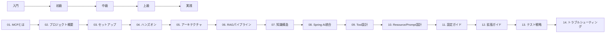

# Nablarch MCP Server 専門家育成シリーズ

> **シリーズ完結**: 全14記事（2026-02-07）

---

## このシリーズについて

このシリーズは、**何も知らないエンジニアが全14記事を読み通してNablarch MCP Serverの専門家になれる**ように設計された体系的なカリキュラムです。

- **入門編**（記事01〜02）: MCPとプロジェクトの背景を理解する
- **初級編**（記事03〜04）: 環境構築とハンズオンで実際に動かす
- **中級編**（記事05〜08）: アーキテクチャ・RAG・知識構造・Spring AI統合を深く学ぶ
- **上級編**（記事09〜13）: Tool/Resource/Prompt設計、設定、拡張、テスト戦略をマスター
- **実践編**（記事14）: トラブルシューティングとロードマップ

想定学習時間: **約6〜7時間**（全記事合計）

---

## 学習パス

---

## 全14記事一覧

| # | タイトル | レベル | 所要時間 | リンク |
|---|---------|--------|----------|--------|
| 01 | MCPとは何か — AIコーディングツールの新標準プロトコル | 入門 | 10-15分 | [記事01](01-what-is-mcp.md) |
| 02 | nablarch-mcp-serverの全体像 — なぜ作ったのか、何ができるのか | 入門 | 15分 | [記事02](02-project-overview.md) |
| 03 | ゼロから始めるセットアップ — 環境構築から動作確認まで | 初級 | 30分 | [記事03](03-setup-guide.md) |
| 04 | 使ってみよう — 10 Tools × 8 Resources × 6 Promptsの実践ガイド | 初級 | 30分 | [記事04](04-hands-on-usage.md) |
| 05 | アーキテクチャ概要 — Spring Boot + MCP + RAGの三位一体 | 中級 | 30分 | [記事05](05-architecture-overview.md) |
| 06 | RAGパイプライン詳解 — 検索・Embedding・リランキングの仕組み | 中級 | 30分 | [記事06](06-rag-pipeline-deep-dive.md) |
| 07 | ナレッジの構造化 — YAML知識ファイルの設計思想と実装 | 中級 | 20-25分 | [記事07](07-knowledge-structure.md) |
| 08 | Spring AI MCP Serverとの統合 — SDKの使い方と内部構造 | 中級〜上級 | 60分 | [記事08](08-spring-ai-mcp-integration.md) |
| 09 | Tool設計と実装パターン — 10 Toolsの設計思想を読み解く | 中級〜上級 | 40分 | [記事09](09-tool-design-patterns.md) |
| 10 | Resource/Prompt設計と実装パターン — 知識の公開とテンプレートの活用 | 中級〜上級 | 40分 | [記事10](10-resource-prompt-patterns.md) |
| 11 | 設定ファイル完全ガイド — application.yaml から pom.xml まで | 中級 | 30分 | [記事11](11-configuration-guide.md) |
| 12 | 拡張ガイド — 新しいTool・Resource・Promptを追加する方法 | 上級 | 60分 | [記事12](12-extension-guide.md) |
| 13 | テスト戦略 — 810件のテストが守る品質の仕組み | 上級 | 30分 | [記事13](13-testing-strategy.md) |
| 14 | トラブルシューティングとロードマップ — 困った時の解決策と今後の展望 | 実践 | 30分 | [記事14](14-troubleshooting-and-roadmap.md) |

---

## トピック別索引

### MCPの基礎
- [記事01: MCPとは何か](01-what-is-mcp.md)
- [記事02: プロジェクト概要](02-project-overview.md)

### 環境構築とハンズオン
- [記事03: セットアップガイド](03-setup-guide.md)
- [記事04: ハンズオン実践ガイド](04-hands-on-usage.md)

### アーキテクチャと内部構造
- [記事05: アーキテクチャ概要](05-architecture-overview.md)
- [記事08: Spring AI MCP統合](08-spring-ai-mcp-integration.md)

### RAGと検索
- [記事06: RAGパイプライン詳解](06-rag-pipeline-deep-dive.md)
- [記事07: 知識構造](07-knowledge-structure.md)

### Tool/Resource/Prompt設計
- [記事09: Tool設計パターン](09-tool-design-patterns.md)
- [記事10: Resource/Prompt設計パターン](10-resource-prompt-patterns.md)

### 設定と拡張
- [記事11: 設定ファイル完全ガイド](11-configuration-guide.md)
- [記事12: 拡張ガイド](12-extension-guide.md)

### テストと運用
- [記事13: テスト戦略](13-testing-strategy.md)
- [記事14: トラブルシューティングとロードマップ](14-troubleshooting-and-roadmap.md)

---

## 対象読者別ガイド

### 駆け出しエンジニア（MCPもNablarchも初めて）
**推奨学習パス**: 記事01 → 02 → 03 → 04 → 05 → 14
- まず入門編・初級編（01〜04）で全体像を把握
- 記事05でアーキテクチャを理解
- 記事14でトラブルシューティングを確認
- 必要に応じて中級編以降に進む

### 中堅エンジニア（Spring Boot経験あり）
**推奨学習パス**: 記事01 → 02 → 05 → 06 → 08 → 09 → 10
- 入門編で背景を把握
- アーキテクチャ・RAG・Spring AI統合を深く学ぶ
- Tool/Resource設計を理解して独自拡張の基礎を身につける

### 上級エンジニア（MCP実装経験者）
**推奨学習パス**: 記事02 → 05 → 08 → 09 → 10 → 12 → 13
- プロジェクト概要とアーキテクチャを確認
- 実装パターンと拡張方法を重点的に学習
- テスト戦略を理解して品質保証の手法を習得

---

## 既存記事について

以下の記事は本シリーズに統合されました。最新版はシリーズ記事を参照してください。

- [nablarch-mcp-server-for-beginners.md](nablarch-mcp-server-for-beginners.md) → 記事01〜04に対応
- [nablarch-mcp-server-for-junior-engineers.md](nablarch-mcp-server-for-junior-engineers.md) → 記事05〜09に対応

---

## 関連リソース

### 公式ドキュメント
- [プロジェクトREADME](../../README.md)
- [MCP公式仕様](https://spec.modelcontextprotocol.io/)
- [Spring AI MCP SDK](https://docs.spring.io/spring-ai/reference/)

### コードリポジトリ
- [GitHub: nablarch-mcp-server](https://github.com/yourusername/nablarch-mcp-server)

---

**執筆日**: 2026-02-07
**最終更新**: 2026-02-07
**ライセンス**: MIT License
