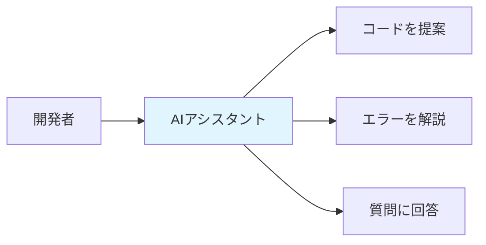
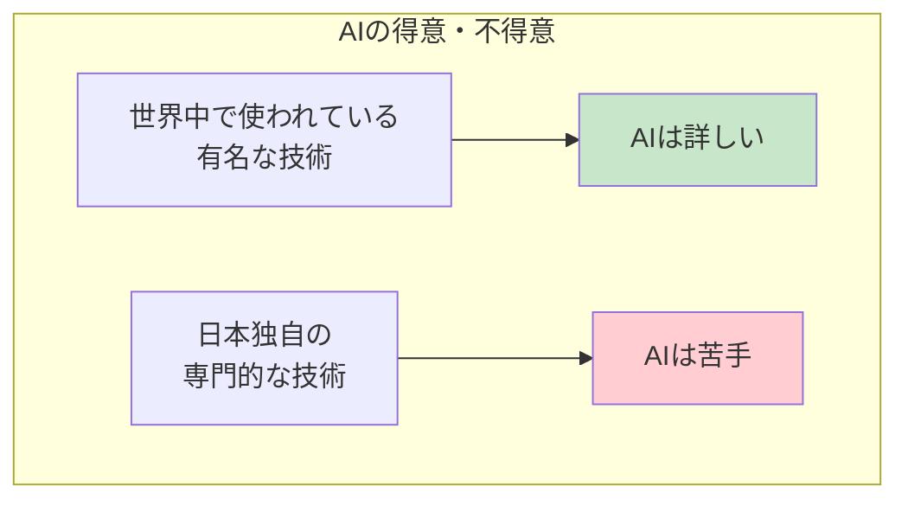
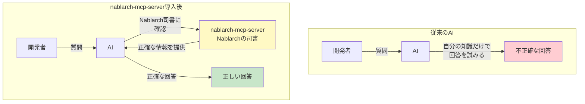
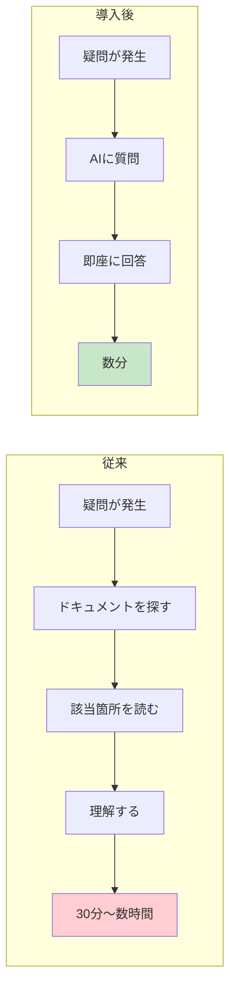
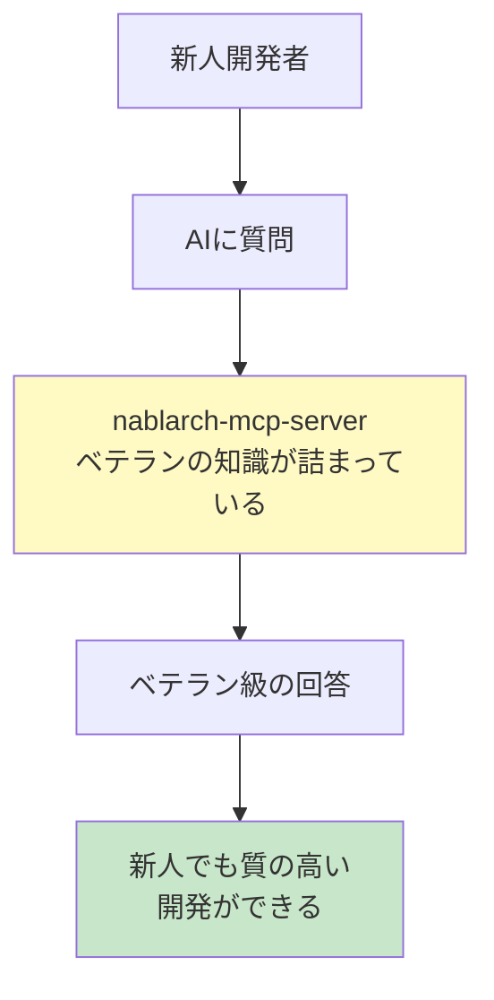
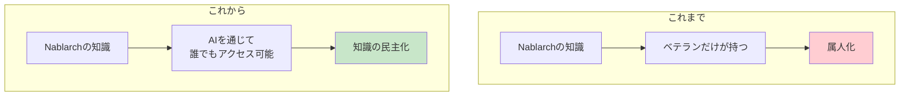

# AIがNablarch開発の「専門家」になる — nablarch-mcp-serverとは

> **注意**: 本記事の内容は[専門家育成シリーズ](INDEX.md)に統合されました。最新版はシリーズ記事を参照してください。

> この記事は、技術的なバックグラウンドがない方（経営層、営業、マーケティング担当者、プロジェクトマネージャーなど）向けに、nablarch-mcp-serverが何をするものなのかを分かりやすく解説します。

---

## 目次

1. [AIがプログラミングを手伝う時代](#1-aiがプログラミングを手伝う時代)
2. [でも「専門知識」がないと困る](#2-でも専門知識がないと困る)
3. [Nablarch開発の悩み](#3-nablarch開発の悩み)
4. [解決策：AIに「Nablarchの専門家」を追加する](#4-解決策aiにnablarchの専門家を追加する)
5. [どんなメリットがあるの？](#5-どんなメリットがあるの)
6. [具体的に何ができるようになる？](#6-具体的に何ができるようになる)
7. [まとめ：AI時代のNablarch開発](#7-まとめai時代のnablarch開発)

---

## 1. AIがプログラミングを手伝う時代

### ChatGPTやClaudeを使ったことはありますか？

最近、AIが私たちの仕事を手伝ってくれる場面が増えています。文章を書いたり、調べものをしたり、アイデアを出したり...。実は**プログラミング**の世界でも、AIが大きな力を発揮しています。



**AIコーディングツール**と呼ばれるこれらのツールは、開発者が「こんなプログラムを作りたい」と伝えると、AIがコードを書いてくれたり、エラーの原因を教えてくれたりします。

代表的なツールには以下のようなものがあります：

| ツール名 | 特徴 |
|---------|------|
| **Claude Code** | Anthropic社のAI「Claude」を使った開発支援ツール |
| **GitHub Copilot** | Microsoft/GitHubが提供するAIペアプログラマー |
| **Cursor** | AIが組み込まれた次世代エディタ |

これらのツールを使うと、**熟練の開発者が隣にいるかのように**、プログラミングの相談ができます。

---

## 2. でも「専門知識」がないと困る

### AIは「知らないこと」には弱い

AIコーディングツールは非常に賢いですが、一つ大きな弱点があります。それは**「学習していないことは知らない」**ということです。

例えるなら...



**世界中で広く使われている技術**（例：Python、JavaScriptなど）については、インターネット上に大量の情報があるため、AIはとても詳しいです。

しかし、**日本独自の技術**や**特定の企業・業界でのみ使われている技術**については、情報が少ないため、AIは正確な回答ができないことがあります。

---

## 3. Nablarch開発の悩み

### 「Nablarch」とは？

Nablarchは、TIS株式会社が開発した**日本の大企業向けシステム開発のための基盤ソフトウェア**です。

銀行、保険会社、官公庁など、「絶対に止まってはいけない」重要なシステムの構築に使われています。日本国内では多くの実績がありますが、**世界的にはあまり知られていない**という特徴があります。

### 情報の少なさが問題に

| 指標 | Nablarch | 参考：Spring Boot（世界的に有名な技術） |
|------|:--------:|:-------------------------:|
| 技術記事の数 | 約14件 | 数万件 |
| Q&Aサイトの投稿 | ほぼ0 | 大量 |
| 求人数 | ほぼ0 | 1,130件以上 |

Nablarchを使っている開発者からは、こんな声が上がっています：

> 「圧倒的に情報がない。マニュアルはあるけど使い方がわからない」
> 「初心者には厳しい。どこから手をつければいいか分からない」

### AIに聞いても...

このような状況なので、AIコーディングツールにNablarchについて質問しても、**間違った答えが返ってくる**ことが多いのです。


例えば：
- 存在しない機能を提案される
- 古いバージョンの書き方を教えられる
- そもそも「分かりません」と言われる

これでは、せっかくのAIツールが活用できません。

---

## 4. 解決策：AIに「Nablarchの専門家」を追加する

### nablarch-mcp-serverの役割

ここで登場するのが **nablarch-mcp-server** です。

一言で言うと、これは**「AIにNablarchの専門知識を教える」ための仕組み**です。

### 図書館の司書に例えると...



**図書館で本を探すとき**を想像してください。

- **司書がいない図書館**では、自分で膨大な本の中から探す必要があります
- **優秀な司書がいる図書館**では、「こういう情報が欲しい」と伝えるだけで、適切な本を見つけてきてくれます

nablarch-mcp-serverは、まさに**「Nablarchの専門司書」**のような存在です。

AIが「Nablarchについて知りたい」と思ったとき、この司書に聞けば、公式ドキュメント、ソースコード、開発ガイドラインなど、**正確で最新の情報**を教えてもらえます。

### どんな情報を持っている？

nablarch-mcp-serverは、以下のようなNablarchの情報を整理して持っています：

| 情報の種類 | 内容 |
|-----------|------|
| **公式ドキュメント** | Nablarchの使い方マニュアル（数百ページ分） |
| **ソースコード** | 113個のプログラム部品（GitHubで公開） |
| **API仕様書** | プログラムの詳細な仕様 |
| **開発標準** | 正しいプログラムの書き方ルール |
| **サンプルコード** | 実際の使用例 |

---

## 5. どんなメリットがあるの？

### メリット1：開発者の「調べる時間」が減る



これまで、開発者がNablarchについて調べものをするときは、膨大なドキュメントの中から該当する情報を探す必要がありました。これには**30分から数時間**かかることも珍しくありませんでした。

nablarch-mcp-serverを使えば、AIに質問するだけで**数分で正確な回答**が得られます。

### メリット2：ミスが減り、品質が上がる

AIが正確なNablarch情報を持っているということは、**間違ったコードを提案される可能性が減る**ということです。

| 項目 | 従来 | 導入後 |
|-----|-----|-------|
| コードの正確性 | AIが間違えることが多い | 正確な提案が増える |
| 設定ファイルの書き方 | 自分で調べる必要あり | AIが正しい書き方を教えてくれる |
| エラーの原因特定 | 経験に頼る | AIが的確に診断 |

### メリット3：新人でもベテランの知識を活用できる



Nablarchは複雑なシステムを構築するための技術です。従来は、使いこなすまでに**長い学習期間**が必要でした。

nablarch-mcp-serverを使えば、新人開発者でもAIを通じて**ベテランエンジニアの知識**にアクセスできます。これにより、チーム全体の生産性が向上します。

### メリット4：教育コストの削減

新しいメンバーがNablarchを学ぶとき、これまでは：
- 先輩が時間を割いて教える
- 分厚いドキュメントを読ませる
- 試行錯誤で覚えさせる

といった方法が取られていました。

AIが**いつでも質問に答えてくれる**ようになれば、先輩の負担が減り、新人も自分のペースで学習を進められます。

---

## 6. 具体的に何ができるようになる？

### 例1：設定ファイルの自動生成

「こんなシステムを作りたい」と伝えるだけで、AIが**正しい設定ファイル**を生成してくれます。

```
開発者：「認証機能付きのWeb APIを作りたい」

AI（nablarch-mcp-server経由）：
「以下の設定ファイルを作成します。
 認証、セキュリティ対策、エラー処理が
 正しい順序で設定されています」
```

### 例2：エラーの原因特定

エラーメッセージを貼り付けるだけで、AIが**Nablarch特有の原因と解決策**を教えてくれます。

```
開発者：「このエラーの原因は？」
（エラーメッセージを貼り付け）

AI（nablarch-mcp-server経由）：
「このエラーは設定ファイルの読み込み順序が
 原因です。以下の手順で解決できます：
 1. ...
 2. ...
 3. ...」
```

### 例3：学習サポート

Nablarchを初めて使う人には、**段階的な学習ガイド**を提供します。

```
開発者：「Nablarchを始めて使います。何から始めれば？」

AI（nablarch-mcp-server経由）：
「以下の順序で学習することをお勧めします：

 Step 1: 基本的な仕組みを理解（30分）
 Step 2: サンプルを動かしてみる（15分）
 Step 3: 簡単なアプリを作る（1時間）
 ...」
```

---

## 7. まとめ：AI時代のNablarch開発

### 開発の「民主化」



nablarch-mcp-serverは、これまで**一部のベテランだけが持っていた知識**を、AIを通じて**誰でも活用できる**ようにします。

これは単なる効率化ではありません。**開発の民主化**です。

### 今後の展望

AIコーディングツールは今後さらに進化していきます。nablarch-mcp-serverのような「専門知識を教える仕組み」があれば、日本独自の技術であっても、**世界最先端のAIの力を最大限に活用**できます。

Nablarchを使った開発プロジェクトにとって、これは大きな競争力になるでしょう。

---

## よくある質問

### Q: 導入にはどれくらいの費用がかかりますか？

nablarch-mcp-serverはオープンソースソフトウェアとして開発されており、ソフトウェア自体は**無償**で利用できます。ただし、AIコーディングツール（Claude Code、GitHub Copilot等）の利用料金は別途必要です。

### Q: セキュリティは大丈夫ですか？

nablarch-mcp-serverは、**公開されているNablarchの情報のみ**を扱います。お客様のソースコードや機密情報がAIに送信されることはありません。

### Q: すぐに使い始められますか？

現在、Phase 1（基本機能）が完成しており、Claude CodeやClaude Desktopですぐにお使いいただけます。より高度な機能は順次追加予定です。

---

> **お問い合わせ**
> nablarch-mcp-serverについてのご質問やご相談は、GitHubリポジトリのIssueまたはDiscussionsをご利用ください。
