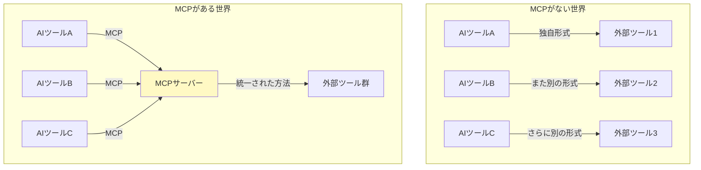
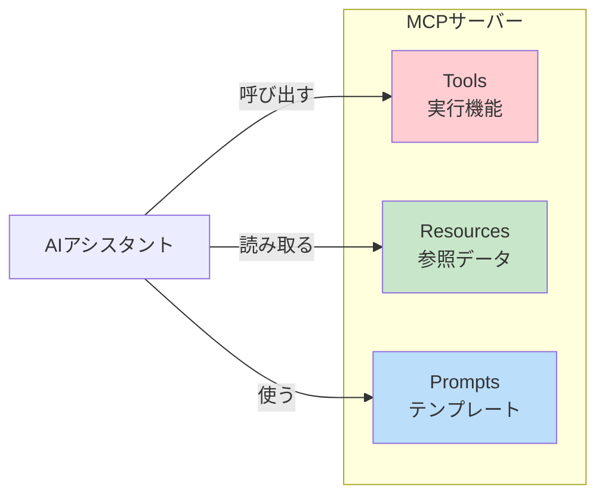
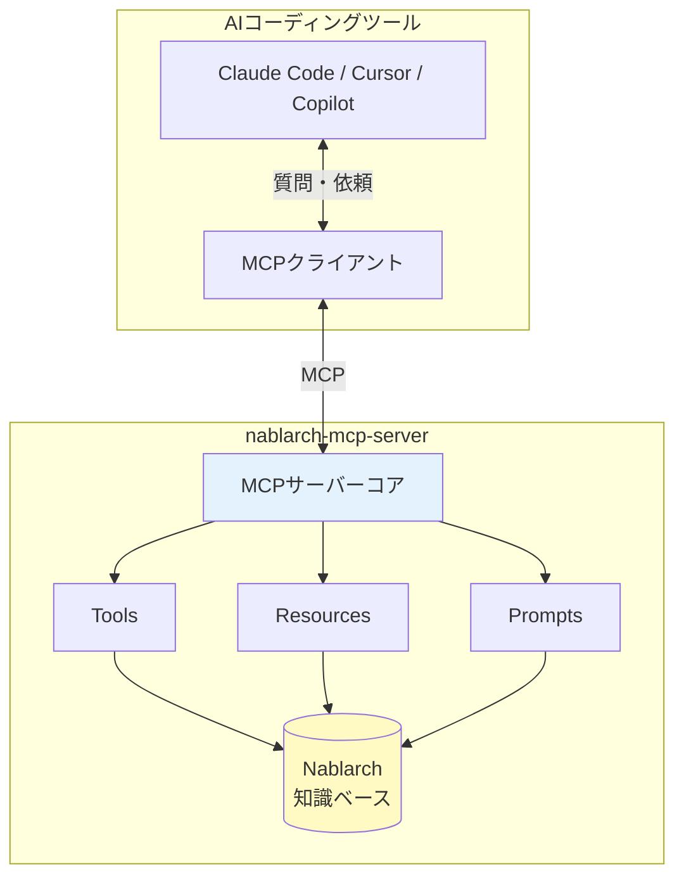
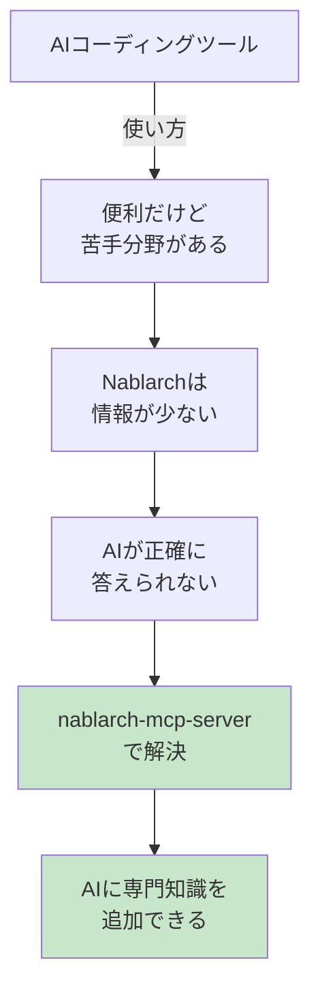

# 駆け出しエンジニアのためのnablarch-mcp-server入門

> **注意**: 本記事の内容は[専門家育成シリーズ](INDEX.md)に統合されました。最新版はシリーズ記事を参照してください。

> この記事は、プログラミング学習中〜実務1-2年目のエンジニア、Nablarchを初めて触る方、
> AIコーディングツールに興味がある初学者を対象としています。
> 前提知識から丁寧に解説し、実際に手を動かして試せるハンズオンも含みます。

---

## 目次

1. [はじめに：この記事で学べること](#1-はじめにこの記事で学べること)
2. [前提知識の整理](#2-前提知識の整理)
   - [AIコーディングツールとは](#21-aiコーディングツールとは)
   - [MCP（Model Context Protocol）とは](#22-mcpmodel-context-protocolとは)
   - [Nablarchフレームワークとは](#23-nablarchフレームワークとは)
3. [問題提起：なぜNablarch開発でAIが苦手なのか](#3-問題提起なぜnablarch開発でaiが苦手なのか)
4. [解決策：nablarch-mcp-serverの仕組み](#4-解決策nablarch-mcp-serverの仕組み)
5. [ハンズオン：実際に動かしてみよう](#5-ハンズオン実際に動かしてみよう)
6. [発展：さらに学ぶために](#6-発展さらに学ぶために)
7. [まとめ](#7-まとめ)

---

## 1. はじめに：この記事で学べること

### この記事の目的

この記事を読むと、以下のことが理解できます。

| 学べること | 説明 |
|-----------|------|
| AIコーディングツールの基礎 | Cursor、Claude Code等のAI開発支援ツールとは何か |
| MCPの概念 | AIとツールを繋ぐ標準プロトコルの仕組み |
| nablarch-mcp-serverの役割 | AIにNablarch知識を与える仕組み |
| 実践的なセットアップ | 実際にツールを動かす方法 |

### 対象読者

- プログラミングを学習中、または実務経験1〜2年のエンジニア
- Nablarchフレームワークを初めて使う方
- 「AIをプログラミングに活用したい」と思っている方
- 技術的な仕組みにも興味がある方

### 読了後にできるようになること

この記事を読み終えると...

- AIコーディングツールの仕組みが説明できる
- MCPとは何かを他の人に教えられる
- nablarch-mcp-serverをセットアップして動作確認できる
- AIを使ったNablarch開発の第一歩が踏み出せる

---

## 2. 前提知識の整理

### 2.1 AIコーディングツールとは

#### そもそも「AIコーディングツール」って何？

**AIコーディングツール**とは、ChatGPTやClaudeのような対話型AIを、プログラミング作業に特化させたツールです。


#### 代表的なツールと特徴

| ツール名 | 提供元 | 特徴 | 公式サイト |
|---------|--------|------|-----------|
| **Claude Code** | Anthropic | CLI（コマンドライン）ベースのAI開発支援 | [claude.ai](https://claude.ai/) |
| **GitHub Copilot** | Microsoft/GitHub | エディタに統合されたAIペアプログラマー | [github.com/features/copilot](https://github.com/features/copilot) |
| **Cursor** | Cursor社 | AIを中心に設計されたコードエディタ | [cursor.sh](https://cursor.sh/) |
| **Claude Desktop** | Anthropic | デスクトップアプリでClaudeを使用 | [claude.ai](https://claude.ai/) |

#### 何ができるの？

これらのツールを使うと、以下のようなことができます。

**1. コードを生成してもらう**
```
あなた: 「ユーザー登録のRESTエンドポイントを作って」
AI: 「以下のコードを作成しました...」（Javaコードを生成）
```

**2. エラーの原因を教えてもらう**
```
あなた: 「このエラーの原因は？NullPointerException at...」
AI: 「このエラーは○○が原因です。修正方法は...」
```

**3. 既存コードの解説を受ける**
```
あなた: 「このコードは何をしているの？」（コードを貼り付け）
AI: 「このコードは△△を行っています。具体的には...」
```

---

### 2.2 MCP（Model Context Protocol）とは

#### MCPを一言で説明すると

**MCP（Model Context Protocol）** は、AIと外部ツールを繋ぐための**標準的な通信ルール**です。

> 「AIとツールの共通言語」のようなものです。

#### もう少し詳しく

MCPは、Anthropic社（Claudeを開発している会社）が2024年11月に発表したオープン標準です。



MCPがあることで：
- **AI側**：どんな外部ツールも同じ方法で使える
- **ツール側**：一度MCP対応すれば、どのAIからも使ってもらえる

#### MCPの3つの構成要素

MCPサーバーは、AIに対して**3種類の機能**を提供できます。

| 構成要素 | 役割 | 例え | 具体例 |
|---------|------|------|--------|
| **Tools** | AIが「実行」できる機能 | 電動工具 | API検索、XML検証 |
| **Resources** | AIが「参照」できるデータ | 参考書 | ハンドラ仕様、開発ガイド |
| **Prompts** | AIへの「テンプレート」 | 定型フォーマット | セットアップ手順、コードレビュー |



---

### 2.3 Nablarchフレームワークとは

#### Nablarchとは

**Nablarch**（ナブラーク）は、TIS株式会社が開発した**業務システム向けのJavaフレームワーク**です。

```
Nablarch = "Nablarch Application Base Architecture"
```

#### どんなシステムで使われている？

銀行、保険会社、官公庁など、**「絶対に止まってはいけない」ミッションクリティカルなシステム**で多く使われています。

| 分野 | 特徴 |
|------|------|
| 金融系 | 銀行の勘定系システム、保険の契約管理 |
| 公共系 | 官公庁の基幹システム |
| 製造業 | 生産管理、在庫管理システム |

#### Nablarchの特徴：ハンドラキュー

Nablarchの最大の特徴は**「ハンドラキュー」**というアーキテクチャです。


**ハンドラキューとは：**
- リクエストを受けてから業務処理に届くまでに、複数の「ハンドラ」を通過する
- 各ハンドラは1つの責務を持つ（文字コード変換、エラー処理、DB接続など）
- ハンドラの**順番が重要**（間違えると動かない！）

このアーキテクチャは非常に強力ですが、**設定が複雑**で、**正しい順序を覚えるのが大変**という課題があります。

---

## 3. 問題提起：なぜNablarch開発でAIが苦手なのか

### AIが学習していない問題

AIコーディングツールは、インターネット上の大量の情報を学習しています。しかし、**Nablarchの情報は圧倒的に少ない**のです。

| 指標 | Nablarch | 参考：Spring Boot |
|------|:--------:|:-----------------:|
| GitHub Stars | 約40 | 約76,000 |
| 技術記事（Qiita等） | 約14件 | 数万件 |
| Stack Overflow | ほぼ0 | 大量 |

### 実際に起きる問題

#### ケース1：間違ったコードを提案される

```
あなた: 「NablarchでDBに接続するコードを書いて」

AI（学習データが少ない場合）:
「以下のコードで接続できます...」
→ 実際には存在しないAPIや、古いバージョンの書き方を提案
```

#### ケース2：ハンドラキューの順序を間違える

```
あなた: 「Webアプリのハンドラキュー設定を作って」

AI（Nablarch知識がない場合）:
「以下のXMLで設定できます...」
→ ハンドラの順序が間違っていて、実行時にエラー
```

#### ケース3：「分かりません」と言われる

```
あなた: 「Nablarchのインターセプタの使い方を教えて」

AI（情報がない場合）:
「申し訳ありませんが、Nablarchの詳細について
十分な情報を持っていません...」
```

### これは開発者のせいではない

この問題は、**AIの学習データにNablarchの情報が少ないこと**が原因です。開発者のスキルとは関係ありません。

だからこそ、**AIにNablarchの知識を追加する仕組み**が必要なのです。

---

## 4. 解決策：nablarch-mcp-serverの仕組み

### nablarch-mcp-serverとは

**nablarch-mcp-server**は、AIコーディングツールに**Nablarchの専門知識を提供する**MCPサーバーです。



### なぜこれで問題が解決するのか

| Before（従来） | After（導入後） |
|----------------|-----------------|
| AIは自分の学習データだけで回答 | AIはnablarch-mcp-serverにも聞ける |
| Nablarchの情報が不足 | 公式ドキュメント・ソースコード・ガイドを参照可能 |
| 間違った提案をしがち | 正確な情報に基づいた提案 |

### 提供される機能

#### Tools（2種類）

AIが「実行」できる機能です。

| Tool名 | 説明 | 使用例 |
|--------|------|--------|
| `search_api` | Nablarch APIの検索 | 「UniversalDaoの使い方を検索」 |
| `validate_handler_queue` | ハンドラキューXMLの検証 | 「この設定が正しいかチェック」 |

**search_api の動作イメージ：**

```
あなた: 「UniversalDaoの使い方を教えて」

AIの内部動作:
1. search_api を呼び出し
2. keyword: "UniversalDao" で検索
3. 知識ベースから関連情報を取得
4. 正確な情報を基に回答を生成

AI: 「UniversalDaoは以下のように使います...（正確なコード例）」
```

#### Resources（12種類）

AIが「参照」できるデータです。

| カテゴリ | URI例 | 内容 |
|---------|-------|------|
| ハンドラ仕様 | `nablarch://handler/web` | Webアプリのハンドラキュー仕様 |
| ハンドラ仕様 | `nablarch://handler/rest` | RESTアプリのハンドラキュー仕様 |
| ハンドラ仕様 | `nablarch://handler/batch` | バッチのハンドラキュー仕様 |
| 開発ガイド | `nablarch://guide/database` | データベースアクセスガイド |
| 開発ガイド | `nablarch://guide/testing` | テストパターンガイド |
| 開発ガイド | `nablarch://guide/handler-queue` | ハンドラキュー設計ガイド |

#### Prompts（6種類）

定型的なタスクのテンプレートです。

| Prompt名 | 用途 |
|----------|------|
| `setup-handler-queue` | ハンドラキュー構成の支援 |
| `create-action` | アクションクラスの生成 |
| `review-config` | XML設定のレビュー |
| `explain-handler` | ハンドラの詳細説明 |
| `migration-guide` | バージョン移行ガイド |
| `best-practices` | ベストプラクティス参照 |

---

## 5. ハンズオン：実際に動かしてみよう

### 前提条件

| 項目 | 必要なもの |
|------|-----------|
| Java | JDK 17以上 |
| Git | 任意のバージョン |
| MCPクライアント | Claude Desktop または MCP Inspector |

### Step 1：リポジトリのクローン

ターミナル（コマンドプロンプト/PowerShell）を開いて、以下を実行します。

```bash
# リポジトリをクローン
git clone https://github.com/kumagoro1202/nablarch-mcp-server.git

# ディレクトリに移動
cd nablarch-mcp-server
```

### Step 2：ビルド

Maven Wrapperを使ってビルドします。

```bash
# macOS / Linux の場合
./mvnw package

# Windows の場合
mvnw.cmd package
```

成功すると、以下にJARファイルが生成されます。

```
target/nablarch-mcp-server-0.1.0-SNAPSHOT.jar
```

### Step 3：動作確認（単体起動）

サーバーが正しく起動するか確認します。

```bash
java -jar target/nablarch-mcp-server-0.1.0-SNAPSHOT.jar
```

起動後、サーバーはJSON-RPCメッセージを待機します。`Ctrl+C` で終了してください。

### Step 4：MCP Inspectorで動作確認

MCP InspectorはMCPサーバーをテストするためのツールです。

```bash
# WSL2上でMCP Inspectorを起動
npx @modelcontextprotocol/inspector java -jar target/nablarch-mcp-server-0.1.0-SNAPSHOT.jar
```

**WSL2環境での注意**:

コマンド実行後、`Server running at http://localhost:5173` と表示されたら、**Windows側（ホスト側）のブラウザ**で以下のURLを開いてください。

```
http://localhost:5173
```

最新のWSL2では自動的にポート転送されるため、Windows側から `localhost:5173` でアクセスできます。もしアクセスできない場合は、WSL2のIPアドレス（`hostname -I | awk '{print $1}'` で確認）を使ってアクセスしてください。

**確認項目：**

1. 左メニュー「**Tools**」を選択
   - `search_api` と `validate_handler_queue` が表示される

2. 左メニュー「**Resources**」を選択
   - 12個のリソースURI（`nablarch://handler/*` など）が表示される

3. 左メニュー「**Prompts**」を選択
   - 6個のプロンプト（`setup-handler-queue` など）が表示される

### Step 5：Toolを実行してみる

MCP Inspectorの **Tools** タブで、実際にToolを実行してみましょう。

**search_api を試す：**

1. `search_api` を選択
2. パラメータを入力：
   - `keyword`: `UniversalDao`
   - `category`: （空欄のまま）
3. 「Execute」をクリック
4. 結果が表示される（UniversalDaoに関する情報）

**validate_handler_queue を試す：**

1. `validate_handler_queue` を選択
2. パラメータを入力：
   - `applicationType`: `web`
   - `handlerQueueXml`:
     ```xml
     <component-configuration>
       <component class="nablarch.fw.web.handler.HttpCharacterEncodingHandler"/>
       <component class="nablarch.fw.handler.GlobalErrorHandler"/>
     </component-configuration>
     ```
3. 「Execute」をクリック
4. 検証結果が表示される（不足ハンドラの警告など）

### Step 6：Claude Desktopと連携（任意）

Claude Desktopをお持ちの場合は、連携設定をしてみましょう。

**設定ファイルの場所：**
- macOS: `~/Library/Application Support/Claude/claude_desktop_config.json`
- Windows: `%APPDATA%\Claude\claude_desktop_config.json`
- Linux: `~/.config/Claude/claude_desktop_config.json`

**設定内容：**

```json
{
  "mcpServers": {
    "nablarch": {
      "command": "java",
      "args": [
        "-jar",
        "/path/to/nablarch-mcp-server-0.1.0-SNAPSHOT.jar"
      ]
    }
  }
}
```

`/path/to/` は実際のJARファイルのパスに置き換えてください。

設定後、Claude Desktopを再起動すると、Nablarchの知識を活用した会話ができるようになります。

---

## 6. 発展：さらに学ぶために

### 関連ドキュメント

| ドキュメント | 内容 | パス |
|-------------|------|------|
| アーキテクチャ設計書 | システム全体の設計 | `docs/02-architecture.md` |
| ユースケース集 | 具体的な使用シーン | `docs/03-use-cases.md` |
| セットアップガイド | 詳細なセットアップ手順 | `docs/07-setup-guide.md` |

### Nablarch公式リソース

| リソース | URL | 説明 |
|---------|-----|------|
| 公式ドキュメント | [nablarch.github.io](https://nablarch.github.io/docs/LATEST/doc/) | Nablarchの公式リファレンス |
| GitHub | [github.com/nablarch](https://github.com/nablarch) | ソースコードと例 |
| Fintan | [fintan.jp](https://fintan.jp/) | TISの技術共有サイト |

### MCP関連リソース

| リソース | URL | 説明 |
|---------|-----|------|
| MCP公式サイト | [modelcontextprotocol.io](https://modelcontextprotocol.io/) | MCP仕様書 |
| MCP Java SDK | [GitHub](https://github.com/modelcontextprotocol/java-sdk) | Java用SDK |

### 次のステップ

1. **Nablarchを学ぶ**
   - 公式ドキュメントの「クイックスタート」を試す
   - サンプルプロジェクトを動かしてみる

2. **MCPを深く理解する**
   - MCP仕様書を読む
   - 他のMCPサーバーの実装を見てみる

3. **貢献する**
   - GitHubでIssueを立てる
   - 改善のPull Requestを送る

---

## 7. まとめ

### 学んだこと

この記事では、以下のことを学びました。



| 項目 | ポイント |
|------|---------|
| AIコーディングツール | コード生成・エラー解説・質問回答ができる便利なツール |
| MCP | AIと外部ツールを繋ぐ標準プロトコル（Tools / Resources / Prompts） |
| Nablarch | 業務システム向けJavaフレームワーク（ハンドラキューが特徴） |
| 課題 | AIにNablarch情報が少なく、正確な回答ができない |
| 解決策 | nablarch-mcp-serverでAIにNablarch知識を追加 |

### 今後の展望

nablarch-mcp-serverは現在も開発が進んでいます。今後は以下の機能が追加される予定です。

| フェーズ | 内容 |
|---------|------|
| Phase 2 | RAG（セマンティック検索）によるより高精度な情報検索 |
| Phase 3 | コード生成・テスト生成ツールの追加 |
| Phase 4 | HTTPトランスポート対応（チーム共有） |

AIとNablarch開発の組み合わせは、まだ始まったばかりです。ぜひ実際に触ってみて、フィードバックをお寄せください！

---

## 用語集

| 用語 | 読み | 説明 |
|------|------|------|
| MCP | エムシーピー | Model Context Protocol。AIと外部ツールを繋ぐ標準規格 |
| MCPサーバー | — | MCPに準拠して機能を提供するサーバープログラム |
| MCPクライアント | — | MCPサーバーに接続して機能を利用するプログラム |
| ハンドラキュー | — | Nablarchのリクエスト処理パイプライン |
| FQCN | エフキューシーエヌ | Fully Qualified Class Name。完全修飾クラス名 |
| STDIO | スタンダードアイオー | Standard Input/Output。標準入出力 |
| JSON-RPC | ジェイソンアールピーシー | JSONを使ったリモートプロシージャコール |
| RAG | ラグ | Retrieval-Augmented Generation。検索拡張生成 |

---

> **フィードバック募集中**
> この記事についてのご質問やご意見は、GitHubリポジトリの [Issues](https://github.com/kumagoro1202/nablarch-mcp-server/issues) または [Discussions](https://github.com/kumagoro1202/nablarch-mcp-server/discussions) にお寄せください。
