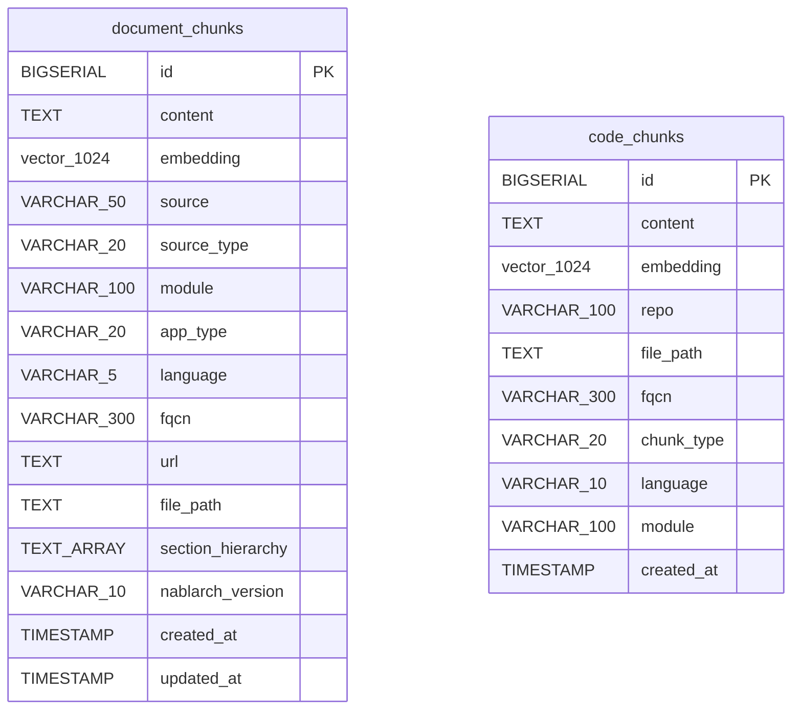

# ベクトルDBスキーマドキュメント

> **WBS**: 2.4.2
> **ステータス**: 完了
> **作成日**: 2026-02-02
> **作成者**: ashigaru1 (subtask_061)
> **関連**: architecture.md §4, hybrid-search.md, embedding-pipeline.md

---

## 目次

1. [概要](#1-概要)
2. [テーブル定義](#2-テーブル定義)
3. [インデックス定義](#3-インデックス定義)
4. [クエリ例](#4-クエリ例)
5. [Flywayマイグレーション](#5-flywayマイグレーション)
6. [パフォーマンスガイド](#6-パフォーマンスガイド)

---

## 1. 概要

### 1.1 目的

本ドキュメントは、Nablarch MCPサーバー Phase 2 のRAGエンジンが使用するベクトルDBスキーマの技術仕様を定義する。PostgreSQL 16 + pgvector拡張を基盤とし、ドキュメントとコードの2種類のチャンクテーブルにEmbeddingベクトルとメタデータを格納する。

### 1.2 技術スタック

| コンポーネント | 技術 | バージョン |
|--------------|------|----------|
| RDBMS | PostgreSQL | 16 |
| ベクトル拡張 | pgvector | pg16イメージ同梱 |
| Embeddingモデル（ドキュメント） | Jina embeddings-v4 | 1024次元 |
| Embeddingモデル（コード） | Voyage-code-3 | 1024次元 |
| マイグレーション | Flyway | Gradle プラグイン |
| コンテナ | Docker Compose | pgvector/pgvector:pg16 |

### 1.3 ER図



---

## 2. テーブル定義

### 2.1 document_chunks テーブル

Nablarchドキュメント（公式ドキュメント、Javadoc、Fintan記事、設定標準等）のテキストチャンクとメタデータを格納する。

| カラム名 | 型 | 制約 | 説明 |
|---------|-----|------|------|
| `id` | `BIGSERIAL` | `PRIMARY KEY` | 自動採番ID |
| `content` | `TEXT` | `NOT NULL` | チャンクテキスト本文 |
| `embedding` | `vector(1024)` | — | Jina v4 で生成した1024次元Embeddingベクトル |
| `source` | `VARCHAR(50)` | `NOT NULL` | ソース種別: `nablarch-document`, `github`, `fintan`, `javadoc` |
| `source_type` | `VARCHAR(20)` | `NOT NULL` | コンテンツ種別: `documentation`, `code`, `javadoc`, `config`, `standard` |
| `module` | `VARCHAR(100)` | — | Mavenモジュール名（例: `nablarch-core-repository`） |
| `app_type` | `VARCHAR(20)` | — | アプリタイプ: `web`, `rest`, `batch`, `messaging`, `common` |
| `language` | `VARCHAR(5)` | — | 言語: `ja`, `en` |
| `fqcn` | `VARCHAR(300)` | — | 完全修飾クラス名（Javadoc/API関連チャンクの場合） |
| `url` | `TEXT` | — | ソースURL |
| `file_path` | `TEXT` | — | リポジトリ内ファイルパス |
| `section_hierarchy` | `TEXT[]` | — | セクション階層（PostgreSQL配列型） |
| `nablarch_version` | `VARCHAR(10)` | `DEFAULT '6u3'` | 対象Nablarchバージョン |
| `created_at` | `TIMESTAMP` | `DEFAULT NOW()` | レコード作成日時 |
| `updated_at` | `TIMESTAMP` | `DEFAULT NOW()` | レコード更新日時 |

**JPA エンティティ**: `com.tis.nablarch.mcp.db.entity.DocumentChunk`

**注意**: `embedding` カラムは pgvector の `vector(1024)` 型であり、JPA標準マッピングの対象外。ネイティブクエリ経由で操作する。`@PrePersist` / `@PreUpdate` で `created_at` / `updated_at` を自動設定。

### 2.2 code_chunks テーブル

Nablarchソースコード（Java, XML, SQL等）のテキストチャンクとメタデータを格納する。

| カラム名 | 型 | 制約 | 説明 |
|---------|-----|------|------|
| `id` | `BIGSERIAL` | `PRIMARY KEY` | 自動採番ID |
| `content` | `TEXT` | `NOT NULL` | コードチャンクテキスト本文 |
| `embedding` | `vector(1024)` | — | Voyage-code-3 で生成した1024次元Embeddingベクトル |
| `repo` | `VARCHAR(100)` | `NOT NULL` | リポジトリ名 |
| `file_path` | `TEXT` | `NOT NULL` | ファイルパス |
| `fqcn` | `VARCHAR(300)` | — | 完全修飾クラス名 |
| `chunk_type` | `VARCHAR(20)` | — | チャンク種別: `class`, `method`, `config`, `test` |
| `language` | `VARCHAR(10)` | — | プログラミング言語: `java`, `xml`, `sql`, `properties` |
| `module` | `VARCHAR(100)` | — | Mavenモジュール名 |
| `created_at` | `TIMESTAMP` | `DEFAULT NOW()` | レコード作成日時 |

**JPA エンティティ**: `com.tis.nablarch.mcp.db.entity.CodeChunk`

**注意**: `embedding` カラムは `document_chunks` と同様にネイティブクエリ経由で操作。`@PrePersist` で `created_at` を自動設定。`updated_at` は持たない（コードチャンクは更新せず再生成する方針）。

### 2.3 テーブル設計のポイント

| 設計判断 | 理由 |
|---------|------|
| 2テーブル分離 | ドキュメントとコードで異なるEmbeddingモデル（Jina v4 / Voyage-code-3）を使用するため |
| `vector(1024)` | 両モデルとも1024次元出力。次元数を統一することでインデックス管理を簡素化 |
| メタデータを個別カラム | JSONB型より個別カラムの方がB-treeインデックスによるフィルタリングが高速 |
| `section_hierarchy` に配列型 | ドキュメントのセクション階層を可変長で保持。GINインデックスで配列要素検索が可能 |
| `nablarch_version` のデフォルト値 | 現行バージョン `6u3` をデフォルトとし、将来のバージョン別管理に備える |

---

## 3. インデックス定義

### 3.1 ベクトルインデックス（ivfflat）

コサイン類似度によるベクトル近似最近傍検索を高速化する。

```sql
-- document_chunks テーブル
CREATE INDEX idx_doc_chunks_embedding ON document_chunks
    USING ivfflat (embedding vector_cosine_ops) WITH (lists = 100);

-- code_chunks テーブル
CREATE INDEX idx_code_chunks_embedding ON code_chunks
    USING ivfflat (embedding vector_cosine_ops) WITH (lists = 100);
```

| パラメータ | 値 | 説明 |
|-----------|-----|------|
| `lists` | 100 | クラスタ数。推定チャンク数（約4万件）の平方根に近い値 |
| `probes` | 10 | 検索時に探索するクラスタ数。`SET ivfflat.probes = 10;` で設定 |
| 演算子クラス | `vector_cosine_ops` | コサイン距離演算子 `<=>` に対応 |

**probesの設定方法**:
```sql
-- セッション単位で設定
SET ivfflat.probes = 10;

-- または接続パラメータで設定
-- spring.datasource.hikari.connection-init-sql=SET ivfflat.probes = 10
```

### 3.2 Full Text Search インデックス（GIN）

BM25キーワード検索を高速化する。PostgreSQL組み込みのFull Text Search機能を利用。

```sql
-- document_chunks テーブル
CREATE INDEX idx_doc_chunks_content_fts ON document_chunks
    USING gin(to_tsvector('english', content));

-- code_chunks テーブル
CREATE INDEX idx_code_chunks_content_fts ON code_chunks
    USING gin(to_tsvector('english', content));
```

| パラメータ | 値 | 説明 |
|-----------|-----|------|
| インデックス種別 | GIN (Generalized Inverted Index) | 転置インデックス。FTSに最適 |
| テキスト検索設定 | `'english'`（初期値） | 将来的に `'japanese'` 辞書（pg_bigm等）に切替予定 |
| 対象カラム | `content` | チャンクテキスト本文 |

**日本語対応の計画**:
マイグレーションV1では `'english'` 設定で作成。ハイブリッド検索設計書（hybrid-search.md §3）に記載の通り、日本語形態素解析が必要な場合は `pg_bigm` 拡張の導入とインデックス再構築を行う。

### 3.3 メタデータフィルタリング用インデックス（B-tree）

ハイブリッド検索時のメタデータフィルタリングを高速化する。

```sql
-- document_chunks テーブル
CREATE INDEX idx_doc_chunks_source ON document_chunks (source);
CREATE INDEX idx_doc_chunks_app_type ON document_chunks (app_type);
CREATE INDEX idx_doc_chunks_module ON document_chunks (module);
CREATE INDEX idx_doc_chunks_fqcn ON document_chunks (fqcn);

-- code_chunks テーブル
CREATE INDEX idx_code_chunks_repo ON code_chunks (repo);
CREATE INDEX idx_code_chunks_chunk_type ON code_chunks (chunk_type);
CREATE INDEX idx_code_chunks_module ON code_chunks (module);
CREATE INDEX idx_code_chunks_fqcn ON code_chunks (fqcn);
```

| テーブル | インデックス | 対象カラム | 主な用途 |
|---------|------------|----------|---------|
| document_chunks | `idx_doc_chunks_source` | `source` | ソース種別フィルタ（`nablarch-document`, `github` 等） |
| document_chunks | `idx_doc_chunks_app_type` | `app_type` | アプリタイプフィルタ（`web`, `batch` 等） |
| document_chunks | `idx_doc_chunks_module` | `module` | モジュール名フィルタ |
| document_chunks | `idx_doc_chunks_fqcn` | `fqcn` | FQCN検索 |
| code_chunks | `idx_code_chunks_repo` | `repo` | リポジトリ名フィルタ |
| code_chunks | `idx_code_chunks_chunk_type` | `chunk_type` | チャンク種別フィルタ（`class`, `method` 等） |
| code_chunks | `idx_code_chunks_module` | `module` | モジュール名フィルタ |
| code_chunks | `idx_code_chunks_fqcn` | `fqcn` | FQCN検索 |

### 3.4 インデックス一覧サマリ

| # | インデックス名 | テーブル | 種別 | 対象 | 目的 |
|---|-------------|---------|------|------|------|
| 1 | `idx_doc_chunks_embedding` | document_chunks | ivfflat | embedding | ベクトル近似最近傍検索 |
| 2 | `idx_code_chunks_embedding` | code_chunks | ivfflat | embedding | ベクトル近似最近傍検索 |
| 3 | `idx_doc_chunks_content_fts` | document_chunks | GIN | content (tsvector) | BM25 Full Text Search |
| 4 | `idx_code_chunks_content_fts` | code_chunks | GIN | content (tsvector) | BM25 Full Text Search |
| 5 | `idx_doc_chunks_source` | document_chunks | B-tree | source | メタデータフィルタ |
| 6 | `idx_doc_chunks_app_type` | document_chunks | B-tree | app_type | メタデータフィルタ |
| 7 | `idx_doc_chunks_module` | document_chunks | B-tree | module | メタデータフィルタ |
| 8 | `idx_doc_chunks_fqcn` | document_chunks | B-tree | fqcn | メタデータフィルタ |
| 9 | `idx_code_chunks_repo` | code_chunks | B-tree | repo | メタデータフィルタ |
| 10 | `idx_code_chunks_chunk_type` | code_chunks | B-tree | chunk_type | メタデータフィルタ |
| 11 | `idx_code_chunks_module` | code_chunks | B-tree | module | メタデータフィルタ |
| 12 | `idx_code_chunks_fqcn` | code_chunks | B-tree | fqcn | メタデータフィルタ |

---

## 4. クエリ例

### 4.1 コサイン類似度検索

pgvectorの `<=>` 演算子はコサイン**距離**（1 - 類似度）を返す。類似度に変換するには `1 - distance` とする。

```sql
-- ドキュメントチャンクのベクトル検索（Top-10）
SET ivfflat.probes = 10;

SELECT
    id,
    content,
    source,
    source_type,
    module,
    1 - (embedding <=> :query_vector) AS cosine_similarity
FROM document_chunks
ORDER BY embedding <=> :query_vector
LIMIT 10;
```

**ベクトル文字列のフォーマット**:
pgvectorは文字列形式のベクトルを受け取る。1024次元の場合:

```sql
-- ベクトル文字列の形式: '[0.123, -0.456, 0.789, ...]'
-- Javaからの設定例:
-- String vectorStr = "[" + String.join(",", Arrays.stream(embedding)
--     .mapToObj(String::valueOf).toArray(String[]::new)) + "]";
-- query.setParameter("query_vector", vectorStr, org.hibernate.type.SqlTypes.OTHER);

SELECT id, content,
    1 - (embedding <=> '[0.0123,-0.0456,0.0789,...<1024値>]'::vector) AS similarity
FROM document_chunks
ORDER BY embedding <=> '[0.0123,-0.0456,0.0789,...<1024値>]'::vector
LIMIT 10;
```

### 4.2 BM25 Full Text Search

PostgreSQL組み込みの `to_tsvector` / `to_tsquery` を使用。`ts_rank_cd` でBM25相当のスコアリングを行う。

```sql
-- キーワード検索（document_chunks）
SELECT
    id,
    content,
    source,
    ts_rank_cd(
        to_tsvector('english', content),
        to_tsquery('english', 'handler & queue & configuration'),
        32  -- normalization: rank / (rank + 1) で [0,1] に正規化
    ) AS bm25_score
FROM document_chunks
WHERE to_tsvector('english', content) @@ to_tsquery('english', 'handler & queue & configuration')
ORDER BY bm25_score DESC
LIMIT 10;
```

**tsqueryの構文**:

| 演算子 | 意味 | 例 |
|--------|------|-----|
| `&` | AND | `'handler & queue'` |
| `\|` | OR | `'handler \| middleware'` |
| `!` | NOT | `'handler & !deprecated'` |
| `<->` | FOLLOWED BY | `'handler <-> queue'` |

### 4.3 ハイブリッド検索（CTE使用）

BM25とベクトル検索を並列実行し、RRF（Reciprocal Rank Fusion）で統合する。

```sql
SET ivfflat.probes = 10;

WITH bm25_results AS (
    SELECT
        id,
        content,
        source,
        ROW_NUMBER() OVER (ORDER BY ts_rank_cd(
            to_tsvector('english', content),
            to_tsquery('english', :query_text),
            32
        ) DESC) AS bm25_rank
    FROM document_chunks
    WHERE to_tsvector('english', content) @@ to_tsquery('english', :query_text)
    LIMIT 50
),
vector_results AS (
    SELECT
        id,
        content,
        source,
        ROW_NUMBER() OVER (ORDER BY embedding <=> :query_vector) AS vector_rank
    FROM document_chunks
    ORDER BY embedding <=> :query_vector
    LIMIT 50
),
rrf_scores AS (
    SELECT
        COALESCE(b.id, v.id) AS id,
        COALESCE(b.content, v.content) AS content,
        COALESCE(b.source, v.source) AS source,
        COALESCE(1.0 / (60 + b.bm25_rank), 0) +
        COALESCE(1.0 / (60 + v.vector_rank), 0) AS rrf_score
    FROM bm25_results b
    FULL OUTER JOIN vector_results v ON b.id = v.id
)
SELECT id, content, source, rrf_score
FROM rrf_scores
ORDER BY rrf_score DESC
LIMIT 10;
```

**RRFパラメータ**: `k=60`（Cormack et al., 2009 推奨値）。詳細は hybrid-search.md §5 を参照。

### 4.4 メタデータフィルタ付き検索

```sql
-- app_type = 'web' かつ module が指定されている場合
SET ivfflat.probes = 10;

SELECT
    id,
    content,
    source,
    app_type,
    module,
    1 - (embedding <=> :query_vector) AS similarity
FROM document_chunks
WHERE app_type = 'web'
  AND module = 'nablarch-fw-web'
ORDER BY embedding <=> :query_vector
LIMIT 10;
```

```sql
-- コードチャンクをチャンク種別でフィルタ
SELECT
    id,
    content,
    repo,
    fqcn,
    1 - (embedding <=> :query_vector) AS similarity
FROM code_chunks
WHERE chunk_type = 'method'
  AND language = 'java'
ORDER BY embedding <=> :query_vector
LIMIT 10;
```

### 4.5 Embedding更新

既存チャンクのEmbeddingを更新する場合。パイプラインの再実行時やモデル変更時に使用。

```sql
-- 単一レコードのEmbedding更新
UPDATE document_chunks
SET embedding = :new_vector::vector,
    updated_at = NOW()
WHERE id = :chunk_id;

-- 特定ソースのEmbeddingを一括クリア（再生成前）
UPDATE document_chunks
SET embedding = NULL,
    updated_at = NOW()
WHERE source = 'nablarch-document';

-- Embeddingが未設定のレコードを取得（バッチ処理用）
SELECT id, content
FROM document_chunks
WHERE embedding IS NULL
ORDER BY id
LIMIT 100;
```

---

## 5. Flywayマイグレーション

### 5.1 マイグレーションファイル一覧

| ファイル | 説明 |
|---------|------|
| `db/init/01_create_extensions.sql` | Docker初期化時に実行。pgvector拡張を有効化 |
| `src/main/resources/db/migration/V1__create_vector_tables.sql` | テーブル・インデックスの作成 |

### 5.2 db/init/01_create_extensions.sql

Docker Composeの `docker-entrypoint-initdb.d` ボリュームマウントにより、コンテナ初回起動時に自動実行される。

```sql
-- pgvector拡張の有効化
CREATE EXTENSION IF NOT EXISTS vector;
```

### 5.3 V1__create_vector_tables.sql

Flywayが管理するマイグレーションファイル。アプリケーション起動時に自動実行される。

**作成されるオブジェクト**:
- テーブル: `document_chunks`, `code_chunks`（2テーブル）
- ivfflatインデックス: `idx_doc_chunks_embedding`, `idx_code_chunks_embedding`（2個）
- GINインデックス: `idx_doc_chunks_content_fts`, `idx_code_chunks_content_fts`（2個）
- B-treeインデックス: 8個（document_chunks 4個 + code_chunks 4個）

合計: 2テーブル + 12インデックス

### 5.4 実行手順

#### Docker環境の起動

```bash
# pgvectorコンテナの起動
docker compose up -d

# ヘルスチェック確認
docker compose ps
# nablarch-mcp-pgvector が healthy であること

# 接続確認
docker compose exec pgvector psql -U nablarch -d nablarch_mcp -c '\dx'
# vector拡張がインストール済みであることを確認
```

#### Flywayマイグレーション実行

```bash
# Gradleタスクで実行
./gradlew flywayMigrate

# マイグレーション状態の確認
./gradlew flywayInfo
```

#### 手動実行（デバッグ用）

```bash
# SQLファイルを直接実行
docker compose exec pgvector psql -U nablarch -d nablarch_mcp \
  -f /path/to/V1__create_vector_tables.sql

# テーブル確認
docker compose exec pgvector psql -U nablarch -d nablarch_mcp -c '\dt'

# インデックス確認
docker compose exec pgvector psql -U nablarch -d nablarch_mcp -c '\di'
```

### 5.5 Docker Compose設定

```yaml
services:
  pgvector:
    image: pgvector/pgvector:pg16
    container_name: nablarch-mcp-pgvector
    environment:
      POSTGRES_DB: nablarch_mcp
      POSTGRES_USER: nablarch
      POSTGRES_PASSWORD: nablarch_dev
    ports:
      - "5432:5432"
    volumes:
      - pgvector-data:/var/lib/postgresql/data
      - ./db/init:/docker-entrypoint-initdb.d
    healthcheck:
      test: ["CMD-SHELL", "pg_isready -U nablarch -d nablarch_mcp"]
      interval: 10s
      timeout: 5s
      retries: 5
      start_period: 30s
```

| 設定 | 値 | 説明 |
|------|-----|------|
| イメージ | `pgvector/pgvector:pg16` | PostgreSQL 16 + pgvector同梱 |
| DB名 | `nablarch_mcp` | MCP Server専用データベース |
| ユーザー | `nablarch` | アプリケーション接続ユーザー |
| ポート | `5432` | ホスト→コンテナのポートマッピング |
| 初期化スクリプト | `./db/init/` → `/docker-entrypoint-initdb.d` | pgvector拡張の自動有効化 |

---

## 6. パフォーマンスガイド

### 6.1 ivfflat vs HNSW の選択基準

pgvectorは2種類のベクトルインデックスをサポートする。

| 特性 | ivfflat | HNSW |
|------|---------|------|
| アルゴリズム | 転置ファイル + フラット検索 | 階層的ナビゲーション可能小世界グラフ |
| 構築速度 | 高速 | 低速（2〜10倍遅い） |
| 検索精度（Recall） | `nprobes` 依存（10 → 約95%） | 高い（> 99%） |
| メモリ使用量 | 少ない | 多い（グラフ構造分） |
| 推奨チャンク数 | < 100K | 任意（大規模向け） |
| インデックス構築前のデータ | 必要（空テーブルでは非効率） | 不要（逐次追加可能） |

**本プロジェクトの選択**: 初期段階ではivfflatを使用（推定チャンク数: 約4万件）。チャンク数が10万件を超える場合、またはRecallが要件を満たさない場合にHNSWへ移行する。

### 6.2 ivfflat の lists / probes 設定指針

#### lists（クラスタ数）

インデックス構築時に設定。データ件数に応じて調整する。

| データ件数 | 推奨 lists | 根拠 |
|-----------|-----------|------|
| < 1,000 | 構築しない | テーブルスキャンの方が速い |
| 1,000 〜 10,000 | 50 | √N ≈ 100、余裕を持たせて50 |
| 10,000 〜 100,000 | **100** | √N ≈ 316、精度と速度のバランス |
| 100,000 〜 1,000,000 | 500-1000 | lists = N / 1000 程度 |

#### probes（探索クラスタ数）

クエリ実行時に設定。Recall（精度）とレイテンシのトレードオフ。

| probes | 推定 Recall | レイテンシ | 用途 |
|--------|-----------|----------|------|
| 1 | 〜70% | 最速 | プロトタイピング |
| **10** | **〜95%** | **標準** | **デフォルト設定** |
| 20 | 〜98% | やや遅い | 高精度要求時 |
| 50 | 〜99.5% | 遅い | 評価・ベンチマーク時 |

### 6.3 VACUUM ANALYZE の推奨

ivfflatインデックスはデータ分布に依存するため、大量のINSERT/UPDATE後にインデックスの再構築を推奨する。

```sql
-- テーブル統計情報の更新
ANALYZE document_chunks;
ANALYZE code_chunks;

-- デッドタプル回収 + 統計更新
VACUUM ANALYZE document_chunks;
VACUUM ANALYZE code_chunks;
```

**実行タイミング**:
- Embeddingパイプラインのバッチ処理完了後
- データの10%以上が更新された場合
- 検索性能の劣化が観測された場合

**ivfflatインデックスの再構築**:

大量データ投入後、クラスタ分布が著しく変わった場合はインデックスを再構築する。

```sql
-- インデックスの再構築（排他ロックが取得される点に注意）
REINDEX INDEX idx_doc_chunks_embedding;
REINDEX INDEX idx_code_chunks_embedding;

-- または CONCURRENTLY で無停止再構築（PostgreSQL 12+）
REINDEX INDEX CONCURRENTLY idx_doc_chunks_embedding;
REINDEX INDEX CONCURRENTLY idx_code_chunks_embedding;
```

### 6.4 パフォーマンス目標

hybrid-search.md §9 で定義されたレイテンシバジェットに基づく。

| 操作 | 目標レイテンシ | 備考 |
|------|-------------|------|
| ベクトル検索（ivfflat, probes=10） | 20-50ms | Top-50取得 |
| BM25検索（GIN） | 10-30ms | Top-50取得 |
| メタデータフィルタ（B-tree） | < 5ms | WHERE句のフィルタ |
| Embedding INSERT（1件） | < 10ms | バッチ処理時 |
| ハイブリッド検索合計 | 60-155ms | BM25 + Vector並列実行 |
