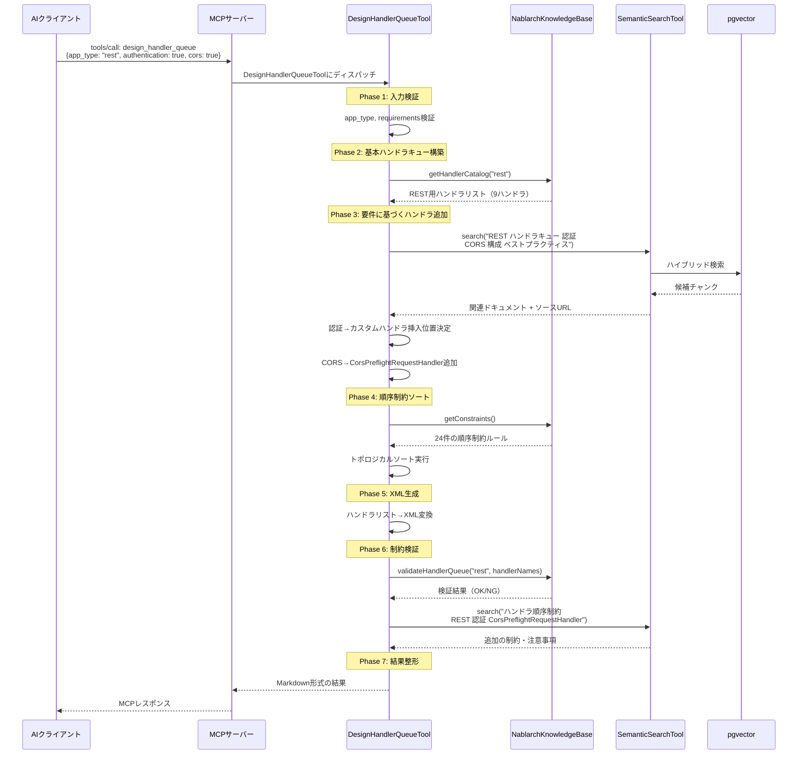

# design_handler_queue Tool 詳細設計書

> **WBS番号**: 3.1.1
> **ステータス**: 設計完了
> **作成日**: 2026-02-03
> **作成者**: ashigaru1 (subtask_060)
> **関連文書**: architecture.md §5.1 Tool 2, use-cases.md §UC1, 05_tool-validate-config.md, 13_semantic-search-tool.md
> **依存タスク**: Phase 1 validate_handler_queue実装済み, Phase 2 semantic_search実装済み

---

## 目次

1. [概要](#1-概要)
2. [Tool定義](#2-tool定義)
3. [入力スキーマ](#3-入力スキーマ)
4. [出力スキーマ](#4-出力スキーマ)
5. [処理フロー](#5-処理フロー)
6. [RAG連携フロー](#6-rag連携フロー)
7. [ハンドラ順序制約ロジック](#7-ハンドラ順序制約ロジック)
8. [XML生成ロジック](#8-xml生成ロジック)
9. [制約検証ロジック](#9-制約検証ロジック)
10. [既存validate_config Toolとの役割分担](#10-既存validate_config-toolとの役割分担)
11. [エラーハンドリング](#11-エラーハンドリング)
12. [クラス設計](#12-クラス設計)
13. [設定パラメータ](#13-設定パラメータ)

---

## 1. 概要

### 1.1 目的

本設計書は、Phase 3で新規追加する `design_handler_queue` MCP Toolの詳細設計を定義する。
このToolは、Nablarchアプリケーションのハンドラキュー構成を**自動設計**するためのツールであり、
アプリケーション種別と要件に基づいて、順序制約を満たすハンドラキューXMLを生成する。

### 1.2 スコープ

- `design_handler_queue` Toolの入出力スキーマ定義
- RAGエンジン（`semantic_search`経由）との連携フロー
- 6アプリタイプ別のハンドラ順序制約ロジック
- `component-configuration.xml` 形式のXML生成ロジック
- 生成XMLに対する制約検証ロジック
- 既存 `validate_handler_queue` Toolとの役割分担

### 1.3 背景

ハンドラキューの設計は、Nablarch開発で最も知識集約的なタスクである。
50以上の標準ハンドラが存在し、複雑な順序制約がある。順序を間違えるとサイレントに障害が発生する。
本Toolは、RAGが検索した制約知識と静的知識ベースのハンドラカタログを組み合わせ、
正確で最適化されたハンドラキューXMLを自動生成する。

---

## 2. Tool定義

### 2.1 Tool概要

| 項目 | 値 |
|------|-----|
| Tool名 | `design_handler_queue` |
| パッケージ | `com.tis.nablarch.mcp.tools` |
| クラス名 | `DesignHandlerQueueTool` |
| 説明 | 指定されたアプリケーションタイプと要件に基づいてNablarchハンドラキュー構成を設計し、XML設定を生成する |
| カテゴリ | 生成系Tool |

### 2.2 対応ユースケース

| UC | ユースケース名 | 本Toolの役割 |
|-----|-------------|-------------|
| UC1 | ハンドラキュー自動設計 | メインTool。要件→XML生成の全工程を担当 |
| UC3 | バッチアプリケーション生成 | generate_codeから呼び出されてバッチ用ハンドラキューを生成 |
| UC4 | 設定XML生成・検証 | ハンドラキュー部分のXML生成を担当 |
| UC10 | ハンドラキュー最適化 | optimize_handler_queueの前段として初期設計を提供 |
| UC12 | REST APIスキャフォールディング | REST API用ハンドラキューを生成 |

---

## 3. 入力スキーマ

### 3.1 パラメータ定義

| パラメータ | 型 | 必須 | デフォルト | 説明 |
|----------|-----|------|----------|------|
| `app_type` | string | ○ | — | アプリケーション種別 |
| `authentication` | boolean | × | false | 認証が必要か |
| `csrf_protection` | boolean | × | false | CSRF対策が必要か |
| `cors` | boolean | × | false | CORS対応が必要か |
| `file_upload` | boolean | × | false | ファイルアップロードが必要か |
| `multi_db` | boolean | × | false | 複数DB接続が必要か |
| `custom_handlers` | string | × | null | カスタムハンドラのFQCN（カンマ区切り） |

### 3.2 app_type の有効値

| 値 | 説明 | ハンドラ数 |
|-----|------|----------|
| `web` | Webアプリケーション（JSP/サーブレット） | 15 |
| `rest` | RESTful Webサービス（JAX-RS） | 9 |
| `batch` | バッチ処理（マルチスレッド） | 12 |
| `resident-batch` | 常駐バッチ（テーブルキューイング） | 13 |
| `mom-messaging` | MOMメッセージング | 13 |
| `http-messaging` | HTTP同期メッセージング | 9 |

### 3.3 JSON Schema

```json
{
  "type": "object",
  "properties": {
    "app_type": {
      "type": "string",
      "enum": ["web", "rest", "batch", "resident-batch", "mom-messaging", "http-messaging"],
      "description": "Nablarch application type for handler queue design."
    },
    "authentication": {
      "type": "boolean",
      "default": false,
      "description": "Whether authentication is required."
    },
    "csrf_protection": {
      "type": "boolean",
      "default": false,
      "description": "Whether CSRF protection is required."
    },
    "cors": {
      "type": "boolean",
      "default": false,
      "description": "Whether CORS support is required."
    },
    "file_upload": {
      "type": "boolean",
      "default": false,
      "description": "Whether file upload support is required."
    },
    "multi_db": {
      "type": "boolean",
      "default": false,
      "description": "Whether multiple database connections are required."
    },
    "custom_handlers": {
      "type": "string",
      "description": "Comma-separated FQCNs of custom handlers to include."
    }
  },
  "required": ["app_type"]
}
```

---

## 4. 出力スキーマ

### 4.1 レスポンス構造

本ToolはMarkdown形式のテキストとして結果を返却する。
内部的には以下の構造化データを生成し、Markdown形式にフォーマットする。

```json
{
  "app_type": "rest",
  "handler_queue": [
    {
      "order": 1,
      "name": "HttpCharacterEncodingHandler",
      "fqcn": "nablarch.fw.web.handler.HttpCharacterEncodingHandler",
      "role": "リクエスト・レスポンスの文字エンコーディングを設定",
      "thread": "main",
      "required": true
    }
  ],
  "xml_config": "<list name=\"handlerQueue\">...</list>",
  "ordering_notes": [
    "GlobalErrorHandlerはJaxRsResponseHandlerより前に配置し、全例外を捕捉する",
    "CorsPreflightRequestHandlerはJaxRsResponseHandlerより前に配置し、OPTIONSリクエストを処理する"
  ],
  "source_references": [
    "https://nablarch.github.io/docs/LATEST/doc/application_framework/application_framework/web_service/rest/architecture.html"
  ]
}
```

### 4.2 MCP Tool応答フォーマット

AIアシスタントに返却するMarkdown形式:

```markdown
## ハンドラキュー設計結果

**アプリタイプ**: rest
**要件**: 認証: あり, CORS: あり, CSRF: なし

### ハンドラキュー (9ハンドラ)

| # | ハンドラ名 | FQCN | 役割 | スレッド | 必須 |
|---|-----------|------|------|---------|------|
| 1 | HttpCharacterEncodingHandler | nablarch.fw.web.handler.HttpCharacterEncodingHandler | 文字エンコーディング設定 | main | ○ |
| 2 | ... | ... | ... | ... | ... |

### XML設定

```xml
<list name="handlerQueue">
  <component class="nablarch.fw.web.handler.HttpCharacterEncodingHandler"/>
  ...
</list>
```

### 順序に関する注意事項

1. GlobalErrorHandlerはJaxRsResponseHandlerより前に配置...
2. ...

### 参考ドキュメント

- https://nablarch.github.io/...
```

---

## 5. 処理フロー

### 5.1 全体フロー

```
design_handler_queue Tool 呼び出し
    │
    ▼
┌──────────────────────────────────────────────────────────┐
│ Phase 1: 入力検証                                         │
│                                                           │
│  - app_type の有効値チェック                               │
│  - requirements の型チェック                               │
│  - custom_handlers のFQCN形式チェック                      │
└──────────────────────┬───────────────────────────────────┘
                       │
                       ▼
┌──────────────────────────────────────────────────────────┐
│ Phase 2: 基本ハンドラキュー構築                             │
│                                                           │
│  ┌────────────────────────────────────────┐              │
│  │ 静的知識ベース参照                      │              │
│  │  handler-catalog.yaml                   │              │
│  │  → app_type に対応するハンドラリスト取得  │              │
│  │  → 必須ハンドラを基本キューに含める      │              │
│  └────────────────────┬───────────────────┘              │
│                       │                                   │
│  出力: 基本ハンドラキュー（必須ハンドラのみ）              │
└──────────────────────┬───────────────────────────────────┘
                       │
                       ▼
┌──────────────────────────────────────────────────────────┐
│ Phase 3: 要件に基づくハンドラ追加                           │
│                                                           │
│  ┌────────────────────────────────────────┐              │
│  │ RAG検索（semantic_search経由）          │              │
│  │  → 認証: JwtAuthHandler等の推奨検索     │              │
│  │  → CORS: CorsPreflightRequestHandler   │              │
│  │  → CSRF: CsrfTokenVerificationHandler  │              │
│  │  → ファイルアップロード: MultipartHandler│              │
│  │  → マルチDB: 追加DbConnectionMgmtHandler│              │
│  │  → カスタムハンドラ: 指定FQCNを挿入     │              │
│  └────────────────────┬───────────────────┘              │
│                       │                                   │
│  出力: 要件反映済みハンドラリスト（未ソート）              │
└──────────────────────┬───────────────────────────────────┘
                       │
                       ▼
┌──────────────────────────────────────────────────────────┐
│ Phase 4: 順序制約に基づくソート                             │
│                                                           │
│  ┌────────────────────────────────────────┐              │
│  │ トポロジカルソート                      │              │
│  │  handler-constraints.yaml の制約適用    │              │
│  │  → must_be_outer: 外殻配置             │              │
│  │  → must_be_inner: 内殻配置             │              │
│  │  → must_before / must_after: 相対順序   │              │
│  └────────────────────┬───────────────────┘              │
│                       │                                   │
│  出力: 順序確定済みハンドラリスト                          │
└──────────────────────┬───────────────────────────────────┘
                       │
                       ▼
┌──────────────────────────────────────────────────────────┐
│ Phase 5: XML生成                                          │
│                                                           │
│  順序確定リスト → component-configuration.xml形式          │
│  → <list name="handlerQueue"> ... </list>                 │
│  → 各ハンドラのプロパティ設定を含む                        │
└──────────────────────┬───────────────────────────────────┘
                       │
                       ▼
┌──────────────────────────────────────────────────────────┐
│ Phase 6: 制約検証                                         │
│                                                           │
│  生成XMLに対して validate_handler_queue 相当のチェック      │
│  → 順序制約違反がないことを検証                            │
│  → 違反があればPhase 4に戻りリトライ（最大1回）            │
└──────────────────────┬───────────────────────────────────┘
                       │
                       ▼
┌──────────────────────────────────────────────────────────┐
│ Phase 7: 結果整形                                         │
│                                                           │
│  ハンドラリスト + XML + ordering_notes + 参考URL           │
│  → Markdown形式にフォーマット                              │
└──────────────────────────────────────────────────────────┘
```

---

## 6. RAG連携フロー

### 6.1 RAG検索タイミング

本Toolは以下の2つのタイミングでRAG検索を実行する。

| タイミング | 検索目的 | 検索クエリ例 |
|----------|---------|------------|
| Phase 3: 要件→ハンドラマッピング | 要件に対応するハンドラの推奨パターン検索 | "REST API 認証 ハンドラキュー 構成 ベストプラクティス" |
| Phase 6: 制約検証補強 | 生成XMLに関連する追加の制約・注意事項検索 | "ハンドラ順序制約 REST CorsPreflightRequestHandler" |

### 6.2 シーケンス図



### 6.3 RAG検索パラメータ

#### Phase 3: 要件→ハンドラマッピング検索

```java
// SemanticSearchTool相当の内部呼び出し
String query = buildRequirementsQuery(appType, requirements);
// 例: "REST ハンドラキュー 認証 CORS 構成 ベストプラクティス"

SearchFilters filters = new SearchFilters(
    appType,    // app_type フィルタ
    null,       // module
    null,       // source
    null,       // sourceType
    null        // language
);

List<SearchResult> results = hybridSearchService.search(
    query, filters, CANDIDATE_K, SearchMode.HYBRID);
```

#### Phase 6: 制約検証補強検索

```java
String query = buildConstraintQuery(appType, handlerNames);
// 例: "ハンドラ順序制約 REST CorsPreflightRequestHandler CsrfTokenVerificationHandler"

List<SearchResult> results = hybridSearchService.search(
    query,
    new SearchFilters(appType, null, "nablarch-document", "documentation", null),
    5,
    SearchMode.HYBRID);
```

### 6.4 RAG非可用時のフォールバック

RAGエンジン（PostgreSQL/pgvector）が利用できない場合、静的知識ベース（YAML）のみで
ハンドラキューを構築する。RAG検索は追加情報の取得に使用しており、
基本的なハンドラキュー設計は静的知識ベースだけで完結可能である。

| コンポーネント | 可用時 | 非可用時 |
|-------------|--------|---------|
| handler-catalog.yaml | ○ 使用 | ○ 使用 |
| handler-constraints.yaml | ○ 使用 | ○ 使用 |
| RAG検索（要件マッピング） | ○ ベストプラクティス参照 | × フォールバック: 静的マッピングテーブル使用 |
| RAG検索（制約補強） | ○ 追加注意事項取得 | × フォールバック: 静的制約のみ |

---

## 7. ハンドラ順序制約ロジック

### 7.1 制約タイプ

| 制約タイプ | 説明 | 適用方法 |
|----------|------|---------|
| `must_be_outer` | キューの外殻（先頭側）に配置 | ソート時に最小オーダーを割り当て |
| `must_be_inner` | キューの内殻（末尾側）に配置 | ソート時に最大オーダーを割り当て |
| `must_before` | 指定ハンドラより前に配置 | トポロジカルソートの有向辺として表現 |
| `must_after` | 指定ハンドラより後に配置 | トポロジカルソートの有向辺として表現 |
| `conditional` | 条件付きで配置（要件依存） | 要件に該当する場合のみキューに追加 |

### 7.2 アプリタイプ別の主要制約パターン

#### Web アプリケーション

```
HttpCharacterEncodingHandler        ← must_be_outer
  ↓
ThreadContextClearHandler
  ↓
GlobalErrorHandler                  ← must_be_outer
  ↓
HttpResponseHandler                 ← must_after: GlobalErrorHandler
  ↓
SecureHandler                       ← must_after: HttpResponseHandler
  ↓
HttpAccessLogHandler                ← must_after: HttpResponseHandler
  ↓
MultipartHandler                    ← conditional: file_upload
  ↓
SessionStoreHandler
  ↓
NormalizationHandler                ← must_before: DbConnectionManagementHandler
  ↓
ThreadContextHandler                ← must_before: DbConnectionManagementHandler
  ↓
DbConnectionManagementHandler       ← must_before: TransactionManagementHandler
  ↓
TransactionManagementHandler        ← must_before: PackageMapping
  ↓
CsrfTokenVerificationHandler       ← conditional: csrf_protection
  ↓
PackageMapping                      ← must_be_inner
```

#### REST アプリケーション

```
HttpCharacterEncodingHandler        ← must_be_outer
  ↓
ThreadContextClearHandler
  ↓
GlobalErrorHandler                  ← must_be_outer
  ↓
CorsPreflightRequestHandler         ← conditional: cors, must_before: JaxRsResponseHandler
  ↓
JaxRsResponseHandler                ← must_after: GlobalErrorHandler
  ↓
ThreadContextHandler                ← must_before: DbConnectionManagementHandler
  ↓
JaxRsAccessLogHandler
  ↓
CsrfTokenVerificationHandler       ← conditional: csrf_protection
  ↓
DbConnectionManagementHandler       ← must_before: TransactionManagementHandler
  ↓
TransactionManagementHandler
  ↓
[カスタム認証ハンドラ]               ← conditional: authentication
  ↓
PackageMapping                      ← must_be_inner
```

#### バッチ アプリケーション

```
【メインスレッド】
StatusCodeConvertHandler
  ↓
ThreadContextClearHandler
  ↓
GlobalErrorHandler                  ← must_be_outer
  ↓
DuplicateProcessCheckHandler        ← must_after: GlobalErrorHandler
  ↓
ThreadContextHandler
  ↓
DbConnectionManagementHandler       ← must_before: TransactionManagementHandler (main)
  ↓
TransactionManagementHandler        ← main thread
  ↓
RequestPathJavaPackageMapping       ← must_be_inner (main)
  ↓
MultiThreadExecutionHandler         ← must_after: DbConnectionManagementHandler

【サブスレッド】
RetryHandler                        ← must_after: MultiThreadExecutionHandler
  ↓
DbConnectionManagementHandler       ← sub thread
  ↓
TransactionManagementHandler        ← sub thread
  ↓
LoopHandler                         ← must_after: MultiThreadExecutionHandler
  ↓
DataReadHandler                     ← must_be_inner
```

#### メッセージング（MOM / 常駐バッチ）

```
【メインスレッド】
StatusCodeConvertHandler
  ↓
ThreadContextClearHandler
  ↓
GlobalErrorHandler
  ↓
ThreadContextHandler
  ↓
DbConnectionManagementHandler       ← main thread
  ↓
TransactionManagementHandler        ← main thread
  ↓
ProcessStopHandler                  ← must_before: RequestThreadLoopHandler
  ↓
RequestThreadLoopHandler            ← must_before: MultiThreadExecutionHandler
  ↓
MultiThreadExecutionHandler

【サブスレッド】
RetryHandler
  ↓
DbConnectionManagementHandler       ← sub thread
  ↓
TransactionManagementHandler        ← sub thread
  ↓
LoopHandler
  ↓
DataReadHandler                     ← must_be_inner
```

### 7.3 トポロジカルソートアルゴリズム

```
入力: ハンドラリスト H, 制約セット C

1. 有向グラフ G を構築:
   for each constraint c in C:
     if c.type == must_before:
       G.addEdge(c.handler, c.target)  // handler → target
     if c.type == must_after:
       G.addEdge(c.target, c.handler)  // target → handler

2. must_be_outer ハンドラに最小優先度を設定
3. must_be_inner ハンドラに最大優先度を設定

4. Kahnのアルゴリズムでトポロジカルソート:
   queue = [入次数0のノード]
   result = []
   while queue is not empty:
     node = queue.dequeue() (優先度順)
     result.append(node)
     for each neighbor of node:
       decrement in-degree
       if in-degree == 0: queue.enqueue(neighbor)

5. 循環依存チェック:
   if result.size() != H.size():
     error: 循環依存が存在

6. return result
```

---

## 8. XML生成ロジック

### 8.1 生成フォーマット

```xml
<!-- {app_type} アプリケーション用ハンドラキュー -->
<!-- 要件: 認証={authentication}, CORS={cors}, CSRF={csrf_protection} -->
<list name="handlerQueue">
  <component class="{handler.fqcn}"/>
  <!-- プロパティ付きハンドラの例 -->
  <component class="nablarch.fw.jaxrs.CorsPreflightRequestHandler">
    <property name="allowOrigins">
      <list><value>*</value></list>
    </property>
  </component>
  <!-- カスタムハンドラの例 -->
  <!-- カスタム: {custom_handler_description} -->
  <component class="{custom_handler_fqcn}"/>
  <!-- ルーティング -->
  <component-ref name="routesMapping"/>
</list>
```

### 8.2 XML生成ルール

| ルール | 説明 |
|-------|------|
| ルーティングハンドラ | `PackageMapping` / `RequestPathJavaPackageMapping` は `<component-ref name="routesMapping"/>` として出力 |
| プロパティ付きハンドラ | CORS、セッション設定等はプロパティを含めて出力 |
| カスタムハンドラ | コメント付きで `<component class="..."/>` として出力 |
| バッチのスレッド分離 | メインスレッド/サブスレッドの境界にコメントを挿入 |
| インデント | スペース2文字のインデント |

### 8.3 プロパティテンプレート

要件に応じてプロパティを自動付与するハンドラ:

| ハンドラ | 要件 | 自動付与プロパティ |
|---------|------|-----------------|
| CorsPreflightRequestHandler | cors=true | `allowOrigins`, `allowHeaders`, `allowMethods` |
| HttpCharacterEncodingHandler | 常時 | `defaultEncoding=UTF-8` |
| MultipartHandler | file_upload=true | `maxFileSize` |
| SessionStoreHandler | Web系 | `cookieName`, `cookieSecure` |
| DbConnectionManagementHandler | multi_db=true | `connectionFactory`, `connectionName` （2つ出力） |

---

## 9. 制約検証ロジック

### 9.1 検証項目

生成したハンドラキューXMLに対して、以下の検証を実行する。

| # | 検証項目 | 重要度 | 検証方法 |
|---|---------|--------|---------|
| 1 | 必須ハンドラの存在 | ERROR | handler-catalog.yaml の required=true と照合 |
| 2 | 順序制約の遵守 | ERROR | handler-constraints.yaml の must_before/must_after と照合 |
| 3 | 互換性チェック | WARNING | handler-constraints.yaml の incompatible_with と照合 |
| 4 | スレッド配置チェック | ERROR | バッチ/メッセージングでメイン/サブスレッドの境界が正しいか |
| 5 | ルーティングハンドラの末尾配置 | ERROR | PackageMapping/RequestPathJavaPackageMappingが最後か |

### 9.2 検証フロー

```java
/**
 * 生成したハンドラキューを検証する。
 *
 * @param appType アプリケーション種別
 * @param orderedHandlers 順序確定済みハンドラリスト
 * @return 検証結果
 */
public ValidationResult validate(String appType, List<HandlerEntry> orderedHandlers) {
    List<String> errors = new ArrayList<>();
    List<String> warnings = new ArrayList<>();

    // 1. 必須ハンドラチェック
    checkRequiredHandlers(appType, orderedHandlers, errors);

    // 2. 順序制約チェック
    checkOrderingConstraints(orderedHandlers, errors);

    // 3. 互換性チェック
    checkCompatibility(orderedHandlers, warnings);

    // 4. スレッド配置チェック（バッチ/メッセージングのみ）
    if (isBatchOrMessaging(appType)) {
        checkThreadBoundary(orderedHandlers, errors);
    }

    // 5. ルーティング末尾チェック
    checkRoutingPosition(orderedHandlers, errors);

    return new ValidationResult(errors.isEmpty(), errors, warnings);
}
```

### 9.3 検証失敗時のリトライ

制約検証でERRORが検出された場合、以下のリトライを行う。

1. 検出された制約違反を元にハンドラ順序を修正
2. 再度トポロジカルソートを実行
3. 再検証
4. 2回目の検証でもERRORが残る場合、エラー情報をordering_notesに含めてユーザーに返却

---

## 10. 既存validate_config Toolとの役割分担

### 10.1 役割比較

| 観点 | design_handler_queue | validate_handler_queue |
|------|---------------------|----------------------|
| **目的** | ハンドラキューを**新規設計**する | 既存のハンドラキューXMLを**検証**する |
| **入力** | app_type + 要件（boolean） | 既存のXML文字列 |
| **出力** | 完全なハンドラキューXML + 説明 | 検証結果（エラー/警告リスト） |
| **ユースケース** | 新規プロジェクト、新規アプリ設計 | 既存設定のレビュー、デプロイ前検証 |
| **RAG使用** | あり（ベストプラクティス検索） | なし（Phase 1は静的知識のみ） |
| **制約データ参照** | handler-catalog + handler-constraints | handler-catalog + handler-constraints |

### 10.2 内部連携

`design_handler_queue` は内部でPhase 6（制約検証）において、
`NablarchKnowledgeBase.validateHandlerQueue()` を呼び出す。
これは `validate_handler_queue` Toolと同じ検証ロジックを使用する。

```
design_handler_queue Tool
  │
  ├─ Phase 2-4: ハンドラキュー構築（独自ロジック）
  │
  └─ Phase 6: 制約検証
       └─ NablarchKnowledgeBase.validateHandlerQueue()  ← 共通
              ↑
validate_handler_queue Tool
  └─ NablarchKnowledgeBase.validateHandlerQueue()  ← 共通
```

### 10.3 使い分けガイド

| シナリオ | 推奨Tool |
|---------|---------|
| 新規プロジェクトでハンドラキューを設計したい | `design_handler_queue` |
| 既存XMLの正しさを確認したい | `validate_handler_queue` |
| 既存XMLを最適化したい | `optimize_handler_queue`（Phase 3） |
| カスタムハンドラを追加したい | `design_handler_queue`（custom_handlers指定） |

---

## 11. エラーハンドリング

### 11.1 エラーパターンと応答

| エラー | 応答 | ログレベル |
|-------|------|----------|
| app_type が null/blank | "アプリケーションタイプを指定してください（web, rest, batch, resident-batch, mom-messaging, http-messaging）。" | DEBUG |
| app_type が不正値 | "エラー: 不明なアプリケーションタイプ: {value}。有効値: web, rest, batch, resident-batch, mom-messaging, http-messaging" | DEBUG |
| custom_handlers のFQCNが不正 | "警告: カスタムハンドラ '{fqcn}' のFQCN形式が不正です。スキップします。" | WARN |
| RAG検索失敗 | 静的知識ベースにフォールバック。結果に "注意: RAG検索が利用できないため、静的知識ベースのみで設計しています。" を付記 | WARN |
| トポロジカルソートで循環依存検出 | "エラー: ハンドラ間に循環依存が検出されました: {cycle}。カスタムハンドラの制約を確認してください。" | ERROR |
| 制約検証失敗（リトライ後も） | XML + エラーリストを返却。"注意: 以下の制約違反を解消できませんでした。手動で修正してください。" | WARN |
| NablarchKnowledgeBase初期化失敗 | "エラー: 知識ベースの初期化に失敗しました。サーバー管理者に連絡してください。" | ERROR |

### 11.2 部分的成功

RAG検索が失敗しても、静的知識ベースのみでハンドラキューを生成できる場合は、
結果を返却しつつ、制限事項を明記する。

---

## 12. クラス設計

### 12.1 パッケージ構造

```
com.tis.nablarch.mcp.tools/
├── DesignHandlerQueueTool.java        ← 本設計書のメインクラス
├── SearchApiTool.java                 ← Phase 1 既存
├── ValidateHandlerQueueTool.java      ← Phase 1 既存
└── SemanticSearchTool.java            ← Phase 2 既存（rag/tools/から移設予定）

com.tis.nablarch.mcp.tools.handlerqueue/
├── HandlerQueueDesigner.java          ← ハンドラキュー設計ロジック
├── HandlerQueueSorter.java            ← トポロジカルソート
├── HandlerQueueXmlGenerator.java      ← XML生成
├── HandlerQueueValidator.java         ← 制約検証（KnowledgeBase委譲）
├── RequirementsMapper.java            ← 要件→ハンドラマッピング
└── model/
    ├── HandlerEntry.java              ← ハンドラエントリDTO
    ├── DesignRequest.java             ← 設計リクエストDTO
    ├── DesignResult.java              ← 設計結果DTO
    └── ValidationResult.java          ← 検証結果DTO
```

### 12.2 DesignHandlerQueueTool クラス

```java
package com.tis.nablarch.mcp.tools;

import com.tis.nablarch.mcp.knowledge.NablarchKnowledgeBase;
import com.tis.nablarch.mcp.rag.search.HybridSearchService;
import com.tis.nablarch.mcp.tools.handlerqueue.HandlerQueueDesigner;
import org.springframework.ai.tool.annotation.Tool;
import org.springframework.ai.tool.annotation.ToolParam;
import org.springframework.stereotype.Service;

/**
 * MCPツール: design_handler_queue。
 *
 * <p>指定されたアプリケーションタイプと要件に基づいて、
 * Nablarchハンドラキュー構成を自動設計し、XML設定を生成する。</p>
 *
 * <p>静的知識ベース（handler-catalog.yaml, handler-constraints.yaml）と
 * RAG検索（semantic_search相当）を組み合わせ、順序制約を満たす
 * 最適なハンドラキューを生成する。</p>
 */
@Service
public class DesignHandlerQueueTool {

    private final HandlerQueueDesigner designer;

    /**
     * コンストラクタ。
     *
     * @param designer ハンドラキュー設計ロジック
     */
    public DesignHandlerQueueTool(HandlerQueueDesigner designer) {
        this.designer = designer;
    }

    /**
     * ハンドラキュー構成を設計する。
     *
     * @param appType アプリケーション種別（web, rest, batch, resident-batch, mom-messaging, http-messaging）
     * @param authentication 認証が必要か
     * @param csrfProtection CSRF対策が必要か
     * @param cors CORS対応が必要か
     * @param fileUpload ファイルアップロードが必要か
     * @param multiDb 複数DB接続が必要か
     * @param customHandlers カスタムハンドラのFQCN（カンマ区切り）
     * @return ハンドラキュー設計結果（Markdown形式）
     */
    @Tool(description = "Design a Nablarch handler queue configuration based on the "
            + "specified application type and requirements. Generates a complete XML "
            + "configuration with proper handler ordering. Use this when setting up "
            + "a new Nablarch application or adding features that require handler "
            + "queue changes.")
    public String designHandlerQueue(
            @ToolParam(description = "Application type: web, rest, batch, resident-batch, "
                    + "mom-messaging, http-messaging")
            String appType,
            @ToolParam(description = "Whether authentication is required")
            Boolean authentication,
            @ToolParam(description = "Whether CSRF protection is required")
            Boolean csrfProtection,
            @ToolParam(description = "Whether CORS support is required")
            Boolean cors,
            @ToolParam(description = "Whether file upload is required")
            Boolean fileUpload,
            @ToolParam(description = "Whether multiple DB connections are required")
            Boolean multiDb,
            @ToolParam(description = "Comma-separated FQCNs of custom handlers")
            String customHandlers) {

        // 入力検証
        if (appType == null || appType.isBlank()) {
            return "アプリケーションタイプを指定してください"
                    + "（web, rest, batch, resident-batch, mom-messaging, http-messaging）。";
        }

        // 設計実行
        return designer.design(
                appType.trim().toLowerCase(),
                Boolean.TRUE.equals(authentication),
                Boolean.TRUE.equals(csrfProtection),
                Boolean.TRUE.equals(cors),
                Boolean.TRUE.equals(fileUpload),
                Boolean.TRUE.equals(multiDb),
                customHandlers);
    }
}
```

### 12.3 HandlerQueueDesigner クラス

```java
package com.tis.nablarch.mcp.tools.handlerqueue;

import com.tis.nablarch.mcp.knowledge.NablarchKnowledgeBase;
import com.tis.nablarch.mcp.rag.search.HybridSearchService;
import com.tis.nablarch.mcp.tools.handlerqueue.model.*;
import org.springframework.beans.factory.annotation.Autowired;
import org.springframework.stereotype.Component;

import java.util.List;

/**
 * ハンドラキュー設計のオーケストレーター。
 * Phase 1〜7の全工程を統括する。
 */
@Component
public class HandlerQueueDesigner {

    private final NablarchKnowledgeBase knowledgeBase;
    private final HandlerQueueSorter sorter;
    private final HandlerQueueXmlGenerator xmlGenerator;
    private final HandlerQueueValidator validator;
    private final RequirementsMapper requirementsMapper;

    @Autowired(required = false)
    private HybridSearchService hybridSearchService;

    /**
     * コンストラクタ。
     *
     * @param knowledgeBase Nablarch知識ベース
     * @param sorter トポロジカルソーター
     * @param xmlGenerator XML生成器
     * @param validator 制約検証器
     * @param requirementsMapper 要件→ハンドラマッパー
     */
    public HandlerQueueDesigner(
            NablarchKnowledgeBase knowledgeBase,
            HandlerQueueSorter sorter,
            HandlerQueueXmlGenerator xmlGenerator,
            HandlerQueueValidator validator,
            RequirementsMapper requirementsMapper) {
        this.knowledgeBase = knowledgeBase;
        this.sorter = sorter;
        this.xmlGenerator = xmlGenerator;
        this.validator = validator;
        this.requirementsMapper = requirementsMapper;
    }

    /**
     * ハンドラキューを設計する。
     *
     * @param appType アプリケーション種別
     * @param authentication 認証要否
     * @param csrfProtection CSRF対策要否
     * @param cors CORS対応要否
     * @param fileUpload ファイルアップロード要否
     * @param multiDb 複数DB接続要否
     * @param customHandlers カスタムハンドラFQCN（カンマ区切り）
     * @return 設計結果（Markdown形式）
     */
    public String design(
            String appType,
            boolean authentication,
            boolean csrfProtection,
            boolean cors,
            boolean fileUpload,
            boolean multiDb,
            String customHandlers) {

        // Phase 1: 入力検証
        if (!knowledgeBase.isValidAppType(appType)) {
            return "エラー: 不明なアプリケーションタイプ: " + appType
                    + "。有効値: web, rest, batch, resident-batch, mom-messaging, http-messaging";
        }

        DesignRequest request = new DesignRequest(
                appType, authentication, csrfProtection,
                cors, fileUpload, multiDb, customHandlers);

        // Phase 2: 基本ハンドラキュー構築
        List<HandlerEntry> baseHandlers = knowledgeBase.getRequiredHandlers(appType);

        // Phase 3: 要件に基づくハンドラ追加
        List<HandlerEntry> allHandlers = requirementsMapper.applyRequirements(
                baseHandlers, request, hybridSearchService);

        // Phase 4: 順序制約に基づくソート
        List<HandlerEntry> orderedHandlers = sorter.sort(allHandlers,
                knowledgeBase.getConstraints());

        // Phase 5: XML生成
        String xmlConfig = xmlGenerator.generate(orderedHandlers, request);

        // Phase 6: 制約検証
        ValidationResult validationResult = validator.validate(appType, orderedHandlers);
        if (!validationResult.isValid()) {
            // リトライ: 制約違反を修正して再ソート
            orderedHandlers = sorter.sortWithFixes(
                    allHandlers, knowledgeBase.getConstraints(),
                    validationResult.getErrors());
            xmlConfig = xmlGenerator.generate(orderedHandlers, request);
            validationResult = validator.validate(appType, orderedHandlers);
        }

        // Phase 7: 結果整形
        return formatResult(request, orderedHandlers, xmlConfig, validationResult);
    }

    // ... formatResult等のprivateメソッド
}
```

### 12.4 McpServerConfigへの登録

```java
// McpServerConfig.java への追加（Phase 3）

@Bean
public MethodToolCallbackProvider nablarchTools(
        SearchApiTool searchApiTool,
        ValidateHandlerQueueTool validateHandlerQueueTool,
        SemanticSearchTool semanticSearchTool,
        DesignHandlerQueueTool designHandlerQueueTool) {  // 新規追加
    return MethodToolCallbackProvider.builder()
            .toolObjects(searchApiTool, validateHandlerQueueTool,
                    semanticSearchTool, designHandlerQueueTool)
            .build();
}
```

---

## 13. 設定パラメータ

```yaml
# application.yml
nablarch:
  tools:
    design-handler-queue:
      enabled: true                    # design_handler_queue Toolの有効/無効
      rag-enabled: true                # RAG検索の有効/無効（falseで静的知識のみ）
      rag-top-k: 5                     # RAG検索結果の上限数
      max-retry: 1                     # 制約検証失敗時のリトライ回数
      default-encoding: UTF-8          # XML生成時のデフォルト文字エンコーディング
      xml-indent: 2                    # XML出力時のインデント幅（スペース数）
      cors-default-origins: "*"        # CORS有効時のデフォルトOrigin
      multipart-default-max-size: 10MB # ファイルアップロード時のデフォルト上限
```

---

## 付録

### A. 関連WBSタスク

| WBS | タスク | 本設計との関係 |
|-----|-------|-------------|
| 1.1.5 | validate_config Tool設計 | Phase 6の制約検証で共通ロジックを使用 |
| 2.1.6 | semantic_search Tool設計 | Phase 3, 6のRAG検索で内部呼び出し |
| 3.1.2 | generate_code Tool設計 | バッチ/REST生成時にdesign_handler_queueを呼び出す |
| 3.1.6 | recommend_pattern Tool設計 | ハンドラキューのパターン推奨と連携 |
| 3.1.7 | optimize_handler_queue Tool設計 | 初期設計の提供元として連携 |

### B. 参考ドキュメント

- [アーキテクチャ設計書](../architecture.md) — システム全体のアーキテクチャ
- [ユースケース集](../use-cases.md) — UC1 ハンドラキュー自動設計の詳細
- [validate_config Tool設計](./05_tool-validate-config.md) — 検証ロジックの参考
- [semantic_search Tool設計](./13_semantic-search-tool.md) — RAG連携パターンの参考
- [API仕様書](../api-specification.md) — 既存Tool仕様
- [Nablarch公式ドキュメント](https://nablarch.github.io/) — ハンドラキューアーキテクチャ
