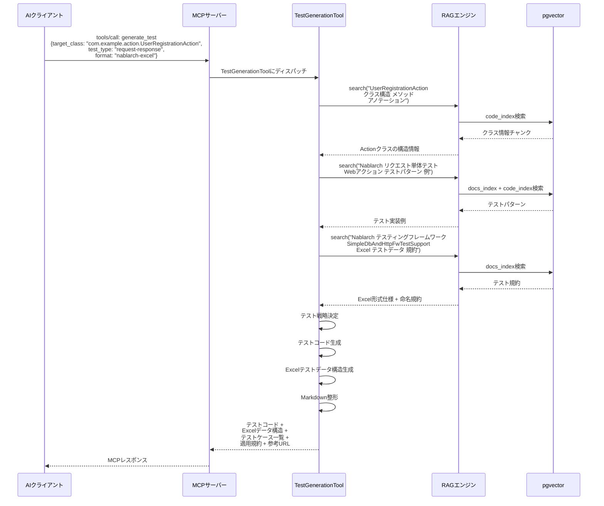

# generate_test Tool 詳細設計書

> **WBS番号**: 3.1.3
> **ステータス**: 設計完了
> **作成日**: 2026-02-03
> **作成者**: ashigaru3 (subtask_062)
> **関連文書**: architecture.md §5.1 Tool 6, use-cases.md UC7, 13_semantic-search-tool.md
> **依存タスク**: WBS 2.1.6（semantic_search Tool設計）, WBS 2.1.4（ハイブリッド検索設計）

---

## 目次

1. [概要](#1-概要)
2. [Tool定義](#2-tool定義)
3. [入力スキーマ](#3-入力スキーマ)
4. [出力スキーマ](#4-出力スキーマ)
5. [テストタイプ別生成ロジック](#5-テストタイプ別生成ロジック)
6. [Nablarchテストフレームワーク対応設計](#6-nablarchテストフレームワーク対応設計)
7. [Excelテストデータ生成ロジック](#7-excelテストデータ生成ロジック)
8. [RAG連携フロー](#8-rag連携フロー)
9. [モック・スタブ生成方針](#9-モックスタブ生成方針)
10. [テストデータ設計方針](#10-テストデータ設計方針)
11. [MCP Tool登録](#11-mcp-tool登録)
12. [エラーハンドリング](#12-エラーハンドリング)
13. [設定パラメータ](#13-設定パラメータ)

---

## 1. 概要

### 1.1 目的

本設計書は、Phase 3で追加する `generate_test` MCP Toolの詳細設計を定義する。
このToolは、NablarchアプリケーションのテストコードをNablarch Testing Framework（JUnit5 + Excelテストデータ）の規約に従って自動生成する。RAGパイプラインを活用してテストパターン・テスト規約を検索し、対象クラスに最適なテストコードとExcelテストデータ構造を出力する。

### 1.2 スコープ

- `generate_test` Toolの入出力スキーマ定義
- テストタイプ別（ユニット/リクエスト単体/バッチ/メッセージング）の生成ロジック設計
- Nablarch固有のExcelベーステスト対応設計
- RAGパイプラインとの連携フロー設計
- モック・スタブ生成方針
- テストデータ設計方針

### 1.3 対応ユースケース

**UC7: テストコード生成（Excelテスト連携）**

> Nablarch開発者として、Nablarchのテスティングフレームワーク用のExcelテストデータファイルを含むテストコードを生成したい。Nablarchのテストパターンに沿った包括的なテストスイートを素早く準備するためだ。

---

## 2. Tool定義

### 2.1 Tool概要

| 項目 | 値 |
|------|-----|
| Tool名 | `generate_test` |
| パッケージ | `com.tis.nablarch.mcp.tools` |
| クラス名 | `TestGenerationTool` |
| 説明 | Nablarch Testing Framework（JUnit5 + Excelテストデータ）に準拠したテストコードを生成する。対象クラスのFQCNとテストタイプを指定することで、テストクラス・テストメソッド・Excelテストデータ構造を出力する |
| カテゴリ | 生成系Tool |
| フェーズ | Phase 3 |

### 2.2 ユースケース

| ユースケース | 入力例 | テストタイプ |
|------------|--------|-----------|
| Webアクションのリクエスト単体テスト | `UserRegistrationAction` | request-response |
| バッチアクションのテスト | `CsvImportAction` | batch |
| RESTアクションのテスト | `ProductAction` | request-response |
| ユーティリティクラスの単体テスト | `DateUtils` | unit |
| MOMメッセージングのテスト | `OrderReceiveAction` | messaging |
| DBアクセスロジックのテスト | `UserService`（UniversalDao使用） | unit |

---

## 3. 入力スキーマ

### 3.1 パラメータ定義

| パラメータ | 型 | 必須 | デフォルト | 説明 |
|----------|-----|------|----------|------|
| `target_class` | string | ○ | — | テスト対象クラスのFQCN |
| `test_type` | string | ○ | — | テストタイプ: "unit", "request-response", "batch", "messaging" |
| `format` | string | × | "junit5" | 出力フォーマット: "junit5", "nablarch-excel" |
| `test_cases` | string | × | null | 生成するテストケースの指示（自然言語） |
| `include_excel` | string | × | "true" | Excelテストデータ構造を含めるか: "true", "false" |
| `coverage_target` | string | × | "standard" | カバレッジ目標: "minimal", "standard", "comprehensive" |

### 3.2 JSON Schema

```json
{
  "type": "object",
  "properties": {
    "target_class": {
      "type": "string",
      "description": "Fully qualified class name of the class to test (e.g. com.example.action.UserRegistrationAction)"
    },
    "test_type": {
      "type": "string",
      "enum": ["unit", "request-response", "batch", "messaging"],
      "description": "Type of test to generate: unit (plain JUnit5), request-response (Nablarch web/REST request testing), batch (batch action testing), messaging (MOM messaging testing)"
    },
    "format": {
      "type": "string",
      "enum": ["junit5", "nablarch-excel"],
      "default": "junit5",
      "description": "Output format: junit5 (standard JUnit5 test class) or nablarch-excel (JUnit5 + Excel test data structure)"
    },
    "test_cases": {
      "type": "string",
      "description": "Optional natural language description of test cases to generate (e.g. 'normal registration, validation error, duplicate email error')"
    },
    "include_excel": {
      "type": "string",
      "enum": ["true", "false"],
      "default": "true",
      "description": "Whether to include Excel test data structure definition in the output"
    },
    "coverage_target": {
      "type": "string",
      "enum": ["minimal", "standard", "comprehensive"],
      "default": "standard",
      "description": "Coverage target: minimal (happy path only), standard (happy + major error paths), comprehensive (all paths including edge cases)"
    }
  },
  "required": ["target_class", "test_type"]
}
```

### 3.3 test_type の詳細

| test_type | 対象 | テストスーパークラス | Excelテストデータ |
|-----------|------|-------------------|------------------|
| `unit` | ユーティリティ、サービスクラス、Entity | なし（素のJUnit5） | 不要（オプション） |
| `request-response` | Webアクション、RESTアクション | `SimpleDbAndHttpFwTestSupport` | 必須 |
| `batch` | バッチアクション | `BatchRequestTestSupport` | 必須 |
| `messaging` | メッセージングアクション | `MessagingRequestTestSupport` | 必須 |

---

## 4. 出力スキーマ

### 4.1 レスポンス構造

ToolはMarkdown形式のテキストを返却する。以下の構造で出力する。

```
## テスト生成結果: {target_class}
テストタイプ: {test_type} | フォーマット: {format} | カバレッジ: {coverage_target}

---

### テストクラス: {TestClassName}

```java
// テストコード
```

---

### Excelテストデータ構造

| シート名 | 説明 | 列定義 |
|---------|------|--------|
| ... | ... | ... |

---

### テストケース一覧

| # | テストメソッド | 説明 | 検証内容 |
|---|-------------|------|---------|
| ... | ... | ... | ... |

---

### 適用されたNablarch規約
- ...

### 参考ドキュメント
- ...
```

### 4.2 出力セクション詳細

| セクション | 必須 | 説明 |
|-----------|------|------|
| テストクラス | ○ | 完全なJavaテストコード |
| Excelテストデータ構造 | △ | include_excel="true"の場合に出力 |
| テストケース一覧 | ○ | 生成されたテストケースのサマリテーブル |
| 適用されたNablarch規約 | ○ | テスト生成時に適用した規約・パターン |
| 参考ドキュメント | ○ | RAG検索で参照したドキュメントURL |

### 4.3 テストコード出力例（request-response）

```java
package com.example.action;

import nablarch.test.core.http.SimpleDbAndHttpFwTestSupport;
import org.junit.jupiter.api.Test;

/**
 * {@link UserRegistrationAction}のリクエスト単体テスト。
 */
public class UserRegistrationActionTest
        extends SimpleDbAndHttpFwTestSupport {

    @Test
    public void 正常にユーザーが登録されること() {
        execute("register", new BasicHttpResponse(302));
    }

    @Test
    public void バリデーションエラーの場合エラー画面に遷移すること() {
        execute("registerValidationError", new BasicHttpResponse(200));
    }

    @Test
    public void DB重複エラーの場合エラーメッセージが表示されること() {
        execute("registerDuplicateError", new BasicHttpResponse(200));
    }
}
```

---

## 5. テストタイプ別生成ロジック

### 5.1 全体フロー

```
generate_test Tool 呼び出し
    │
    ▼
┌──────────────────────────────────────────────────────────┐
│ Phase 1: 入力解析                                         │
│                                                           │
│  - target_class のFQCN解析（パッケージ、クラス名抽出）      │
│  - test_type に基づくテスト戦略の決定                       │
│  - format に基づく出力形式の決定                            │
└──────────────────────┬───────────────────────────────────┘
                       │
                       ▼
┌──────────────────────────────────────────────────────────┐
│ Phase 2: RAGコンテキスト取得                                │
│                                                           │
│  - テスト対象クラスの情報検索                               │
│  - テストパターン・テスト規約の検索                          │
│  - Nablarch Testing Framework使用例の検索                  │
└──────────────────────┬───────────────────────────────────┘
                       │
                       ▼
┌──────────────────────────────────────────────────────────┐
│ Phase 3: テスト戦略決定                                    │
│                                                           │
│  test_type 分岐:                                          │
│  ┌─ unit ──────→ UnitTestGenerator                       │
│  ├─ request-response → RequestTestGenerator              │
│  ├─ batch ─────→ BatchTestGenerator                      │
│  └─ messaging ─→ MessagingTestGenerator                  │
└──────────────────────┬───────────────────────────────────┘
                       │
                       ▼
┌──────────────────────────────────────────────────────────┐
│ Phase 4: テストコード生成                                  │
│                                                           │
│  - テストクラススケルトン生成                               │
│  - テストメソッド生成（coverage_target に応じた数）          │
│  - Excelテストデータ構造生成（include_excel=true時）        │
└──────────────────────┬───────────────────────────────────┘
                       │
                       ▼
┌──────────────────────────────────────────────────────────┐
│ Phase 5: 結果整形                                         │
│                                                           │
│  - Markdown形式でテストコードを整形                         │
│  - Excelテストデータ構造をテーブル形式で整形                 │
│  - 適用規約・参考ドキュメントを付与                          │
└──────────────────────────────────────────────────────────┘
```

### 5.2 ユニットテスト生成ロジック（unit）

#### 対象

- ユーティリティクラス
- サービスクラス
- Entity（バリデーションロジック含む）
- カスタムハンドラ

#### 生成パターン

| 要素 | 生成内容 |
|------|---------|
| テストクラス | 素のJUnit5テストクラス（スーパークラスなし） |
| セットアップ | `@BeforeEach` でSystemRepository初期化（必要な場合） |
| テストメソッド | publicメソッドごとに正常系・異常系を生成 |
| アサーション | JUnit5標準アサーション（`assertEquals`, `assertThrows` 等） |
| DB関連 | UniversalDao使用時はモック/スタブ化を提案 |

#### テストケース生成基準（coverage_target別）

| coverage_target | 生成テストケース |
|----------------|-----------------|
| minimal | 各publicメソッドの正常系1件 |
| standard | 正常系 + 主要な異常系（null入力、境界値） |
| comprehensive | 全分岐カバレッジ + 境界値 + 例外系 |

### 5.3 リクエスト単体テスト生成ロジック（request-response）

#### 対象

- Webアクションクラス（`HttpResponse`を返すメソッド）
- RESTアクションクラス（JAX-RSアノテーション付き）

#### 生成パターン

| 要素 | 生成内容 |
|------|---------|
| テストクラス | `SimpleDbAndHttpFwTestSupport` を継承 |
| テストメソッド | `execute(sheetName, expectedResponse)` パターン |
| Excelテストデータ | testShots, expectedStatus, setupTable, expectedTable 等 |
| HTTP検証 | ステータスコード、レスポンスボディ、リダイレクト先 |
| DB検証 | setupTable（事前データ）+ expectedTable（事後データ） |
| メッセージ検証 | expectedMessages シート |

#### Webアクション vs RESTアクション

| 項目 | Webアクション | RESTアクション |
|------|-------------|--------------|
| スーパークラス | `SimpleDbAndHttpFwTestSupport` | `SimpleDbAndHttpFwTestSupport` |
| リクエスト | フォームパラメータ | JSONボディ |
| レスポンス検証 | JSP遷移先、ステータスコード | JSONレスポンス、ステータスコード |
| Content-Type | `application/x-www-form-urlencoded` | `application/json` |
| Excelシート | フォーム値をパラメータ列で定義 | JSONボディを文字列で定義 |

### 5.4 バッチテスト生成ロジック（batch）

#### 対象

- `BatchAction` を継承するバッチアクションクラス
- `DataReader` を実装するデータリーダー

#### 生成パターン

| 要素 | 生成内容 |
|------|---------|
| テストクラス | `BatchRequestTestSupport` を継承 |
| テストメソッド | `execute(sheetName)` パターン |
| Excelテストデータ | setupTable（入力データ）, expectedTable（期待結果）, expectedLog |
| 検証 | 処理件数、DB更新結果、出力ファイル内容 |

#### バッチテスト固有のExcelシート

| シート | 説明 |
|--------|------|
| `testShots` | バッチ実行パラメータ（requestPath, userId等） |
| `setupTable={TABLE}` | テスト前のDBデータ投入 |
| `expectedTable={TABLE}` | テスト後の期待DBデータ |
| `setupFile` | テスト前の入力ファイル準備（CSV等） |
| `expectedLog` | 期待されるログ出力パターン |

### 5.5 メッセージングテスト生成ロジック（messaging）

#### 対象

- MOMメッセージングアクション
- HTTPメッセージングアクション

#### 生成パターン

| 要素 | 生成内容 |
|------|---------|
| テストクラス | `MessagingRequestTestSupport` を継承 |
| テストメソッド | `execute(sheetName)` パターン |
| Excelテストデータ | requestMessage, expectedMessage, setupTable, expectedTable |

#### メッセージングテスト固有のExcelシート

| シート | 説明 |
|--------|------|
| `requestMessage` | 送信メッセージのヘッダ・ボディ定義 |
| `expectedMessage` | 応答メッセージの期待値 |
| `setupTable={TABLE}` | テスト前のDBデータ投入 |
| `expectedTable={TABLE}` | テスト後の期待DBデータ |

---

## 6. Nablarchテストフレームワーク対応設計

### 6.1 テストスーパークラス選択ロジック

```
入力: test_type, target_class情報
    │
    ▼
┌─────────────────────────────────────────────────┐
│ test_type による分岐                               │
│                                                    │
│  unit ──────────────→ スーパークラスなし            │
│  │                     （素のJUnit5）               │
│  │  ※ DB操作あり？                                  │
│  │  └─ はい → DbAccessTestSupport を推奨           │
│  │                                                  │
│  request-response ──→ SimpleDbAndHttpFwTestSupport  │
│  │                                                  │
│  │  ※ DB操作なし？                                  │
│  │  └─ はい → SimpleHttpFwTestSupport を推奨        │
│  │                                                  │
│  batch ─────────────→ BatchRequestTestSupport       │
│  │                                                  │
│  messaging ─────────→ MessagingRequestTestSupport   │
└─────────────────────────────────────────────────────┘
```

### 6.2 テストスーパークラス一覧

| スーパークラス | FQCN | 用途 |
|-------------|------|------|
| `SimpleDbAndHttpFwTestSupport` | `nablarch.test.core.http.SimpleDbAndHttpFwTestSupport` | HTTPリクエスト + DB操作のテスト |
| `SimpleHttpFwTestSupport` | `nablarch.test.core.http.SimpleHttpFwTestSupport` | HTTPリクエストのみのテスト |
| `DbAccessTestSupport` | `nablarch.test.core.db.DbAccessTestSupport` | DB操作のみのテスト |
| `BatchRequestTestSupport` | `nablarch.test.core.batch.BatchRequestTestSupport` | バッチアクションのテスト |
| `MessagingRequestTestSupport` | `nablarch.test.core.messaging.MessagingRequestTestSupport` | メッセージングのテスト |

### 6.3 JUnit5統合方針

Nablarch Testing FrameworkはJUnit5上で動作する。テスト生成時の注意点：

| 項目 | 方針 |
|------|------|
| アノテーション | `@Test`（JUnit5の`org.junit.jupiter.api.Test`） |
| ライフサイクル | `@BeforeEach`, `@AfterEach` でセットアップ・クリーンアップ |
| アサーション | JUnit5標準 + NablarchのDB検証メソッド |
| テストメソッド名 | 日本語メソッド名を推奨（`正常にユーザーが登録されること`） |
| テストデータ | Excelファイルは `src/test/resources/{パッケージパス}/{テストクラス名}/` に配置 |

### 6.4 テストメソッド命名規約

```
{日本語での振る舞い説明}

例:
- 正常にユーザーが登録されること()
- バリデーションエラーの場合エラー画面に遷移すること()
- DB重複エラーの場合エラーメッセージが表示されること()
- 必須項目が未入力の場合バリデーションエラーとなること()
```

---

## 7. Excelテストデータ生成ロジック

### 7.1 Excelファイル配置規約

```
src/test/resources/
  └─ com/example/action/          ← テスト対象のパッケージパスに対応
      └─ UserRegistrationActionTest/  ← テストクラス名のフォルダ
          └─ UserRegistrationActionTest.xlsx  ← テストデータExcel
```

### 7.2 共通シート構造

#### testShotsシート（リクエスト定義）

| 列 | 説明 | 例 |
|----|------|-----|
| no | テストケース番号 | 1 |
| description | テストケース説明 | 正常登録 |
| expectedStatusCode | 期待HTTPステータス | 302 |
| setUpTable | 事前データ投入シート参照 | setupTable=USERS |
| expectedTable | 事後データ検証シート参照 | expectedTable=USERS |

#### setupTable={TABLE}シート（事前データ投入）

| 列 | 説明 |
|----|------|
| テーブルの各カラム名 | INSERT対象の値 |

#### expectedTable={TABLE}シート（事後データ検証）

| 列 | 説明 |
|----|------|
| テーブルの各カラム名 | 期待される値 |

### 7.3 テストタイプ別シート構成

#### request-response

| シート | 必須 | 説明 |
|--------|------|------|
| `{メソッド名}` | ○ | 正常系リクエスト定義 |
| `{メソッド名}Params` | ○ | リクエストパラメータ |
| `setupTable={TABLE}` | △ | DB事前データ（DB操作テスト時） |
| `expectedTable={TABLE}` | △ | DB期待データ（DB操作テスト時） |
| `expectedMessages` | △ | 期待メッセージ（バリデーションエラー等） |

#### batch

| シート | 必須 | 説明 |
|--------|------|------|
| `testShots` | ○ | バッチ実行パラメータ |
| `setupTable={TABLE}` | ○ | 入力データ投入 |
| `expectedTable={TABLE}` | ○ | 期待結果データ |
| `setupFile` | △ | 入力ファイル（CSV/固定長） |
| `expectedLog` | △ | 期待ログ出力 |

#### messaging

| シート | 必須 | 説明 |
|--------|------|------|
| `requestMessage` | ○ | リクエストメッセージ定義 |
| `expectedMessage` | △ | 応答メッセージ期待値 |
| `setupTable={TABLE}` | △ | DB事前データ |
| `expectedTable={TABLE}` | △ | DB期待データ |

### 7.4 テストデータ生成パターン

| カバレッジ | 正常系データ | 異常系データ |
|-----------|------------|------------|
| minimal | 代表値1件 | なし |
| standard | 代表値1件 | 主要バリデーションエラー + 業務エラー |
| comprehensive | 代表値 + 境界値 | 全バリデーションパターン + 業務エラー + システムエラー |

---

## 8. RAG連携フロー

### 8.1 RAG検索戦略

`generate_test` Toolは、以下の3段階でRAGパイプラインを利用する。

```
generate_test 呼び出し
    │
    ▼
┌──────────────────────────────────────────────────────────┐
│ RAG検索 1: テスト対象クラスの情報取得                        │
│                                                           │
│  クエリ: "{target_class} クラス構造 メソッド一覧"           │
│  フィルタ: source_type=code                                │
│  目的: テスト対象のpublicメソッド、依存クラス、               │
│        アノテーション情報を取得                              │
└──────────────────────┬───────────────────────────────────┘
                       │
                       ▼
┌──────────────────────────────────────────────────────────┐
│ RAG検索 2: テストパターン検索                                │
│                                                           │
│  クエリ: "Nablarch {test_type} テストパターン                │
│          {テスト対象の種類} テスト例"                        │
│  フィルタ: source_type=documentation|code,                  │
│           app_type={推定アプリタイプ}                        │
│  目的: 同種のテストパターン・テスト実装例を取得               │
└──────────────────────┬───────────────────────────────────┘
                       │
                       ▼
┌──────────────────────────────────────────────────────────┐
│ RAG検索 3: テスト規約・ベストプラクティス検索                  │
│                                                           │
│  クエリ: "Nablarch テスティングフレームワーク                 │
│          {テストスーパークラス} 規約 ベストプラクティス"       │
│  フィルタ: source=nablarch-document|fintan                  │
│  目的: テスト命名規約、Excel形式の仕様、                     │
│        アンチパターンの情報を取得                            │
└──────────────────────────────────────────────────────────┘
```

### 8.2 RAGクエリ構築パターン

| 検索段階 | クエリテンプレート | フィルタ |
|---------|-----------------|---------|
| クラス情報取得 | `"{FQCN} クラス メソッド アノテーション"` | source_type=code |
| テストパターン | `"Nablarch {test_type} テスト {クラス種別} 例"` | source_type=documentation\|code |
| テスト規約 | `"Nablarch テスティングフレームワーク {スーパークラス} Excel"` | source=nablarch-document\|fintan |

### 8.3 RAGフォールバック方針

| 段階 | RAG結果なし時の挙動 |
|------|-------------------|
| クラス情報取得失敗 | FQCN解析のみで生成（パッケージ名・クラス名から推定） |
| テストパターン検索失敗 | 標準テンプレートパターンで生成 |
| テスト規約検索失敗 | 静的知識ベースの規約情報にフォールバック |

### 8.4 RAG統合シーケンス



---

## 9. モック・スタブ生成方針

### 9.1 基本方針

Nablarchのテスティングフレームワークは、実際のハンドラキューを通したテストを推奨しているため、**モック・スタブの使用は最小限に抑える**。

| テストタイプ | モック使用 | 理由 |
|------------|----------|------|
| unit | 必要に応じて | 外部依存（DB、ファイル）のモック化 |
| request-response | 基本不要 | Nablarch Testing FWが環境を提供 |
| batch | 基本不要 | Nablarch Testing FWが環境を提供 |
| messaging | 基本不要 | Nablarch Testing FWがモックMOMを提供 |

### 9.2 ユニットテストでのモック方針

| 依存対象 | モック方法 | 推奨ライブラリ |
|---------|----------|-------------|
| SystemRepository | テスト用コンポーネント定義XMLで置換 | Nablarch標準 |
| UniversalDao | DbAccessTestSupportのDB環境使用、またはモック化 | Nablarch標準 / Mockito |
| 外部APIクライアント | インターフェース経由でモック | Mockito |
| ファイルI/O | テスト用一時ディレクトリ使用 | JUnit5 `@TempDir` |
| 日時 | SystemTimeProviderのテスト用実装に置換 | Nablarch標準 |

### 9.3 モック生成テンプレート

SystemRepositoryのテスト用セットアップ：

```java
@BeforeEach
void setUp() {
    // テスト用のコンポーネント定義をロード
    SystemRepository.load(
        new DiContainer(
            new XmlComponentDefinitionLoader(
                "classpath:test-component-configuration.xml")));
}

@AfterEach
void tearDown() {
    SystemRepository.clear();
}
```

---

## 10. テストデータ設計方針

### 10.1 テストデータ生成の原則

| 原則 | 説明 |
|------|------|
| 最小限のデータ | テストに必要なデータのみを定義（不要なカラムは省略） |
| 独立性 | 各テストケースが他のテストケースに依存しない |
| 再現性 | 固定値を使用（ランダム値は使わない） |
| 可読性 | テストの意図が分かるデータ値を使用 |

### 10.2 データ型別の代表値

| データ型 | 正常値例 | 境界値例 | 異常値例 |
|---------|---------|---------|---------|
| String（名前系） | `"テスト太郎"` | 最大長の文字列 | 空文字、null |
| String（メール） | `"test@example.com"` | 最大長のアドレス | 不正フォーマット |
| Integer | `100` | `0`, `Integer.MAX_VALUE` | 負数、null |
| Long（ID系） | `1L` | `0L`, `Long.MAX_VALUE` | 負数、null |
| Date | `"20260203"` | 閏日、月末 | 不正日付 |
| Boolean | `true` | — | null |

### 10.3 DBテストデータのパターン

| パターン | setupTable | expectedTable | 用途 |
|---------|------------|---------------|------|
| INSERT検証 | 空テーブル or 既存データ | 追加後のデータ | 登録処理のテスト |
| UPDATE検証 | 更新前データ | 更新後データ（version+1等） | 更新処理のテスト |
| DELETE検証 | 削除対象データ | 空テーブル or 残存データ | 削除処理のテスト |
| SELECT検証 | 検索対象データ | — （レスポンスで検証） | 検索処理のテスト |
| 楽観ロック | version=1のデータ | — （例外で検証） | 排他制御のテスト |

---

## 11. MCP Tool登録

### 11.1 TestGenerationTool クラス設計

```java
package com.tis.nablarch.mcp.tools;

import com.tis.nablarch.mcp.rag.pipeline.RagPipeline;
import com.tis.nablarch.mcp.rag.search.SearchFilters;
import com.tis.nablarch.mcp.rag.search.SearchMode;
import com.tis.nablarch.mcp.rag.search.SearchResult;
import org.springframework.ai.tool.annotation.Tool;
import org.springframework.ai.tool.annotation.ToolParam;
import org.springframework.beans.factory.annotation.Autowired;
import org.springframework.stereotype.Service;

import java.util.List;

/**
 * MCPツール: generate_test。
 *
 * <p>Nablarch Testing Framework（JUnit5 + Excelテストデータ）に準拠した
 * テストコードを生成するツール。テスト対象クラスのFQCNとテストタイプを
 * 指定することで、テストクラス・テストメソッド・Excelテストデータ構造を出力する。</p>
 */
@Service
public class TestGenerationTool {

    private final RagPipeline ragPipeline;

    /**
     * コンストラクタ。
     *
     * @param ragPipeline RAGパイプライン（Phase 3以降で利用）
     */
    public TestGenerationTool(@Autowired(required = false) RagPipeline ragPipeline) {
        this.ragPipeline = ragPipeline;
    }

    /**
     * Nablarch Testing Frameworkに準拠したテストコードを生成する。
     *
     * @param targetClass テスト対象クラスのFQCN
     * @param testType テストタイプ（unit, request-response, batch, messaging）
     * @param format 出力フォーマット（junit5, nablarch-excel）
     * @param testCases 生成するテストケースの指示（自然言語、任意）
     * @param includeExcel Excelテストデータ構造を含めるか（true/false）
     * @param coverageTarget カバレッジ目標（minimal, standard, comprehensive）
     * @return テストコードとExcelテストデータ構造のMarkdownフォーマット文字列
     */
    @Tool(description = "Generate test code for Nablarch applications using the Nablarch Testing "
            + "Framework (JUnit5 + Excel test data). Supports unit tests, request-response tests "
            + "(web/REST), batch tests, and messaging tests. Generates test classes, test methods, "
            + "and Excel test data structure definitions following Nablarch conventions.")
    public String generateTest(
            @ToolParam(description = "Fully qualified class name of the class to test "
                    + "(e.g. com.example.action.UserRegistrationAction)")
            String targetClass,
            @ToolParam(description = "Test type: unit (plain JUnit5), request-response "
                    + "(web/REST request testing), batch (batch action), messaging (MOM messaging)")
            String testType,
            @ToolParam(description = "Output format: junit5 (default) or nablarch-excel "
                    + "(includes Excel test data structure)")
            String format,
            @ToolParam(description = "Optional: natural language description of test cases "
                    + "(e.g. 'normal registration, validation error, duplicate email')")
            String testCases,
            @ToolParam(description = "Include Excel test data structure: true (default) or false")
            String includeExcel,
            @ToolParam(description = "Coverage target: minimal, standard (default), comprehensive")
            String coverageTarget) {

        // 入力検証
        if (targetClass == null || targetClass.isBlank()) {
            return "テスト対象クラスのFQCNを指定してください。";
        }
        if (testType == null || testType.isBlank()) {
            return "テストタイプを指定してください（unit, request-response, batch, messaging）。";
        }

        // パラメータ正規化
        String effectiveFormat = parseFormat(format);
        boolean effectiveIncludeExcel = parseIncludeExcel(includeExcel);
        String effectiveCoverage = parseCoverageTarget(coverageTarget);
        TestType effectiveTestType = parseTestType(testType);
        if (effectiveTestType == null) {
            return "不明なテストタイプ: " + testType
                    + "\n有効なタイプ: unit, request-response, batch, messaging";
        }

        // FQCN解析
        ClassInfo classInfo = parseClassName(targetClass);

        // RAGコンテキスト取得
        TestContext context = buildTestContext(
                classInfo, effectiveTestType, testCases);

        // テストコード生成
        String testCode = generateTestCode(
                classInfo, effectiveTestType, context, effectiveCoverage);

        // Excelテストデータ構造生成
        String excelStructure = effectiveIncludeExcel
                ? generateExcelStructure(classInfo, effectiveTestType, context)
                : "";

        // 結果整形
        return formatResult(
                classInfo, effectiveTestType, effectiveFormat,
                effectiveCoverage, testCode, excelStructure, context);
    }

    // --- 以下、privateメソッド ---

    private TestType parseTestType(String testType) {
        if (testType == null || testType.isBlank()) return null;
        return switch (testType.toLowerCase().replace("_", "-")) {
            case "unit" -> TestType.UNIT;
            case "request-response" -> TestType.REQUEST_RESPONSE;
            case "batch" -> TestType.BATCH;
            case "messaging" -> TestType.MESSAGING;
            default -> null;
        };
    }

    private String parseFormat(String format) {
        if (format == null || format.isBlank()) return "junit5";
        return switch (format.toLowerCase()) {
            case "nablarch-excel" -> "nablarch-excel";
            default -> "junit5";
        };
    }

    private boolean parseIncludeExcel(String includeExcel) {
        if (includeExcel == null || includeExcel.isBlank()) return true;
        return !"false".equalsIgnoreCase(includeExcel);
    }

    private String parseCoverageTarget(String coverageTarget) {
        if (coverageTarget == null || coverageTarget.isBlank()) return "standard";
        return switch (coverageTarget.toLowerCase()) {
            case "minimal" -> "minimal";
            case "comprehensive" -> "comprehensive";
            default -> "standard";
        };
    }

    private ClassInfo parseClassName(String fqcn) {
        int lastDot = fqcn.lastIndexOf('.');
        String packageName = lastDot > 0 ? fqcn.substring(0, lastDot) : "";
        String className = lastDot > 0 ? fqcn.substring(lastDot + 1) : fqcn;
        return new ClassInfo(fqcn, packageName, className);
    }

    private TestContext buildTestContext(
            ClassInfo classInfo, TestType testType, String testCases) {
        // RAGパイプラインが利用可能な場合はRAG検索を実行
        if (ragPipeline != null) {
            return buildTestContextWithRag(classInfo, testType, testCases);
        }
        // RAG未接続時は静的知識ベースからコンテキスト構築
        return buildTestContextStatic(classInfo, testType, testCases);
    }

    private TestContext buildTestContextWithRag(
            ClassInfo classInfo, TestType testType, String testCases) {
        // RAG検索1: クラス情報取得
        List<SearchResult> classResults = ragPipeline.search(
                classInfo.fqcn() + " クラス構造 メソッド アノテーション",
                new SearchFilters(null, null, null, "code", null),
                5, SearchMode.HYBRID);

        // RAG検索2: テストパターン検索
        List<SearchResult> patternResults = ragPipeline.search(
                "Nablarch " + testType.label() + " テストパターン 例",
                new SearchFilters(null, null, null, "documentation", null),
                5, SearchMode.HYBRID);

        // RAG検索3: テスト規約検索
        String superClass = testType.superClassName();
        List<SearchResult> conventionResults = ragPipeline.search(
                "Nablarch テスティングフレームワーク " + superClass + " Excel テストデータ 規約",
                new SearchFilters(null, null, "nablarch-document", null, null),
                5, SearchMode.HYBRID);

        return new TestContext(classResults, patternResults,
                conventionResults, testCases);
    }

    private TestContext buildTestContextStatic(
            ClassInfo classInfo, TestType testType, String testCases) {
        return new TestContext(List.of(), List.of(), List.of(), testCases);
    }

    // generateTestCode, generateExcelStructure, formatResult は
    // テストタイプ別の生成ロジック（§5参照）に従って実装する

    private String generateTestCode(
            ClassInfo classInfo, TestType testType,
            TestContext context, String coverageTarget) {
        // 実装はPhase 3で行う
        return "// テストコード生成（Phase 3実装）";
    }

    private String generateExcelStructure(
            ClassInfo classInfo, TestType testType, TestContext context) {
        // 実装はPhase 3で行う
        return "// Excelテストデータ構造生成（Phase 3実装）";
    }

    private String formatResult(
            ClassInfo classInfo, TestType testType, String format,
            String coverageTarget, String testCode,
            String excelStructure, TestContext context) {
        StringBuilder sb = new StringBuilder();
        sb.append("## テスト生成結果: ").append(classInfo.className()).append("\n");
        sb.append("テストタイプ: ").append(testType.label());
        sb.append(" | フォーマット: ").append(format);
        sb.append(" | カバレッジ: ").append(coverageTarget).append("\n\n---\n\n");
        sb.append(testCode);
        if (!excelStructure.isEmpty()) {
            sb.append("\n\n---\n\n").append(excelStructure);
        }
        return sb.toString();
    }

    // --- 内部型定義 ---

    private record ClassInfo(String fqcn, String packageName, String className) {}

    private record TestContext(
            List<SearchResult> classResults,
            List<SearchResult> patternResults,
            List<SearchResult> conventionResults,
            String testCasesHint) {}

    private enum TestType {
        UNIT("ユニットテスト", "（なし）"),
        REQUEST_RESPONSE("リクエスト単体テスト",
                "SimpleDbAndHttpFwTestSupport"),
        BATCH("バッチテスト", "BatchRequestTestSupport"),
        MESSAGING("メッセージングテスト",
                "MessagingRequestTestSupport");

        private final String label;
        private final String superClassName;

        TestType(String label, String superClassName) {
            this.label = label;
            this.superClassName = superClassName;
        }

        String label() { return label; }
        String superClassName() { return superClassName; }
    }
}
```

### 11.2 McpServerConfig への登録

```java
// McpServerConfig.java への追加（Phase 3）

@Bean
public MethodToolCallbackProvider nablarchTools(
        SearchApiTool searchApiTool,
        ValidateHandlerQueueTool validateHandlerQueueTool,
        SemanticSearchTool semanticSearchTool,
        TestGenerationTool testGenerationTool) {  // 新規追加
    return MethodToolCallbackProvider.builder()
            .toolObjects(searchApiTool, validateHandlerQueueTool,
                    semanticSearchTool, testGenerationTool)
            .build();
}
```

---

## 12. エラーハンドリング

### 12.1 エラーパターンと応答

| エラー | 応答 | ログ |
|-------|------|------|
| target_class が null/blank | "テスト対象クラスのFQCNを指定してください。" | DEBUG |
| test_type が null/blank | "テストタイプを指定してください（unit, request-response, batch, messaging）。" | DEBUG |
| test_type が不正な値 | "不明なテストタイプ: {value}" + 有効タイプ一覧 | DEBUG |
| RAGパイプライン未接続 | 静的テンプレートで生成（フォールバック） | INFO |
| RAG検索タイムアウト | 取得済みの結果で生成を続行 | WARN |
| RAG検索結果0件 | 標準テンプレートパターンで生成 | INFO |
| テストコード生成失敗 | "テストコードの生成に失敗しました。" + 原因 + 代替案 | ERROR |

### 12.2 フォールバック戦略

```
RAG連携あり
    │
    ▼
  検索成功？ ──→ はい ──→ RAGコンテキスト付きで生成
    │
    ▼ いいえ
静的知識ベースにフォールバック
    │
    ▼
  テンプレート利用可能？ ──→ はい ──→ テンプレートで生成
    │
    ▼ いいえ
最小限のスケルトンを生成
+ "RAG知識ベースとテンプレートが利用できません。
   手動でのテストケース追加を推奨します。"
```

---

## 13. 設定パラメータ

```yaml
# application.yml
nablarch:
  tools:
    generate-test:
      enabled: true                    # generate_test Toolの有効/無効
      default-format: junit5           # デフォルト出力フォーマット
      default-coverage: standard       # デフォルトカバレッジ目標
      default-include-excel: true      # デフォルトでExcel構造を含める
      max-test-cases: 30              # 1回の生成で出力する最大テストケース数
      rag:
        class-info-top-k: 5           # クラス情報検索の結果数
        pattern-top-k: 5             # テストパターン検索の結果数
        convention-top-k: 5          # テスト規約検索の結果数
        timeout-ms: 500              # RAG検索タイムアウト（ミリ秒）
      excel:
        max-columns: 50              # Excelシート定義の最大列数
        include-sample-data: true    # サンプルデータ行を含めるか
      naming:
        test-method-language: ja     # テストメソッド名の言語（ja: 日本語）
        test-class-suffix: Test      # テストクラス名のサフィックス
```

---

## 付録

### A. パッケージ構造（Phase 3追加分）

```
com.tis.nablarch.mcp/
├── tools/
│   ├── SearchApiTool.java              ← Phase 1
│   ├── ValidateHandlerQueueTool.java   ← Phase 1
│   ├── SemanticSearchTool.java         ← Phase 2（rag.tools → toolsに統合想定）
│   └── TestGenerationTool.java         ← 本設計書（Phase 3）
├── test/                               ← テスト生成専用パッケージ
│   ├── TestType.java                   ← テストタイプ enum
│   ├── ClassInfo.java                  ← FQCN解析結果DTO
│   ├── TestContext.java                ← RAGコンテキストDTO
│   ├── TestCodeGenerator.java          ← テストコード生成IF
│   ├── UnitTestGenerator.java          ← ユニットテスト生成
│   ├── RequestTestGenerator.java       ← リクエストテスト生成
│   ├── BatchTestGenerator.java         ← バッチテスト生成
│   ├── MessagingTestGenerator.java     ← メッセージングテスト生成
│   └── ExcelStructureGenerator.java    ← Excelテストデータ構造生成
└── rag/
    └── pipeline/
        └── RagPipeline.java            ← Phase 2
```

### B. 関連WBSタスク

| WBS | タスク | 本設計との関係 |
|-----|-------|-------------|
| 2.1.6 | semantic_search Tool設計 | RAG連携パターンの参考元 |
| 3.1.3 | generate_test Tool設計 | **本設計書** |
| 3.2.x | generate_test Tool実装 | 本設計書を実装 |
| 3.3.x | generate_test 統合テスト | 本設計の検証 |

### C. テストスーパークラス対応表

| test_type | DB操作あり | DB操作なし |
|-----------|----------|----------|
| unit | `DbAccessTestSupport` を推奨 | スーパークラスなし |
| request-response | `SimpleDbAndHttpFwTestSupport` | `SimpleHttpFwTestSupport` |
| batch | `BatchRequestTestSupport` | — |
| messaging | `MessagingRequestTestSupport` | — |

### D. Excelテストデータのシート命名規約

| 用途 | 命名パターン | 例 |
|------|------------|-----|
| テスト実行定義 | `{テストメソッド名に対応する識別子}` | `register`, `registerValidationError` |
| リクエストパラメータ | `{識別子}Params` | `registerParams` |
| 事前データ投入 | `setupTable={テーブル名}` | `setupTable=USERS` |
| 事後データ検証 | `expectedTable={テーブル名}` | `expectedTable=USERS` |
| 期待メッセージ | `expectedMessages` | `expectedMessages` |
| 期待ログ | `expectedLog` | `expectedLog` |
| リクエストメッセージ | `requestMessage` | `requestMessage` |
| 応答メッセージ | `expectedResponseMessage` | `expectedResponseMessage` |
| 入力ファイル | `setupFile` | `setupFile` |
