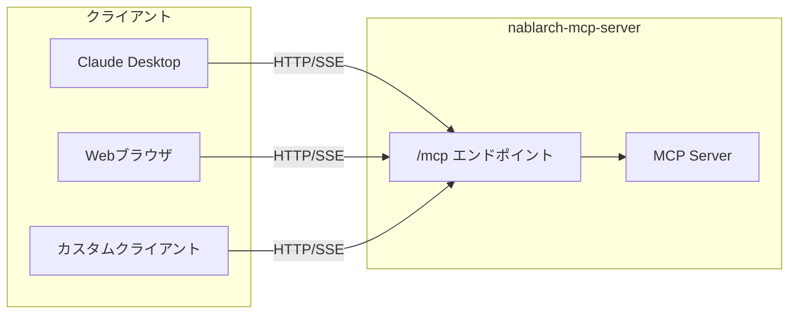

# Streamable HTTP Transport 設定ガイド

> **バージョン**: 1.0
> **対象**: nablarch-mcp-server Phase 3
> **作成日**: 2026-02-04
> **関連設計書**: [23_streamable-http-transport.md](../designs/23_streamable-http-transport.md)

---

## 目次

1. [概要](#1-概要)
2. [設定方法](#2-設定方法)
3. [エンドポイント](#3-エンドポイント)
4. [クライアント実装例](#4-クライアント実装例)
5. [トラブルシューティング](#5-トラブルシューティング)

---

## 1. 概要

### 1.1 Streamable HTTP Transportとは

Streamable HTTP Transportは、MCP（Model Context Protocol）仕様 2025-03-26版で定義されたHTTPベースの通信方式です。Server-Sent Events（SSE）を使用したストリーミング通信をサポートし、Webブラウザやリモートクライアントからの接続を可能にします。



### 1.2 STDIOとの違い

| 特性 | STDIO | HTTP |
|------|-------|------|
| 通信方式 | 標準入出力 | HTTP/SSE |
| 接続形態 | ローカルプロセス | ネットワーク |
| 複数クライアント | 不可 | 可能 |
| 用途 | ローカル開発、Claude Desktop | チーム共有、Web連携 |

### 1.3 起動モード

nablarch-mcp-serverはプロファイルで起動モードを切り替えます。

```bash
# STDIOモード（デフォルト）
java -jar nablarch-mcp-server.jar

# HTTPモード
java -jar nablarch-mcp-server.jar --spring.profiles.active=http
```

---

## 2. 設定方法

### 2.1 application-http.yaml

HTTPモードの設定は `src/main/resources/application-http.yaml` で行います。

```yaml
# HTTPトランスポート用設定（httpプロファイル）
# 起動方法: java -jar xxx.jar --spring.profiles.active=http

spring:
  main:
    web-application-type: servlet
  ai:
    mcp:
      server:
        stdio: false

server:
  port: 8080
  tomcat:
    threads:
      max: 200
      min-spare: 10

mcp:
  http:
    enabled: true
    endpoint: /mcp
    session:
      timeout: 30m
      max-sessions: 100
    cors:
      allowed-origins:
        - "http://localhost:3000"
        - "http://localhost:8080"
      allow-credentials: true

logging:
  level:
    root: INFO
    com.tis.nablarch.mcp: DEBUG
```

### 2.2 設定項目リファレンス

#### 基本設定

| プロパティ | デフォルト | 説明 |
|-----------|----------|------|
| `mcp.http.enabled` | `false` | HTTPトランスポートの有効化 |
| `mcp.http.endpoint` | `/mcp` | MCPエンドポイントパス |
| `server.port` | `8080` | HTTPサーバーポート |

#### セッション設定

| プロパティ | デフォルト | 説明 |
|-----------|----------|------|
| `mcp.http.session.timeout` | `30m` | セッションタイムアウト |
| `mcp.http.session.max-sessions` | `100` | 最大同時セッション数 |
| `mcp.http.session.cleanup-interval` | `5m` | セッションクリーンアップ間隔 |

#### CORS設定

| プロパティ | デフォルト | 説明 |
|-----------|----------|------|
| `mcp.http.cors.allowed-origins` | `[]` | 許可するオリジン |
| `mcp.http.cors.allowed-methods` | `GET,POST,DELETE,OPTIONS` | 許可するHTTPメソッド |
| `mcp.http.cors.allowed-headers` | `Content-Type,Mcp-Session-Id,Accept` | 許可するリクエストヘッダ |
| `mcp.http.cors.exposed-headers` | `Mcp-Session-Id` | 公開するレスポンスヘッダ |
| `mcp.http.cors.allow-credentials` | `true` | 認証情報の送信許可 |
| `mcp.http.cors.max-age` | `3600` | プリフライトキャッシュ時間（秒） |

### 2.3 設定クラス構成

```
com.tis.nablarch.mcp.http
├── McpHttpProperties.java          # 設定プロパティクラス
└── config/
    ├── StreamableHttpTransportConfig.java  # トランスポート設定
    └── McpCorsConfig.java          # CORS設定
```

各設定クラスは `@Profile("http")` と `@ConditionalOnProperty(name = "mcp.http.enabled")` で制御され、HTTPモードでのみ有効化されます。

### 2.4 環境別設定例

#### 開発環境

```yaml
mcp:
  http:
    enabled: true
    endpoint: /mcp
    cors:
      allowed-origins:
        - "http://localhost:3000"
        - "http://localhost:5173"  # Vite開発サーバー
```

#### 本番環境（Phase 4で正式対応予定）

```yaml
mcp:
  http:
    enabled: true
    endpoint: /mcp
    session:
      timeout: 15m
      max-sessions: 500
    cors:
      allowed-origins:
        - "https://your-domain.com"
    origin-validation:
      enabled: true
```

---

## 3. エンドポイント

### 3.1 エンドポイント一覧

すべてのMCP操作は単一エンドポイント `/mcp` で処理されます。

| HTTPメソッド | パス | 用途 |
|-------------|------|------|
| POST | `/mcp` | JSON-RPCメッセージの送信 |
| GET | `/mcp` | SSEストリームの確立 |
| DELETE | `/mcp` | セッションの終了 |

### 3.2 POST /mcp — メッセージ送信

クライアントからサーバーへJSON-RPCメッセージを送信します。

#### リクエスト

```http
POST /mcp HTTP/1.1
Host: localhost:8080
Content-Type: application/json
Mcp-Session-Id: <session-id>

{
  "jsonrpc": "2.0",
  "id": 1,
  "method": "tools/list",
  "params": {}
}
```

#### レスポンス（即時）

```http
HTTP/1.1 200 OK
Content-Type: application/json
Mcp-Session-Id: <session-id>

{
  "jsonrpc": "2.0",
  "id": 1,
  "result": {
    "tools": [
      {
        "name": "search_api",
        "description": "Search the Nablarch API documentation..."
      }
    ]
  }
}
```

### 3.3 GET /mcp — SSEストリーム

サーバーからクライアントへの非同期通知用SSEストリームを確立します。

#### リクエスト

```http
GET /mcp HTTP/1.1
Host: localhost:8080
Accept: text/event-stream
Mcp-Session-Id: <session-id>
```

#### レスポンス（ストリーム）

```http
HTTP/1.1 200 OK
Content-Type: text/event-stream
Cache-Control: no-cache
Connection: keep-alive

event: message
data: {"jsonrpc":"2.0","method":"notifications/resources/updated","params":{}}

event: message
data: {"jsonrpc":"2.0","method":"notifications/tools/list_changed","params":{}}
```

### 3.4 DELETE /mcp — セッション終了

セッションを明示的に終了します。

#### リクエスト

```http
DELETE /mcp HTTP/1.1
Host: localhost:8080
Mcp-Session-Id: <session-id>
```

#### レスポンス

```http
HTTP/1.1 200 OK
```

### 3.5 JSON-RPCメソッド一覧

| MCP操作 | JSON-RPCメソッド |
|---------|-----------------|
| 初期化 | `initialize` |
| 初期化完了通知 | `notifications/initialized` |
| Tool一覧取得 | `tools/list` |
| Tool実行 | `tools/call` |
| Resource一覧取得 | `resources/list` |
| Resource読み込み | `resources/read` |
| Prompt一覧取得 | `prompts/list` |
| Prompt取得 | `prompts/get` |
| ヘルスチェック | `ping` |

---

## 4. クライアント実装例

### 4.1 Claude Desktop設定

Claude Desktopの設定ファイルを編集してHTTPモードで接続します。

**設定ファイルの場所:**
- macOS: `~/Library/Application Support/Claude/claude_desktop_config.json`
- Windows: `%APPDATA%\Claude\claude_desktop_config.json`
- Linux: `~/.config/Claude/claude_desktop_config.json`

**設定例（HTTPモード）:**

```json
{
  "mcpServers": {
    "nablarch-http": {
      "url": "http://localhost:8080/mcp",
      "transport": "sse"
    }
  }
}
```

> **注意**: Claude Desktopは現時点でSTDIOトランスポートを推奨しています。HTTPモードはリモートサーバー接続時に使用してください。

### 4.2 curlでのテスト

#### 初期化リクエスト

```bash
curl -X POST http://localhost:8080/mcp \
  -H "Content-Type: application/json" \
  -d '{
    "jsonrpc": "2.0",
    "id": 1,
    "method": "initialize",
    "params": {
      "protocolVersion": "2024-11-05",
      "capabilities": {},
      "clientInfo": {
        "name": "curl-test",
        "version": "1.0.0"
      }
    }
  }'
```

#### Tool一覧取得

```bash
# セッションIDはinitializeレスポンスのMcp-Session-Idヘッダから取得
curl -X POST http://localhost:8080/mcp \
  -H "Content-Type: application/json" \
  -H "Mcp-Session-Id: <session-id>" \
  -d '{
    "jsonrpc": "2.0",
    "id": 2,
    "method": "tools/list",
    "params": {}
  }'
```

#### SSEストリーム接続

```bash
curl -N -H "Accept: text/event-stream" \
  -H "Mcp-Session-Id: <session-id>" \
  http://localhost:8080/mcp
```

### 4.3 httpieでのテスト

[HTTPie](https://httpie.io/) を使用したテスト例です。

#### 初期化

```bash
http POST localhost:8080/mcp \
  jsonrpc=2.0 id:=1 method=initialize \
  params:='{"protocolVersion":"2024-11-05","capabilities":{},"clientInfo":{"name":"httpie","version":"1.0"}}'
```

#### Tool呼び出し

```bash
http POST localhost:8080/mcp \
  Mcp-Session-Id:<session-id> \
  jsonrpc=2.0 id:=3 method=tools/call \
  params:='{"name":"search_api","arguments":{"query":"ハンドラキュー","category":"handler"}}'
```

### 4.4 JavaScriptクライアント例

ブラウザからの接続例です。

```javascript
// SSEストリームの確立
const eventSource = new EventSource('http://localhost:8080/mcp');

eventSource.addEventListener('message', (event) => {
  const message = JSON.parse(event.data);
  console.log('Received:', message);
});

eventSource.onerror = (error) => {
  console.error('SSE error:', error);
};

// JSON-RPCリクエストの送信
async function callMcp(method, params, sessionId) {
  const response = await fetch('http://localhost:8080/mcp', {
    method: 'POST',
    headers: {
      'Content-Type': 'application/json',
      'Mcp-Session-Id': sessionId
    },
    body: JSON.stringify({
      jsonrpc: '2.0',
      id: Date.now(),
      method: method,
      params: params
    })
  });
  return response.json();
}

// 使用例
const initResult = await callMcp('initialize', {
  protocolVersion: '2024-11-05',
  capabilities: {},
  clientInfo: { name: 'web-client', version: '1.0' }
});
```

---

## 5. トラブルシューティング

### 5.1 接続タイムアウト

#### 症状

```
Connection timed out after 30000ms
```

#### 原因と対策

| 原因 | 対策 |
|------|------|
| サーバーが起動していない | `java -jar ... --spring.profiles.active=http` で起動 |
| ポートが異なる | `server.port` の設定を確認 |
| ファイアウォール | ポート8080を開放 |
| セッションタイムアウト | `mcp.http.session.timeout` を延長 |

#### 確認コマンド

```bash
# サーバー起動確認
curl -v http://localhost:8080/mcp

# ポート使用状況確認
lsof -i :8080
```

### 5.2 認証エラー

#### 症状

```http
HTTP/1.1 401 Unauthorized
```

#### 原因と対策

| 原因 | 対策 |
|------|------|
| Mcp-Session-Idヘッダがない | initializeで取得したセッションIDをヘッダに設定 |
| セッションが期限切れ | 再度initializeを実行 |
| セッション数上限超過 | `mcp.http.session.max-sessions` を増加 |

#### デバッグ

```bash
# セッションID付きでリクエスト
curl -v -X POST http://localhost:8080/mcp \
  -H "Content-Type: application/json" \
  -H "Mcp-Session-Id: your-session-id" \
  -d '{"jsonrpc":"2.0","id":1,"method":"ping","params":{}}'
```

### 5.3 CORSエラー

#### 症状（ブラウザコンソール）

```
Access to fetch at 'http://localhost:8080/mcp' from origin 'http://localhost:3000'
has been blocked by CORS policy
```

#### 原因と対策

| 原因 | 対策 |
|------|------|
| オリジンが許可リストにない | `mcp.http.cors.allowed-origins` に追加 |
| 認証情報の設定ミス | `allow-credentials: true` を確認 |
| プリフライトリクエスト失敗 | OPTIONSメソッドが許可されているか確認 |

#### 設定例

```yaml
mcp:
  http:
    cors:
      allowed-origins:
        - "http://localhost:3000"
        - "http://localhost:5173"
        - "https://your-app.example.com"
      allowed-methods:
        - "GET"
        - "POST"
        - "DELETE"
        - "OPTIONS"
      allow-credentials: true
```

#### CORSプリフライト確認

```bash
curl -v -X OPTIONS http://localhost:8080/mcp \
  -H "Origin: http://localhost:3000" \
  -H "Access-Control-Request-Method: POST" \
  -H "Access-Control-Request-Headers: Content-Type,Mcp-Session-Id"
```

期待されるレスポンスヘッダ:

```
Access-Control-Allow-Origin: http://localhost:3000
Access-Control-Allow-Methods: GET, POST, DELETE, OPTIONS
Access-Control-Allow-Headers: Content-Type, Mcp-Session-Id, Accept
Access-Control-Allow-Credentials: true
```

### 5.4 SSEストリーム切断

#### 症状

```
EventSource connection lost
```

#### 原因と対策

| 原因 | 対策 |
|------|------|
| プロキシのタイムアウト | プロキシ設定でSSEタイムアウトを延長 |
| ネットワーク不安定 | 自動再接続ロジックを実装 |
| サーバー再起動 | クライアント側で再接続処理を実装 |

#### 自動再接続の実装例

```javascript
function createReconnectingEventSource(url, sessionId) {
  let eventSource;

  function connect() {
    eventSource = new EventSource(`${url}?sessionId=${sessionId}`);

    eventSource.onopen = () => console.log('SSE connected');

    eventSource.onerror = (error) => {
      console.error('SSE error:', error);
      eventSource.close();
      // 5秒後に再接続
      setTimeout(connect, 5000);
    };

    eventSource.addEventListener('message', (event) => {
      const message = JSON.parse(event.data);
      handleMessage(message);
    });
  }

  connect();
  return () => eventSource?.close();
}
```

### 5.5 ログの確認

デバッグログを有効にしてトラブルシューティングを行います。

```yaml
logging:
  level:
    root: INFO
    com.tis.nablarch.mcp: DEBUG
    com.tis.nablarch.mcp.http: TRACE
```

ログ出力例:

```
DEBUG c.t.n.m.h.c.StreamableHttpTransportConfig : MCP Streamable HTTPトランスポートを初期化: endpoint=/mcp
DEBUG c.t.n.m.h.c.McpCorsConfig : CORSフィルタを設定: endpoint=/mcp, methods=[GET, POST, DELETE, OPTIONS]
```

---

## 付録

### A. 設定ファイルテンプレート

#### 開発用（application-http-dev.yaml）

```yaml
spring:
  main:
    web-application-type: servlet
  ai:
    mcp:
      server:
        stdio: false

server:
  port: 8080

mcp:
  http:
    enabled: true
    endpoint: /mcp
    session:
      timeout: 1h
      max-sessions: 10
    cors:
      allowed-origins:
        - "http://localhost:3000"
        - "http://localhost:5173"
        - "http://127.0.0.1:3000"

logging:
  level:
    com.tis.nablarch.mcp: DEBUG
```

### B. 関連ドキュメント

| ドキュメント | 内容 |
|-------------|------|
| [23_streamable-http-transport.md](../designs/23_streamable-http-transport.md) | 設計書 |
| [07-setup-guide.md](../07-setup-guide.md) | 基本セットアップガイド |
| [06-api-specification.md](../06-api-specification.md) | API仕様書 |

### C. MCP仕様リファレンス

- [MCP Specification - Transports](https://modelcontextprotocol.io/specification/2025-03-26/basic/transports)
- [MCP Java SDK](https://github.com/modelcontextprotocol/java-sdk)
