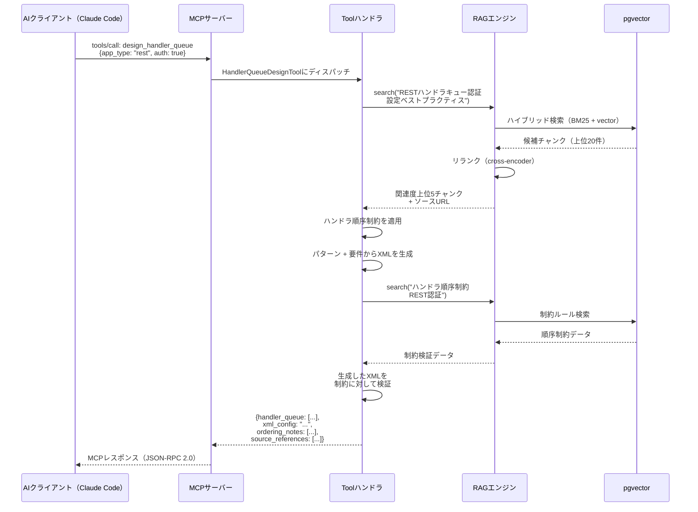
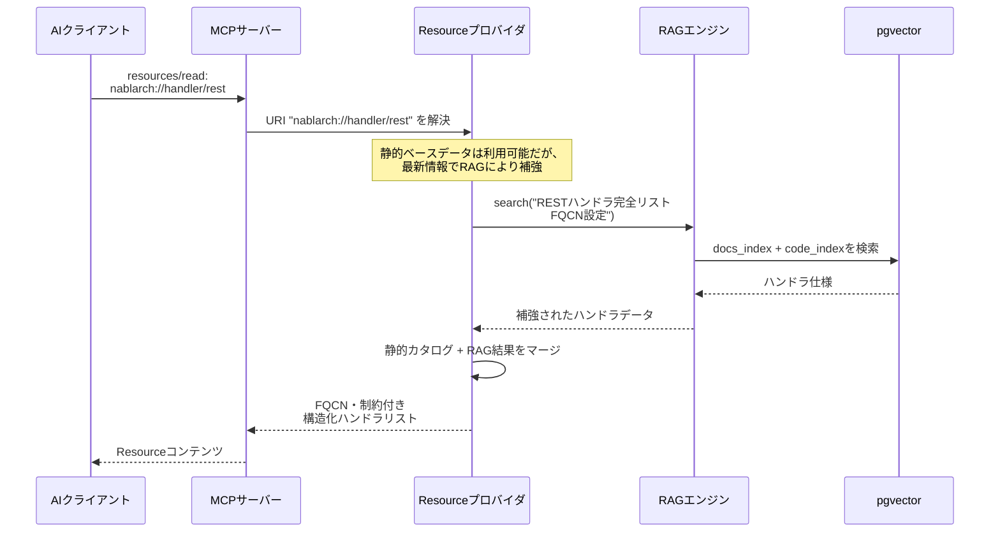

# Nablarch MCPサーバー — RAG強化アーキテクチャ設計書

> **対象読者**: 開発者（アーキテクチャを理解したい人）
> **前提知識**: Spring Boot, MCP, RAGの基本概念
> **概要**: RAG強化型MCPサーバーのアーキテクチャ設計、コンポーネント構成

---

## 目次

1. [システム概要](#1-システム概要)
2. [アーキテクチャ図](#2-アーキテクチャ図)
3. [コンポーネントアーキテクチャ](#3-コンポーネントアーキテクチャ)
4. [RAGパイプライン設計](#4-ragパイプライン設計)
5. [MCPプリミティブ設計](#5-mcpプリミティブ設計)
6. [RAG-MCP統合アーキテクチャ](#6-rag-mcp統合アーキテクチャ)
7. [技術スタック](#7-技術スタック)
8. [デプロイメントアーキテクチャ](#8-デプロイメントアーキテクチャ)
9. [データモデル](#9-データモデル)
10. [セキュリティアーキテクチャ](#10-セキュリティアーキテクチャ)
11. [フェーズ別ロードマップ](#11-フェーズ別ロードマップ)

---

## 1. システム概要

### 1.1 本システムの機能

Nablarch MCPサーバーは、NablarchフレームワークのナレッジをModel Context Protocol（MCP）経由でAIコーディングアシスタント（Claude Code、Cursor、Copilot、VS Code）に提供する**RAG強化MCPサーバー**である。

本システムは以下を組み合わせている：
- **MCP**（標準インターフェース層）— Tools、Resources、PromptsをAIクライアントに公開
- **RAG（Retrieval-Augmented Generation）**（知識層）— Nablarchのドキュメント、ソースコード、Javadoc、XML設定に対するセマンティック検索を実現

### 1.2 なぜRAG + MCPなのか

| アプローチ | 検索品質 | AIツール統合 | ツール実行 | 評価 |
|----------|:-------------:|:------------------:|:--------------:|---------|
| RAGのみ | セマンティック検索 | 標準インターフェースなし | 不可 | ナレッジはあるがツールなし |
| MCPのみ | キーワード/静的 | 標準プロトコル | 可能 | ツールはあるが検索が弱い |
| **RAG + MCP** | **セマンティック検索** | **標準プロトコル** | **可能** | **両方の長所を活用** |

研究（arXiv:2505.03275）によると、RAG強化MCPはナイーブなMCPツール選択と比較して、プロンプトトークンを75%削減し、精度を3倍向上させることが実証されている。

### 1.3 設計原則

1. **MCP内蔵RAG** — RAGエンジンはMCPサーバープロセス内で動作し、外部サービスとしては存在しない
2. **ハイブリッド検索** — BM25（キーワード）とベクトル類似度を組み合わせ、最大の再現率を実現
3. **デュアルエンベディング** — ドキュメント（多言語対応）とコード（Java/XML）で別々のモデルを使用
4. **出典明示** — すべての回答にソースURL、ファイルパス、またはJavadocリンクを付与
5. **段階的デリバリー** — 静的ナレッジから始め、フルRAGへ進化

---

## 2. アーキテクチャ図

### 2.1 システムレベルアーキテクチャ

```
┌──────────────────────────────────────────────────────────────────┐
│                     AIコーディングツール                            │
│   Claude Code  │  Cursor  │  Copilot  │  VS Code  │  Claude Desktop│
│   ┌──────────────────────────────────────────────────────────┐   │
│   │                      MCPクライアント                       │   │
│   └──────────────────────────┬───────────────────────────────┘   │
└──────────────────────────────┼───────────────────────────────────┘
                               │ JSON-RPC 2.0
                               │ STDIO（ローカル）/ Streamable HTTP（リモート）
┌──────────────────────────────▼───────────────────────────────────┐
│              Nablarch MCPサーバー（Spring Boot）                    │
│                                                                   │
│  ┌─────────────────────────────────────────────────────────────┐ │
│  │                   MCPプロトコル層                              │ │
│  │  ┌────────────┐  ┌─────────────┐  ┌────────────────────┐  │ │
│  │  │   Tools     │  │  Resources  │  │     Prompts        │  │ │
│  │  │ (10ツール)  │  │ (8タイプ)   │  │  (6テンプレート)    │  │ │
│  │  └──────┬─────┘  └──────┬──────┘  └─────────┬──────────┘  │ │
│  └─────────┼───────────────┼────────────────────┼─────────────┘ │
│            │               │                    │                │
│  ┌─────────▼───────────────▼────────────────────▼─────────────┐ │
│  │                   RAGエンジン（組み込み）                      │ │
│  │                                                              │ │
│  │  ┌──────────────┐  ┌───────────────┐  ┌────────────────┐  │ │
│  │  │ クエリ       │  │ ハイブリッド   │  │ リランキング   │  │ │
│  │  │ プロセッサ   │→ │ 検索          │→ │ Cross-Encoder  │  │ │
│  │  │              │  │ BM25 + Vector │  │                │  │ │
│  │  └──────────────┘  └───────────────┘  └────────────────┘  │ │
│  │                                                              │ │
│  │  ┌──────────────┐  ┌──────────────┐                        │ │
│  │  │ Docエンベッダ │  │ Codeエンベッダ│  エンベディングモデル  │ │
│  │  │ (ONNX bge-m3)│  │(ONNX CodeSage)│                       │ │
│  │  └──────────────┘  └──────────────┘                        │ │
│  └────────────────────────────┬─────────────────────────────┘   │
│                               │                                  │
│  ┌────────────────────────────▼──────────────────────────────┐  │
│  │              PostgreSQL + pgvector                          │  │
│  │  ┌──────────┐ ┌──────────┐ ┌──────────┐ ┌─────────────┐  │  │
│  │  │ Docs     │ │ Code     │ │ Javadoc  │ │ Config XML  │  │  │
│  │  │ Index    │ │ Index    │ │ Index    │ │ Index       │  │  │
│  │  └──────────┘ └──────────┘ └──────────┘ └─────────────┘  │  │
│  └────────────────────────────────────────────────────────────┘  │
└──────────────────────────────────────────────────────────────────┘
```

### 2.2 コンポーネント図

```
┌──────────────────────────────────────────────────────────────────┐
│                    Spring Bootアプリケーション                      │
│                                                                   │
│  ┌────────────────────────────────────┐                          │
│  │        トランスポート層             │                          │
│  │  StdioServerTransportProvider       │  ← STDIO（ローカル）     │
│  │  HttpServletStreamableServer...     │  ← HTTP（リモート）      │
│  └───────────────┬────────────────────┘                          │
│                  │                                                │
│  ┌───────────────▼────────────────────┐                          │
│  │        MCPサーバーコア              │                          │
│  │  McpServer / McpStreamableServer    │  ← MCP Java SDK         │
│  │  ケイパビリティネゴシエーション      │                          │
│  │  セッション管理                     │                          │
│  └───────────────┬────────────────────┘                          │
│                  │                                                │
│  ┌───────────────▼────────────────────┐                          │
│  │        アプリケーション層           │                          │
│  │                                     │                          │
│  │  ┌──────────────────────────────┐  │                          │
│  │  │ Toolハンドラ                 │  │                          │
│  │  │ • SemanticSearchTool         │  │                          │
│  │  │ • HandlerQueueDesignTool     │  │                          │
│  │  │ • CodeGenerationTool         │  │                          │
│  │  │ • ConfigValidationTool       │  │                          │
│  │  │ • ApiSearchTool              │  │                          │
│  │  │ • TestGenerationTool         │  │                          │
│  │  │ • TroubleshootTool           │  │                          │
│  │  │ • MigrationAnalysisTool      │  │                          │
│  │  │ • PatternRecommendTool       │  │                          │
│  │  │ • HandlerQueueOptimizeTool   │  │                          │
│  │  └──────────────────────────────┘  │                          │
│  │                                     │                          │
│  │  ┌──────────────────────────────┐  │                          │
│  │  │ Resourceプロバイダ           │  │                          │
│  │  │ • nablarch://handler/*       │  │                          │
│  │  │ • nablarch://api/*           │  │                          │
│  │  │ • nablarch://pattern/*       │  │                          │
│  │  │ • nablarch://guide/*         │  │                          │
│  │  │ • nablarch://example/*       │  │                          │
│  │  │ • nablarch://config/*        │  │                          │
│  │  │ • nablarch://antipattern/*   │  │                          │
│  │  │ • nablarch://version         │  │                          │
│  │  └──────────────────────────────┘  │                          │
│  │                                     │                          │
│  │  ┌──────────────────────────────┐  │                          │
│  │  │ Promptテンプレート           │  │                          │
│  │  │ • setup-handler-queue        │  │                          │
│  │  │ • create-web-app             │  │                          │
│  │  │ • create-rest-api            │  │                          │
│  │  │ • create-batch               │  │                          │
│  │  │ • review-code                │  │                          │
│  │  │ • troubleshoot               │  │                          │
│  │  └──────────────────────────────┘  │                          │
│  └───────────────┬────────────────────┘                          │
│                  │                                                │
│  ┌───────────────▼────────────────────┐                          │
│  │        RAGエンジン                  │                          │
│  │  ┌──────────┐ ┌──────────┐        │                          │
│  │  │ Indexer   │ │ Retriever│        │                          │
│  │  └──────────┘ └──────────┘        │                          │
│  │  ┌──────────┐ ┌──────────┐        │                          │
│  │  │ Embedder │ │ Reranker │        │                          │
│  │  └──────────┘ └──────────┘        │                          │
│  └───────────────┬────────────────────┘                          │
│                  │                                                │
│  ┌───────────────▼────────────────────┐                          │
│  │        データ層                     │                          │
│  │  PostgreSQL + pgvector              │                          │
│  └─────────────────────────────────────┘                          │
└──────────────────────────────────────────────────────────────────┘
```

---

## 3. コンポーネントアーキテクチャ

### 3.1 トランスポート層

| トランスポート | クラス | ユースケース | プロトコル |
|-----------|-------|----------|----------|
| STDIO | `StdioServerTransportProvider` | ローカル開発（Claude Code、Claude Desktop） | stdin/stdout JSON-RPC 2.0 |
| Streamable HTTP | `HttpServletStreamableServerTransportProvider` | リモート/チームサーバー | HTTP POST + SSE |

両トランスポートはMCP Java SDKの`mcp-core`モジュールによって提供される（コア部分にSpring依存なし）。

### 3.2 MCPサーバーコア

MCP Java SDKの`McpServer`（同期）または`McpAsyncServer`上に構築。責務：
- プロトコルライフサイクル（initialize → operate → shutdown）
- ケイパビリティネゴシエーション（サポートするTools/Resources/Promptsの通知）
- セッション管理（HTTP用の`Mcp-Session-Id`）
- バッチメッセージ処理

### 3.3 アプリケーション層

MCPプリミティブの3カテゴリ：

| カテゴリ | 数 | 制御主体 | 説明 |
|----------|-------|---------|-------------|
| **Tools** | 10 | AIモデルが呼び出す | 実行可能な関数（検索、生成、検証） |
| **Resources** | 8 URIパターン | アプリケーションが制御 | 読み取り専用のNablarchナレッジ |
| **Prompts** | 6テンプレート | ユーザーが選択 | ガイド付きワークフローテンプレート |

### 3.4 RAGエンジン

Spring Bootプロセス内に組み込み。コンポーネント：

| コンポーネント | 責務 | 技術 |
|-----------|---------------|------------|
| **クエリプロセッサ** | クエリ分析、再構成、ルーティング | カスタムJava |
| **ハイブリッド検索** | BM25キーワード + ベクトル類似度 | pgvector + PostgreSQL FTS |
| **リランカー** | 候補結果のスコアリランキング | Cross-Encoderモデル |
| **Docエンベッダ** | ドキュメントテキストの埋め込み | BAAI/bge-m3（ONNXローカル）/ Jina v4（API） |
| **Codeエンベッダ** | Java/XMLソースコードの埋め込み | CodeSage-small-v2（ONNXローカル）/ Voyage-code-3（API） |
| **Indexer** | ドキュメントの取り込み、チャンク分割、埋め込み、格納 | カスタムパイプライン |

### 3.5 データ層

pgvector拡張を搭載したPostgreSQL。異なるコンテンツタイプに対して、それぞれ異なるチャンキング戦略とエンベディング戦略を持つ4つの専用インデックス。

---

## 4. RAGパイプライン設計

### 4.1 データ取り込みパイプライン

```
┌─────────────────────────────────────────────────────────────┐
│                    データソース                                │
│                                                               │
│  ┌──────────────┐ ┌──────────────┐ ┌──────────────────────┐ │
│  │ 公式ドキュメント│ │ GitHubリポジ │ │ API Javadoc          │ │
│  │ nablarch.     │ │ トリ         │ │ nablarch.github.io/  │ │
│  │ github.io     │ │ 113リポジトリ │ │ docs/*/javadoc/      │ │
│  │               │ │ (nablarch    │ │                      │ │
│  │               │ │  org)        │ │                      │ │
│  └───────┬──────┘ └───────┬──────┘ └───────────┬──────────┘ │
│          │                │                     │            │
│  ┌──────────────┐ ┌──────────────┐ ┌──────────────────────┐ │
│  │ Fintan       │ │ 設定XML      │ │ 開発標準             │ │
│  │ fintan.jp    │ │ (サンプル    │ │ nablarch-development │ │
│  │ (ガイド、    │ │  プロジェクト)│ │ -standards           │ │
│  │  標準)       │ │              │ │                      │ │
│  └───────┬──────┘ └───────┬──────┘ └───────────┬──────────┘ │
└──────────┼────────────────┼─────────────────────┼────────────┘
           ▼                ▼                     ▼
┌─────────────────────────────────────────────────────────────┐
│                 ドキュメント処理                               │
│                                                               │
│  ┌────────────┐ ┌────────────┐ ┌────────────┐ ┌───────────┐ │
│  │ HTMLパーサ  │ │ Javaパーサ │ │ XMLパーサ  │ │ Javadoc   │ │
│  │ (ドキュメント│ │ (ASTベース)│ │ (タグベース)│ │ パーサ    │ │
│  │  Fintan)    │ │            │ │            │ │           │ │
│  └──────┬─────┘ └──────┬─────┘ └─────┬──────┘ └─────┬─────┘ │
│         └───────┬──────┴──────┬──────┴───────┬───────┘       │
│                 ▼             ▼              ▼               │
│         ┌─────────────────────────────────────────────┐      │
│         │        チャンキングエンジン                    │      │
│         │  （コンテンツタイプ別戦略）                     │      │
│         └────────────────────┬────────────────────────┘      │
└──────────────────────────────┼───────────────────────────────┘
                               ▼
┌─────────────────────────────────────────────────────────────┐
│                  エンベディング＆ストレージ                     │
│                                                               │
│  ┌──────────────────┐    ┌──────────────────┐                │
│  │ Docエンベッダ      │    │ Codeエンベッダ   │                │
│  │ (ONNX bge-m3)    │    │ (ONNX CodeSage)  │                │
│  │ 89言語対応        │    │ Java/XML特化     │                │
│  │ 32Kコンテキスト    │    │                  │                │
│  └────────┬─────────┘    └────────┬─────────┘                │
│           └──────────┬───────────┘                            │
│                      ▼                                        │
│  ┌───────────────────────────────────────────────────────┐   │
│  │           PostgreSQL + pgvector                        │   │
│  │  ┌──────────┐ ┌──────────┐ ┌────────┐ ┌───────────┐  │   │
│  │  │docs_index│ │code_index│ │jdoc_idx│ │config_idx │  │   │
│  │  │          │ │          │ │        │ │           │  │   │
│  │  │ 約5K件   │ │約20Kファイル│ │約15Kクラス│ │約500 XML │  │   │
│  │  └──────────┘ └──────────┘ └────────┘ └───────────┘  │   │
│  └───────────────────────────────────────────────────────┘   │
└─────────────────────────────────────────────────────────────┘
```

### 4.2 チャンキング戦略

| コンテンツタイプ | 戦略 | チャンクサイズ | オーバーラップ | 根拠 |
|---|---|---|---|---|
| 公式ドキュメント（HTML/RST） | 構造認識（見出しベース） | 512トークン | 20% | 見出しが自然なセマンティック境界を提供 |
| Javaソースコード | ASTベース（クラス/メソッド単位） | 256–512トークン | コンテキストを先頭に付加 | メソッド境界が自然な分割点 |
| XML設定ファイル | タグベース（ハンドラ/コンポーネント単位） | 256トークン | 親タグのコンテキスト | XML構造が自然な単位を提供 |
| API Javadoc | クラス/メソッド単位 | 256トークン | パッケージ情報を先頭に付加 | 1メソッド = 1チャンクが最適 |
| 開発標準（テキスト） | セマンティックチャンキング | 512トークン | 20% | 緩いセクション構造にはセマンティック分割が必要 |
| サンプルコード | ファイル単位 + メソッド分割 | 512トークン | ファイルメタデータを先頭に付加 | サンプルにはファイル全体のコンテキストが重要 |

### 4.3 メタデータスキーマ

各チャンクはフィルタリング、コンテキスト補強、出典明示のためのメタデータを保持する：

```json
{
  "source": "nablarch-document | github | fintan | javadoc",
  "source_type": "documentation | code | javadoc | config | standard",
  "nablarch_version": "6u3",
  "module": "nablarch-core-repository",
  "category": "application_framework/libraries/repository",
  "language": "ja | en",
  "app_type": "web | rest | batch | messaging | common",
  "file_path": "src/main/java/nablarch/fw/Handler.java",
  "section_hierarchy": ["Application Framework", "Libraries", "System Repository"],
  "url": "https://nablarch.github.io/docs/LATEST/doc/...",
  "fqcn": "nablarch.fw.Handler"
}
```

### 4.4 エンベディングモデル選定

| モデル | 用途 | パラメータ数 | 多言語対応 | コード | コンテキスト長 | ライセンス |
|---|---|---|---|---|---|---|
| **Jina embeddings-v4** | ドキュメント | 3.8B | 89言語 | 中程度 | 32Kトークン | OSS |
| **Voyage-code-3** | Java/XMLコード | — | あり | 優秀（CoIR 77.33） | — | 商用 |

**根拠**: Nablarchは広範な日本語ドキュメントとJava/XMLソースコードの両方を持つため、デュアルモデルアプローチが必要である。単一モデルでは両方を最適に埋め込むことはできない。Jina v4はOpenAI text-embedding-3-largeを多言語検索ベンチマークで12%上回る。

### 4.5 ベクトルデータベース選定

**選択**: PostgreSQL + pgvector + pgvectorscale

| 基準 | pgvector | 専用VectorDB（Weaviate/Qdrant） |
|-----------|----------|--------------------------------------|
| コスト | 低い（既存のPostgreSQLを再利用） | 追加のインフラが必要 |
| SQL + Vector | ネイティブ結合クエリ | 外部SQLデータベースが必要 |
| ACID | 完全なACIDコンプライアンス | 製品による |
| スケール | 5000万ベクトル @ 471 QPS（再現率99%） | より高い上限 |
| Nablarch親和性 | 高い（NablarchはRDBMS中心） | 低い関連性 |
| 運用保守 | 単一DBの管理のみ | 追加サービスの管理が必要 |

我々の規模（約4万チャンク）では、pgvectorで十分以上であり、新たなデータストアの導入を回避できる。

### 4.6 検索フロー

```
┌──────────────────────────────────────────────────────────┐
│                  検索パイプライン                           │
│                                                           │
│  クエリ: "REST API認証付きハンドラキュー構成"               │
│     │                                                     │
│     ▼                                                     │
│  ┌──────────────────────────────────────┐                │
│  │ 1. クエリ分析                        │                │
│  │    • 言語検出（ja）                   │                │
│  │    • 分類: コード? ドキュメント? 設定? │                │
│  │    • エンティティ抽出: REST, 認証,    │                │
│  │      ハンドラキュー                   │                │
│  └───────────────┬──────────────────────┘                │
│                  ▼                                        │
│  ┌──────────────────────────────────────┐                │
│  │ 2. クエリ再構成                      │                │
│  │    • 原文: "REST API認証付きハンドラ   │               │
│  │      キュー構成"                      │                │
│  │    • 拡張: "RESTful Web service       │                │
│  │      handler queue authentication    │                │
│  │      JaxRsResponseHandler"           │                │
│  └───────────────┬──────────────────────┘                │
│                  ▼                                        │
│  ┌──────────────────────────────────────┐                │
│  │ 3. ハイブリッド検索                   │                │
│  │    • BM25（キーワード）: "REST handler│                │
│  │      queue authentication"           │                │
│  │    • Vector（セマンティック）: embed   │                │
│  │      (query)                         │                │
│  │    • Reciprocal Rank Fusion          │                │
│  │    • フィルタ: app_type = "rest"     │                │
│  └───────────────┬──────────────────────┘                │
│                  ▼                                        │
│  ┌──────────────────────────────────────┐                │
│  │ 4. リランキング（Cross-Encoder）      │                │
│  │    • 各候補を元のクエリに対して       │                │
│  │      スコアリング                     │                │
│  │    • Top-Kを返却（デフォルト: 5）     │                │
│  └───────────────┬──────────────────────┘                │
│                  ▼                                        │
│  ┌──────────────────────────────────────┐                │
│  │ 5. 結果フォーマット                   │                │
│  │    • ソースURL付き構造化JSON          │                │
│  │    • 信頼度スコア                     │                │
│  │    • セクションハイライト              │                │
│  └──────────────────────────────────────┘                │
└──────────────────────────────────────────────────────────┘
```

---

## 5. MCPプリミティブ設計

### 5.1 Tools

#### Tool 1: `semantic_search`

| フィールド | 値 |
|-------|-------|
| **説明** | 自然言語クエリを使用してNablarchナレッジベースを検索 |
| **使用タイミング** | AIがトレーニングデータにないNablarch固有の情報を必要とする場合 |

**入力スキーマ**:
```json
{
  "type": "object",
  "properties": {
    "query": { "type": "string", "description": "Natural language search query" },
    "scope": { "type": "string", "enum": ["all", "docs", "code", "javadoc", "config"], "default": "all" },
    "app_type": { "type": "string", "enum": ["web", "rest", "batch", "messaging", "all"], "default": "all" },
    "top_k": { "type": "integer", "default": 5, "minimum": 1, "maximum": 20 }
  },
  "required": ["query"]
}
```

**出力スキーマ**:
```json
{
  "results": [
    {
      "content": "string — マッチしたコンテンツチャンク",
      "source_url": "string — URLまたはファイルパス",
      "source_type": "string — docs|code|javadoc|config",
      "score": "number — 関連度スコア 0-1",
      "metadata": { "module": "string", "fqcn": "string", "section": "string" }
    }
  ],
  "total_found": "integer",
  "query_analysis": { "language": "string", "entities": ["string"] }
}
```

#### Tool 2: `design_handler_queue`

| フィールド | 値 |
|-------|-------|
| **説明** | 指定されたアプリケーションタイプと要件に基づいてハンドラキュー構成を設計 |
| **使用タイミング** | 開発者がNablarchハンドラキューのセットアップまたは変更を必要とする場合 |

**入力スキーマ**:
```json
{
  "type": "object",
  "properties": {
    "app_type": { "type": "string", "enum": ["web", "rest", "batch", "resident-batch", "mom-messaging", "http-messaging"] },
    "requirements": {
      "type": "object",
      "properties": {
        "authentication": { "type": "boolean", "default": false },
        "csrf_protection": { "type": "boolean", "default": false },
        "cors": { "type": "boolean", "default": false },
        "file_upload": { "type": "boolean", "default": false },
        "multi_db": { "type": "boolean", "default": false },
        "custom_handlers": { "type": "array", "items": { "type": "string" } }
      }
    }
  },
  "required": ["app_type"]
}
```

**出力スキーマ**:
```json
{
  "handler_queue": [
    { "order": 1, "name": "string", "fqcn": "string", "role": "string", "thread": "main|sub" }
  ],
  "xml_config": "string — 完全なXML設定",
  "ordering_notes": ["string — 順序制約の説明"],
  "source_references": ["string — ドキュメントURL"]
}
```

#### Tool 3: `generate_code`

| フィールド | 値 |
|-------|-------|
| **説明** | Nablarch準拠のコード（Action、Form、SQL定義等）を生成 |
| **使用タイミング** | 開発者がNablarchの規約に従ったボイラープレートコードを必要とする場合 |

**入力スキーマ**:
```json
{
  "type": "object",
  "properties": {
    "type": { "type": "string", "enum": ["action", "form", "sql", "entity", "handler", "interceptor"] },
    "name": { "type": "string" },
    "app_type": { "type": "string", "enum": ["web", "rest", "batch"] },
    "specifications": {
      "type": "object",
      "description": "Type-specific parameters (routing path, fields, queries, etc.)"
    }
  },
  "required": ["type", "name"]
}
```

**出力**:
```json
{
  "files": [
    { "path": "string — 推奨ファイルパス", "content": "string — 生成されたコード", "language": "java|xml|sql" }
  ],
  "conventions_applied": ["string — 適用されたNablarch規約"],
  "dependencies": ["string — 必要なMavenアーティファクト"]
}
```

#### Tool 4: `validate_config`

| フィールド | 値 |
|-------|-------|
| **説明** | NablarchのXML設定（ハンドラキュー、コンポーネント定義）を検証 |
| **使用タイミング** | 開発者がデプロイ前にXML設定の正確性を確認したい場合 |

**入力スキーマ**:
```json
{
  "type": "object",
  "properties": {
    "xml": { "type": "string", "description": "XML configuration content" },
    "config_type": { "type": "string", "enum": ["handler-queue", "component-definition", "routing"] }
  },
  "required": ["xml", "config_type"]
}
```

**出力**:
```json
{
  "valid": "boolean",
  "errors": [{ "line": "integer", "message": "string", "severity": "error|warning" }],
  "suggestions": [{ "message": "string", "fix": "string" }],
  "handler_order_check": { "passed": "boolean", "violations": ["string"] }
}
```

#### Tool 5: `search_api`

| フィールド | 値 |
|-------|-------|
| **説明** | クラス名、メソッド名、またはパッケージでNablarch APIを検索 |
| **使用タイミング** | 開発者がJavadocレベルのAPI情報を必要とする場合 |

**入力スキーマ**:
```json
{
  "type": "object",
  "properties": {
    "query": { "type": "string", "description": "Class name, method name, or keyword" },
    "module": { "type": "string", "description": "Filter by Maven module (e.g., nablarch-core)" }
  },
  "required": ["query"]
}
```

**出力**:
```json
{
  "classes": [
    {
      "fqcn": "string",
      "module": "string",
      "description": "string",
      "methods": [{ "name": "string", "signature": "string", "description": "string" }],
      "javadoc_url": "string",
      "github_url": "string"
    }
  ]
}
```

#### Tool 6: `generate_test`

| フィールド | 値 |
|-------|-------|
| **説明** | Nablarchテスティングフレームワーク（JUnit + Excelテストデータ）を使用したテストコードを生成 |
| **使用タイミング** | 開発者がNablarchコンポーネントのテストケースを必要とする場合 |

**入力スキーマ**:
```json
{
  "type": "object",
  "properties": {
    "target_class": { "type": "string", "description": "FQCN of the class to test" },
    "test_type": { "type": "string", "enum": ["unit", "request-response", "batch", "messaging"] },
    "format": { "type": "string", "enum": ["junit5", "nablarch-excel"], "default": "junit5" }
  },
  "required": ["target_class", "test_type"]
}
```

#### Tool 7: `troubleshoot`

| フィールド | 値 |
|-------|-------|
| **説明** | Nablarchのエラーメッセージを分析し、解決策を提案 |
| **使用タイミング** | 開発者がNablarch固有のエラーに遭遇した場合 |

**入力スキーマ**:
```json
{
  "type": "object",
  "properties": {
    "error_message": { "type": "string" },
    "stack_trace": { "type": "string" },
    "environment": { "type": "string", "description": "Container/server info" }
  },
  "required": ["error_message"]
}
```

#### Tool 8: `analyze_migration`

| フィールド | 値 |
|-------|-------|
| **説明** | Nablarchバージョン移行（5→6）のためのコード分析 |
| **使用タイミング** | チームがNablarchプロジェクトのメジャーバージョン間の移行を行う場合 |

**入力スキーマ**:
```json
{
  "type": "object",
  "properties": {
    "source_version": { "type": "string", "default": "5" },
    "target_version": { "type": "string", "default": "6" },
    "code_snippet": { "type": "string", "description": "Code to analyze for migration issues" }
  },
  "required": ["code_snippet"]
}
```

#### Tool 9: `recommend_pattern`

| フィールド | 値 |
|-------|-------|
| **説明** | 指定された要件に対してNablarchの設計パターンを推奨 |
| **使用タイミング** | アーキテクトがNablarch固有の設計判断に関するガイダンスを必要とする場合 |

**入力スキーマ**:
```json
{
  "type": "object",
  "properties": {
    "requirement": { "type": "string" },
    "app_type": { "type": "string", "enum": ["web", "rest", "batch", "messaging"] },
    "constraints": { "type": "array", "items": { "type": "string" } }
  },
  "required": ["requirement"]
}
```

#### Tool 10: `optimize_handler_queue`

| フィールド | 値 |
|-------|-------|
| **説明** | 既存のハンドラキューを分析し、最適化を提案 |
| **使用タイミング** | パフォーマンスチューニングまたは設定レビュー |

**入力スキーマ**:
```json
{
  "type": "object",
  "properties": {
    "current_xml": { "type": "string", "description": "Current handler queue XML" },
    "app_type": { "type": "string" },
    "concern": { "type": "string", "enum": ["performance", "security", "correctness", "all"], "default": "all" }
  },
  "required": ["current_xml"]
}
```

### 5.2 Resources

| Resource URIパターン | 説明 | コンテンツタイプ |
|---|---|---|
| `nablarch://handler/{app_type}` | 各アプリケーションタイプ（web, rest, batch, resident-batch, mom-messaging, http-messaging）のハンドラキュー仕様 | JSON（FQCN、順序、制約付きハンドラリスト） |
| `nablarch://api/{module}/{class}` | 特定クラスのAPIリファレンス | JSON（Javadoc形式の構造化データ） |
| `nablarch://pattern/{name}` | 設計パターンカタログ（例: session-management, multi-db, csrf-protection） | Markdown |
| `nablarch://guide/{topic}` | 学習ガイド（handler-queue, testing, migration-5to6, xml-config） | Markdown |
| `nablarch://example/{type}` | サンプルコード（rest-api, web-crud, batch-db, messaging-mom） | JSON（複数ファイル） |
| `nablarch://config/{name}` | XML設定テンプレート（web-component, rest-component, batch-component） | XML |
| `nablarch://antipattern/{name}` | よくあるアンチパターンとその修正 | Markdown |
| `nablarch://version` | バージョン情報、対応プラットフォーム、モジュール一覧 | JSON |

### 5.3 Prompts

| Prompt名 | 説明 | 引数 |
|---|---|---|
| `setup-handler-queue` | ハンドラキュー設計のステップバイステップガイド | `app_type`, `requirements`（認証、CSRF等） |
| `create-web-app` | NablarchのWebアプリケーションをゼロから作成するガイド | `level`（beginner/intermediate/advanced） |
| `create-rest-api` | NablarchでRESTful APIを作成するガイド | `entity_name`, `operations`（CRUD選択） |
| `create-batch` | バッチアプリケーション作成ガイド | `batch_type`（db-read, file-process, resident） |
| `review-code` | Nablarchコーディング規約レビューテンプレート | `code`, `aspect`（convention, security, performance） |
| `troubleshoot` | トラブルシューティングガイドテンプレート | `error`, `env` |

---

## 6. RAG-MCP統合アーキテクチャ

### 6.1 統合パターン: MCP内蔵RAG

RAGエンジンはMCPサーバープロセス内に組み込まれている。MCPツールが呼び出されると、レスポンス生成前に内部でRAGエンジンを呼び出してナレッジを検索する。

```
┌──────────────────────────────────────────────────────────────┐
│                    統合フロー                                   │
│                                                               │
│  MCPツール呼び出し                                              │
│       │                                                       │
│       ▼                                                       │
│  ┌──────────────────────┐                                    │
│  │ Toolハンドラ          │                                    │
│  │ (例: design_handler   │                                    │
│  │  _queue)              │                                    │
│  └──────────┬───────────┘                                    │
│             │                                                 │
│       ┌─────┴─────┐                                          │
│       │           │                                           │
│       ▼           ▼                                           │
│  ┌─────────┐ ┌──────────┐                                   │
│  │ RAG     │ │ 静的     │                                    │
│  │ 検索    │ │ ナレッジ │                                    │
│  └────┬────┘ └────┬─────┘                                    │
│       │           │                                           │
│       └─────┬─────┘                                           │
│             ▼                                                 │
│  ┌──────────────────────┐                                    │
│  │ 結果アグリゲータ      │                                    │
│  │ • RAG結果をマージ     │                                    │
│  │ • ビジネスロジック適用 │                                    │
│  │ • レスポンスの整形    │                                    │
│  │ • ソースURLの付与     │                                    │
│  └──────────┬───────────┘                                    │
│             │                                                 │
│             ▼                                                 │
│       MCPレスポンス                                            │
└──────────────────────────────────────────────────────────────┘
```

### 6.2 シーケンス: RAG付きツール呼び出し



### 6.3 シーケンス: RAG付きResource読み取り



### 6.4 コンテキスト注入パターン

RAGエンジンが検索結果を返すと、MCPサーバーはそれをToolのレスポンスに構造化コンテキストとして注入する。このパターンにより以下を保証する：

1. **出典明示** — すべての情報にその出自URLを付与
2. **信頼度スコアリング** — 結果を関連度でランキング
3. **メタデータフィルタリング** — アプリケーションタイプ、モジュール、バージョンで結果をフィルタリング可能
4. **フォールバック** — RAGが結果を返さない場合、静的ナレッジベースにフォールバック

---

## 7. 技術スタック

| レイヤー | 技術 | バージョン | 選定理由 |
|---|---|---|---|
| **言語** | Java | 17+ | Nablarchエコシステムとの一貫性 |
| **フレームワーク** | Spring Boot | 3.x | MCP Boot Starterサポート、成熟したエコシステム |
| **MCP SDK** | MCP Java SDK | 0.17.x | 公式SDK、Spring AI統合 |
| **ビルド** | Gradle（Kotlin DSL） | 8.x | モダンなビルドシステム |
| **ベクトルDB** | PostgreSQL + pgvector | 16 + 0.8.x | コスト効率、SQL+ベクトル、ACID |
| **Docエンベディング** | Jina embeddings-v4 | — | 89言語対応、32Kコンテキスト、OSS |
| **Codeエンベディング** | Voyage-code-3 | — | Java/XMLエンベディング最高水準 |
| **リランカー** | Cross-Encoder | — | ハイブリッド検索上の精度向上 |
| **トランスポート（ローカル）** | STDIO | — | Claude Code / Claude Desktop |
| **トランスポート（リモート）** | Streamable HTTP | — | チーム共有、Dockerデプロイメント |
| **テスト** | JUnit 5 | — | 標準Javaテスティング |
| **コンテナ化** | Docker | — | 再現可能なデプロイメント |

### 7.1 主要な依存関係

```groovy
// MCPサーバー
implementation("io.modelcontextprotocol:mcp-spring-webmvc:0.17.x")
// STDIOのみの場合:
implementation("io.modelcontextprotocol:mcp:0.17.x")

// RAG - ベクトルDB
implementation("org.postgresql:postgresql:42.x")
implementation("com.pgvector:pgvector-java:0.x")

// RAG - エンベディング（モデルAPIへのHTTPクライアント）
implementation("com.squareup.okhttp3:okhttp:4.x")

// Spring Boot
implementation("org.springframework.boot:spring-boot-starter-web")
implementation("org.springframework.boot:spring-boot-starter-data-jpa")
```

---

## 8. デプロイメントアーキテクチャ

### 8.1 ローカルモード（開発者PC）

```
┌─────────────────────────────────────────────────┐
│                開発者PC                           │
│                                                  │
│  ┌──────────────┐    STDIO    ┌──────────────┐  │
│  │ Claude Code / │◄──────────▶│ Nablarch MCP │  │
│  │ Claude Desktop│            │ サーバー(JAR) │  │
│  └──────────────┘            │              │  │
│                               │  ┌──────────┐│  │
│                               │  │ 組み込み  ││  │
│                               │  │ pgvector  ││  │
│                               │  │ (H2+ext)  ││  │
│                               │  └──────────┘│  │
│                               └──────────────┘  │
└─────────────────────────────────────────────────┘
```

**設定**（`.claude/mcp.json` または `claude_desktop_config.json`）:
```json
{
  "mcpServers": {
    "nablarch": {
      "command": "java",
      "args": ["-jar", "/path/to/nablarch-mcp-server.jar", "--spring.profiles.active=local"]
    }
  }
}
```

### 8.2 リモートモード（チームサーバー）

```
┌──────────────────────────────────────────────────────────────┐
│                       チームサーバー                            │
│                                                               │
│  ┌────────────────────────────────────────────────────────┐  │
│  │                Docker Compose                           │  │
│  │                                                         │  │
│  │  ┌──────────────────┐     ┌──────────────────────┐     │  │
│  │  │ nablarch-mcp     │     │ postgres              │     │  │
│  │  │ (Spring Boot)    │────▶│ (pgvector)            │     │  │
│  │  │ ポート: 8080     │     │ ポート: 5432          │     │  │
│  │  │                  │     │                       │     │  │
│  │  │ /mcp (HTTP)      │     │ • docs_index          │     │  │
│  │  └──────────────────┘     │ • code_index          │     │  │
│  │         ▲                  │ • javadoc_index       │     │  │
│  │         │                  │ • config_index        │     │  │
│  │         │ Streamable HTTP  └──────────────────────┘     │  │
│  └─────────┼──────────────────────────────────────────────┘  │
│            │                                                  │
└────────────┼──────────────────────────────────────────────────┘
             │
    ┌────────┴────────┐
    │  AIクライアント   │
    │  (全開発者)      │
    └─────────────────┘
```

### 8.3 Docker Compose

```yaml
version: "3.9"
services:
  nablarch-mcp:
    build: .
    ports:
      - "8080:8080"
    environment:
      SPRING_PROFILES_ACTIVE: remote
      SPRING_DATASOURCE_URL: jdbc:postgresql://postgres:5432/nablarch_mcp
      JINA_API_KEY: ${JINA_API_KEY}
      VOYAGE_API_KEY: ${VOYAGE_API_KEY}
    depends_on:
      - postgres

  postgres:
    image: pgvector/pgvector:pg16
    environment:
      POSTGRES_DB: nablarch_mcp
      POSTGRES_USER: nablarch
      POSTGRES_PASSWORD: ${POSTGRES_PASSWORD}
    volumes:
      - pgdata:/var/lib/postgresql/data
    ports:
      - "5432:5432"

volumes:
  pgdata:
```

---

## 9. データモデル

### 9.1 ベクトルストアスキーマ

```sql
CREATE EXTENSION IF NOT EXISTS vector;

CREATE TABLE document_chunks (
    id          BIGSERIAL PRIMARY KEY,
    content     TEXT NOT NULL,
    embedding   vector(1024),       -- Jina v4の次元数
    source      VARCHAR(50) NOT NULL,  -- nablarch-document, github, fintan, javadoc
    source_type VARCHAR(20) NOT NULL,  -- documentation, code, javadoc, config, standard
    module      VARCHAR(100),
    app_type    VARCHAR(20),           -- web, rest, batch, messaging, common
    language    VARCHAR(5),            -- ja, en
    fqcn        VARCHAR(300),          -- 完全修飾クラス名
    url         TEXT,                  -- ソースURL
    file_path   TEXT,
    section_hierarchy TEXT[],
    nablarch_version VARCHAR(10) DEFAULT '6u3',
    created_at  TIMESTAMP DEFAULT NOW(),
    updated_at  TIMESTAMP DEFAULT NOW()
);

CREATE INDEX idx_chunks_embedding ON document_chunks
    USING ivfflat (embedding vector_cosine_ops) WITH (lists = 100);

CREATE INDEX idx_chunks_source ON document_chunks (source);
CREATE INDEX idx_chunks_app_type ON document_chunks (app_type);
CREATE INDEX idx_chunks_module ON document_chunks (module);
CREATE INDEX idx_chunks_fqcn ON document_chunks (fqcn);

-- BM25類似のキーワード検索用全文検索インデックス
CREATE INDEX idx_chunks_content_fts ON document_chunks
    USING gin(to_tsvector('english', content));
```

### 9.2 コードインデックス（別エンベディングモデル）

```sql
CREATE TABLE code_chunks (
    id          BIGSERIAL PRIMARY KEY,
    content     TEXT NOT NULL,
    embedding   vector(1024),       -- Voyage-code-3の次元数
    repo        VARCHAR(100) NOT NULL,
    file_path   TEXT NOT NULL,
    fqcn        VARCHAR(300),
    chunk_type  VARCHAR(20),        -- class, method, config, test
    language    VARCHAR(10),        -- java, xml, sql, properties
    module      VARCHAR(100),
    created_at  TIMESTAMP DEFAULT NOW()
);

CREATE INDEX idx_code_embedding ON code_chunks
    USING ivfflat (embedding vector_cosine_ops) WITH (lists = 100);
```

---

## 10. セキュリティアーキテクチャ

### 10.1 トランスポートセキュリティ

| モード | セキュリティ | 詳細 |
|------|----------|---------|
| STDIO（ローカル） | プロセス分離 | サーバーはAIクライアントの子プロセスとして実行 |
| Streamable HTTP | TLS + 認証 | HTTPSが必須、OAuth 2.0 / APIキー認証 |

### 10.2 データセキュリティ

- ベクトルデータベースには公開されているNablarchドキュメント（OSS、Apache 2.0）のみを格納
- 顧客コードやプロプライエタリなデータはナレッジベースに格納しない
- エンベディングモデルのAPIキーはコード内ではなく環境変数に格納

### 10.3 MCPセキュリティ

- Originヘッダーの検証（Streamable HTTP）
- セッションごとのレートリミット
- 読み取り専用ツール（ファイルシステムやデータベースへの書き込み操作なし）

---

## 11. フェーズ別ロードマップ

### Phase 1: MCP基盤 + 静的ナレッジ

```
成果物:
├── Spring Boot MCPサーバー（STDIOトランスポート）
├── 静的Resources（ハンドラカタログ、パターン、サンプル）
├── 基本Tools（search_api, validate_config）
├── 全6 Promptテンプレート
├── Claude Code / Claude Desktop統合テスト
└── 2 Resourceタイプ（handler, guide）

技術: Spring Boot + MCP Java SDK + 静的YAML/JSONナレッジファイル
```

### Phase 2: RAGエンジン統合

```
成果物:
├── pgvectorセットアップ + スキーマ
├── ドキュメント取り込みパイプライン（公式ドキュメント + Fintan）
├── デュアルエンベディング（Jina v4 + Voyage-code-3）
├── semantic_searchツール
├── ハイブリッド検索（BM25 + vector）
├── リランキング（Cross-Encoder）
├── 4ベクトルインデックス（docs, code, javadoc, config）
└── 検索品質の評価・チューニング

技術: + PostgreSQL/pgvector + エンベディングモデルAPI
```

### Phase 3: フルツールスイート

```
成果物:
├── design_handler_queueツール（RAG駆動）
├── generate_codeツール（RAG駆動）
├── generate_testツール
├── troubleshootツール
├── analyze_migrationツール
├── recommend_patternツール
├── optimize_handler_queueツール
├── 全8 Resource URIパターン
└── 全ツールの統合テスト

技術: + ツール固有のビジネスロジック
```

### Phase 4: 本番デプロイメント

```
成果物:
├── Streamable HTTPトランスポート
├── Docker Composeデプロイメント
├── OAuth 2.0認証
├── APIキー管理
├── モニタリング＆ロギング
├── GitHub取り込みパイプライン（113リポジトリ）
├── Javadoc取り込みパイプライン
└── ドキュメント＆ユーザーガイド

技術: + Docker + 認証 + モニタリング
```

---

## 参考文献

### ソースドキュメント
- [O-001] MCPサーバー計画書 — `output/O-001_nablarch_mcp_server_plan.md`
- [O-002] RAGシステム計画書 — `output/O-002_nablarch_rag_system_plan.md`
- [O-005] 公式ドキュメントKB — `output/O-005_nablarch_kb_official_docs.md`
- [O-006] アーキテクチャKB — `output/O-006_nablarch_kb_architecture.md`
- [O-022] フィージビリティスタディ — `output/O-022_nablarch_mcp_feasibility_study.md`
- [O-023] RAG-MCP分析 — `output/O-023_nablarch_rag_mcp_analysis.md`

### 外部参考文献
- [MCP仕様](https://spec.modelcontextprotocol.io/)
- [MCP Java SDK](https://github.com/modelcontextprotocol/java-sdk)
- [Spring AI MCP](https://docs.spring.io/spring-ai/reference/api/mcp.html)
- [pgvector](https://github.com/pgvector/pgvector)
- [Nablarch公式ドキュメント](https://nablarch.github.io/)
- [RAG-MCP論文 (arXiv:2505.03275)](https://arxiv.org/abs/2505.03275)
