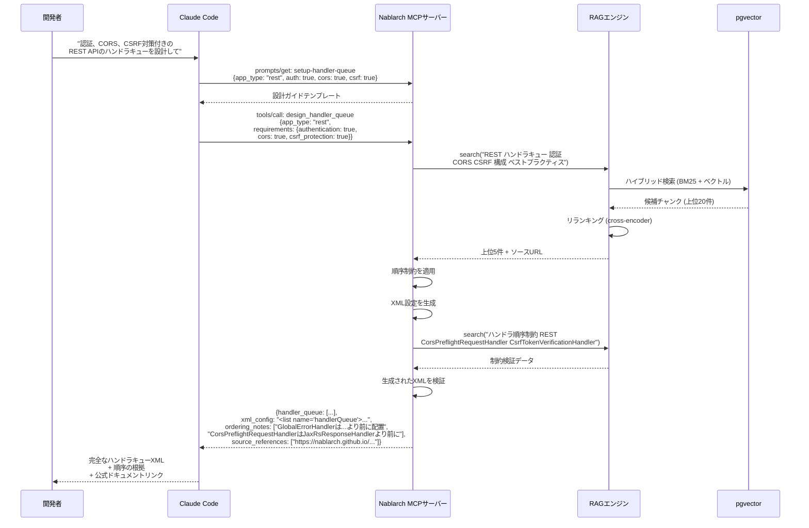
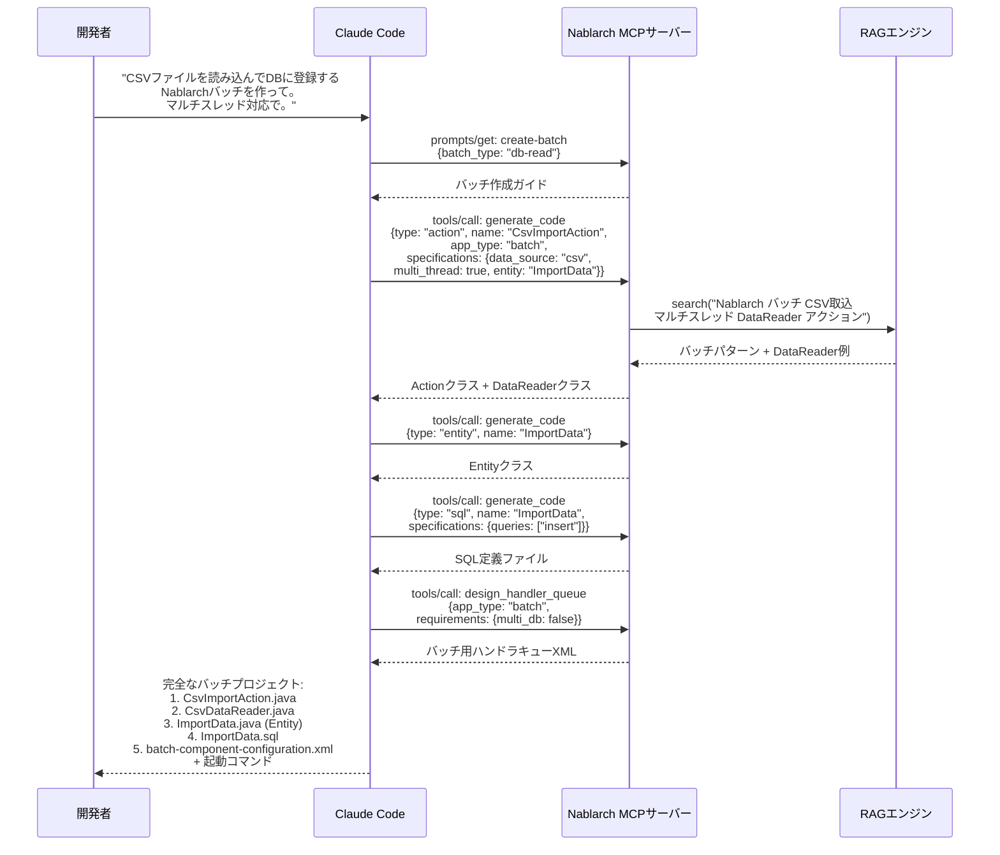
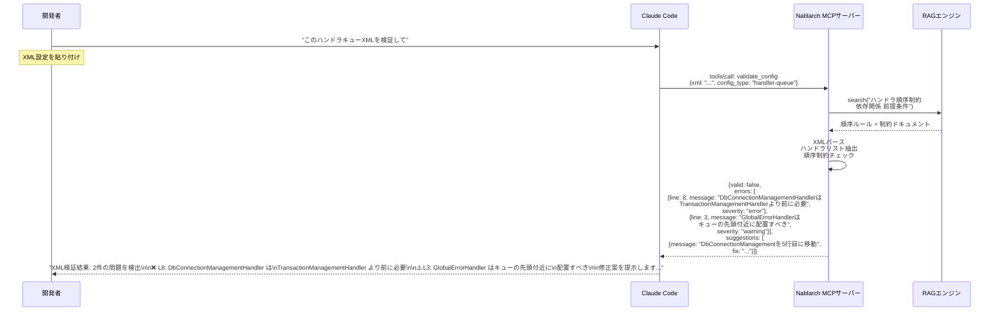
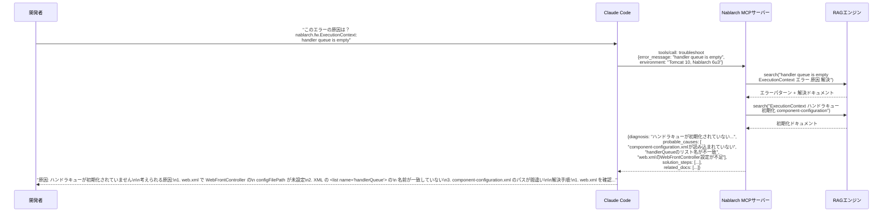
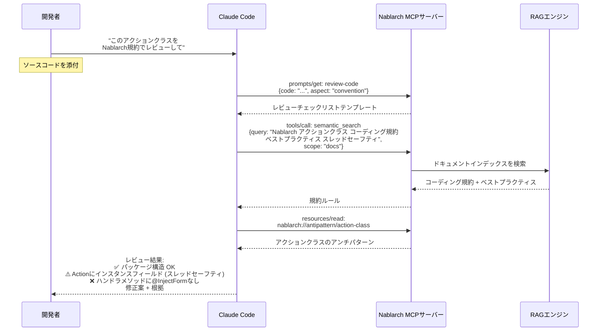
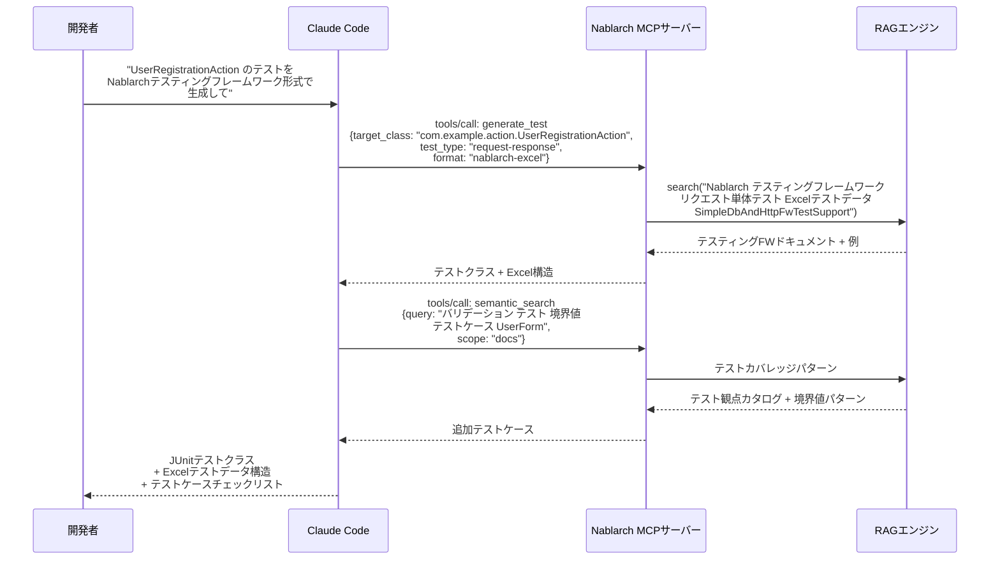
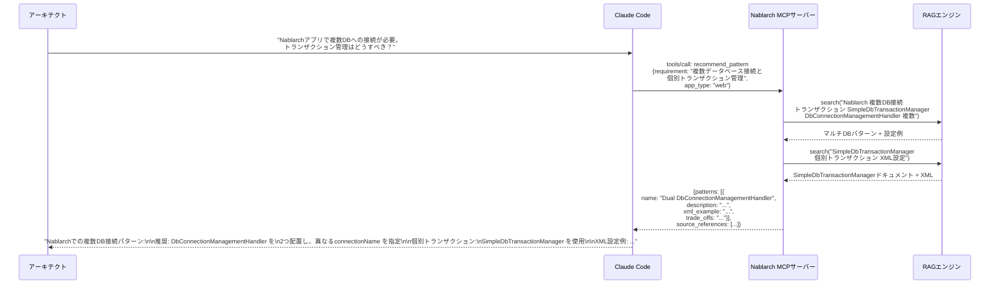
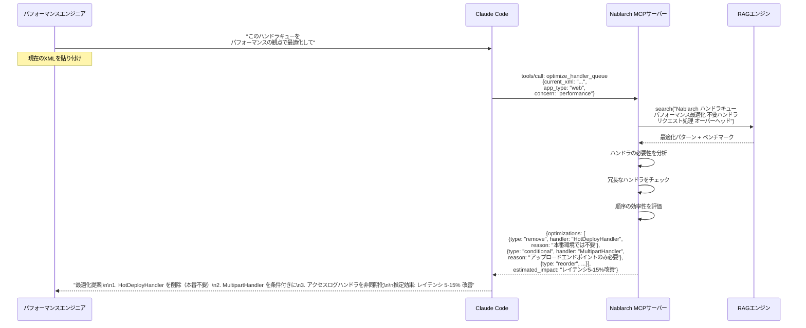
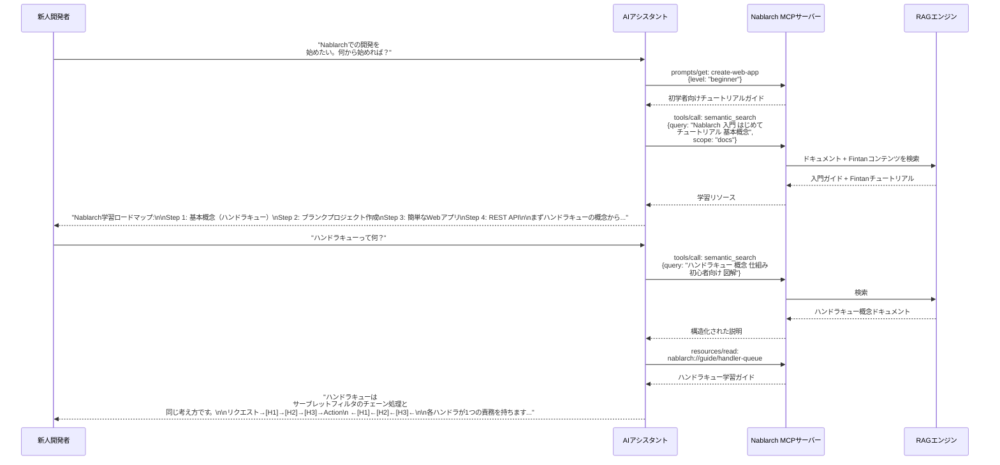
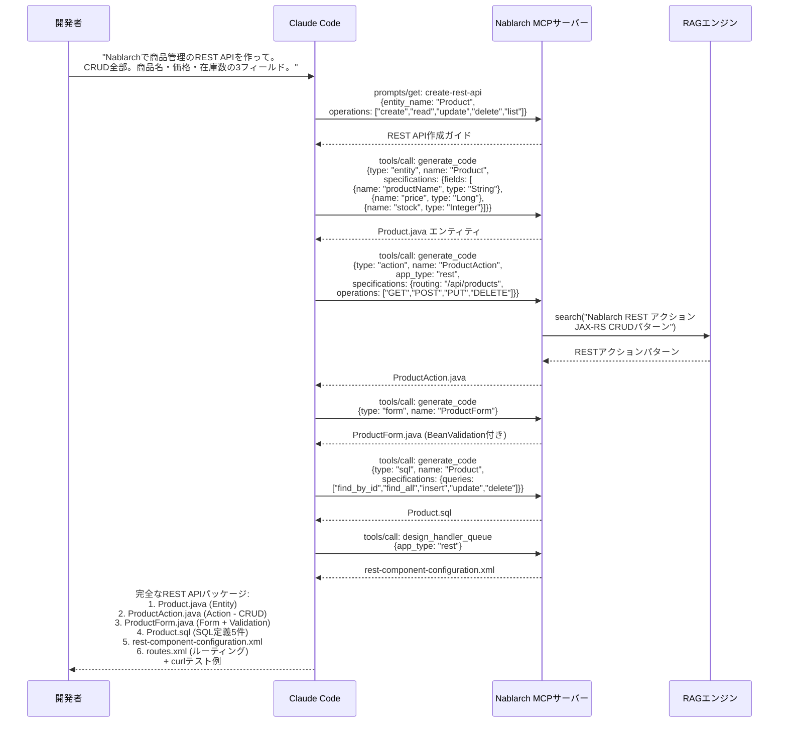

# Nablarch MCP Server — ユースケース集

> **対象読者**: 開発者（機能の使い方を理解したい人）
> **前提知識**: MCPのTools/Resources/Promptsの概念
> **概要**: 12のユースケースとシーケンス図・入出力例

---

## 目次

1. [ハンドラキュー自動設計](#ユースケース1-ハンドラキュー自動設計)
2. [Nablarch API検索・解説](#ユースケース2-nablarch-api検索解説)
3. [バッチアプリケーションコード生成](#ユースケース3-バッチアプリケーションコード生成)
4. [設定XML生成・検証](#ユースケース4-設定xml生成検証)
5. [トラブルシューティング支援](#ユースケース5-トラブルシューティング支援)
6. [コードレビュー（規約準拠チェック）](#ユースケース6-コードレビュー規約準拠チェック)
7. [テストコード生成（Excelテスト連携）](#ユースケース7-テストコード生成excelテスト連携)
8. [設計パターン推奨](#ユースケース8-設計パターン推奨)
9. [Nablarchバージョンアップ支援（5→6）](#ユースケース9-nablarchバージョンアップ支援56)
10. [ハンドラキュー最適化](#ユースケース10-ハンドラキュー最適化)
11. [初学者向け学習支援](#ユースケース11-初学者向け学習支援)
12. [REST APIスキャフォールディング](#ユースケース12-rest-apiスキャフォールディング)

---

## ユースケース1: ハンドラキュー自動設計

### ユーザーストーリー

> Nablarch開発者として、アプリケーション種別と要件に基づいてAIアシスタントにハンドラキューを設計してほしい。全ハンドラの順序制約を暗記せずとも、正確で最適化されたハンドラキューXMLを得るためだ。

### RAG + MCPが重要な理由

ハンドラキューの設計は、Nablarch開発で最も知識集約的なタスクである。50以上の標準ハンドラが存在し、複雑な順序制約がある。順序を間違えるとサイレントに障害が発生する。RAGが制約知識を提供し、MCPがそれを適用する構造化されたツールを提供する。

### シーケンス図



### 入力例

```
開発者のプロンプト:

"NablarchでREST APIを作っている。認証（JWT）、CORS対応、CSRF対策が必要。
ハンドラキューの設計をお願い。"
```

### 出力例

```xml
<!-- 認証 + CORS + CSRF 対応のREST API用ハンドラキュー -->
<list name="handlerQueue">
  <component class="nablarch.fw.web.handler.HttpCharacterEncodingHandler"/>
  <component class="nablarch.common.handler.threadcontext.ThreadContextClearHandler"/>
  <component class="nablarch.fw.handler.GlobalErrorHandler"/>
  <component class="nablarch.fw.jaxrs.CorsPreflightRequestHandler">
    <property name="allowOrigins">
      <list><value>https://example.com</value></list>
    </property>
  </component>
  <component class="nablarch.fw.jaxrs.JaxRsResponseHandler"/>
  <component class="nablarch.fw.web.handler.MultipartHandler"/>
  <component class="nablarch.common.handler.threadcontext.ThreadContextHandler"/>
  <component class="nablarch.fw.jaxrs.JaxRsAccessLogHandler"/>
  <component class="nablarch.fw.web.handler.CsrfTokenVerificationHandler"/>
  <component class="nablarch.common.handler.DbConnectionManagementHandler"/>
  <component class="nablarch.common.handler.TransactionManagementHandler"/>
  <!-- カスタム: JWT認証ハンドラ -->
  <component class="com.example.handler.JwtAuthenticationHandler"/>
  <component-ref name="routesMapping"/>
</list>
```

**順序に関する注意事項**:
1. `GlobalErrorHandler` は `JaxRsResponseHandler` より前に配置し、全例外を捕捉する
2. `CorsPreflightRequestHandler` は `JaxRsResponseHandler` より前に配置し、OPTIONSリクエストを処理する
3. `CsrfTokenVerificationHandler` はセッション/コンテキスト系ハンドラの後に配置する
4. カスタムJWTハンドラはDB/TXハンドラの後に配置し、DBルックアップによるトークン検証に対応する

**参考**: [RESTアーキテクチャ](https://nablarch.github.io/docs/LATEST/doc/application_framework/application_framework/web_service/rest/architecture.html), [nablarch-example-rest](https://github.com/nablarch/nablarch-example-rest)

---

## ユースケース2: Nablarch API検索・解説

### ユーザーストーリー

> Nablarch開発者として、自然言語でNablarch APIを検索したい。Javadoc全体をブラウジングせずに、必要なクラス/メソッドを素早く見つけるためだ。

### シーケンス図

```mermaid
sequenceDiagram
    participant Dev as 開発者
    participant AI as Claude Code
    participant MCP as Nablarch MCPサーバー
    participant RAG as RAGエンジン

    Dev->>AI: "Nablarchでデータベースの<br/>楽観的ロックを実装するAPIは？"

    AI->>MCP: tools/call: search_api<br/>({query: "optimistic lock database"})
    MCP->>RAG: search("楽観的ロック<br/>UniversalDao version")
    RAG-->>MCP: UniversalDao文書 + Entityアノテーション文書

    MCP-->>AI: {classes: [{<br/>  fqcn: "nablarch.common.dao.UniversalDao",<br/>  methods: [{name: "update", description: "...@Versionによる<br/>  楽観的ロックチェックを含む..."}],<br/>  javadoc_url: "https://..."}]}

    AI->>MCP: tools/call: semantic_search<br/>({query: "楽観的ロック @Version Entity",<br/> scope: "code"})
    MCP->>RAG: コードインデックスを検索
    RAG-->>MCP: @Version付きEntityサンプルコード

    MCP-->>AI: コード例

    AI-->>Dev: "UniversalDao.update() で楽観的ロックが<br/>自動的に実行されます。<br/>Entityに @Version アノテーションを付与：<br/><br/>@Entity<br/>@Table(name = 'USERS')<br/>public class Users {<br/>  @Version<br/>  public Long version;<br/>}<br/><br/>出典: https://nablarch.github.io/..."
```

### 入力例

```
開発者のプロンプト:

"NablarchのUniversalDaoで楽観的ロックを使いたい。どのAPIを使えばいい？"
```

### 出力例

```
## UniversalDao 楽観的ロック

`nablarch.common.dao.UniversalDao` の `update()` メソッドで自動的に楽観的ロックが
実行されます。

### 設定方法

Entity クラスに `@Version` アノテーションを付与:

```java
@Entity
@Table(name = "USERS")
public class Users {
    @Id
    @Column(name = "USER_ID")
    public Long userId;

    @Column(name = "USER_NAME")
    public String userName;

    @Version
    @Column(name = "VERSION")
    public Long version;
}
```

### 使用方法

```java
Users user = UniversalDao.findById(Users.class, userId);
user.userName = "新しい名前";
UniversalDao.update(user);  // versionが一致しない場合 OptimisticLockException
```

### FQCN
- `nablarch.common.dao.UniversalDao`
- `nablarch.common.dao.entity.annotation.Version` (jakarta.persistence.Version)

### 参考
- [UniversalDAO](https://nablarch.github.io/docs/LATEST/doc/application_framework/application_framework/libraries/database/universal_dao.html)
- [GitHub: nablarch-common-dao](https://github.com/nablarch/nablarch-common-dao)
```

---

## ユースケース3: バッチアプリケーションコード生成

### ユーザーストーリー

> Nablarch開発者として、完全なバッチアプリケーションのスケルトン（Action、Form、SQL、XML設定）を生成したい。ボイラープレートの準備なしに、すぐにビジネスロジックの実装に取りかかるためだ。

### シーケンス図



### 入力例

```
開発者のプロンプト:

"月次のCSV取込バッチを作りたい。
- 入力: /data/monthly/users.csv
- 処理: CSVの各行をUSERSテーブルにINSERT
- マルチスレッド: 4スレッド
- エラー時: 該当行をスキップしてログに記録
Nablarchのバッチアプリとして生成して。"
```

### 出力例

```
## 生成されたファイル一覧

### 1. CsvImportAction.java
バッチアクションクラス（nablarch.fw.action.BatchAction を継承）

### 2. CsvDataReader.java
CSVファイル読込用 DataReader（nablarch.fw.DataReader を実装）

### 3. ImportData.java
Entity クラス（@Entity, @Table(name="USERS")）

### 4. ImportData.sql
SQL定義ファイル（INSERT_IMPORT_DATA）

### 5. batch-component-configuration.xml
ハンドラキュー構成:
  1. StatusCodeConvertHandler
  2. ThreadContextClearHandler
  3. GlobalErrorHandler
  4. ThreadContextHandler
  5. DbConnectionManagementHandler (main)
  6. TransactionManagementHandler (main)
  7. RequestPathJavaPackageMapping
  8. MultiThreadExecutionHandler (threadCount=4)
  9. DbConnectionManagementHandler (sub)
  10. LoopHandler
  11. DataReadHandler

### 起動コマンド
java -cp ... nablarch.fw.launcher.Main \
  -diConfig classpath:batch-component-configuration.xml \
  -requestPath com.example.batch.CsvImportAction/IMPORT \
  -userId batch_user
```

---

## ユースケース4: 設定XML生成・検証

### ユーザーストーリー

> Nablarch開発者として、XML設定ファイルをNablarchの制約に対して検証したい。デプロイ前に順序エラーやコンポーネント不足を検出するためだ。

### シーケンス図



### 入力例

```
開発者のプロンプト:

"以下のXMLを検証して：
<list name="handlerQueue">
  <component class="nablarch.fw.web.handler.HttpCharacterEncodingHandler"/>
  <component class="nablarch.fw.web.handler.HttpResponseHandler"/>
  <component class="nablarch.fw.handler.GlobalErrorHandler"/>
  <component class="nablarch.common.handler.TransactionManagementHandler"/>
  <component class="nablarch.common.handler.DbConnectionManagementHandler"/>
  <component class="nablarch.fw.web.handler.SecureHandler"/>
</list>"
```

### 出力例

```
## 検証結果: 3件の問題を検出

### ❌ エラー: ハンドラ順序違反 (L4-5)
`TransactionManagementHandler` が `DbConnectionManagementHandler` より前に配置されています。
トランザクション制御にはDB接続が必要なため、DB接続管理を先に配置する必要があります。

### ⚠️ 警告: GlobalErrorHandler の位置 (L3)
`GlobalErrorHandler` は `HttpResponseHandler` より前に配置すべきです。
HttpResponseHandler で発生した例外をキャッチするためです。

### ⚠️ 警告: SecureHandler の位置 (L6)
`SecureHandler` は `HttpResponseHandler` の直後に配置するのが推奨です。
セキュリティヘッダの確実な付与のためです。

### 修正後のXML
<list name="handlerQueue">
  <component class="nablarch.fw.web.handler.HttpCharacterEncodingHandler"/>
  <component class="nablarch.fw.handler.GlobalErrorHandler"/>
  <component class="nablarch.fw.web.handler.HttpResponseHandler"/>
  <component class="nablarch.fw.web.handler.SecureHandler"/>
  <component class="nablarch.common.handler.DbConnectionManagementHandler"/>
  <component class="nablarch.common.handler.TransactionManagementHandler"/>
</list>

出典: https://nablarch.github.io/.../handlers/index.html
```

---

## ユースケース5: トラブルシューティング支援

### ユーザーストーリー

> Nablarch開発者として、エラーメッセージを貼り付けて診断と解決手順を得たい。フレームワークの深い知識なしにNablarch固有の問題を解決するためだ。

### シーケンス図



### 入力例

```
開発者のプロンプト:

"Tomcat起動時にこのエラーが出る：

java.lang.IllegalStateException: handler queue is empty
  at nablarch.fw.ExecutionContext.handleNext(ExecutionContext.java:xx)
  at nablarch.fw.web.servlet.WebFrontController.doFilter(WebFrontController.java:xx)

Nablarch 6u3, Tomcat 10, Java 17"
```

### 出力例

```
## 診断結果

### エラー: handler queue is empty

ハンドラキューが空の状態でリクエスト処理が開始されています。
Nablarchの初期化でハンドラキューがロードされていない可能性が高いです。

### 考えられる原因（確率順）

1. **web.xml の configFilePath 設定不備** (最も多い)
   WebFrontController の init-param で XML パスが正しく指定されていない

2. **XMLの<list name="handlerQueue">が見つからない**
   コンポーネント定義XMLでハンドラキューのリスト名が一致していない

3. **import先のXMLパスの間違い**
   <import file="..."/> のパス指定ミス

### 解決手順

Step 1: web.xml を確認
  <filter>
    <filter-name>webFrontController</filter-name>
    <filter-class>nablarch.fw.web.servlet.WebFrontController</filter-class>
    <init-param>
      <param-name>configFilePath</param-name>
      <param-value>classpath:web-component-configuration.xml</param-value>
    </init-param>
  </filter>

Step 2: XMLファイルの存在確認
  src/main/resources/web-component-configuration.xml が存在するか

Step 3: ハンドラキューのリスト名確認
  <component name="webFrontController"
             class="nablarch.fw.web.servlet.WebFrontController">
    <property name="handlerQueue" ref="handlerQueue"/>
  </component>
  <list name="handlerQueue">  ← この名前が一致しているか
    ...
  </list>

### 参考
- https://nablarch.github.io/.../web/architecture.html
- https://github.com/nablarch/nablarch-example-web/blob/master/src/main/webapp/WEB-INF/web.xml
```

---

## ユースケース6: コードレビュー（規約準拠チェック）

### ユーザーストーリー

> Nablarchプロジェクトのテックリードとして、Nablarchのコーディング規約とベストプラクティスに対してAIにコードレビューしてほしい。開発中に規約違反やアンチパターンを検出するためだ。

### シーケンス図



### 入力例

```
開発者のプロンプト:

"このコードをレビューして：
public class UserRegistrationAction {
    private String cachedValue;  // ← インスタンスフィールド

    public HttpResponse register(HttpRequest req, ExecutionContext ctx) {
        UserForm form = BeanUtil.createAndCopy(UserForm.class, req.getParamMap());
        cachedValue = form.getName();
        UniversalDao.insert(form);
        return new HttpResponse("/success.jsp");
    }
}"
```

### 出力例

```
## Nablarch コードレビュー結果

### ❌ 重大: スレッドセーフティ違反 (L2)
`private String cachedValue` — Nablarchのアクションクラスはシングルトンスコープで
管理されるため、インスタンスフィールドを持つとスレッドセーフティが保証されません。

修正案: ローカル変数に変更するか、ExecutionContext に格納してください。

### ⚠️ 警告: @InjectForm 未使用 (L4)
`BeanUtil.createAndCopy` を直接使用しています。Nablarch標準では `@InjectForm`
インターセプタを使用してバリデーション + フォーム変換を一括で行います。

修正案:
  @InjectForm(form = UserForm.class, prefix = "form")
  @OnError(type = ApplicationException.class, path = "/error.jsp")
  public HttpResponse register(HttpRequest req, ExecutionContext ctx) {
      UserForm form = ctx.getRequestScopedVar("form");
      ...
  }

### ⚠️ 警告: バリデーション未実装
入力値のバリデーションが行われていません。@InjectForm + Bean Validation アノテーション
の使用を推奨します。

### ✅ OK: パッケージ構造
### ✅ OK: HttpResponse の使用方法
### ✅ OK: UniversalDao の使用方法

参考:
- Nablarchポリシー: https://nablarch.github.io/.../nablarch/policy.html
- InjectForm: https://nablarch.github.io/.../web/feature_details/nablarch_tag.html
```

---

## ユースケース7: テストコード生成（Excelテスト連携）

### ユーザーストーリー

> Nablarch開発者として、Nablarchのテスティングフレームワーク用のExcelテストデータファイルを含むテストコードを生成したい。Nablarchのテストパターンに沿った包括的なテストスイートを素早く準備するためだ。

### シーケンス図



### 入力例

```
開発者のプロンプト:

"UserRegistrationAction のリクエスト単体テストを作って。
テストケース: 正常系、バリデーションエラー、DB重複エラー。
Nablarchのテスティングフレームワーク（Excel形式）で。"
```

### 出力例

```
## 生成されたテストファイル

### 1. UserRegistrationActionTest.java

```java
public class UserRegistrationActionTest
    extends SimpleDbAndHttpFwTestSupport {

    @Test
    public void 正常にユーザーが登録されること() {
        execute("register", new BasicHttpResponse(302));
    }

    @Test
    public void バリデーションエラーの場合エラー画面に遷移すること() {
        execute("registerValidationError", new BasicHttpResponse(200));
    }

    @Test
    public void DB重複エラーの場合エラーメッセージが表示されること() {
        execute("registerDuplicateError", new BasicHttpResponse(200));
    }
}
```

### 2. Excelテストデータ構造

| シート名 | 説明 |
|---------|------|
| `register` | 正常系: name="テスト太郎", email="test@example.com" |
| `registerValidationError` | 異常系: name="" (必須バリデーション) |
| `registerDuplicateError` | DB重複: 既存ユーザーと同じemail |
| `testShots` | リクエスト定義 (URI, method, params) |
| `expectedStatus` | 期待するHTTPステータスコード |
| `expectedMessages` | 期待するメッセージ |
| `setupTable=USERS` | テスト前データ投入 |
| `expectedTable=USERS` | テスト後データ検証 |

出典: [Nablarch テスティングフレームワーク](https://nablarch.github.io/docs/LATEST/doc/development_tools/testing_framework/)
```

---

## ユースケース8: 設計パターン推奨

### ユーザーストーリー

> Nablarchアーキテクトとして、特定の要件に対してNablarch固有の設計パターンの推奨を得たい。フレームワークの思想と実績あるパターンに沿った判断を行うためだ。

### シーケンス図



### 入力例

```
アーキテクトのプロンプト:

"業務DBとログDBの2つのDBに接続するWebアプリを設計中。
業務DBはトランザクション管理が必要だが、ログDBは個別トランザクションでいい。
Nablarchでの推奨パターンは？"
```

### 出力例

```
## 推奨パターン: Dual DB Connection with SimpleDbTransactionManager

### パターン概要
ハンドラキューに DbConnectionManagementHandler を2つ配置し、
connectionName プロパティで接続先を分離する。
ログDBへの書き込みは SimpleDbTransactionManager で個別トランザクション管理。

### XML設定例

<!-- 業務DB（ハンドラキュー管理） -->
<component class="nablarch.common.handler.DbConnectionManagementHandler">
  <property name="connectionFactory" ref="businessDbConnectionFactory"/>
  <property name="connectionName" value="business"/>
</component>
<component class="nablarch.common.handler.TransactionManagementHandler">
  <property name="dbTransactionManager" ref="businessTxManager"/>
  <property name="transactionName" value="business"/>
</component>

<!-- ログDB（個別トランザクション） -->
<component name="logDbTransaction"
           class="nablarch.core.db.transaction.SimpleDbTransactionManager">
  <property name="dbTransactionName" value="logDb"/>
</component>

### アクションクラスでの使用

```java
public HttpResponse execute(HttpRequest req, ExecutionContext ctx) {
    // 業務DBは通常通り（ハンドラキューで管理）
    UniversalDao.insert(businessEntity);

    // ログDBは個別トランザクション
    SimpleDbTransactionManager logTx = SystemRepository.get("logDbTransaction");
    new SimpleDbTransactionExecutor<Void>(logTx) {
        @Override
        public Void execute(AppDbConnection conn) {
            conn.prepareStatement("INSERT_LOG").executeUpdate();
            return null;
        }
    }.doTransaction();
}
```

### トレードオフ
- ✅ 業務DBのロールバックがログDBに影響しない
- ✅ ログDB障害が業務処理をブロックしない（try-catch推奨）
- ⚠️ 接続プールが2つ必要（リソース消費増）

参考:
- [DB接続・トランザクション管理](https://nablarch.github.io/.../database_management.html)
- [SimpleDbTransactionManager Javadoc](https://nablarch.github.io/.../javadoc/...)
```

---

## ユースケース9: Nablarchバージョンアップ支援（5→6）

### ユーザーストーリー

> レガシーシステムを保守するNablarch開発者として、Nablarch 5から6へのアップグレード時に移行影響の自動分析を得たい。正確な工数見積もりと自動修正による移行計画の策定のためだ。

### シーケンス図

```mermaid
sequenceDiagram
    participant Dev as 開発者
    participant AI as Claude Code
    participant MCP as Nablarch MCPサーバー
    participant RAG as RAGエンジン

    Dev->>AI: "このNablarch 5プロジェクトを<br/>Nablarch 6に移行したい"
    Note over Dev: pom.xml + サンプルコードを共有

    AI->>MCP: resources/read:<br/>nablarch://guide/migration-5to6
    MCP-->>AI: マイグレーションガイド

    AI->>MCP: tools/call: analyze_migration<br/>{source_version: "5", target_version: "6",<br/> code_snippet: "import javax.servlet.*;\n..."}

    MCP->>RAG: search("Nablarch 5から6への移行<br/>javax jakarta 名前空間 非推奨API<br/>破壊的変更")
    RAG-->>MCP: 移行ドキュメント + 変更一覧

    MCP-->>AI: {changes: [<br/> {type: "namespace", from: "javax.servlet",<br/>  to: "jakarta.servlet", auto_fixable: true},<br/> {type: "api_removal", class: "...",<br/>  replacement: "...", auto_fixable: false}],<br/> effort_summary: {...}}

    AI-->>Dev: "移行分析結果:\n\n自動修正可能:\n- javax→jakarta 名前空間変更: 47箇所\n- pom.xml 依存関係更新: 12行\n\n手動修正必要:\n- 削除API対応: 3箇所\n- テスト修正: 12箇所\n\n各変更の修正案を提示..."
```

### 入力例

```
開発者のプロンプト:

"以下のコードをNablarch 6に移行する際の影響を分析して：

import javax.servlet.http.HttpServletRequest;
import nablarch.fw.web.HttpRequest;

public class LegacyAction extends DbAccessSupport {
    public HttpResponse doAction(HttpRequest req, ExecutionContext ctx) {
        SqlResultSet result = search("SELECT_USERS",
            new SqlRow().put("userId", req.getParam("id")));
        ...
    }
}"
```

### 出力例

```
## Nablarch 5→6 移行分析結果

### 変更カテゴリ別サマリ

| カテゴリ | 影響箇所 | 自動修正 |
|---------|---------|---------|
| javax→jakarta名前空間 | 1箇所 | ✓ 自動 |
| 非推奨API (DbAccessSupport) | 1箇所 | △ 半自動 |
| SQL API変更 | 1箇所 | △ 半自動 |

### 詳細

#### 1. javax→jakarta (自動修正可能)
`import javax.servlet.http.HttpServletRequest`
→ `import jakarta.servlet.http.HttpServletRequest`

#### 2. DbAccessSupport 非推奨 (手動修正)
`DbAccessSupport` は Nablarch 6 で非推奨です。
`UniversalDao` への移行を推奨します。

変更前:
  SqlResultSet result = search("SELECT_USERS", ...);

変更後:
  List<Users> result = UniversalDao.findAllBySqlFile(
      Users.class, "SELECT_USERS",
      new Object[]{req.getParam("id")});

#### 3. pom.xml 更新
nablarch-bom のバージョンを 6u3 に更新
javax.servlet-api → jakarta.servlet-api

出典: [マイグレーションガイド](https://nablarch.github.io/.../migration/)
```

---

## ユースケース10: ハンドラキュー最適化

### ユーザーストーリー

> Nablarchのパフォーマンスエンジニアとして、既存のハンドラキューの最適化ポイントを分析したい。機能を壊さずにリクエスト処理のパフォーマンスを改善するためだ。

### シーケンス図



### 入力例

```
開発者のプロンプト:

"本番環境のWebアプリで、以下のハンドラキューのパフォーマンスを改善したい：
[19個のハンドラが入ったXML]"
```

### 出力例

```
## ハンドラキュー最適化分析

### 検出された最適化ポイント

#### 🔴 削除推奨: HotDeployHandler
本番環境では不要です。開発環境専用ハンドラです。
影響: リクエストあたり約2-5msの短縮

#### 🟡 条件付き適用: MultipartHandler
ファイルアップロードを受け付けないエンドポイントにも適用されています。
RequestHandlerEntry で特定パスのみに限定することを推奨。

#### 🟡 非同期化: HttpAccessLogHandler
アクセスログ出力を非同期化することでレスポンスタイムを改善できます。
log.properties で async=true を設定。

#### ✅ 順序最適化
現在の順序は概ね適切です。軽量なハンドラが先頭にあり、
重いDB/TX系ハンドラが後方に配置されています。

### 推定効果
- HotDeployHandler 削除: 2-5ms/リクエスト
- MultipartHandler 条件化: 1-3ms/リクエスト (非アップロード時)
- アクセスログ非同期化: 3-10ms/リクエスト
- 合計: 6-18ms/リクエスト (5-15% 改善見込み)
```

---

## ユースケース11: 初学者向け学習支援

### ユーザーストーリー

> Nablarchを初めて使う開発者として、パーソナライズされた学習パスとステップバイステップのガイダンスを得たい。ドキュメントに圧倒されることなく、効率的にフレームワークを学ぶためだ。

### シーケンス図



### 入力例

```
新人開発者のプロンプト:

"Java歴3年ですがNablarchは初めてです。Spring Bootの経験はあります。
Nablarchでの開発の始め方を教えてください。"
```

### 出力例

```
## Nablarch学習ロードマップ（Spring Boot経験者向け）

### Spring Boot との対応関係

| Spring Boot | Nablarch |
|------------|----------|
| @Controller | Action クラス |
| @RequestMapping | RoutesMapping (XML/アノテーション) |
| Filter chain | ハンドラキュー |
| @Autowired | SystemRepository.get() + XML DI |
| application.yml | component-configuration.xml |
| JPA/Hibernate | UniversalDao |

### 学習ステップ

**Step 1: 概念理解** (30分)
→ ハンドラキューアーキテクチャ（Spring の Filter Chain に対応）
→ SystemRepository（Spring の ApplicationContext に対応）

**Step 2: プロジェクト作成** (15分)
→ Maven Archetype でブランクプロジェクト生成
  mvn archetype:generate -DarchetypeGroupId=com.nablarch.archetype ...

**Step 3: Hello World Web アプリ** (1時間)
→ Action + JSP + XML設定

**Step 4: REST API** (1時間)
→ JAX-RS スタイルの API 作成

**Step 5: DB連携** (1時間)
→ UniversalDao + Entity + SQL定義ファイル

参考:
- [Nablarch公式入門](https://nablarch.github.io/docs/LATEST/doc/)
- [Fintan 研修コンテンツ](https://fintan.jp/)
```

---

## ユースケース12: REST APIスキャフォールディング

### ユーザーストーリー

> Nablarch開発者として、完全なREST APIエンドポイント一式（Action + Form + Entity + SQL + 設定 + テスト）を生成したい。フレームワークのボイラープレートではなくビジネスロジックに集中するためだ。

### シーケンス図



### 入力例

```
開発者のプロンプト:

"商品管理REST APIをNablarchで作って。
- GET /api/products — 一覧
- GET /api/products/{id} — 詳細
- POST /api/products — 登録
- PUT /api/products/{id} — 更新
- DELETE /api/products/{id} — 削除
フィールド: productName(String, 必須, 100文字以内), price(Long, 必須, 1以上), stock(Integer, 0以上)"
```

### 出力例

```
## 生成ファイル一覧（6ファイル）

### 1. Product.java — Entity
@Entity @Table(name="PRODUCTS")
- productId (Long, @Id, @GeneratedValue)
- productName (String)
- price (Long)
- stock (Integer)
- version (Long, @Version — 楽観的ロック)

### 2. ProductAction.java — RESTアクション
@Produces(MediaType.APPLICATION_JSON)
- GET /api/products → findAll()
- GET /api/products/{id} → findById()
- POST /api/products → create() + @Valid
- PUT /api/products/{id} → update() + @Valid
- DELETE /api/products/{id} → delete()

### 3. ProductForm.java — フォームBean
- @NotNull @Size(max=100) productName
- @NotNull @Min(1) price
- @Min(0) stock

### 4. Product.sql — SQL定義
- FIND_ALL: SELECT * FROM PRODUCTS ORDER BY PRODUCT_ID
- FIND_BY_ID: SELECT * FROM PRODUCTS WHERE PRODUCT_ID = :productId
- (INSERT/UPDATE/DELETE は UniversalDao が自動生成)

### 5. routes.xml — ルーティング
/api/products → ProductAction

### 6. curlテスト例
# 登録
curl -X POST http://localhost:8080/api/products \
  -H "Content-Type: application/json" \
  -d '{"productName":"テスト商品","price":1000,"stock":50}'

# 一覧
curl http://localhost:8080/api/products

# 詳細
curl http://localhost:8080/api/products/1
```

---

## まとめ: RAG/MCP貢献度マトリクス

| ユースケース | RAGの貢献 | MCPの貢献 | 統合効果 |
|-------------|:---------:|:---------:|:-------:|
| 1. ハンドラキュー設計 | 知識: 順序制約、パターン | ツール: XML生成 + 検証 | 極高 |
| 2. API検索 | Javadoc横断のセマンティック検索 | 構造化されたAPIレスポンス | 高 |
| 3. バッチコード生成 | コーディング規約、パターン | ツール: コード生成 | 極高 |
| 4. XML検証 | 制約知識 | ツール: 検証エンジン | 極高 |
| 5. トラブルシューティング | エラーパターンマッチング、過去事例 | プロンプト: 診断ガイド | 高 |
| 6. コードレビュー | 規約ルール、アンチパターン | プロンプト: レビューテンプレート | 極高 |
| 7. テスト生成 | テストFW仕様、テスト観点カタログ | ツール: テストコード生成 | 極高 |
| 8. パターン推奨 | 設計パターン、ベストプラクティス | 構造化された推奨 | 高 |
| 9. マイグレーション支援 | 変更一覧、非推奨API | ツール: 影響分析 | 高 |
| 10. キュー最適化 | パフォーマンスパターン | ツール: 分析エンジン | 高 |
| 11. 学習支援 | 段階的なドキュメント検索 | プロンプト: 学習ガイド、リソース: ガイド | 高 |
| 12. RESTスキャフォールディング | RESTパターン、規約 | ツール: 複数ファイル生成 | 極高 |

---

## 参考資料

- [アーキテクチャ設計書](./architecture.md)
- [O-023 RAG-MCP関連性分析](./research/O-023_nablarch_rag_mcp_analysis.md)
- [Nablarch公式ドキュメント](https://nablarch.github.io/)
