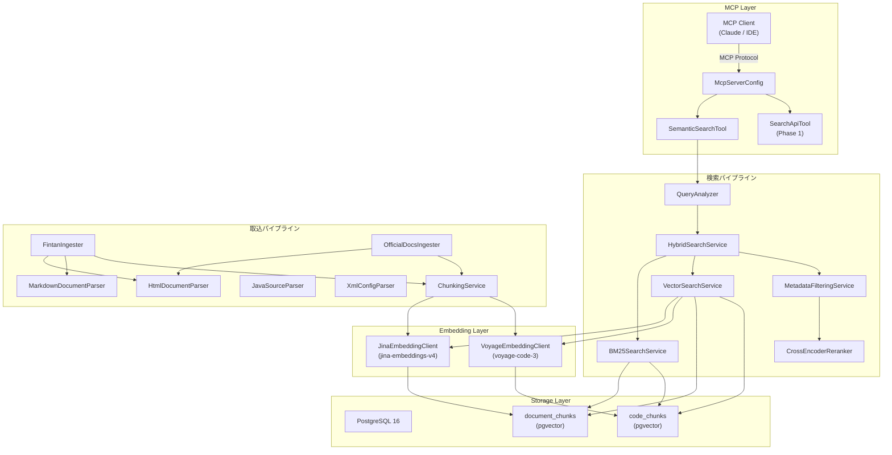
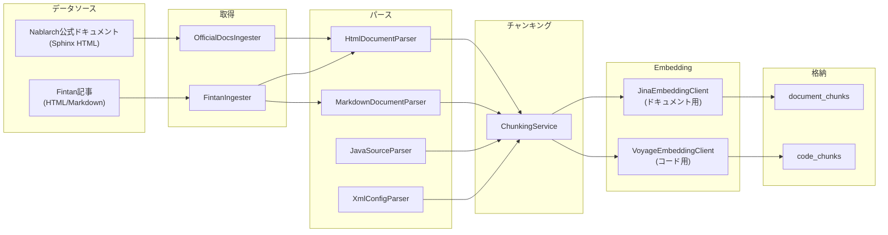
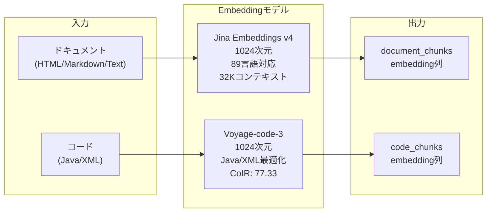
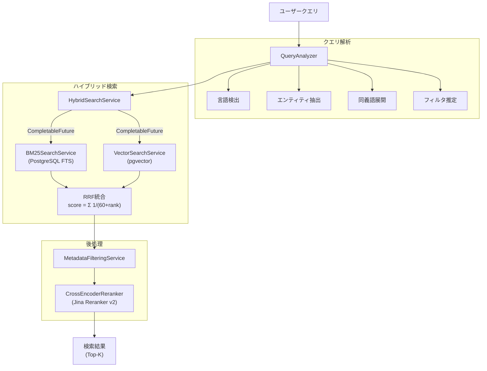
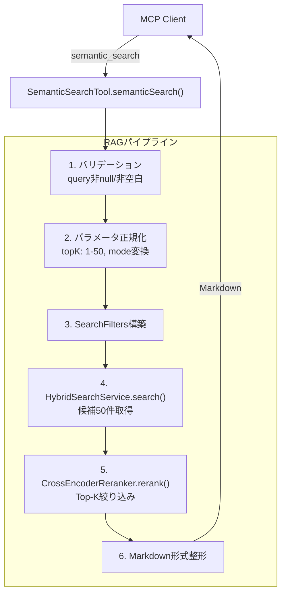
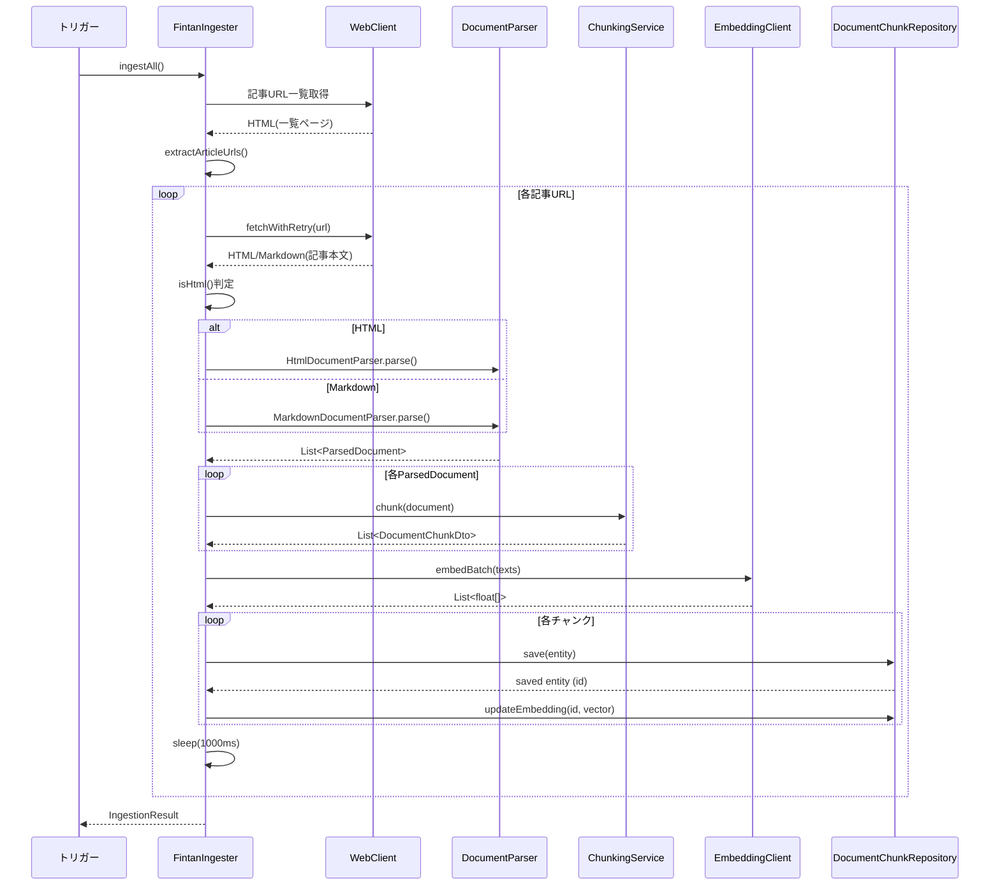
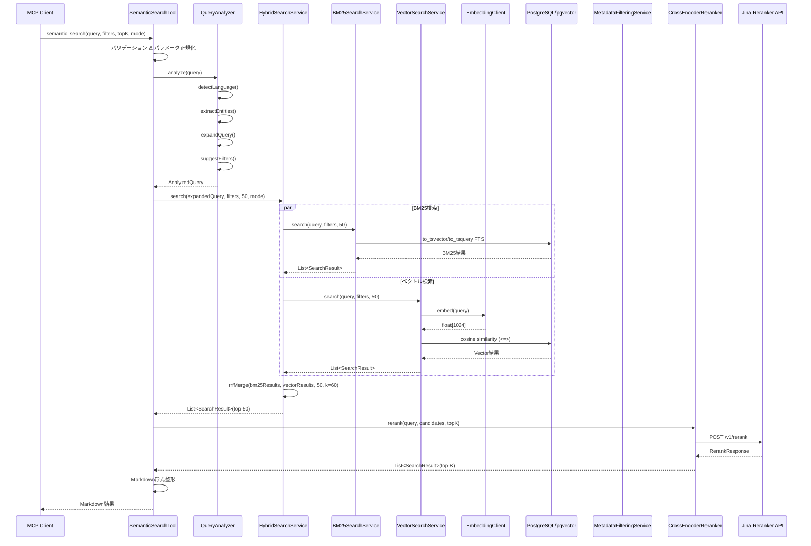

# RAGパイプライン技術仕様書

> **対象読者**: 開発者（RAGパイプラインの技術詳細を理解したい人）
> **前提知識**: ベクトル検索、Embeddingの基本知識
> **概要**: ドキュメント取込・検索・リランキングパイプラインの技術仕様

---

## 目次

1. [概要](#1-概要)
2. [ドキュメント取込パイプライン](#2-ドキュメント取込パイプライン)
3. [検索パイプライン](#3-検索パイプライン)
4. [リランキングパイプライン](#4-リランキングパイプライン)
5. [MCP Tool統合](#5-mcp-tool統合)
6. [シーケンス図](#6-シーケンス図)
7. [設定パラメータリファレンス](#7-設定パラメータリファレンス)

---

## 1. 概要

### 1.1 全体アーキテクチャ

Nablarch MCPサーバーのRAGパイプラインは、ドキュメント取込・検索・リランキングの3段階で構成される。
MCP（Model Context Protocol）を通じてLLMクライアントにセマンティック検索機能を提供する。



### 1.2 コンポーネント一覧

| パッケージ | コンポーネント | 種別 | 責務 |
|:---|:---|:---|:---|
| `rag.ingestion` | DocumentIngester | インターフェース | 取込パイプライン共通契約 |
| `rag.ingestion` | FintanIngester | @Service | Fintan記事取込 |
| `rag.ingestion` | OfficialDocsIngester | @Service | 公式ドキュメント取込 |
| `rag.ingestion` | FintanIngestionConfig | @ConfigurationProperties | Fintan取込設定 |
| `rag.ingestion` | IngestionConfig | @ConfigurationProperties | 公式ドキュメント取込設定 |
| `rag.ingestion` | IngestionResult | Record | 取込結果DTO |
| `rag.parser` | DocumentParser | インターフェース | パーサー共通契約 |
| `rag.parser` | HtmlDocumentParser | @Component | HTML→セクション分割 |
| `rag.parser` | MarkdownDocumentParser | @Component | Markdown→セクション分割 |
| `rag.parser` | JavaSourceParser | @Component | Javaソース→メソッド単位分割 |
| `rag.parser` | XmlConfigParser | @Component | XML→要素単位分割 |
| `rag.parser` | ParsedDocument | Record | パース結果DTO |
| `rag.chunking` | ChunkingService | @Component | トークン制限チャンキング |
| `rag.chunking` | ContentType | Enum | コンテンツタイプ定義 |
| `rag.chunking` | DocumentChunkDto | Record | チャンクDTO |
| `rag.query` | QueryAnalyzer | @Service | クエリ解析・拡張 |
| `rag.query` | NablarchSynonymMap | クラス | 双方向同義語マップ |
| `rag.query` | AnalyzedQuery | Record | クエリ解析結果DTO |
| `rag.query` | QueryLanguage | Enum | 言語検出結果 |
| `rag.search` | HybridSearchService | @Service | BM25+Vector+RRF統合検索 |
| `rag.search` | BM25SearchService | @Service | PostgreSQL FTSキーワード検索 |
| `rag.search` | VectorSearchService | @Service | pgvectorコサイン類似度検索 |
| `rag.search` | MetadataFilteringService | @Service | ポストフィルタリング＋ファセット |
| `rag.search` | SearchResult | Record | 検索結果DTO |
| `rag.search` | SearchFilters | Record | 基本フィルタ条件 |
| `rag.search` | ExtendedSearchFilters | Record | 拡張フィルタ条件 |
| `rag.search` | SearchMode | Enum | 検索モード（HYBRID/KEYWORD/VECTOR） |
| `rag.rerank` | Reranker | インターフェース | リランキング共通契約 |
| `rag.rerank` | CrossEncoderReranker | @Service | Jina Reranker v2実装 |
| `rag.rerank` | RerankProperties | @ConfigurationProperties | リランキング設定 |
| `embedding` | EmbeddingClient | インターフェース | Embedding共通契約 |
| `embedding` | JinaEmbeddingClient | @Component | Jina v4ドキュメント用Embedding |
| `embedding` | VoyageEmbeddingClient | @Component | Voyage-code-3コード用Embedding |
| `embedding.config` | EmbeddingProperties | @ConfigurationProperties | Embedding設定 |
| `tools` | SemanticSearchTool | @Service | MCP semantic_search Tool |
| `config` | McpServerConfig | @Configuration | MCP Tool/Resource/Prompt登録 |

### 1.3 技術スタック

| 項目 | 技術 | バージョン |
|:---|:---|:---|
| フレームワーク | Spring Boot | 3.4.2 |
| MCP SDK | Spring AI MCP Server | 1.0.0 |
| データベース | PostgreSQL | 16 |
| ベクトル拡張 | pgvector | 0.7+ |
| Embedding (ドキュメント) | Jina Embeddings v4 | 1024次元 |
| Embedding (コード) | Voyage-code-3 | 1024次元 |
| リランカー | Jina Reranker v2 | multilingual |
| HTMLパーサー | Jsoup | - |
| HTTPクライアント | Spring WebFlux WebClient | - |

---

## 2. ドキュメント取込パイプライン

### 2.1 パイプラインフロー図



### 2.2 データソース

#### DS-1: Nablarch公式ドキュメント（OfficialDocsIngester）

| 項目 | 値 |
|:---|:---|
| ソース名 | `nablarch-official-docs` |
| ベースURL | `https://nablarch.github.io/docs/LATEST/doc/` |
| 形式 | Sphinx生成HTML |
| クローリング戦略 | インデックスページからURL一覧を取得→各ページ順次取得 |
| リトライ | 指数バックオフ（最大3回） |
| ディレイ | 1000ms（robots.txt準拠） |
| メモリ制限 | WebClient maxInMemorySize = 10MB |

**処理フロー**:
1. `discoverDocumentUrls()`: インデックスページのaタグからドキュメントURLを抽出
2. 各URLに対してHTMLを取得（`fetchHtmlWithRetry()`）
3. `HtmlDocumentParser`でパース
4. `ChunkingService`でチャンク分割
5. `EmbeddingClient`でバッチEmbedding生成
6. `DocumentChunkRepository`でpgvectorに格納

#### DS-2: Fintanコンテンツ（FintanIngester）

| 項目 | 値 |
|:---|:---|
| ソース名 | `fintan` |
| ベースURL | `https://fintan.jp/` |
| 形式 | HTML / Markdown |
| フィルタ | Nablarchタグ付き記事のみ |
| クローリング戦略 | タグ検索→記事URL一覧→各記事取得 |
| リトライ | 指数バックオフ（最大3回） |
| ディレイ | 1000ms（robots.txt準拠） |

**処理フロー**:
1. `fetchArticleUrls()`: Nablarchタグ付き記事のURL一覧を取得
2. `extractArticleUrls()`: HTMLからaタグのhrefを抽出
3. 各記事に対して`fetchWithRetry()`で本文取得
4. `isHtml()`: `<!DOCTYPE>`, `<html>`, `<head>`, `<body>`タグの有無でHTML/Markdown判定
5. 適切なパーサー（`HtmlDocumentParser`または`MarkdownDocumentParser`）でパース
6. `ChunkingService`でチャンク分割
7. `embedAndStore()`: バッチEmbedding→格納

**増分取込**: Fintan APIが更新日時フィルタ未対応のため、既存チャンクのURL比較方式で新規記事を特定。

**障害隔離**: 個別記事の取得・処理失敗は`IngestionResult.errors`に記録し、他の記事の処理を継続する。

### 2.3 パーサー

全パーサーは`DocumentParser`インターフェースを実装する。

```java
public interface DocumentParser {
    List<ParsedDocument> parse(String content, String sourceUrl);
}
```

出力は`ParsedDocument`レコード:

```java
public record ParsedDocument(
    String content,              // パース済みテキスト
    Map<String, String> metadata, // メタデータ
    String sourceUrl,            // データソースURL
    ContentType contentType      // コンテンツタイプ
) {}
```

#### HtmlDocumentParser（@Component）

| 項目 | 値 |
|:---|:---|
| 対象 | Nablarch公式ドキュメント（Sphinx HTML） |
| 分割単位 | h2/h3見出し |
| 使用ライブラリ | Jsoup |
| コードブロック | ` ```...``` ` 形式に変換 |
| テーブル | Markdownテーブル形式に変換 |

**生成メタデータ**:

| キー | 値 |
|:---|:---|
| `source` | `nablarch-document` |
| `source_type` | `documentation` |
| `language` | `ja` |
| `title` | ページタイトル |
| `section_title` | セクション見出し |
| `source_url` | 元のURL |
| `heading_level` | h2/h3等のタグ名 |

#### MarkdownDocumentParser（@Component）

| 項目 | 値 |
|:---|:---|
| 対象 | Fintan記事等 |
| 分割単位 | `##` / `###` 見出し |
| `#` 見出し | ドキュメントタイトル扱い（分割対象外） |
| コードフェンス | 内部の見出しは無視 |

**見出し検出パターン**: `^(#{1,3})\s+(.+)$`（`Pattern.MULTILINE`）

**生成メタデータ**:

| キー | 値 |
|:---|:---|
| `source` | `fintan` |
| `source_type` | `documentation` |
| `language` | `ja` |
| `title` | ドキュメントタイトル |
| `section_title` | セクション見出し |
| `heading_level` | 見出しレベル（2 or 3） |

#### JavaSourceParser（@Component）

| 項目 | 値 |
|:---|:---|
| 対象 | Javaソースファイル |
| 分割単位 | クラスヘッダ + メソッド単位 |
| Javadoc | メソッドのJavadocを含めて1チャンク |
| ブレース追跡 | 文字列リテラル・コメント内をスキップ |

**抽出パターン**:
- パッケージ宣言: `^package\s+([\w.]+);`
- クラス宣言: `(public|protected|private)?\s*(abstract\s+)?(class|interface|enum)\s+(\w+)`
- メソッド宣言: アクセス修飾子＋戻り値型＋メソッド名＋パラメータ
- フィールド宣言: アクセス修飾子＋型＋フィールド名

**生成メタデータ**:

| キー | 値 |
|:---|:---|
| `source` | `github` |
| `source_type` | `code` |
| `language` | `java` |
| `element_type` | `class` / `method` / `javadoc` |
| `fqcn` | 完全修飾クラス名 |
| `class_name` | クラス名 |
| `package_name` | パッケージ名 |
| `method_name` | メソッド名（メソッドの場合） |

#### XmlConfigParser（@Component）

| 項目 | 値 |
|:---|:---|
| 対象 | Nablarchコンポーネント定義XML |
| 分割単位 | ルート要素の子要素 |
| XXE対策 | 有効（disallow-doctype-decl等） |
| フォールバック | パース不能時はテキストとして処理 |

**セキュリティ設定**:
```java
factory.setFeature("http://apache.org/xml/features/disallow-doctype-decl", true);
factory.setFeature("http://xml.org/sax/features/external-general-entities", false);
factory.setFeature("http://xml.org/sax/features/external-parameter-entities", false);
```

**生成メタデータ**:

| キー | 値 |
|:---|:---|
| `source` | `github` |
| `source_type` | `config` |
| `language` | `xml` |
| `element_type` | 要素タグ名 |
| `element_name` | name属性（あれば） |
| `fqcn` | class属性（あれば） |
| `parent_element` | 親要素タグ名 |

### 2.4 チャンキング

`ChunkingService`（@Component）は`ParsedDocument`をコンテンツタイプに応じた戦略でチャンク分割する。

#### チャンキング戦略一覧

| ContentType | 戦略 | 最大トークン | オーバーラップ | 備考 |
|:---|:---|:---|:---|:---|
| `HTML` | トークン制限分割 | 512 | 128 | セクション単位 |
| `MARKDOWN` | トークン制限分割 | 512 | 128 | 見出し単位 |
| `JAVADOC` | 1対1マッピング | - | 0 | クラス/メソッド単位 |
| `JAVA` | トークン制限分割 | 512 | 0 | メソッド単位 |
| `XML` | 1対1マッピング | - | 0 | 要素単位 |
| `TEXT` | トークン制限分割 | 512 | 128 | 段落単位 |

**最小チャンクサイズ**: 50文字未満のチャンクは除外。

#### トークン→文字数変換

日本語と英語で1トークンあたりの文字数が異なるため、テキスト中の日本語比率に応じて動的に変換する。

```
charsPerToken = 2.0 + (1.0 - japaneseRatio) × 2.0
```

| テキスト種別 | 1トークンあたり文字数 |
|:---|:---|
| 全て日本語 | 約2文字 |
| 全て英語 | 約4文字 |
| 混在 | 2〜4文字（日本語比率で調整） |

**日本語文字検出**: `Character.UnicodeBlock`による判定（HIRAGANA, KATAKANA, CJK_UNIFIED_IDEOGRAPHS, CJK_UNIFIED_IDEOGRAPHS_EXTENSION_A, CJK_COMPATIBILITY_IDEOGRAPHS, HALFWIDTH_AND_FULLWIDTH_FORMS）

#### 分割アルゴリズム

1. 段落分割（`\n\n`区切り）
2. 段落がトークン上限を超える場合、文分割にフォールバック
   - 日本語: 句点（`。`）区切り
   - 英語: `". "` 区切り
3. オーバーラップ: 前チャンクの末尾から指定トークン数を次チャンクの先頭に付加

#### 出力DTO

```java
public record DocumentChunkDto(
    String content,              // チャンクテキスト
    Map<String, String> metadata, // メタデータ（元ドキュメント＋チャンク情報）
    int chunkIndex,              // チャンクインデックス（0始まり）
    int totalChunks,             // 総チャンク数
    ContentType contentType      // コンテンツタイプ
) {}
```

### 2.5 Embedding

デュアルモデル戦略により、ドキュメントとコードに最適なEmbeddingモデルを使い分ける。



#### EmbeddingClientインターフェース

```java
public interface EmbeddingClient {
    float[] embed(String text);
    List<float[]> embedBatch(List<String> texts);
    String getModelName();
    int getDimensions();
}
```

#### JinaEmbeddingClient（@Component）

| 項目 | 値 |
|:---|:---|
| モデル | jina-embeddings-v4 |
| 次元数 | 1024 |
| 対応言語 | 89言語 |
| コンテキスト長 | 32Kトークン |
| API | `https://api.jina.ai/v1/embeddings` |
| 認証 | Bearer Token |
| タイムアウト | 30秒 |
| リトライ | 最大3回 |

#### VoyageEmbeddingClient（@Component）

| 項目 | 値 |
|:---|:---|
| モデル | voyage-code-3 |
| 次元数 | 1024 |
| 最適化対象 | Java / XML |
| CoIRスコア | 77.33 |
| API | `https://api.voyageai.com/v1/embeddings` |
| 認証 | Bearer Token |
| タイムアウト | 30秒 |
| リトライ | 最大3回 |

#### APIリクエスト/レスポンス形式（OpenAI互換）

**リクエスト**:
```json
{
  "model": "jina-embeddings-v4",
  "input": ["テキスト1", "テキスト2"],
  "dimensions": 1024
}
```

**レスポンス**:
```json
{
  "data": [
    {"embedding": [0.1, 0.2, ...], "index": 0},
    {"embedding": [0.3, 0.4, ...], "index": 1}
  ],
  "model": "jina-embeddings-v4",
  "usage": {"prompt_tokens": 100, "total_tokens": 100}
}
```

### 2.6 格納

#### pgvectorスキーマ

**document_chunksテーブル**:

```sql
CREATE TABLE document_chunks (
    id                  BIGSERIAL PRIMARY KEY,
    content             TEXT NOT NULL,
    embedding           vector(1024),
    source              VARCHAR(50) NOT NULL,
    source_type         VARCHAR(20) NOT NULL,
    module              VARCHAR(100),
    app_type            VARCHAR(20),
    language            VARCHAR(5),
    fqcn                VARCHAR(300),
    url                 TEXT,
    file_path           TEXT,
    section_hierarchy   TEXT[],
    nablarch_version    VARCHAR(10) DEFAULT '6u3',
    created_at          TIMESTAMP DEFAULT NOW(),
    updated_at          TIMESTAMP DEFAULT NOW()
);
```

**code_chunksテーブル**:

```sql
CREATE TABLE code_chunks (
    id              BIGSERIAL PRIMARY KEY,
    content         TEXT NOT NULL,
    embedding       vector(1024),
    repo            VARCHAR(100) NOT NULL,
    file_path       TEXT NOT NULL,
    fqcn            VARCHAR(300),
    chunk_type      VARCHAR(20),
    language        VARCHAR(10),
    module          VARCHAR(100),
    created_at      TIMESTAMP DEFAULT NOW()
);
```

#### インデックス

| テーブル | インデックス | タイプ | 備考 |
|:---|:---|:---|:---|
| document_chunks | `idx_doc_chunks_embedding` | ivfflat (vector_cosine_ops) | lists=100 |
| document_chunks | `idx_doc_chunks_content_fts` | GIN (to_tsvector) | FTS用 |
| document_chunks | `idx_doc_chunks_source` | btree | メタデータフィルタ |
| document_chunks | `idx_doc_chunks_app_type` | btree | メタデータフィルタ |
| document_chunks | `idx_doc_chunks_module` | btree | メタデータフィルタ |
| document_chunks | `idx_doc_chunks_fqcn` | btree | FQCN検索 |
| code_chunks | `idx_code_chunks_embedding` | ivfflat (vector_cosine_ops) | lists=100 |
| code_chunks | `idx_code_chunks_content_fts` | GIN (to_tsvector) | FTS用 |
| code_chunks | `idx_code_chunks_repo` | btree | リポジトリフィルタ |
| code_chunks | `idx_code_chunks_chunk_type` | btree | チャンクタイプフィルタ |
| code_chunks | `idx_code_chunks_module` | btree | モジュールフィルタ |
| code_chunks | `idx_code_chunks_fqcn` | btree | FQCN検索 |

#### DocumentChunkRepositoryメソッド仕様

| メソッド | 説明 |
|:---|:---|
| `findBySource(String source)` | ソース名で検索 |
| `findByModule(String module)` | モジュール名で検索 |
| `findByAppType(String appType)` | アプリタイプで検索 |
| `findByFqcn(String fqcn)` | FQCNで検索 |
| `updateEmbedding(Long id, String embedding)` | Embeddingベクトル更新（ネイティブクエリ） |
| `findSimilar(String embedding, int topK)` | コサイン類似度検索 |
| `findSimilarByAppType(...)` | アプリタイプ付き類似度検索 |
| `findByHybridSearch(...)` | BM25+Vector複合検索 |

**Embedding格納**はJPA制約回避のため2段階で行う:
1. `save()`: エンティティ保存（embedding列はnull）
2. `updateEmbedding()`: pgvectorネイティブクエリでベクトルを更新

```sql
UPDATE document_chunks SET embedding = CAST(:embedding AS vector) WHERE id = :id
```

### 2.7 取込パイプライン設定パラメータ

| 設定キー | デフォルト値 | 説明 |
|:---|:---|:---|
| `ingestion.fintan.base-url` | `https://fintan.jp/` | FintanベースURL |
| `ingestion.fintan.search-tags` | `[Nablarch]` | 取込対象タグ |
| `ingestion.fintan.batch-size` | `10` | Embeddingバッチサイズ |
| `ingestion.fintan.delay-ms` | `1000` | 記事取得間ディレイ |
| `ingestion.fintan.max-retries` | `3` | 最大リトライ回数 |
| `ingestion.fintan.enabled` | `true` | 有効/無効 |
| `ingestion.official-docs.base-url` | `https://nablarch.github.io/docs/LATEST/doc/` | 公式ドキュメントURL |
| `ingestion.official-docs.batch-size` | `20` | Embeddingバッチサイズ |
| `ingestion.official-docs.delay-ms` | `1000` | ページ取得間ディレイ |
| `ingestion.official-docs.max-retries` | `3` | 最大リトライ回数 |
| `ingestion.official-docs.enabled` | `true` | 有効/無効 |

---

## 3. 検索パイプライン

### 3.1 検索フロー図



### 3.2 QueryAnalyzer

`QueryAnalyzer`（@Service）はユーザークエリを解析し、検索精度向上のための前処理を行う。

#### 3.2.1 言語検出アルゴリズム

日本語文字のUnicode codepoint比率に基づき3段階で判定する。

```
japaneseRatio = (日本語文字数) / (全文字数 - 空白文字数)
```

| 判定 | 条件 |
|:---|:---|
| `JAPANESE` | japaneseRatio ≥ 0.70 |
| `ENGLISH` | japaneseRatio < 0.10 |
| `MIXED` | 0.10 ≤ japaneseRatio < 0.70 |

**日本語文字のUnicode範囲**:

| 範囲 | 名称 |
|:---|:---|
| U+3040〜U+309F | ひらがな |
| U+30A0〜U+30FF | カタカナ |
| U+4E00〜U+9FFF | CJK統合漢字 |
| U+3400〜U+4DBF | CJK統合漢字拡張A |
| U+FF66〜U+FF9D | 半角カタカナ |

#### 3.2.2 エンティティ抽出パターン

正規表現ベースで以下の4パターンを検出する。結果は`LinkedHashSet`で検出順を保持しつつ重複排除する。

| パターン | 正規表現 | 例 |
|:---|:---|:---|
| FQCN | `(?:nablarch\|jp\.co\.tis)(?:\.[a-z][a-z0-9]*)+\.[A-Z][a-zA-Z0-9]*` | `nablarch.fw.web.HttpRequestHandler` |
| ハンドラ名 | `\b[A-Z][a-zA-Z0-9]*Handler\b` | `ThreadContextHandler` |
| モジュール名 | `\bnablarch(?:-[a-z][a-z0-9]*)+\b` | `nablarch-fw-web` |
| 設定ファイル | `\b[a-z][a-z0-9]*(?:-[a-z][a-z0-9]*)*(?:-configuration\|\.xml)\b` | `web-component-configuration.xml` |

#### 3.2.3 同義語展開（NablarchSynonymMap）

Nablarch固有の双方向同義語マップ。大文字小文字を無視した検索と逆引きに対応する。

**展開アルゴリズム**:
1. クエリをスペース区切りでトークン分割
2. 各トークンの同義語を検索
3. クエリ全体の同義語も検索（複合語対応）
4. 元クエリ + スペース区切りで同義語を追記

**主要な同義語マッピング（15+エントリ）**:

| キー | 同義語 |
|:---|:---|
| DB接続 | universal-dao, UniversalDao, データベースアクセス, database access |
| バリデーション | validation, nablarch-core-validation, BeanValidation, 入力チェック |
| REST | JAX-RS, RESTful, nablarch-fw-jaxrs, JaxRsResponseHandler |
| ハンドラ | Handler, handler queue, ハンドラキュー |
| システムリポジトリ | SystemRepository, system repository, コンポーネント定義, DI |
| メッセージング | messaging, MOM, nablarch-fw-messaging, キュー |
| バッチ | batch, nablarch-fw-batch, バッチ処理, JSR352 |
| ログ | log, logging, nablarch-core-log, ログ出力 |
| 排他制御 | exclusive control, 楽観ロック, optimistic lock, 悲観ロック |
| Web | web application, nablarch-fw-web, Webアプリケーション, HttpRequest |

#### 3.2.4 フィルタ推定ロジック

抽出エンティティとクエリ内容からSearchFiltersを推定する。

**モジュール検出**: エンティティリストからMODULE_PATTERNにマッチする最初のものを採用。

**アプリタイプ検出**: クエリ文字列（小文字化）に以下のキーワードを含むか判定。

| キーワード | 推定アプリタイプ |
|:---|:---|
| `web` | web |
| `rest`, `jax-rs`, `jaxrs`, `restful` | rest |
| `batch`, `バッチ` | batch |
| `messaging`, `メッセージング` | messaging |
| `jakarta-batch` | jakarta-batch |
| `http-messaging` | http-messaging |

### 3.3 BM25検索（BM25SearchService）

PostgreSQL Full Text Search（FTS）を使用したキーワード検索。

#### FTS設定

| 項目 | 値 |
|:---|:---|
| FTS辞書 | `japanese`（形態素解析） |
| ランキング関数 | `ts_rank_cd` |
| 正規化フラグ | `32`（rank/(rank+1)で[0,1)に正規化） |

#### クエリ変換

ユーザークエリをPostgreSQL tsquery形式に変換する。

```
"nablarch バリデーション 設定" → "nablarch & バリデーション & 設定"
```

1. 空白で分割
2. 各トークンからtsquery特殊文字（`&|!():<>'"\\`）を除去
3. `&`（AND）で結合

#### SQL

```sql
SELECT id, content,
  ts_rank_cd(
    to_tsvector('japanese', content),
    to_tsquery('japanese', :ts_query),
    32
  ) AS bm25_score,
  metadata, source_url
FROM document_chunks
WHERE to_tsvector('japanese', content) @@ to_tsquery('japanese', :ts_query)
  AND [metadata filters]
ORDER BY bm25_score DESC
LIMIT :top_k
```

**メタデータフィルタリング**: JSONB演算子 `metadata->>'field' = :value` によるWHERE句追加。対応フィールド: `app_type`, `module`, `source`, `source_type`, `language`。

### 3.4 ベクトル検索（VectorSearchService）

pgvectorのコサイン類似度演算子`<=>`を使用したセマンティック検索。

#### デュアルテーブル検索

| テーブル | Embeddingクライアント | 用途 |
|:---|:---|:---|
| document_chunks | JinaEmbeddingClient（`@Qualifier("jinaEmbeddingClient")`） | ドキュメント検索 |
| code_chunks | VoyageEmbeddingClient（`@Qualifier("voyageEmbeddingClient")`） | コード検索 |

#### スコア計算

```sql
1 - (embedding <=> CAST(:query_vec AS vector)) AS vector_score
```

`<=>`: pgvectorのコサイン距離演算子（0=同一、2=正反対）。`1 - 距離`でコサイン類似度（0〜1）に変換。

#### メタデータフィルタリング

| テーブル | フィルタ対応列 |
|:---|:---|
| document_chunks | `app_type`, `module`, `source`, `source_type`, `language` |
| code_chunks | `module`, `language` |

#### マージ

`document_chunks`と`code_chunks`の検索結果をスコア降順でマージし、topK件を返却する。

### 3.5 ハイブリッド検索（HybridSearchService）

BM25とベクトル検索を並列実行し、RRFで統合する。

#### SearchMode

| モード | 動作 |
|:---|:---|
| `HYBRID` | BM25 + Vector + RRF統合（デフォルト） |
| `KEYWORD` | BM25のみ |
| `VECTOR` | ベクトル検索のみ |

#### 並列実行（CompletableFuture）

```java
CompletableFuture<List<SearchResult>> bm25Future =
    CompletableFuture.supplyAsync(() -> bm25SearchService.search(...));
CompletableFuture<List<SearchResult>> vectorFuture =
    CompletableFuture.supplyAsync(() -> vectorSearchService.search(...));
```

| 項目 | 値 |
|:---|:---|
| 候補取得数 (CANDIDATE_K) | 50件 |
| ベクトル検索タイムアウト | 10秒 |

#### RRF（Reciprocal Rank Fusion）

```
RRF_Score(d) = Σ 1 / (k + rank_i(d))
```

| パラメータ | 値 | 備考 |
|:---|:---|:---|
| k | 60 | Cormack et al., 2009推奨値 |
| rank | 1始まり | リスト内の位置 + 1 |

**スコア例（k=60, 2ソース）**:
- BM25で1位 + Vectorで3位: `1/(60+1) + 1/(60+3) = 0.01639 + 0.01587 = 0.03226`
- BM25のみ5位: `1/(60+5) = 0.01538`

#### グレースフルデグレード

| BM25 | Vector | 動作 |
|:---|:---|:---|
| 成功 | 成功 | RRFマージ |
| 成功 | 失敗/タイムアウト | BM25結果のみ返却 |
| 失敗 | 成功 | Vector結果のみ返却 |
| 失敗 | 失敗 | 空リスト返却 |

### 3.6 メタデータフィルタリング（MetadataFilteringService）

ハイブリッド検索結果に対するポストフィルタリングとファセット集計を提供する。

#### ExtendedSearchFilters

```java
public record ExtendedSearchFilters(
    SearchFilters baseFilters,  // 基本フィルタ（appType, module, source, sourceType, language）
    String version,             // バージョン前方一致（例: "5" → "5u23"にマッチ）
    String fqcnPrefix,          // FQCN前方一致（例: "nablarch.fw.web"）
    Instant dateFrom,           // 更新日時範囲開始
    Instant dateTo              // 更新日時範囲終了
) {}
```

#### フィルタ適用ルール

全条件をANDで適用する:
1. 基本フィルタ: 完全一致
2. version: `startsWith`前方一致
3. fqcnPrefix: `startsWith`前方一致
4. dateFrom: `updated_at >= dateFrom`
5. dateTo: `updated_at <= dateTo`

#### ファセット集計

```java
Map<String, Map<String, Long>> computeFacets(List<SearchResult> results)
```

対象フィールド: `source`, `source_type`, `app_type`, `module`, `language`

出力例:
```json
{
  "source": {"github": 5, "nablarch-document": 3},
  "language": {"ja": 6, "en": 2},
  "app_type": {"web": 4, "batch": 2}
}
```

---

## 4. リランキングパイプライン

### 4.1 Rerankerインターフェース

```java
public interface Reranker {
    List<SearchResult> rerank(String query, List<SearchResult> candidates, int topK);
}
```

### 4.2 CrossEncoderReranker

Jina Reranker v2をCross-Encoderモデルとして使用し、クエリ-ドキュメントペアの関連度を評価する。

#### モデル仕様

| 項目 | 値 |
|:---|:---|
| モデル名 | jina-reranker-v2-base-multilingual |
| 対応言語 | 100+言語 |
| 最大入力 | 8192トークン |
| デフォルトTop-K | 10 |
| タイムアウト | 3000ms |

#### API呼び出し仕様

**エンドポイント**: `POST https://api.jina.ai/v1/rerank`

**リクエスト**:
```json
{
  "model": "jina-reranker-v2-base-multilingual",
  "query": "ユーザークエリ",
  "documents": ["候補1テキスト", "候補2テキスト", ...],
  "top_n": 10,
  "return_documents": false
}
```

**レスポンス**:
```json
{
  "results": [
    {"index": 3, "relevance_score": 0.95},
    {"index": 0, "relevance_score": 0.87},
    ...
  ]
}
```

#### 処理フロー

1. 候補ドキュメントのテキストをリスト化
2. `RerankRequest`を構築
3. WebClientで`POST`（タイムアウト付き）
4. レスポンスのindexを元の候補にマッピング
5. `relevance_score`降順でソート→topK件を返却

#### フォールバック戦略

API障害時（ネットワークエラー、タイムアウト、空レスポンス）は元のスコア順序にフォールバックする。

```java
private List<SearchResult> fallback(List<SearchResult> candidates, int topK) {
    return candidates.stream()
        .sorted(Comparator.comparingDouble(SearchResult::score).reversed())
        .limit(topK)
        .toList();
}
```

### 4.3 設定パラメータ（RerankProperties）

| 設定キー | デフォルト値 | 説明 |
|:---|:---|:---|
| `nablarch.mcp.rerank.jina.api-key` | *(必須)* | Jina API キー |
| `nablarch.mcp.rerank.jina.model` | `jina-reranker-v2-base-multilingual` | モデル名 |
| `nablarch.mcp.rerank.jina.base-url` | `https://api.jina.ai/v1/rerank` | APIエンドポイント |
| `nablarch.mcp.rerank.jina.timeout-ms` | `3000` | タイムアウト（ミリ秒） |
| `nablarch.mcp.rerank.jina.top-k` | `10` | デフォルトTop-K |

---

## 5. MCP Tool統合

### 5.1 SemanticSearchTool

MCP `semantic_search` Toolは、RAGパイプライン全体をMCPクライアントに公開する。

#### Tool登録（McpServerConfig）

```java
@Configuration
public class McpServerConfig {
    @Bean
    public ToolCallbackProvider nablarchTools(
        SearchApiTool searchApiTool,
        ValidateHandlerQueueTool validateHandlerQueueTool,
        SemanticSearchTool semanticSearchTool) {
        return MethodToolCallbackProvider.builder()
            .toolObjects(searchApiTool, validateHandlerQueueTool, semanticSearchTool)
            .build();
    }
}
```

#### 入力パラメータ

| パラメータ | 型 | 必須 | 説明 |
|:---|:---|:---|:---|
| `query` | String | ○ | 検索クエリ |
| `appType` | String | - | アプリケーション種別（web, rest, batch, messaging） |
| `module` | String | - | モジュール名（nablarch-fw-web等） |
| `source` | String | - | データソース（nablarch-document, github, fintan, javadoc） |
| `sourceType` | String | - | コンテンツ種別（documentation, code, javadoc, config, standard） |
| `topK` | Integer | - | 結果件数（1-50、デフォルト5） |
| `mode` | String | - | 検索モード（hybrid, vector, keyword） |

#### パイプライン統合フロー



#### 出力Markdown形式

```markdown
## 検索結果: "クエリ"

### 1. (スコア: 0.95)
- **ソース**: nablarch-document
- **アプリタイプ**: web
- **モジュール**: nablarch-fw-web
- **URL**: https://...

> コンテンツ抜粋...

---

### 2. (スコア: 0.87)
...

---
*検索モード: hybrid | 結果件数: 5 | 処理時間: 234ms*
```

#### 定数

| 定数 | 値 | 説明 |
|:---|:---|:---|
| `DEFAULT_TOP_K` | 5 | デフォルト結果件数 |
| `CANDIDATE_K` | 50 | リランキング前の候補取得数 |

### 5.2 SearchApiTool（Phase 1）との関係

| 項目 | SearchApiTool (Phase 1) | SemanticSearchTool (Phase 2) |
|:---|:---|:---|
| Tool名 | `search_api` | `semantic_search` |
| 検索方式 | NablarchKnowledgeBase（静的YAML） | RAGパイプライン（BM25+Vector+Rerank） |
| データソース | `classpath:knowledge/`配下のYAMLファイル | pgvector（取込パイプラインで蓄積） |
| フィルタ | なし | appType, module, source, sourceType |
| 検索モード | 単一 | HYBRID / KEYWORD / VECTOR |
| リランキング | なし | Jina Reranker v2 |

両Toolは並行して利用可能。Phase 1のSearchApiToolは静的知識ベースへのアクセスを提供し、SemanticSearchToolは動的に取込・更新されるRAG知識ベースへのアクセスを提供する。

---

## 6. シーケンス図

### 6.1 取込パイプラインシーケンス図



### 6.2 検索パイプラインシーケンス図



---

## 7. 設定パラメータリファレンス

### 7.1 application.yaml 全RAG関連設定

```yaml
spring:
  application:
    name: nablarch-mcp-server
  main:
    banner-mode: off
    web-application-type: none
  ai:
    mcp:
      server:
        name: nablarch-mcp-server
        version: 0.2.0
        type: SYNC
        stdio: true
  datasource:
    url: jdbc:postgresql://localhost:5432/nablarch_mcp
    username: nablarch
    password: nablarch_dev
    driver-class-name: org.postgresql.Driver
  jpa:
    hibernate:
      ddl-auto: validate
    properties:
      hibernate:
        dialect: org.hibernate.dialect.PostgreSQLDialect
    open-in-view: false
  flyway:
    enabled: true
    locations: classpath:db/migration

nablarch:
  mcp:
    knowledge:
      base-path: classpath:knowledge/
    embedding:
      jina:
        api-key: ${JINA_API_KEY:}
        model: jina-embeddings-v4
        dimensions: 1024
        base-url: https://api.jina.ai/v1/embeddings
        timeout-seconds: 30
        max-retries: 3
      voyage:
        api-key: ${VOYAGE_API_KEY:}
        model: voyage-code-3
        dimensions: 1024
        base-url: https://api.voyageai.com/v1/embeddings
        timeout-seconds: 30
        max-retries: 3
    rerank:
      jina:
        api-key: ${JINA_API_KEY:}
        model: jina-reranker-v2-base-multilingual
        base-url: https://api.jina.ai/v1/rerank
        timeout-ms: 3000
        top-k: 10

ingestion:
  fintan:
    base-url: https://fintan.jp/
    search-tags:
      - Nablarch
    batch-size: 10
    delay-ms: 1000
    max-retries: 3
    enabled: true
  official-docs:
    base-url: https://nablarch.github.io/docs/LATEST/doc/
    batch-size: 20
    delay-ms: 1000
    max-retries: 3
    enabled: true

logging:
  level:
    root: WARN
    com.tis.nablarch.mcp: INFO
```

### 7.2 設定パラメータ一覧表

#### Embedding設定

| キー | デフォルト | 説明 |
|:---|:---|:---|
| `nablarch.mcp.embedding.jina.api-key` | *(環境変数)* | Jina APIキー |
| `nablarch.mcp.embedding.jina.model` | `jina-embeddings-v4` | Jina Embeddingモデル名 |
| `nablarch.mcp.embedding.jina.dimensions` | `1024` | ベクトル次元数 |
| `nablarch.mcp.embedding.jina.base-url` | `https://api.jina.ai/v1/embeddings` | APIエンドポイント |
| `nablarch.mcp.embedding.jina.timeout-seconds` | `30` | タイムアウト（秒） |
| `nablarch.mcp.embedding.jina.max-retries` | `3` | 最大リトライ回数 |
| `nablarch.mcp.embedding.voyage.api-key` | *(環境変数)* | Voyage APIキー |
| `nablarch.mcp.embedding.voyage.model` | `voyage-code-3` | Voyage Embeddingモデル名 |
| `nablarch.mcp.embedding.voyage.dimensions` | `1024` | ベクトル次元数 |
| `nablarch.mcp.embedding.voyage.base-url` | `https://api.voyageai.com/v1/embeddings` | APIエンドポイント |
| `nablarch.mcp.embedding.voyage.timeout-seconds` | `30` | タイムアウト（秒） |
| `nablarch.mcp.embedding.voyage.max-retries` | `3` | 最大リトライ回数 |

#### リランキング設定

| キー | デフォルト | 説明 |
|:---|:---|:---|
| `nablarch.mcp.rerank.jina.api-key` | *(環境変数)* | Jina APIキー |
| `nablarch.mcp.rerank.jina.model` | `jina-reranker-v2-base-multilingual` | リランカーモデル名 |
| `nablarch.mcp.rerank.jina.base-url` | `https://api.jina.ai/v1/rerank` | APIエンドポイント |
| `nablarch.mcp.rerank.jina.timeout-ms` | `3000` | タイムアウト（ミリ秒） |
| `nablarch.mcp.rerank.jina.top-k` | `10` | デフォルトTop-K |

#### 取込設定

| キー | デフォルト | 説明 |
|:---|:---|:---|
| `ingestion.fintan.base-url` | `https://fintan.jp/` | FintanベースURL |
| `ingestion.fintan.search-tags` | `[Nablarch]` | 取込対象タグ |
| `ingestion.fintan.batch-size` | `10` | Embeddingバッチサイズ |
| `ingestion.fintan.delay-ms` | `1000` | 記事取得間ディレイ（ms） |
| `ingestion.fintan.max-retries` | `3` | 最大リトライ回数 |
| `ingestion.fintan.enabled` | `true` | 有効/無効フラグ |
| `ingestion.official-docs.base-url` | `https://nablarch.github.io/docs/LATEST/doc/` | 公式ドキュメントURL |
| `ingestion.official-docs.batch-size` | `20` | Embeddingバッチサイズ |
| `ingestion.official-docs.delay-ms` | `1000` | ページ取得間ディレイ（ms） |
| `ingestion.official-docs.max-retries` | `3` | 最大リトライ回数 |
| `ingestion.official-docs.enabled` | `true` | 有効/無効フラグ |

#### データベース設定

| キー | デフォルト | 説明 |
|:---|:---|:---|
| `spring.datasource.url` | `jdbc:postgresql://localhost:5432/nablarch_mcp` | PostgreSQL接続URL |
| `spring.datasource.username` | `nablarch` | DBユーザー名 |
| `spring.datasource.password` | `nablarch_dev` | DBパスワード |
| `spring.jpa.hibernate.ddl-auto` | `validate` | スキーマ検証モード |
| `spring.flyway.enabled` | `true` | Flywayマイグレーション有効 |

#### MCP設定

| キー | デフォルト | 説明 |
|:---|:---|:---|
| `spring.ai.mcp.server.name` | `nablarch-mcp-server` | MCPサーバー名 |
| `spring.ai.mcp.server.version` | `0.2.0` | MCPサーバーバージョン |
| `spring.ai.mcp.server.type` | `SYNC` | 通信タイプ |
| `spring.ai.mcp.server.stdio` | `true` | 標準入出力モード |

#### ハイブリッド検索内部定数

| 定数 | 値 | 定義場所 |
|:---|:---|:---|
| `DEFAULT_RRF_K` | 60 | HybridSearchService |
| `CANDIDATE_K` | 50 | HybridSearchService / SemanticSearchTool |
| `VECTOR_TIMEOUT_SECONDS` | 10 | HybridSearchService |
| `FTS_CONFIG` | `"japanese"` | BM25SearchService |
| `RANK_NORMALIZATION` | 32 | BM25SearchService |
| `DEFAULT_TOP_K` | 5 | SemanticSearchTool |
| `JAPANESE_THRESHOLD` | 0.70 | QueryAnalyzer |
| `ENGLISH_THRESHOLD` | 0.10 | QueryAnalyzer |
| `DOC_MAX_TOKENS` | 512 | ChunkingService |
| `CODE_MAX_TOKENS` | 256 | ChunkingService |
| `DOC_OVERLAP_TOKENS` | 128 | ChunkingService |
| `MIN_CHUNK_CHARS` | 50 | ChunkingService |
