# 駆け出しエンジニアのための nablarch-mcp-server アーキテクチャ解説

> **対象読者**: 初学者（アーキテクチャを基礎から学びたい人）
> **前提知識**: プログラミングの基礎知識
> **概要**: MCPとRAGの基本概念をわかりやすく解説

---

## 目次

1. [はじめに：このプロジェクトは何？](#1-はじめにこのプロジェクトは何)
2. [前提知識の整理](#2-前提知識の整理)
   - [2.1 MCPとは](#21-mcpとは)
   - [2.2 RAGとは](#22-ragとは)
   - [2.3 Embeddingとは](#23-embeddingとは)
   - [2.4 ベクトルDBとは](#24-ベクトルdbとは)
3. [全体像を図で理解する](#3-全体像を図で理解する)
4. [主要コンポーネントの役割](#4-主要コンポーネントの役割)
5. [データの流れ](#5-データの流れ)
6. [技術スタック](#6-技術スタック)
7. [まとめ](#7-まとめ)
8. [用語集](#8-用語集)
9. [FAQ](#9-faq)

---

## 1. はじめに：このプロジェクトは何？

### この記事で学べること

この記事を読むと、以下のことが理解できるようになります：

- nablarch-mcp-server の**全体像**と**各部品の役割**
- MCP と RAG という**2つの重要な技術**の基本
- データが**どのように流れて処理されるか**
- なぜこの技術スタックを**選んだのか**

### 「AIにNablarchの知識を教える」プロジェクト

nablarch-mcp-server は、一言で言うと**「AIコーディングツールにNablarchの専門知識を教えるサーバー」**です。

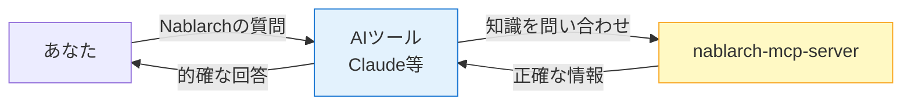

> **たとえ話**: AIを「新人社員」だと考えてください。賢いけれど、Nablarchという専門分野については知識がありません。nablarch-mcp-server は、その新人社員に**Nablarchの教科書を渡して読ませる仕組み**のようなものです。

### なぜ必要なの？

Nablarchは日本の大規模システム開発で使われるフレームワークですが、世界的には情報が少ないため、AIが正確な回答を返せないという問題があります。

| 項目 | Nablarch | Spring Boot（比較用） |
|------|:--------:|:--------------------:|
| GitHub Stars | 42 | 約76,000 |
| 技術記事数 | 約14件 | 数万件 |
| Stack Overflow | ほぼ0 | 大量 |

このサーバーを使えば、AIが**Nablarchの公式ドキュメント・ソースコード・ベストプラクティス**を参照できるようになり、正確なサポートが可能になります。

---

## 2. 前提知識の整理

アーキテクチャを理解するために、まず4つの重要な概念を押さえましょう。

### 2.1 MCPとは

#### そもそも「MCP」って何？

**MCP（Model Context Protocol）** とは、AIアプリケーションと外部システムを繋ぐための**標準的な通信規格（プロトコル）** のことです。

> 「MCPは**USB規格**のようなものです」
> USBがあれば、どんなメーカーのマウスでも、キーボードでも、パソコンに繋げますよね。MCPも同じで、この規格に対応していれば、どんなAIツールでも、どんな外部サービスでも繋がるのです。

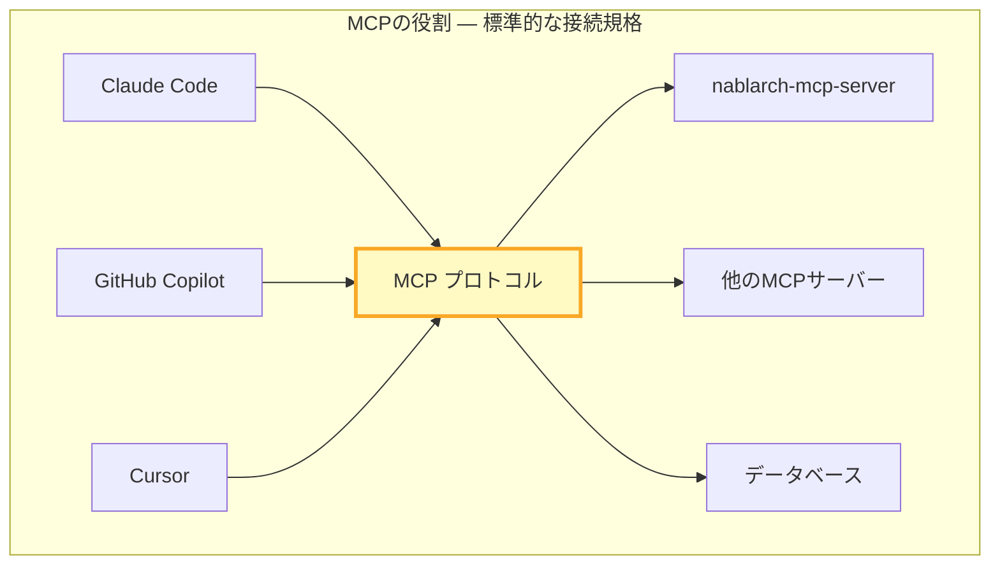

#### MCPの3つの機能（プリミティブ）

MCPは3種類の機能を提供します。

| 機能 | 誰が使う？ | 何をする？ | 例え |
|------|----------|----------|------|
| **Tools** | AI自身 | AIが呼び出せる「道具」 | 電卓、検索エンジン |
| **Resources** | アプリ | 読み取り専用の「資料」 | 図書館の本 |
| **Prompts** | ユーザー | 再利用可能な「テンプレート」 | 定型フォーマット |

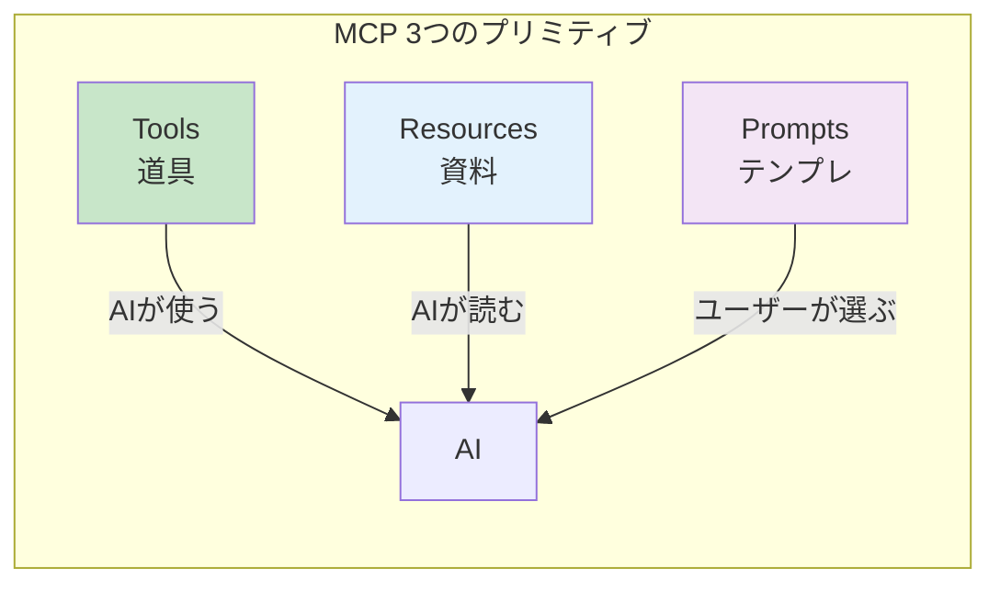

### 2.2 RAGとは

#### そもそも「RAG」って何？

**RAG（Retrieval-Augmented Generation）** とは、AIが回答を生成する前に、**外部の知識ベースから関連情報を検索して取得する技術**のことです。日本語では「検索拡張生成」と呼ばれます。

> 「RAGは**オープンブック試験**のようなものです」
> 通常のAIは暗記した知識だけで回答します（クローズドブック）。RAGを使うAIは、質問に答える前に教科書を参照できます（オープンブック）。だから、より正確で最新の回答ができるのです。

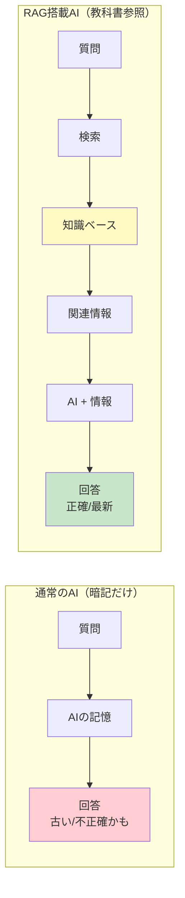

#### RAGの処理の流れ

1. **質問を受け取る** — ユーザーが質問を入力
2. **検索する** — 質問に関連する情報を知識ベースから検索
3. **情報を取得** — 見つかった関連ドキュメントを取得
4. **回答を生成** — 取得した情報をもとにAIが回答を作成

### 2.3 Embeddingとは

#### そもそも「Embedding」って何？

**Embedding（埋め込み）** とは、文章やコードを**数値のベクトル（数字の配列）に変換する技術**のことです。

> 「Embeddingは**文章の住所録**のようなものです」
> 似た意味の文章は、似た住所（近い数値）になります。「犬」と「ワンちゃん」は近い住所に、「犬」と「自動車」は遠い住所になります。

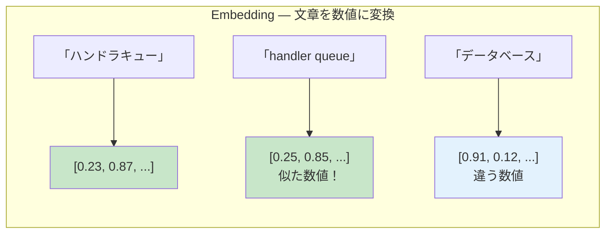

この技術により、**キーワードが完全一致しなくても、意味的に似た情報を検索できる**ようになります。これを「セマンティック検索（意味的検索）」と呼びます。

### 2.4 ベクトルDBとは

#### そもそも「ベクトルDB」って何？

**ベクトルDB（Vector Database）** とは、Embeddingで作った**数値ベクトルを効率的に保存・検索するためのデータベース**のことです。

> 「ベクトルDBは**座標付きの本棚**のようなものです」
> 普通の本棚は著者名順やタイトル順に並んでいますが、ベクトルDBは「意味的に近い本が近くに置かれる」本棚です。探したい本の近くを見れば、関連する本がすぐ見つかります。

```mermaid
graph TB
    subgraph "ベクトルDB — 意味で整理された本棚"
        Q[検索クエリ<br/>"ハンドラの設定方法"] --> V["ベクトル化<br/>[0.5, 0.8, ...]"]
        V --> Search[類似検索]
        Search --> DB[(ベクトルDB)]
        DB --> R1["ハンドラ構成ガイド<br/>距離: 0.12"]
        DB --> R2["Webハンドラ設定<br/>距離: 0.15"]
        DB --> R3["バッチハンドラ例<br/>距離: 0.18"]
    end

    style DB fill:#fff9c4
    style R1 fill:#c8e6c9
```

nablarch-mcp-serverでは、**PostgreSQL + pgvector** という組み合わせを使っています。PostgreSQLは一般的なデータベースですが、pgvectorという拡張を入れることでベクトル検索ができるようになります。

---

## 3. 全体像を図で理解する

### システム全体構成図

nablarch-mcp-server の全体像を1枚の図で見てみましょう。

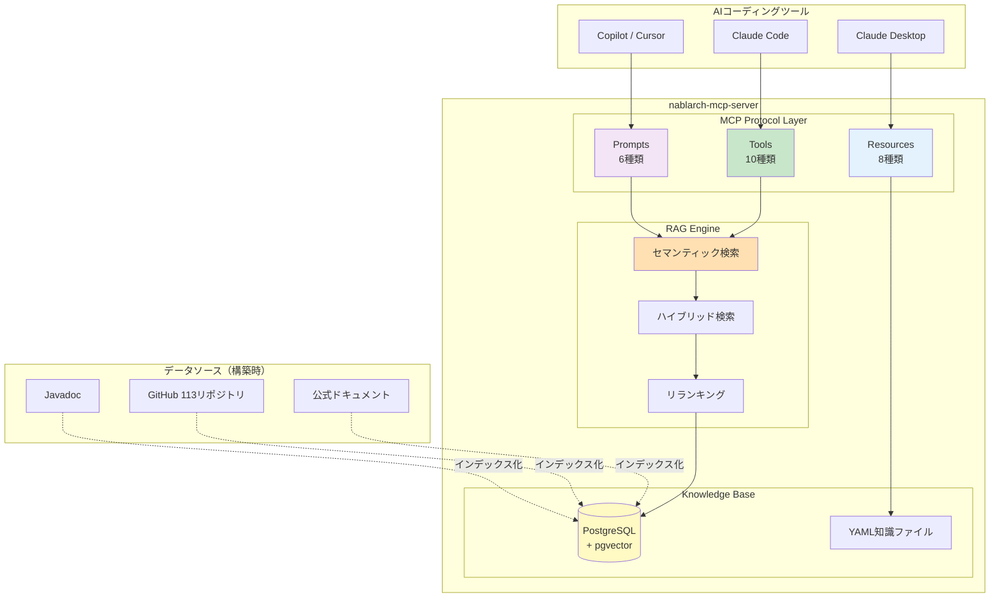

### 3層構造の説明

このシステムは**3つの層**で構成されています。

| 層 | 役割 | たとえ |
|----|------|--------|
| **MCP Protocol Layer** | AIとの接続窓口 | 銀行の窓口 |
| **RAG Engine** | 情報を賢く検索 | 窓口の後ろにいる専門スタッフ |
| **Knowledge Base** | 知識の保管庫 | 金庫室・書庫 |

> **たとえ話**: 銀行に行く場面を想像してください。
> - **窓口（MCP）** であなたは「○○について知りたい」と伝えます
> - **専門スタッフ（RAG）** が書庫に行って関連する書類を探してきます
> - **書庫（Knowledge Base）** には整理された情報が保管されています

---

## 4. 主要コンポーネントの役割

### 4.1 MCP Tools（10種類の道具）

AIが呼び出せる「道具」です。

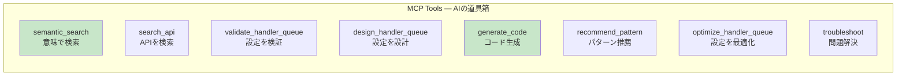

代表的なToolを詳しく見てみましょう。

| Tool名 | 何をする？ | 使用例 |
|--------|----------|--------|
| `semantic_search` | 意味で知識を検索 | 「トランザクション管理」で検索→関連ドキュメントを取得 |
| `validate_handler_queue` | ハンドラ設定の妥当性チェック | 設定XMLを渡す→問題点を指摘 |
| `generate_code` | Nablarch準拠コード生成 | 要件を伝える→アクションクラスを生成 |
| `troubleshoot` | エラー原因の特定と解決策提示 | エラーログを渡す→原因と対処法を回答 |

### 4.2 MCP Resources（8種類の資料）

AIが読める「資料」です。URIパターンでアクセスします。

| URI パターン | 内容 | 例 |
|-------------|------|-----|
| `nablarch://handler/{type}` | ハンドラの仕様書 | `nablarch://handler/web` |
| `nablarch://guide/{topic}` | 開発ガイド | `nablarch://guide/testing` |

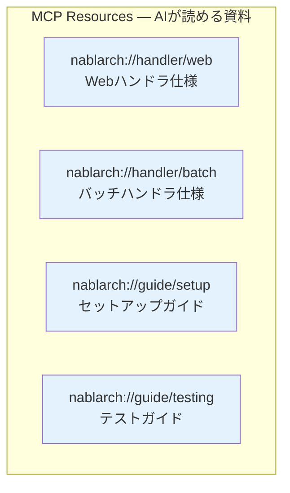

### 4.3 MCP Prompts（6種類のテンプレート）

よく使う作業手順をテンプレート化したものです。

| Prompt名 | 用途 |
|----------|------|
| `setup-handler-queue` | ハンドラキュー構成の設計支援 |
| `create-action` | アクションクラスの雛形生成 |
| `review-config` | XML設定ファイルのレビュー |
| `explain-handler` | ハンドラの詳細説明 |
| `migration-guide` | バージョン移行ガイド |
| `best-practices` | ベストプラクティス参照 |

### 4.4 RAG Engine（検索エンジン）

高精度な検索を実現する3つの仕組みがあります。

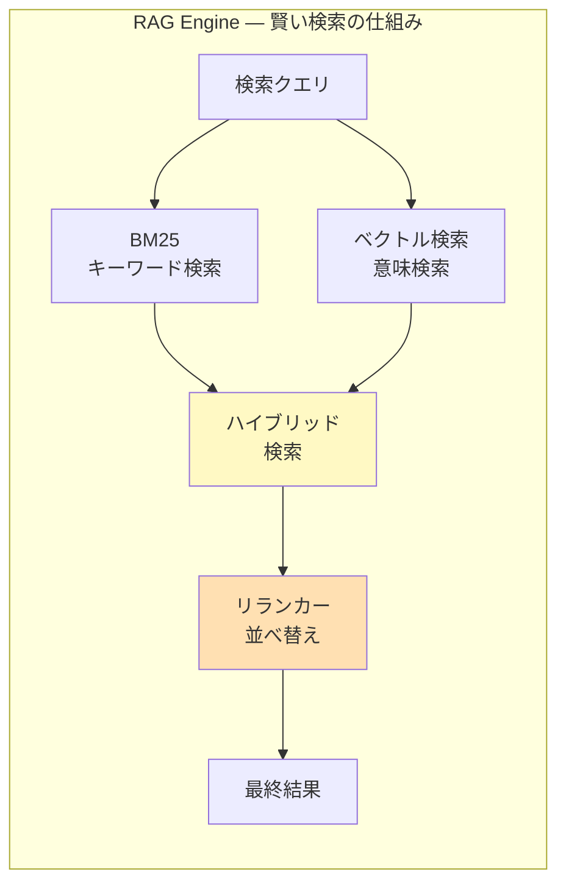

| 検索方式 | 特徴 | たとえ |
|---------|------|--------|
| **BM25** | キーワードの出現頻度で検索 | 辞書引き |
| **ベクトル検索** | 意味の近さで検索 | 連想ゲーム |
| **ハイブリッド** | 両方を組み合わせ | 辞書引き + 連想 |
| **リランキング** | 結果を最適な順に並べ替え | 司書のおすすめ順 |

> **なぜハイブリッド？**
> キーワード検索だけだと「handler」と「ハンドラ」は別物扱いになります。
> ベクトル検索だけだと、たまに関係ない結果が混じることがあります。
> 両方を組み合わせることで、**漏れが少なく、精度の高い検索**が実現できます。

---

## 5. データの流れ

### 5.1 質問から回答までの流れ

ユーザーが質問してから回答を得るまでの流れを追ってみましょう。

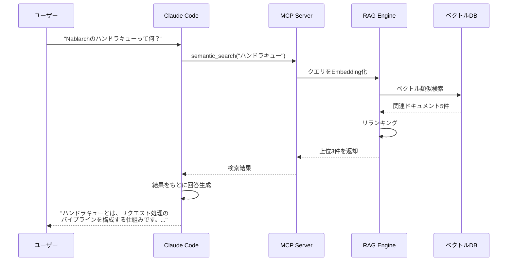

### 5.2 処理ステップの詳細

| ステップ | 処理内容 | 所要時間目安 |
|---------|---------|------------|
| 1. 質問受付 | ユーザーの質問をAIが受け取る | 即時 |
| 2. Tool呼び出し | AIがsemantic_searchを呼び出す | 即時 |
| 3. Embedding | 質問文を数値ベクトルに変換 | 数十ms |
| 4. 検索実行 | ベクトルDB + BM25で検索 | 数十〜数百ms |
| 5. リランキング | 検索結果を並べ替え | 数十ms |
| 6. 回答生成 | AIが情報をもとに回答を作成 | 数秒 |

### 5.3 知識ベース構築の流れ（事前処理）

RAG検索を行うためには、事前に知識をベクトルDBに登録しておく必要があります。

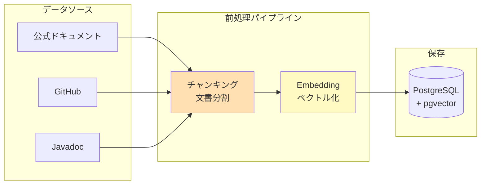

| 処理 | 説明 |
|------|------|
| **チャンキング** | 長い文書を検索しやすいサイズ（約500文字）に分割 |
| **Embedding** | 各チャンクを数値ベクトルに変換 |
| **保存** | ベクトルと元テキストをDBに保存 |

---

## 6. 技術スタック

### なぜこの技術を選んだか

各技術の選定理由を「なぜ？」の観点から説明します。

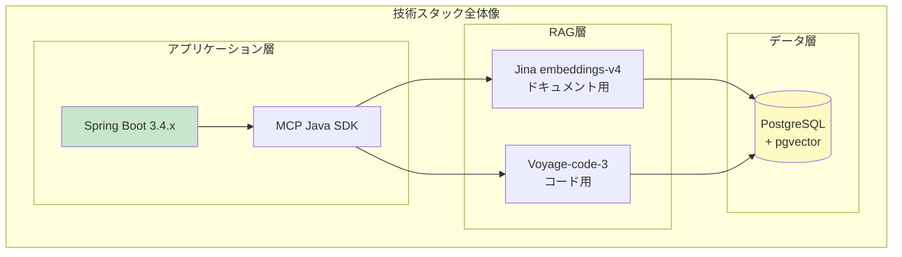

### 技術選定の理由

| 技術 | 選定理由 |
|------|---------|
| **Java 17+** | Nablarchと同じ言語で一貫性を保つ。MCP Java SDKの要件でもある |
| **Spring Boot 3.4.x** | MCP Boot Starterが使える。エコシステムが充実している |
| **PostgreSQL + pgvector** | Nablarch（RDBMS中心）との親和性が高い。追加のDBを用意しなくてよい |
| **Jina embeddings-v4** | 日本語を含む89言語に対応。オープンソースで無料 |
| **Voyage-code-3** | コード検索のベンチマークで最高水準。Java対応 |
| **ハイブリッド検索** | キーワードと意味の両方で検索でき、漏れが少ない |

### なぜ2種類のEmbeddingモデル？

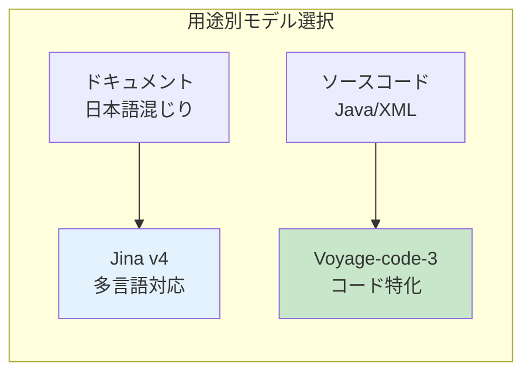

> **理由**: ドキュメントとコードでは「似ている」の基準が違います。
> - ドキュメント → 「意味が同じ」が重要（日本語↔英語の対応など）
> - コード → 「構文や動作が似ている」が重要（変数名は違っても同じパターン）
> そのため、それぞれに最適化されたモデルを使い分けています。

---

## 7. まとめ

### この記事で学んだこと

1. **nablarch-mcp-server とは**
   - AIコーディングツールにNablarchの専門知識を教えるサーバー
   - MCPという標準規格でAIと接続
   - RAGで高精度な検索を実現

2. **4つの前提知識**
   - **MCP** = AIと外部システムを繋ぐ標準規格（USB規格のようなもの）
   - **RAG** = AIが回答前に知識を検索する仕組み（オープンブック試験）
   - **Embedding** = 文章を数値に変換（住所録）
   - **ベクトルDB** = 意味で整理されたデータベース（座標付き本棚）

3. **3層構造**
   - MCP Protocol Layer（窓口）
   - RAG Engine（専門スタッフ）
   - Knowledge Base（書庫）

4. **技術選定の「なぜ」**
   - Javaを選んだのはNablarchとの一貫性
   - pgvectorを選んだのは追加DBが不要
   - 2種類のEmbeddingモデルは用途が違うから

### 次のステップ

- **実際に触ってみたい方** → [セットアップガイド](./07-setup-guide.md)
- **使い方を知りたい方** → [ユーザーガイド](./08-user-guide.md)
- **詳細な仕様を知りたい方** → [アーキテクチャ詳細](./02-architecture.md)

---

## 8. 用語集

| 用語 | 読み | 説明 |
|------|------|------|
| MCP | エムシーピー | Model Context Protocol。AIと外部システムを繋ぐ標準規格 |
| RAG | ラグ | Retrieval-Augmented Generation。検索で知識を補強してAIが回答する技術 |
| Embedding | エンベディング | 文章や画像を数値ベクトルに変換する技術 |
| ベクトルDB | — | Embeddingした数値を効率的に検索できるデータベース |
| pgvector | ピージーベクター | PostgreSQLにベクトル検索機能を追加する拡張 |
| セマンティック検索 | — | 意味の近さで検索する技術。キーワード一致不要 |
| ハイブリッド検索 | — | キーワード検索とベクトル検索を組み合わせた検索方式 |
| リランキング | — | 検索結果を最適な順序に並べ替える処理 |
| BM25 | ビーエムニジュウゴ | キーワードの出現頻度で関連度を計算する検索アルゴリズム |
| チャンキング | — | 長い文書を検索しやすいサイズに分割する処理 |
| Tool | ツール | MCPでAIが呼び出せる実行可能な機能 |
| Resource | リソース | MCPでAIが読み取れるデータソース |
| Prompt | プロンプト | MCPで再利用可能なテンプレート |
| ハンドラキュー | — | Nablarchのリクエスト処理パイプライン。処理の順序を定義 |
| FQCN | エフキューシーエヌ | Fully Qualified Class Name。完全修飾クラス名 |
| JSON-RPC | ジェイソンアールピーシー | JSONを使ったリモートプロシージャコール規格 |
| Spring Boot | スプリングブート | Javaの人気Webフレームワーク |
| STDIO | エスティーディーアイオー | 標準入出力。プログラム間通信の基本方式 |
| Streamable HTTP | — | MCPのリモート通信で使うHTTPベースのトランスポート |
| Jina embeddings | ジーナ | 多言語対応のオープンソースEmbeddingモデル |
| Voyage-code-3 | ボヤージュコードスリー | コード検索に特化したEmbeddingモデル |
| Cross-Encoder | クロスエンコーダー | 2つの文章の関連度を高精度に判定するモデル |
| Javadoc | ジャバドック | Javaのソースコードから生成されるAPI仕様書 |
| Nablarch | ナブラーク | TIS社が開発した日本のエンタープライズ向けJavaフレームワーク |

---

## 9. FAQ

### Q1: MCPとRAGは何が違うのですか？

**A:** 役割が違います。

| 技術 | 役割 | たとえ |
|------|------|--------|
| MCP | AIと外部システムを**繋ぐ**規格 | USB規格 |
| RAG | AIの回答を**知識で補強する**技術 | オープンブック試験 |

MCPは「どうやって繋ぐか」、RAGは「何を調べるか」を担当します。nablarch-mcp-serverでは、MCPで繋いで、RAGで検索しています。

---

### Q2: なぜSpring Bootを使うのですか？Nablarchで作れないの？

**A:** MCPのトランスポート層にNablarchを使う技術的必要性がないためです。

- Nablarchにはリアルタイム通信（SSE等）のネイティブサポートがない
- MCPサーバーの**中身（コンテンツ）としてNablarchの知識を提供すること**に価値がある
- フレームワーク自体を通信層に使う必要はない

---

### Q3: ベクトルDBは専用製品（Pinecone等）を使わないのですか？

**A:** PostgreSQL + pgvectorで十分な性能が得られるためです。

- Nablarchプロジェクトは元々RDBMSを使うことが多い
- 追加のDB製品を導入する運用コストを避けられる
- pgvectorは商用利用実績も豊富

---

### Q4: Embeddingモデルが2種類あるのはなぜですか？

**A:** ドキュメントとコードでは「似ている」の判断基準が異なるためです。

| 対象 | 「似ている」の意味 | 最適モデル |
|------|------------------|-----------|
| ドキュメント | 意味が同じ（日英対応含む） | Jina v4（多言語） |
| ソースコード | パターン・構文が同じ | Voyage-code-3（コード特化） |

---

### Q5: 検索精度を上げるために何をしていますか？

**A:** 3つの工夫をしています。

1. **ハイブリッド検索** — キーワード検索（BM25）とベクトル検索を併用
2. **リランキング** — Cross-Encoderで検索結果を並べ替え
3. **用途別モデル** — ドキュメント用・コード用で最適なEmbeddingを使い分け

---

### Q6: このサーバーを使うと、社内のコードがAIに送信されますか？

**A:** いいえ、送信されません。

nablarch-mcp-serverは**公開されているNablarchの情報のみ**を扱います。ユーザーの質問内容はAIに送信されますが、これはnablarch-mcp-serverを使わない場合と同じです。

---

> **フィードバック募集**
> この記事についてのご質問やご意見は、GitHubリポジトリのIssueまたはDiscussionsまでお願いします。
