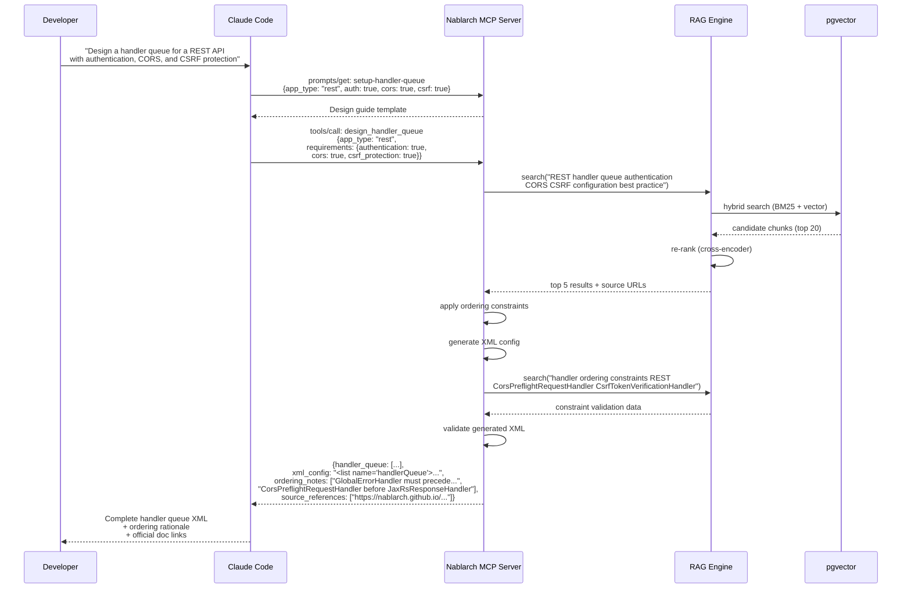
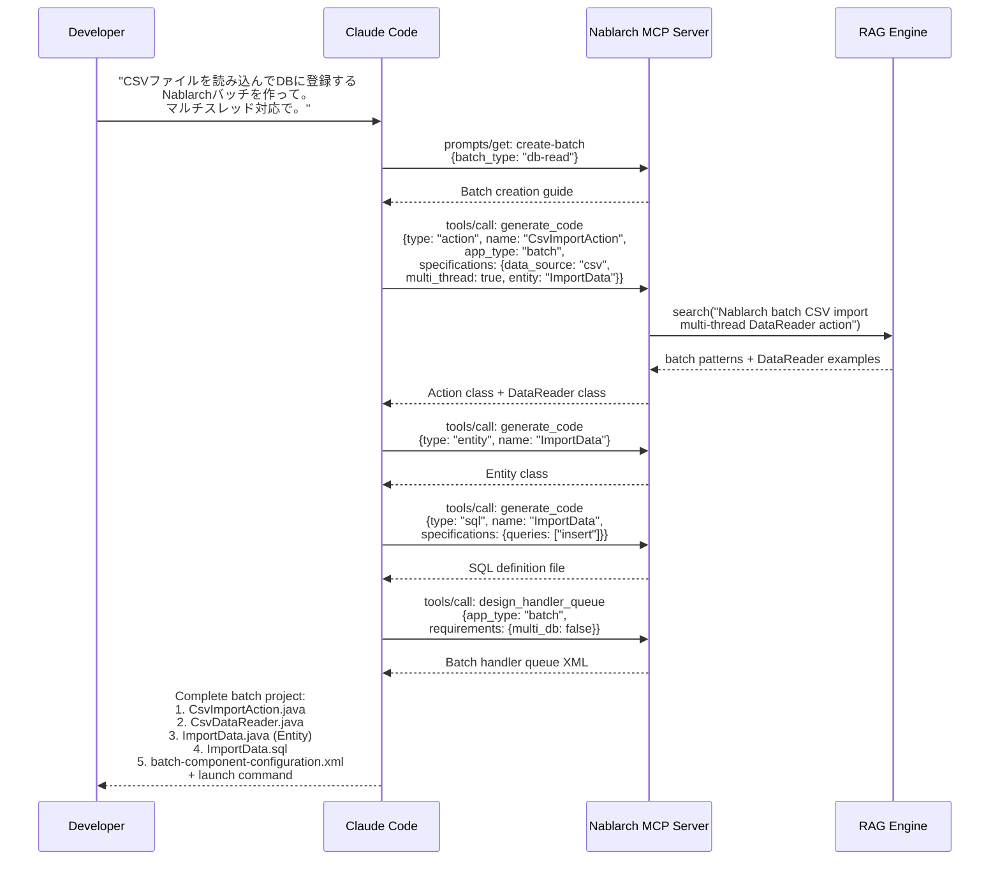
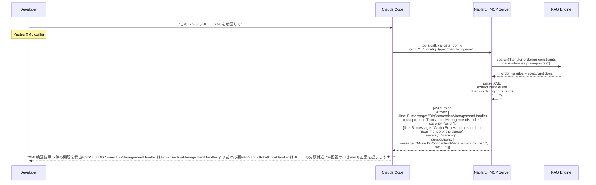
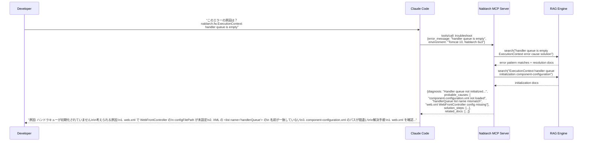
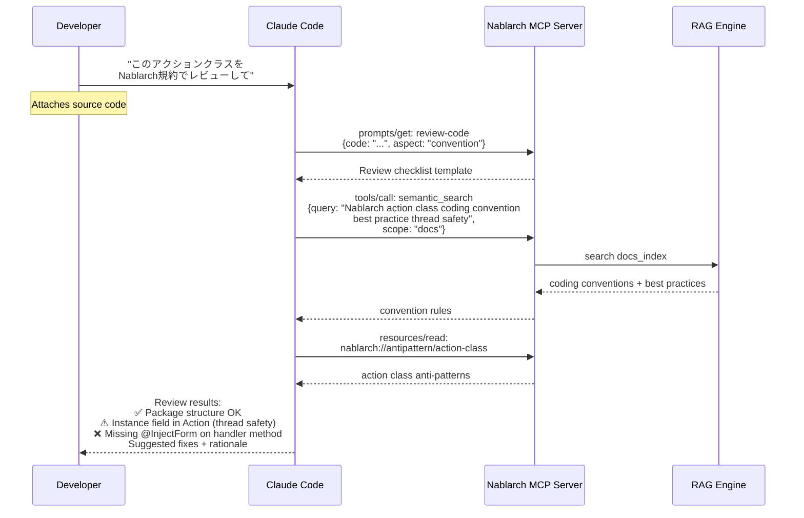
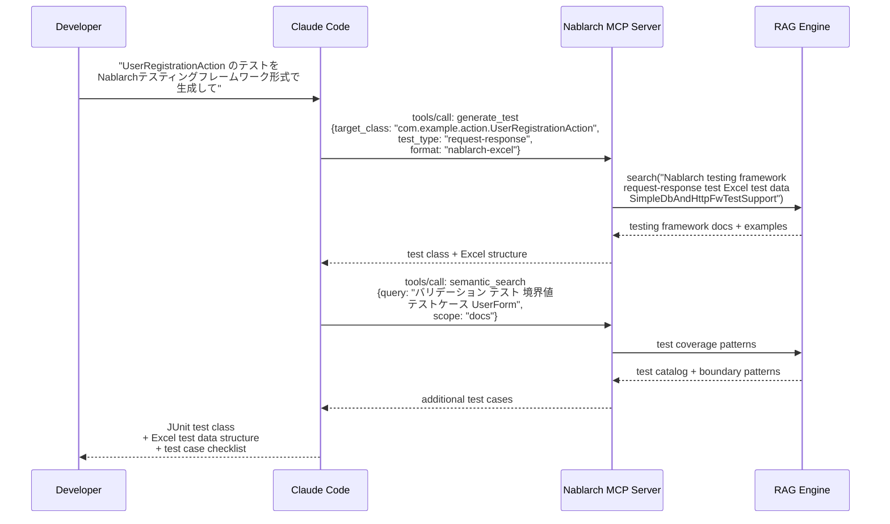
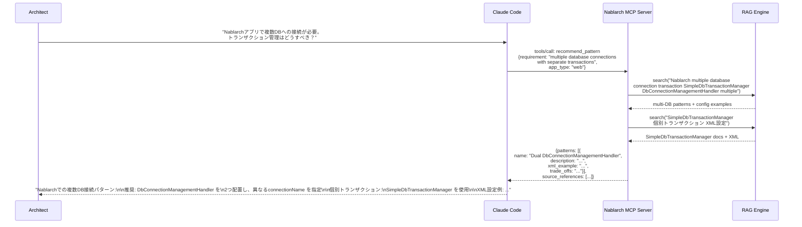
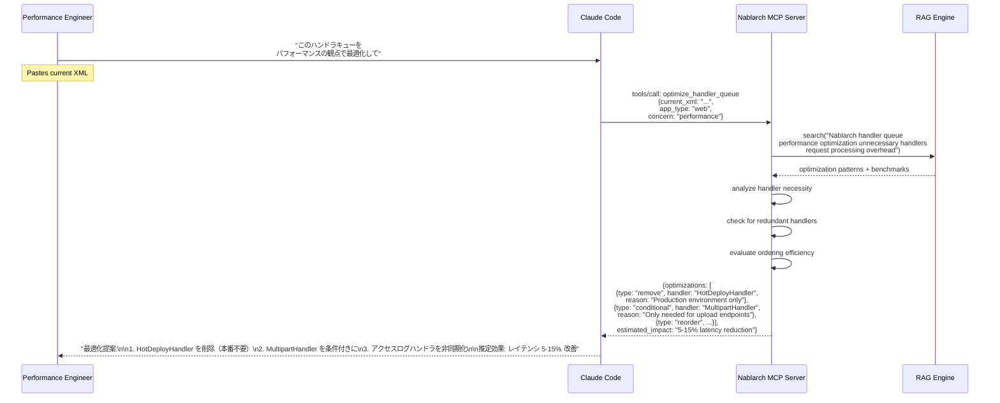
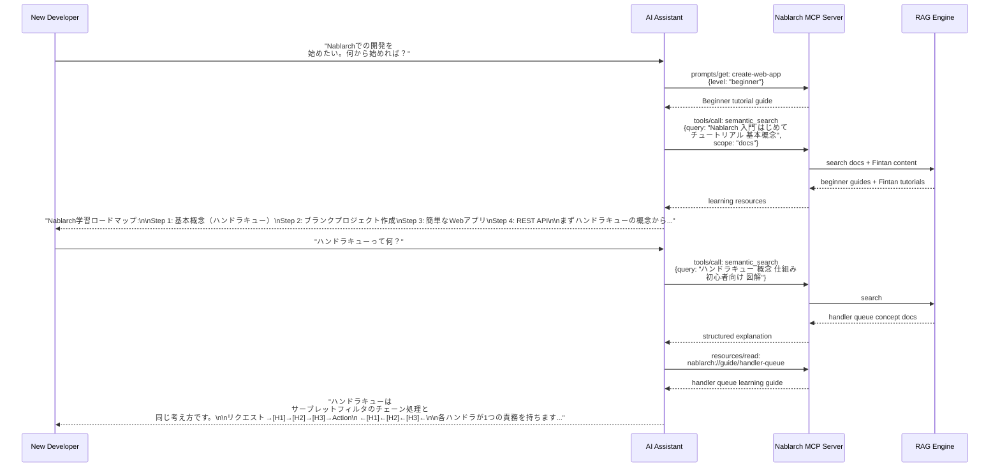
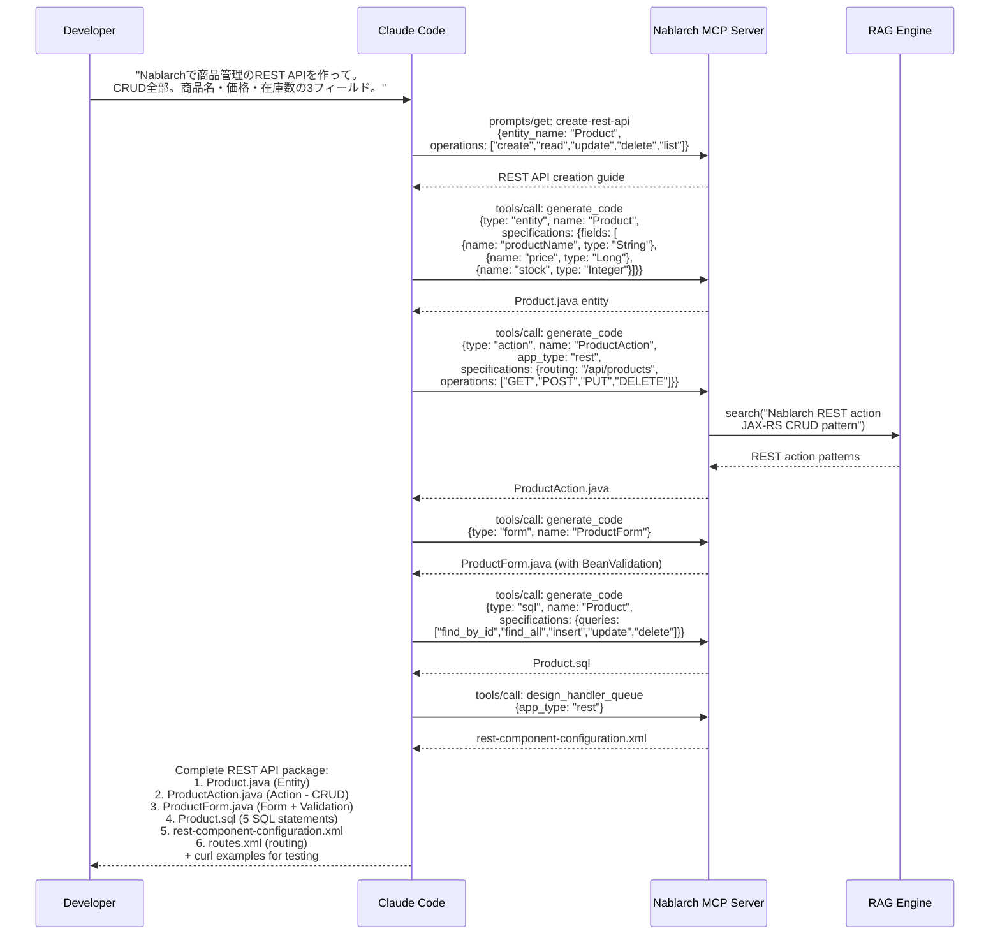

# Nablarch MCP Server — Use Cases

> **Version**: 1.0
> **Created**: 2026-02-02
> **Parent Task**: subtask_031 (cmd_017)
> **Related**: [Architecture Design](./architecture.md)

---

## Table of Contents

1. [Handler Queue Auto-Design](#use-case-1-handler-queue-auto-design)
2. [Nablarch API Search & Explanation](#use-case-2-nablarch-api-search--explanation)
3. [Batch Application Code Generation](#use-case-3-batch-application-code-generation)
4. [Configuration XML Generation & Validation](#use-case-4-configuration-xml-generation--validation)
5. [Troubleshooting Support](#use-case-5-troubleshooting-support)
6. [Code Review (Convention Compliance)](#use-case-6-code-review-convention-compliance)
7. [Test Code Generation (Excel Test Integration)](#use-case-7-test-code-generation-excel-test-integration)
8. [Design Pattern Recommendation](#use-case-8-design-pattern-recommendation)
9. [Nablarch Version Upgrade Support (5→6)](#use-case-9-nablarch-version-upgrade-support-56)
10. [Handler Queue Optimization](#use-case-10-handler-queue-optimization)
11. [Beginner Learning Support](#use-case-11-beginner-learning-support)
12. [REST API Scaffolding](#use-case-12-rest-api-scaffolding)

---

## Use Case 1: Handler Queue Auto-Design

### User Story

> **As a** Nablarch developer,
> **I want to** have an AI assistant design the handler queue for my application type and requirements,
> **So that** I get a correct, optimized handler queue XML without memorizing all handler ordering constraints.

### Why RAG + MCP Matters

Handler queue design is the most knowledge-intensive task in Nablarch development. There are 50+ standard handlers with complex ordering constraints. A wrong order causes silent failures. RAG provides the constraint knowledge; MCP provides the structured tool to apply it.

### Sequence Diagram



### Input Example

```
Developer prompt:

"NablarchでREST APIを作っている。認証（JWT）、CORS対応、CSRF対策が必要。
ハンドラキューの設計をお願い。"
```

### Output Example

```xml
<!-- Generated handler queue for REST API with auth + CORS + CSRF -->
<list name="handlerQueue">
  <component class="nablarch.fw.web.handler.HttpCharacterEncodingHandler"/>
  <component class="nablarch.common.handler.threadcontext.ThreadContextClearHandler"/>
  <component class="nablarch.fw.handler.GlobalErrorHandler"/>
  <component class="nablarch.fw.jaxrs.CorsPreflightRequestHandler">
    <property name="allowOrigins">
      <list><value>https://example.com</value></list>
    </property>
  </component>
  <component class="nablarch.fw.jaxrs.JaxRsResponseHandler"/>
  <component class="nablarch.fw.web.handler.MultipartHandler"/>
  <component class="nablarch.common.handler.threadcontext.ThreadContextHandler"/>
  <component class="nablarch.fw.jaxrs.JaxRsAccessLogHandler"/>
  <component class="nablarch.fw.web.handler.CsrfTokenVerificationHandler"/>
  <component class="nablarch.common.handler.DbConnectionManagementHandler"/>
  <component class="nablarch.common.handler.TransactionManagementHandler"/>
  <!-- Custom: JWT authentication handler -->
  <component class="com.example.handler.JwtAuthenticationHandler"/>
  <component-ref name="routesMapping"/>
</list>
```

**Ordering Notes**:
1. `GlobalErrorHandler` must be before `JaxRsResponseHandler` to catch all exceptions
2. `CorsPreflightRequestHandler` must be before `JaxRsResponseHandler` to handle OPTIONS requests
3. `CsrfTokenVerificationHandler` should be after session/context handlers
4. Custom JWT handler placed after DB/TX handlers for token validation with DB lookup

**Sources**: [REST Architecture](https://nablarch.github.io/docs/LATEST/doc/application_framework/application_framework/web_service/rest/architecture.html), [nablarch-example-rest](https://github.com/nablarch/nablarch-example-rest)

---

## Use Case 2: Nablarch API Search & Explanation

### User Story

> **As a** Nablarch developer,
> **I want to** search for Nablarch APIs by natural language description,
> **So that** I can quickly find the right class/method without browsing the entire Javadoc.

### Sequence Diagram

```mermaid
sequenceDiagram
    participant Dev as Developer
    participant AI as Claude Code
    participant MCP as Nablarch MCP Server
    participant RAG as RAG Engine

    Dev->>AI: "Nablarchでデータベースの<br/>楽観的ロックを実装するAPIは？"

    AI->>MCP: tools/call: search_api<br/>({query: "optimistic lock database"})
    MCP->>RAG: search("optimistic lock<br/>楽観的ロック UniversalDao version")
    RAG-->>MCP: UniversalDao docs + Entity annotation docs

    MCP-->>AI: {classes: [{<br/>  fqcn: "nablarch.common.dao.UniversalDao",<br/>  methods: [{name: "update", description: "...includes<br/>  optimistic lock check via @Version..."}],<br/>  javadoc_url: "https://..."}]}

    AI->>MCP: tools/call: semantic_search<br/>({query: "楽観的ロック @Version Entity",<br/> scope: "code"})
    MCP->>RAG: search code_index
    RAG-->>MCP: Entity sample code with @Version

    MCP-->>AI: code examples

    AI-->>Dev: "UniversalDao.update() で楽観的ロックが<br/>自動的に実行されます。<br/>Entityに @Version アノテーションを付与：<br/><br/>@Entity<br/>@Table(name = 'USERS')<br/>public class Users {<br/>  @Version<br/>  public Long version;<br/>}<br/><br/>Source: https://nablarch.github.io/..."
```

### Input Example

```
Developer prompt:

"NablarchのUniversalDaoで楽観的ロックを使いたい。どのAPIを使えばいい？"
```

### Output Example

```
## UniversalDao 楽観的ロック

`nablarch.common.dao.UniversalDao` の `update()` メソッドで自動的に楽観的ロックが
実行されます。

### 設定方法

Entity クラスに `@Version` アノテーションを付与:

```java
@Entity
@Table(name = "USERS")
public class Users {
    @Id
    @Column(name = "USER_ID")
    public Long userId;

    @Column(name = "USER_NAME")
    public String userName;

    @Version
    @Column(name = "VERSION")
    public Long version;
}
```

### 使用方法

```java
Users user = UniversalDao.findById(Users.class, userId);
user.userName = "新しい名前";
UniversalDao.update(user);  // versionが一致しない場合 OptimisticLockException
```

### FQCN
- `nablarch.common.dao.UniversalDao`
- `nablarch.common.dao.entity.annotation.Version` (jakarta.persistence.Version)

### Sources
- [UniversalDAO](https://nablarch.github.io/docs/LATEST/doc/application_framework/application_framework/libraries/database/universal_dao.html)
- [GitHub: nablarch-common-dao](https://github.com/nablarch/nablarch-common-dao)
```

---

## Use Case 3: Batch Application Code Generation

### User Story

> **As a** Nablarch developer,
> **I want to** generate a complete batch application skeleton (Action, Form, SQL, XML config),
> **So that** I can start implementing business logic immediately without boilerplate setup.

### Sequence Diagram



### Input Example

```
Developer prompt:

"月次のCSV取込バッチを作りたい。
- 入力: /data/monthly/users.csv
- 処理: CSVの各行をUSERSテーブルにINSERT
- マルチスレッド: 4スレッド
- エラー時: 該当行をスキップしてログに記録
Nablarchのバッチアプリとして生成して。"
```

### Output Example

```
## 生成されたファイル一覧

### 1. CsvImportAction.java
バッチアクションクラス（nablarch.fw.action.BatchAction を継承）

### 2. CsvDataReader.java
CSVファイル読込用 DataReader（nablarch.fw.DataReader を実装）

### 3. ImportData.java
Entity クラス（@Entity, @Table(name="USERS")）

### 4. ImportData.sql
SQL定義ファイル（INSERT_IMPORT_DATA）

### 5. batch-component-configuration.xml
ハンドラキュー構成:
  1. StatusCodeConvertHandler
  2. ThreadContextClearHandler
  3. GlobalErrorHandler
  4. ThreadContextHandler
  5. DbConnectionManagementHandler (main)
  6. TransactionManagementHandler (main)
  7. RequestPathJavaPackageMapping
  8. MultiThreadExecutionHandler (threadCount=4)
  9. DbConnectionManagementHandler (sub)
  10. LoopHandler
  11. DataReadHandler

### 起動コマンド
java -cp ... nablarch.fw.launcher.Main \
  -diConfig classpath:batch-component-configuration.xml \
  -requestPath com.example.batch.CsvImportAction/IMPORT \
  -userId batch_user
```

---

## Use Case 4: Configuration XML Generation & Validation

### User Story

> **As a** Nablarch developer,
> **I want to** validate my XML configuration files against Nablarch's constraints,
> **So that** I catch ordering errors and missing components before deployment.

### Sequence Diagram



### Input Example

```
Developer prompt:

"以下のXMLを検証して：
<list name="handlerQueue">
  <component class="nablarch.fw.web.handler.HttpCharacterEncodingHandler"/>
  <component class="nablarch.fw.web.handler.HttpResponseHandler"/>
  <component class="nablarch.fw.handler.GlobalErrorHandler"/>
  <component class="nablarch.common.handler.TransactionManagementHandler"/>
  <component class="nablarch.common.handler.DbConnectionManagementHandler"/>
  <component class="nablarch.fw.web.handler.SecureHandler"/>
</list>"
```

### Output Example

```
## 検証結果: 3件の問題を検出

### ❌ Error: ハンドラ順序違反 (L4-5)
`TransactionManagementHandler` が `DbConnectionManagementHandler` より前に配置されています。
トランザクション制御にはDB接続が必要なため、DB接続管理を先に配置する必要があります。

### ⚠️ Warning: GlobalErrorHandler の位置 (L3)
`GlobalErrorHandler` は `HttpResponseHandler` より前に配置すべきです。
HttpResponseHandler で発生した例外をキャッチするためです。

### ⚠️ Warning: SecureHandler の位置 (L6)
`SecureHandler` は `HttpResponseHandler` の直後に配置するのが推奨です。
セキュリティヘッダの確実な付与のためです。

### 修正後のXML
<list name="handlerQueue">
  <component class="nablarch.fw.web.handler.HttpCharacterEncodingHandler"/>
  <component class="nablarch.fw.handler.GlobalErrorHandler"/>
  <component class="nablarch.fw.web.handler.HttpResponseHandler"/>
  <component class="nablarch.fw.web.handler.SecureHandler"/>
  <component class="nablarch.common.handler.DbConnectionManagementHandler"/>
  <component class="nablarch.common.handler.TransactionManagementHandler"/>
</list>

Source: https://nablarch.github.io/.../handlers/index.html
```

---

## Use Case 5: Troubleshooting Support

### User Story

> **As a** Nablarch developer,
> **I want to** paste an error message and get a diagnosis with solution steps,
> **So that** I can resolve Nablarch-specific issues without deep framework knowledge.

### Sequence Diagram



### Input Example

```
Developer prompt:

"Tomcat起動時にこのエラーが出る：

java.lang.IllegalStateException: handler queue is empty
  at nablarch.fw.ExecutionContext.handleNext(ExecutionContext.java:xx)
  at nablarch.fw.web.servlet.WebFrontController.doFilter(WebFrontController.java:xx)

Nablarch 6u3, Tomcat 10, Java 17"
```

### Output Example

```
## 診断結果

### エラー: handler queue is empty

ハンドラキューが空の状態でリクエスト処理が開始されています。
Nablarchの初期化でハンドラキューがロードされていない可能性が高いです。

### 考えられる原因（確率順）

1. **web.xml の configFilePath 設定不備** (最も多い)
   WebFrontController の init-param で XML パスが正しく指定されていない

2. **XMLの<list name="handlerQueue">が見つからない**
   コンポーネント定義XMLでハンドラキューのリスト名が一致していない

3. **import先のXMLパスの間違い**
   <import file="..."/> のパス指定ミス

### 解決手順

Step 1: web.xml を確認
  <filter>
    <filter-name>webFrontController</filter-name>
    <filter-class>nablarch.fw.web.servlet.WebFrontController</filter-class>
    <init-param>
      <param-name>configFilePath</param-name>
      <param-value>classpath:web-component-configuration.xml</param-value>
    </init-param>
  </filter>

Step 2: XMLファイルの存在確認
  src/main/resources/web-component-configuration.xml が存在するか

Step 3: ハンドラキューのリスト名確認
  <component name="webFrontController"
             class="nablarch.fw.web.servlet.WebFrontController">
    <property name="handlerQueue" ref="handlerQueue"/>
  </component>
  <list name="handlerQueue">  ← この名前が一致しているか
    ...
  </list>

### 参考
- https://nablarch.github.io/.../web/architecture.html
- https://github.com/nablarch/nablarch-example-web/blob/master/src/main/webapp/WEB-INF/web.xml
```

---

## Use Case 6: Code Review (Convention Compliance)

### User Story

> **As a** tech lead on a Nablarch project,
> **I want to** have AI review code against Nablarch coding conventions and best practices,
> **So that** I catch convention violations and anti-patterns during development.

### Sequence Diagram



### Input Example

```
Developer prompt:

"このコードをレビューして：
public class UserRegistrationAction {
    private String cachedValue;  // ← instance field

    public HttpResponse register(HttpRequest req, ExecutionContext ctx) {
        UserForm form = BeanUtil.createAndCopy(UserForm.class, req.getParamMap());
        cachedValue = form.getName();
        UniversalDao.insert(form);
        return new HttpResponse("/success.jsp");
    }
}"
```

### Output Example

```
## Nablarch Code Review Results

### ❌ Critical: スレッドセーフティ違反 (L2)
`private String cachedValue` — Nablarchのアクションクラスはシングルトンスコープで
管理されるため、インスタンスフィールドを持つとスレッドセーフティが保証されません。

修正案: ローカル変数に変更するか、ExecutionContext に格納してください。

### ⚠️ Warning: @InjectForm 未使用 (L4)
`BeanUtil.createAndCopy` を直接使用しています。Nablarch標準では `@InjectForm`
インターセプタを使用してバリデーション + フォーム変換を一括で行います。

修正案:
  @InjectForm(form = UserForm.class, prefix = "form")
  @OnError(type = ApplicationException.class, path = "/error.jsp")
  public HttpResponse register(HttpRequest req, ExecutionContext ctx) {
      UserForm form = ctx.getRequestScopedVar("form");
      ...
  }

### ⚠️ Warning: バリデーション未実装
入力値のバリデーションが行われていません。@InjectForm + Bean Validation アノテーション
の使用を推奨します。

### ✅ OK: パッケージ構造
### ✅ OK: HttpResponse の使用方法
### ✅ OK: UniversalDao の使用方法

Sources:
- Nablarch Policy: https://nablarch.github.io/.../nablarch/policy.html
- InjectForm: https://nablarch.github.io/.../web/feature_details/nablarch_tag.html
```

---

## Use Case 7: Test Code Generation (Excel Test Integration)

### User Story

> **As a** Nablarch developer,
> **I want to** generate test code including Excel test data files for Nablarch's testing framework,
> **So that** I can quickly set up comprehensive test suites following the Nablarch testing pattern.

### Sequence Diagram



### Input Example

```
Developer prompt:

"UserRegistrationAction のリクエスト単体テストを作って。
テストケース: 正常系、バリデーションエラー、DB重複エラー。
Nablarchのテスティングフレームワーク（Excel形式）で。"
```

### Output Example

```
## Generated Test Files

### 1. UserRegistrationActionTest.java

```java
public class UserRegistrationActionTest
    extends SimpleDbAndHttpFwTestSupport {

    @Test
    public void 正常にユーザーが登録されること() {
        execute("register", new BasicHttpResponse(302));
    }

    @Test
    public void バリデーションエラーの場合エラー画面に遷移すること() {
        execute("registerValidationError", new BasicHttpResponse(200));
    }

    @Test
    public void DB重複エラーの場合エラーメッセージが表示されること() {
        execute("registerDuplicateError", new BasicHttpResponse(200));
    }
}
```

### 2. Excel Test Data Structure

| Sheet | Description |
|-------|------------|
| `register` | 正常系: name="テスト太郎", email="test@example.com" |
| `registerValidationError` | 異常系: name="" (必須バリデーション) |
| `registerDuplicateError` | DB重複: 既存ユーザーと同じemail |
| `testShots` | リクエスト定義 (URI, method, params) |
| `expectedStatus` | 期待するHTTPステータスコード |
| `expectedMessages` | 期待するメッセージ |
| `setupTable=USERS` | テスト前データ投入 |
| `expectedTable=USERS` | テスト後データ検証 |

Source: [Nablarch Testing Framework](https://nablarch.github.io/docs/LATEST/doc/development_tools/testing_framework/)
```

---

## Use Case 8: Design Pattern Recommendation

### User Story

> **As a** Nablarch architect,
> **I want to** get design pattern recommendations specific to Nablarch for a given requirement,
> **So that** I make decisions aligned with the framework's philosophy and proven patterns.

### Sequence Diagram



### Input Example

```
Architect prompt:

"業務DBとログDBの2つのDBに接続するWebアプリを設計中。
業務DBはトランザクション管理が必要だが、ログDBは個別トランザクションでいい。
Nablarchでの推奨パターンは？"
```

### Output Example

```
## 推奨パターン: Dual DB Connection with SimpleDbTransactionManager

### パターン概要
ハンドラキューに DbConnectionManagementHandler を2つ配置し、
connectionName プロパティで接続先を分離する。
ログDBへの書き込みは SimpleDbTransactionManager で個別トランザクション管理。

### XML設定例

<!-- 業務DB（ハンドラキュー管理） -->
<component class="nablarch.common.handler.DbConnectionManagementHandler">
  <property name="connectionFactory" ref="businessDbConnectionFactory"/>
  <property name="connectionName" value="business"/>
</component>
<component class="nablarch.common.handler.TransactionManagementHandler">
  <property name="dbTransactionManager" ref="businessTxManager"/>
  <property name="transactionName" value="business"/>
</component>

<!-- ログDB（個別トランザクション） -->
<component name="logDbTransaction"
           class="nablarch.core.db.transaction.SimpleDbTransactionManager">
  <property name="dbTransactionName" value="logDb"/>
</component>

### アクションクラスでの使用

```java
public HttpResponse execute(HttpRequest req, ExecutionContext ctx) {
    // 業務DBは通常通り（ハンドラキューで管理）
    UniversalDao.insert(businessEntity);

    // ログDBは個別トランザクション
    SimpleDbTransactionManager logTx = SystemRepository.get("logDbTransaction");
    new SimpleDbTransactionExecutor<Void>(logTx) {
        @Override
        public Void execute(AppDbConnection conn) {
            conn.prepareStatement("INSERT_LOG").executeUpdate();
            return null;
        }
    }.doTransaction();
}
```

### トレードオフ
- ✅ 業務DBのロールバックがログDBに影響しない
- ✅ ログDB障害が業務処理をブロックしない（try-catch推奨）
- ⚠️ 接続プールが2つ必要（リソース消費増）

Sources:
- [DB接続・トランザクション管理](https://nablarch.github.io/.../database_management.html)
- [SimpleDbTransactionManager Javadoc](https://nablarch.github.io/.../javadoc/...)
```

---

## Use Case 9: Nablarch Version Upgrade Support (5→6)

### User Story

> **As a** Nablarch developer maintaining a legacy system,
> **I want to** get automated analysis of migration impact when upgrading from Nablarch 5 to 6,
> **So that** I can plan the migration with accurate effort estimates and automated fixes.

### Sequence Diagram

```mermaid
sequenceDiagram
    participant Dev as Developer
    participant AI as Claude Code
    participant MCP as Nablarch MCP Server
    participant RAG as RAG Engine

    Dev->>AI: "このNablarch 5プロジェクトを<br/>Nablarch 6に移行したい"
    Note over Dev: Shares pom.xml + sample code

    AI->>MCP: resources/read:<br/>nablarch://guide/migration-5to6
    MCP-->>AI: Migration guide

    AI->>MCP: tools/call: analyze_migration<br/>{source_version: "5", target_version: "6",<br/> code_snippet: "import javax.servlet.*;\n..."}

    MCP->>RAG: search("Nablarch 5 to 6 migration<br/>javax jakarta namespace deprecated API<br/>breaking changes")
    RAG-->>MCP: migration docs + change list

    MCP-->>AI: {changes: [<br/> {type: "namespace", from: "javax.servlet",<br/>  to: "jakarta.servlet", auto_fixable: true},<br/> {type: "api_removal", class: "...",<br/>  replacement: "...", auto_fixable: false}],<br/> effort_summary: {...}}

    AI-->>Dev: "移行分析結果:\n\n自動修正可能:\n- javax→jakarta 名前空間変更: 47箇所\n- pom.xml 依存関係更新: 12行\n\n手動修正必要:\n- 削除API対応: 3箇所\n- テスト修正: 12箇所\n\n各変更の修正案を提示..."
```

### Input Example

```
Developer prompt:

"以下のコードをNablarch 6に移行する際の影響を分析して：

import javax.servlet.http.HttpServletRequest;
import nablarch.fw.web.HttpRequest;

public class LegacyAction extends DbAccessSupport {
    public HttpResponse doAction(HttpRequest req, ExecutionContext ctx) {
        SqlResultSet result = search("SELECT_USERS",
            new SqlRow().put("userId", req.getParam("id")));
        ...
    }
}"
```

### Output Example

```
## Nablarch 5→6 移行分析結果

### 変更カテゴリ別サマリ

| カテゴリ | 影響箇所 | 自動修正 |
|---------|---------|---------|
| javax→jakarta名前空間 | 1箇所 | ✓ 自動 |
| 非推奨API (DbAccessSupport) | 1箇所 | △ 半自動 |
| SQL API変更 | 1箇所 | △ 半自動 |

### 詳細

#### 1. javax→jakarta (自動修正可能)
`import javax.servlet.http.HttpServletRequest`
→ `import jakarta.servlet.http.HttpServletRequest`

#### 2. DbAccessSupport 非推奨 (手動修正)
`DbAccessSupport` は Nablarch 6 で非推奨です。
`UniversalDao` への移行を推奨します。

Before:
  SqlResultSet result = search("SELECT_USERS", ...);

After:
  List<Users> result = UniversalDao.findAllBySqlFile(
      Users.class, "SELECT_USERS",
      new Object[]{req.getParam("id")});

#### 3. pom.xml 更新
nablarch-bom のバージョンを 6u3 に更新
javax.servlet-api → jakarta.servlet-api

Source: [Migration Guide](https://nablarch.github.io/.../migration/)
```

---

## Use Case 10: Handler Queue Optimization

### User Story

> **As a** Nablarch performance engineer,
> **I want to** analyze my existing handler queue for optimization opportunities,
> **So that** I can improve request processing performance without breaking functionality.

### Sequence Diagram



### Input Example

```
Developer prompt:

"本番環境のWebアプリで、以下のハンドラキューのパフォーマンスを改善したい：
[19個のハンドラが入ったXML]"
```

### Output Example

```
## ハンドラキュー最適化分析

### 検出された最適化ポイント

#### 🔴 削除推奨: HotDeployHandler
本番環境では不要です。開発環境専用ハンドラです。
影響: リクエストあたり約2-5msの短縮

#### 🟡 条件付き適用: MultipartHandler
ファイルアップロードを受け付けないエンドポイントにも適用されています。
RequestHandlerEntry で特定パスのみに限定することを推奨。

#### 🟡 非同期化: HttpAccessLogHandler
アクセスログ出力を非同期化することでレスポンスタイムを改善できます。
log.properties で async=true を設定。

#### ✅ 順序最適化
現在の順序は概ね適切です。軽量なハンドラが先頭にあり、
重いDB/TX系ハンドラが後方に配置されています。

### 推定効果
- HotDeployHandler 削除: 2-5ms/request
- MultipartHandler 条件化: 1-3ms/request (非アップロード時)
- アクセスログ非同期化: 3-10ms/request
- 合計: 6-18ms/request (5-15% 改善見込み)
```

---

## Use Case 11: Beginner Learning Support

### User Story

> **As a** new Nablarch developer,
> **I want to** get a personalized learning path with step-by-step guidance,
> **So that** I can learn the framework efficiently without getting overwhelmed by the documentation.

### Sequence Diagram



### Input Example

```
New developer prompt:

"Java歴3年ですがNablarchは初めてです。Spring Bootの経験はあります。
Nablarchでの開発の始め方を教えてください。"
```

### Output Example

```
## Nablarch学習ロードマップ（Spring Boot経験者向け）

### Spring Boot との対応関係

| Spring Boot | Nablarch |
|------------|----------|
| @Controller | Action クラス |
| @RequestMapping | RoutesMapping (XML/アノテーション) |
| Filter chain | ハンドラキュー |
| @Autowired | SystemRepository.get() + XML DI |
| application.yml | component-configuration.xml |
| JPA/Hibernate | UniversalDao |

### 学習ステップ

**Step 1: 概念理解** (30分)
→ ハンドラキューアーキテクチャ（Spring の Filter Chain に対応）
→ SystemRepository（Spring の ApplicationContext に対応）

**Step 2: プロジェクト作成** (15分)
→ Maven Archetype でブランクプロジェクト生成
  mvn archetype:generate -DarchetypeGroupId=com.nablarch.archetype ...

**Step 3: Hello World Web アプリ** (1時間)
→ Action + JSP + XML設定

**Step 4: REST API** (1時間)
→ JAX-RS スタイルの API 作成

**Step 5: DB連携** (1時間)
→ UniversalDao + Entity + SQL定義ファイル

Sources:
- [Nablarch公式入門](https://nablarch.github.io/docs/LATEST/doc/)
- [Fintan 研修コンテンツ](https://fintan.jp/)
```

---

## Use Case 12: REST API Scaffolding

### User Story

> **As a** Nablarch developer,
> **I want to** generate a complete REST API endpoint (Action + Form + Entity + SQL + Config + Test),
> **So that** I can focus on business logic instead of framework boilerplate.

### Sequence Diagram



### Input Example

```
Developer prompt:

"商品管理REST APIをNablarchで作って。
- GET /api/products — 一覧
- GET /api/products/{id} — 詳細
- POST /api/products — 登録
- PUT /api/products/{id} — 更新
- DELETE /api/products/{id} — 削除
フィールド: productName(String, 必須, 100文字以内), price(Long, 必須, 1以上), stock(Integer, 0以上)"
```

### Output Example

```
## 生成ファイル一覧（6ファイル）

### 1. Product.java — Entity
@Entity @Table(name="PRODUCTS")
- productId (Long, @Id, @GeneratedValue)
- productName (String)
- price (Long)
- stock (Integer)
- version (Long, @Version — 楽観的ロック)

### 2. ProductAction.java — REST Action
@Produces(MediaType.APPLICATION_JSON)
- GET /api/products → findAll()
- GET /api/products/{id} → findById()
- POST /api/products → create() + @Valid
- PUT /api/products/{id} → update() + @Valid
- DELETE /api/products/{id} → delete()

### 3. ProductForm.java — Form Bean
- @NotNull @Size(max=100) productName
- @NotNull @Min(1) price
- @Min(0) stock

### 4. Product.sql — SQL Definitions
- FIND_ALL: SELECT * FROM PRODUCTS ORDER BY PRODUCT_ID
- FIND_BY_ID: SELECT * FROM PRODUCTS WHERE PRODUCT_ID = :productId
- (INSERT/UPDATE/DELETE は UniversalDao が自動生成)

### 5. routes.xml — Routing
/api/products → ProductAction

### 6. curl テスト例
# 登録
curl -X POST http://localhost:8080/api/products \
  -H "Content-Type: application/json" \
  -d '{"productName":"テスト商品","price":1000,"stock":50}'

# 一覧
curl http://localhost:8080/api/products

# 詳細
curl http://localhost:8080/api/products/1
```

---

## Summary: RAG/MCP Contribution Matrix

| Use Case | RAG Contribution | MCP Contribution | Combined Effect |
|----------|:----------------:|:----------------:|:---------------:|
| 1. Handler Queue Design | Knowledge: ordering constraints, patterns | Tool: XML generation + validation | Very High |
| 2. API Search | Semantic search across Javadoc | Structured API response | High |
| 3. Batch Code Generation | Coding conventions, patterns | Tool: code generation | Very High |
| 4. XML Validation | Constraint knowledge | Tool: validation engine | Very High |
| 5. Troubleshooting | Error pattern matching, past cases | Prompt: diagnostic guide | High |
| 6. Code Review | Convention rules, anti-patterns | Prompt: review template | Very High |
| 7. Test Generation | Testing FW specs, test catalog | Tool: test code generation | Very High |
| 8. Pattern Recommendation | Design patterns, best practices | Structured recommendation | High |
| 9. Migration Support | Change list, deprecated APIs | Tool: impact analysis | High |
| 10. Queue Optimization | Performance patterns | Tool: analysis engine | High |
| 11. Learning Support | Progressive doc retrieval | Prompt: learning guides, Resource: guides | High |
| 12. REST Scaffolding | REST patterns, conventions | Tool: multi-file generation | Very High |

---

## References

- [Architecture Design](./architecture.md)
- [O-023 RAG-MCP Analysis](../../output/O-023_nablarch_rag_mcp_analysis.md)
- [Nablarch Official Documentation](https://nablarch.github.io/)
